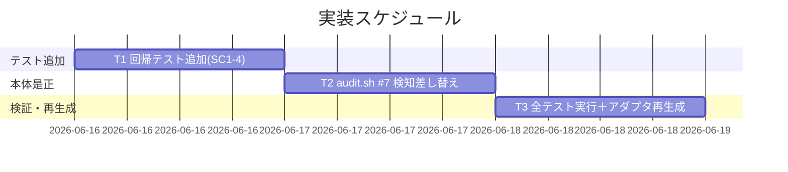
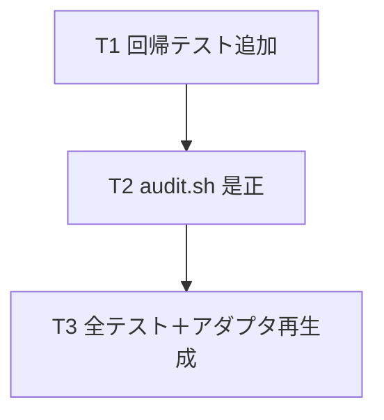

# 実装計画書: audit.sh 残骸・マーカ系チェックの散文誤検知（偽陽性）是正

**プロジェクト名**: audit.sh 残骸・マーカ系チェックの散文誤検知（偽陽性）是正
**作成日**: 2026 年 06 月 16 日
**最終更新**: 2026 年 06 月 16 日

> **重要**: **このドキュメントは常に更新**: 実装計画の変更、進捗状況の更新、バグの記録などがあった場合は、即座にこのドキュメントを更新してください。
> **必須項目**: テスト観点・BDD 仕様は具体ケースを 1 件以上記載すること。
>
> **用語**: [.agents/CONCEPTS.md §用語規約](../../../../../.agents/CONCEPTS.md#用語規約) を参照。

---

## 1. 実装概要

### 1.1 実装方針

[02_設計](./02_設計.md) の採用案（**(a) フェンスドコードブロック除去 → (b) インラインコードスパン除去 → (c) 実マーカ構文アンカー検知**の三段＝正規化 2 段＋判定 1 段。02 §3.1.2 採用行・§2.3）に従い、`.agents/enforcement/ci/audit.sh` の #7 セクション（296-317 行）の検知ロジック 1 箇所のみを差し替える。**フェンスドコードブロック除去段は SC4b（フェンス内例示の PASS）達成の要であり省略しない。** 偽陰性ゼロを最優先し、**未閉フェンスのフォールバック保険（02 §5.1）を組み込む**。既存ガード・他チェック・I/F は不変とする。先に回帰テストを test/test-audit.sh に追加してから本体を改変する（テストファースト）。

### 1.2 実装順序



- **T1**: test/test-audit.sh に SC1-4 の回帰ケースを追加（実装前は実マーカ=PASS の誤りで FAIL することを確認＝テストが意味を持つ状態）。
- **T2**: audit.sh #7 の `grep -qE 'TODO|FIXME'` を三段判別（フェンス除去→インライン除去→アンカー判定。未閉フェンス保険込み）に差し替える。
- **T3**: test/test-audit.sh 全 PASS を確認、本 issue 00/01/02/03 自身が #7 を FAIL させないことを確認、build/setup でアダプタ再生成。

---

## 2. タスク分解

**必須**: 各タスクに「テスト観点」（2.x.3）と「単体テスト仕様（BDD）」（2.x.4）を記載する。観点定義は [02_設計 §6](./02_設計.md) および [RULES のテスト戦略・TEST_BDD_FORMAT](../../../../../.agents/RULES.md#テスト戦略必須要件) を参照。

### 2.1 タスク 1: 回帰テストの追加（test/test-audit.sh）

#### 2.1.1 概要

#7 の偽陽性是正に対する回帰ケース（SC1=言及 PASS／SC2=実マーカ FAIL／SC4=本 issue 散文型 PASS／SC3=全 PASS）を test/test-audit.sh に追加し、tmp 隔離で実行する。

#### 2.1.2 実装内容

- `make_min_tree` で作る tmp ツリー（`.agents` 必須ファイル＋`.workflow`）に `*.md` を置いて #7 を検証するヘルパを追加（既存パターンに合わせる）。
- ケース追加（mktemp -d 隔離・本リポ本番ファイルは読み取りのみ。[.agents-project/自己拡張ワークフロー.md §テストの tmp 隔離]）:
  - **C-SC1**: 言及のみ（`TODO/FIXME 残骸チェック`・`残骸タグ（TODO 等）0件`）→ `Audit passed.`／FAIL 行なし。
  - **C-SC2a..e**: 実マーカ各形（コードブロック外・バッククォート外の散文/箇条書きとして記述）: `// TODO: x`（プロセ行）／`<!-- FIXME: y -->`／`- TODO: z`（箇条書き）／`TODO(owner): w`／全角 `TODO：v` → それぞれ #7 が FAIL（`重要パスに TODO/FIXME が残存`）。
  - **C-SC4a**: バッククォート例示 `` `TODO:` `` `` `FIXME:` `` ＋日本語散文（本 issue 00/01 と同型）→ FAIL しない。
  - **C-SC4b**: フェンスドコードブロック（gherkin/bash）内に例示マーカ `// TODO: fix`・`TODO(owner):` 等を含む `.md`（本 issue 02/03 と同型）→ FAIL しない（フェンス除去段で除去される）。**これが当初案④で漏れて SC4 違反となった形態**。
  - **C-guard**: templates 配下・`/close/` 配下に実マーカを置いても #7 は FAIL しない（既存ガード重畳の確認）。
  - **C-edge（未閉フェンス・偽陰性ゼロ／02 §5.1・観点6）**: 未閉フェンス（フェンス行が奇数個）の直後に散文の実マーカ `// TODO: after unclosed fence` を置いた `.md` → #7 が FAIL する（フォールバック保険の退行検知）。**フォールバック保険が無いと PASS（偽陰性）に退行することを併せて確認**できると望ましい。
- 既存シナリオ（T1〜T4b）は変更しない。`PASS`/`FAIL` カウンタ・`ok`/`ng` ヘルパを流用する。

#### 2.1.3 テスト観点

**参照**: 観点定義は [02_設計 §6](./02_設計.md)・RULES・TEST_BDD_FORMAT。以下は本タスクの具体ケース。

##### 単体（必須 1 件以上）

- 言及のみ `.md` を含む tmp ツリーで `bash audit.sh <tmp>` が exit 0 かつ `重要パスに TODO/FIXME が残存` を出力しない（C-SC1）。
- 実マーカ `// TODO: x` を含む tmp ツリーで #7 が FAIL し当該行を出力する（C-SC2a）。
- バッククォート例示型 `.md`（C-SC4）が exit 0 になる。

##### 結合/API

- 該当なし（CLI スクリプトの自己テスト。外部 API なし）。

##### E2E/受け入れ

- 本 issue 00/01/02/03 自身を含む `docs/maintainer/workflow/...` を走査する実 CI（pre-push / CI）で #7 が FAIL しないこと（T3 で本リポ実走査により確認。SC4 の E2E 代替）。

##### バリデーション

- 全角コロン `TODO：` は環境（ロケール）により検知が揺れうるが、ASCII コロン形は必ず検知される（偽陰性ゼロの安全側）。全角形のテストは「FAIL すれば望ましい」期待として記述し、環境差で揺れる場合は SKIP 扱いにする（02 §5）。

#### 2.1.4 単体テスト仕様（BDD）

**BDD 形式（高レベル仕様）**:

```gherkin
Feature: #7 残骸・マーカ系チェックの偽陽性是正（回帰テスト）
  Scenario: 言及のみの散文は PASS（SC1）
    Given tmp 隔離ツリーの .workflow 配下 .md に「TODO/FIXME 残骸チェック」「残骸タグ（TODO 等）0件」のみが含まれる
      And 実マーカ（コロン/カッコ・アンカー形）は含まれない
    When bash audit.sh <tmp> を実行する
    Then 終了コードが 0 で「重要パスに TODO/FIXME が残存」を出力しない

  Scenario: 実マーカは従来どおり FAIL（SC2・偽陰性ゼロ）
    Given tmp 隔離ツリーの .workflow 配下 .md に "// TODO: fix" が含まれる
    When bash audit.sh <tmp> を実行する
    Then #7 が「重要パスに TODO/FIXME が残存」で FAIL し当該ファイルを列挙する

  Scenario: バッククォート例示は PASS（SC4a・00/01 自己言及型）
    Given tmp 隔離ツリーの .md に `TODO:` `FIXME:` がバッククォート例示として日本語散文中に含まれる
    When bash audit.sh <tmp> を実行する
    Then #7 は FAIL しない

  Scenario: フェンスドコードブロック内の例示は PASS（SC4b・02/03 自己言及型）
    Given tmp 隔離ツリーの .md に、gherkin/bash のフェンスドコードブロックがあり
      And そのブロック内に例示マーカ "// TODO: fix" や "TODO(owner):" が含まれる
      And コードブロック外の散文には実マーカ構文が無い
    When bash audit.sh <tmp> を実行する
    Then #7 は FAIL しない（フェンス除去段で例示が除去される）

  Scenario: 既存ガード重畳（templates / close 除外不変）
    Given templates 配下 または /close/ 配下の .md に "// TODO: x" が含まれる
    When bash audit.sh <tmp> を実行する
    Then #7 は当該パスを検知しない（除外維持）

  Scenario: 未閉フェンス直後の実マーカは FAIL（SC2・偽陰性ゼロ／02 §5.1）
    Given tmp 隔離ツリーの .md にフェンス行が奇数個（未閉フェンス）あり
      And 最後の開きフェンス以降の散文に実マーカ "// TODO: after unclosed fence" が含まれる
    When bash audit.sh <tmp> を実行する
    Then #7 が「重要パスに TODO/FIXME が残存」で FAIL する（フォールバック保険で抑制されない）
```

**テストコード例（bash・Given/When/Then をインラインコメントで明記）**:

```bash
# Given: 言及のみ（実マーカ無し）を含む tmp 隔離ツリー（SC1）
T_TREE="$(make_min_tree)"
mkdir -p "$T_TREE/.workflow/20260101_000000_x"
printf '本 issue では「TODO/FIXME 残骸チェック」の偽陽性を是正する。\nレビュー証跡: 残骸タグ（TODO 等）0件を確認した。\n' \
  > "$T_TREE/.workflow/20260101_000000_x/00_要求定義.md"
# When: audit.sh を実行する
OUT="$(bash "$AUDIT" "$T_TREE" 2>&1)"; RC=$?
# Then: exit 0 かつ #7 の FAIL 行が出ない
if [[ $RC -eq 0 ]] && ! grep -q '重要パスに TODO/FIXME が残存' <<< "$OUT"; then ok "SC1 言及のみ PASS"; else ng "SC1: $OUT"; fi

# Given: 実マーカを含む tmp ツリー（SC2・偽陰性ゼロ）
T_TREE2="$(make_min_tree)"
mkdir -p "$T_TREE2/.workflow/20260101_000000_y"
printf '<!-- TODO: fix this later -->\n' > "$T_TREE2/.workflow/20260101_000000_y/00_要求定義.md"
# When: audit.sh を実行する
OUT2="$(bash "$AUDIT" "$T_TREE2" 2>&1)"
# Then: #7 が FAIL する
if grep -q '重要パスに TODO/FIXME が残存' <<< "$OUT2"; then ok "SC2 実マーカ FAIL 維持"; else ng "SC2: $OUT2"; fi
```

#### 2.1.5 依存関係

- 先行: なし（T1 が起点。実装前 = 実マーカ検出は素パターンでも FAIL するため C-SC2 は当初から PASS。C-SC1/C-SC4a/C-SC4b は実装前は素パターンが語の部分一致で拾うため FAIL し、T2 後に PASS へ転じる＝テストの妥当性が担保される）。



#### 2.1.6 見積もり

- **工数**: 約 1〜2 時間
- **優先度**: 高

### 2.2 タスク 2: audit.sh #7 検知ロジックの差し替え

#### 2.2.1 概要

audit.sh:304 の `if grep -qE 'TODO|FIXME' "$f" …` を、02_設計の三段判別（フェンスドコードブロック除去 → インラインコードスパン除去 → 実マーカ構文アンカー）に差し替える。フェンス除去段（未閉フェンスのフォールバック保険込み・02 §5.1）を必ず含める。他は不変。

#### 2.2.2 実装内容

- 検知行を **三段パイプライン（(a) awk フェンス除去 → (b) sed インライン除去 → (c) アンカー grep）**に差し替える（最終形は実装時に確定するが、下記骨格を満たすこと。意図コメントを必ず添える・[CODE_COMMENT_RULES] 準拠で外部参照を書かない）。

- **(a) awk フェンスドコードブロック除去段（最小骨格・A-3／未閉フォールバック込み）**: フェンス行を `^[[:space:]]*(```|~~~)`（行頭空白許容・バッククォート 3 連／チルダ 3 連・` ```gherkin ` 等の情報文字列付きも先頭一致で判定）でトグルする。フェンス内行は**その場で捨てずバッファ**し、閉じフェンスで破棄する。**EOF 時に `infence` が立っていれば（＝未閉フェンス）バッファ行を出力にフォールバック**する（02 §5.1・偽陰性ゼロ）。GNU 固有機能を使わない POSIX awk に限定する。

  ```bash
  # フェンスドコードブロック除去（未閉フェンスは行を握り潰さずフォールバック出力）
  awk '
    /^[[:space:]]*(```|~~~)/ {
      if (infence) { infence=0; delete buf; n=0 }   # 閉じフェンス: バッファ破棄
      else         { infence=1; n=0 }                # 開きフェンス
      next
    }
    { if (infence) buf[++n]=$0; else print }         # フェンス内はバッファ、外はそのまま出力
    END { if (infence) for (i=1;i<=n;i++) print buf[i] }  # 未閉なら抑制行を救済
  ' "$f" 2>/dev/null
  ```

- **(b)(c) 全体パイプライン**: 上記 awk 出力を `sed -E 's/`[^`]*`//g'`（インラインコードスパン除去）に通し、`LC_ALL=C grep -qE '(TODO|FIXME)[[:space:]]*[:：(]'` で判定する。全体例:

  ```bash
  if awk '…(上記フェンス除去)…' "$f" 2>/dev/null \
       | sed -E 's/`[^`]*`//g' 2>/dev/null \
       | LC_ALL=C grep -qE '(TODO|FIXME)[[:space:]]*[:：(]'; then
    # … 実マーカ残存 → 既存 FAIL 出力様式（audit.sh:306-309）…
  fi
  ```

  - **全角コロンの `LC_ALL=C` は採用に確定**（#26 の前例・audit.sh:697-699 と一貫）。実測（mktemp -d 隔離）で全角 `TODO：` は `LC_ALL=C` 有無いずれでも検知され、ASCII コロン検知も `LC_ALL=C` 有無で不変のため偽陰性は生じない（02 §5）。
  - `set -e` 下でも no-match で異常終了しないよう、条件式中での評価（`if … ; then`）と各段の `2>/dev/null` を維持する。パイプライン終了コードは末尾 `grep` のものを使い、`pipefail` を #7 局所で有効化しない（02 §3.1.7）。
- templates 除外（audit.sh:301）・`/close/` 除外（audit.sh:303）・find 収集（audit.sh:311）・FAIL 出力様式（audit.sh:306-309, 313-316）は**変更しない**。
- #7 以外のセクションには触れない。

#### 2.2.3 テスト観点

**参照**: [02_設計 §6](./02_設計.md)・RULES・TEST_BDD_FORMAT。

##### 単体（必須 1 件以上）

- T1 で追加した C-SC1〜C-SC4・C-guard が全て期待どおりになる（実装後）。
- 実マーカ各形（散文のコードコメント・HTML コメント・箇条書き・所有者付き）が FAIL する（C-SC2a..e）。フェンスドブロック内の例示は PASS する（C-SC4b）。

##### 結合/API

- 該当なし。

##### E2E/受け入れ

- 本リポ実走査（`docs/maintainer/workflow/...` 含む）で #7 が本 issue 散文起因の FAIL を出さない（T3）。

##### バリデーション

- 使用構文が ERE のみ（`grep -P`・`\b`・`\w` を含まない）ことを静的に確認（grep でパターン使用箇所を検査、または目視レビュー）。

#### 2.2.4 単体テスト仕様（BDD）

```gherkin
Feature: #7 検知ロジック差し替え後の判別
  Scenario: 是正後の #7 が言及/例示を除外し実マーカのみ FAIL
    Given 是正後の audit.sh
      And tmp ツリーに言及のみの .md と 実マーカ入りの .md が別々に存在する
    When それぞれに対し audit.sh を実行する
    Then 言及のみは PASS、実マーカ入りは #7 で FAIL する
```

```bash
# Given: 是正後 audit.sh と、所有者付き実マーカを含む tmp ツリー
T="$(make_min_tree)"; mkdir -p "$T/.workflow/20260101_000000_z"
printf 'TODO(alice): refactor\n' > "$T/.workflow/20260101_000000_z/03_実装計画.md"
# When: audit.sh を実行
O="$(bash "$AUDIT" "$T" 2>&1)"
# Then: #7 が FAIL する（偽陰性ゼロ）
grep -q '重要パスに TODO/FIXME が残存' <<< "$O" && ok "TODO(owner): 検知維持" || ng "$O"
```

#### 2.2.5 依存関係

- 先行: T1（回帰テスト）。

#### 2.2.6 見積もり

- **工数**: 約 1 時間
- **優先度**: 高

### 2.3 タスク 3: 全テスト実行・本リポ実走査確認・アダプタ再生成

#### 2.3.1 概要

test/test-audit.sh 全 PASS（SC3）、本 issue 自身が #7 を FAIL させないこと（SC4）を確認し、build/setup でアダプタ生成物を再生成して整合させる。

#### 2.3.2 実装内容

- `bash test/test-audit.sh` を実行し全 PASS（既存 T1〜T4b ＋ 追加ケース）を確認。
- 本リポ実走査（`bash .agents/enforcement/ci/audit.sh .` 相当、または該当 issue ディレクトリ走査）で #7 が本 issue 00/01/02/03 散文起因の FAIL を出さないことを確認。
- なお `memo/` 配下も #7 の走査対象だが、memo 起因の #7 FAIL（散文中のインラインバッククォート不均衡で実マーカ語が残るケース等）は **memo 執筆側のバッククォート均衡化で対処**し、**是正ロジック（三段正規化＋未閉フェンス保険）は変更しない**。memo は過渡的スクラッチで本 issue の SC（SC1-4 は 00/01/02/03 が対象）には含まれない。
- 正本 `.agents/enforcement/ci/audit.sh` のみ編集済みであることを確認し、`.adapters/`・`.claude/` を build/setup の正規フロー（[.agents/SETUP.md]）で再生成（手編集しない・[02 §7]）。

#### 2.3.3 テスト観点

##### 単体／結合/API／E2E/受け入れ／バリデーション

- 単体: 該当なし（T1/T2 で網羅）。
- E2E/受け入れ: `test/test-audit.sh` 全 PASS（SC3）。本リポ実走査で SC4 充足。
- バリデーション: アダプタ生成物が正本と一致（差分なし）であること。

#### 2.3.4 単体テスト仕様（BDD）

```gherkin
Feature: 非干渉と自己言及解消の確認
  Scenario: 既存テスト全 PASS かつ本 issue 散文が PASS
    Given 是正後の audit.sh と test/test-audit.sh
    When bash test/test-audit.sh を実行する
      And 本リポを実走査する
    Then 全テストが PASS し、本 issue 00/01/02/03 起因の #7 FAIL が出ない
```

```bash
# Given: 是正後の audit.sh と既存テスト
# When: 既存自己テストを実行
# Then: 終了コード 0（全 PASS）
bash test/test-audit.sh; [[ $? -eq 0 ]] && echo "SC3 全 PASS" || echo "SC3 NG"
```

#### 2.3.5 依存関係

- 先行: T2。

#### 2.3.6 見積もり

- **工数**: 約 30 分〜1 時間
- **優先度**: 高

---

## テスト観点

本是正のテスト観点は #7 検知ロジックの「偽陽性除去（SC1/SC4）」と「偽陰性ゼロ＝実マーカ FAIL 維持（SC2）」、および「既存テスト全 PASS の非干渉（SC3）」の 3 軸。各タスク §2.x.3 に具体ケースを記載。01 の BDD（シナリオ1=言及 PASS・シナリオ2=実マーカ FAIL・UC2=非干渉）と SC1/SC4・SC2・SC3 が対応する。

---

## 単体テスト

test/test-audit.sh に SC1-4 の回帰ケースを追加する（§2.1）。tmp 隔離（mktemp -d）で実行し本リポ本番ファイルを破壊しない。BDD 形式（`# Given:` `# When:` `# Then:`）をテスト本文に記載（[TEST_BDD_FORMAT.md]・既存テストの様式に合わせる）。

---

## BDD

- SC1（言及のみ PASS）= §2.1.4 シナリオ1。
- SC2（実マーカ FAIL・偽陰性ゼロ）= §2.1.4 シナリオ2・§2.2.4。
- SC3（全テスト PASS・非干渉）= §2.3.4・§2.1.4 シナリオ4（既存ガード重畳）。
- SC4（本 issue 散文 PASS）= §2.1.4 シナリオ3。
- Given/When/Then は [TEST_BDD_FORMAT.md](../../../../../.agents/TEST_BDD_FORMAT.md) に従う。

---

## 3. 実装スケジュール

### 3.1 マイルストーン

| マイルストーン | 期日 | 成果物 |
| -------------- | ---- | ------ |
| 回帰テスト追加 | T1 | test/test-audit.sh（追加ケース） |
| #7 是正 | T2 | .agents/enforcement/ci/audit.sh |
| 検証・再生成 | T3 | 全テスト PASS・アダプタ再生成 |

### 3.2 実装フェーズ

#### フェーズ 1: テスト→是正→検証

- **タスク**: T1 → T2 → T3。

---

## 4. テスト計画

テスト観点・BDD 形式の定義は [02_設計 §6](./02_設計.md) および RULES・TEST_BDD_FORMAT を参照。各タスク §2.x.3 に具体ケースを記載。

### 4.1 テストの優先順位

- **最重要**: SC2（実マーカ FAIL 維持・偽陰性ゼロ）。実マーカの主要形態を網羅する。
- 影響範囲（既存 test-audit.sh）は回帰に必ず含める（SC3）。

---

## 5. リスク管理

### 5.1 実装リスク

- **リスク**: フェンスドブロック／バッククォート除去で「コードブロック内・バッククォート内に書かれた**実**マーカ」を見逃す（理論的偽陰性）。
  - **対策**: 実例（本 issue・既存 issue）では実マーカはコメント/箇条書き形（コードブロック外・バッククォート外）が支配的。コードブロック内のマーカは「コード例・テスト fixture としての例示」が支配的であり、これを除外することが本是正の目的（SC1/SC4）に合致する。検知力低下はこの 1 形態に限定し、偽陽性除去の便益が上回ると判断。レビューで実マーカの実例分布を再確認する。
- **リスク（偽陰性ゼロ抵触）**: 未閉フェンス（フェンス行が奇数個）の素朴トグル実装で、最後の開きフェンス以降の実マーカを抑制し見逃す（偽陰性）。
  - **対策（必須）**: フェンス除去 awk に**未閉フェンスのフォールバック保険**（EOF 時 `infence` ならバッファ行を出力）を組み込む（02 §5.1・§2.2.2 骨格）。回帰ケース C-edge で退行検知する。mktemp -d 隔離の実測で、保険無しは PASS（偽陰性）／保険ありは FAIL（検知）となることを確認済み。
- **リスク**: 全角コロンのロケール依存で検知が揺れる。
  - **対策**: ASCII コロン形は `LC_ALL=C` 有無で不変＝主形の偽陰性ゼロを担保。全角形は `LC_ALL=C` 採用で安定化（02 §5・#26 前例）。全角形テストは環境差で SKIP 可とする。
- **リスク**: 正本とアダプタ生成物の二重管理で不整合。
  - **対策**: 正本のみ編集し build/setup で再生成（02 §7・00 §7.1）。

---

## 6. 参考資料

### プロジェクトドキュメント

- [`02_設計.md`](./02_設計.md) - 設計
- [`01_要件定義.md`](./01_要件定義.md) - 要件定義
- [`.agents/enforcement/ci/audit.sh`](../../../../../.agents/enforcement/ci/audit.sh) - 是正対象（#7 は 296-317 行）
- [`test/test-audit.sh`](../../../../../test/test-audit.sh) - 回帰テストの追加先
- [`.agents/TEST_BDD_FORMAT.md`](../../../../../.agents/TEST_BDD_FORMAT.md) - BDD 形式の正本

### その他の参考資料

- 親 issue「コア取り込み漏れ補完」（S1〜S5 の verify-and-close 監査での偽陽性観測）

---

## 7. 前のステップ

この実装計画書は、以下のドキュメントを基に作成されています：

- **前**: [`02_設計.md`](./02_設計.md) - 設計フェーズ

---

## 8. 次のステップ

この実装計画書の承認後、以下のステップに進みます：

- **プロジェクトが 1 つの issue である場合**: 実装フェーズ（execution）に直接進む（本 issue は単一 issue・サブ分割なし）。

**用語**: [.agents/CONCEPTS.md §用語規約](../../../../../.agents/CONCEPTS.md#用語規約) を参照。
