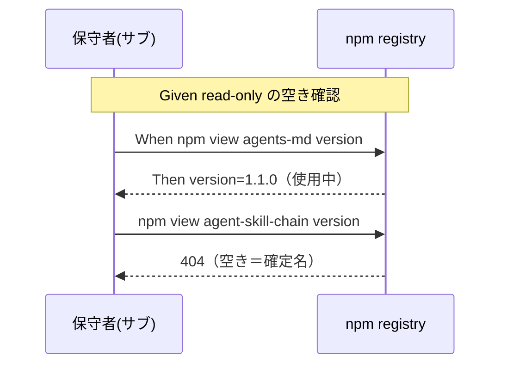
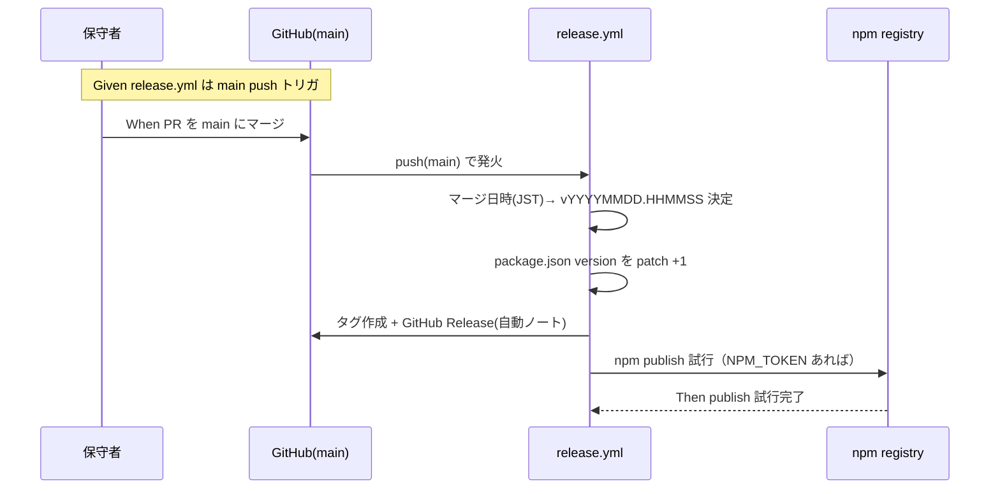

# 要件定義書: npm 公開整備（パッケージ改名 agent-skill-chain ＋ main マージ時の自動リリース機構）

**プロジェクト名**: npm 公開整備（パッケージ改名 agent-skill-chain ＋ main マージ時の自動リリース機構）
**作成日**: 2026 年 06 月 16 日
**最終更新**: 2026 年 06 月 16 日

> **重要**: **このドキュメントは常に更新**: 要件の変更や追加があった場合は、即座にこのドキュメントを更新してください。ドキュメントは「生きているドキュメント」として扱い、実装内容と常に同期させます。
>
> **用語**: [.agents/CONCEPTS.md §用語規約](../../../../../.agents/CONCEPTS.md#用語規約) を参照。

---

## 1. 概要

### 1.1 システム概要

本 issue は **(A) パッケージ改名** と **(B) main マージ時の自動リリース機構整備** を統合した「npm 公開整備」である（ディレクトリ名は据え置き）。

**(A) 改名**: npm パッケージ `@techbeansjp-free/agents-md`（スコープ付き・未公開）を、**unscoped（スコープ無し）の確定公開名 `agent-skill-chain`**（`npm view agent-skill-chain version` → 404 で空き確認済み）へ変更し、その名前で `npm publish` 可能な状態に整備する。npm はリネーム不可だが unscoped 名なら**所有権移管で名前を保てる**ため、将来 `techbeansjp` 組織へ個人 → 組織で移管する前提に適合する。

**(B) 自動リリース**: main ブランチへの push（PR マージ）をトリガに、CI が `package.json` の version を **semver patch +1** し、マージ日時の **`vYYYYMMDD.HHMMSS`（JST）タグ** と **GitHub Release（自動生成リリースノート付き）** を作成し、**npm publish（unscoped public `agent-skill-chain`）** を試行する機構を `.github/workflows/release.yml` に整備する（**バージョニング案C**）。npm の version は semver 厳守のため日時は**タグのみ**に持たせる。

**(C) 強制力・配布・証跡の補強（外部レビュー由来）**: 外部レビューの結論「**『対応している』と『強制できる』は別**。強制力はツールごとに段階が違い、最終保証は CI audit」を仕様に正式反映する。具体的には、(C-1) ツール別強制力マトリクスの明示、(C-2) `package.json` description / README の表現是正、(C-3) Claude Code hook の実機 E2E ハーネス＋手順、(C-4) `write-workflow-log.sh` のバイパス耐性強化（正規化絶対パス比較）、(C-5) `agents-md audit` / `doctor` の強化、(C-6) CI workflow テンプレートの同梱、(C-7) `workflow.db` → NDJSON export / 可視化、を要求・受け入れ基準として定義する（実装方式は設計フェーズへ委譲）。

本 issue のスコープは「publish 可能な状態に仕上げる」「自動リリース CI を整備する（構文上妥当な定義まで）」「(C) 補強群の定義・ハーネス・テストを整備する（合成環境での実行まで）」であり、**実 publish・org 作成/移管・`NPM_TOKEN` 等の Secrets 登録・実機 hook 実行はユーザー操作**とする。

### 1.2 用語集

| 用語 | 説明 |
| ---- | ---- |
| unscoped 名 | `@scope/` の付かないパッケージ名（本 issue の確定名: `agent-skill-chain`）。publish 後の改名は不可。 |
| スコープ付き名 | `@scope/name` 形式（例: `@techbeansjp-free/agents-md`）。スコープ変更は新規 publish 扱い。 |
| 所有権移管（owner transfer） | unscoped パッケージの owner/maintainer を別アカウント・組織へ移す操作。**名前は不変**。 |
| 空き確認 | `npm view <name> version` を実行し、404 なら空き・version 返却なら使用中と判定する read-only 操作。 |
| active 対象 | `docs/maintainer/workflow/close/` 配下（完了 issue の歴史的記録）を除く、現行のリポジトリ参照箇所。 |
| 自動リリース機構 | main への push（PR マージ）をトリガに version bump・タグ作成・GitHub Release 作成・npm publish を CI（`release.yml`）が自動実行する仕組み。 |
| バージョニング案C | `package.json` の version は semver patch を自動採番（例 0.1.0→0.1.1）、git タグはマージ日時 `vYYYYMMDD.HHMMSS`（JST）とする方式。version 自体に日時は載せない。 |
| version bump | `package.json` の `version` を patch +1 すること（semver の PATCH を 1 増やす）。 |
| 日時タグ | `vYYYYMMDD.HHMMSS` 形式（JST）の git タグ。npm version の semver 制約を回避し日時情報をタグ側に持たせる。 |
| semver 制約 | npm の version は `MAJOR.MINOR.PATCH` の 3 セグメント・`v` 接頭辞不可・先頭ゼロ不可。日時文字列は version に使えない。 |
| 強制力マトリクス | ツールごとの強制力段階を **3 区分（runtime 強制あり / CI のみ / advisory のみ）**で示す表。Claude Code=runtime hook 強制、Cursor=ルール配布・一部誘導、Gemini/Copilot/Codex=方針適用予定、CI=共通の最後の強制層。 |
| runtime 強制 | Claude Code の PreToolUse hook のように、違反操作を実行時に物理ブロックできる強制段階。 |
| CI のみ（最後の砦） | runtime 強制が効かない環境で、CI 上の audit（`audit.sh`）が事後検知する最後の強制層。 |
| advisory のみ | ルール配布・プロンプト・AGENTS.md 等で**誘導するが物理ブロックはしない**段階。 |
| バイパス耐性 | `AGENT_ROLE` 偽装・相対パス・シンボリックリンク・`bash -c`・ラッパー経由で許可判定を回避されないこと。正規化済み絶対パス比較で担保する。 |
| 正規化絶対パス比較 | パスを realpath 等で正規化した**絶対パス同士で比較**する判定。文字列一致・basename 一致より回避に強い。 |
| NDJSON export | `workflow.db` の `workflow_log` を 1 行 1 JSON（NDJSON）で書き出し、Git 管理・署名・append-only 化できる外部証跡経路。 |
| 証跡の丸ごと改ざん | ハッシュチェーン（`prev_hash`/`entry_hash`）は逐次改ざんを検知するが、DB ファイルを丸ごと差し替える攻撃には不完全であること。 |
| 実機 hook E2E | 合成 JSON テストでなく、実機 Claude Code の hooks 配線（settings.json・実プロセス）を通した動作を保証する E2E テストハーネス。 |

---

## 2. 機能要件

### 2.1 ユーザーストーリー

#### ストーリー 1: unscoped 確定名への変更

- **As a** パッケージ保守者
- **I want to** `package.json` の `name` を空き確認済みの unscoped 確定名 `agent-skill-chain` へ変更したい
- **So that** 将来の組織移管で名前を変えずに publish・移管できる

**受け入れ基準**:

- `name` が `agent-skill-chain`（`npm view agent-skill-chain version` で 404＝空き）になっている（00 §6 SC-1）。publish 直前に再確認する。
- `bin`・`files`・`engines`・`publishConfig.access: public`・`license` は変更されない（00 §2.1）。

#### ストーリー 2: 旧名参照の網羅修正

- **As a** パッケージ利用者/保守者
- **I want to** 旧名 `@techbeansjp-free/agents-md` の参照が新名と一致している状態がほしい
- **So that** README のインストール手順・CLI ヘルプ表示が正しく動く

**受け入れ基準**:

- active 対象ファイル（`package.json`/`package-lock.json`/`src/agents-md.ts`/`README.md`/`.agents/SETUP.md`/`docs/maintainer/RELEASE.md`/`docs/maintainer/adapters.md`/**`.github/workflows/release.yml`** 等）で旧名フルトークン `@techbeansjp-free/agents-md` の残存がゼロ（判定 grep は `@techbeansjp-free/agents-md` をフルトークンで固定。00 §6 SC-2）。
- **判定対象は tracked な active ソース（`files` allowlist 収録物＋リポジトリ追跡ソース）に限定**し、**`.summary/` 等の生成物・untracked ファイル・`close/` 配下の歴史記録は判定対象から除外**する。判定 grep の走査対象を tracked active に固定する（例: `git ls-files | grep -v '^docs/maintainer/workflow/close/' | xargs grep -lI '@techbeansjp-free/agents-md'` のヒット 0 件、または allowlist＋`src/` に対する `grep -rIo` のヒット 0 件）。**リポジトリ全体への素直な全走査 `grep -rIo` は `.summary/AGENTS.md_project_summary.txt`（untracked・非 ignore・allowlist 外の生成サマリ）が偽陽性でヒットし SC-2 が×判定になりうるため採らない**。
- `close/` 配下の歴史的記録は改変対象から除外し、その方針が 00/01 に明記されている。

#### ストーリー 3: pack 健全性の確認

- **As a** パッケージ保守者
- **I want to** 名前変更後も収録物が従来同等であることを確認したい
- **So that** publish される tarball が壊れていないと保証できる

**受け入れ基準**:

- `npm pack --dry-run` が成功し、収録ファイル一覧が `files` allowlist の範囲に収まる（00 §6 SC-3）。N3 解消: 「従来同等」という曖昧表現は使わず「`files` allowlist 範囲に収まり `npm pack --dry-run` 成功」で一意に判定する。

#### ストーリー 4: 組織移管手順の記録

- **As a** パッケージ保守者
- **I want to** 将来 unscoped 名 `agent-skill-chain` を `techbeansjp` 組織へ移す手順を文書で残したい
- **So that** 名前不変のまま個人 → 組織へ移管できる

**受け入れ基準**:

- unscoped 名 `agent-skill-chain` の所有権移管手順（個人 → `techbeansjp` 組織・名前不変）が 00 §8 もしくはドキュメントに記録されている（00 §6 SC-4）。スコープ変更（作り直し）は採らない。

#### ストーリー 5: main マージ時の自動リリース機構（案C）

- **As a** パッケージ保守者
- **I want to** main へのマージで自動的に version bump・タグ作成・GitHub Release・npm publish が行われる CI がほしい
- **So that** リリースの手動作業とヒューマンエラーを削減できる

**受け入れ基準**:

- `.github/workflows/release.yml` が **main への push（PR マージ）をトリガ**とし、次のジョブ/ステップを定義している（00 §6 SC-6）:
  - マージ日時（JST）から `vYYYYMMDD.HHMMSS` タグ名を決定する。
  - `package.json` の version を **semver patch +1**（version bump）する。
  - マージされた PR/コミットからリリースノートを**自動生成**する。
  - 上記タグを作成し **GitHub Release** をそのタグに紐付けて公開する（自動生成ノート付き）。
  - **npm publish**（unscoped public `agent-skill-chain`）を試行する（`NPM_TOKEN` 未設定時は安全に skip するゲートを持つ）。
- バージョニング方式（**version=semver patch 自動 / tag=日時 `vYYYYMMDD.HHMMSS`**）が `release.yml` の実装方針と一致して記述されている（00 §6 SC-7）。
- npm version は semver 厳守（`v` 接頭辞不可・3 セグメント必須・先頭ゼロ不可）であるため、日時はタグのみに持たせる設計理由が文書化されている。
- 旧名 `@techbeansjp-free/agents-md`・"scoped public publish" 表記・手動タグ運用（`on: push: tags: v*`）を含む現行 `release.yml` を全面改訂している（M1 解消）。
- `release.yml` が YAML として構文上妥当である。
- ※ `NPM_TOKEN` の GitHub Secrets 登録・実 publish の成否は受け入れ対象外（ユーザー操作前提）。**CI 定義の妥当性まで**を判定する。

#### ストーリー 6: ツール別強制力マトリクスの明示（C-1）

- **As a** パッケージ利用者/評価者
- **I want to** ツールごとの強制力段階を 3 区分で示す表がほしい
- **So that** 「対応＝強制」と誤解せず、各ツールでどこまで強制されるかを正しく把握できる

**受け入れ基準**:

- README および `.agents` 仕様ドキュメントに、ツール別強制力マトリクスが存在する（00 §6 SC-8）。
- 各ツールが **「runtime 強制あり / CI のみ / advisory のみ」の 3 区分**に分類されている（Claude Code=runtime 強制、Cursor=ルール配布・一部誘導、Gemini/Copilot/Codex=方針適用予定、CI=最後の強制層）。
- 正本の配置（README か仕様か）と相互参照が重複なく定義されている（具体配置は設計）。

#### ストーリー 7: description / README の表現是正（C-2）

- **As a** パッケージ利用者
- **I want to** description / README が「全ツール対応」と誤読されない表現になっていてほしい
- **So that** 強制が効かない環境で過信しない

**受け入れ基準**:

- `package.json` の `description`（現「Claude Code / Cursor / Gemini / Copilot / Codex 向けに配備する」）と README から「全ツール対応」と誤読される表現が排除されている（00 §6 SC-9）。
- 「`.agents` を正本に各ツールへ**段階的に配備**し、**強制力はツールごとに異なり、最終保証は CI audit で行う**」趣旨の表現になっている。

#### ストーリー 8: Claude Code hook の実機 E2E 整備（C-3）

- **As a** パッケージ保守者
- **I want to** 合成テストに加え実機 Claude Code hook の E2E ハーネスと実機手順がほしい
- **So that** 「テストは通るが実機で効かない」状態を防げる

**受け入れ基準**:

- 実機 Claude Code hook の E2E テストハーネスと実機実行手順の文書が存在する（00 §6 SC-10）。
- 合成環境で `test/` から実行可能である。実機実行自体はユーザー/CI 環境前提（SC 対象外）。
- 現行 `test/test-pretooluse-hook.sh`（合成 JSON）との関係が整理されている（設計で確定）。

#### ストーリー 9: write-workflow-log のバイパス耐性強化（C-4）

- **As a** パッケージ保守者/監査者
- **I want to** 証跡記録の許可判定を正規化絶対パス比較にして回避に強くしたい
- **So that** `AGENT_ROLE` 偽装・相対パス・symlink・`bash -c` で証跡を欠落/偽装されない

**受け入れ基準**:

- `write-workflow-log.sh`（および関連許可判定経路）の許可判定が**正規化済み絶対パス比較**で実装されている（00 §6 SC-11）。
- 相対パス・シンボリックリンク・`bash -c`・`AGENT_ROLE` 偽装の各回避に対する**回帰テスト**が追加されている。
- 現状の文字列一致（`write-workflow-log.sh:45`）・basename＋realpath 判定（`PreToolUse.sh:167-184`）が対象であることが申し送られている。

#### ストーリー 10: agents-md audit / doctor の強化（C-5）

- **As a** パッケージ利用者
- **I want to** 導入状態・enforcement 状態・証跡健全性を CLI で確認したい
- **So that** 「強制が効いているか」「証跡が健全か」を自己診断できる

**受け入れ基準**:

- `agents-md audit` / `agents-md doctor` が強化され、導入状態・enforcement 状態・証跡健全性を確認できる（00 §6 SC-12）。
- 状態確認の**自己テスト**が追加されている。
- 現状 `audit` サブコマンドは無く `doctor` は存在確認のみ（`bin/agents-md.js`）であることが申し送られ、追加範囲は設計で確定する。

#### ストーリー 11: CI workflow テンプレートの同梱（C-6）

- **As a** パッケージ利用者
- **I want to** hook が効かない環境でも audit を回せる CI テンプレートを同梱してほしい
- **So that** 最後の砦として CI audit を導入できる

**受け入れ基準**:

- CI（audit 実行）ワークフローテンプレートが同梱され、`files` allowlist 内に置かれている（00 §6 SC-13）。
- `npm pack --dry-run` の収録物に含まれる（allowlist 範囲を超えない）。
- 既存テンプレート（`.workflow/templates/github/workflows/ci-check.yml`・`subagent-guard.yml`）との関係（新規/流用）が設計で確定される。

#### ストーリー 12: workflow.db の NDJSON export / 可視化（C-7）

- **As a** パッケージ保守者/監査者
- **I want to** workflow.db を NDJSON で export し Git 管理・署名・append-only できる経路がほしい
- **So that** 「誰が誰に何を依頼したか」を可視化し、DB 丸ごと改ざんに対する外部証跡で補強できる

**受け入れ基準**:

- `workflow.db` → NDJSON export の CLI/手順が存在する（00 §6 SC-14）。
- export 結果の**検証テスト**がある。
- 改ざん検知（`prev_hash`/`entry_hash`）が DB 丸ごと書換に不完全である旨と、export による補強方針が 00/01（非機能・リスク）に明記されている。

### 2.2 BDD ユースケース

#### ユースケース 1: unscoped 名の空き確認と確定

unscoped 名は改名不可のため、確定前に空き確認を行う。

**シナリオ 1: 第一候補が使用中なら別名を確定する**

```gherkin
Feature: unscoped 名の空き確認と確定
  Scenario: 第一候補 agents-md が使用中で agent-skill-chain を確定する
    Given npm レジストリに対し read-only で空き確認できる
    And 第一候補が "agents-md" である
    When `npm view agents-md version` を実行する
    Then version が返却され「使用中」と判定される
    And 404 を返す "agent-skill-chain" を確定名として選ぶ
    And `npm view agent-skill-chain version` が 404 を返すことを確認する
```

**処理フロー**:



**シナリオ 2: 確定直前に再確認する**

```gherkin
Feature: unscoped 名の空き確認と確定
  Scenario: name を確定する直前に空きを再確認する
    Given 確定名 agent-skill-chain が空き（過去確認で 404）である
    When 確定名を package.json に書き込む直前に再度 `npm view agent-skill-chain version` を実行する
    Then 404 が返ることを確認してから name を確定する
```

#### ユースケース 2: 旧名参照の網羅修正

**シナリオ 1: active 対象の旧名残存をゼロにする**

```gherkin
Feature: 旧名参照の網羅修正
  Scenario: active 対象で旧名がゼロになる
    Given リポジトリに `@techbeansjp-free/agents-md` の参照が存在する
    And 判定対象は tracked な active ソース（files allowlist 収録物＋リポジトリ追跡ソース）に限定される
    And .summary/ 等の生成物・untracked ファイル・close/ 配下は判定対象から除外される
    When close/ 配下を除く active 対象ファイルの参照を新名へ置換する
    Then tracked active に走査対象を固定した grep（例: git ls-files で close 除外して grep）の旧名ヒットが 0 件になる
    And .summary/ 等の untracked 生成物は偽陽性として SC-2 をfailさせない
    And close/ 配下の歴史的記録は改変されない
```

**シナリオ 2: bin 名は変更しない**

```gherkin
Feature: 旧名参照の網羅修正
  Scenario: CLI コマンド名 agents-md を維持する
    Given package.json の bin が "agents-md" である
    When パッケージ名を unscoped 名 agent-skill-chain へ変更する
    Then bin 名 "agents-md" は変更されない（パッケージ名と bin 名は独立）
    And bin 名を agent-skill-chain に揃えるか否かは設計フェーズで判断する
    And `npx agent-skill-chain <command>` のヘルプ例が新名で表示される
```

#### ユースケース 3: pack 健全性確認

**シナリオ 1: dry-run が成功し収録物が同等**

```gherkin
Feature: pack 健全性確認
  Scenario: npm pack --dry-run が成功する
    Given name を新 unscoped 名へ変更済みである
    When `npm pack --dry-run` を実行する
    Then 成功し、収録ファイル一覧が files allowlist の範囲内である
```

#### ユースケース 4: main マージ時の自動リリース（案C）

main への push（PR マージ）で version bump・日時タグ・GitHub Release・npm publish を自動実行する。version は semver patch 自動採番、タグは日時。

**シナリオ 1: main マージで自動リリースが走る**

```gherkin
Feature: main マージ時の自動リリース
  Scenario: PR が main にマージされて自動リリースされる
    Given release.yml が main への push をトリガとして定義されている
    And package.json の現在 version が 0.1.0 である
    When PR が main にマージされる
    Then マージ日時(JST)から vYYYYMMDD.HHMMSS タグ名が決定される
    And package.json の version が semver patch +1（0.1.1）に bump される
    And マージ済み PR/コミットからリリースノートが自動生成される
    And 当該タグに紐付く GitHub Release が公開される
    And npm publish（unscoped public agent-skill-chain）が試行される
```

**処理フロー**:



**シナリオ 2: version は semver・タグは日時（案C）**

```gherkin
Feature: main マージ時の自動リリース
  Scenario: バージョニング方式が案C で一致する
    Given npm version は semver 厳守（v接頭辞不可・3セグメント・先頭ゼロ不可）である
    When 自動リリースが version とタグを決定する
    Then package.json version は semver patch 自動採番（日時を含めない）になる
    And git タグは日時 vYYYYMMDD.HHMMSS（JST）になる
    And この方式が release.yml の実装方針と一致して記述されている
```

**シナリオ 3: NPM_TOKEN 未設定時は publish を安全に skip する**

```gherkin
Feature: main マージ時の自動リリース
  Scenario: Secrets 未登録でも CI が壊れない
    Given NPM_TOKEN secret が未設定である
    When 自動リリースが publish ステップに到達する
    Then publish を skip して案内を出す（ジョブは失敗扱いにしない）
    And version bump・タグ・GitHub Release 等の他ステップの整合は設計で定める
```

#### ユースケース 5: ツール別強制力マトリクスの明示（C-1）

**シナリオ 1: 3 区分で強制力が読み取れる**

```gherkin
Feature: ツール別強制力マトリクスの明示
  Scenario: README/仕様にツール別強制力マトリクスが存在する
    Given パッケージは複数 AI ツールへ .agents を配備する
    And 強制力はツールごとに段階が異なる
    When README と .agents 仕様ドキュメントを参照する
    Then ツール別強制力マトリクスが表として存在する
    And 各ツールが runtime強制あり / CIのみ / advisoryのみ の3区分に分類されている
    And 最終保証は CI audit である旨が示されている
```

#### ユースケース 6: description / README の表現是正（C-2）

**シナリオ 1: 全対応の誤読表現が排除される**

```gherkin
Feature: description / README の表現是正
  Scenario: 全ツール対応と誤読される表現を排除する
    Given package.json の description が "Claude Code / Cursor / Gemini / Copilot / Codex 向けに配備する" である
    When description と README を是正する
    Then 全ツール対応と誤読される表現が残存ゼロになる
    And 段階的に配備し強制力はツールごとに異なり最終保証は CI audit という趣旨の表現になる
```

#### ユースケース 7: Claude Code hook の実機 E2E 整備（C-3）

**シナリオ 1: E2E ハーネスが合成環境で実行できる**

```gherkin
Feature: Claude Code hook の実機 E2E 整備
  Scenario: 実機 E2E ハーネスと手順が存在し合成環境で実行できる
    Given 現状は合成 JSON テスト test/test-pretooluse-hook.sh のみである
    When 実機 Claude Code hook の E2E ハーネスと実機手順文書を整備する
    Then E2E ハーネスと手順文書が存在する
    And 合成環境で test/ から実行できる
    And 実機実行自体はユーザー/CI 環境前提であり SC 対象外である
```

#### ユースケース 8: write-workflow-log のバイパス耐性強化（C-4）

**シナリオ 1: 回避ベクタに対し許可判定が破られない**

```gherkin
Feature: write-workflow-log のバイパス耐性強化
  Scenario: 正規化絶対パス比較で回避を弾く
    Given 許可判定が文字列一致(AGENT_ROLE=scribe)と basename+realpath 判定にとどまる
    When 許可判定を正規化済み絶対パス比較へ変更する
    Then 相対パス・シンボリックリンク・bash -c・AGENT_ROLE 偽装による回避が弾かれる
    And 各回避ベクタに対する回帰テストが追加される
```

#### ユースケース 9: agents-md audit / doctor の強化（C-5）

**シナリオ 1: 状態を自己診断できる**

```gherkin
Feature: agents-md audit / doctor の強化
  Scenario: 導入・enforcement・証跡健全性を確認できる
    Given 現状 audit サブコマンドは無く doctor は存在確認のみである
    When agents-md audit / doctor を強化する
    Then 導入状態・enforcement 状態・証跡健全性を確認できる
    And 状態確認の自己テストが追加される
```

#### ユースケース 10: CI workflow テンプレートの同梱（C-6）

**シナリオ 1: テンプレが allowlist 内で pack に含まれる**

```gherkin
Feature: CI workflow テンプレートの同梱
  Scenario: audit 実行 CI テンプレが同梱され pack 収録される
    Given hook が効かない環境では CI audit が最後の砦である
    When 消費者向け CI(audit実行)テンプレートを同梱する
    Then テンプレートが files allowlist 内に置かれる
    And npm pack --dry-run の収録物に含まれる（allowlist 範囲を超えない）
```

#### ユースケース 11: workflow.db の NDJSON export / 可視化（C-7）

**シナリオ 1: export 経路と検証テストが存在する**

```gherkin
Feature: workflow.db の NDJSON export / 可視化
  Scenario: NDJSON export で外部証跡を補強する
    Given workflow.db のハッシュチェーンは DB 丸ごと書換に不完全である
    When workflow.db を NDJSON で export する CLI/手順を用意する
    Then 誰が誰に何を依頼したか(actor/delegated_by/command/issue_id)が可視化できる
    And export 結果の検証テストが存在する
    And export で Git 管理・署名・append-only 化できる
```

### 2.3 ビジネスルール

- unscoped 名は publish 後に改名できない。確定前および確定直前に必ず空き確認（404）を行う。
- 実 publish・npm login・org 作成/移管・`NPM_TOKEN` 等 Secrets 登録は本 issue では実行しない（ユーザー操作・権限前提）。read-only の `npm view` のみ許可。
- `close/` 配下の完了 issue ドキュメントは歴史的記録であり、旧名置換の対象としない。
- `bin: agents-md`・`files`・`engines`・`publishConfig.access`・`license` は変更しない。
- **npm version は semver 厳守**（`v` 接頭辞不可・3 セグメント必須・先頭ゼロ不可）のため、日時情報は version でなく**タグ `vYYYYMMDD.HHMMSS`**に持たせる（案C）。
- 自動リリースのトリガは **main への push（PR マージ）**。bot による version bump コミットが再発火して無限ループにならないこと（`[skip ci]` 等。具体策は設計）。
- 実 `release.yml` の記述（CI 実装）は設計/実装フェーズで行う。本フェーズでは方針確定までとし、実 YAML は書かない。
- **（C）「対応」と「強制」は別概念**として扱う。強制力は 3 区分（runtime 強制あり / CI のみ / advisory のみ）で表し、最終保証は CI audit にあると一貫して表現する。
- **（C-3/C-4/C-5/C-7）本フェーズでは実コード・実テスト・README/仕様本文・実 CLI を改変しない**。要求・受け入れ基準の定義までとし、実装方式は設計フェーズで確定する。
- **（C）実機 hook 実行・実 Secrets 登録・実 publish はユーザー操作前提で SC 対象外**。C 群は定義・ハーネス・テストの存在と合成環境での実行までを判定対象とする。
- **（C-7）証跡のハッシュチェーンは DB 丸ごと書換に不完全**であり、NDJSON export ＋ Git 管理・署名・append-only による外部証跡で補強する。

---

## 3. 非機能要件

### 3.1 パフォーマンス要件

- 特段の性能要件なし（CLI 配布パッケージのため）。

### 3.2 セキュリティ要件

- 認証・権限を要する操作（login/publish/org 作成・移管・Secrets 登録）は本 issue で実行しない。**`NPM_TOKEN` 等の認証情報の準備（GitHub Secrets 登録）はユーザー責務**であり、CI 定義はトークン名を前提に書く（登録自体は申し送る）。
- 検証で何か試す場合は `.agents-project/自己拡張ワークフロー.md §テストの tmp 隔離` に従い、本番ファイル（`.agents/` `.workflow/` `workflow.db` 等）を破壊しない。
- **（C-4 バイパス耐性）** 証跡記録の許可判定は正規化済み絶対パス比較とし、`AGENT_ROLE` 偽装・相対パス・シンボリックリンク・`bash -c`・ラッパー経由の回避に耐えること。耐性は回帰テストで継続検証する（00 §3.6・SC-11）。
- **（C-7 証跡改ざん耐性）** `prev_hash`/`entry_hash` のハッシュチェーンは逐次改ざんは検知するが DB 丸ごと書換には不完全。NDJSON export ＋ Git 管理・署名・append-only で外部証跡として補強する（00 §3.6・§7・SC-14）。

### 3.2.1 強制力の段階性（C-1）

- 強制力はツールごとに 3 区分（runtime 強制あり / CI のみ / advisory のみ）で表され、README/仕様で一貫して明示される。最終保証は CI audit（`.agents/enforcement/ci/audit.sh`）にあり、hook が効かない環境ではここが最後の砦である（00 §3.6・SC-8）。

### 3.3 ユーザビリティ要件

- README のインストール手順・CLI ヘルプの `npx <name>` 例が新名で一貫している。

### 3.4 可用性要件

- 名前確定後も `npm pack --dry-run` が成功し、収録物が `files` allowlist 範囲に収まること。
- **自動リリースの冪等性・安全性**: タグ衝突（同秒マージ）時の扱い、publish 失敗時の再実行可否、bot コミットによる無限ループ防止が設計で定義される（具体策は設計フェーズ。00 §3.5）。`NPM_TOKEN` 未設定時は publish を安全に skip し CI を失敗させない。
- **（C-3 hook 実効性）** Claude Code hook は合成テストに加え実機 E2E ハーネス＋手順で実効性を担保する。合成環境での実行可能性までを保証範囲とする（00 §3.6・SC-10）。
- **（C-5 自己診断性）** `agents-md audit` / `doctor` で導入状態・enforcement 状態・証跡健全性を確認でき、自己テストで継続検証される（00 §6 SC-12）。
- **（C-6 配布物整合）** 同梱する CI テンプレートは `files` allowlist 内に置かれ、`npm pack --dry-run` 収録物に含まれる（allowlist 範囲を超えない。00 §3.6・SC-13）。

---

## 4. 外部インターフェース要件

### 4.1 API 要件

- 本フェーズ（要求・要件）では npm レジストリへの read-only アクセス（`npm view <name> version`）のみを用いる。publish API は使用しない。
- 自動リリース CI（設計/実装フェーズで定義）は、GitHub Actions のコンテキスト（`push` イベント・`GITHUB_TOKEN`・`NPM_TOKEN`）、GitHub Release 作成 API（自動生成リリースノート）、npm publish を用いる。これらの実呼び出しは CI 上でのみ起こる。

### 4.2 データ形式要件

- `package.json` の `name` フィールドは npm の unscoped 名規約（小文字・URL safe）に準拠する。
- `package.json` の `version` フィールドは **semver `MAJOR.MINOR.PATCH`** に準拠する（patch を自動採番）。
- git タグは `vYYYYMMDD.HHMMSS`（JST・固定書式）とする。タグは semver 制約の対象外であるため日時を持てる。
- **（C-7 NDJSON export）** export の出力は **1 行 1 JSON（NDJSON）** とし、`workflow_log` のカラム（`entry_id`/`parent_entry_id`/`actor_role`/`delegated_by_role`/`command`/`issue_id`/`document_id`/`prev_hash`/`entry_hash` 等）を含む。スキーマ正本は `.agents/ledger/schema.sql`。出力スキーマ・署名/append-only 方式は設計で確定する。**可視化の主眼（N-4）**: `actor_role`（=`scribe`）・`delegated_by_role`（=`orchestrator`）の 2 列は `schema.sql` の CHECK 制約で**固定値**であり、export しても定数となる。「誰が誰に何を依頼したか」可視化の実価値は依頼連鎖を表す `parent_entry_id`／`command`／`issue_id` 側にあるため、可視化設計はこれらを主眼に据える（role 2 列は可視化の主眼ではない）。
- **（C-3 hook E2E）** hook の入力契約は実機 Claude Code の **stdin JSON（`tool_name`/`tool_input.command`/`tool_input.file_path`）と exit 2 ブロック**。E2E ハーネスはこの契約に整合させる（現行 `PreToolUse.sh` の入力契約に準拠）。

---

## 5. 制約事項

- npm はリネーム不可。スコープ変更（`@A/x` → `@techbeansjp/x`）は採らず、unscoped 名＋所有権移管ルートを採る（00 §4.1）。
- unscoped 名は改名不可のため、空き確認（404）必須（00 §4.1）。
- 実 publish・org 作成/移管・`NPM_TOKEN` 等 Secrets 登録はユーザー操作（00 §5 除外要件）。
- npm version は semver 厳守のため日時はタグのみに持たせる（案C・00 §4.1）。
- 自動リリースのトリガは main への push（PR マージ）。手動タグ運用から改める（00 §4.1）。
- `release.yml` は旧名・scoped publish・手動タグ運用を含むため全面改訂対象（00 §2.2・§8 / M1 解消）。実 YAML 記述は設計/実装フェーズ。
- 本 issue は要求・要件まで。設計・実装（実 `release.yml` の記述）は後続フェーズで行う。
- **（C 群）実コード・実テスト・README/仕様本文・実 CLI の改変は設計/実装フェーズで行う**。本フェーズでは要求・受け入れ基準（00 §6 SC-8〜SC-14）の定義までとする。
- **（C）実機 hook 実行・実 Secrets 登録・実 publish はユーザー操作前提で SC 対象外**。C 群は定義・ハーネス・テストの存在と合成環境での実行までを判定する。

---

## 6. 参考資料

### プロジェクトドキュメント

- [`00_要求定義.md`](./00_要求定義.md) - 要求定義

### その他の参考資料

- 空き確認結果: **`agent-skill-chain`=404(空き＝確定名)**、`agents-md`=使用中(1.1.0・第一候補不可)、`agents-md-techbeans`=404(空き・不採用)、`techbeans-agents-md`=404(空き・不採用)、旧名 `@techbeansjp-free/agents-md`=404(未公開)。
- 確定名 `agent-skill-chain` の理由: ブランド名 `techbeans` を含めない方針（ユーザー決定）。`agent`＋`command = skill chain` という中核構造を表す名前として採用。
- npm 公式: unscoped パッケージの所有権移管（名前不変）・リネーム不可。npm version は semver 厳守。
- バージョニング案C: version=semver patch 自動採番 / tag=`vYYYYMMDD.HHMMSS`（JST）。version に日時を載せない理由は semver 制約（00 §2.2・§4.1）。
- 現行 `.github/workflows/release.yml`: 旧名 `@techbeansjp-free/agents-md`（line 13 付近）・"scoped public publish" 表記（line 8 / line 36 付近）・手動タグ運用（`on: push: tags: v*`）を含む。改名＋自動リリース化で全面改訂対象（M1）。
- 申し送り（設計/実装フェーズ）:
  - 旧名 → `agent-skill-chain` の波及修正対象は `package.json`・`package-lock.json`・`src/agents-md.ts`・`README.md`・`.agents/SETUP.md`・`docs/maintainer/RELEASE.md`・`docs/maintainer/adapters.md`・**`.github/workflows/release.yml`** 等（00 §8 申し送り参照）。判定 grep は `@techbeansjp-free/agents-md` フルトークン固定。`close/` 配下は対象外。
  - bin 名 `agents-md` をパッケージ名に揃えるか否かは設計フェーズ判断事項。
  - 自動リリースの設計判断事項: version bump コミットの main 反映方式（`[skip ci]` 等での再発火防止）、タグ衝突対策（同秒マージ）、publish 失敗時の再実行可否、Secrets 名（`NPM_TOKEN`）、`vYYYYMMDD.HHMMSS` の JST 取得方法、既存 marketplace（案A）ジョブとの統合（00 §8 申し送り）。
- **C 群の現状調査と申し送り（設計/実装フェーズ）**:
  - **規模・サブ issue 分割の判断（N-5・推奨）**: A＋B＋C-1〜C-7 を 1 issue/1 PR に統合しているが、**C-3/C-4/C-5/C-7 は独立に実装・テスト可能な塊**で PR レビュー単位が肥大化しうる。**設計フェーズで 90_issues 化（C 群のサブ issue 分割）の要否を 02 で判断する**（必須ではないが推奨。分割時は親直下に `90_issues.md` を作成）。
  - C-1 強制力マトリクスの正本配置（README か `.agents/enforcement/README.md` か）と 3 区分の各ツール分類の確定。
  - C-2 表現是正の対象は `package.json` の `description` フィールド（実体は `package.json:4`）と README の該当表現（`keywords` 見直し要否も）。
  - C-3 hook E2E は現行 `test/test-pretooluse-hook.sh`（合成 JSON・tmp 隔離クリーン clone）を起点に、実機相当の再現方式と手順文書の置き場を確定。入力契約は stdin JSON＋exit 2。
  - C-4 正規化絶対パス比較の実装点は `write-workflow-log.sh:45`（`AGENT_ROLE=scribe` 文字列一致）と `PreToolUse.sh:167-184`（basename＋first-token realpath）。R4 複合シェル禁止との整合・各回避ベクタの防御方式と回帰テストを設計。**「正規化絶対パス比較」と「`AGENT_ROLE` 偽装耐性」は別防御である（N-3）**: 前者は PreToolUse.sh のスクリプトパス判定に効くが、`AGENT_ROLE` 偽装は環境変数の問題でパス正規化では防げない（値の出所制御・hook 側強制等の別防御が必要）。設計では両者を一括りにせず分離し、パス正規化に env 偽装防御まで負わせる過剰要求化を避ける。
  - C-5 `agents-md audit` 新設可否（既存 `.agents/enforcement/ci/audit.sh` の CLI ラッパー化等）と `doctor`（`bin/agents-md.js` の `runDoctor`）の診断項目拡張・自己テスト設計。
  - C-6 既存 `.workflow/templates/github/workflows/`（`ci-check.yml`=frontend/backend、`subagent-guard.yml`=ガード）に対し audit 実行特化テンプレの新規/流用判断。`files` allowlist 整合・pack 収録確認。
  - C-7 NDJSON export を CLI（例 `agents-md export`）/スクリプトのどちらにするか、出力スキーマ（`schema.sql` 準拠）・署名/append-only 方式・改ざん耐性補強の検証テスト設計。

---

## 7. 前のステップ

この要件定義書は、以下のドキュメントを基に作成されています：

- **前**: [`00_要求定義.md`](./00_要求定義.md) - 要求定義フェーズ

---

## 8. 次のステップ

この要件定義書の承認後、以下のドキュメントを作成します：

- **次**: [`02_設計.md`](./02_設計.md) - 設計フェーズ
