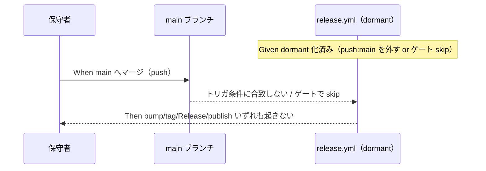

# 要件定義書: npm 公開を「今後の課題」として起票し、自動リリースを現状無効化する

**プロジェクト名**: npm 公開を「今後の課題」として起票し、自動リリースを現状無効化する
**作成日**: 2026 年 06 月 16 日
**最終更新**: 2026 年 06 月 16 日

> **重要**: **このドキュメントは常に更新**: 要件の変更や追加があった場合は、即座にこのドキュメントを更新してください。ドキュメントは「生きているドキュメント」として扱い、実装内容と常に同期させます。
>
> **用語**: [.agents/CONCEPTS.md §用語規約](../../../../../.agents/CONCEPTS.md#用語規約) を参照。

---

## 1. 概要

### 1.1 システム概要

本件は、npm パッケージ `agent-skill-chain` の**公開（配布方針の決定と実施）を「今後の課題」として追跡可能な形で起票**し、**現時点では公開しない**ため、`release.yml`（main マージで自動 version bump → 日時タグ → GitHub Release → npm publish する案C）の**誤発火を現状無効化（dormant 化）**するためのものである。配布方法（①〜④）の選択肢とトレードオフ・公開リスクを整理し、将来の意思決定材料と再開手順を残す。あわせて、現状の `README.md` のリリース手順（§147/151/153）が「`vX.Y.Z`/`v*` タグ push で自動発火」と実 `release.yml`（`on: push: branches: [main]`）と不整合である点を、無効化後の発火方式と整合させること（実改変は設計・実装フェーズ）を本 issue の是正対象に含める。

本要件フェーズの成果は「課題の起票（00/01）」＋「無効化の要求・要件の整備」までであり、`release.yml` の実改変・実 publish・配布方法の最終決定は将来の設計・実装フェーズに委ねる（[00_要求定義.md §5 除外要件](./00_要求定義.md)）。

### 1.2 用語集

| 用語 | 説明 |
| ---- | ---- |
| 前提 issue | [`20260616_042911_npmスコープ無し公開_将来組織移管`](../20260616_042911_npmスコープ無し公開_将来組織移管/00_要求定義.md)。改名・自動リリース・C 群補強を完了した issue |
| 案C | 前提 issue で確定した自動リリース方式（main push を契機に version patch 自動 bump → 日時タグ `vYYYYMMDD.HHMMSS` → GitHub Release → npm publish） |
| dormant 化 | 設定資産（`release.yml` の各 step）を**削除せず**、トリガ条件やゲートで**自動発火だけを停止**する可逆な無効化 |
| 自動発火 4 要素 | main マージで起こりうる: ① version bump（書き戻し commit）② 日時タグ作成 ③ GitHub Release 作成 ④ npm publish |
| 配布方法①〜④ | ① GitHub 直接参照 / ② GitHub Releases tarball / ③ npm publish（CI 経由）/ ④ GitHub Packages（[00 §2.2](./00_要求定義.md)） |

---

## 2. 機能要件

### 2.1 ユーザーストーリー

#### ストーリー 1: 公開を今後の課題として残す

- **As a** 本パッケージの保守者
- **I want to** npm 公開（配布方針の決定と実施）を追跡可能な課題として起票し、配布方法の選択肢とリスクを整理しておく
- **So that** 適切なタイミング（配布方法確定・体制整備後）に、散在した文脈を再構築せず公開判断を下せる

**受け入れ基準**:

- 配布方法①〜④の各メリット/デメリット・公開リスク・選択軸が 00 に整理されている（SC-1）。
- この issue 単体で再開判断・着手ができる背景・選択肢・再開手順が記録されている（SC-4）。

#### ストーリー 2: 現状では誤公開・誤リリースを防ぐ

- **As a** 本パッケージの保守者
- **I want to** main へマージしても自動リリース（自動発火 4 要素）が一切発火しないようにする
- **So that** 公開判断が下る前に意図しない公開・リリースが起きない

**受け入れ基準**:

- main 相当のマージで version bump / 日時タグ / GitHub Release / npm publish のいずれも発火しない（SC-2）。
- 無効化は削除でなく dormant 化であり、既存資産を保持する。

#### ストーリー 3: 将来、最小手順で再開できる

- **As a** 将来の保守者
- **I want to** 公開再開の前提条件と有効化手順を把握する
- **So that** 配布方法を決めたら最小手順で公開を再開できる

**受け入れ基準**:

- 再開前提条件（配布方法の確定・必要なら `NPM_TOKEN` 登録・[git 配布の場合] bin の `prepare` 調整・workflow 有効化手順）が文書化されている（SC-3）。
- `README.md` のリリース手順のトリガ記述（§147/151/153 等）が無効化後の実 `release.yml` の発火方式と整合しており、誤って「`v*`/`vX.Y.Z` タグ push で発火」と案内していない（SC-5）。これにより、将来の保守者が README を信じてタグ push して再開に失敗する誤導線を解消する（実改変は設計・実装フェーズ）。

### 2.2 BDD ユースケース

> 注: UC1 は本要求/要件フェーズ（ドキュメント成果）で検証する。UC2・UC3 の「実装後」観点は将来の設計・実装フェーズで満たす受け入れ条件であり、本フェーズではその受け入れ基準を定義する。

#### ユースケース 1: 課題化と選択肢整理の完成（本フェーズで検証）

00（必要なら 01）に、配布方法の選択肢・リスク・再開手順が将来の意思決定に使える形で整理されていることを確認する。

**シナリオ 1: 配布方法の選択肢が整理されている（SC-1）**

```gherkin
Feature: npm 公開の課題化
  Scenario: 配布方法の選択肢とトレードオフが整理されている
    Given 00_要求定義.md が作成されている
    When §2.2 新規機能要件 A の配布方法表を確認する
    Then 配布方法①〜④それぞれにメリット・デメリット・公開リスク・選択軸が記載されている
```

**シナリオ 2: 単体で再開できる背景が記録されている（SC-4）**

```gherkin
Feature: npm 公開の課題化
  Scenario: 第三者がこの issue 単体で再開判断できる
    Given 00_要求定義.md と 01_要件定義.md が作成されている
    When 前提 issue を読まずに本 issue のみを読む
    Then 背景・公開リスク・配布方法の選択肢・再開前提条件・無効化方式候補が本 issue 内で把握できる
```

#### ユースケース 2: 自動リリースの現状無効化（受け入れ基準を定義・実装後に検証）

main マージで自動発火 4 要素が起きないことを保証する。

**シナリオ 1: main マージで自動リリースが発火しない（SC-2）**

> **検証方法（安全側の受け入れ基準・A-3）**: 本シナリオは**実マージをして発火を観測する方法では検証しない**（実マージは誤発火しうるため危険）。`release.yml` の**静的確認**で判定する。具体的には (1) `on:` にタグ／ブランチの**自動起点**（`push: branches`／`push: tags`）が無いこと、(2) 各 job（`release-npm`・`release-marketplace`）の `if:` ゲートが自動発火を skip すること、を確認し、必要に応じてドライ検証で補う。これにより「main 相当のマージで自動発火 4 要素が起きない」を実マージなしで判定する。

```gherkin
Feature: 自動リリースの現状無効化
  Scenario: main へマージしても自動リリースが発火しない
    Given release.yml の自動リリースが dormant 化されている
    When main 相当の push（マージ）が発生する想定で release.yml を静的確認する
    Then on: にタグ/ブランチの自動起点が無い（または各 job が if: ゲートで skip される）
    And version bump（書き戻し commit）が発生しない
    And 日時タグ vYYYYMMDD.HHMMSS が作成されない
    And GitHub Release が作成されない
    And npm publish が実行されない
```

**シナリオ 2: 無効化は削除でなく可逆な dormant 化である**

```gherkin
Feature: 自動リリースの現状無効化
  Scenario: 既存資産を保持したまま無効化する
    Given release.yml に案C の各 step が存在する
    When dormant 化を適用する
    Then release.yml の各 step（version bump / tag / Release / publish の定義）が削除されずに残る
    And 再開時にトリガ/ゲートを戻すだけで有効化できる
```

**処理フロー**:



#### ユースケース 3: 公開再開の前提条件（受け入れ基準を定義・将来適用）

**シナリオ 1: 再開前提条件が文書化されている（SC-3）**

```gherkin
Feature: 公開再開の前提条件
  Scenario: 再開に必要な前提と手順が分かる
    Given 公開を再開する判断が下る
    When 00_要求定義.md §2.2 C と §9 を参照する
    Then 配布方法の確定・必要なら NPM_TOKEN 登録・git 配布時の bin prepare 調整・workflow 有効化手順が記載されている
```

**シナリオ 2: README のトリガ記述が実態と整合している（SC-5・実装後に検証）**

```gherkin
Feature: 公開再開の前提条件
  Scenario: README のリリース手順が無効化後の発火方式と整合している
    Given 自動リリースが dormant 化され README が是正されている
    When README.md のリリース手順（§147/151/153 等）のトリガ記述を確認する
    Then トリガ記述が実 release.yml の発火方式と一致している
    And 誤って「v*/vX.Y.Z タグ push で publish/marketplace 公開が自動発火する」と案内していない
    And 将来の保守者が README を信じてタグ push して再開に失敗する誤導線が無い
```

### 2.3 ビジネスルール

- 自動リリースの無効化は**削除ではなく dormant 化**とし、前提 issue の成果（資産）を否定・破壊しない。
- 配布方法の**最終決定・実 publish・実配布・`release.yml` の実改変**は本 issue（要求・要件フェーズ）の対象外。無効化方式の確定は設計フェーズで行う。
- **README のトリガ記述（§147/151/153 等）を無効化後の実態と整合させることは本 issue の是正対象に含める**（[00 §2.2 D・効果 5・SC-5](./00_要求定義.md)）。ただし `README.md` の**実改変は設計・実装フェーズ**で行い、本フェーズでは要件化までとする（別課題化はしない）。
- **SC-2 の検証は実マージをせず `release.yml` の静的確認（`on:` にタグ／ブランチ自動起点が無いこと・各 job の `if:` ゲート）＋ドライ検証で判定する**（実マージは誤発火しうるため行わない・A-3）。
- 調査は read のみ。証跡の DB 書込みは書記（write-workflow-log）のみが行う。

---

## 3. 非機能要件

### 3.1 パフォーマンス要件

- 特段の性能要件はない（無効化は CI のトリガ条件・ゲート変更にとどまる）。

### 3.2 セキュリティ要件

- 意図しない公開（誤 publish・誤 Release・名前の永久消費）を防止する。
- 再開時に `NPM_TOKEN` 等の機微情報を扱う場合は Secrets で管理し、平文でコミットしない。

### 3.3 ユーザビリティ要件

- 再開手順は最小手数（例: トリガを戻す／ゲート変数を `true` にする）で実施できるよう文書化する。
- 本 issue 単体で背景・選択肢・再開手順が把握できる（自己完結）。

### 3.4 可用性要件

- 無効化は可逆であり、いつでも再活性化できる。設定資産を保持する。

---

## 4. 外部インターフェース要件

### 4.1 API 要件

- 本件に外部 API 要件はない。関係する外部インターフェースは GitHub Actions（`release.yml`）のトリガ（`on: push`／`workflow_dispatch`）と GitHub/npm 公開系のみ。

### 4.2 データ形式要件

- 成果物は 00/01 の Markdown（テンプレート準拠）。`release.yml` の実改変は将来フェーズ。

---

## 5. 制約事項

- 本フェーズは要求・要件まで。設計（02）・実装（03 以降）・`release.yml` の実改変はしない。無効化方式（候補 a/b/c）は設計フェーズで確定する。
- 前提 issue の成果を否定しない（無効化＝dormant 化、削除ではない）。
- 調査は read のみ。本番改変・`workflow.db` への直接書込みをしない。ルートに `workflow.db` を作らない（正規 DB は `.workflow/workflow.db`）。
- 04_review.md は作成しない（実装前）。レビュー証跡は memo に残す。

---

## 6. 参考資料

### プロジェクトドキュメント

- [`00_要求定義.md`](./00_要求定義.md) - 要求定義
- 前提 issue: [`20260616_042911_npmスコープ無し公開_将来組織移管/00_要求定義.md`](../20260616_042911_npmスコープ無し公開_将来組織移管/00_要求定義.md)

### その他の参考資料

- [.github/workflows/release.yml](../../../../../.github/workflows/release.yml)
- [package.json](../../../../../package.json)
- [README.md](../../../../../README.md)

---

## 7. 前のステップ

この要件定義書は、以下のドキュメントを基に作成されています：

- **前**: [`00_要求定義.md`](./00_要求定義.md) - 要求定義フェーズ

---

## 8. 次のステップ

この要件定義書の承認後、以下のドキュメントを作成します：

- **次**: [`02_設計.md`](./02_設計.md) - 設計フェーズ（無効化方式 a/b/c の確定を含む。本 issue の現フェーズ対象外）
