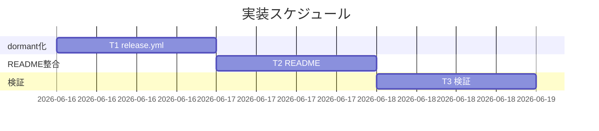

# 実装計画書: npm 公開を「今後の課題」として起票し、自動リリースを現状無効化する

**プロジェクト名**: npm 公開を「今後の課題」として起票し、自動リリースを現状無効化する
**作成日**: 2026 年 06 月 16 日
**最終更新**: 2026 年 06 月 16 日

> **重要**: **このドキュメントは常に更新**: 実装計画の変更、進捗状況の更新があった場合は、即座にこのドキュメントを更新してください。
>
> **用語**: [.agents/CONCEPTS.md §用語規約](../../../../../.agents/CONCEPTS.md#用語規約) を参照。

---

## 1. 実装概要

### 1.1 実装方針（必須）

[02\_設計.md](./02_設計.md) に従い、`release.yml` を**候補(c)（手動トリガ化＋ゲート変数）で可逆 dormant 化**し、`README.md` のトリガ記述を実態（dormant・再開手順）と整合させる。前提 issue の案C 資産（step 本体・SHA ピン・無限ループ防止）は不変とし、検証は**静的確認＋ YAML 構文検証**で行う（実マージ発火観測は禁止）。

### 1.2 実装順序（必須: 1 件以上）

1. **T1**: `release.yml` の dormant 化（`on:` 起点除去＋両 job ゲート＋先頭コメント）
2. **T2**: `README.md`・`docs/maintainer/RELEASE.md` トリガ記述の実態整合（README §147/151/153＋RELEASE.md §5/§6＋再開手順）
3. **T3**: 検証（YAML 構文・静的確認・grep・既存テスト非破壊）



---

## 2. タスク分解

**必須**: 各タスクに「テスト観点」（2.x.3）と「単体テスト仕様（BDD）」（2.x.4）を記載。観点定義は [02\_設計 §6](./02_設計.md)・[RULES テスト戦略](../../../../../.agents/RULES.md#テスト戦略必須要件)・[TEST_BDD_FORMAT.md](../../../../../.agents/TEST_BDD_FORMAT.md) を参照。

### 2.1 タスク 1（T1）: release.yml の可逆 dormant 化

#### 2.1.1 概要（必須）

main push 自動発火を停止する。起点除去（主防御）＋両 job ゲート（補助防御）＋先頭コメント。案C 資産は不変。

#### 2.1.2 実装内容（必須: 1 件以上）

- `on: push: branches:[main]` を `on: workflow_dispatch:` へ差し替え（手動テストは維持）。
- `release-npm` の `if:` を `github.actor != 'github-actions[bot]' && vars.RELEASE_ENABLED == 'true'` に変更。
- `release-marketplace` の `if:` を同様に変更（両 job 必須）。
- ファイル先頭に dormant 理由・関連 issue・再開手順のコメントブロックを追加。
- 案C 各 step・SHA ピン（`actions/checkout@34e1148…`・`actions/setup-node@49933ea…`）・`[skip ci]`・`concurrency`・actor ガードは**変更しない**。

#### 2.1.3 テスト観点（必須）

**参照**: [02\_設計 §6](./02_設計.md)。以下は本タスクの具体ケース。

##### 単体（静的検査・必須 1 件以上）

- `on:` に `push:` キー（branches/tags の自動起点）が存在せず `workflow_dispatch` のみであること（SC-2）。
- `release-npm`・`release-marketplace` の双方の `if:` に `vars.RELEASE_ENABLED == 'true'` が含まれること（SC-2）。
- 編集後の `release.yml` が valid YAML であること（`python3 -c "import yaml; yaml.safe_load(open('.github/workflows/release.yml'))"` が exit 0）。
- 案C の主要 step 名（`Bump version`・`Create GitHub Release`・`npm publish`・marketplace 生成）と 2 つの SHA ピンが残存していること（資産保持）。

##### 結合/API

- 該当なし（CI 設定の静的検査のみ）。

##### E2E/受け入れ

- 実マージによる発火観測は**禁止**（誤発火危険・01 §2.3 A-3）。静的確認で代替するため未達は意図的。

##### バリデーション

- `RELEASE_ENABLED` 未設定時にゲート式が false 側へ倒れること（`vars.RELEASE_ENABLED` は空文字 → `== 'true'` は false）を式仕様として確認。

#### 2.1.4 単体テスト仕様（BDD）（必須）

```gherkin
Feature: 自動リリースの現状無効化
  Scenario: main へマージしても自動リリースが発火しない（SC-2）
    Given release.yml が候補(c) で dormant 化されている
    When main 相当の push（マージ）が発生する想定で release.yml を静的確認する
    Then on: に push（branches/tags の自動起点）が無く workflow_dispatch のみである
    And release-npm と release-marketplace の両 if: に RELEASE_ENABLED=='true' ゲートがある
    And version bump / 日時タグ / GitHub Release / npm publish の step は定義として残存する（dormant＝削除でない）
```

```bash
# Given: dormant 化後の release.yml を対象にする
WF=.github/workflows/release.yml
# When: on: の自動起点を静的確認する
# Then: push 起点が無く workflow_dispatch のみ・両 job にゲートがある・YAML が valid
python3 - "$WF" <<'PY'
import sys, yaml
d = yaml.safe_load(open(sys.argv[1]))
on = d.get(True, d.get('on'))            # YAML の 'on' は True に化けるため両対応
assert 'push' not in on, "on: に push 自動起点が残存"            # Then
assert 'workflow_dispatch' in on, "workflow_dispatch が無い"     # Then
for job in ('release-npm', 'release-marketplace'):               # Then: 両 job
    cond = d['jobs'][job]['if']
    assert "RELEASE_ENABLED == 'true'" in cond, f"{job} にゲート無し"
print("OK: dormant 静的確認 PASS")
PY
```

#### 2.1.5 依存関係

- なし（T1 が起点）。

#### 2.1.6 見積もり

- **工数**: 0.5h / **優先度**: 高

### 2.2 タスク 2（T2）: README・RELEASE.md トリガ記述の実態整合

#### 2.2.1 概要（必須）

README §147/151/153 の「タグ push で自動 publish/marketplace 公開」誤記述、および詳細正本 `docs/maintainer/RELEASE.md` §5（:121-148）・§6（:148）の同種のタグ起点記述を、dormant 実態＋再開手順へ整合させる（A-1）。README だけ整合させ RELEASE.md を放置すると正本側に誤導線が残るため、両ファイルを是正対象とする。

#### 2.2.2 実装内容（必須: 1 件以上）

- **README.md**:
  - §147 要約を「現在 npm 公開は今後の課題として保留中。自動リリースは無効化（dormant）。main マージ・タグ push のいずれでも自動発火しない。再開時は <手順>」へ置換。
  - §151／§153 の「version 一致タグを push」「`v*` タグ push で publish」を、dormant の実態と再開後の発火方式（main push 起点・案C）に整合させる。タグ起点誤記述（実態は元々 `push:main`）も解消。
  - 再開手順（①配布方法確定 ②`NPM_TOKEN` 登録 ③`on:` に push:main を戻す ④`RELEASE_ENABLED=true`）を README から参照可能にする（詳細正本は 00 §2.2 C・§9／`docs/maintainer/RELEASE.md`、README は要約＋リンク）。
- **docs/maintainer/RELEASE.md（A-1・正本側の整合）**:
  - §5（:121-148）の「実 publish と marketplace 公開は `vX.Y.Z` タグの push をトリガに CI が実行する」「version と一致するタグを push する（`git tag v0.1.0 && git push origin v0.1.0`）」等のタグ起点案内を、無効化後の実態（**dormant・main 起点・タグでは発火しない**）と再開手順（上記①〜④）へ整合させる。
  - §6（:148）の参照行「`release.yml` — タグ push による publish/marketplace CI」という説明文も実態（main 起点・dormant）へ整合させる。
  - 既存の安全弁記述（実 publish はユーザー承認・`NPM_TOKEN` 必須・CI 上のみ＝:7-8,:140 付近）は壊さない（must-preserve B-8）。RELEASE.md が再開手順の詳細正本である関係を保ち、手順を README と二重記載しない。

#### 2.2.3 テスト観点（必須）

##### 単体（静的検査・必須 1 件以上）

- README に「`v*`/`vX.Y.Z` タグ push で publish/marketplace 公開が自動発火する」と読める誤導線が残らないこと（SC-5）。
- **`docs/maintainer/RELEASE.md` にも同種のタグ起点誤導線が残らないこと（SC-5・A-1）**。grep 検査対象に `docs/maintainer/RELEASE.md` を含める。
- README および RELEASE.md に「dormant／無効化」「再開手順」が記載されていること（SC-3／SC-5）。

##### 結合/API・E2E・バリデーション

- 該当なし（Markdown 静的検査）。

#### 2.2.4 単体テスト仕様（BDD）（必須）

```gherkin
Feature: 公開再開の前提条件
  Scenario: README と RELEASE.md のリリース手順が無効化後の発火方式と整合している（SC-5・A-1）
    Given 自動リリースが dormant 化され README と docs/maintainer/RELEASE.md が是正されている
    When README.md（§147/151/153 付近）と docs/maintainer/RELEASE.md（§5/§6）のリリース手順を確認する
    Then トリガ記述が実 release.yml の発火方式（dormant・main 起点）と一致している
    And 「v*/vX.Y.Z タグ push で自動 publish/公開」と案内する誤導線が両ファイルに無い
    And 再開手順が記載され、保守者が正しく再開できる
```

```bash
# Given: 是正後の README と RELEASE.md を対象にする（A-1: 正本側も検査）
# When: タグ起点の自動発火を案内する誤導線を両ファイルで grep する
# Then: 誤導線が 0 件、かつ dormant/再開手順の記載がある
for f in README.md docs/maintainer/RELEASE.md; do
  if grep -nE 'タグ.*push.*(自動|publish|公開)|`v\*`.*push.*publish|`vX\.Y\.Z`.*タグ.*push' "$f" \
     | grep -vi 'dormant\|無効化\|発火しない\|保留'; then
    echo "NG: $f にタグ起点の誤導線が残存"; exit 1
  fi
  grep -qiE 'dormant|無効化' "$f" && grep -qE '再開' "$f" \
    || { echo "NG: $f に dormant/再開手順の記載不足"; exit 1; }
done
echo "OK: README・RELEASE.md 整合 PASS"
```

#### 2.2.5 依存関係

- T1（実態を確定してから README を整合させる）。

#### 2.2.6 見積もり

- **工数**: 0.5h / **優先度**: 高

### 2.3 タスク 3（T3）: 検証（構文・静的・既存テスト非破壊）

#### 2.3.1 概要（必須）

T1/T2 の成果を静的に検証し、既存テストを壊さないことを確認する。

#### 2.3.2 実装内容（必須: 1 件以上）

- `release.yml` の YAML 構文検証（python yaml。actionlint があれば併用可だが本環境は不可）。
- T1 の dormant 静的確認スクリプト（§2.1.4）を実行。
- T2 の README・RELEASE.md grep 確認（§2.2.4・両ファイルがループ対象）を実行。
- `test/run-all.sh`（self-enforce/audit 系・write-workflow-log 系）を実行し緑を確認（release.yml 専用 lint は既存に無し＝回帰対象は self-enforce/audit のみ）。

#### 2.3.3 テスト観点（必須）

##### 単体

- python yaml で `release.yml` が parse 成功（exit 0）。
- §2.1.4・§2.2.4 のチェックがいずれも PASS。

##### 結合/API・E2E

- 該当なし／実マージ観測は禁止（前述）。

##### バリデーション

- `test/run-all.sh` が既存通り緑（新規失敗が無い）。tmp 隔離方針（.agents-project §テストの tmp 隔離）に従い、本リポ生成物を破壊しない。

#### 2.3.4 単体テスト仕様（BDD）（必須）

```gherkin
Feature: dormant 化の検証
  Scenario: 静的検証と既存テスト非破壊を確認する
    Given T1/T2 の編集が適用されている
    When YAML 構文検証・dormant 静的確認・README grep・run-all.sh を実行する
    Then release.yml は valid YAML である
    And dormant 静的確認と README grep が PASS する
    And test/run-all.sh が既存通り緑（新規失敗が無い）である
```

```bash
# Given: 編集適用後
# When: 構文検証を行う
python3 -c "import yaml,sys; yaml.safe_load(open('.github/workflows/release.yml')); print('YAML OK')"
# Then: 既存テストが緑（tmp 隔離は run-all 側の設計に従う）
bash test/run-all.sh
```

#### 2.3.5 依存関係

- T1・T2。

#### 2.3.6 見積もり

- **工数**: 0.5h / **優先度**: 高

---

## テスト観点

- 全観点を**実マージ無しの静的確認＋ YAML 構文検証**で満たす（SC-2 安全側）。release.yml は dormant 静的確認・資産保持・構文、README と `docs/maintainer/RELEASE.md` はタグ起点誤導線 0 件・再開手順記載（A-1）、全体は既存 `run-all.sh` 非破壊。

## 単体テスト

- T1: dormant 静的確認スクリプト（on: 起点・両 job ゲート・YAML valid・資産保持）。T2: README・`docs/maintainer/RELEASE.md` grep（両ファイルとも誤導線 0・dormant/再開記載）。T3: python yaml＋`run-all.sh`。

## BDD

- UC2 シナリオ1（SC-2・T1）／UC2 シナリオ2（資産保持・dormant＝削除でない・T1）／UC3 シナリオ2（SC-5・T2）。Given/When/Then は各 §2.x.4 に記載。

---

## 3. 実装スケジュール

### 3.1 マイルストーン

| マイルストーン | 期日 | 成果物 |
| -------------- | ---- | ------ |
| dormant 化＋整合 | 実装フェーズ | dormant `release.yml`・整合 `README.md` |
| 検証 | 実装フェーズ | 静的確認・構文・run-all.sh の PASS 証跡 |

### 3.2 実装フェーズ

#### フェーズ 1: 無効化と整合

- **タスク**: T1 → T2 → T3。

---

## 4. テスト計画

### 4.1 テストの優先順位

- SC-2（誤発火ゼロ）が最クリティカル → T1 の dormant 静的確認を厚く。SC-5（README・RELEASE.md 整合）→ T2 の grep（両ファイル）。回帰は `run-all.sh`。

---

## 5. リスク管理

### 5.1 実装リスク

- **リスク**: ゲートを片 job にしか付けず一方が発火しうる（00 §7.1）。
  - **対策**: §2.1.4 のスクリプトで両 job のゲートを必須検証。
- **リスク**: `on:` の YAML キーが Python で `True` に解釈され検査が空振りする。
  - **対策**: §2.1.4 で `d.get(True, d.get('on'))` の両対応にする。
- **リスク**: README の誤導線取りこぼし。
  - **対策**: §2.2.4 の grep を dormant/無効化の文脈を除外して実行し残存 0 を確認。

---

## SC ↔ テスト観点の対応

| SC | 検証フェーズ | 対応タスク/観点 |
| -- | ---- | ---- |
| SC-1（配布方法①〜④整理） | 本 issue で充足済み（00 §2.2 A） | 設計・実装の新規対象外。04_review で 00 の記載を確認 |
| SC-2（main マージで自動発火しない） | 実装後・静的確認 | T1 §2.1.4（on: 起点除去＋両 job ゲート＋YAML valid） |
| SC-3（再開前提条件の文書化） | 本 issue＋実装後 | 00 §2.2 C・§9 に記載済み。T2 で README に再開手順を反映 |
| SC-4（単体で再開できる背景） | 本 issue で充足（00/01） | 設計・実装の新規対象外。04_review で確認 |
| SC-5（README 整合。検証対象に `docs/maintainer/RELEASE.md` を含む＝A-1） | 実装後・grep | T2 §2.2.4（README・RELEASE.md ともタグ起点誤導線 0・dormant/再開記載） |

---

## 6. 参考資料

### プロジェクトドキュメント

- [`02_設計.md`](./02_設計.md) - 設計
- [`00_要求定義.md`](./00_要求定義.md) / [`01_要件定義.md`](./01_要件定義.md)

### その他の参考資料

- [.github/workflows/release.yml](../../../../../.github/workflows/release.yml)
- [README.md](../../../../../README.md)
- [docs/maintainer/RELEASE.md](../../../RELEASE.md)（§5 :121-148・§6 :148 タグ起点記述・T2 整合対象＝A-1）
- [test/run-all.sh](../../../../../test/run-all.sh)

---

## 7. 前のステップ

- **前**: [`02_設計.md`](./02_設計.md) - 設計フェーズ

---

## 8. 次のステップ

- 本 issue は 1 つの issue（サブ分割なし）であるため、承認後は実装フェーズ（implement-feature）へ直接進む。
