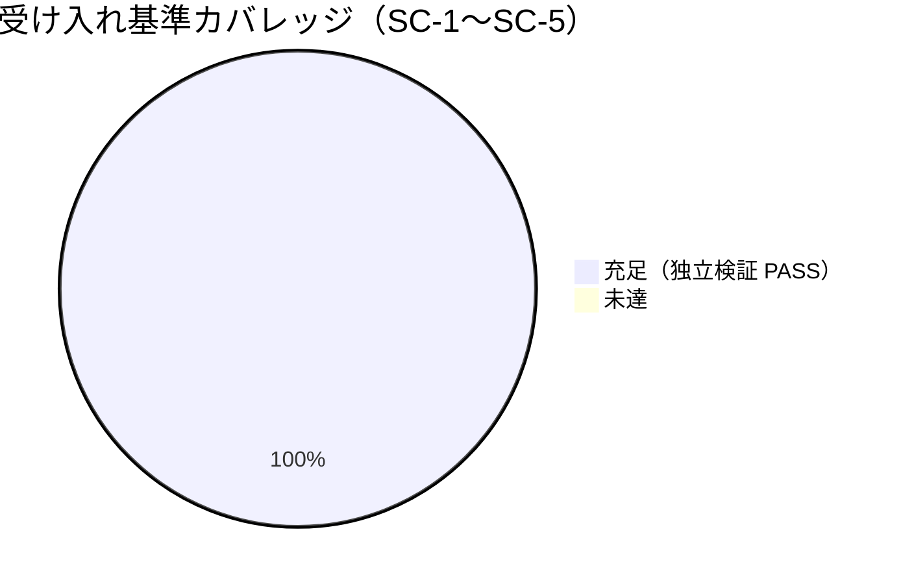

# レビュー書: npm 公開を「今後の課題」として起票し、自動リリースを現状無効化する

**プロジェクト名**: npm 公開を「今後の課題」として起票し、自動リリースを現状無効化する
**作成日**: 2026 年 06 月 16 日
**最終更新**: 2026 年 06 月 16 日

> **必須**: レビュー深度は [`.agents/REVIEW_RULE.md`](../../../../../.agents/REVIEW_RULE.md) に従う。本件は CI 設定（YAML）と Markdown の編集であり変更規模は限定的だが、誤公開ゼロ（SC-2）と前提 issue 資産の非破壊（must-preserve）が最重要のため **standard** で実施した。二観点（[`.agents/REVIEW_DUAL_LENS.md`](../../../../../.agents/REVIEW_DUAL_LENS.md)）の両リストを §9.4 に記載する。

---

## 1. レビュー概要

### 1.1 レビュー目的（必須）

実装内容の確認 / 品質保証 / クローズ前最終チェック。02 設計・03 実装計画どおりに `release.yml` の可逆 dormant 化と README/RELEASE.md のトリガ記述整合が行われ、前提 issue（20260616_042911）の自動リリース資産を破壊していないことを、独立再実行（テスト・static・grep）と二観点レビューで検証する。

### 1.2 レビュー対象（必須）

- **実装範囲**: `release.yml` を候補(c)（起点除去＋ゲート変数）で可逆 dormant 化、`README.md`・`docs/maintainer/RELEASE.md` のタグ起点誤導線を解消し dormant・再開手順へ整合（コミット未実施の作業ツリー差分）。
- **レビュー期間**: 2026-06-16 ～ 2026-06-16
- **レビュー担当者**: verify-and-close worker（検証・クローズ担当サブエージェント）

---

## 2. 実装内容の確認

### 2.1 実装完了タスク（または Issue）

| タスク名 | 実装内容 | 実装日 | 担当者 | ステータス（必須: 完了 または 要修正） |
| -------- | -------- | ------ | ------ | -------------------------------------- |
| T1 release.yml dormant 化 | `on:` を `workflow_dispatch` のみへ（push:main 撤去）・両 job `if:` に `RELEASE_ENABLED` ゲート AND 連結・先頭 dormant コメント＋再開手順。案C step/SHA ピン/無限ループ防止は不変 | 2026-06-16 | 実装 worker | 完了 |
| T2 README/RELEASE.md 整合 | タグ起点誤導線（`v*`/`vX.Y.Z`/`git tag`）を撤去し dormant・main 起点・再開手順へ整合。安全弁記述は保持 | 2026-06-16 | 実装 worker | 完了 |
| T3 検証 | YAML 構文・dormant 静的確認・grep・`run-all.sh`・typecheck を実測 | 2026-06-16 | 実装 worker＋本レビュー | 完了 |

### 2.2 実装内容の詳細

#### タスク 1: release.yml の可逆 dormant 化（候補 c）

- **実装内容**: `on:` から `push: branches:[main]` を撤去し `workflow_dispatch:` のみへ差し替え（NOTE コメント付き）。`release-npm`・`release-marketplace` 両 job の `if:` を `github.actor != 'github-actions[bot]' && vars.RELEASE_ENABLED == 'true'` に変更。ファイル先頭に dormant 説明＋再開手順（最小 2 手）コメントブロックを追加。
- **変更ファイル**: `.github/workflows/release.yml`
- **実装方法**: 多層防御（起点除去＝主防御＋ゲート変数＝補助防御）。案C step 本体・SHA ピン（checkout `34e1148…`・setup-node `49933ea…`）・`[skip ci]`・`concurrency`・`NPM_TOKEN` ゲートは一切改変なし。
- **確認事項**: 02 §2.2.1/§3.1・03 §2.1.2 と一致（独立 static 検証 §3.2 で PASS）。

#### タスク 2: README / RELEASE.md トリガ記述の実態整合

- **実装内容**: README §145/147/151/153 の「`vX.Y.Z`/`v*` タグ push で自動 publish/公開」を撤去し dormant（main マージ・タグ push のいずれでも発火しない）＋再開後 main push 起点＋再開手順（要約＋RELEASE.md §5 リンク）へ。RELEASE.md §1 注記・§5（タグ push CI publish 見出し・`git tag` 手順）・§6 参照行・冒頭安全弁注記の `v*` タグ起点表現を dormant・main 起点・タグ非発火・再開手順（①配布確定 ②NPM_TOKEN ③on:push:main 復活 ④RELEASE_ENABLED=true）へ整合。
- **変更ファイル**: `README.md`・`docs/maintainer/RELEASE.md`
- **実装方法**: README は要約＋リンク、RELEASE.md が再開手順の詳細正本（重複なし）。安全弁（実 publish はユーザー承認・`NPM_TOKEN` 必須・CI 上のみ）は保持。
- **確認事項**: 両ファイルでタグ起点誤導線 grep 0 件・dormant/再開記載あり（独立 grep 検証 §3.3 で PASS）。

---

## 3. テスト結果の確認

### 3.1 単体テスト（独立再実行・実測）

#### テスト実行結果（必須: 数値で記載）

- **実行日**: 2026-06-16（本レビューで `bash test/run-all.sh` を独立再実行）
- **テストファイル数（スイート数）**: 12
- **テストケース数（合計）**: 12 スイート（うち e2e サブシナリオ 88 件を含む）
- **成功**: 12（PASS=12）／e2e サブ PASS=88 FAIL=0
- **失敗**: 0
- **スキップ**: 0

`run-all.sh` 末尾: `合計=12 PASS=12 FAIL=0 SKIP=0`。`npm run typecheck`（`tsc --noEmit`）exit 0（src 変更なし）。

#### テストカバレッジ

#### 失敗したテスト（該当する場合）

| テストファイル | テストケース | 失敗理由 | 対応状況 |
| -------------- | ------------ | -------- | -------- |
| （なし）       | （なし）     | —        | —        |

### 3.2 SC-2 static 独立再現（python yaml）

本レビューで `python3` により `release.yml` を `yaml.safe_load` し独立再現:

- `on` = `{'workflow_dispatch': None}` ＝ `push`（branches/tags の自動起点）無し・`workflow_dispatch` のみ → **PASS**
- `release-npm.if` = `github.actor != 'github-actions[bot]' && vars.RELEASE_ENABLED == 'true'` → **PASS**
- `release-marketplace.if` = 同上 → **PASS**（両 job にゲート＋actor ガード残存）
- SHA ピン 2 件（`34e114876b0b11c390a56381ad16ebd13914f8d5`・`49933ea5288caeca8642d1e84afbd3f7d6820020`）残存 → **PASS**
- 案C 資産（`Bump version`・`Create GitHub Release`・`npm publish`・`Build adapters`・`[skip ci]`・`concurrency`・`NPM_TOKEN`）残存 → **PASS**
- YAML valid（safe_load 成功）→ **PASS**

> **実マージ・実発火・実 publish は実施していない**（SC-2 安全側の線引き・01 §2.3 A-3・03 §2.1.3）。

### 3.3 SC-5 grep 独立再現

本レビューで `README.md`・`docs/maintainer/RELEASE.md` 両方を独立 grep:

- タグ起点誤導線（`v*`/`vX.Y.Z`/`git tag`/`タグ.*push.*(publish|公開|自動)`）を dormant 文脈（`dormant`/`無効化`/`発火しない`/`発火条件ではない`/`保留`/`起きない`）を除外して検査 → **両ファイルとも 0 件**。
- `git tag v0.1.0` / `git push origin v0.1.0` 形式の実行例 → **両ファイルとも 0 件**。
- 残存する `タグ push` 言及は「タグ push のいずれでも発火しない」「タグ push が発火条件ではない」という否定文脈のみ（誤導線ではない）。
- dormant/無効化の記載・「再開」手順の記載 → **両ファイルとも有り**（README: dormant 2 件・再開 4 件／RELEASE.md: dormant 6 件・再開 9 件）。

### 3.4 既存テスト非破壊・tmp 隔離

`run-all.sh` の e2e は内部で `mktemp -d` による隔離環境で検証する設計であり、本リポ生成物（`.agents/`・`.claude/`・`workflow.db`）を破壊しない。リポジトリルートに `workflow.db` を作成していない。

---

## 4. コードレビュー

### 4.1 コード品質

#### コードスタイル

- **リント結果**: release.yml 専用 lint は既存に無し（追加は任意・03 §2.3.2 の通り対象外）。
- **フォーマット**: 問題なし（YAML valid・Markdown 整形済み）。
- **型チェック**: 0 / 0（`tsc --noEmit` exit 0。src 変更なし）。

#### コードレビュー観点

| 観点 | 確認内容（必須: 1 文） | 結果（必須: OK または 要修正） | コメント |
| ---- | ---------------------- | ------------------------------ | -------- |
| 可読性 | 先頭コメントで dormant 理由・再開手順が文脈再構築なしに読める（AIフレンドリー設計） | OK | 02 §1.2 準拠 |
| 保守性 | 再開は最小 2 手（on: 復活＋RELEASE_ENABLED=true）・資産保持で可逆 | OK | 02 §9.2 準拠 |
| パフォーマンス | candidate(c) は main push で workflow 自体が起動しないため runner 消費も発生しない | OK | 02 §9.1 準拠 |
| セキュリティ | 誤 publish/誤 Release/名前永久消費を多層防御で構造的に防止・NPM_TOKEN ゲート保持 | OK | 02 §8 準拠 |

### 4.2 指摘事項

#### 指摘 1: 監査 #26（src/agents-md.ts コメント外部参照）はスコープ外・既存 FAIL

- **重要度**: 低（本 issue 起因ではない）
- **指摘内容**: `audit.sh` が `src/agents-md.ts:547/574/576/611/624` で #26（コメント外部参照禁止）FAIL を出すが、当該ファイルは本 issue で未変更（最終変更コミット `0d2209a`＝前提 npm issue のセキュリティ是正）。別 issue（コミット `e72e233 audit残骸チェック偽陽性是正 issue を起票`）として既に起票済み。**本 issue 由来の新規 FAIL ではない**。
- **対応状況**: 完了（スコープ外と確認・別 issue で対応）
- **対応方法**: 本 issue では対応しない（編集 3 ファイルに src/agents-md.ts は含まれない）。

#### 指摘 2: 04_review 未更新 FAIL は本 command で解消

- **重要度**: 中
- **指摘内容**: 04_review.md 作成前の `audit.sh` が当該 issue に 04_review 必須 FAIL を出す。
- **対応状況**: 完了（本 04_review.md の作成で解消する想定。書記による verify-and-close 証跡記録もセットで実施）。
- **対応方法**: 本 command（verify-and-close）で 04_review.md を issue 直下に作成し write-workflow-log を実行。

---

## 5. ドキュメントの確認

### 5.1 ドキュメント更新状況

| ドキュメント | 更新状況 | 確認者 | 確認日 |
| ------------ | -------- | ------ | ------ |
| [`00_要求定義.md`](./00_要求定義.md) | 更新済み（要求フェーズ確定） | verify worker | 2026-06-16 |
| [`01_要件定義.md`](./01_要件定義.md) | 更新済み（BDD・SC 定義） | verify worker | 2026-06-16 |
| [`02_設計.md`](./02_設計.md) | 更新済み（候補 c・A-1 反映） | verify worker | 2026-06-16 |
| [`03_実装計画.md`](./03_実装計画.md) | 更新済み（T1〜T3・SC↔観点表） | verify worker | 2026-06-16 |

### 5.2 ドキュメントの整合性

- **実装と設計の整合性**: 整合している（release.yml 差分が 02 §3.1・03 §2.1.2 と一致。README/RELEASE.md 差分が 02 §3.2・03 §2.2.2 と一致）。
- **要件と実装の整合性**: 整合している（SC-1〜SC-5 すべて充足。§9.1 カバレッジ表参照）。
- **コメント**: README は要約＋リンク、RELEASE.md は詳細正本という参照関係（02 §2.1.3）を保ち手順の二重記載なし。

---

## 6. パフォーマンス確認

### 6.1 パフォーマンステスト結果

該当なし（CI トリガ条件・`if:` ゲートの変更のみ。候補(c) は main push で workflow が起動しないため runner 消費ゼロ）。

### 6.2 ボトルネックの確認

該当なし。

---

## 7. セキュリティ確認

### 7.1 セキュリティチェック

| 項目 | 確認内容 | 結果 | コメント |
| ---- | -------- | ---- | -------- |
| 認証・認可 | `NPM_TOKEN` ゲート step を保持・Secrets 管理・平文コミット禁止を維持 | OK | 02 §8.1 準拠 |
| データ保護 | 誤 publish/誤 Release/名前永久消費を多層防御で構造的に防止 | OK | 02 §8.2 準拠 |
| 入力検証 | `vars.RELEASE_ENABLED` 未設定時は空文字→`== 'true'` が false（安全側へ倒れる） | OK | 03 §2.1.3 バリデーション準拠 |

---

## 8. デプロイ準備

### 8.1 デプロイチェックリスト

- [x] すべてのテストが通過している（run-all.sh 12 PASS・typecheck OK）
- [x] コードレビューが完了している（二観点・§9.4）
- [x] ドキュメントが更新されている（00〜04・本 04）
- [ ] マイグレーションスクリプト（該当なし）
- [x] 環境変数の設定が確認されている（`RELEASE_ENABLED` 未設定で安全側＝dormant）
- [ ] バックアップ計画（該当なし）

### 8.2 デプロイ計画

- **デプロイ予定日**: なし（コミットは orchestrator が別途。実 publish は将来フェーズ・dormant 維持）
- **デプロイ方法**: 該当なし（本 issue は dormant 化＝公開しない）
- **ロールバック計画**: 再開は最小 2 手（`on:` に push:main 復活＋`RELEASE_ENABLED=true`）で可逆。

---

## docs 更新

- 要否: 不要
- 対象: なし
- 理由: 本変更は CI 設定（release.yml）と保守者向けドキュメント（README リリース手順節・docs/maintainer/RELEASE.md）の整合であり、`.agents/spec/` 等のシステム仕様書（docs/00_review 対象）には影響しない。RELEASE.md 自体は保守者リリース手順書であり本変更で同期済み。

---

## 9. 設計・境界の確認

**注意**: review-architecture の結果をここに記載する。

### 9.1 設計の確認 ＋ SC ↔ 実装/検証カバレッジ表

| SC | 受け入れ基準 | 実装/検証 | 結果 | 証跡 |
| -- | ------------ | --------- | ---- | ---- |
| SC-1 | 配布方法①〜④・公開リスク・選択軸が 00 に整理 | 00 §2.2 A の表（①〜④・選択軸） | OK | 00_要求定義.md §2.2 A（本フェーズで充足済み・新規実装対象外） |
| SC-2 | main マージで version bump/日時タグ/GitHub Release/npm publish のいずれも自動発火しない | T1（on: 起点除去＋両 job ゲート） | OK | §3.2 static 独立再現 PASS（on=workflow_dispatch のみ・両 job ゲート・YAML valid） |
| SC-3 | 再開前提条件・有効化手順が文書化 | 00 §2.2 C・§9＋README/RELEASE.md §5 再開手順 | OK | RELEASE.md §5.1（①配布確定 ②NPM_TOKEN ③on:push:main 復活 ④RELEASE_ENABLED=true）・README 再開手順概要 |
| SC-4 | issue 単体で再開判断・着手できる背景 | 00/01 の背景・選択肢・無効化候補・再開手順 | OK | 00/01 全体（本フェーズで充足済み・新規実装対象外） |
| SC-5 | README のトリガ記述（＋A-1 で RELEASE.md）が実態と整合・タグ push 誤導線解消 | T2（README・RELEASE.md 整合） | OK | §3.3 grep 独立再現 PASS（両ファイル誤導線 0・dormant/再開記載あり） |

**欠落**: ゼロ（SC-1〜SC-5 すべて OK）。

### 9.2 境界・依存の確認

- **責務の境界**: 編集は正本 3 ファイル（release.yml/README.md/docs/maintainer/RELEASE.md）に限定。生成物（`.adapters/`・`.claude/`）・前提 issue 資産には触れていない（02 §1.2 準拠）。`git diff --name-only` で 3 ファイルのみを確認。
- **依存関係**: README（要約＋リンク）→ RELEASE.md（詳細正本）→ release.yml（実発火方式の単一真実源）の一方向参照を保持。循環なし。
- **アダプタ再生成の要否**: **不要**。`build-adapters.sh` の生成入力は正本 `.agents/` のみ（README.md は明示的に除外）。編集 3 ファイルは配布アダプタ生成対象外であり、`.adapters/`・`.claude/` 配下に release.yml/RELEASE.md を参照する生成物は存在しない（grep 0 件で確認）。よって正規フローでの再生成は不要。

### 9.3 重要判断の根拠（evidence_source）

| 判断内容 | evidence_source | 備考（参照元） |
| -------- | --------------- | -------------- |
| SC-2 dormant 静的成立（発火しない） | test_output | §3.2 python yaml safe_load の独立再現 PASS |
| SC-5 タグ起点誤導線 0・再開記載あり | test_output | §3.3 README・RELEASE.md 独立 grep PASS |
| 既存テスト非破壊 | test_output | `bash test/run-all.sh` 12 PASS / 0 FAIL を独立再実行 |
| 前提 issue 資産非破壊（案C step/SHA/防止策） | existing_code | git diff＋static で step 名・SHA・[skip ci]/concurrency/NPM_TOKEN 残存を確認 |
| アダプタ再生成不要 | existing_code | build-adapters.sh の入力が `.agents/` のみ・生成物 grep 0 件 |
| #26 はスコープ外・既存 FAIL | existing_code | git log で src/agents-md.ts 未変更（本 issue 差分外）・別 issue 起票済み |

### 9.4 二観点レビュー（敵対的＋肯定的・両リスト必須）

#### 9.4.1 敵対的観点リスト（反証・破壊を試みた観点と結論）

| # | 攻めた観点 | 結論 |
| - | ---------- | ---- |
| A1 | `on:` に push/tags 自動起点が隠れて残っていないか | 残存なし。`on`=`{workflow_dispatch: None}` のみ（§3.2） |
| A2 | ゲートが片 job にしか効かず一方が発火しうるか（00 §7.1） | 両 job（release-npm/release-marketplace）に `RELEASE_ENABLED` ゲート確認（§3.2） |
| A3 | `RELEASE_ENABLED` 未設定で発火しうるか | 未設定→空文字→`== 'true'` が false で skip（安全側）。式仕様で確認 |
| A4 | README/RELEASE.md にタグ push 誤導線が残るか | dormant 文脈除外 grep で両ファイル 0 件（§3.3） |
| A5 | `git tag v0.1.0` 等の実行例が残るか | 両ファイル 0 件（§3.3） |
| A6 | YAML 構文が壊れていないか | safe_load 成功＝valid（§3.2） |
| A7 | 既存テストへの回帰がないか | run-all.sh 12 PASS / 0 FAIL（§3.1） |
| A8 | 編集が 3 ファイルを超えて波及していないか | `git diff --name-only`＝release.yml/README.md/RELEASE.md の 3 件のみ |
| A9 | 監査に本 issue 由来の新規 FAIL がないか | #26 は src/agents-md.ts（本 issue 未変更・既存・別 issue）、04_review FAIL は本 command で解消。新規 FAIL なし |

不確実性に倒した要修正: なし（全観点が証跡で安全側を確認）。

#### 9.4.2 must-preserve リスト（不変条件と保持の確認）

| # | 不変条件（must-preserve） | 保持確認 |
| - | -------------------------- | -------- |
| B-1 | 前提 issue 案C の各 step 本体（bump/sync/build/verify-npm-pack/commit&push/datetag/Release/NPM_TOKEN gate/publish/marketplace 生成） | 全 step 残存（§3.2・git diff で step 削除なし）→ 保持 |
| B-2 | action の SHA ピン（checkout `34e1148…`・setup-node `49933ea…`） | 各 2 か所残存（§3.2）→ 保持 |
| B-3 | 無限ループ防止（`[skip ci]`・`concurrency`・actor `!= github-actions[bot]` ガード） | 残存（§3.2。ゲートは actor ガードに AND 連結＝既存ガードを壊さず追加）→ 保持 |
| B-4 | `NPM_TOKEN` ゲート（未設定で publish skip の安全弁） | step・ゲートともに不変→ 保持 |
| B-5 | `bin: { agents-md }` | package.json 不変（確認済み）→ 保持 |
| B-6 | `files` allowlist（.agents/・AGENTS.md・CLAUDE.md・.workflow/templates/・bin/・README.md） | package.json 不変（確認済み）→ 保持 |
| B-7 | 前提 issue 成果（改名・CI 構築・配布補強・セキュリティ是正）の非否定 | dormant＝削除でなく可逆無効化。資産保持を git diff/static で確認→ 保持 |
| B-8 | RELEASE.md の安全弁記述（実 publish はユーザー承認・NPM_TOKEN 必須・CI 上のみ） | §1（:5,7,8）・§5（:125,130）に残存（dormant 文脈を加えつつ非破壊）→ 保持 |

両リスト（敵対的・must-preserve）をともに記載＝REVIEW_DUAL_LENS §3 証跡要求を充足。

---

## 10. 課題と改善点

### 10.1 発見された課題

- **課題 1**: 監査 #26（src/agents-md.ts コメント外部参照）が FAIL のまま。
  - **影響範囲**: 本 issue 範囲外（src は未変更）。
  - **対応方法**: 既起票の別 issue（audit 残骸チェック偽陽性是正）で対応。本 issue のクローズは妨げない。

### 10.2 改善提案

- **改善 1**: 将来 release.yml 専用 lint（actionlint 等）を CI に追加すると dormant 化の静的検証を自動化できる。
  - **効果**: 再開時の誤設定検知の自動化。本 issue では任意（対象外）。

---

## 11. システム仕様書の更新

### 11.1 システム仕様書の確認結果

- **実装した機能**: CI 自動リリースの可逆 dormant 化・リリース手順ドキュメントの実態整合。
- 画面・データ構造・API の追加なし。

#### システム仕様書との整合性確認

- システム概要 / 画面設計 / データ設計 / 機能設計: いずれも本変更による影響なし（CI 設定・保守者ドキュメントのみ）。

### 11.2 システム仕様書の更新状況

- 更新が必要な項目: なし（`docs/00_review/` への新規記載は不要）。
- 更新が不要な理由: 変更が `.agents/spec/` 等のシステム仕様に影響しないため。

---

## 12. レビュー結果

### 12.1 総合評価

- **実装品質**: 良（設計どおり・最小差分・資産非破壊）
- **テスト品質**: 良（SC-2 static・SC-5 grep・run-all.sh・typecheck を独立再実行で実測）
- **ドキュメント品質**: 良（00〜04 整合・README/RELEASE.md の参照関係保持）
- **総合評価**: 合格（クローズ可）

### 12.2 承認状況

- **レビュー承認者**: verify-and-close worker
- **承認日**: 2026-06-16
- **承認コメント**: SC-1〜SC-5 すべて充足（欠落ゼロ）。二観点（敵対的・must-preserve）の両リストを記載。前提 issue 資産（案C step/SHA ピン/無限ループ防止/NPM_TOKEN ゲート）・bin/files allowlist を非破壊で確認。本 issue 由来の新規監査 FAIL なし（#26 はスコープ外・既存）。アダプタ再生成不要。**クローズ可**。コミットは orchestrator が別途実施。

---

## 13. 参考資料

### 13.1 プロジェクトドキュメント

- [`00_要求定義.md`](./00_要求定義.md) - 要求定義
- [`01_要件定義.md`](./01_要件定義.md) - 要件定義
- [`02_設計.md`](./02_設計.md) - 設計
- [`03_実装計画.md`](./03_実装計画.md) - 実装計画

### 13.2 その他の参考資料

- [.github/workflows/release.yml](../../../../../.github/workflows/release.yml)（dormant 化対象）
- [README.md](../../../../../README.md)・[docs/maintainer/RELEASE.md](../../../RELEASE.md)（トリガ記述整合対象）
- 実装証跡 memo: `memo/20260616_153135_implement-feature実装証跡.md`
- 前提 issue: [`20260616_042911_npmスコープ無し公開_将来組織移管/`](../20260616_042911_npmスコープ無し公開_将来組織移管/00_要求定義.md)（案C 資産の正本）

---

## 14. 前のステップ

- **前**: [`03_実装計画.md`](./03_実装計画.md) - 実装計画フェーズ

---

## 15. 次のステップ

- 本 issue は外部設定不要（dormant 維持・公開しない）。レビュー承認後はクローズ可。コミット（1 論理コミット・feature ブランチ・push はユーザー明示時のみ）は orchestrator が別途実施する。
