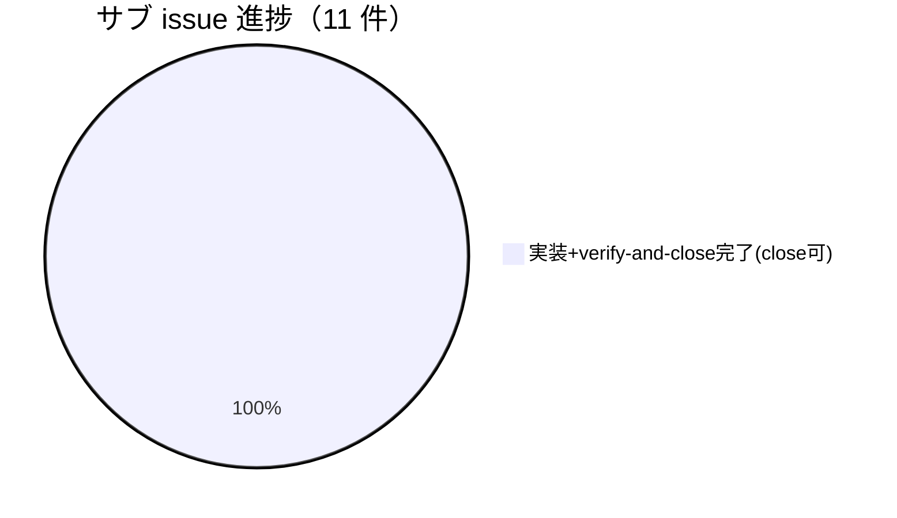

# Issue 一覧: agentsOS 汎用化・ポリシー統合

**プロジェクト名**: agentsOS 汎用化・ポリシー統合
**作成日**: 2026 年 07 月 11 日
**最終更新**: 2026 年 07 月 12 日（JST）（**親トップレベル issue 完了・close 移動実施**。親 issue のストーリー 1〜8 がすべて実装＋verify-and-close 完了し、配下のサブ issue 全 11 件も requirement-discovery→design-feature→review-docs→implement-feature→verify-and-close の全工程を完了して各 `04_review.md` が close 可の判定に到達した。リポジトリルートで `bash .agent-skill-chain/source/enforcement/ci/audit.sh .` を実行し **Audit passed（exit 0）**、`bash test/run-all.sh` は **17/17 PASS** を確認済み。トップレベル完了トリガー（配下の全サブ issue 完了＋親ストーリー完了）に合致したため、`docs/maintainer/workflow/close/20260711_015030_agentsOS汎用化_ポリシー統合/` へ `git mv` で移動し、相対リンクの深度補正を実施した。**git commit は本作業では行っていない**〔進行役が内容確認後にコミットする〕）

> **重要**: **このドキュメントは常に更新**: issue（またはタスク）の進捗状況、ステータス、優先度などの変更があった場合は、即座にこのドキュメントを更新してください。ドキュメントは「生きているドキュメント」として扱い、実装内容と常に同期させます。
>
> **用語**: [.agent-skill-chain/source/CONCEPTS.md §用語規約](../../../../../.agent-skill-chain/source/CONCEPTS.md#用語規約) を参照。

---

## 親 issue の状況

**ディレクトリ**: `docs/maintainer/workflow/close/20260711_015030_agentsOS汎用化_ポリシー統合/`（close 移動済み）

- `00_要求定義.md` 〜 `03_実装計画.md` すべて完成。8 ストーリー構成。
  - ストーリー 1〜7: system-graph 由来ポリシーの汎用化、workflow.db 強制記録の検討、fable-like 行動規範の統合（docs-only な新規ポリシードキュメント追加）
  - ストーリー 8: `.agents/` 名前空間衝突安全化（当初「単純改名」→ 最終的に「統合ネスト」＝ `.agents/`→`.agent-skill-chain/source/`・`.agents-project/`→`.agent-skill-chain/project/`・`.workflow/`→`.agent-skill-chain/runtime/` へ方針転換して実装）
- fable モデル（ストーリー 1〜7 の docs レビュー）および opus 監査（ストーリー 8 以降）による徹底レビュー・修正反復を実施。

### ストーリー 1〜7: 実装・レビュー完了

- **実装完了**（tasks1-7、sonnet 実装）。`.agent-skill-chain/source/` 配下に EFFORT_POLICY・PLATFORM_SAFETY_RESPONSE・AGENT_CONDUCT（新設）・CLOSEOUT・CONTEXT_EFFICIENCY・HEARTBEAT・enforcement/README・enforcement/DESIGN・skills/agent/run_command（追記）等のポリシードキュメントを追加。
- **verify-and-close 完了**（fable 監査）。1 回目監査で `workflow.db` 証跡不備 2 件（`ts_utc` 非 ISO8601・`changed_files_json` 不正 JSON）を検出 → 正規経路（`write-workflow-log.sh`）で是正 → 再検証し**指摘 0 件で収束**。`04_review.md` §1〜§15 に記録・書記記録済み。

### ストーリー 8: 実装・独立レビュー完了

ストーリー 8（`.agents/` 名前空間衝突安全化）は設計が複数回改訂され、最終的にユーザー決定（`02_設計.md §2.6.9`）で「統合ネスト案」を採用のうえ実装・独立レビューまで完了した。

1. **設計最終決定**（`02_設計.md §2.6.9`）: `.git/` の前例（システム領域とユーザーデータの同居は正規コマンド経由の操作が徹底されていれば許容）と安全な uninstall コマンドの必須化を踏まえ、統合ルート `.agent-skill-chain/{source,project,runtime}/`・所有区分可視化命名・安全な uninstall・README 警告・移行パスを確定。
2. **実装完了**（タスク 8＝9 サブタスク）: 統合ネスト（`git mv`）、配備マーカー・衝突検知（fail-closed、`scripts/lib/package-manifest.sh` 正本＋`src/agents-md.ts` ミラー）、フィンガープリント統合移行、`runUninstall` 安全拡張、122 件超の参照更新、README 警告設置、e2e 新規 BDD 7 項目を実装。
3. **独立レビュー完了**（opus / reasoning effort=max。story8 以降は opus 固定・fable 委譲禁止のユーザー明示指示に従う）: `04_review.md` T8 節に記録。fail-closed 境界を隔離環境 5 ケース（A/B/C/D1/D2）で敵対的検証し、**ブロッキング指摘 0 件で収束**。軽微指摘 1 件（SETUP.md 移行パス節欠落）は本レビューで直接是正、非ブロッキング課題 2 件（テスト頑健性・TS ミラー dead コード）のうち課題 2 は進行役判断でパリティ試験を新規追加して是正済み。
4. **インシデント是正記録**: `enforce on`（PreToolUse hook）が委譲ツール実名 `Agent` を許可リストに含まず orchestrator を完全ロックアウトした事故の恒久修正（commit `4358a0f`）を `04_review.md` に記録。

**現状**: ストーリー 1〜8 すべてが実装＋verify-and-close 完了。親トップレベル issue は完了し、close 移動を実施した。

---

## サブ issue 一覧（全 11 件・すべて完了）

下表は本親 issue（agentsOS 汎用化・ポリシー統合）配下のサブ issue 一覧である。**全 11 件が requirement-discovery→design-feature→review-docs→implement-feature→verify-and-close の全工程を完了し、各 `04_review.md` が close 可の判定に到達した。**

| 順 | サブ issue ディレクトリ名 | issue_id | 概要 | 優先度 | ステータス | リンク |
|----|---------------------------|----------|------|--------|------------|--------|
| 1 | npm公開中止_APM転換 | afa19b5b-0e1b-496d-acc0-23180f11f30c | npm 公開を取りやめ、Microsoft 公式 OSS [`microsoft/apm`](https://github.com/microsoft/apm)（Agent Package Manager）のパッケージ形式で配布する方針に確定（②配布チャネル変更を採用）。`platforms/apm/apm.yml`・`adapter_apm()`・`sync-version.sh` 拡張・`release.yml` の `apm-release` ジョブ・README/RELEASE/apm-package.md・tmp 隔離 E2E を実装 | 🔴 高 | **完了（実装＋verify-and-close 済み・close 可）。`04_review.md` §16 の再検証で指摘 3 件すべて解消を確認し総合評価 close可**。新設テスト `test-build-adapters-apm.sh`・`test-sync-version-apm.sh` を `run-all.sh` 登録済み | [詳細](./90_issues/20260711_024021_npm公開中止_APM転換/00_要求定義.md) |
| 2 | フィジビリティADR必須化 | a9c5404f-c2ac-40f7-b223-004cad769fb6 | 要件定義・設計フェーズでのフィジビリティ確認・一次情報調査・ADR 的意思決定記録を、執筆プロセス（process）として義務化する。greenfield のアーキテクチャ・規約決定への ADR 適用（ストーリー 5）を追加 | 🔴 高 | **完了（実装＋verify-and-close 済み）。`04_review.md` 作成・書記記録済み、本 issue スコープ内指摘 0 件で収束（AC-1〜11・SC-1〜7 全 18 項目を独立検証で充足）** | [詳細](./90_issues/20260711_055538_フィジビリティADR必須化/00_要求定義.md) |
| 3 | write-workflow-log_ts_utc検証 | 11059f78-5fdf-41a3-bc5c-ca1e978ec60a | `write-workflow-log.sh` の `TS_UTC`（第 4 引数）に ISO8601 形式バリデーションが無く契約違反値が INSERT される欠陥への恒久対策。INSERT 前の fail-fast バリデーションを追加 | 🟡 中 | **完了（実装＋verify-and-close 済み）。`04_review.md` 作成・書記記録済み、修正必須指摘 0 件（新規テスト PASS=44・既存無回帰を独立再実行で確認）** | [詳細](./90_issues/20260711_055602_write-workflow-log_ts_utc検証/00_要求定義.md) |
| 4 | システム仕様書完備強制テンプレート刷新 | b9ccf155-e7f1-4a9e-b087-001f0d148987 | **最上位目的＝「システム仕様書（`docs/`）が実装の変化に追随し、常に最新かつ正しい内容であることの継続的な強制」**。greenfield 必須文書化・enforcement 接続・ノイズ排除・テンプレート大規模刷新・close 前 docs レビュー必須化（継続追随ゲート） | 🔴 高 | **完了（実装＋verify-and-close 済み）。`04_review.md` 作成・書記記録済み、本 issue 起因 audit FAIL 0 件（SC-1〜8・AC 全項目を独立再検証で充足、#31 を tmp 隔離で再現）** | [詳細](./90_issues/20260711_061341_システム仕様書完備強制テンプレート刷新/00_要求定義.md) |
| 5 | workflowDB由来検知欠如是正 | 78423f63-e59c-457a-b02c-2a70148fa889 | `setup.sh` の `init_workflow_db`・`write-workflow-log.sh` が `.workflow/workflow.db` の由来を検証せず既存ファイルの存在確認のみでスキップする課題。setup 時点での軽量な警告表示を要件化 | 🟢 低 | **完了（実装＋verify-and-close 済み）。`04_review.md` 作成・書記記録済み、本 issue スコープ内指摘 0 件（単体 14/14・E2E 131/131 を独立再実行で PASS、常に return 0／非破壊／`set -e` 非中断を実測確認）** | [詳細](./90_issues/20260711_062125_workflowDB由来検知欠如是正/00_要求定義.md) |
| 6 | AGENT_ROLEスコープ是正 | 44c8f527-15c8-4b36-a3c2-1a97867d78ce | `enforce on`（PreToolUse hook）の `AGENT_ROLE=orchestrator` が全サブエージェントに継承され、委譲先 worker が実作業ツールを block される根本問題を是正。main の直接実作業ブロックを維持したまま worker が実作業できるロールスコープに是正 | 🔴 高 | **完了（実装＋verify-and-close 済み）。`04_review.md` 作成・書記記録済み、指摘 0 件（50 PASS/0 FAIL を独立再現、偽装耐性・全ロール不変・main 直接実作業ブロック非劣化を独立検証）。申し送り: `enforce on` を live 有効化する前に別 Claude Code インスタンスで実機確認（安全性・required）** | [詳細](./90_issues/20260711_171653_AGENT_ROLEスコープ是正/00_要求定義.md) |
| 7 | review-docs必須化 | a0bff62d-2e68-4384-a1cb-08a285c53e82 | 実装前ドキュメントレビュー（review-docs）を design-feature 完了後・implement-feature 着手前の必須ゲートとして全 issue で一律必須化。`PHASE_COMMAND_MAP`・`PHASES`・`run_command`・`enforcement`（review-docs 未実行検知 #32）を接続 | 🔴 高 | **完了（実装＋verify-and-close 済み）。`04_review.md` 作成・書記記録済み、本 issue 範囲の指摘 0 件（00 SC-1〜8・01 AC-1〜14 を独立検証で充足・#32 の 7 シナリオ全 PASS・grandfather 5 ケース＋env override を tmp 隔離で再現）** | [詳細](./90_issues/20260711_194044_review-docs必須化/00_要求定義.md) |
| 8 | write-workflow-logスキーマ移行冪等性是正 | 5dd2b887-3515-480e-afb8-5cd9d0989070 | サブ issue 3 の `04_review.md` が独立発見した既存不具合への対応。`write-workflow-log.sh` のスキーマ移行検知ブロック（Check-Then-Act の非アトミック構成）が反復・近接実行下で散発的に `duplicate column name` を起こし INSERT 失敗する問題を、冪等な `ensure_column` ヘルパーで是正 | 🟡 中 | **完了（実装＋verify-and-close 済み）。`04_review.md` 総合評価「合格（クローズ可）」、本 issue スコープ内の是正必須指摘 0 件（新規テスト `test-write-workflow-log-schema-idempotent.sh` T-1〜T-6・既存 4 テスト全通過・移行後スキーマ不変を確認）** | [詳細](./90_issues/20260712_004218_write-workflow-logスキーマ移行冪等性是正/00_要求定義.md) |
| 9 | audit監査31番tmp隔離検証恒久テスト化 | 465a44fc-f3db-469f-b3be-1464c555429c | サブ issue 4 の `04_review.md` §3.2・§10.2 で検出。`audit.sh` #31（`check_docs_review_evidence`）の FAIL/PASS/SKIP 判定を、`test-audit.sh` の隔離パターン（`make_min_tree`・`TMP_DIRS`・sqlite3 ガード）に倣い 7 ケース（A〜G）＋#5 非交差性の自動テストへ恒久化 | 🟢 低 | **完了（実装＋verify-and-close 済み）。`04_review.md` §7.1「close 可」、`test-audit.sh` に 8 アサート（A〜G＋#5 非交差）を追加、スコープ内指摘 0 件** | [詳細](./90_issues/20260712_004252_audit監査31番tmp隔離検証恒久テスト化/00_要求定義.md) |
| 10 | テンプレート相対リンク深度是正 | 1c89813b-42d0-4604-9621-9378f2bc90a8 | サブ issue 2・4 の `04_review.md` が独立検出した既知課題。Story8 の `.agents/`→`.agent-skill-chain/source/` 改名でパス文字列は機械置換されたが `../` 深度プレフィックスが旧構造のまま残存。`.agent-skill-chain/runtime/templates/` 配下 15 ファイルの genuine 深度不整合 54 件を A〜D グループ別ルールで是正 | 🟢 低 | **完了（実装＋verify-and-close 済み）。`04_review.md` にて grep+realpath 再実測で genuine unresolved 0 件・placeholder 18 件不変・本文不変を独立検証、close 可** | [詳細](./90_issues/20260712_004401_テンプレート相対リンク深度是正/00_要求定義.md) |
| 11 | test-audit_AGENTS_ROOT未追随是正 | a876f925-3cd9-4f88-ac6f-eb8e6af2ca6b | サブ issue 5・7 が検出した `test/test-audit.sh` シナリオ3 の偽陰性 FAIL の根本原因是正。原因は (1) 呼び出し元シェルの `AGENTS_ROOT` 環境変数汚染と (2) `audit.sh` 必須ファイルチェックの fail-open スキップの複合。`test-audit.sh` の env 隔離（unset）＋ `audit.sh` #1 の WARN 可視化で是正 | 🟡 中 | **完了（実装＋verify-and-close 済み）。`04_review.md` 総合評価「合格（クローズ可）」、AC-1〜AC-6 を実測充足。ENV-1/ENV-2 回帰シナリオを恒久化。既知の低重要度ドキュメントドリフト 1 件（00 §6 3 点目の字義・非ブロッカー）** | [詳細](./90_issues/20260712_004515_test-audit_AGENTS_ROOT未追随是正/00_要求定義.md) |

**Issue 詳細は各 issue ディレクトリ（`90_issues/{ディレクトリ名}/`）を参照すること。** 本ファイルは一覧・進捗・依存関係の index とする。

### サブ issue 1 件目（npm公開中止_APM転換）の経緯補足

当初は「APM 構想の 3 解釈候補（パッケージ名変更／配布チャネル変更／新コンセプト）」で要求・要件定義のみ完了していたが、その後 `https://github.com/microsoft/apm`（Microsoft 公式 OSS、Agent Package Manager）の実在を確認し、「①パッケージ名変更・③新コンセプト自作は却下、②配布チャネル変更を具体化し microsoft/apm のパッケージ形式で配布する」方針に確定した。fable レビューで指摘 25 → 8 → 0 件まで収束のうえ実装し、最終 verify-and-close（`04_review.md` §16 再検証）で指摘 3 件すべて解消を確認し close 可に到達した。

---

## 実装順ロードマップ（実績）

ユーザー指示に基づき、以下の順序で実装した（すべて完了）。

| 順 | 対象 | 概要 | 実績 |
|----|------|------|------|
| 1 | 親 issue ストーリー 1〜7 | docs-only な新規ポリシードキュメント追加。低リスク・並行実装可能 | 完了・指摘 0 件収束 |
| 2 | 親 issue ストーリー 8 | `.agents/` → `.agent-skill-chain/` 統合ネスト。setup.sh・src/agents-md.ts・122 件超に及ぶ変更 | 完了・独立レビュー指摘 0 件収束 |
| 3 | サブ issue（npm公開中止_APM転換） | apm.yml ドラフトが新パスを前提にするため、ストーリー 8 完了後に着手 | 完了・close 可 |
| 4 | 派生サブ issue 2〜11 | 各 04_review で発見された既存不具合・改善提案の責任完遂（CLOSEOUT.md §課題の責任完遂） | 全件完了・close 可 |

---

## 進捗状況

### 全体進捗

**サブ issue 全 11 件が requirement-discovery→design-feature→review-docs→implement-feature→verify-and-close の全工程を完了した**。各 issue に `00`〜`04` が揃い、`04_review.md` はいずれも close 可の判定（スコープ内の是正必須指摘 0 件）で収束・書記記録済みである。親 issue のストーリー 1〜8 もすべて実装＋verify-and-close 完了（指摘 0 件収束、`04_review.md` にストーリー 1〜7 章・T8 章・インシデント是正記録あり）。リポジトリルートで `bash .agent-skill-chain/source/enforcement/ci/audit.sh .` は **Audit passed（exit 0）**、`bash test/run-all.sh` は **17/17 PASS**。トップレベル完了トリガーに合致したため close 移動を実施した。

- **完了（実装＋verify-and-close 済・close 可）**: サブ issue **11 / 11**、親 issue ストーリー **1〜8 すべて**。
- **未完了・対象外・未着手**: 0 件。

### 優先度別進捗

- **高優先度（🔴）**: 5 / 5 完了（npm公開中止_APM転換・フィジビリティADR必須化・システム仕様書完備強制テンプレート刷新・AGENT_ROLEスコープ是正・review-docs必須化）
- **中優先度（🟡）**: 3 / 3 完了（write-workflow-log_ts_utc検証・write-workflow-logスキーマ移行冪等性是正・test-audit_AGENTS_ROOT未追随是正）
- **低優先度（🟢）**: 3 / 3 完了（workflowDB由来検知欠如是正・audit監査31番tmp隔離検証恒久テスト化・テンプレート相対リンク深度是正）
- **親 issue 本体**: ストーリー 1〜8 すべて完了（1 / 1）。

### 親 issue の close 判定

- **判定: close 移動を実施済み。** CORE §完了 issue の close 分離・PHASES §完了 issue の close 移動・`.agent-skill-chain/project/自己拡張ワークフロー.md §完了 issue の close 移動` のトリガー（トップレベル issue が完了したときのみ＝配下の全サブ issue 完了＋親ストーリー完了）に合致した。配下のサブ issue 全 11 件が close 可、親ストーリー 1〜8 が実装＋レビュー完了、`audit.sh` Audit passed・`run-all.sh` 17/17 PASS を確認のうえ、`git mv` で `docs/maintainer/workflow/close/20260711_015030_agentsOS汎用化_ポリシー統合/` へ移動し、成果物内の実 markdown リンクの深度を 1 階層分補正した（`自己拡張ワークフロー.md §close 移動時の相対リンク補正`）。close 後も git 追跡対象として残す（削除しない）。

---

## 申し送り（close 後のフォローアップ）

各サブ issue の `04_review.md` に記録された非ブロッキング事項のうち、close 後に留意すべきもの。

1. **`enforce on` の live 有効化前検証（サブ issue 6・required）**: `enforce on` を live で有効化する前に、「ハーネスが main へ agent_id を注入しない（ADR-3(d) 否定）」ことを別 Claude Code インスタンスで実機確認すること（安全性・最重要）。enforcement は既定 off の opt-in のため close 自体は妨げない。
2. **historical な `.agents/` 参照の保持**: 親 issue の `00`〜`04`・本 `90_issues.md` および各サブ issue の `00`〜`03` に残る旧名前空間 `.agents/`・`.agents-project/`・`.workflow/` への相対リンク参照は、Story8 の rename 時に「履歴の不変性を優先し当時の記述のまま保持」（`04_review.md` T8-4）と決定されたものであり、意図的に据え置いている。close 移動の深度補正はこれらの historical 参照を改変していない。
3. **git commit**: 本 close 作業（90_issues.md 更新・close 移動・リンク補正）は commit していない。進行役が内容確認後にコミットする。

---

## 参考資料

### プロジェクトドキュメント

このプロジェクトの全体ドキュメント：

- [`00_要求定義.md`](./00_要求定義.md) - 要求定義（本親 issue。agentsOS 汎用化・ポリシー統合）
- [`01_要件定義.md`](./01_要件定義.md) - 要件定義（8 ストーリー構成の BDD シナリオ）
- [`02_設計.md`](./02_設計.md) - 設計（§2.6.9 にストーリー 8 のネスト採用最終決定・ADR を記載）
- [`03_実装計画.md`](./03_実装計画.md) - 実装計画（タスク 1〜8。§2.8 はストーリー 8 のネスト実装計画）
- [`04_review.md`](./04_review.md) - レビュー書（ストーリー 1〜7 章・ストーリー 8（T8）章・インシデント是正記録を含む。すべて指摘 0 件で収束）

### その他の参考資料

- サブ issue 1 の前提: [`../close/20260616_144601_npm公開を今後の課題化_自動リリース現状無効化/`](../../close/20260616_144601_npm公開を今後の課題化_自動リリース現状無効化/00_要求定義.md)（npm 公開を「今後の課題」として保留する従来判断・close 済み）
- サブ issue 1 の一次情報: [microsoft/apm](https://github.com/microsoft/apm)（Microsoft 公式 OSS、Agent Package Manager）
</content>
