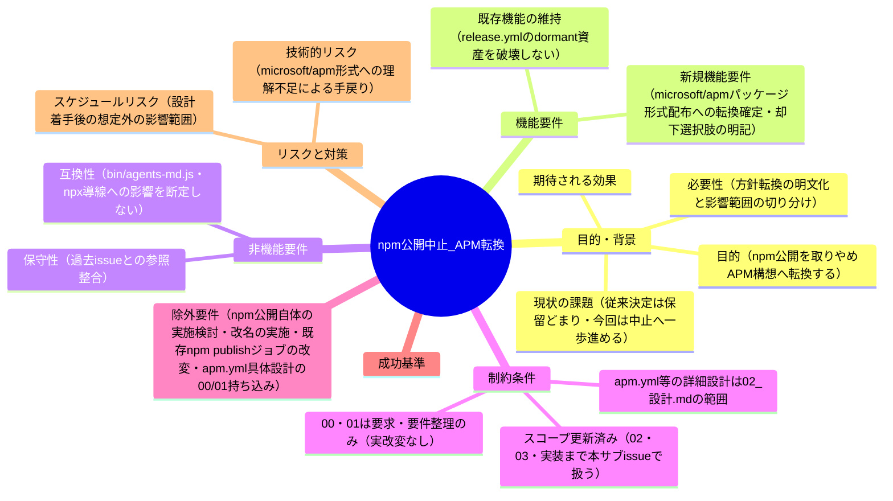
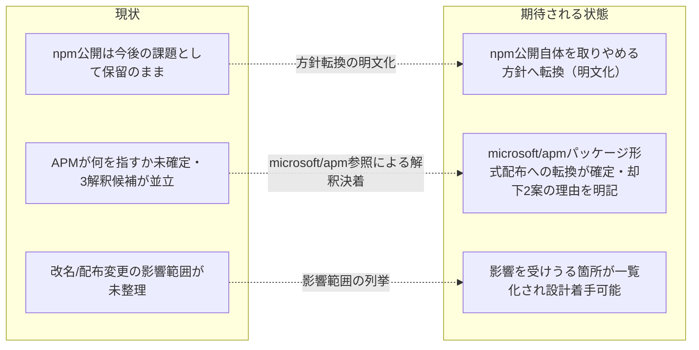

# 要求定義書: npm 公開を取りやめ、"APM (Agent Package Manager)" 構想へ転換する

**プロジェクト名**: npm 公開中止・APM (Agent Package Manager) 転換
**作成日**: 2026 年 07 月 11 日
**最終更新**: 2026 年 07 月 11 日

> **重要**:
>
> - 要求定義書は、プロジェクトの全体像を把握するためのものです。詳細な技術仕様や実装方法は要件定義書以降で記載します。必要最低限の情報に収めることを心掛けてください。
> - **このドキュメントは常に更新**: 要求の変更や追加があった場合は、即座にこのドキュメントを更新してください。ドキュメントは「生きているドキュメント」として扱い、実装内容と常に同期させます。
> - **必須項目**: 以下の「必須」と明記した項目は空欄・抽象語のみ（例: 「{説明}」のまま）で提出しないこと。判定可能な形（目的は1文・成功基準は○/×で判定できる記載等）で記入すること。
>
> **用語**: [.agents/CONCEPTS.md §用語規約](../../../../../../.agents/CONCEPTS.md#用語規約) を参照。

---

## 要求定義の全体像

**注意**:

- マインドマップは全体像を把握するためのものであり、詳細は本文の各セクションに記載する。

---

## 1. 目的・背景

### 1.1 目的（必須）

npm 公開を取りやめる方針を確定し、"APM (Agent Package Manager)" 構想への転換に必要な論点を整理する。

### 1.2 背景

- **現状の課題**:
  - 親 issue `20260711_015030_agentsOS汎用化_ポリシー統合`（agentsOS 汎用化・ポリシー統合）の作業中に、ユーザーから「npm での公開はやめる。代わりに APM (Agent Package Manager) としたい」という新たな方針転換の指示を受けた。
  - 過去に close 済みの issue [`20260616_144601_npm公開を今後の課題化_自動リリース現状無効化`](../../../../close/20260616_144601_npm公開を今後の課題化_自動リリース現状無効化/00_要求定義.md)（以下「前提 issue」）では、npm 公開のリスク（削除困難・名前の永久消費・誤 publish 事故）を踏まえ、**「今は公開しない」が「将来公開する可能性は残す」＝「今後の課題」として保留**する判断が下された。[`04_review.md`](../../../../close/20260616_144601_npm公開を今後の課題化_自動リリース現状無効化/04_review.md) では、この判断に基づき `release.yml` を**可逆 dormant 化**（`workflow_dispatch` のみ・`RELEASE_ENABLED` ゲート）し、README/RELEASE.md のトリガ記述を実態に整合させたことが独立検証済みである（SC-1〜SC-5 すべて OK）。
  - 今回の指示は、この「保留」判断をさらに一歩進め、**npm 公開自体を取りやめ、"APM (Agent Package Manager)" という新たな構想へ転換する**という、前提 issue とは異なる新しい方針である。前提 issue は npm publish を「配布方法の選択肢の一つ（③、公開リスク最大）」として位置づけたまま保留したが、今回はその③の選択肢自体を積極的に取り下げる可能性を示唆している。
  - ただし、ユーザーの発言（「npmでの公開はやめる。のでこのissueのサブで対応して。代わりにAPM (Agent Package Manager)としたい。」）は**簡潔で詳細が確定していない**。「APM」が何を指すか（パッケージ名変更か、配布チャネル変更か、新コンセプトとしての再定義か）は本文からは断定できなかった（詳細は §1.2 の論点A〜C を参照。論点A はその後ユーザー承認により決着済み）。

- **前提 issue で確定済みの事項（本 issue はこれらを否定しない）**:
  - npm 公開の公開リスク（削除困難・名前の永久消費・ローカル誤 publish 事故）は前提 issue で整理済みであり、本 issue でも有効な判断材料として引き継ぐ。
  - `release.yml` は既に dormant 化済み（`workflow_dispatch` のみ・`RELEASE_ENABLED` ゲート）であり、現状 main マージでは自動発火しない。本 issue（npm 公開の**中止**への転換）は、この dormant 資産を**破壊しない**ことを制約とする（§4.2）。
  - 配布方法の選択肢①〜④（GitHub 直接参照・GitHub Releases tarball・npm publish・GitHub Packages）の整理は前提 issue の 00 に存在する。今回の「APM」構想がこれら既存選択肢のいずれかの具体化なのか、新たな第 5 の選択肢なのかは、00 作成時点では不明点として扱った（その後の論点A 決着により、`microsoft/apm` パッケージ形式配布という**新たな配布経路の追加**として確定した。詳細は 02_設計）。

- **確定した方針（ユーザー承認済み・2026-07-11）**: 当初は「APM (Agent Package Manager)」の意味について 3 つの解釈候補（①パッケージ名変更／②配布チャネル変更／③新コンセプト・新ツールとしての自作）を提示し断定を避けていたが、ユーザーが実在する Microsoft 公式 OSS [`microsoft/apm`](https://github.com/microsoft/apm)（Agent Package Manager, MIT license）と [Zenn 記事](https://zenn.dev/hirayuki/articles/66d27a9a1cfb89)を参照した上で、以下の方針を承認した。
  - **① パッケージ名の変更 → 却下**: 「APM」を名乗る独自ツール・パッケージ名への改名は、Microsoft 公式 OSS `microsoft/apm` と名称が衝突するため採用しない。
  - **③ 新コンセプト・新ツールとしての自作 → 却下**: 独自の「Agent Package Manager」を自作することは、既に `microsoft/apm` が同種の機能（宣言的マニフェスト・ロックファイル・セキュリティスキャン・ポリシーガバナンス）を公式提供しており、車輪の再発明になるため採用しない。
  - **② 配布チャネルの変更 → 採用（具体化・確定）**: 本パッケージの配布を npm 公開ではなく、`microsoft/apm` のパッケージ形式で配布できるようにする方向へ転換する（例: `apm install <org>/AGENTS.md` のような形での配備を可能にする）。当初の解釈②「配布チャネル変更」を、`microsoft/apm` という具体的な配布基盤に絞り込んだ確定版である。
  - **論点A（決着済み）: 「APM (Agent Package Manager)」が何を意味するか。**
    - `microsoft/apm` は Microsoft 公式の OSS「Agent Package Manager」（MIT license、⭐3,163、2026-07-10 も更新継続中）であり、`apm.yml` マニフェスト＋`apm.lock.yaml` ロックファイルで、Copilot/Claude Code/Cursor/OpenCode/Codex/Gemini/Windsurf/Kiro 向けに instructions・skills・prompts・agents・hooks・plugins を宣言的に配布・再現するツールである。セキュリティスキャン（hidden Unicode 検知等）とポリシーガバナンス（`apm-policy.yml`）を備える。README に「Built on open standards: AGENTS.md · Agent Skills · MCP」と明記されており、本パッケージが定義する AGENTS.md 標準を基盤にしている。
    - 参照した Zenn 記事の知見: 個人利用なら GitHub CLI の `gh skill` で十分だが、チーム規模の設定配布・ガバナンスには APM が適切、という結論。
    - **確定した位置づけ**: agent-skill-chain（本パッケージ）と `microsoft/apm` は**競合ではなく補完関係**である。
      - **`microsoft/apm`** = 配布・インストール層（設定をどのマシン・どのツールにも再現する）
      - **agent-skill-chain（本パッケージ）** = 実行契約・ワークフロー層（配備後に orchestrator/worker がどう振る舞うか。フェーズ・skill chain・enforcement）
    - **確定した対応方針**: 「APM」を名乗る独自ツールを自作することはしない（名称衝突・車輪の再発明のため却下）。代わりに、npm 公開（`npx agent-skill-chain init`）をやめ、**本パッケージを `microsoft/apm` のパッケージ形式で配布できるようにする**方向（例: `apm install <org>/AGENTS.md` のような形でのインストールを可能にする）へ転換する。
  - **論点B: 既存の `bin/agents-md.js`（CLI コマンド名 `agents-md`）・`npx agent-skill-chain init` 導線への影響範囲。** 断定はできないが、**影響を受けうる箇所**として次を列挙する（実際に変更が必要かは設計フェーズで判断する）。
    - `package.json` の `name`（`agent-skill-chain`）・`bin`（`agents-md`）・`repository`/`homepage`/`bugs` の各 URL。
    - `README.md` §導入（`npx agent-skill-chain init` 等の導線・サブコマンド一覧・版のピン留め手順）。
    - `docs/maintainer/RELEASE.md`（npm publish 手順の詳細正本・`agent-skill-chain` という名称を前提にした記述多数）。
    - `.github/workflows/release.yml`（dormant 化済みだが、`npm publish` ジョブ・`NPM_TOKEN` ゲート等がパッケージ名を前提に組まれている）。
    - `src/agents-md.ts`（CLI 本体。`agent-skill-chain` という文字列参照の有無は未調査であり、設計フェーズで grep 確認が必要）。
    - `docs/maintainer/adapters.md`・`.agents/SETUP.md`・`docs/maintainer/claude-hook-e2e.md`（`agent-skill-chain` への言及あり。設計フェーズで影響有無を確認）。
    - `.claude-plugin/marketplace.json` 等の Claude marketplace 副導線（npm 主導線とは別経路だが、パッケージの呼称変更が波及しうるか未確認）。
  - **論点C: 前提 issue の dormant 化資産（`release.yml` の可逆設計・SHA ピン・`NPM_TOKEN` ゲート等）を、npm 公開中止後も保持するか、それとも npm publish ジョブ自体を削除・別方式へ置換するか。** 前提 issue は「将来の再開」を前提に dormant 化したが、npm 公開自体を中止し `microsoft/apm` 形式配布へ転換する場合、この「再開」の意味が変わる（npm への再開ではなく、`microsoft/apm` パッケージ形式への新規移行になる）。本 00 の作成時点では判断せず設計フェーズへ委ねた（その後 [`02_設計.md`](./02_設計.md) §2.6.4 で「既存 dormant 資産（`release-npm`/`release-marketplace` ジョブ・ゲート）は無改変で保持し、同一ゲート配下に `apm-release` ジョブを追加する」と決着済み）。

### 1.3 期待される効果（必須: 1 件以上）

- **効果 1**: npm 公開を「今後の課題として保留」から一歩進め、「npm 公開自体を取りやめる」という新方針への転換が要求として明文化され、過去 issue（前提 issue）との関係（否定ではなく発展）が 00 に明記される（達成判定: §1.2 に前提 issue への相対リンクと関係性の説明があるか）。
- **効果 2**: 「APM (Agent Package Manager)」という語の曖昧さが、実在する Microsoft 公式 OSS `microsoft/apm` の参照により解消され、3 つの解釈候補のうち①パッケージ名変更・③新コンセプト自作は却下、②配布チャネル変更（`microsoft/apm` パッケージ形式への転換）が採用方針として 00・01 双方に明記される（達成判定: §1.2 論点A に決着内容と却下理由が記載され、01 の該当ストーリー・受け入れ基準にも反映されているか）。
- **効果 3**: 既存の `bin/agents-md.js`・`npx agent-skill-chain init` 導線への影響を受けうる箇所が、断定せず一覧化され、後続の設計フェーズでの調査対象が明確になる（達成判定: §1.2 論点B に影響を受けうる箇所の一覧があるか）。

**現状と期待される状態の比較**（必要に応じて）:

---

## 2. 機能要件

### 2.1 既存機能の維持（該当する場合）

- 前提 issue で構築・検証済みの dormant 化資産（`release.yml` の `workflow_dispatch` のみ化・`RELEASE_ENABLED` ゲート・SHA ピン・`NPM_TOKEN` ゲート・README/RELEASE.md の整合記述）は、本 issue（要求・要件フェーズ）では**変更しない**。破壊せず維持する。

### 2.2 新規機能要件

- **A. 方針転換の明文化**: npm 公開を「今後の課題として保留」から「取りやめる」への転換を要求として記載し、前提 issue との関係（否定ではなく発展的な方針転換）を明記する。
- **B. APM 構想の解釈決着と却下理由の明記**: 「APM (Agent Package Manager)」が指しうる 3 つの解釈候補（①パッケージ名変更／②配布チャネル変更／③新コンセプト・新ツールとしての自作）のうち、①・③を却下しその理由（名称衝突・車輪の再発明）を明記した上で、②を `microsoft/apm` パッケージ形式配布への転換として具体化・採用したことを 00 に記載する。
- **C. 影響を受けうる箇所の列挙**: `bin/agents-md.js`・`npx agent-skill-chain init` 導線を含む、方針転換の影響を受けうるファイル・記述箇所を、実際の変更要否を判断せず一覧化する。
- **D. 確定方針の01への反映**: 上記 B の確定方針・却下理由と C の影響範囲を 01_要件定義.md のユーザーストーリー・受け入れ基準・BDD シナリオへ反映する。ただし apm.yml 等の具体的なファイル内容・API 詳細設計は 02_設計.md の範囲とし、本 issue（00・01）では扱わない。

---

## 3. 非機能要件

### 3.1 パフォーマンス

- 特段の性能要件はない。ドキュメント中心の要求・要件整理である。

### 3.2 セキュリティ

- 前提 issue で整理された npm 公開リスク（削除困難・名前の永久消費・ローカル誤 publish 事故）の判断材料を否定せず引き継ぐ。方針転換によりこれらのリスクが解消される方向（公開自体をやめる）であることを明記する。

### 3.3 互換性

- 前提 issue の dormant 化資産（`release.yml`・README・RELEASE.md の整合済み記述）と非破壊で両立すること。要求・要件フェーズでは実改変を行わない。実装フェーズでも既存ジョブ・ゲート・npm publish 手順の記述は無改変とし、追加・並記のみ行う（02_設計 §2.6.4・03_実装計画 タスク5〜7）。

### 3.4 保守性

- 論点A（APM の解釈。決着済み）・論点B（影響範囲）・論点C（dormant 資産の扱い）を明確に切り分けて記録し、後続の設計フェーズが同じ論点を再調査せずに着手できる状態にする。

---

## 4. 制約条件

### 4.1 技術的制約

- 本 issue は当初 `requirement-discovery`（00・01 の作成）のみを扱う計画だったが、論点A（APM の解釈）のユーザー承認による決着を受けて、**同一サブ issue 内で設計（02_設計.md）・実装計画（03_実装計画.md）・実装フェーズまで扱う**（スコープ更新: 2026-07-11。00・01 の成功基準 §6 は要求・要件フェーズの達成判定として変更しない）。apm.yml 等の具体的なファイル内容・API 詳細設計は 02_設計.md が担い、00・01 では扱わない。
- 推測で仕様を断定しない。論点A は決着済みとして記載し、論点B・C は 00・01 の時点では「不明点・要確認事項」として明記した（その後 02_設計 §2.6.4 で論点C＝dormant 資産は無改変保持＋apm-release ジョブ追加、§2.6.4 表で論点B＝影響箇所ごとの対応方針、として決着済み）。

### 4.2 既存システムとの互換性

- 前提 issue の成果（dormant 化された `release.yml`、README/RELEASE.md の整合記述）を否定・破壊しない。本 issue は前提 issue の判断（「今は公開しない」）をさらに発展させた「公開自体を取りやめる」という方針転換であり、前提 issue の技術的成果（可逆 dormant 化の仕組み自体）は引き続き有効な参照物として扱う。

### 4.3 移行期間・スケジュール

- 論点A（APM の解釈）はユーザー確認により決着済み。`microsoft/apm` パッケージ形式配布への具体設計（apm.yml 相当のマニフェスト内容等）は、本サブ issue の後続フェーズ（[`02_設計.md`](./02_設計.md)・[`03_実装計画.md`](./03_実装計画.md)。作成済み）で対応する。

---

## 5. 除外要件

- npm 公開の実施・再開の検討（本 issue は「取りやめる」方向への転換であり、公開実施の検討は対象外）。
- パッケージ名・CLI コマンド名の実改名（①パッケージ名変更は却下済みのため実施しない。設計・実装フェーズでも対象外）。
- 要求・要件フェーズ（00・01）での実改変（00・01 作成時点では `release.yml`・`package.json`・README・RELEASE.md 等を一切改変しない。**実装フェーズでは** 03_実装計画のタスクとして `release.yml` への `apm-release` ジョブ**追加**・README/RELEASE.md の改訂を行うが、既存の npm publish ジョブ・dormant ゲート・`package.json` の改変は引き続き対象外＝02_設計 §2.6.4）。
- `apm.yml` 相当のマニフェスト・`apm.lock.yaml` 相当のロックファイルの具体的なファイル内容・API 詳細設計を 00・01 で扱うこと（設計フェーズ＝02_設計.md の範囲）。
- 04_review.md の作成（実装完了前のため作成しない。実装完了後の verify-and-close でのみ作成する）。

---

## 6. 成功基準（必須: 1 件以上）

- **SC-1**: npm 公開を「取りやめる」という方針転換が、前提 issue（保留判断）との関係を明記した上で 00 に記載されている（○/×: §1.2 に前提 issue への相対リンクと関係性の説明があるか）。
- **SC-2**: 「APM (Agent Package Manager)」の 3 つの解釈候補（パッケージ名変更／配布チャネル変更／新コンセプト再定義）のうち、①・③が却下理由とともに明記され、②が `microsoft/apm` パッケージ形式配布への転換として確定・具体化されている旨が 00・01 双方に記載されている（○/×: 00 §1.2 に決着内容・却下理由・参照元 URL があり、01 のストーリー・受け入れ基準にも反映されているか）。
- **SC-3**: `bin/agents-md.js`・`npx agent-skill-chain init` 導線への影響を受けうる箇所が、断定せず一覧化されている（○/×: 00 §1.2 論点B に一覧があるか）。
- **SC-4**: 01_要件定義.md に、確定方針（`microsoft/apm` パッケージ形式配布への転換）に基づく BDD シナリオが記載され、apm.yml 等の具体的なファイル内容・API 詳細設計には踏み込んでいない（○/×: 01 の BDD シナリオが確定方針を前提とし、かつ設計フェーズの範囲に踏み込んでいないか）。
- **SC-5**: 親ワークフロールートに `90_issues.md` が作成され、本サブ issue へのリンク・概要が記載されている（○/×: `90_issues.md` が存在し本 issue への参照があるか）。

---

## 7. リスクと対策

### 7.1 技術的リスク

- **リスク**: `microsoft/apm` の実際の仕様（`apm.yml`・`apm.lock.yaml` のスキーマ、`apm install` の挙動等）を十分に調査しないまま設計フェーズへ進み、後で仕様誤認による手戻りが発生する。
  - **対策**: 00・01 では `microsoft/apm` の概要（配布層としての位置づけ・宣言的マニフェスト・ロックファイル・セキュリティスキャン・ポリシーガバナンスの存在）のみを確定事実として記載し、具体的なファイル内容・API 詳細は 02_設計.md で `microsoft/apm` の公式ドキュメント・リポジトリを一次情報として調査した上で設計する。
- **リスク**: 影響を受けうる箇所（論点B）の列挙が不完全で、後続フェーズで見落としが発生する。
  - **対策**: 本 00 作成時点で grep により関連ファイルを機械的に洗い出し、一覧化する（§1.2 論点B）。設計フェーズで再確認する前提とする。

### 7.2 スケジュールリスク

- **リスク**: `microsoft/apm` パッケージ形式配布への具体設計（apm.yml 相当のマニフェスト設計等）が長期化し、親 issue（agentsOS 汎用化）の進行が本サブ issue の設計・実装フェーズにより停滞する。
  - **対策**: 本サブ issue は各フェーズ（要求・要件／設計／実装計画／実装）を独立して完結させ、その間も親 issue の他の作業（reasoning effort・enforcement 拡張等の他系統）は並行して進められることを前提とする（本サブ issue は親 issue の他系統をブロックしない独立した論点である）。

---

## 8. 参考資料

### プロジェクトドキュメント

- 前提 issue: [`../../../close/20260616_144601_npm公開を今後の課題化_自動リリース現状無効化/00_要求定義.md`](../../../../close/20260616_144601_npm公開を今後の課題化_自動リリース現状無効化/00_要求定義.md) — npm 公開を「今後の課題」として保留し、`release.yml` を dormant 化する判断の要求定義。
- 前提 issue: [`../../../close/20260616_144601_npm公開を今後の課題化_自動リリース現状無効化/04_review.md`](../../../../close/20260616_144601_npm公開を今後の課題化_自動リリース現状無効化/04_review.md) — dormant 化・README/RELEASE.md 整合の独立検証結果（SC-1〜SC-5 すべて OK）。
- 親 issue: [`../../00_要求定義.md`](../../00_要求定義.md) — agentsOS 汎用化・ポリシー統合（本サブ issue の親ワークフロー）。

### その他の参考資料

- [`../../../../../../package.json`](../../../../../../../package.json)（`name: agent-skill-chain`・`bin: agents-md`・`publishConfig.access: public`）
- [`../../../../../../README.md`](../../../../../../../README.md) §導入（npm 主導線・`npx agent-skill-chain init` 等のサブコマンド導線）
- [`../../../../../../docs/maintainer/RELEASE.md`](../../../../../../../docs/maintainer/RELEASE.md)（npm publish 手順の詳細正本）
- [`../../../../../../.github/workflows/release.yml`](../../../../../../../.github/workflows/release.yml)（dormant 化済みの自動リリース定義）
- [`../../../../../../src/agents-md.ts`](../../../../../../../src/agents-md.ts)（CLI 本体・改名時の影響調査対象）
- [`https://github.com/microsoft/apm`](https://github.com/microsoft/apm) — Microsoft 公式 OSS「Agent Package Manager」（MIT license）。`apm.yml`/`apm.lock.yaml` による宣言的配布・セキュリティスキャン・ポリシーガバナンスを提供。本方針転換で採用する配布形式の一次情報源。
- [`https://zenn.dev/hirayuki/articles/66d27a9a1cfb89`](https://zenn.dev/hirayuki/articles/66d27a9a1cfb89) — `microsoft/apm` の紹介記事（Zenn）。個人利用は `gh skill`、チーム規模の配布・ガバナンスには APM が適切、という知見の参照元。

---

## 9. 次のステップ

この要求定義書の承認後、以下のドキュメントを作成します：

- **次**: [`01_要件定義.md`](./01_要件定義.md) - 要件定義フェーズ
