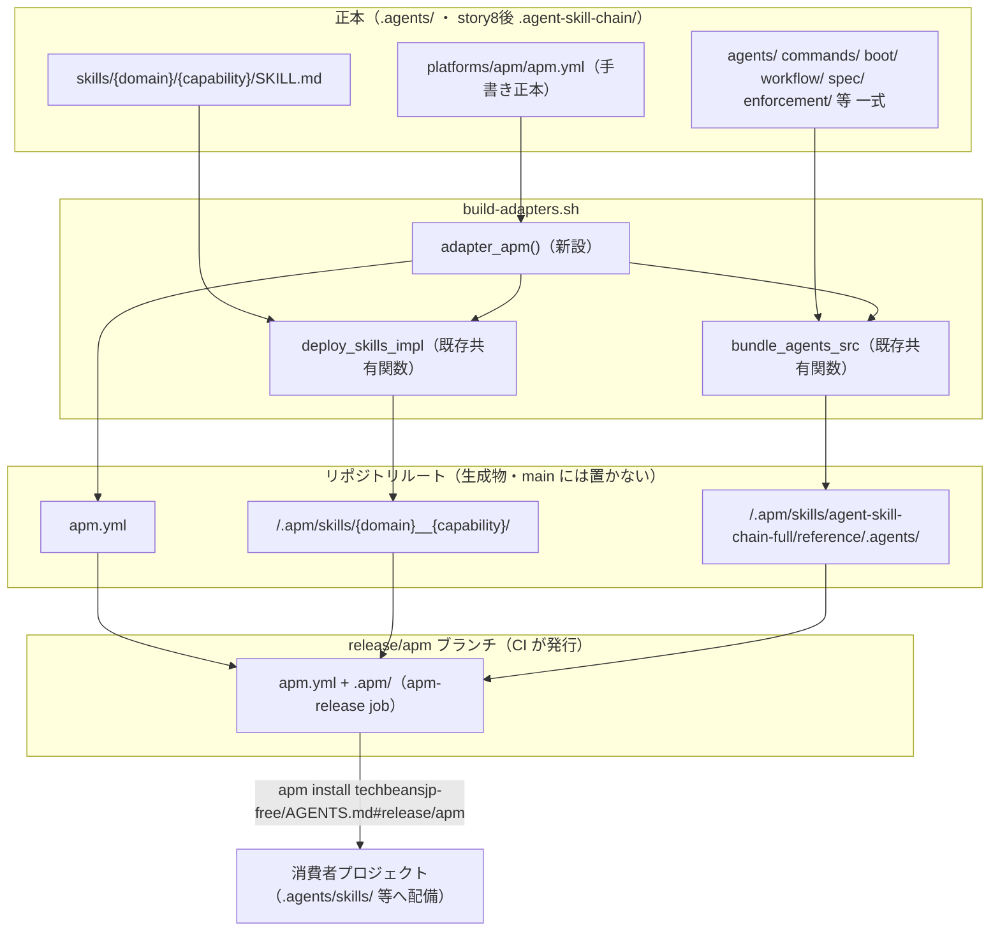
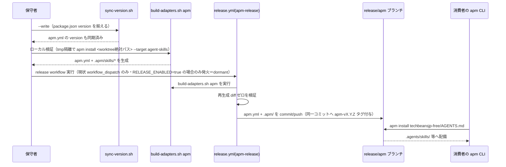
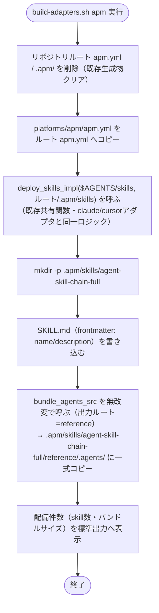

# 設計書: npm 公開中止・APM (Agent Package Manager) 転換

**プロジェクト名**: npm 公開中止・APM (Agent Package Manager) 転換
**作成日**: 2026 年 07 月 11 日
**最終更新**: 2026 年 07 月 11 日

> **重要**: **このドキュメントは常に更新**: 設計の変更や追加があった場合は、即座にこのドキュメントを更新してください。ドキュメントは「生きているドキュメント」として扱い、実装内容と常に同期させます。
>
> **用語**: [.agents/CONCEPTS.md §用語規約](../../../../../../.agents/CONCEPTS.md#用語規約) を参照。

---

## 0. 一次情報調査（設計着手前・必須）

推測で設計しないため、着手前に `microsoft/apm`（Agent Package Manager, MIT license）の公式ドキュメントを WebFetch で実際に取得した。取得日はすべて **2026-07-11**。

### 0.1 取得した一次情報

| # | URL | 取得内容 |
|---|-----|---------|
| 1 | `https://microsoft.github.io/apm/reference/manifest-schema/`（raw: `https://raw.githubusercontent.com/microsoft/apm/main/docs/src/content/docs/reference/manifest-schema.md`） | `apm.yml` の正式スキーマ（v0.3 Working Draft）。全トップレベルフィールド・`dependencies`・`target`/`targets`・`includes`・`marketplace:` ブロック・lockfile 契約。 |
| 2 | `https://microsoft.github.io/apm/reference/package-types/` | 5 種類のパッケージレイアウト（APM Package／Skill Bundle／Skill Collection／Hook Package／Plugin Collection）。 |
| 3 | `https://microsoft.github.io/apm/quickstart`（`getting-started/quick-start/` からリダイレクト） | `apm init`／`apm install`／生成される `apm.yml`・`apm.lock.yaml`・`apm_modules/` の実例、コミット対象表。 |
| 4 | `https://microsoft.github.io/apm/reference/targets-matrix/` | 対応ハーネス一覧（Copilot/Claude/Cursor/Codex/Gemini/Windsurf/Kiro/OpenCode/Antigravity。ほか実験的 openclaw）とプリミティブ別配備パス。 |
| 5 | `https://raw.githubusercontent.com/microsoft/apm/main/docs/src/content/docs/reference/cli/install.md` | `apm install` の CLI リファレンス（`PACKAGE_REF` の形式・`local_path_form` 対応・`--target`・exit code）。 |
| 6 | `https://raw.githubusercontent.com/microsoft/apm/main/docs/src/content/docs/consumer/install-packages.md` | 消費者向け `apm install` ウォークスルー。ローカルパス依存 `./packages/my-shared-skills` の実例。 |
| 7 | `https://raw.githubusercontent.com/microsoft/apm/main/docs/src/content/docs/producer/repo-shapes.md` | Producer 側のリポジトリ構成（single-plugin／aggregator／monorepo-hybrid）。 |
| 8 | `https://raw.githubusercontent.com/microsoft/apm/main/docs/src/content/docs/producer/author-primitives/skills.md` | skill プリミティブの正式フォルダ規約・frontmatter 契約・ターゲット別配備パス表。 |
| 9 | `https://raw.githubusercontent.com/microsoft/apm/main/docs/src/content/docs/producer/author-primitives/hooks-and-commands.md` | hooks／commands プリミティブの正式仕様（`.apm/commands/` は**存在しない**。コマンドは `prompts` と同一ソース）。 |
| 10 | `https://raw.githubusercontent.com/microsoft/apm/main/docs/src/content/docs/producer/author-primitives/instructions-and-agents.md` | instructions／agents プリミティブの正式フォルダ規約・frontmatter・コンパイル先。 |
| 11 | `https://raw.githubusercontent.com/microsoft/apm/main/docs/src/content/docs/producer/pack-a-bundle.md` | `apm pack` の出力構造と、**`apm install` が実際にスキャンするパス**（`.apm/<type>/` のみ。ルート規約ディレクトリは pack はできても install で拾われない場合がある）。 |

### 0.2 設計に直結する重要事実（推測せず一次情報のまま記載）

1. **`apm.yml` の必須フィールドは `name`・`version` のみ**。他はすべて OPTIONAL（manifest-schema §2）。
2. **パッケージ本体は `.apm/<type>/` という型付きサブディレクトリに置く**（`skills/`・`agents/`・`instructions/`・`prompts/`・`hooks/`）。`apm.yml` と `.apm/` は**リポジトリルートの兄弟**として置く（package-types・pack-a-bundle）。
3. **`includes: auto`** を `apm.yml` に明記すると、ローカル `.apm/` 配下の内容を配布物として明示的に同意したことになる（新規プロジェクトの既定。manifest-schema §3.9）。
4. **`apm install <PACKAGE_REF>` はローカルパス参照をサポートする**（CLI 引数としては `./path`・`/abs/path`・`~/path` が明記されている＝cli/install.md。`../path` 形式は依存宣言（manifest-schema §4.1.1）の例にのみ登場する）。GitHub タグを切らずに tmp 隔離環境でローカル検証できることを確認済み（§6 テスト戦略で使用）。**ターゲット決定の優先順位は `--target` フラグ＞消費者側 apm.yml の `targets:`＞設定既定＞auto-detect であり、ハーネスマーカー（`.github/`・`.claude/` 等）が無い空ディレクトリでは auto-detect が失敗し exit 2 になる**（cli/install.md）。空の消費者プロジェクトでの検証には `--target` の明示が必須。
5. **skill プリミティブが最も互換性が高い**（reference/author-primitives/hooks-and-commands.md 「Reach for a skill... reaches every harness」）。`.apm/skills/<name>/SKILL.md` は claude・kiro を**除く**各ターゲット（copilot/cursor/codex/gemini/opencode/windsurf/antigravity、および汎用 agent-skills ターゲット）が共通で `.agents/skills/<name>/SKILL.md` に収束し、claude・kiro のみ自ハーネス直下（`.claude/skills/`・`.kiro/skills/`）に配備される（author-primitives/skills.md・targets-matrix）。skill フォルダは丸ごとコピーされる（folder-copy。`scripts/`・`references/` 等の同梱物も展開される）。なお SKILL.md frontmatter の `name` 契約は「小文字英数字とハイフンのみ・親ディレクトリ名と一致」であり、本パッケージの配備名 `{domain}__{capability}`（アンダースコア含み）はこの命名規約から外れる（許容可否は §6.2・03 タスク9 で実機確認する）。
6. **`.apm/commands/` というディレクトリは存在しない**。スラッシュコマンドは `prompts` プリミティブと同一ソース（`.apm/prompts/<name>.prompt.md`）であり、`description`/`allowed-tools`/`model`/`argument-hint`/`input` という短いプロンプト向け frontmatter を要求する（hooks-and-commands.md）。
7. **instructions プリミティブ（`.apm/instructions/*.instructions.md`）は `description`・`applyTo`（glob）frontmatter を持つルール**であり、`applyTo` 付きは各ハーネスのルールディレクトリ（`.claude/rules/` 等）へ、`applyTo` 無しの無条件ルールはコンパイル済みコンテキストファイルへ fold される（instructions-and-agents.md）。apm のコンパイルは **消費者の `AGENTS.md`/`CLAUDE.md` 自体を生成**する（`target: copilot` → ルートに `AGENTS.md`、`target: claude` → ルートに `CLAUDE.md` を emit＝manifest-schema §3.6。上書きモードは `compilation.agents_md` の `full`（既定・ファイル全体を上書き）／`managed_section`（`<!-- apm:start -->`〜`<!-- apm:end -->` マーカー間のみ置換）＝manifest-schema §6.2）。これは本パッケージが現在採用している「AGENTS.md/CLAUDE.md を正本ファイルとしてそのまま配布する」方式とは異なる（apm はコンパイル生成、本パッケージは検証済みの完成ファイルをそのまま配布）。
8. **agents プリミティブ（`.apm/agents/<name>.agent.md`）は「ユーザーが `@name` で明示的に呼び出すペルソナ」**（model/tools/color frontmatter 付き）であり、Windsurf・Kiro・Gemini には配備されない（instructions-and-agents.md）。
9. **`apm pack`（liberal）と `apm install`（strict）でスキャン範囲が異なる**。`apm install` が実際にスキャンするのは `instruction`=`.apm/instructions/*.instructions.md`・`command(prompt)`=`.apm/prompts/*.prompt.md`・`hook`=`.apm/hooks/*.json`（`hooks/*.json` も可）・`agent`=`.apm/agents/**/*.agent.md`（ルート `*.agent.md` も可）・`skill`=`.apm/skills/<name>/SKILL.md`（ルート `skills/<name>/SKILL.md` も可）のみ（pack-a-bundle.md 「Source layout and install-time discovery」表）。ルート規約ディレクトリに置いても `apm install` で無言で欠落するプリミティブがあるため、**配布物は必ず `.apm/<type>/` に置く**方針を採る。

これらの事実に基づき、以下の設計判断はすべて一次情報を根拠とする（§2.6 に設計判断の要約を記載）。

---

## 1. 設計概要

### 1.1 設計方針

npm 公開（`npx agent-skill-chain init`）を一次配布導線から外し、`microsoft/apm` のパッケージ形式（`apm.yml` ＋ `.apm/` 型付きサブディレクトリ）で本パッケージのスキルを配布可能にする。§0.2 の一次情報に基づき、**v1 スコープは skills プリミティブのみを apm ネイティブ配備し、agents/commands(prompts)/instructions/hooks は意味論的な差異（§2.6）を理由に本 issue では対象外とし、後続 issue へ申し送る**。ただし「`.agents/` 一式が展開できる」という 01 の受け入れ基準を満たすため、`.agents/`（story8 後は `.agent-skill-chain/`）全体を 1 つの skill バンドルとして同梱し、参照コンテキストとして展開できるようにする（§3.1）。

### 1.2 設計原則（本プロジェクトで適用するもの）

- **単一責務**: `apm.yml`（メタデータ宣言）・`.apm/`（apm 配布用生成物）・既存 `.adapters/`（Claude/Cursor 配備用生成物）・`bin/agents-md.js`（自己インストール CLI）はそれぞれ単一の責務を持ち、混在させない。
- **明確な境界**: 「apm ネイティブプリミティブとして配備するもの（skills）」と「参照コンテキストとしてバンドルするもの（`.agents/` 一式）」を明確に分離する（§3.1・§3.2）。
- **AIフレンドリー設計**: `build-adapters.sh` の既存共有関数（`deploy_skills_impl`／`bundle_agents_src`）を再利用し、apm 用のロジックを重複定義しない（小さな差分・明確な責務）。

---

## 2. アーキテクチャ設計

### 2.1 責務・境界・参照関係

#### 2.1.1 責務一覧

| コンポーネント | 責務（1 文） |
|---|---|
| `.agents/platforms/apm/apm.yml`（新設・手書き正本） | apm パッケージのメタデータ（`name`/`version`/`description`/`includes` 等）を宣言する。 |
| `build-adapters.sh` の `adapter_apm()`（新設） | 正本 `.agents/`（story8 後 `.agent-skill-chain/`）から、決定性のある手順で repo ルート直下に `apm.yml` と `.apm/` を生成する。 |
| `.apm/skills/{domain}__{capability}/`（生成物） | 既存 `deploy_skills_impl` を再利用し、apm skill プリミティブとして個々のスキルを配備する。 |
| `.apm/skills/agent-skill-chain-full/`（生成物） | `.agents/`（story8 後 `.agent-skill-chain/`）一式を 1 つの skill バンドルとして同梱し、「`.agents/` 一式が展開できる」（01 の受け入れ基準）を満たす。 |
| `release.yml` の `apm-release` ジョブ（新設） | release workflow 実行時に `apm.yml`＋`.apm/` を決定性検証のうえ `release/apm` ブランチへ発行する。既存 release.yml のトリガ（現状 dormant＝`workflow_dispatch` のみ・`RELEASE_ENABLED` ゲート。再開後は main への push＝案C）に相乗りし、独自トリガを追加しない。現状は自動発火しない。 |
| `sync-version.sh`（拡張） | `package.json`／`plugin.json`／`apm.yml` の version 三者同期を担保する。 |
| `bin/agents-md.js`・`package.json`（既存・変更なし） | 自己インストール／開発ツールチェーン（`npm run build`/`test`）としては維持する。npm registry への公開導線としての役割のみ降格する（§2.6.4）。 |
| README.md／`docs/maintainer/RELEASE.md`（改訂） | `apm install` を一次配布導線として案内し、`npx agent-skill-chain init` は開発者向け補助導線に位置づけを変更する。 |

#### 2.1.2 境界

- **入力**: 正本 `.agents/`（`skills/`・`agents/`・`commands/` 等。story8 実装後は `.agent-skill-chain/`）。
- **出力**: リポジトリルート直下の `apm.yml`・`.apm/skills/`（`release/apm` ブランチにのみコミットされる生成物。`main` には置かない＝§2.6.2）。
- **他責務との境界**:
  - 本設計は **apm 経由の配布**のみを扱う。既存の Claude marketplace 配布（`.adapters/claude`・`release/marketplace`）は変更しない（並存する独立チャネル）。
  - agents/commands(prompts)/instructions/hooks の apm ネイティブプリミティブ化は**本 issue の対象外**（§2.6.5・§9 未実装事項）。
  - `bin/agents-md.js` の実装ロジック改修（setup.sh の呼び出し方や配備先そのものの変更）は対象外。README の案内文言変更のみを扱う。
  - ストーリー8（`.agents/` → `.agent-skill-chain/` 改称）自体の実装は対象外（親issue担当）。本設計は依存関係としてのみ言及する（§2.6.6）。

#### 2.1.3 参照関係

- `adapter_apm()`（`build-adapters.sh` 内）→ `lib/deploy-skills.sh`（`deploy_skills_impl`。既存の claude/cursor アダプタと同一関数を再利用）
- `adapter_apm()` → `bundle_agents_src`（既存関数を**無改変**で呼び、出力ルート引数に `.apm/skills/agent-skill-chain-full/reference` を渡す。既存仕様（`cp -R "$AGENTS" "$out/.agents"`）どおり `reference/.agents/` 配下に一式が展開される）
- `adapter_apm()` → `.agents/platforms/apm/apm.yml`（手書き正本をリポジトリルート `apm.yml` へコピー）
- `release.yml` の `apm-release` job → `build-adapters.sh apm`
- `sync-version.sh` → `.agents/platforms/apm/apm.yml`（version フィールド書き込み）
- README.md / `docs/maintainer/RELEASE.md` → `apm install` 導線の案内（`release/apm` ブランチを参照）

循環参照なし。

### 2.2 システムアーキテクチャ

- **採用パターン**: 既存の「正本 1 か所（`.agents/`）→ ツールごとのアダプタ生成（`.adapters/<tool>/`）」パターンを踏襲し、apm 向けにも同型の `adapter_apm()` を追加する（新規パターンを持ち込まない）。
- **根拠**: [06_設計判断の優先順位.md](../../../../../../.agents/spec/06_設計判断の優先順位.md) の優先順位「①可読性 ②単一責務 ③仕様との整合性」に従い、**既存の実証済みパターンを再利用**することが、新規に別方式を導入するより可読性・保守性で優れる。

#### 2.2.1 CQRS

該当なし（本プロジェクトはビルドスクリプト・配布メタデータの拡張であり、Command/Query 分離を持つランタイムコンポーネントを含まない）。

#### 2.2.2 アーキテクチャ図



### 2.3 コンポーネント構成

- `.agents/platforms/apm/apm.yml`: 既存 `.agents/platforms/claude/plugin.json` と同型の「手書き正本＋ビルドでコピー」パターン。単一責務（メタデータ宣言のみ）。
- `build-adapters.sh` の `adapter_apm()`: 既存 `adapter_claude()`/`adapter_cursor()` と同じ形（関数を追加し `SUPPORTED_TOOLS` に `apm` を追加）。既存共有関数を呼ぶだけで、apm 固有の新規ロジックは「`.apm/` 配置」と「`agent-skill-chain-full` バンドル生成」の 2 点のみに限定する（単一責務・最小差分）。

### 2.4 データフロー

イベント駆動は該当なし（ビルド生成物の同期・配布であり、状態変更イベントを発行するランタイムコンポーネントではない）。



### 2.5 横断設計判断のまとめ

（詳細根拠は §2.6 各節）

| # | 論点 | 決定 |
|---|------|------|
| 1 | どの apm パッケージレイアウトを採るか | `.apm/` 型付きサブディレクトリ方式（package-types の "APM Package" 相当）。root に `apm.yml` を置く single-plugin 構成（§2.6.1） |
| 2 | v1 でどのプリミティブを apm ネイティブ配備するか | skills のみ。agents/prompts(commands)/instructions/hooks は意味論的差異により対象外・申し送り（§2.6.5） |
| 3 | 「`.agents/` 一式が展開できる」（01 SC）をどう満たすか | `.agents/` 全体を 1 skill バンドル（`agent-skill-chain-full`）として同梱（§2.6.5） |
| 4 | `.apm/`／apm.yml を main にコミットするか | しない。生成物として `.gitignore` し、release 時のみ `release/apm` ブランチへ発行（既存 `.adapters/` と同型。§2.6.2） |
| 5 | 消費者はどう install するか | `apm install techbeansjp-free/AGENTS.md#release/apm`（ブランチ ref）または `#apm-vX.Y.Z`（タグ ref）。ハーネスマーカーの無いプロジェクトでは `--target` を明示（§2.6.3） |
| 6 | story8（`.agents/`→`.agent-skill-chain/`）との整合 | `build-adapters.sh` 内の既存 `AGENTS` 変数 1 箇所を参照するため、story8 実装時に自動的に追従する（§2.6.6） |
| 7 | npm 配布構造（`bin/agents-md.js`／`package.json`）との対応 | CLI・ビルドツールチェーンとしては維持。README の一次導線案内のみ apm install に置き換える（§2.6.4） |

### 2.6 横断設計判断（詳細）

#### 2.6.1 パッケージレイアウトの選定

**選択肢**:

- (a) **APM Package**（`.apm/` 型付きサブディレクトリ、single-plugin 構成）
- (b) Skill Bundle（`SKILL.md` を repo root に直置き）
- (c) Skill Collection（`skills/<name>/SKILL.md` を repo root 直下、`.apm/` なし）
- (d) Plugin Collection（`plugin.json` ベース、Claude ネイティブ形式）

**検討**:

| 観点 | (a) APM Package | (c) Skill Collection | (d) Plugin Collection |
|---|---|---|---|
| 複数プリミティブ型への拡張性 | 高い（`.apm/<type>/` を追加するだけで agents/instructions 等へ拡張可能。pack-a-bundle.md の「Canonical layout」がこの形を推奨） | 低い（skill 専用。将来 agents/instructions を追加する際に構造変更が必要） | Claude 専用（Cursor/Gemini/Codex 等マルチターゲットという本パッケージの目標と不整合） |
| `apm install` の discovery 契約との整合 | 高い（`.apm/<type>/` は install が確実にスキャンする唯一の正規パス。§0.2 事実9） | 中（ルート `skills/<name>/SKILL.md` も install 対象だが、将来 instructions 等を追加するとルート規約は install に拾われないリスクがある） | 対象外（プリミティブ型の概念が異なる） |

**決定**: **(a) APM Package**（`.apm/` 型付きサブディレクトリ）を採用する。根拠は [06_設計判断の優先順位.md](../../../../../../.agents/spec/06_設計判断の優先順位.md) の「③仕様との整合性」（apm 自身が推奨する canonical layout に従う）と「④変更容易性」（将来 agents/instructions を追加する際に構造変更が不要）。

#### 2.6.2 `.apm/`／`apm.yml` を main にコミットするか

**論点**: apm ドキュメントの多くの例は `.apm/`・`apm.yml` を通常の git 管理下（source と同じブランチ）に置くことを前提にしている。一方、本リポジトリには既存の確立された方針（`.gitignore` コメント・`docs/maintainer/adapters.md`）として「生成物は `main` に一切コミットせず、release 時に CI が専用ブランチへ commit する（案A）」という原則があり、`.adapters/claude`・`.adapters/cursor` がこの方針で運用されている。

**検討**: `.apm/skills/{domain}__{capability}/` は正本 `.agents/skills/{domain}/{capability}/` の**機械的な複製（flatten コピー）**であり、性質上 `.adapters/claude/skills/{domain}__{capability}/` と同じ「単一正本から生成される派生物」である。単一正本の原則（重複管理禁止）に従えば、これも同じ扱いにするのが一貫性がある。

**決定**: `.apm/` と、その手書き正本をコピーしただけのルート `apm.yml` は **`.gitignore` 対象**とし、`main` にはコミットしない。**release 時にのみ** CI が `build-adapters.sh apm` を実行し、生成物を新設ブランチ `release/apm` へ commit/push する（既存 `release/marketplace` ブランチと同型。単一責務の観点からブランチは分離する＝§2.6.3）。

#### 2.6.3 消費者の install 導線

`apm install <PACKAGE_REF>` の `PACKAGE_REF` は `owner/repo[#ref]`・フル git URL・ローカルパスを受け付ける（§0.2 事実4）。`ref` はブランチ／タグ／コミット SHA のいずれも可（manifest-schema §4.1.1）。

**決定**:

- 標準の消費者向け install コマンドは `apm install techbeansjp-free/AGENTS.md#release/apm`（ブランチ ref。最新版。GitHub リポジトリの実名は `package.json` の `repository` のとおり `techbeansjp-free/AGENTS.md` であり、npm パッケージ名 `agent-skill-chain` とは異なる点に注意）とする。ハーネスマーカー（`.github/`・`.claude/` 等）が無いプロジェクトでは auto-detect が失敗するため、`--target`（例: `--target claude` や `--target agent-skills`）を併記して案内する（§0.2 事実4）。
- 再現性を求める消費者向けに、`apm-release` job は `release/apm` ブランチへの push と同時に `apm-vX.Y.Z`（`X.Y.Z` は `package.json` の version）タグを同一コミットへ付与する。既存 release.yml（release-npm job）が発行するタグは**日時タグ `vYYYYMMDD.HHMMSS`**（semver ではない）であり、`apm-` 接頭辞により既存タグ空間と衝突せず、かつ semver でピン留めできる名前空間を新設する。ピン留め例: `apm install techbeansjp-free/AGENTS.md#apm-v0.1.0`。
- **検証申し送り**: `#ref` にスラッシュを含むブランチ名（`release/apm`）を渡した場合の解決は、一次情報の例（`#main`・`#v1.0.0` 等の単純 ref）に登場しないため、初回リリース時に実機確認する。解決不可の場合はタグ ref（`#apm-vX.Y.Z`）を標準導線とする（フォールバック明記）。
- なぜ `release/marketplace` ブランチに相乗りしないか: 単一責務（[06_設計判断の優先順位.md](../../../../../../.agents/spec/06_設計判断の優先順位.md) 優先順位②）。`release/marketplace` は Claude marketplace 専用の生成物（`.adapters/claude`・`marketplace.json`）を運ぶ責務を既に持っており、無関係な apm 生成物を混在させるとブランチの責務が曖昧になる。

#### 2.6.4 既存 npm 配布構造（`bin/agents-md.js`・`package.json`）との対応・置き換え範囲

| 既存要素 | 対応方針 | 理由 |
|---|---|---|
| `package.json` の `name`/`bin`/`publishConfig`/`files` | **変更しない** | npm publish 自体は既に `release.yml` で dormant 化済み（`NPM_TOKEN` ゲート）。`package.json` は `npm ci`/`npm run build`/`npm run test` という**内部開発ツールチェーン**としては引き続き必要（TypeScript ビルド・テスト実行の基盤）。改名・削除は 00 §5 除外要件の対象（本 issue のスコープ外）。 |
| `bin/agents-md.js`（CLI 実体） | **実装ロジックは変更しない** | CLI 自体の削除・改修は 00 §5 除外要件（改名しない）と整合し、対象外とする。setup/build の内部ツールとして存続する。 |
| README.md §導入 | **改訂**: `apm install techbeansjp-free/AGENTS.md#release/apm` を一次配布導線として追記し（ハーネス未検出プロジェクト向けの `--target` 例を併記）、`npx agent-skill-chain init` は「開発者・自己拡張向けの補助導線」に位置づけを変更する（削除はしない） | 01 SC-4（apm.yml のマニフェスト整備）・ストーリー2 受け入れ基準（`apm install` での展開検証）に対応する。 |
| `docs/maintainer/RELEASE.md` | **改訂**: `apm-release` job の手順（§2.6.2・§2.6.3）を追記する | 既存の npm publish／marketplace 手順との並記により、3 系統の配布経路（npm・Claude marketplace・apm）の関係を明文化する。 |
| `.github/workflows/release.yml` | **拡張**: 新規ジョブ `apm-release` を追加（既存 `release-npm`／`release-marketplace` は無改変） | 既存の dormant ゲート（`RELEASE_ENABLED`・`workflow_dispatch` のみ）を継承する。**新ジョブも同じゲート配下に置き、自動発火はさせない**（npm 公開中止の方針と矛盾させない）。 |
| `.claude-plugin/marketplace.json` | **変更しない** | apm 配布と Claude marketplace 配布は独立チャネルとして共存する（§2.1.2 境界）。 |

#### 2.6.5 v1 スコープをスキルのみに限定する理由（agents/prompts(commands)/instructions/hooks を対象外とする根拠）

一次情報（§0.2 事実6〜8）に基づき、以下の意味論的な差異があるため、**本 issue（v1）では skills プリミティブのみを apm ネイティブに配備し、他は対象外とする**。

| プリミティブ | 本パッケージの現状 | apm プリミティブの意味論 | 差異・対象外理由 |
|---|---|---|---|
| agents（`.apm/agents/*.agent.md`） | `.agents/agents/*.md`（orchestrator/worker/auditor/scribe）は、本パッケージ独自の委譲機構（run_command 経由の Agent 呼び出し）向けの**役割定義ドキュメント** | apm の agent は `model`/`tools`/`color` frontmatter を持つ、**ユーザーが `@name` で明示的に呼び出すペルソナ**（ハーネスネイティブなサブエージェント機構） | 消費モデルが異なる。安易に変換すると `.claude/agents/<name>.md` としてハーネスに直接呼び出し可能になり、意図しない挙動変更になる。Windsurf/Kiro/Gemini には配備されない（instructions-and-agents.md）という到達範囲の制約もある。 |
| commands（`.apm/prompts/*.prompt.md`） | `.agents/commands/*.md`（design-feature.md 等）は、orchestrator/worker が読む**長文の skill chain 定義書** | apm の command は `.apm/prompts/` と同一ソースの**短いスラッシュコマンド本文**（`input:`/`argument-hint:` frontmatter 必須） | 本パッケージの command は直接スラッシュ実行される想定ではなく、run_command 経由でサブエージェントが読む参照文書。フォーマットの粒度が根本的に異なり、変換には別途の設計判断が必要。 |
| instructions（`.apm/instructions/*.instructions.md`） | `AGENTS.md`/`CLAUDE.md` は**手書き完成品をそのまま配布**（setup.sh がファイルごとコピー） | apm の instructions は `applyTo` glob で発火する断片ルールであり、`apm compile` が**消費者の `AGENTS.md`/`CLAUDE.md` 自体を生成**する（`managed_section`／`full` モード） | 配布モデルが「完成ファイルの verbatim コピー」から「apm によるコンパイル生成」に変わり、消費者が既に持つ `AGENTS.md` を上書きするリスクがある。`managed_section` マーカー設計など追加検討が必要。 |
| hooks（`.apm/hooks/*.json`） | `.claude/hooks/hooks.json`（`.agents/enforcement/claude/{Pre,Post}ToolUse.sh` を呼ぶ） | apm hooks は JSON 形式・イベントキーは互換だが、`${PLUGIN_ROOT}` 系トークンの解決先がプロジェクトスコープ／グローバルスコープで異なる（hooks-and-commands.md） | 既存 enforcement スクリプトが前提とする `${CLAUDE_PLUGIN_ROOT}/.agents` 基準のパス解決が、apm の配備ツリー（`apm_modules/` 経由）でも同様に成立するかの検証が未了。別途の設計・検証が必要。 |

**「`.agents/` 一式が展開できる」（01 ストーリー2 受け入れ基準）を満たす方法**: 上記のとおり個別プリミティブへの分解は v1 対象外とするが、01 の受け入れ基準（`apm install` で `.agents/` 一式が展開できることを検証する）を満たすため、**`.agents/`（story8 後 `.agent-skill-chain/`）全体を 1 つの skill バンドル `agent-skill-chain-full` として同梱**する。

- 配置: `.apm/skills/agent-skill-chain-full/SKILL.md`（frontmatter: `name: agent-skill-chain-full`, `description: "本パッケージ(agent-skill-chain)の正本一式（AGENTS.md 相当・agents/・commands/・boot/・workflow/・spec/・enforcement/ 等）の参照コンテキスト。個別プリミティブ化前の一時的な同梱方式。Use when the orchestrator needs full access to the agent-skill-chain source tree."`）＋ `reference/.agents/`（一式のコピー。既存 `bundle_agents_src` を**無改変**で呼び出し、出力ルートに `reference` を渡して生成する。同関数の既存除外規則＝`scripts/setup.sh`・`scripts/build-plugin-claude.sh`・`scripts/build-adapters.sh`・`scripts/sync-version.sh`・`scripts/verify-npm-pack.sh`・`scripts/lib/` の除外＝を踏襲する。`platforms/` は既存規則どおり**除外されず同梱される**＝既存 `.adapters/claude/.agents/` と同一の同梱範囲）。
- `apm install` 実行後、消費者の `.agents/skills/agent-skill-chain-full/reference/.agents/` 配下に一式が展開される（skill プリミティブの folder-copy 契約＝§0.2 事実5「whole skill folder is copied」に基づく、正規の apm 挙動）。
- **将来課題（本 issue では実施しない）**: agents/prompts(commands)/instructions/hooks プリミティブへの個別分解は、上表の差異それぞれについて別途の設計判断（consumeモデルの変更影響評価・`managed_section` 設計・hooks パス解決の実機検証）を要するため、後続 issue の対象とする（§9 未実装事項）。

#### 2.6.6 story8（`.agents/` → `.agent-skill-chain/` 改称）との整合

**前提**: 親issue [`../../02_設計.md` §2.6・§3.8](../../02_設計.md#26-横断設計判断-ディレクトリ名前空間衝突安全化ストーリー8-対応先送りにしない結論) にて、パッケージ管理ディレクトリを `.agents/` から `.agent-skill-chain/` へ改称する方針は**既に決定済み**だが、**実装（ディレクトリの実リネーム・`setup.sh`/`src/agents-md.ts` の改修）は未着手**である。

**整合方針**: 本設計（`build-adapters.sh` の `adapter_apm()`）は、既存の `adapter_claude()`/`adapter_cursor()` と**同じ 1 変数 `AGENTS="$REPO_ROOT/.agents"`（`build-adapters.sh` 冒頭で 1 箇所のみ定義）を参照**する（§2.1.3 参照関係）。したがって:

- **本 issue（apm 対応）が story8 より先に実装される場合**: `adapter_apm()` は現行の `AGENTS="$REPO_ROOT/.agents"` を用いて実装する。story8 が後から実装される際、`build-adapters.sh` 冒頭の `AGENTS` 変数 1 箇所の更新のみで `adapter_apm()` にも自動的に反映される（`adapter_apm()` 自体の追加改修は不要）。`.agents/platforms/apm/apm.yml` の `description` 等に `.agents/` という文字列を直接埋め込まない（`.apm/skills/agent-skill-chain-full/SKILL.md` の説明文言も同様に、ディレクトリ名に依存しない一般的な記述にする）。
- **story8 が本 issue より先に実装される場合**: `AGENTS` 変数は `.agent-skill-chain` を指すよう既に更新されているため、`adapter_apm()` は変更なしでそのまま `.agent-skill-chain/` を参照する。
- いずれの順序でも、**`adapter_apm()` 自体のコードに `.agents` というリテラルパスを直書きしない**（`AGENTS` 変数のみを参照する）ことを実装規約とする（03_実装計画 タスク2 §2.2.2 に反映）。

---

## 3. 機能設計

### 3.1 機能 1: apm.yml 手書き正本の新設

#### 3.1.1 概要

apm パッケージのメタデータ（`name`/`version`/`description`/`includes` 等）を宣言する手書き正本ファイルを新設する。

#### 3.1.2 処理フロー

保守者が `.agents/platforms/apm/apm.yml` を手書きし、`build-adapters.sh apm` がこれをリポジトリルート `apm.yml` へコピーする（既存の `plugin.json` パターンと同型）。

#### 3.1.3 apm.yml ドラフト（手書き正本の内容）

一次情報（§0 manifest-schema）の必須・推奨フィールドに基づく、実装可能レベルの具体ドラフト:

```yaml
# .agents/platforms/apm/apm.yml
# 手書き正本。build-adapters.sh apm がリポジトリルート apm.yml へそのままコピーする。
# 二重管理禁止: version は sync-version.sh が package.json を正本として同期する（本ファイルの
# version を直接編集しない）。
name: agent-skill-chain
version: 0.1.0
# description にはパッケージ管理ディレクトリ名（story8 で改称予定）を直接埋め込まない（§2.6.6 の実装規約）。
description: "正本一式を Claude Code / Cursor / Gemini / Copilot / Codex へ配備するAI実行契約・ワークフロー仕様パッケージ。apm経由ではskillsプリミティブとして個々のスキル、および参照コンテキストとして正本一式（agent-skill-chain-full）を配布する。AGENTS.md/CLAUDE.md本体は引き続きリポジトリ直下の完成ファイルとして配布する。"
author: TechBeans Inc.
license: MIT

# includes: auto — ローカル .apm/ 配下の内容（skills のみ・v1スコープ）を配布物として明示同意する。
# 新規プロジェクトの既定値であり、同意を暗黙（未宣言）にしないため明示する。
includes: auto

# targets: 意図的に未指定（auto-detect に委ねる）。
# 本パッケージは Claude Code / Cursor / Gemini / Copilot / Codex を横断対象とするため、
# 消費者プロジェクトの既存ハーネス構成（.github/ .claude/ .cursor/ 等の存在）に応じた
# 自動検出を採用し、特定ターゲットへ限定しない。

scripts: {}

dependencies:
  apm: []
  mcp: []
```

#### 3.1.4 入力・出力

- **入力**: 保守者による手書き編集（`name`/`description`/`license`/`author` 等）。`version` は `sync-version.sh --write` による自動書き込み専用（手動編集しない）。
- **出力**: `build-adapters.sh apm` 実行により、リポジトリルート `apm.yml`（`.gitignore` 対象・`release/apm` ブランチにのみコミット）にコピーされる。

#### 3.1.5 エラーハンドリング

- `.agents/platforms/apm/apm.yml` が存在しない場合、`adapter_apm()` はエラー終了する（既存 `plugin.json` 不在時のパターンと同様、`set -euo pipefail` に委ねる）。

### 3.2 機能 2: `.apm/skills/` の生成（`adapter_apm()`）

#### 3.2.1 概要

正本 `.agents/skills/` から、apm skill プリミティブとして個々のスキルおよび `.agents/` 一式バンドルを決定性のある手順で生成する。

#### 3.2.2 処理フロー



#### 3.2.3 入力・出力

- **入力**: `$AGENTS/skills/{domain}/{capability}/SKILL.md`（正本）、`$AGENTS`（一式コピー対象。保守/導入専用スクリプト群は既存 `bundle_agents_src` の除外規則＝§2.6.5 の列挙＝に従い除外。`platforms/` は除外されず同梱される）、`.agents/platforms/apm/apm.yml`（手書き正本）。
- **出力**: リポジトリルート `apm.yml`・`.apm/skills/` 配下の配備ディレクトリ（`{domain}__{capability}`。ドメイン直下に SKILL.md を持つ domain は `{domain}` 単独名。件数は正本の SKILL.md を持つ配備単位数＝現在 15（capability 14 ＋ ドメイン直下 `agent/` 1）に一致）・`.apm/skills/agent-skill-chain-full/{SKILL.md, reference/.agents/**}`。

#### 3.2.4 エラーハンドリング

- `$AGENTS/skills` が存在しない場合は 0 件で正常終了する（既存 `deploy_skills_impl` の挙動を継承）。
- 生成後、CI（`apm-release` job）は同一入力から**再生成した内容が bit-for-bit 一致する**ことを検証する（既存 `release-marketplace` の「再生成 diff ゼロ」検証と同型）。不一致時は release を失敗させる。

---

## 4. データ設計

該当なし（本プロジェクトはファイル生成・配布メタデータの設計であり、DB テーブル設計を伴わない）。

---

## 5. API 設計

**適用の読み替え**: 本プロジェクトはビルドスクリプト・配布物であり、ランタイム API を持たない。design-api-contract の目的（外部に公開する入出力の契約を定義する）は、「後続の実装フェーズ・CI・apm CLI が依存してよい必須構造（ファイル契約）を定義する」ことで満たす。

### 5.1 契約一覧

| 契約対象 | 契約種別 | 内容 |
|---|---|---|
| `.agents/platforms/apm/apm.yml` | 手書き正本ファイル契約 | §3.1.3 のフィールド構成を満たすこと。`version` フィールドは `sync-version.sh` のみが書き込む（手動編集禁止）。 |
| `build-adapters.sh apm`（CLI 実行契約） | 実行時入出力契約 | **入力**: `$AGENTS`（環境変数ではなくスクリプト内定数。story8 後は自動的に `.agent-skill-chain` を指す＝§2.6.6）。**出力**: リポジトリルート `apm.yml`・`.apm/skills/**`。**終了コード**: 成功時 0、`.agents/platforms/apm/apm.yml` 不在時は非 0（`set -euo pipefail` により自動的にエラー終了）。**標準出力**: 配備件数のログ行（既存 `[build] skills を N 件配備しました。` と同じログ規約）。 |
| `.apm/skills/{domain}__{capability}/SKILL.md` | apm skill プリミティブ契約 | §0.2 事実5 の folder-copy 契約に従う。`SKILL.md` frontmatter の `name` は既存正本の値をそのまま保持する（apm 側は「ディレクトリ名が優先され、frontmatter の不一致は無視される」仕様のため、既存の Claude アダプタと同様に許容する。§6.2 参照）。 |
| `.apm/skills/agent-skill-chain-full/SKILL.md` | 一式バンドル契約 | frontmatter に `name: agent-skill-chain-full`・`description`（LOAD 対象の説明）を持つこと。`reference/.agents/` 配下に `$AGENTS` 一式（保守専用スクリプト除く）が展開されていること。 |
| `release/apm` ブランチの内容契約 | CI 発行物契約 | ブランチ HEAD に `apm.yml`（repo root）・`.apm/skills/**` が存在すること。`apm-vX.Y.Z` タグが同一コミットを指すこと。 |
| `apm install techbeansjp-free/AGENTS.md#release/apm` | 消費者向け install 契約 | 実行後、消費者プロジェクトの `.agents/skills/agent-skill-chain-full/reference/.agents/` に一式が、`.agents/skills/{domain}__{capability}/` 配下に個々のスキルが展開されること（`--target claude`／`--target kiro` の場合は `.claude/skills/`／`.kiro/skills/` に配備される。§0.2 事実5）。ハーネスマーカーの無いプロジェクトでは auto-detect 失敗により exit 2 となるため、`--target` の明示が必要（§0.2 事実4）。 |

### 5.2 契約違反時の扱い

- **`apm.yml` の必須フィールド欠落**: apm CLI 自体が parse error を返す（apm 側の責務。本パッケージ側では `.agents/platforms/apm/apm.yml` のレビュー観点として §3.1.3 のフィールドを必須チェックリスト化する）。
- **`.apm/` 生成の非決定性**: CI の diff ゼロ検証で検出し、release を失敗させる（§3.2.4）。
- **既存 `.adapters/claude`・`.adapters/cursor` への副作用**: `adapter_apm()` は独立した出力先（リポジトリルート `apm.yml`・`.apm/`）にのみ書き込み、`.adapters/` 配下には一切書き込まない（境界の遵守。§2.1.2）。

---

## 6. テスト戦略

テスト戦略の観点定義は [RULES.md のテスト戦略必須要件](../../../../../../.agents/RULES.md#テスト戦略必須要件) を、BDD 形式の定義は [TEST_BDD_FORMAT.md](../../../../../../.agents/TEST_BDD_FORMAT.md) を参照。

### 6.1 対象ごとのテスト割り当て

| 対象 | 単体 | 結合/API | E2E | クリティカル観点 | バリデーション観点 | 未達理由/補足 |
|---|---|---|---|---|---|---|
| `.agents/platforms/apm/apm.yml` | ○ | × | × | 必須フィールド（`name`/`version`）の存在 | フィールド構成が §3.1.3 と一致 | 結合/API は該当なし（ドキュメント契約のため） |
| `build-adapters.sh apm`（`adapter_apm()`） | ○ | ○ | × | `.apm/skills/{domain}__{capability}/` が正本スキル件数と一致すること／再生成 diff ゼロ | `$AGENTS` 不在時に非 0 終了すること | E2E はローカル apm install 検証（下段の行）でカバーするため本行では未実施 |
| `apm install`（ローカルパス参照によるデプロイ検証） | × | × | ○ | tmp 隔離環境で `apm install <worktreeパス> --target agent-skills` 実行後、消費者側 `.agents/skills/agent-skill-chain-full/reference/.agents/` に一式が、`.agents/skills/{domain}__{capability}/` に個々のスキルが展開されること（空ディレクトリのため `--target` 明示必須＝§0.2 事実4） | ローカルパス（`./`・絶対パス双方）で解決できること／`__` 含みディレクトリ名のスキルが install で受理されること（§6.2） | 単体・結合は該当なし（apm CLI 自体の外部挙動のため） |
| `release.yml` の `apm-release` job | × | ○ | × | 再生成 diff ゼロ検証・`release/apm` へのコミット・`apm-vX.Y.Z` タグ付与 | 既存 `RELEASE_ENABLED` ゲート配下でのみ発火すること（現状 dormant のため自動発火しないことを確認） | E2E は GitHub Actions 実行環境が必要なため、ワークフロー構文検証（`act` 等のローカル実行 or dry-run）にとどめる |
| `sync-version.sh`（apm.yml 拡張） | ○ | × | × | `package.json`/`plugin.json`/`apm.yml` の version 三者一致 | `--check` モードで不一致時に非 0 終了すること | 該当なし |

### 6.2 監査・レビューでの確認（証跡）

- 03_実装計画のタスク別テスト観点・BDD が本節の割当表と対応していることを確認する。
- **既知の許容事項（監査時に指摘不要）**: `.apm/skills/{domain}__{capability}/SKILL.md` の frontmatter `name`（例: `define-boundaries`）とディレクトリ名（例: `architecture__define-boundaries`）は一致しない。apm 公式仕様（author-primitives/skills.md「if both are present and disagree, the directory wins on disk」）により**ディレクトリ名が優先され frontmatter の不一致は無視される**ため、既存 `.adapters/claude` と同じ許容済み不整合として扱う（本 issue のスコープでは是正しない）。
- **要実機確認（03 タスク9 で検証）**: ディレクトリ名 `{domain}__{capability}` に含まれるアンダースコアは、apm の skill `name` 命名規約（小文字英数字とハイフンのみ＝§0.2 事実5）から外れる。frontmatter 側の規約であるためディレクトリ名自体が install で拒否されるとは一次情報からは読めないが、否定もできないため、タスク9 の E2E で `__` 含みスキルが受理・配備されることを必須確認項目とする。拒否された場合は配備名規約の変更（`__`→`-`）を別 issue として起票する。

---

## 7. UI 設計

該当なし（CLI・ビルドスクリプト・配布メタデータであり、画面を持たない）。

---

## 8. セキュリティ設計

### 8.1 認証・認可

- `release/apm` ブランチへの push は既存 `release.yml` と同じ GitHub Actions 既定 `GITHUB_TOKEN` を使用する（新規シークレットを追加しない）。
- apm CLI 自体が持つセキュリティスキャン（隠れ Unicode 検知。§0 install.md の Behavior 節）は本パッケージ側で追加実装不要（apm 側の既定機能）。

### 8.2 データ保護

- `.apm/`・生成物 `apm.yml` に秘匿情報を含めない（既存 `.adapters/` と同じ制約）。`apm.lock.yaml` は消費者側で生成されるものであり、本パッケージ（producer 側）では作成・管理しない。

---

## 9. 非機能要件への対応・未実装事項

### 9.1 パフォーマンス・可用性

該当なし（§00 の非機能要件のとおり、ドキュメント・ビルド成果物中心のため特段の要件なし）。

### 9.2 未実装事項（後続 issue への申し送り。§2.6.5）

- agents（`.apm/agents/*.agent.md`）・commands/prompts（`.apm/prompts/*.prompt.md`）・instructions（`.apm/instructions/*.instructions.md`）・hooks（`.apm/hooks/*.json`）の apm ネイティブプリミティブ化。
- story8（`.agents/` → `.agent-skill-chain/` 改称）実装後の `adapter_apm()` 動作再検証（§2.6.6 の設計は変更不要と想定しているが、実装後の E2E 再確認を推奨）。
- `apm.lock.yaml` を用いた消費者側の実運用フロー検証（本 issue は producer 側の設計・実装のみを扱う）。

---

## 10. 参考資料

### プロジェクトドキュメント

- [`01_要件定義.md`](./01_要件定義.md) - 要件定義
- [`00_要求定義.md`](./00_要求定義.md) - 要求定義
- 親issue: [`../../02_設計.md`](../../02_設計.md) §2.6・§3.8（story8: ディレクトリ名前空間衝突安全化）
- [`docs/maintainer/adapters.md`](../../../../../../../docs/maintainer/adapters.md)（既存 `.adapters/` 生成パターンの参照元）

### その他の参考資料（一次情報。取得日 2026-07-11）

- [`https://microsoft.github.io/apm/reference/manifest-schema/`](https://microsoft.github.io/apm/reference/manifest-schema/)
- [`https://microsoft.github.io/apm/reference/package-types/`](https://microsoft.github.io/apm/reference/package-types/)
- [`https://microsoft.github.io/apm/quickstart`](https://microsoft.github.io/apm/quickstart)
- [`https://microsoft.github.io/apm/reference/targets-matrix/`](https://microsoft.github.io/apm/reference/targets-matrix/)
- [`https://microsoft.github.io/apm/reference/cli/install/`](https://microsoft.github.io/apm/reference/cli/install/)
- [`https://microsoft.github.io/apm/consumer/install-packages/`](https://microsoft.github.io/apm/consumer/install-packages/)
- [`https://microsoft.github.io/apm/producer/repo-shapes/`](https://microsoft.github.io/apm/producer/repo-shapes/)
- [`https://microsoft.github.io/apm/producer/author-primitives/skills/`](https://microsoft.github.io/apm/producer/author-primitives/skills/)
- [`https://microsoft.github.io/apm/producer/author-primitives/hooks-and-commands/`](https://microsoft.github.io/apm/producer/author-primitives/hooks-and-commands/)
- [`https://microsoft.github.io/apm/producer/author-primitives/instructions-and-agents/`](https://microsoft.github.io/apm/producer/author-primitives/instructions-and-agents/)
- [`https://microsoft.github.io/apm/producer/pack-a-bundle/`](https://microsoft.github.io/apm/producer/pack-a-bundle/)

---

## 11. 前のステップ

- **前**: [`01_要件定義.md`](./01_要件定義.md) - 要件定義フェーズ

---

## 12. 次のステップ

- **次**: [`03_実装計画.md`](./03_実装計画.md) - 実装計画フェーズ
