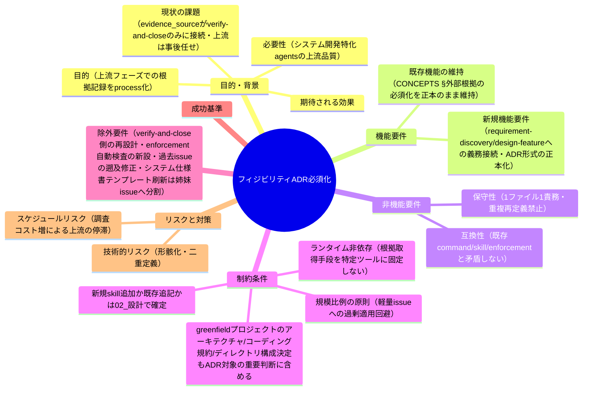
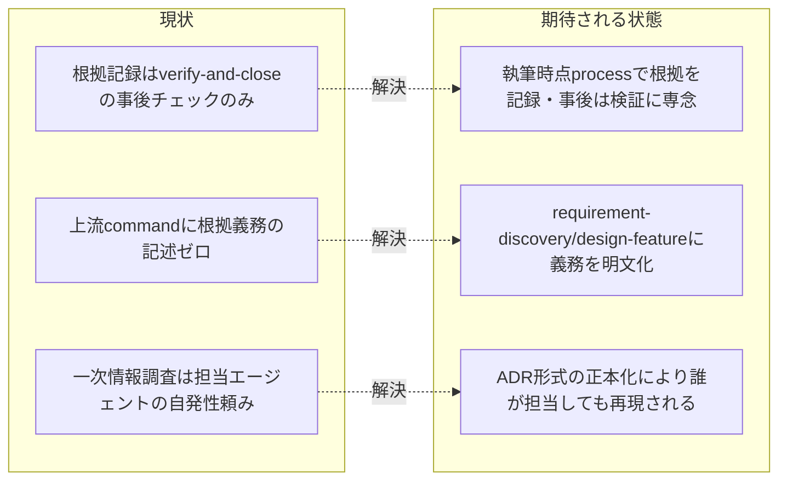

# 要求定義書: 上流フェーズ（要件定義・設計）でのフィジビリティ確認・ADR 的根拠記録の必須化

**プロジェクト名**: フィジビリティ・ADR 必須化（上流フェーズの根拠記録の process 化）
**作成日**: 2026 年 07 月 11 日
**最終更新**: 2026 年 07 月 11 日（ユーザー追加要求を受け、greenfield プロジェクトにおけるアーキテクチャ・コーディング規約・ディレクトリ構成決定を ADR 対象「重要判断」に含める旨を追記。システム仕様書の完備・強制・テンプレート刷新は範囲が異なるため姉妹サブ issue への分割を提案・除外要件に明記＝§5・§9）

> **重要**:
>
> - 要求定義書は、プロジェクトの全体像を把握するためのものです。詳細な技術仕様や実装方法は要件定義書以降で記載します。必要最低限の情報に収めることを心掛けてください。
> - **このドキュメントは常に更新**: 要求の変更や追加があった場合は、即座にこのドキュメントを更新してください。ドキュメントは「生きているドキュメント」として扱い、実装内容と常に同期させます。
> - **必須項目**: 以下の「必須」と明記した項目は空欄・抽象語のみ（例: 「{説明}」のまま）で提出しないこと。判定可能な形（目的は1文・成功基準は○/×で判定できる記載等）で記入すること。
>
> **用語**: [.agent-skill-chain/source/CONCEPTS.md §用語規約](../../../../../../../.agent-skill-chain/source/CONCEPTS.md#用語規約) を参照。

---

## 要求定義の全体像

**注意**:

- マインドマップは全体像を把握するためのものであり、詳細は本文の各セクションに記載する。

---

## 1. 目的・背景

### 1.1 目的（必須）

要件定義・設計フェーズでのフィジビリティ確認・一次情報調査・ADR 的根拠記録を執筆プロセスの一部として義務化する。

### 1.2 背景

- **現状の課題**:
  - 本パッケージ（agent-skill-chain）は**システム開発に特化した**エージェント運用基盤であるにもかかわらず、上流工程（要求・要件・設計）で最も大切なことの一つである**フィジビリティ確認とエビデンス収集**が、command / skill のプロセスとして義務付けられていない。
  - [.agent-skill-chain/source/CONCEPTS.md §外部根拠の必須化](../../../../../../../.agent-skill-chain/source/CONCEPTS.md#外部根拠の必須化external-anchor) には evidence_source の分類（human_decision / observed_runtime / existing_code / external_spec / test_output / inference_only）と「inference_only のみの重要判断は承認不可または要注意」の原則が**既に存在する**。しかしこの原則が接続されているのは [.agent-skill-chain/source/commands/verify-and-close.md](../../../../../../../.agent-skill-chain/source/commands/verify-and-close.md)（レビュー・監査＝**事後**の event）のみである（同ファイル :82 で確認済み。evidence_source: existing_code）。
  - [.agent-skill-chain/source/commands/requirement-discovery.md](../../../../../../../.agent-skill-chain/source/commands/requirement-discovery.md)・[.agent-skill-chain/source/commands/design-feature.md](../../../../../../../.agent-skill-chain/source/commands/design-feature.md) とその skill chain（extract-goals / identify-assumptions / define-constraints / write-bdd / define-boundaries / design-api-contract / review-dependencies）には、執筆時点でのフィジビリティ確認・一次情報調査・意思決定根拠の記録を義務付ける記述が**一切ない**（grep で該当ゼロ件を確認済み。evidence_source: existing_code）。
  - その結果、上流での根拠収集は担当エージェントの**自発的判断に依存**している。好例として、サブ issue [`npm公開中止_APM転換`](../20260711_024021_npm公開中止_APM転換/00_要求定義.md) では `microsoft/apm` の実在・仕様を WebFetch で一次情報確認したうえで設計したが、これは command 側が要求した結果ではない（evidence_source: existing_code。同 issue の 90_issues.md 経緯補足を参照）。

- **必要性**:
  - ユーザー指摘（2026-07-11。evidence_source: human_decision）: 「要件定義や設計時にはできる限りのフィジビリティ確認及びエビデンスを集める必要がある。常に最新の正しい情報を調べる必要があり実装可能性や設計などの根拠は常に大切。ADR（Architecture Decision Records）的観点から、システム開発に特化した agents なのだからそのあたりを常に考慮するべき」。
  - 事後（verify-and-close）だけの検証では、根拠のない前提の上に 00→01→02→03 が積み上がってから誤りが発覚し、手戻りが大きい。**執筆時点（process）での記録**に前倒しする必要がある。

- **追加のユーザー指摘（2026-07-11・同日追加。evidence_source: human_decision）**: 「まだ開発環境がないようなプロジェクトの場合、規約の整理が最も重要。ADR とともにコーディングルールやディレクトリ構成、アーキテクチャーを必ず決める必要があり、これらは誰が見ても理解できるシステム仕様書レベルに明記する必要がある。それらの強制も必要。システム仕様書についてもソースコード同様にノイズが入らないように強制することも忘れずに。さらに `/home/adachi/projects/system-graph/docs` を参考にテンプレートを大規模に耐えうる汎用的かつ正しいものにしてほしい。また、各 issue 完了前に必ずシステム仕様書のレビュー指摘対応の反復などを強制させてほしい」。
  - **さらに続くユーザーの意図説明（同日。evidence_source: human_decision・最上位ゴールの明確化）**: 「システム仕様書の完備・強制・ノイズ排除・テンプレート刷新・close 前レビュー必須化とは、システム仕様書が常に最新でただしい内容になっていることを強制するために依頼しています。」
    → すなわち、上記指摘で列挙された「コーディング規約等の必須文書化」「enforcement 接続」「ノイズ排除の強制」「テンプレート刷新」「close 前レビュー必須化」の**5 点はいずれも手段であり、最上位の目的（ゴール）はただ 1 つ、「システム仕様書が実装の変化に追随し、常に最新かつ正しい内容であることの継続的な強制」**である。一度書いて終わりではなく、**実装が変更されるたびに追随させ続ける継続的なメカニズム**として位置づける必要がある。ノイズ（陳腐化した記述・実装と矛盾する記述）の蓄積は、この「最新かつ正しい」状態の維持そのものを妨げる要因として位置づける（単なる可読性の問題ではない）。
  - **本 issue への反映範囲（スコープ判断）**: この指摘のうち、「ADR とともにコーディングルール・ディレクトリ構成・アーキテクチャを**重要判断として決定・記録する**」という部分は、本 issue が定義する ADR 的記録形式（§2.2・01 の AC-4）の**適用対象の拡張**として本 issue に含める（§1.3 効果 4・§6 SC-7 に追記）。
  - 一方、上記で明確化された最上位ゴール「**システム仕様書の継続的な最新性・正確性の保証**」を実現する 5 手段（コーディング規約等の必須文書化・enforcement 接続・ノイズ排除の強制・テンプレート刷新・close 前レビュー必須化）は、本 issue（evidence_source/ADR の command 接続）とは**目的・成果物・変更ファイル・DoD が別系統**（`.agent-skill-chain/source/spec/`・`.agent-skill-chain/source/DOCS_RULES.md`・`.workflow/templates/docs/`・`.agent-skill-chain/source/enforcement/`・`.agent-skill-chain/source/commands/verify-and-close.md` が主対象）であり、単一 issue に含めると 00〜03 の粒度が肥大化するため、**姉妹サブ issue「システム仕様書の完備・強制・テンプレート刷新（システム仕様書の継続的な最新性・正確性の保証）」への分割を提案する**（詳細は §5 除外要件・§9 次のステップ）。
  - **参考調査（evidence_source: external_spec）**: `/home/adachi/projects/system-graph/docs` を実際に調査した（Glob/Read）。同リポジトリは `00_リポジトリ運用/adr/`（ADR 複製）・`01_システム概要/05_規約/`（`00_索引と探し方` ＋ `10_フロントエンド`〜`90_横断関心` のドメイン別規約フォルダ）・`97_レビュー記録/`（仕様書レビュー結果。本パッケージの `docs/00_review/` 相当）・`99_ID命名規則と管理/`（G/F/API/S/T の ID 命名・採番管理）・`docs/README.md` の「更新履歴」テーブル（実装変更のたびに版番号・変更内容・対応レビュー記録へのリンクを追記し続ける運用）等、**「実装変更のたびに仕様書を追随させ続ける」運用が既に版管理として実践されている**ことを確認した。本パッケージの現行 `.workflow/templates/docs/`（`01_システム概要`〜`05_エラー処理と外部通知`・`99_ID命名規則と管理`・`00_review` のみ）はこの継続追随の仕組みが薄く、このギャップは姉妹 issue の具体的な設計材料とする。

### 1.3 期待される効果（必須: 1 件以上）

- **効果 1**: requirement-discovery / design-feature の command 定義（および必要な skill）に、フィジビリティ確認・evidence_source 記録の義務が明文化され、grep で該当箇所を提示できる（○/× 判定可能）。
- **効果 2**: 上流成果物（00/01/02）内の重要判断に evidence_source が付記され、inference_only のみの重要判断が執筆時点で「要人間確認」として顕在化する（○/× 判定可能）。
- **効果 3**: ADR 的な意思決定記録の形式が正本化され、02_設計の「横断設計判断」節のような前例（親 issue [`02_設計.md` §2.6](../../02_設計.md) 等）が担当者の裁量ではなく汎用パターンとして再現される（○/× 判定可能）。
- **効果 4**: greenfield プロジェクト（まだ開発環境・規約が定まっていないプロジェクト）において、アーキテクチャ・コーディング規約・ディレクトリ構成の決定が「重要判断」の一種として明示的に ADR 対象に含まれ、要件定義・設計フェーズで根拠を欠いたまま決定されることを防ぐ（○/× 判定可能。SC-7）。

**現状と期待される状態の比較**:

---

## 2. 機能要件

### 2.1 既存機能の維持（該当する場合）

- [.agent-skill-chain/source/CONCEPTS.md §外部根拠の必須化](../../../../../../../.agent-skill-chain/source/CONCEPTS.md#外部根拠の必須化external-anchor) の evidence_source 分類・「inference_only のみの重要判断は承認不可または要注意」原則を**唯一の正本**として維持する（本 issue で分類を再定義・変更しない）。
- [.agent-skill-chain/source/commands/verify-and-close.md](../../../../../../../.agent-skill-chain/source/commands/verify-and-close.md) の事後検証（event）は維持する。本 issue はそれを置き換えるのではなく、執筆時点（process）の記録を**追加**する。

### 2.2 新規機能要件

- **上流 command への義務接続**: requirement-discovery / design-feature（および必要に応じてその skill chain）に、執筆時点でのフィジビリティ確認・一次情報調査・evidence_source 記録の義務を明文化する。
- **ADR 形式の正本化**: 重要判断を「コンテキスト・検討した選択肢・決定・根拠（evidence_source 付き）・帰結」の形で記録する ADR 的パターンを正本化し、02_設計の「横断設計判断」節等と接続する。
- **規模比例の適用基準**: どの判断が「重要判断」で根拠必須か、軽量 issue ではどこまで省略できるかの適用基準を定義する。

---

## 3. 非機能要件

### 3.1 パフォーマンス

- 上流フェーズの所要コンテキスト・調査コストの増加は、重要判断を含む issue に限定する（規模比例。軽量 issue の起票を遅くしない）。

### 3.2 セキュリティ

- 一次情報調査で外部アクセス（WebFetch 等）を行う場合も、既存の高リスク操作の事前確認ルール（CORE / RULES / enforcement）を変更・緩和しない。

### 3.3 互換性

- 既存の command / skill chain の実行順序・DoD・enforcement（audit）と矛盾しないこと。既存の issue 成果物（過去の 00〜04）に遡及適用しない。

### 3.4 保守性

- 1 ファイル 1 責務・重複禁止。evidence_source の定義は CONCEPTS.md を正本とし、接続先には参照のみを書く。

---

## 4. 制約条件

### 4.1 技術的制約

- 新規 skill 追加か既存 skill への追記かの**設計判断そのものは 02_設計フェーズで確定**する（本 00/01 では論点の存在と受け入れ基準のみを明記する）。
- 根拠の取得手段（WebFetch・コード確認・実測等）を特定ツールに固定しない（ランタイム非依存。evidence_source の分類は手段非依存に既定義）。

### 4.2 既存システムとの互換性

- CONCEPTS.md §外部根拠の必須化 の分類・原則を変更しない（接続のみ）。verify-and-close の既存チェックを弱めない。

### 4.3 移行期間・スケジュール

- 本サブ issue は親 issue（agentsOS 汎用化・ポリシー統合）の実装ロードマップとは独立に要求〜設計を進められるが、実装は親 issue のストーリー 8（`.agent-skill-chain/source/` 改名）の影響を受けるため、実装着手順は orchestrator が別途判断する。

---

## 5. 除外要件

- verify-and-close 側（事後検証）の再設計・強化は対象外（既存のまま維持）。
- enforcement（audit スクリプト）による evidence_source の**自動検査の新設**は本 issue の必須範囲外（02_設計で費用対効果を検討してよいが、成功基準には含めない）。
- 過去の close 済み issue の成果物への遡及的な evidence_source 付記は行わない。
- implement-feature（実装フェーズ）への義務拡張は対象外（上流＝要求・要件・設計に限定する）。
- **姉妹サブ issue へ切り出す範囲（本 issue の対象外）**: 「システム仕様書が常に最新かつ正しい内容であることの継続的な強制」を最上位目的とする以下の 5 手段は、本 issue（evidence_source/ADR の command 接続）とは目的・成果物系統が異なるため対象外とし、姉妹サブ issue「システム仕様書の完備・強制・テンプレート刷新」への分割を提案する（§1.2 参照）。
  1. コーディング規約・ディレクトリ構成・アーキテクチャの system-spec レベルでの必須文書化（`.agent-skill-chain/source/spec/`・`docs/` の拡充）
  2. 上記文書化の enforcement（`.agent-skill-chain/source/enforcement/`）接続
  3. システム仕様書のノイズ排除の強制（`CODE_COMMENT_RULES.md` 相当の思想を `docs/` に適用。陳腐化・実装との矛盾記述の蓄積防止）
  4. `.workflow/templates/docs/` の大規模プロジェクト対応・汎用化（`/home/adachi/projects/system-graph/docs` を参考にした構成刷新）
  5. issue close 前のシステム仕様書レビュー・指摘対応反復の必須化（`verify-and-close.md` の現行「必要に応じて」表現の強化。**実装変更のたびにシステム仕様書が追随しているかを検証する継続的ゲート**として位置づける）

---

## 6. 成功基準（必須: 1 件以上）

- **SC-1**: `.agent-skill-chain/source/commands/requirement-discovery.md` に、執筆時点でのフィジビリティ確認・evidence_source 記録の義務が明記されている（grep で該当行を提示できる）。
- **SC-2**: `.agent-skill-chain/source/commands/design-feature.md` に同様の義務が明記されている（grep で該当行を提示できる）。
- **SC-3**: evidence_source の分類定義の正本が CONCEPTS.md §外部根拠の必須化 の 1 か所のままである（分類表の重複定義が新設ファイル・変更ファイルに存在しない）。
- **SC-4**: ADR 的記録形式（コンテキスト・選択肢・決定・根拠・帰結）が正本化され、02_設計成果物との接続方法が明文化されている。
- **SC-5**: 規模比例の適用基準（重要判断の定義・軽量 issue の軽量パス）が明文化され、CONTEXT_EFFICIENCY.md の規模比例の思想と矛盾しない。
- **SC-6**: inference_only のみを根拠とする重要判断について「執筆時点で要人間確認と明示する」ルールが上流側に接続されている。
- **SC-7**: greenfield プロジェクトにおけるアーキテクチャ・コーディング規約・ディレクトリ構成の決定が「重要判断」に含まれ、ADR 形式での記録対象であることが 02_設計（接続先ドキュメント）に明記されている。

---

## 7. リスクと対策

### 7.1 技術的リスク

- **リスク**: 形骸化。担当エージェントが evidence_source を機械的に付記するだけで、実際の一次情報調査を行わない。
  - **対策**: 「重要判断」の定義と、inference_only のみの重要判断を執筆時点で「要人間確認」と明示させるルールをセットで導入する。verify-and-close の事後検証（既存）が二重の安全網として機能する。
- **リスク**: 二重定義。CONCEPTS.md と接続先で evidence_source の定義が分裂し、将来の変更で不整合が生じる。
  - **対策**: 接続先には参照のみを書く（SC-3 で検証）。

### 7.2 スケジュールリスク

- **リスク**: 調査コスト増により、軽量 issue の起票・上流が過度に重くなる。
  - **対策**: 規模比例の適用基準（SC-5）を成功基準に含め、重要判断を含まない軽量 issue には軽量パスを認める。

---

## 8. 参考資料

### プロジェクトドキュメント

- 親 issue: [`00_要求定義.md`](../../00_要求定義.md)・[`02_設計.md`](../../02_設計.md)（§2.6 横断設計判断＝ADR 相当の前例）・[`90_issues.md`](../../90_issues.md)

### その他の参考資料

- [.agent-skill-chain/source/CONCEPTS.md §外部根拠の必須化](../../../../../../../.agent-skill-chain/source/CONCEPTS.md#外部根拠の必須化external-anchor) — evidence_source 分類の正本
- [.agent-skill-chain/source/commands/requirement-discovery.md](../../../../../../../.agent-skill-chain/source/commands/requirement-discovery.md)・[.agent-skill-chain/source/commands/design-feature.md](../../../../../../../.agent-skill-chain/source/commands/design-feature.md)・[.agent-skill-chain/source/commands/verify-and-close.md](../../../../../../../.agent-skill-chain/source/commands/verify-and-close.md)
- [.agent-skill-chain/source/CONTEXT_EFFICIENCY.md](../../../../../../../.agent-skill-chain/source/CONTEXT_EFFICIENCY.md) — 規模比例（適用のスケーリング）の思想
- 実践の好例: サブ issue [`npm公開中止_APM転換`](../20260711_024021_npm公開中止_APM転換/00_要求定義.md)（microsoft/apm の一次情報を WebFetch 確認して設計。ただし自発的判断による）
- ADR（Architecture Decision Records）: Michael Nygard "Documenting Architecture Decisions"（一般に普及した ADR の原型。形式の詳細採用は 02_設計で確定する）
- **分割提案の参考調査**: `/home/adachi/projects/system-graph/docs`（別プロジェクト。ADR 複製フォルダ・ドメイン別規約フォルダ・ID 命名管理・更新履歴による継続追随運用の実例。姉妹サブ issue の設計材料）
- **既存規約（姉妹 issue が拡張対象とする正本）**: [.agent-skill-chain/source/RULES.md](../../../../../../../.agent-skill-chain/source/RULES.md)、[.agent-skill-chain/source/DOCS_RULES.md](../../../../../../../.agent-skill-chain/source/DOCS_RULES.md)、[.agent-skill-chain/source/CODE_COMMENT_RULES.md](../../../../../../../.agent-skill-chain/source/CODE_COMMENT_RULES.md)、[.agent-skill-chain/source/spec/](../../../../../../../.agent-skill-chain/source/spec/)、[.agent-skill-chain/source/enforcement/README.md](../../../../../../../.agent-skill-chain/source/enforcement/README.md)

---

## 9. 次のステップ

この要求定義書の承認後、以下のドキュメントを作成します：

- **次**: [`01_要件定義.md`](./01_要件定義.md) - 要件定義フェーズ

### 分割提案（スコープ判断）

本 issue とは目的・成果物系統が異なる以下の姉妹サブ issue の起票を提案する（本 issue のスコープには含めない。実際のディレクトリ作成は orchestrator が別途判断・手配する）。

- **提案タイトル**: システム仕様書の完備・強制・テンプレート刷新
- **最上位目的（スコープ）**: システム仕様書（`docs/`）が実装の変化に追随し、**常に最新かつ正しい内容であることを継続的に強制する**こと。以下は目的達成のための手段であり、目的そのものではない。
  1. コーディング規約・ディレクトリ構成・アーキテクチャの system-spec レベルでの必須文書化
  2. enforcement（`.agent-skill-chain/source/enforcement/`）による強制接続
  3. システム仕様書のノイズ排除の強制（陳腐化・実装との矛盾記述の蓄積防止）
  4. `.workflow/templates/docs/` の大規模プロジェクト対応・汎用化（`system-graph/docs` 参考）
  5. issue close 前のシステム仕様書レビュー・指摘対応反復の必須化（実装変更のたびに追随を検証する継続ゲート）
