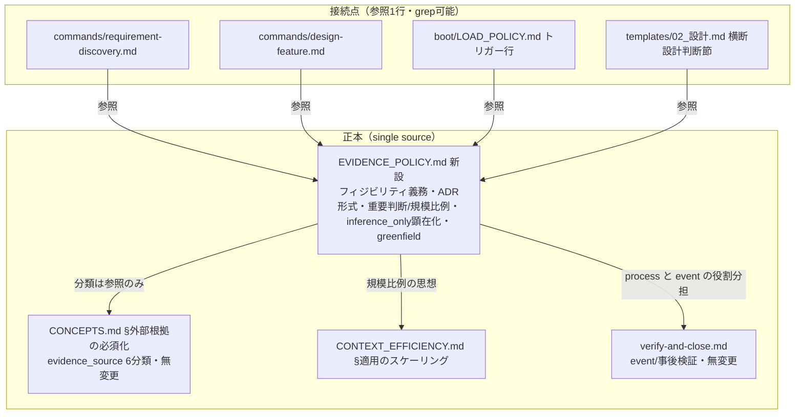
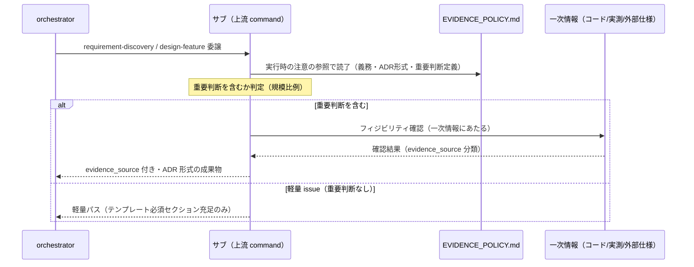
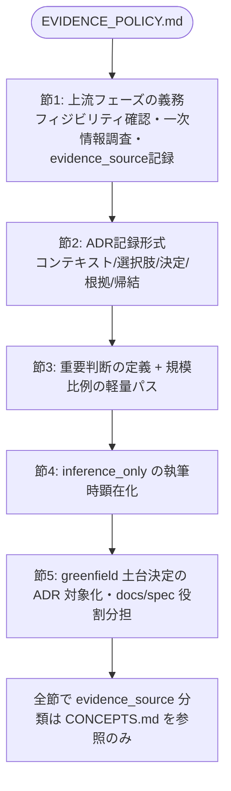
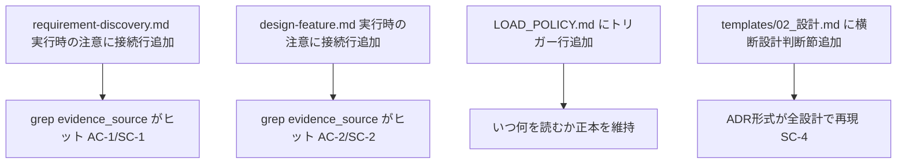

# 設計書: 上流フェーズ（要件定義・設計）でのフィジビリティ確認・ADR 的根拠記録の必須化

**プロジェクト名**: フィジビリティ・ADR 必須化（上流フェーズの根拠記録の process 化）
**作成日**: 2026 年 07 月 11 日
**最終更新**: 2026 年 07 月 11 日

> **重要**: **このドキュメントは常に更新**: 設計の変更や追加があった場合は、即座にこのドキュメントを更新してください。ドキュメントは「生きているドキュメント」として扱い、実装内容と常に同期させます。
>
> **用語**: [.agent-skill-chain/source/CONCEPTS.md §用語規約](../../../../../../../.agent-skill-chain/source/CONCEPTS.md#用語規約) を参照。

---

## 1. 設計概要

**必須**: 設計方針・原則は [.agent-skill-chain/source/spec/01\_設計原則.md](../../../../../../../.agent-skill-chain/source/spec/01_設計原則.md) を**先に参照**した上で、本プロジェクトに**適用するものを選び**記載する。

### 1.1 設計方針

本 issue は新しいコード・サービスを作らない。**既存の evidence_source 原則（[CONCEPTS.md §外部根拠の必須化](../../../../../../../.agent-skill-chain/source/CONCEPTS.md#外部根拠の必須化external-anchor)）を、上流 command（requirement-discovery / design-feature）の執筆プロセスへ「参照で接続」する**ドキュメント・ポリシー設計である。正本を 1 か所（新設ポリシーファイル）に置き、command・LOAD_POLICY・テンプレートからは**参照 1 行**で結線する（1 ファイル 1 責務・正本一元化）。

### 1.2 設計原則（本プロジェクトで適用するもの）

- **単一責務**: 上流フェーズの根拠記録・フィジビリティ・ADR 形式という**新しい関心事**を 1 つの正本ファイル（`EVIDENCE_POLICY.md`）に集約する。evidence_source の分類は CONCEPTS.md の正本を侵さない（参照のみ）。
- **明確な境界**: 「分類の定義（CONCEPTS.md）」「process の義務・ADR 形式（新設 EVIDENCE_POLICY.md）」「event の事後検証（verify-and-close.md 既存）」を三分し、責務が重ならないようにする。
- **AIフレンドリー設計**: [01\_設計原則 §AIフレンドリー設計](../../../../../../../.agent-skill-chain/source/spec/01_設計原則.md#aiフレンドリー設計)（小さなファイル・明確な責務・意図が分かる命名）に従い、正本は 1 ファイルに閉じ、接続点は grep 可能な参照 1 行に限定する。
- **KISS / YAGNI**: enforcement による自動検査の新設は本 issue のスコープ外（00 §5・01 §5）。必要最小の強制（command 実行時の読了義務への接続）に留める。

> **AIフレンドリー設計**: 本設計は正本 1 ファイル・参照 1 行の結線を徹底し、[01\_設計原則 §AIフレンドリー設計](../../../../../../../.agent-skill-chain/source/spec/01_設計原則.md#aiフレンドリー設計) の「小さなファイル・明確な責務・深すぎないディレクトリ構造」を満たす。

---

## 2. アーキテクチャ設計

### 2.1 責務・境界・参照関係

[01\_設計原則 §明確な境界・§単一責務](../../../../../../../.agent-skill-chain/source/spec/01_設計原則.md) に従い、コンポーネント（ここでは規約・ポリシー・command・テンプレートの各ファイル）の責務・境界・参照関係を明示する。

#### 2.1.1 責務一覧

| コンポーネント | 責務（1 文） |
| -------------- | ------------ |
| `CONCEPTS.md §外部根拠の必須化`（既存・**無変更**） | evidence_source の 6 分類と「inference_only のみの重要判断は承認不可または要注意」原則の**唯一の正本**を定義する。 |
| `EVIDENCE_POLICY.md`（**新設**・本 issue の中核成果物） | 上流フェーズ（要求・要件・設計）における①フィジビリティ確認・根拠記録の義務、②ADR 記録形式、③重要判断の定義と規模比例の軽量パス、④inference_only の執筆時顕在化、⑤greenfield 決定の ADR 対象化、を**正本として**定義する。evidence_source 分類は CONCEPTS.md を参照するのみ。 |
| `commands/requirement-discovery.md`（既存・**追記**） | 00/01 執筆時に `EVIDENCE_POLICY.md` を読了・適用する義務を「実行時の注意」に 1 行接続する（grep で `evidence_source` がヒットする）。 |
| `commands/design-feature.md`（既存・**追記**） | 02/03 執筆時に同義務を「実行時の注意」に 1 行接続する（grep で `evidence_source` がヒットする）。 |
| `boot/LOAD_POLICY.md`（既存・**追記**） | 「いつ何を読むか」の正本として、上流フェーズの根拠記録トリガー行を 1 行追加し `EVIDENCE_POLICY.md` へ結線する。 |
| `.agent-skill-chain/runtime/templates/02_設計.md`（既存・**追記**） | 02 設計テンプレートに「横断設計判断（ADR）」節を新設し、`EVIDENCE_POLICY.md` の ADR 形式を参照して重要判断を記録する枠を提供する。 |
| `commands/verify-and-close.md`（既存・**無変更**） | event（レビュー時点）の事後検証を担う。本 issue で変更しない（AC-7）。process 側の追加が事後検証を置き換えないことを EVIDENCE_POLICY.md で明記する。 |

#### 2.1.2 境界

- **入力**: 上流フェーズ（requirement-discovery / design-feature）を委譲されたサブエージェントによる 00/01/02/03 の執筆行為、および執筆対象となる重要判断。
- **出力**: evidence_source 付きの重要判断記録（ADR 形式を含む）を含んだ上流成果物、および grep で検証可能な command / テンプレートへの接続点。
- **他責務との境界**（本 issue の**範囲外**）:
  - evidence_source 分類の（再）定義 → CONCEPTS.md の責務。本 issue は参照のみ。
  - event（レビュー時点）の事後検証の再設計・強化 → verify-and-close.md の責務（00 §5・01 §5 で除外）。
  - enforcement（audit）による evidence_source の自動検査の**新設** → 除外要件（00 §5・§2.5 ADR-5）。
  - implement-feature（実装）への義務拡張 → 上流限定のため範囲外。
  - 「システム仕様書の継続的な最新性・正確性の保証」を目的とする 5 手段 → 姉妹サブ issue（00 §9・01 §6 プレビュー）。

#### 2.1.3 参照関係

依存の向き（呼び出し元 → 参照先）を 1 行ずつ示す。循環は持たない。

- `commands/requirement-discovery.md` → `EVIDENCE_POLICY.md`（実行時の注意で参照）
- `commands/design-feature.md` → `EVIDENCE_POLICY.md`（実行時の注意で参照）
- `boot/LOAD_POLICY.md` → `EVIDENCE_POLICY.md`（トリガー行で参照）
- `.agent-skill-chain/runtime/templates/02_設計.md` → `EVIDENCE_POLICY.md`（横断設計判断節で参照）
- `EVIDENCE_POLICY.md` → `CONCEPTS.md §外部根拠の必須化`（分類の正本を参照）
- `EVIDENCE_POLICY.md` → `CONTEXT_EFFICIENCY.md §適用のスケーリング`（規模比例の思想を参照）
- `EVIDENCE_POLICY.md` → `commands/verify-and-close.md`（process と event の役割分担を明記）

> 参照はすべて一方向であり、`EVIDENCE_POLICY.md` を新しい葉ノード（正本）として上流 command・LOAD_POLICY・テンプレートがそこへ向かう。CONCEPTS.md は `EVIDENCE_POLICY.md` を参照し返さない（循環なし）。

### 2.2 システムアーキテクチャ

**必須**: 設計判断は [.agent-skill-chain/source/spec/](../../../../../../../.agent-skill-chain/source/spec/)（[00_spec概要.md](../../../../../../../.agent-skill-chain/source/spec/00_spec概要.md)、[01\_設計原則.md](../../../../../../../.agent-skill-chain/source/spec/01_設計原則.md)、[06\_設計判断の優先順位.md](../../../../../../../.agent-skill-chain/source/spec/06_設計判断の優先順位.md)）を**先に**参照する。

- **採用パターン**: **ポリシー正本 + 参照結線（single-source-of-truth policy with reference wiring）**。新しい横断的関心事を 1 つの正本ファイルに集約し、既存の実行契約（command / LOAD_POLICY / テンプレート）からは参照 1 行で結線する。
- **根拠**: [06\_設計判断の優先順位.md](../../../../../../../.agent-skill-chain/source/spec/06_設計判断の優先順位.md) の「再利用性より責務の明確さ」「一時的な都合で shared を肥大化させない」、および CONCEPTS.md の「正本は 1 か所・疎結合」に従い、分類（CONCEPTS）・process 義務/ADR 形式（EVIDENCE_POLICY）・event 検証（verify-and-close）を責務ごとに分離する。

#### 2.2.1 CQRS（Command/Query 分離）

- 本 issue はドキュメント・ポリシー変更であり、状態変更 API を持たない。CQRS は**該当なし**（適用しない）。

#### 2.2.2 アーキテクチャ図（本プロジェクトの構成で記載）

### 2.3 コンポーネント構成

**境界・単一責務**: 明確な境界（分類 / process 義務・ADR 形式 / event 検証）を保ち、各ファイルは単一責務を満たす。

- **`EVIDENCE_POLICY.md`（新設）**: 本 issue の中核。以下の 5 節を持つ（詳細は §3.1）。
  1. 上流フェーズでのフィジビリティ確認・一次情報調査・evidence_source 記録の義務（AC-1/AC-2 の接続先本体）
  2. ADR 記録形式（コンテキスト・検討した選択肢・決定・根拠[evidence_source 付き]・帰結）（AC-4/SC-4）
  3. 重要判断の定義と規模比例の軽量パス（AC-8/AC-9/SC-5）
  4. inference_only のみの重要判断の執筆時顕在化ルール（AC-6/SC-6。CONCEPTS 参照）
  5. greenfield プロジェクトのアーキテクチャ・コーディング規約・ディレクトリ構成決定の ADR 対象化と docs/spec の役割分担（AC-10/AC-11/SC-7）
- **接続点（追記のみ）**: `requirement-discovery.md`・`design-feature.md`・`LOAD_POLICY.md`・`templates/02_設計.md` に参照 1 行ずつ。正本を二重持ちしない。

### 2.4 データフロー

**イベント駆動**: 本 issue は「起きた事実」を表すシステムイベント（UserCreated 等）を発行しない。ここでの「フロー」はサブエージェントの執筆プロセスの制御フローである（該当イベント: なし）。

### 2.5 横断設計判断（ADR）: 本 issue 自身の主要設計判断

本節は、01 の AC-3（「接続の実現方式は 02 で確定し、その設計判断自体が ADR 形式で記録される」）を満たすため、**本 issue の実現方式そのものを ADR 形式で記録**する。形式（コンテキスト・検討した選択肢・決定・根拠[evidence_source 付き]・帰結）は、本 issue が正本化しようとしている ADR 形式（§3.1 節 2）を自己適用したものである。前例は親 issue [`02_設計.md` §2.5・§2.6](../../02_設計.md)。

#### ADR-1: 接続の実現方式 = 「新設ポリシー正本 + 既存への参照追記」のハイブリッド

- **コンテキスト**: 既存の evidence_source 原則を上流 command の執筆プロセスに接続する必要がある（01 ストーリー1・AC-1/AC-2/AC-3）。接続の実現方式として「新規 skill 追加」か「既存 command/skill への追記」かが 01 で保留されていた（01 §5・AC-3）。
- **検討した選択肢**:
  - **(A) 新規 skill 追加**: 例 `skills/requirements/verify-feasibility/` を requirement-discovery / design-feature 両 chain に挿入する。
  - **(B) CONCEPTS.md §外部根拠の必須化 へ直接追記**: 既存の分類定義ファイルに process 義務・ADR 形式を書き足す。
  - **(C) 新設ポリシー正本（`EVIDENCE_POLICY.md`）+ 既存 command/LOAD_POLICY/テンプレートへの参照追記**（ハイブリッド）。
- **決定**: **(C) を採用**する。
- **根拠**:
  - (A) は、根拠記録が「特定の 1 ステップの入出力変換（filter）」ではなく**執筆全体にわたる横断的義務**であるため、skill = 1 目的の最小 filter という skill モデル（[CONCEPTS.md §設計方針](../../../../../../../.agent-skill-chain/source/CONCEPTS.md#設計方針)。evidence_source: existing_code）に馴染まない。独立ステップ化はチェックボックス的な形骸化（00 §7.1 リスク）を招きやすい。
  - (B) は、CONCEPTS.md が「思想・分類の正本（event 側で参照）」という単一責務を持つ（evidence_source: existing_code。CONCEPTS.md §外部根拠の必須化を確認）。ここに process 義務・ADR 形式・規模比例を混載すると 1 ファイル 1 責務が崩れ、event と process の境界が曖昧化する。
  - (C) は、上流フェーズの根拠記録・ADR 形式という**新しい関心事**を独立正本に閉じ（新設は新しい関心事のみに限定する原則。親 02 §2.5.4 の判断様式と整合。evidence_source: existing_code）、接続点は grep 可能な参照 1 行に限定できるため、[06_設計判断の優先順位.md](../../../../../../../.agent-skill-chain/source/spec/06_設計判断の優先順位.md) の「単一責務」「可読性」を最もよく満たす。
  - ユーザー指摘（2026-07-11。evidence_source: human_decision。00 §1.2）「上流でのフィジビリティ確認・エビデンス収集を常に考慮すべき」を、担当者裁量ではなく再現可能なプロセスにするという要求と整合する。
- **帰結**: 実装対象は「新設 1 ファイル + 既存 4 ファイルへの参照追記」に確定する（§2.1.1）。skill chain の step 構成・順序は変更しない（design-feature の PROCESS を壊さない）。二重定義が生じないため SC-3/AC-5 を満たしやすい。

#### ADR-2: ADR 記録形式の正本置き場所と 02 設計「横断設計判断」節との接続

- **コンテキスト**: 重要判断を「コンテキスト・選択肢・決定・根拠・帰結」で記録する ADR 形式を正本化し、02 設計成果物と接続する必要がある（01 ストーリー2・AC-4/SC-4）。親 issue の 02 §2.5/§2.6 が良い前例だが担当者裁量で書かれている。
- **検討した選択肢**: (A) ADR 形式を 02 設計テンプレートに直接ハードコードする、(B) `EVIDENCE_POLICY.md` に形式正本を置き、テンプレート・design-feature command から参照結線する。
- **決定**: **(B) を採用**する。形式正本は `EVIDENCE_POLICY.md`（§3.1 節 2）に置く。`.agent-skill-chain/runtime/templates/02_設計.md` に「横断設計判断（ADR）」節を新設し、そこから形式正本を参照する。
- **根拠**: 形式を複数の成果物（02 だけでなく将来的に 00/01 の重要判断にも適用可能）で使い回すため、テンプレート内に閉じ込めず正本を 1 か所に置く（疎結合・正本一元化。evidence_source: existing_code。CONCEPTS.md §原則）。親 02 §2.5/§2.6 が実践した「コンテキスト→選択肢→決定→根拠[evidence_source]→帰結」の並びを最小集合として採用する（evidence_source: existing_code。親 02 §2.5.2〜§2.6.5 を確認）。
- **帰結**: テンプレート更新により、以後の全 design-feature 実行で ADR 節が再現される（担当者裁量からの脱却。SC-4 充足）。本 issue の §2.5 自体がこの形式の自己適用例となる。

#### ADR-3: 規模比例の適用基準（重要判断の定義・軽量パス）

- **コンテキスト**: 義務化が軽量 issue（誤字修正等）の起票速度・コンテキスト効率を損なわないよう、適用範囲を規模比例で定義する必要がある（01 ストーリー4・AC-8/AC-9/SC-5）。
- **検討した選択肢**: (A) 全 issue に一律で evidence_source 網羅付記を要求する、(B) 「重要判断を含む場合」に限定し、含まない軽量 issue には軽量パスを認める。
- **決定**: **(B) を採用**する。`EVIDENCE_POLICY.md`（§3.1 節 3）で「重要判断」を定義し、それを含まない軽量 issue の軽量パスを明記する。
- **根拠**: [CONTEXT_EFFICIENCY.md §適用のスケーリング](../../../../../../../.agent-skill-chain/source/CONTEXT_EFFICIENCY.md)（「過剰適用を避ける」「単一/少数 issue は軽量運用」。evidence_source: existing_code。実測で確認）の規模比例思想と整合させる。一律適用は形骸化とコンテキスト肥大の両方を招く（00 §7.1/§7.2 リスク）。
- **帰結**: 「重要判断 = 採否が成果物の構造・実現可能性・後続フェーズを左右する判断（技術選定・外部依存採用・既存資産の変更方針・要件の除外・greenfield の土台決定）」と定義。軽量 issue は既存テンプレート必須セクション充足のみで完了可（evidence_source 全項目付記を要求しない）。SC-5/AC-8/AC-9 充足。

#### ADR-4: greenfield の土台決定を ADR 対象とし、記録は docs 側・spec 非上書き

- **コンテキスト**: 開発環境・規約が未確定の greenfield プロジェクトで、アーキテクチャ・コーディング規約・ディレクトリ構成の決定を重要判断として ADR 記録対象に含める（01 ストーリー5・AC-10/AC-11/SC-7）。
- **検討した選択肢**: (A) これらを spec/ の設計原則に追記する、(B) 「重要判断」の代表例として EVIDENCE_POLICY.md に含め、記録はプロジェクト個別の docs 側に位置づけ spec を上書きしない。
- **決定**: **(B) を採用**する。
- **根拠**: [spec/00_spec概要 §spec と docs の違い](../../../../../../../.agent-skill-chain/source/spec/00_spec概要.md)（spec=全プロジェクト共通の設計原則・変更頻度低、docs=個別プロジェクトの具体仕様・変更頻度高。evidence_source: existing_code）に従い、個別プロジェクトの土台決定は docs 側の関心事である。spec の汎用原則（[01_設計原則](../../../../../../../.agent-skill-chain/source/spec/01_設計原則.md)・[02_ディレクトリ構造方針](../../../../../../../.agent-skill-chain/source/spec/02_ディレクトリ構造方針.md)）を ADR が上書きしてはならない。
- **帰結**: EVIDENCE_POLICY.md の重要判断定義に「greenfield のアーキテクチャ・コーディング規約・ディレクトリ構成」を代表例として明記し、記録が docs 側・spec 非上書きである旨を併記する。SC-7/AC-10/AC-11 充足。

#### ADR-5: enforcement 自動検査は新設しない（除外要件の再確認）

- **コンテキスト**: evidence_source の付記漏れを audit スクリプトで機械検査する案が考えられるが、00 §5・01 §5 で必須範囲外とされている。
- **検討した選択肢**: (A) 本 issue で audit チェックを新設する、(B) 新設しない（既存 verify-and-close の event 検証 + 上流 process 記録の二重安全網に委ねる）。
- **決定**: **(B) を採用**する（本 issue では新設しない）。
- **根拠**: 「その場しのぎでない根拠収集」は思考プロセスの質であり機械検出に馴染まない（親 02 §2.5.3 の「機構的強制は全面的には不可能」と同型。evidence_source: existing_code）。費用対効果に見合わず、除外要件（00 §5）に反しない。
- **帰結**: 本 issue の DoD に audit 変更を含めない。将来課題として EVIDENCE_POLICY.md に「事後検証は verify-and-close（既存）が担う」旨を明記し、process/event の二重安全網を成立させる（AC-7 充足）。

---

## 3. 機能設計

### 3.1 機能 1: `EVIDENCE_POLICY.md`（新設正本）の構成

#### 3.1.1 概要

上流フェーズの根拠記録に関する全ルールの正本。以下 5 節で構成し、evidence_source の分類は CONCEPTS.md を参照するのみとする（再定義しない）。

#### 3.1.2 処理フロー（ファイル内の節構成）

#### 3.1.3 入力・出力

- **入力**: 上流 command からの読了（参照）、執筆対象の重要判断。
- **出力（本ファイルが規定するもの）**:
  - 節 1: 「requirement-discovery / design-feature 実行時、重要判断について一次情報（inference_only 以外の evidence_source）でフィジビリティを確認し、成果物中の当該判断に evidence_source を付記する」義務。
  - 節 2: ADR 最小集合＝**コンテキスト・検討した選択肢・決定・根拠（evidence_source 付き）・帰結**。02 設計の横断設計判断節から参照される。
  - 節 3: 重要判断の定義（ADR-3 帰結）と軽量パス。CONTEXT_EFFICIENCY.md §適用のスケーリングへの相互参照。
  - 節 4: 「inference_only のみを根拠とする重要判断は成果物中で『要人間確認』と明示する」（CONCEPTS.md の既存原則を参照。再定義しない）。
  - 節 5: greenfield 土台決定を重要判断の代表例とし、記録は docs 側・spec 非上書き。

#### 3.1.4 エラーハンドリング

- 外部ネットワークアクセス不能なランタイムでは、到達可能な evidence_source（existing_code / observed_runtime / test_output 等）で代替し、いずれも不能な場合は inference_only として顕在化させる（節 4。01 §2.3 ビジネスルール）。高リスク操作（外部書込・大量削除）は既存の事前確認ルール（CORE/RULES/enforcement）に従う（緩和しない）。

### 3.2 機能 2: 既存ファイルへの参照接続（追記のみ）

#### 3.2.1 概要

正本 `EVIDENCE_POLICY.md` へ、既存 4 ファイルから参照 1 行ずつを結線する。正本の内容を複製しない。

#### 3.2.2 処理フロー

#### 3.2.3 入力・出力

- **入力**: 既存の各ファイル。
- **出力**:
  - `requirement-discovery.md` §実行時の注意: 「重要判断については [EVIDENCE_POLICY.md] に従い、フィジビリティ確認と evidence_source 記録を行うこと」（`evidence_source` の語を含む＝AC-1 の grep 検証を満たす）。
  - `design-feature.md` §実行時の注意: 同様の 1 行（`evidence_source` の語を含む＝AC-2）。
  - `LOAD_POLICY.md` §トリガー: 「上流フェーズでの根拠記録・フィジビリティ確認時 → EVIDENCE_POLICY.md」の行。
  - `templates/02_設計.md`: 「横断設計判断（ADR）」節（`EVIDENCE_POLICY.md` の ADR 形式を参照）。

#### 3.2.4 エラーハンドリング

- 追記は既存の見出し構造・skill chain の順序を変更しない（design-feature の PROCESS/DONE を壊さない）。正本の文言を複製した場合は SC-3/AC-5 違反となるため、接続行は必ず「参照」表現に限定する。

---

## 4. データ設計

- **該当なし**。本 issue はドキュメント・ポリシーの変更であり、DB スキーマ・データモデルの追加・変更を伴わない。evidence_source は既存 CONCEPTS.md の 6 分類の文字列（human_decision / observed_runtime / existing_code / external_spec / test_output / inference_only）をそのまま用い、独自の別名・データ構造を導入しない（01 §4.2）。

---

## 5. API 設計

- **該当なし**。本 issue は外部 API を提供しない（01 §4.1）。「インターフェース」に相当するのは、上流 command から `EVIDENCE_POLICY.md` への**参照契約**（grep 可能な接続行の存在）であり、これは §3.2 に記載した。

---

## 6. テスト戦略

テスト戦略の**観点の定義**は [RULES.md のテスト戦略必須要件](../../../../../../../.agent-skill-chain/source/RULES.md#テスト戦略必須要件) を、**BDD 形式の定義**は [TEST_BDD_FORMAT.md](../../../../../../../.agent-skill-chain/source/TEST_BDD_FORMAT.md) を参照する。本 issue はドキュメント・ポリシー変更のため、テストは**静的検証（grep・存在確認・リンク解決）**が中心となる（実行コードの単体テストは該当なし）。

### 6.1 対象ごとのテスト割り当て

| 対象 | 単体 | 結合/API | E2E | クリティカル観点 | バリデーション観点 | 未達理由/補足 |
| ---- | ---- | -------- | --- | ---------------- | ------------------ | ------------- |
| `EVIDENCE_POLICY.md` の 5 節存在 | ○ | × | × | 5 節（義務・ADR形式・重要判断/規模比例・inference_only・greenfield）が存在（grep 検証） | 節見出しの過不足なし | 実行コードなし＝結合/E2E 該当なし |
| `requirement-discovery.md` の接続 | ○ | × | × | `grep -n "evidence_source" requirement-discovery.md` が 1 件以上（AC-1/SC-1） | 参照表現であり分類の複製でない | 同上 |
| `design-feature.md` の接続 | ○ | × | × | `grep -n "evidence_source" design-feature.md` が 1 件以上（AC-2/SC-2） | 同上 | 同上 |
| 分類の非重複（SC-3/AC-5） | ○ | × | × | evidence_source の 6 分類表が CONCEPTS.md 以外に存在しない（grep で分類表の重複ゼロ） | 参照リンクのみ許可 | 同上 |
| ADR 形式の正本化・接続（SC-4/AC-4） | ○ | × | × | ADR 形式が EVIDENCE_POLICY.md に定義され、`templates/02_設計.md` から参照される | 最小集合 5 要素を含む | 同上 |
| 規模比例（SC-5/AC-8/AC-9） | ○ | × | × | 重要判断定義・軽量パスが明記され CONTEXT_EFFICIENCY.md へ相互参照 | 軽量 issue の除外条件が判定可能 | 同上 |
| inference_only 顕在化（SC-6/AC-6/AC-7） | ○ | × | × | 「要人間確認」明示ルールが上流側に接続、event 側（verify-and-close）無変更 | CONCEPTS 参照のみで再定義なし | 同上 |
| greenfield（SC-7/AC-10/AC-11） | ○ | × | × | 土台決定が重要判断代表例・docs 側/spec 非上書きと明記 | spec を上書きしない旨が判定可能 | 同上 |
| リンク解決（全成果物） | ○ | × | × | 追加・変更した markdown リンクが realpath で解決（未解決 0 件） | 相対深度の正しさ | 同上 |

### 6.2 監査・レビューでの確認（証跡）

証跡の確認観点は RULES §テスト戦略必須要件および workflow/PHASES.md の監査観点を参照。本設計書 §6.1 の割当表と 03\_実装計画のタスク別テスト観点・BDD が揃っていることを確認する。本 issue は verify-and-close（実装後レビュー）で、上記 grep 検証・リンク解決の再実行結果を 04_review に記載する。

---

## 7. UI 設計

- **該当なし**。本 issue は UI を持たない（規約・ポリシーファイルの変更のみ）。

---

## 8. セキュリティ設計

### 8.1 認証・認可

- **該当なし**（本 issue は認証・認可を扱わない）。

### 8.2 データ保護

- 一次情報調査で外部アクセス（WebFetch 等）を行う場合も、既存の高リスク操作の事前確認ルール（CORE / RULES / enforcement）を**変更・緩和しない**（01 §3.2・§2.3 ビジネスルール）。EVIDENCE_POLICY.md 節 1/節 4 にこの不変を明記する。

---

## 9. 非機能要件への対応

### 9.1 パフォーマンス（コンテキスト・調査コスト）

- 義務化のコスト増を「重要判断を含む issue」に限定する規模比例（ADR-3・§3.1 節 3）により、軽量 issue の起票所要（既存テンプレート充足のみ）を悪化させない（01 §3.1）。

### 9.2 可用性

- 外部ネットワーク不能なランタイムでも義務が実行不能にならないよう、手段非依存の evidence_source 定義（CONCEPTS.md）を用い、不能時は inference_only 顕在化で代替する（§3.1.4・01 §3.4）。

### 9.3 保守性・互換性

- 1 ファイル 1 責務・重複禁止。既存 command / skill chain の実行順序・DoD・enforcement（audit）と矛盾しない（追記は「実行時の注意」への参照 1 行に限定。01 §3.3）。過去の close 済み issue に遡及適用しない。

---

## 10. 参考資料

### プロジェクトドキュメント

- [`01_要件定義.md`](./01_要件定義.md) - 要件定義
- [`00_要求定義.md`](./00_要求定義.md) - 要求定義
- 親 issue [`02_設計.md`](../../02_設計.md) §2.5・§2.6 - ADR 相当の前例（横断設計判断）

### その他の参考資料

- [.agent-skill-chain/source/CONCEPTS.md §外部根拠の必須化](../../../../../../../.agent-skill-chain/source/CONCEPTS.md#外部根拠の必須化external-anchor) — evidence_source 分類の正本（本 issue で再定義しない）
- [.agent-skill-chain/source/commands/requirement-discovery.md](../../../../../../../.agent-skill-chain/source/commands/requirement-discovery.md)・[design-feature.md](../../../../../../../.agent-skill-chain/source/commands/design-feature.md)・[verify-and-close.md](../../../../../../../.agent-skill-chain/source/commands/verify-and-close.md)
- [.agent-skill-chain/source/CONTEXT_EFFICIENCY.md §適用のスケーリング](../../../../../../../.agent-skill-chain/source/CONTEXT_EFFICIENCY.md) — 規模比例の思想
- [.agent-skill-chain/source/spec/00_spec概要.md](../../../../../../../.agent-skill-chain/source/spec/00_spec概要.md) §spec と docs の違い — greenfield 決定の docs/spec 役割分担の根拠
- ADR（Architecture Decision Records）: Michael Nygard "Documenting Architecture Decisions"（ADR の原型）

---

## 11. 前のステップ

この設計書は、以下のドキュメントを基に作成されています：

- **前**: [`01_要件定義.md`](./01_要件定義.md) - 要件定義フェーズ

---

## 12. 次のステップ

この設計書の承認後、以下のドキュメントを作成します：

- **次**: [`03_実装計画.md`](./03_実装計画.md) - 実装計画フェーズ
