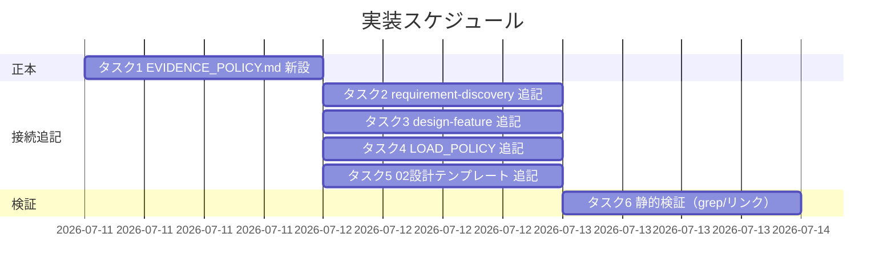
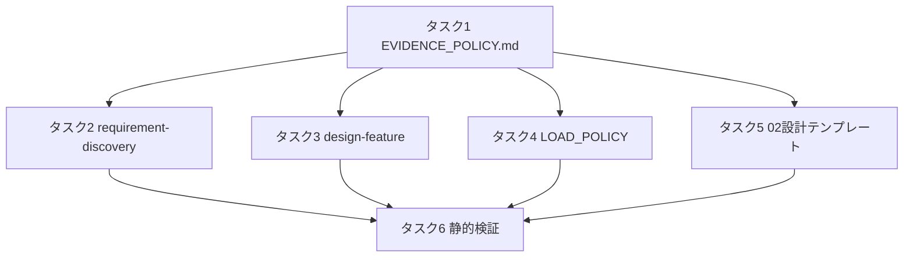

# 実装計画書: 上流フェーズ（要件定義・設計）でのフィジビリティ確認・ADR 的根拠記録の必須化

**プロジェクト名**: フィジビリティ・ADR 必須化（上流フェーズの根拠記録の process 化）
**作成日**: 2026 年 07 月 11 日
**最終更新**: 2026 年 07 月 11 日

> **重要**: **このドキュメントは常に更新**: 実装計画の変更、進捗状況の更新、バグの記録などがあった場合は、即座にこのドキュメントを更新してください。ドキュメントは「生きているドキュメント」として扱い、実装内容と常に同期させます。
> **必須項目**: 「必須」と明記した欄は空欄・抽象語のみで提出しないこと。テスト観点・BDD 仕様は具体ケースを 1 件以上記載すること。
>
> **用語**: [.agent-skill-chain/source/CONCEPTS.md §用語規約](../../../../../../../.agent-skill-chain/source/CONCEPTS.md#用語規約) を参照。

---

## 1. 実装概要

### 1.1 実装方針（必須）

[02\_設計.md](./02_設計.md) の「ポリシー正本 + 参照結線」パターンに従い、**新設 1 ファイル（`EVIDENCE_POLICY.md`）＋既存 4 ファイルへの参照追記**として実装する。evidence_source の分類は [CONCEPTS.md §外部根拠の必須化](../../../../../../../.agent-skill-chain/source/CONCEPTS.md#外部根拠の必須化external-anchor) を参照のみとし複製しない。既存 command / skill chain の実行順序・DoD・enforcement を変更しない。

### 1.2 実装順序（必須: 1 件以上）

正本ファイルを先に作成（タスク1）し、その後に各接続点を追記（タスク2〜5）、最後に静的検証（タスク6）を行う。タスク2〜5 はタスク1 完了後は相互に独立。



---

## 2. タスク分解

**用語**: [.agent-skill-chain/source/CONCEPTS.md §用語規約](../../../../../../../.agent-skill-chain/source/CONCEPTS.md#用語規約) を参照。

**必須**: 各タスクには **「テスト観点」（2.x.3）** と **「単体テスト仕様（BDD）」（2.x.4）** を必ず記載する。テスト観点の定義は **02\_設計 §6** および **RULES のテスト戦略・[TEST_BDD_FORMAT.md](../../../../../../../.agent-skill-chain/source/TEST_BDD_FORMAT.md)** を参照する。本 issue はドキュメント・ポリシー変更のため、単体テストは**静的検証（grep・存在確認・リンク解決）**で行う。

### 2.1 タスク 1: `EVIDENCE_POLICY.md`（新設正本）の作成

#### 2.1.1 概要（必須）

上流フェーズの根拠記録に関する全ルールの正本を `.agent-skill-chain/source/EVIDENCE_POLICY.md` に新設する（02 §3.1 の 5 節構成）。

#### 2.1.2 実装内容（必須: 1 件以上）

- `.agent-skill-chain/source/EVIDENCE_POLICY.md` を新規作成し、以下 5 節を記載する。
  1. **節 1 上流フェーズの義務**: requirement-discovery / design-feature 実行時、重要判断について一次情報（inference_only 以外の evidence_source）でフィジビリティを確認し、成果物中の当該判断に evidence_source を付記する義務。手段非依存・高リスク操作の事前確認不緩和を明記。
  2. **節 2 ADR 記録形式**: 最小集合＝コンテキスト・検討した選択肢・決定・根拠（evidence_source 付き）・帰結。02 設計の横断設計判断節から参照される旨を明記。
  3. **節 3 重要判断の定義 + 規模比例**: 重要判断＝採否が成果物の構造・実現可能性・後続フェーズを左右する判断（技術選定・外部依存採用・既存資産の変更方針・要件の除外・greenfield の土台決定）。軽量 issue の軽量パス（既存テンプレート必須セクション充足のみで完了可）。[CONTEXT_EFFICIENCY.md §適用のスケーリング](../../../../../../../.agent-skill-chain/source/CONTEXT_EFFICIENCY.md) へ相互参照。
  4. **節 4 inference_only 顕在化**: inference_only のみを根拠とする重要判断は成果物中で「要人間確認」と明示する（CONCEPTS.md の既存原則を参照。再定義しない）。process（執筆時）と event（verify-and-close）の役割分担を明記。
  5. **節 5 greenfield**: アーキテクチャ・コーディング規約・ディレクトリ構成決定を重要判断の代表例とし、記録は docs 側・spec 非上書きである旨（[spec/00_spec概要](../../../../../../../.agent-skill-chain/source/spec/00_spec概要.md) §spec と docs の違い）を明記。
- evidence_source の 6 分類表は**記載せず**、CONCEPTS.md への参照リンクのみを置く（SC-3/AC-5）。

#### 2.1.3 テスト観点（必須）

**参照**: 観点の定義は [02\_設計 §6](./02_設計.md) および [RULES のテスト戦略・TEST_BDD_FORMAT](../../../../../../../.agent-skill-chain/source/RULES.md#テスト戦略必須要件) を参照。以下には**本タスクの具体ケース**のみ記載する。

##### 単体（本タスクの具体ケース・必須 1 件以上）

- 正常系: `.agent-skill-chain/source/EVIDENCE_POLICY.md` が存在し、5 節（義務・ADR 形式・重要判断/規模比例・inference_only・greenfield）の見出しが grep で各 1 件以上ヒットする。
- 境界値: evidence_source の 6 分類の**定義表**（`| 種別 | 説明 |` 相当）が本ファイルに存在しない（CONCEPTS.md のみが正本＝SC-3）。参照リンク（`CONCEPTS.md §外部根拠の必須化`）は 1 件以上存在する。

##### 結合/API（本タスクの具体ケース・該当時は必須 1 件以上）

- 該当なし（実行コード・API を持たないドキュメント成果物）。

##### E2E/受け入れ（本タスクの具体ケース・未達時は理由記載）

- 該当なし（UI/エンドツーエンドの実行系がないため。静的検証で代替）。

##### バリデーション（該当する場合の具体ケース）

- 本ファイル内の全 markdown リンクが realpath で解決する（未解決 0 件）。

#### 2.1.4 単体テスト仕様（BDD）（必須）

**BDD 形式のテストケース（高レベル仕様）**:

```gherkin
Feature: EVIDENCE_POLICY.md 正本の作成
  Scenario: 5節が存在し分類の重複定義がない
    Given .agent-skill-chain/source/EVIDENCE_POLICY.md を新設した
    When ファイルの見出しと evidence_source 分類表の有無を検査する
    Then 5節（義務・ADR形式・重要判断/規模比例・inference_only・greenfield）の見出しが各1件以上存在し
    And evidence_source の6分類定義表は存在せず CONCEPTS.md への参照リンクのみが存在する
```

**テストコード例（必須: インラインコメントで Given/When/Then を明記）**

```bash
# Given: EVIDENCE_POLICY.md を新設した
f=.agent-skill-chain/source/EVIDENCE_POLICY.md
# When: 5節見出しと分類表の有無を検査する
test -f "$f" || echo "FAIL: 未作成"
for kw in フィジビリティ ADR 重要判断 inference_only greenfield; do
  grep -q "$kw" "$f" || echo "FAIL: 節欠落 $kw"
done
# Then: 6分類定義表（human_decision..inference_only を列挙する表行）が本文に無い＝重複再定義なし
grep -qE '\| *human_decision *\|' "$f" && echo "FAIL: 分類表を複製している(SC-3違反)"
grep -q '外部根拠の必須化' "$f" || echo "FAIL: CONCEPTS参照リンクがない"
```

#### 2.1.5 依存関係

- なし（本タスクが起点。タスク2〜5 は本タスクに依存）。



#### 2.1.6 見積もり

- **工数**: 1〜2 時間
- **優先度**: 高

### 2.2 タスク 2: `requirement-discovery.md` への参照接続

#### 2.2.1 概要（必須）

`commands/requirement-discovery.md` の「実行時の注意」に、00/01 執筆時の根拠義務を `EVIDENCE_POLICY.md` 参照 1 行で接続する（AC-1/SC-1）。

#### 2.2.2 実装内容（必須: 1 件以上）

- `.agent-skill-chain/source/commands/requirement-discovery.md` の §実行時の注意 に次の趣旨の 1 行を追記する: 「重要判断については [EVIDENCE_POLICY.md] に従い、執筆時点でフィジビリティ確認・一次情報調査を行い、成果物中の重要判断に **evidence_source** を付記すること（軽量 issue の軽量パスは EVIDENCE_POLICY.md 参照）」。
- 追記は「参照」表現に限定し、evidence_source の分類定義を複製しない。skill chain の順序・DoD を変更しない。

#### 2.2.3 テスト観点（必須）

**参照**: [02\_設計 §6](./02_設計.md) / [RULES のテスト戦略](../../../../../../../.agent-skill-chain/source/RULES.md#テスト戦略必須要件)。

##### 単体（本タスクの具体ケース・必須 1 件以上）

- 正常系: `grep -n "evidence_source" .agent-skill-chain/source/commands/requirement-discovery.md` が 1 件以上ヒットする（AC-1/SC-1）。
- 境界値: 追記行が `EVIDENCE_POLICY.md` への参照を含み、6 分類定義表を含まない。

##### 結合/API（該当時は必須 1 件以上）

- 該当なし（ドキュメント追記）。

##### E2E/受け入れ（未達時は理由記載）

- 該当なし（静的検証で代替）。

##### バリデーション（該当する場合）

- 追記した `EVIDENCE_POLICY.md` 参照リンクが realpath で解決する。

#### 2.2.4 単体テスト仕様（BDD）（必須）

```gherkin
Feature: requirement-discovery への根拠義務接続
  Scenario: evidence_source 義務が明記される
    Given requirement-discovery.md の実行時の注意に接続行を追記した
    When grep -n "evidence_source" requirement-discovery.md を実行する
    Then 1件以上ヒットし、その行が EVIDENCE_POLICY.md を参照している
```

```bash
# Given: requirement-discovery.md に接続行を追記した
f=.agent-skill-chain/source/commands/requirement-discovery.md
# When: evidence_source の出現を検査する
n=$(grep -c "evidence_source" "$f")
# Then: 1件以上あり、EVIDENCE_POLICY 参照を伴う
[ "$n" -ge 1 ] || echo "FAIL: AC-1 未達"
grep -q "EVIDENCE_POLICY" "$f" || echo "FAIL: 正本参照がない"
```

#### 2.2.5 依存関係

- タスク1（正本の存在）。

#### 2.2.6 見積もり

- **工数**: 15 分 / **優先度**: 高

### 2.3 タスク 3: `design-feature.md` への参照接続

#### 2.3.1 概要（必須）

`commands/design-feature.md` の「実行時の注意」に、02/03 執筆時の根拠義務・ADR 形式適用を `EVIDENCE_POLICY.md` 参照 1 行で接続する（AC-2/SC-2）。

#### 2.3.2 実装内容（必須: 1 件以上）

- `.agent-skill-chain/source/commands/design-feature.md` の §実行時の注意 に、「重要判断は [EVIDENCE_POLICY.md] の ADR 形式で記録し、フィジビリティ確認のうえ **evidence_source** を付記すること。greenfield の土台決定（アーキテクチャ・コーディング規約・ディレクトリ構成）も重要判断に含む」の趣旨の 1 行を追記する。
- 参照表現に限定。分類定義を複製しない。skill chain（define-boundaries → design-api-contract → review-dependencies）の順序・DoD を変更しない。

#### 2.3.3 テスト観点（必須）

##### 単体（本タスクの具体ケース・必須 1 件以上）

- 正常系: `grep -n "evidence_source" .agent-skill-chain/source/commands/design-feature.md` が 1 件以上ヒットする（AC-2/SC-2）。
- 境界値: 追記行に `EVIDENCE_POLICY.md` 参照と「ADR」「greenfield」相当の語が含まれる（AC-10 接続）。

##### 結合/API（該当時は必須 1 件以上）

- 該当なし。

##### E2E/受け入れ（未達時は理由記載）

- 該当なし（静的検証で代替）。

##### バリデーション（該当する場合）

- 追記参照リンクが realpath で解決する。

#### 2.3.4 単体テスト仕様（BDD）（必須）

```gherkin
Feature: design-feature への根拠義務・ADR接続
  Scenario: evidence_source と ADR 形式の適用が明記される
    Given design-feature.md の実行時の注意に接続行を追記した
    When grep -n "evidence_source" design-feature.md を実行する
    Then 1件以上ヒットし、その行が EVIDENCE_POLICY.md の ADR 形式を参照している
```

```bash
# Given: design-feature.md に接続行を追記した
f=.agent-skill-chain/source/commands/design-feature.md
# When: evidence_source の出現と ADR 参照を検査する
# Then: AC-2 と ADR 形式接続を満たす
[ "$(grep -c 'evidence_source' "$f")" -ge 1 ] || echo "FAIL: AC-2 未達"
grep -q 'EVIDENCE_POLICY' "$f" || echo "FAIL: 正本参照がない"
```

#### 2.3.5 依存関係

- タスク1。

#### 2.3.6 見積もり

- **工数**: 15 分 / **優先度**: 高

### 2.4 タスク 4: `LOAD_POLICY.md` へのトリガー行追加

#### 2.4.1 概要（必須）

「いつ何を読むか」の正本 `boot/LOAD_POLICY.md` に、上流フェーズの根拠記録トリガー行を 1 行追加して `EVIDENCE_POLICY.md` へ結線する。

#### 2.4.2 実装内容（必須: 1 件以上）

- `.agent-skill-chain/source/boot/LOAD_POLICY.md` のトリガー表に「**上流フェーズでの根拠記録・フィジビリティ確認・ADR 記録時** → EVIDENCE_POLICY.md（重要判断・規模比例・inference_only 顕在化）」の行を追加する。
- 「トリガー→読むファイル」の正本は LOAD_POLICY のみという既存原則（同ファイル冒頭）を維持し、他ファイルへトリガー表を複製しない。

#### 2.4.3 テスト観点（必須）

##### 単体（本タスクの具体ケース・必須 1 件以上）

- 正常系: `grep -n "EVIDENCE_POLICY" .agent-skill-chain/source/boot/LOAD_POLICY.md` が 1 件以上ヒットする。
- 境界値: 追加行がトリガー表内（`| ... | ... |` 形式）に位置し、既存行を破壊しない。

##### 結合/API（該当時は必須 1 件以上）

- 該当なし。

##### E2E/受け入れ（未達時は理由記載）

- 該当なし。

##### バリデーション（該当する場合）

- 追加参照リンクが realpath で解決する。

#### 2.4.4 単体テスト仕様（BDD）（必須）

```gherkin
Feature: LOAD_POLICY への根拠記録トリガー追加
  Scenario: 上流根拠記録の読了トリガーが結線される
    Given LOAD_POLICY.md のトリガー表に行を追加した
    When grep -n "EVIDENCE_POLICY" LOAD_POLICY.md を実行する
    Then 1件以上ヒットし、その行が上流フェーズの根拠記録トリガーである
```

```bash
# Given: LOAD_POLICY.md にトリガー行を追加した
f=.agent-skill-chain/source/boot/LOAD_POLICY.md
# When/Then: EVIDENCE_POLICY への結線を確認する
[ "$(grep -c 'EVIDENCE_POLICY' "$f")" -ge 1 ] || echo "FAIL: トリガー未結線"
```

#### 2.4.5 依存関係

- タスク1。

#### 2.4.6 見積もり

- **工数**: 15 分 / **優先度**: 中

### 2.5 タスク 5: `02_設計.md` テンプレートへの横断設計判断（ADR）節追加

#### 2.5.1 概要（必須）

`.agent-skill-chain/runtime/templates/02_設計.md` に「横断設計判断（ADR）」節を新設し、`EVIDENCE_POLICY.md` の ADR 形式を参照して重要判断を記録する枠を提供する（SC-4/AC-4）。

#### 2.5.2 実装内容（必須: 1 件以上）

- テンプレートの §2（アーキテクチャ設計）配下に「横断設計判断（ADR）」節を追加し、テンプレート内から `EVIDENCE_POLICY.md`（テンプレートは消費者ランタイム `.agent-skill-chain/runtime/{issue}/` 基準のため `../../.agent-skill-chain/source/EVIDENCE_POLICY.md` の 2 階層リンクで記載する）の ADR 形式（コンテキスト・検討した選択肢・決定・根拠[evidence_source 付き]・帰結）で重要判断を記録する旨と記入枠を置く。
- 分類定義は複製せず、EVIDENCE_POLICY.md / CONCEPTS.md への参照に留める。テンプレートの既存 document_id（`00000000-...`）は変更しない。

#### 2.5.3 テスト観点（必須）

##### 単体（本タスクの具体ケース・必須 1 件以上）

- 正常系: `grep -n "EVIDENCE_POLICY" .agent-skill-chain/runtime/templates/02_設計.md` が 1 件以上ヒットし、「横断設計判断」または「ADR」見出しが存在する（SC-4/AC-4）。
- 境界値: 既存節（§1〜§12）の見出し番号が壊れていない（テンプレートの必須セクションを欠かさない）。

##### 結合/API（該当時は必須 1 件以上）

- 該当なし。

##### E2E/受け入れ（未達時は理由記載）

- 該当なし（テンプレートの静的検証で代替）。

##### バリデーション（該当する場合）

- テンプレートの `../../.agent-skill-chain/source/...` 相対リンク（テンプレートは消費者ランタイム `.agent-skill-chain/runtime/{issue}/` を基準とする 2 階層）が整合する。

#### 2.5.4 単体テスト仕様（BDD）（必須）

```gherkin
Feature: 02設計テンプレートへのADR節追加
  Scenario: 横断設計判断節が正本を参照する
    Given templates/02_設計.md に横断設計判断（ADR）節を追加した
    When grep で ADR 見出しと EVIDENCE_POLICY 参照を検査する
    Then 「横断設計判断」または「ADR」見出しが存在し、EVIDENCE_POLICY.md を参照している
```

```bash
# Given: テンプレートに ADR 節を追加した
f=.agent-skill-chain/runtime/templates/02_設計.md
# When/Then: ADR 節と正本参照を確認する
grep -qE 'ADR|横断設計判断' "$f" || echo "FAIL: ADR 節が無い"
grep -q 'EVIDENCE_POLICY' "$f" || echo "FAIL: 正本参照が無い"
```

#### 2.5.5 依存関係

- タスク1。

#### 2.5.6 見積もり

- **工数**: 20 分 / **優先度**: 中

### 2.6 タスク 6: 静的検証（grep・存在確認・リンク解決）と SC 全項目の突合

#### 2.6.1 概要（必須）

タスク1〜5 の成果に対し、01 の受け入れ基準（AC-1〜AC-11）・00 の成功基準（SC-1〜SC-7）を grep・存在確認・realpath で全件検証する。

#### 2.6.2 実装内容（必須: 1 件以上）

- AC-1/SC-1（requirement-discovery の evidence_source）、AC-2/SC-2（design-feature の evidence_source）、SC-3/AC-5（分類の非重複）、SC-4/AC-4（ADR 形式正本化・テンプレート接続）、SC-5/AC-8/AC-9（規模比例）、SC-6/AC-6/AC-7（inference_only 顕在化・event 無変更）、SC-7/AC-10/AC-11（greenfield）を検証するチェックリストを実行する。
- 変更・新設した全 markdown ファイルのリンクを realpath で解決し未解決 0 件を確認する。
- verify-and-close.md が無変更である（AC-7）ことを git diff 等で確認する。

#### 2.6.3 テスト観点（必須）

##### 単体（本タスクの具体ケース・必須 1 件以上）

- 正常系: 上記 AC/SC の grep・存在確認が全て期待どおり（FAIL 0 件）。
- 境界値: SC-3（分類表の重複ゼロ）— 新設・変更ファイル全体で `| human_decision |` 相当の分類定義表が CONCEPTS.md 以外に出現しない。

##### 結合/API（該当時は必須 1 件以上）

- 該当なし。

##### E2E/受け入れ（未達時は理由記載）

- 受け入れ検証は「上流 command を読んだサブが根拠義務を一意に認識できる」ことを、command 追記行の具体性（EVIDENCE_POLICY.md 参照・evidence_source の語を含む）で代替確認する。実行系 E2E は本 issue には存在しない。

##### バリデーション（該当する場合）

- 全成果物のリンク解決（未解決 0 件）。

#### 2.6.4 単体テスト仕様（BDD）（必須）

```gherkin
Feature: 受け入れ基準・成功基準の一括静的検証
  Scenario: AC-1..AC-11 / SC-1..SC-7 を全件満たす
    Given タスク1〜5 の変更が適用されている
    When AC/SC の grep・存在確認・リンク解決を一括実行する
    Then すべての判定が期待どおりで FAIL 0 件であり
    And verify-and-close.md は無変更である（AC-7）
```

```bash
# Given: タスク1〜5 適用済み
# When: 主要 SC を検査する
src=.agent-skill-chain/source
[ "$(grep -c evidence_source "$src/commands/requirement-discovery.md")" -ge 1 ] || echo "FAIL SC-1"
[ "$(grep -c evidence_source "$src/commands/design-feature.md")" -ge 1 ] || echo "FAIL SC-2"
# SC-3: 6分類定義表が CONCEPTS.md のみ（他に | human_decision | が無い）
others=$(grep -rl '| *human_decision *|' "$src" | grep -v 'CONCEPTS.md' | wc -l)
[ "$others" -eq 0 ] || echo "FAIL SC-3: 分類表の重複"
# Then: verify-and-close は無変更（本 issue のブランチ差分に現れない）
git diff --name-only | grep -q 'commands/verify-and-close.md' && echo "FAIL AC-7: 誤変更"
echo "検証完了"
```

#### 2.6.5 依存関係

- タスク1〜5 すべて。

#### 2.6.6 見積もり

- **工数**: 30 分 / **優先度**: 高

---

## テスト観点

本実装計画全体のテスト観点は「静的検証（grep・存在確認・リンク解決・git diff）」に集約される（実行コードを持たないドキュメント・ポリシー変更のため）。各タスクの §2.x.3 に具体ケースを記載した。監査では 02\_設計 §6.1 の割当表と本セクション・各タスクの対応が揃っていることを確認する。AC-1〜AC-11 / SC-1〜SC-7 の全項目がタスク6 のチェックリストで検証される。

---

## 単体テスト

単体テストは grep / test -f / realpath ベースのシェル検証で実施する（各タスク §2.x.4 の「テストコード例」参照）。対象は「正本 5 節の存在」「command への evidence_source 接続」「分類表の非重複」「ADR 形式のテンプレート接続」「リンク解決」。実行系の単体テスト（言語・フレームワーク依存）は本 issue には存在しない。

---

## BDD

BDD シナリオ一覧（Given/When/Then。TEST_BDD_FORMAT に従う）:

- タスク1: EVIDENCE_POLICY.md 5 節存在・分類非重複（§2.1.4）— 01 ユースケース1/2 の前提となる正本の成立。
- タスク2: requirement-discovery への evidence_source 接続（§2.2.4）— 01 ストーリー1・AC-1・ユースケース1。
- タスク3: design-feature への evidence_source・ADR 接続（§2.3.4）— 01 ストーリー2/5・AC-2/AC-10・ユースケース2/4。
- タスク4: LOAD_POLICY トリガー結線（§2.4.4）— 01 ストーリー1 の読了経路。
- タスク5: 02 テンプレートの ADR 節（§2.5.4）— 01 ストーリー2・AC-4・ユースケース2。
- タスク6: AC/SC 一括検証（§2.6.4）— 01 全ストーリー・00 全 SC、および 01 ユースケース3（軽量パス）・ユースケース2 シナリオ2（event 無変更）。

> **01 の BDD との対応**: 01 §2.2 ユースケース1（フィジビリティ確認）→ タスク1 節1・タスク2、ユースケース1 シナリオ2（inference_only 顕在化）→ タスク1 節4、ユースケース2（ADR 記録）→ タスク1 節2・タスク3・タスク5、ユースケース2 シナリオ2（event 接続）→ タスク1 節4・タスク6（verify-and-close 無変更確認）、ユースケース3（軽量パス）→ タスク1 節3・タスク6、ユースケース4（greenfield）→ タスク1 節5・タスク3。

---

## 3. 実装スケジュール

### 3.1 マイルストーン

| マイルストーン | 期日 | 成果物 |
| -------------- | ---- | ------ |
| 正本作成 | Day 1 | `EVIDENCE_POLICY.md` |
| 接続完了 | Day 1 | requirement-discovery / design-feature / LOAD_POLICY / 02 テンプレートの追記 |
| 検証完了 | Day 1 | AC/SC 全件パスの静的検証結果（04_review で再実行） |

### 3.2 実装フェーズ

#### フェーズ 1: 正本 + 接続 + 検証

- **期間**: 1 日（合計 2〜3 時間）
- **タスク**: タスク1〜6

---

## 4. テスト計画

テスト観点・レベル・BDD 形式の定義は **02\_設計 §6** および **RULES のテスト戦略・TEST_BDD_FORMAT** を参照。本 issue は静的検証中心のため、各タスクの §2.x.3 にタスクごとの具体ケースを記載し、§2.x.4 に BDD 仕様を記載した。

### 4.1 テストの優先順位

- クリティカル: AC-1/AC-2（command への evidence_source 接続）・SC-3（分類非重複）を最優先で検証する（形骸化・二重定義という 00 §7.1 の主要リスクに直結）。
- 回帰: 既存 command の skill chain 順序・DoD、および verify-and-close.md の無変更（AC-7）を必ず確認する。

---

## 5. リスク管理

### 5.1 実装リスク

- **リスク**: 接続行が正本の文言を複製し、evidence_source 分類が二重定義される（SC-3/AC-5 違反）。
  - **対策**: 接続行を必ず「参照」表現に限定し、タスク6 で `| human_decision |` 相当の分類表が CONCEPTS.md 以外に出現しないことを grep で検証する。
- **リスク**: 追記により既存 command / テンプレートの見出し・skill chain 順序が壊れる。
  - **対策**: 追記は「実行時の注意」「トリガー表」「§2 配下の新節」への末尾追加に限定し、既存節を改変しない。テンプレートの document_id を変更しない。
- **リスク**: 義務化が形骸化し、evidence_source を機械的に付記するだけになる。
  - **対策**: 重要判断の定義 + inference_only 顕在化ルール（節3/節4）をセットで正本化し、event 側（verify-and-close 既存）が二重安全網として機能する構造を維持する（enforcement 自動検査は新設しない＝02 ADR-5）。
- **リスク**: 実装着手が親 issue ストーリー8（`.agents/` 改名）と競合する。
  - **対策**: 本 issue は既に改名後のパス（`.agent-skill-chain/source/`）を前提に設計済み（00/01 のパス修正を実施済み）。着手順は orchestrator が判断する（01 §5・00 §4.3）。

---

## 6. 参考資料

### プロジェクトドキュメント

- [`02_設計.md`](./02_設計.md) - 設計
- [`01_要件定義.md`](./01_要件定義.md) - 要件定義
- [`00_要求定義.md`](./00_要求定義.md) - 要求定義

### その他の参考資料

- [.agent-skill-chain/source/CONCEPTS.md §外部根拠の必須化](../../../../../../../.agent-skill-chain/source/CONCEPTS.md#外部根拠の必須化external-anchor) — evidence_source 分類の正本
- [.agent-skill-chain/source/CONTEXT_EFFICIENCY.md §適用のスケーリング](../../../../../../../.agent-skill-chain/source/CONTEXT_EFFICIENCY.md) — 規模比例の思想
- [.agent-skill-chain/source/TEST_BDD_FORMAT.md](../../../../../../../.agent-skill-chain/source/TEST_BDD_FORMAT.md) — BDD 形式の定義

---

## 7. 前のステップ

この実装計画書は、以下のドキュメントを基に作成されています：

- **前**: [`02_設計.md`](./02_設計.md) - 設計フェーズ

---

## 8. 次のステップ

この実装計画書の承認後、以下のいずれかのステップに進みます：

- **プロジェクトが 1 つの issue（またはタスク）である場合**: 実装フェーズ（execution）に直接進む（本 issue は 1 issue 内のタスク分解であり、サブ issue へ再分割しない）。

**用語**: [.agent-skill-chain/source/CONCEPTS.md §用語規約](../../../../../../../.agent-skill-chain/source/CONCEPTS.md#用語規約) を参照。
