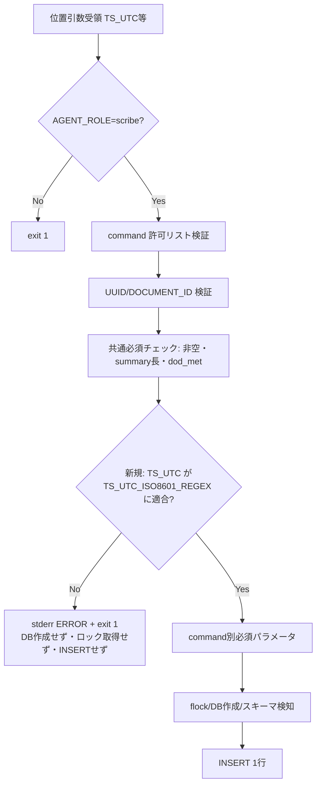
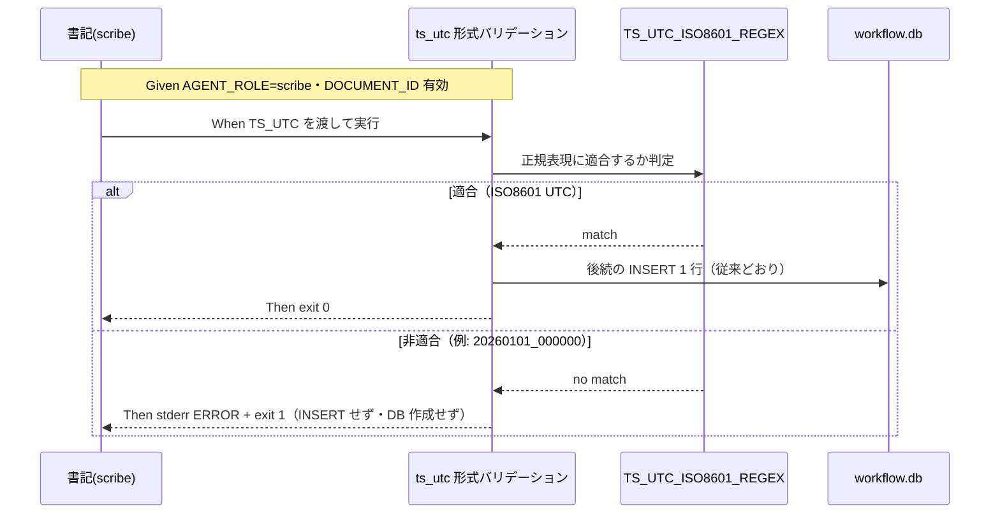
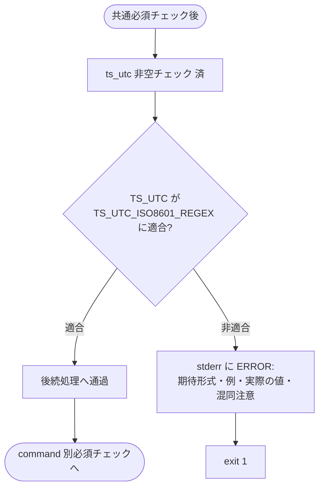

# 設計書: write-workflow-log.sh の ts_utc ISO8601 形式バリデーション追加

**プロジェクト名**: write-workflow-log.sh の ts_utc ISO8601 形式バリデーション追加（親 issue: agentsOS 汎用化・ポリシー統合 のサブ issue）
**作成日**: 2026 年 07 月 11 日
**最終更新**: 2026 年 07 月 11 日

> **重要**: **このドキュメントは常に更新**: 設計の変更や追加があった場合は、即座にこのドキュメントを更新してください。ドキュメントは「生きているドキュメント」として扱い、実装内容と常に同期させます。
>
> **用語**: [.agent-skill-chain/source/CONCEPTS.md §用語規約](../../../../../../../.agent-skill-chain/source/CONCEPTS.md#用語規約) を参照。

---

## 1. 設計概要

**必須**: 設計方針・原則は [.agent-skill-chain/source/spec/01\_設計原則.md](../../../../../../../.agent-skill-chain/source/spec/01_設計原則.md) を先に参照した上で、本プロジェクトに適用するものを選び記載する。

### 1.1 設計方針

`write-workflow-log.sh` に、第 4 引数 `TS_UTC` の **ISO8601 UTC 形式バリデーション（fail-fast ゲート）** を、既存の共通必須チェック段階（DB 接続・ロック取得・INSERT のいずれよりも前）へ 1 か所だけ追加する。既存の同型バリデーション（`validate_uuid_if_set`・DOCUMENT_ID 必須化・dod_met 0/1）と同じ「正規表現定数 ＋ `ERROR:` メッセージ ＋ `exit 1`」スタイルに合わせ、スクリプト内の一貫性と可読性を最優先する。

### 1.2 設計原則（本プロジェクトで適用するもの）

- **UNIX哲学**: 「1 つのことをうまくやる」。本改修は入力ゲート 1 点の追加のみで、書記ラッパーの他責務（UUID 検証・スキーマ検知・INSERT・ハッシュ連結）に手を入れない。
- **単一責務**: 追加するのは「TS_UTC が ISO8601 UTC 形式か」を判定して非適合なら fail-fast する、という単一責務のみ。契約定義（CONTRACT.md）・事後検知（audit.sh）・スキーマは変更しない。
- **AIフレンドリー設計**: 形式定義を 1 つの named constant（`TS_UTC_ISO8601_REGEX`）に集約し（[01\_設計原則 §AIフレンドリー設計](../../../../../../../.agent-skill-chain/source/spec/01_設計原則.md#aiフレンドリー設計) の「意図が分かる命名」「小さな責務」）、エラーメッセージに期待形式・実際の値・混同源（JST memo プレフィックス形式）を明記して、次に読む人間・AI が即座に自己修正できるようにする。
- **CQRS**: 本改修は Command（状態変更＝INSERT）経路の入口ガードであり、Query 経路（`--print-head`・`resolve_head_hash`）には一切干渉しない（§2.2.1）。

---

## 2. アーキテクチャ設計

### 2.1 責務・境界・参照関係

#### 2.1.1 責務一覧

| コンポーネント | 責務（1 文） |
| -------------- | ------------ |
| `TS_UTC_ISO8601_REGEX`（新規・定数） | 受理する ISO8601 UTC 形式の唯一の正規表現定義（単一情報源）を保持する。 |
| ts_utc 形式バリデーション（新規・共通必須チェック内の 1 ブロック） | `TS_UTC` が `TS_UTC_ISO8601_REGEX` に適合するかを判定し、非適合なら stderr にエラーを出して `exit 1` する（INSERT 前に fail-fast）。 |
| 既存の共通必須チェック（変更なし） | command / summary / ts_utc の非空・summary 長・dod_met 0/1 を検証する（本改修はこの直後に新ブロックを挿入するのみ）。 |
| `write-workflow-log.sh` の他部分（変更なし） | AGENT_ROLE ガード・command 許可リスト・UUID 検証・スキーマ検知/マイグレーション・flock/リトライ INSERT・prev_hash 連結・document_id 不変。 |
| `scribe/CONTRACT.md`（変更なし・上位契約） | 「ts_utc = ISO8601 時刻（UTC 基準）」という契約定義の正本。本改修はこれを実装側で強制するだけで、契約自体は変えない。 |
| `enforcement/ci/audit.sh` の `bad_ts`（変更なし・事後検知） | 記録済み台帳の ts_utc 異常を CI で事後検知する（緩判定のまま。強化は別 issue）。 |

#### 2.1.2 境界

- **入力**: 位置引数 `TS_UTC`（第 4 引数）。スクリプト冒頭で `TS_UTC="$4"` として受領済みの文字列。
- **出力**: 適合時は何もせず後続処理へ通す（副作用なし）。非適合時は stderr へ `ERROR: ...` を出力し `exit 1`（INSERT・DB 作成・ロック取得のいずれも行わない）。
- **他責務との境界**:
  - **契約定義**（CONTRACT.md）は本 issue の対象外＝変更しない。本改修は「契約の実装側強制」に限る。
  - **事後検知**（audit.sh の `bad_ts`）は本 issue の対象外＝変更しない。役割分担は §3.2 の二重化設計で明記する。
  - **過去データの是正**は対象外（追記のみの台帳。既存 3 件は是正 INSERT 済み）。
  - **他カラム**（created_at 等）の検証追加は対象外。

#### 2.1.3 参照関係

- ts_utc 形式バリデーション → `TS_UTC_ISO8601_REGEX`（定数を参照）。
- ts_utc 形式バリデーション → `TS_UTC`（第 4 引数の値を参照）。
- 実装（スクリプト）→ `scribe/CONTRACT.md`（契約定義に準拠。一方向・契約への書き込みなし）。
- 循環参照なし。バリデーションは他の関数（`to_json_array` / `gen_entry_hash` / `resolve_head_hash` 等）を呼ばず、それらからも呼ばれない。

### 2.2 システムアーキテクチャ

**必須**: 設計判断は [.agent-skill-chain/source/spec/](../../../../../../../.agent-skill-chain/source/spec/)（[00_spec概要.md](../../../../../../../.agent-skill-chain/source/spec/00_spec概要.md)、[01\_設計原則.md](../../../../../../../.agent-skill-chain/source/spec/01_設計原則.md)、[06\_設計判断の優先順位.md](../../../../../../../.agent-skill-chain/source/spec/06_設計判断の優先順位.md)）を先に参照した。

- **採用パターン**: 入口ガード（Guard Clause / fail-fast validation）を既存の共通必須チェック列に追加するインライン方式。
- **根拠**: [06\_設計判断の優先順位.md](../../../../../../../.agent-skill-chain/source/spec/06_設計判断の優先順位.md) の「可読性 > 単一責務 > 仕様との整合性」。既存の他バリデーションと同じ場所・同じスタイルに揃えることで、読み手が「入力チェックはここに集まっている」という一貫した構造を維持できる。関数化より、既存の非空チェックの直後にインライン展開する方が読みの連続性が高い（`validate_uuid_if_set` は「指定時のみ」という条件分岐があるため関数化されているが、ts_utc は常に必須のため単純なインライン if で足りる）。

#### 2.2.1 CQRS（Command/Query 分離）

- **Command**: 位置引数を伴う通常呼び出し（`command summary dod_met ts_utc ...`）＝ workflow_log への 1 行 INSERT（状態変更）。本改修のバリデーションはこの Command 経路の入口にのみ効く。
- **Query**: `--print-head` サブコマンド（最新 entry_hash を read するのみ・状態非変更）。`--print-head` は引数解析（`TS_UTC="$4"`）に到達する前に `exit 0` するため、本改修の影響を受けない（後方互換）。

#### 2.2.2 アーキテクチャ図（本プロジェクトの構成で記載）



### 2.3 コンポーネント構成

境界・単一責務（[01\_設計原則 §明確な境界・§単一責務](../../../../../../../.agent-skill-chain/source/spec/01_設計原則.md)）に従い、変更は `write-workflow-log.sh` 内の 2 箇所に閉じる。

- **定数ブロック**: 既存 `UUID_REGEX`（160 行目付近）と同じ位置づけで `TS_UTC_ISO8601_REGEX` を宣言する。形式定義の単一情報源（二重定義禁止・要件 3.4）。
- **バリデーションブロック**: 既存の共通必須チェック（`command / summary / ts_utc` 非空チェック。現 200〜203 行目）の直後に、`TS_UTC` を対象とした ISO8601 適合判定を挿入する。DB 作成・ロック取得（現 235 行目以降）より前に位置し、fail-fast 位置の受け入れ基準（00 §6-5）を満たす。

新規ファイル・新規モジュールは作らない（UNIX 哲学: 小さく作る）。

### 2.4 データフロー

本機能はイベントを発行しない（同期的な入口ガード）。[01\_設計原則 §イベント駆動](../../../../../../../.agent-skill-chain/source/spec/01_設計原則.md#イベント駆動) の「単純な同期処理で十分な場合は無理に導入しない」に従う。参考までに、本ゲートが表す「起きた事実」に相当する概念は `TsUtcRejected`（記録拒否）／`TsUtcAccepted`（通過）だが、コード上はイベントオブジェクトを生成せず、`exit 1` ／ 後続処理継続で表現する。



### 2.5 横断設計判断（ADR）

#### ADR-1: ts_utc の受理形式（正規表現のスコープ）

- **コンテキスト**: `TS_UTC` の非空チェックしかなく、JST の memo プレフィックス形式 `YYYYMMDD_HHMMSS`（例 `20260711_052131`）等の非 ISO8601 値が INSERT されていた。受理範囲を厳しくしすぎると既存の正常系呼び出しを壊し、緩くしすぎると混同源（JST 形式・オフセット付き非 UTC 値）を通してしまう。
- **検討した選択肢**:
  - **案A（採用）**: bash 組み込み `[[ =~ ]]` で `^[0-9]{4}-[0-9]{2}-[0-9]{2}T[0-9]{2}:[0-9]{2}:[0-9]{2}(\.[0-9]+)?Z$` に一致するもののみ受理。すなわち `YYYY-MM-DDTHH:MM:SSZ`（＋任意の小数秒 `.sss`）で末尾 `Z`（UTC）必須。
  - **案B**: 案A に加えて数値オフセット `±HH:MM` も受理（`(Z|[+-][0-9]{2}:[0-9]{2})`）。
  - **案C**: `date -d "$TS_UTC"` 等でパースして判定。
- **決定**: 案A。
- **根拠**:
  - **既存呼び出しの実測**: `.agent-skill-chain/source` と `test/` の全呼び出し・テスト値を調査した結果、ts_utc に渡している形式は例外なく `%Y-%m-%dT%H:%M:%SZ`（末尾 `Z`）のみ（`created_at` も同一。小数秒・オフセットの使用は 0 件）。案A で既存正常系は無回帰（要件 2.1・3.3）。evidence_source: internal-observed（`grep -rhoE 'date -u \+"[^"]*"'` および `test/` のリテラル ts_utc 値の全数調査で、`+00:00`／`.NNNZ` の使用なしを確認）。
  - **UTC 契約の保全**: CONTRACT.md は「UTC 基準」を意図し、今回の不具合はまさに非 UTC（JST）値の混入だった。末尾 `Z` を必須にすることで UTC 保証を強くし、`+09:00` 等の非 UTC 値も構造的に拒否できる（案B はオフセットを許すため UTC 保証が緩む）。オフセット受理は現時点で需要がなく YAGNI。
  - **外部依存ゼロ**: 案C は GNU date 拡張（`date -d`）に依存し、要件 4.1・制約（POSIX 互換・外部依存追加禁止）に反する。案A は bash 組み込み正規表現 1 回のみで、パフォーマンス要件（数 ms 超の増加なし）も満たす。evidence_source: internal-spec（00 §4.1・01 §5 の制約）。
  - 小数秒 `(\.[0-9]+)?` は将来 `date -u +%Y-%m-%dT%H:%M:%S.%3NZ` を使う可能性への低リスクな前方互換（末尾 `Z` は維持されるため UTC 保証を損なわない）。
- **帰結**: 受理形式が 1 つの正規表現定数に確定する。既存の全呼び出しは通過し、`20260101_000000`・`2026/07/11 00:00:00`・`2026-07-11`（日付のみ）・`invalid`・`1720656000`（epoch）・`2026-07-11T00:00:00+09:00`（オフセット）はすべて拒否される。将来オフセット受理が必要になった場合は本 ADR を更新して定数を拡張する（局所変更）。

#### ADR-2: バリデーションの実装形態と配置

- **コンテキスト**: 既存には「指定時のみ検証する」`validate_uuid_if_set` 関数と、インラインの必須チェック（非空・dod_met）が併存する。ts_utc をどちらの形で・どこに置くか。
- **検討した選択肢**:
  - **案A（採用）**: 形式定義を named constant `TS_UTC_ISO8601_REGEX` として `UUID_REGEX` 付近に置き、判定は共通必須チェック（非空チェック）の直後にインライン `if [[ ! "$TS_UTC" =~ $TS_UTC_ISO8601_REGEX ]]; then ...; exit 1; fi` で行う。
  - **案B**: `validate_ts_utc()` 関数を新設して呼ぶ。
- **決定**: 案A。
- **根拠**: ts_utc は常に必須（`validate_uuid_if_set` のような「空ならスキップ」条件が不要）で、呼び出し箇所も 1 か所のため、関数化するとかえって間接参照が増え可読性が下がる（[06 優先順位](../../../../../../../.agent-skill-chain/source/spec/06_設計判断の優先順位.md): 「抽象化より意図の明確さ」「再利用性より責務の明確さ」）。既存のインライン必須チェック群（non-empty・summary 長・dod_met）と同じ場所・同じ見た目に揃えることで、入力ゲートが 1 箇所に集約された構造の一貫性を保つ。形式定義（正規表現）だけは定数として単一化し、二重定義を禁止（要件 3.4）。evidence_source: internal-spec（既存コード 160/200〜211 行目の実装スタイル）。
- **帰結**: 変更は「定数 1 行 ＋ if ブロック 1 個」に収まり、旧・新スキーマ両経路（分岐は共通必須チェックより後段）に等しく効く（要件 3.3）。

---

## 3. 機能設計

### 3.1 機能 1: ts_utc の ISO8601 UTC 形式バリデーション（fail-fast）

#### 3.1.1 概要

第 4 引数 `TS_UTC` が ISO8601 UTC 形式（`YYYY-MM-DDTHH:MM:SSZ`、任意の小数秒可、末尾 `Z` 必須）でなければ、INSERT・DB 作成・ロック取得のいずれよりも前に `exit 1` で失敗させる。

#### 3.1.2 処理フロー



#### 3.1.3 入力・出力

- **入力**: `TS_UTC`（第 4 引数の文字列。非空チェック済み）、`TS_UTC_ISO8601_REGEX`（定数）。
- **出力**: 適合＝副作用なしで後続へ通過。非適合＝stderr に `ERROR:` を出力し `exit 1`（DB・ロック・INSERT に一切触れない）。

#### 3.1.4 エラーハンドリング

- 既存 `ERROR: ...`（日本語・stderr・`exit 1`）スタイルに統一する。エラーメッセージには次の 3 要素を含める（要件 ストーリー 2 の受け入れ基準 a/b/c）:
  - (a) ts_utc が ISO8601 UTC 形式でない旨、
  - (b) 期待形式と具体例（`YYYY-MM-DDTHH:MM:SSZ`、例 `2026-07-11T00:00:00Z`）、
  - (c) 実際に渡された値（`$TS_UTC`）。
- 併せて混同源への注意（JST の memo/issue プレフィックス形式 `YYYYMMDD_HHMMSS` は別物であり、UTC 時刻は `date -u +"%Y-%m-%dT%H:%M:%SZ"` で取得する旨）を付す。
- **エラーメッセージ例（実装時の文面基準）**:
  ```
  ERROR: ts_utc が ISO8601 UTC 形式ではありません。期待形式: YYYY-MM-DDTHH:MM:SSZ（例: 2026-07-11T00:00:00Z）。渡された値: '20260101_000000'。memo/issue プレフィックス形式（YYYYMMDD_HHMMSS・JST）とは別物です。UTC 時刻は date -u +"%Y-%m-%dT%H:%M:%SZ" で取得してください。
  ```

### 3.2 機能 2: 事前防止（スクリプト）と事後検知（audit.sh）の二重化（役割分担の明記）

#### 3.2.1 概要

本改修はコードを追加する対象が `write-workflow-log.sh` のみだが、台帳の時刻品質は「契約 → 事前防止 → 事後検知」の三層で守る。本節はその役割分担を設計として明記する（audit.sh は変更しない）。

#### 3.2.2 三層の責務境界

| 層 | 主体 | 役割 | 本 issue での扱い |
| -- | ---- | ---- | ---------------- |
| 契約（事前の約束） | `scribe/CONTRACT.md` | 「ts_utc = ISO8601 時刻（UTC 基準）」を定義 | 変更しない（正本を参照） |
| 事前防止（入口） | `write-workflow-log.sh`（本改修） | 非 ISO8601 UTC 値を **INSERT 前に構造的に拒否**（fail-fast） | **本 issue で新規追加** |
| 事後検知（監査） | `audit.sh` の `bad_ts`（`ts_utc NOT GLOB '*[0-9]*'`） | 記録済み台帳の明白な破損（数字を全く含まない/空）を CI で検知 | 変更しない（緩判定のまま維持） |

#### 3.2.3 二重化の設計意図

- 事前防止は「新規混入をゼロにする」入口ガード。事後検知は「万一すり抜けた/過去に混入した破損」を CI で拾う最終防波堤。両者は**代替ではなく相補**（事前防止があっても、スクリプトを経由しない直接 INSERT 等の異常系は事後検知が担う）。
- 本改修後、`bad_ts` は依然として緩判定（`YYYYMMDD_HHMMSS` のような「数字を含む誤形式」は事後検知では拾えない）だが、**事前防止でそれらは INSERT 段階で拒否される**ため、正規経路（書記スクリプト）を通る限り誤形式は台帳に入らない。`bad_ts` の判定強化（ISO8601 厳格化）は本 issue のスコープ外＝別 issue（00 §5・01 §2.3）。
- この役割分担を設計として残すことで、将来「audit も厳格化すべきでは」という指摘に対し「事前防止が主・事後検知は最終防波堤」という設計意図を参照できる。

---

## 4. データ設計

### 4.1 データモデル

スキーマ変更なし。本改修は `workflow_log.ts_utc`（TEXT・NOT NULL・`CHECK(length(ts_utc) > 0)`）への**書き込み前の入口バリデーション**であり、テーブル定義・CHECK 制約・インデックスには一切手を入れない（00 §5・01 §4.2）。

#### 対象カラム

| カラム名 | 型 | NULL | 説明 | 本改修での扱い |
| -------- | -- | ---- | ---- | -------------- |
| ts_utc | TEXT | NO | ISO8601 UTC 時刻（`scribe/CONTRACT.md` 準拠） | 書き込み前に形式を検証（スキーマ・CHECK は不変） |

### 4.2 データ構造

- `TS_UTC_ISO8601_REGEX`（bash 文字列定数）: `^[0-9]{4}-[0-9]{2}-[0-9]{2}T[0-9]{2}:[0-9]{2}:[0-9]{2}(\.[0-9]+)?Z$`。受理形式の単一情報源。

---

## 5. API 設計

CLI（位置引数）契約であり、REST エンドポイントは存在しない。呼び出しインターフェースは不変で、追加されるのは `TS_UTC` の形式検証のみ（要件 4.1）。

### 5.1 API 一覧

| インターフェース | 種別 | 説明 |
| ---------------- | ---- | ---- |
| `write-workflow-log.sh command summary dod_met ts_utc [issue_path] [changed_files]` | CLI 位置引数 | 変更なし。第 4 引数 `ts_utc` に形式検証が追加される。 |
| `write-workflow-log.sh --print-head` | CLI サブコマンド | 変更なし（引数解析前に exit するため ts_utc 検証の影響を受けない）。 |

### 5.2 API 詳細

#### API1: ts_utc 引数の契約

- **インターフェース**: 第 4 位置引数 `ts_utc`。
- **入力（受理）**: `TS_UTC_ISO8601_REGEX` に適合する文字列。最低ライン `date -u +"%Y-%m-%dT%H:%M:%SZ"` の出力（`YYYY-MM-DDTHH:MM:SSZ`）。任意の小数秒可。
- **出力（正常）**: 従来どおり後続の INSERT が実行され `exit 0`。
- **契約違反時（不正入力・境界外）**: `TS_UTC_ISO8601_REGEX` 非適合（日付のみ・区切り違い・オフセット付き・epoch 数値・非空文字列全般）は stderr に `ERROR:`（期待形式の例＋実際の値＋混同注意）を出し `exit 1`。DB 作成・ロック取得・INSERT の副作用を残さない。
- **終了コード契約**: 正常 0 ／ 形式違反 1（既存のエラー系と同一）。

---

## 6. テスト戦略

テスト戦略の観点定義は [RULES.md のテスト戦略必須要件](../../../../../../../.agent-skill-chain/source/RULES.md#テスト戦略必須要件)、BDD 形式は [TEST_BDD_FORMAT.md](../../../../../../../.agent-skill-chain/source/TEST_BDD_FORMAT.md) を参照。本ドキュメントでは対象ごとのテスト割当のみ記載する。

### 6.1 対象ごとのテスト割り当て

| 対象 | 単体 | 結合/API | E2E | クリティカル観点 | バリデーション観点 | 未達理由/補足 |
| ---- | ---- | -------- | --- | ---------------- | ------------------ | ------------- |
| ts_utc 形式バリデーション（正常系） | ○ | ○ | × | 既存正常系の無回帰（`...SSZ` は従来どおり 1 行 INSERT） | 受理: `2026-07-11T00:00:00Z`、小数秒 `...00.123Z` | E2E 不要（CLI スクリプト単体で完結） |
| ts_utc 形式バリデーション（異常系） | ○ | ○ | × | 誤形式が INSERT 前に exit 1・行数不変・DB 未作成 | 拒否: `20260101_000000` / `2026/07/11 00:00:00` / `2026-07-11` / `invalid` / `1720656000` / `+09:00` | 隔離環境（mktemp -d）で終了コード・行数を実測 |
| エラーメッセージ内容 | ○ | × | × | 自己修正可能性 | stderr に「ISO8601」旨・期待形式例・実際の値を含む | 目視ではなく grep で機械検証 |
| 旧スキーマ経路への適用 | ○ | ○ | × | 両経路に等しく効く | 旧スキーマ DB でも誤形式は exit 1・非 INSERT | entry_id 無し DB を tmp に用意 |
| `--print-head`（既存機能維持） | ○ | × | × | ts_utc 検証の影響を受けない | 該当なし（引数解析前に exit） | 既存挙動の回帰確認 |
| 既存テスト群（無回帰） | ○ | ○ | × | 既存の正常系 ts_utc 値がすべて通過 | 該当なし | `test/test-write-workflow-log-*.sh` を再実行 |

### 6.2 監査・レビューでの確認（証跡）

- 本設計 §6.1 の割当表と、03_実装計画 §2 の各タスクのテスト観点・BDD が対応していることを確認する。
- 01_要件定義 §2.2 の BDD（UC1 シナリオ 1〜3、UC2 シナリオ 1〜2）と 03 のテストケースの対応を verify-and-close 時に突合する。
- テスト隔離（mktemp -d・本番 DB 非破壊）を満たすことを、既存 `test-write-workflow-log-multidoc.sh` と同型の「本番 DB 行数・mtime 不変」自己検証で担保する。

---

## 7. UI 設計

該当なし（CLI シェルスクリプトであり画面 UI を持たない）。ユーザー接点は stderr のエラーメッセージのみであり、その設計は §3.1.4 に記載した。

### 7.1 画面遷移図

該当なし。

### 7.2 画面設計

該当なし。

---

## 8. セキュリティ設計

### 8.1 認証・認可

既存の `AGENT_ROLE=scribe` ガード（書記のみ実行可）を維持する。本改修は認可ロジックに手を入れない。

### 8.2 データ保護

- ts_utc バリデーションは **SQL 組み立て・INSERT より前**に実行する入口フィルタであり、不正・想定外入力の早期拒否として機能する（要件 3.2）。
- 正規表現は bash 組み込みマッチのみで、外部コマンド起動・ネットワークアクセスを追加しない（攻撃面を増やさない）。
- 既存の SQL エスケープ（`escape_sql`）・`NULLIF` 等の防御は不変。

---

## 9. 非機能要件への対応

### 9.1 パフォーマンス

bash 組み込み `[[ =~ ]]` の正規表現マッチ 1 回のみで、外部プロセス起動を追加しない。実行時間への体感可能な影響（数 ms 超）はない（要件 3.1）。

### 9.2 可用性

fail-fast をロック取得・DB 作成より前に置くため、バリデーション失敗時にロックファイル・空 DB・部分書き込み等の副作用を残さない（要件 3.4・可用性要件）。

---

## 10. 参考資料

### プロジェクトドキュメント

- [`01_要件定義.md`](./01_要件定義.md) - 要件定義
- [`00_要求定義.md`](./00_要求定義.md) - 要求定義

### その他の参考資料

- [.agent-skill-chain/source/scripts/write-workflow-log.sh](../../../../../../../.agent-skill-chain/source/scripts/write-workflow-log.sh) - 改修対象（UUID_REGEX: 160 行目付近、共通必須チェック: 200〜203 行目、ロック/DB 作成: 235 行目以降）
- [.agent-skill-chain/source/scribe/CONTRACT.md](../../../../../../../.agent-skill-chain/source/scribe/CONTRACT.md) - ts_utc「ISO8601 時刻」契約定義（正本）
- [.agent-skill-chain/source/enforcement/ci/audit.sh](../../../../../../../.agent-skill-chain/source/enforcement/ci/audit.sh) - `bad_ts` 事後検知（364 行目）
- [.agent-skill-chain/source/spec/01_設計原則.md](../../../../../../../.agent-skill-chain/source/spec/01_設計原則.md)・[06_設計判断の優先順位.md](../../../../../../../.agent-skill-chain/source/spec/06_設計判断の優先順位.md) - 設計原則・優先順位
- [test/test-write-workflow-log-multidoc.sh](../../../../../../../test/test-write-workflow-log-multidoc.sh) - 既存テストの隔離・BDD 記法の参考

---

## 11. 前のステップ

この設計書は、以下のドキュメントを基に作成されています：

- **前**: [`01_要件定義.md`](./01_要件定義.md) - 要件定義フェーズ

---

## 12. 次のステップ

この設計書の承認後、以下のドキュメントを作成します：

- **次**: [`03_実装計画.md`](./03_実装計画.md) - 実装計画フェーズ
