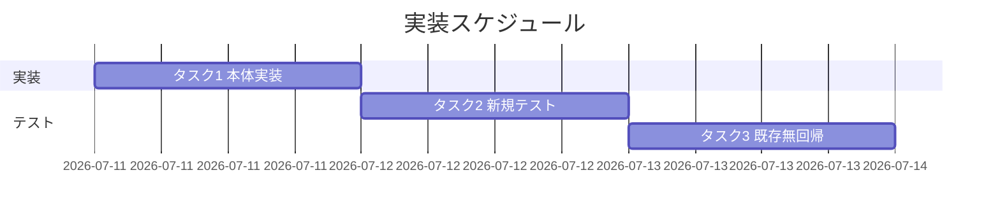
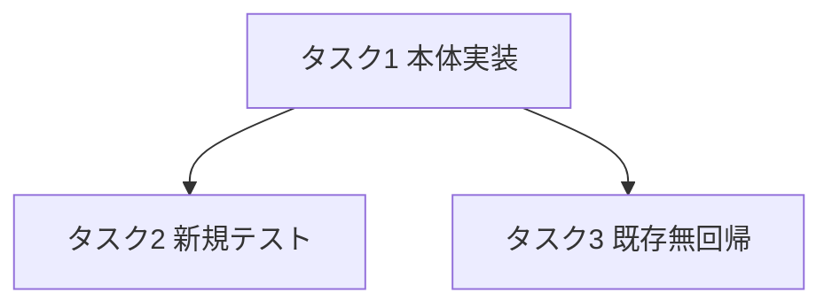
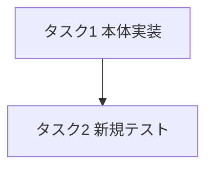
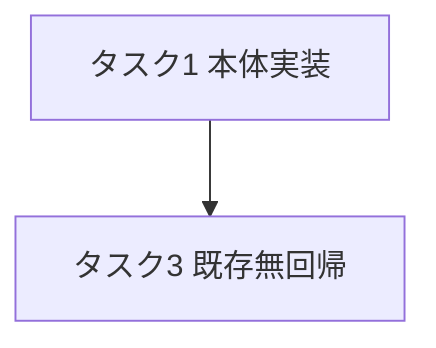

# 実装計画書: write-workflow-log.sh の ts_utc ISO8601 形式バリデーション追加

**プロジェクト名**: write-workflow-log.sh の ts_utc ISO8601 形式バリデーション追加（親 issue: agentsOS 汎用化・ポリシー統合 のサブ issue）
**作成日**: 2026 年 07 月 11 日
**最終更新**: 2026 年 07 月 11 日

> **重要**: **このドキュメントは常に更新**: 実装計画の変更、進捗状況の更新、バグの記録などがあった場合は、即座にこのドキュメントを更新してください。ドキュメントは「生きているドキュメント」として扱い、実装内容と常に同期させます。
> **必須項目**: 「必須」と明記した欄は空欄・抽象語のみで提出しないこと。テスト観点・BDD 仕様は具体ケースを 1 件以上記載すること。
>
> **用語**: [.agent-skill-chain/source/CONCEPTS.md §用語規約](../../../../../../../.agent-skill-chain/source/CONCEPTS.md#用語規約) を参照。

---

## 1. 実装概要

### 1.1 実装方針（必須）

02_設計 ADR-1／ADR-2 に従い、`write-workflow-log.sh` に受理形式の単一定数 `TS_UTC_ISO8601_REGEX` と、共通必須チェック（ts_utc 非空チェック）直後のインライン fail-fast ブロックを追加する。既存挙動は不変（後方互換）とし、正常系・異常系・旧スキーマ経路・エラーメッセージ・既存無回帰を隔離環境テストで担保する。

### 1.2 実装順序（必須: 1 件以上）

1. **タスク 1**: `write-workflow-log.sh` に定数 ＋ ts_utc 形式バリデーションを追加（本体実装）。
2. **タスク 2**: 新規テスト `test/test-write-workflow-log-ts-utc.sh` を追加（正常系・異常系・旧スキーマ・エラーメッセージ・非破壊）。
3. **タスク 3**: 既存テスト群の無回帰確認（`test/test-write-workflow-log-*.sh` 再実行）。



---

## 2. タスク分解

**用語**: [.agent-skill-chain/source/CONCEPTS.md §用語規約](../../../../../../../.agent-skill-chain/source/CONCEPTS.md#用語規約) を参照。

**必須**: 各タスクには「テスト観点」（2.x.3）と「単体テスト仕様（BDD）」（2.x.4）を必ず記載する。観点定義は 02_設計 §6 および [RULES のテスト戦略・TEST_BDD_FORMAT](../../../../../../../.agent-skill-chain/source/RULES.md#テスト戦略必須要件) を参照。

### 2.1 タスク 1: 本体実装（定数 ＋ ts_utc 形式バリデーション）

#### 2.1.1 概要（必須）

`write-workflow-log.sh` に、ISO8601 UTC 形式の単一定数と、INSERT 前に非適合を拒否する fail-fast ブロックを追加する。

#### 2.1.2 実装内容（必須: 1 件以上）

- **定数追加**: 既存 `UUID_REGEX`（160 行目付近）の近傍に次を宣言する。
  ```bash
  # ts_utc は ISO8601 UTC 形式（末尾 Z 必須・任意小数秒）。受理形式の単一情報源（二重定義禁止）。
  TS_UTC_ISO8601_REGEX='^[0-9]{4}-[0-9]{2}-[0-9]{2}T[0-9]{2}:[0-9]{2}:[0-9]{2}(\.[0-9]+)?Z$'
  ```
- **バリデーション追加**: 既存の共通必須チェック（現 200〜203 行目の `command / summary / ts_utc` 非空チェック）の**直後**に、DB 作成・ロック取得（現 235 行目以降）より前で次を挿入する。
  ```bash
  # ts_utc は ISO8601 UTC 形式でなければ INSERT 前に fail-fast（DB 作成・ロック取得より前）。
  if [[ ! "$TS_UTC" =~ $TS_UTC_ISO8601_REGEX ]]; then
    echo "ERROR: ts_utc が ISO8601 UTC 形式ではありません。期待形式: YYYY-MM-DDTHH:MM:SSZ（例: 2026-07-11T00:00:00Z）。渡された値: '${TS_UTC}'。memo/issue プレフィックス形式（YYYYMMDD_HHMMSS・JST）とは別物です。UTC 時刻は date -u +\"%Y-%m-%dT%H:%M:%SZ\" で取得してください。" >&2
    exit 1
  fi
  ```
- **不変条件**: 既存の他バリデーション・スキーマ検知・INSERT・prev_hash 連結・document_id 不変・`--print-head` には一切手を入れない。CONTRACT.md・audit.sh・schema.sql は変更しない。

#### 2.1.3 テスト観点（必須）

**参照**: 観点定義は [02\_設計 §6](./02_設計.md) および [RULES のテスト戦略](../../../../../../../.agent-skill-chain/source/RULES.md#テスト戦略必須要件)。以下は本タスクの具体ケース。

##### 単体（本タスクの具体ケース・必須 1 件以上）

- 正常系: `TS_UTC="2026-07-11T00:00:00Z"` を渡すと exit 0 で 1 行 INSERT される。
- 正常系（境界）: 小数秒付き `TS_UTC="2026-07-11T00:00:00.123Z"` を渡すと exit 0 で INSERT される。
- 異常系: `TS_UTC="20260101_000000"`（JST memo プレフィックス形式）は exit 1 で拒否され、行が INSERT されない。
- 異常系（境界）: `2026/07/11 00:00:00` / `2026-07-11`（日付のみ） / `invalid` / `1720656000`（epoch） / `2026-07-11T00:00:00+09:00`（オフセット）はいずれも exit 1 で拒否される。

##### 結合/API（本タスクの具体ケース・該当時は必須 1 件以上）

- CLI 契約: 位置引数 `command summary dod_met ts_utc ...` の第 4 引数のみが検証対象で、他引数・環境変数・`--print-head` の挙動は不変（`--print-head` は exit 0 で最新 entry_hash を返す）。

##### E2E/受け入れ（本タスクの具体ケース・未達時は理由記載）

- 該当なし（CLI スクリプト単体で完結し、外部システム連携の E2E 経路を持たないため。単体＋結合で受け入れ基準を充足する）。

##### バリデーション（該当する場合の具体ケース）

- 拒否時に副作用を残さない: DB が存在しない状態で異常値を渡すと、exit 1 かつ DB ファイルが新規作成されない・ロックファイルも残らない。

#### 2.1.4 単体テスト仕様（BDD）（必須）

**BDD 形式のテストケース（高レベル仕様）**:

```gherkin
Feature: ts_utc の ISO8601 形式バリデーション
  Scenario: ISO8601 UTC 形式は従来どおり成功する
    Given 隔離環境(mktemp -d)に AGENT_ROLE=scribe と有効な DOCUMENT_ID が設定されている
    When ts_utc に "2026-07-11T00:00:00Z" を渡して write-workflow-log.sh を実行する
    Then 終了コードは 0 で workflow_log に 1 行 INSERT される

  Scenario: 非 ISO8601(YYYYMMDD_HHMMSS) は INSERT 前に exit 1 で拒否される
    Given 隔離環境(mktemp -d)に AGENT_ROLE=scribe と有効な DOCUMENT_ID が設定されている
    When ts_utc に "20260101_000000" を渡して write-workflow-log.sh を実行する
    Then 終了コードは 1 で workflow.db に行が INSERT されず DB も新規作成されない
```

**テストコード例（必須: インラインコメントで Given/When/Then を明記）**

```bash
# Given: 隔離環境(mktemp -d)・AGENT_ROLE=scribe・有効な DOCUMENT_ID・PROJECT_ROOT=tmp
TMP="$(mktemp -d)"
DB="$TMP/.agent-skill-chain/runtime/workflow.db"
# When: 非 ISO8601 の ts_utc を渡して実行する
PROJECT_ROOT="$TMP" AGENT_ROLE=scribe DOCUMENT_ID="11111111-1111-1111-1111-111111111111" \
  DOCUMENT_PATH=".agent-skill-chain/runtime/x/00_要求定義.md" \
  "$WWL" requirement-discovery "ts_utc 検証テスト" 1 "20260101_000000"; rc=$?
# Then: exit 1 かつ DB 未作成（行数 0・ファイル非存在）
[[ "$rc" -eq 1 ]] && [[ ! -f "$DB" ]]  # 期待: true
rm -rf "$TMP"
```

#### 2.1.5 依存関係

- 依存タスクなし（本体実装が最初）。タスク 2・3 は本タスクに依存する。



#### 2.1.6 見積もり

- **工数**: 0.5 時間
- **優先度**: 高

### 2.2 タスク 2: 新規テスト追加（`test/test-write-workflow-log-ts-utc.sh`）

#### 2.2.1 概要（必須）

ts_utc バリデーションの正常系・異常系・旧スキーマ経路・エラーメッセージ・本番 DB 非破壊を、既存 `test-write-workflow-log-multidoc.sh` と同型の隔離テストで検証する。

#### 2.2.2 実装内容（必須: 1 件以上）

- 既存 `test-write-workflow-log-multidoc.sh` の枠組み（`REPO_ROOT` 解決・`WWL`/`SCHEMA` 参照・`ok/ng/assert_eq`・本番 DB 非破壊の前後計測・全ケース `mktemp -d` 隔離）を踏襲した新規テストファイルを作成する。
- **T2-1 正常系**: `2026-07-11T00:00:00Z` および小数秒 `...00.123Z` で exit 0・1 行 INSERT。
- **T2-2 異常系（Scenario Outline）**: `20260101_000000` / `2026/07/11 00:00:00` / `2026-07-11` / `invalid` / `1720656000` / `2026-07-11T00:00:00+09:00` で exit 1・行数 0・DB 未作成。
- **T2-3 エラーメッセージ**: 異常値実行時の stderr に「ISO8601」「YYYY-MM-DDTHH:MM:SSZ」「渡された値（当該文字列）」が含まれることを grep で機械検証。
- **T2-4 旧スキーマ経路**: `entry_id` カラムを持たない旧スキーマ DB を tmp に用意し、異常値が exit 1・非 INSERT になることを確認。
- **T2-5 `--print-head` 無影響**: 新スキーマ DB に 1 件記録後 `--print-head` が exit 0 で最新 entry_hash を返す（ts_utc 検証の影響を受けない）。
- **T2-6 本番 DB 非破壊**: 全テスト後、リポの `.agent-skill-chain/runtime/workflow.db` の行数・mtime が不変。
- 各テスト本文に `# シナリオ:` と `# Given:` `# When:` `# Then:` を [TEST_BDD_FORMAT.md](../../../../../../../.agent-skill-chain/source/TEST_BDD_FORMAT.md) に従い明記する。

#### 2.2.3 テスト観点（必須）

**参照**: [02\_設計 §6](./02_設計.md)・[RULES テスト戦略](../../../../../../../.agent-skill-chain/source/RULES.md#テスト戦略必須要件)。

##### 単体（本タスクの具体ケース・必須 1 件以上）

- 正常系 2 件（`Z`・小数秒）で exit 0・行数 +1。
- 異常系 6 件で exit 1・行数不変・DB 未作成。
- 旧スキーマ経路の異常値で exit 1・非 INSERT。

##### 結合/API（本タスクの具体ケース・該当時は必須 1 件以上）

- `--print-head` サブコマンドが ts_utc 検証の影響を受けず exit 0・entry_hash を返す。

##### E2E/受け入れ（本タスクの具体ケース・未達時は理由記載）

- 該当なし（テストスクリプト自体は隔離環境の単体/結合で受け入れ基準を満たす。外部 E2E 経路なし）。

##### バリデーション（該当する場合の具体ケース）

- エラーメッセージに (a)ISO8601 でない旨・(b)期待形式例・(c)実際の値、が含まれることを grep で検証（01 ストーリー 2 の受け入れ基準）。

#### 2.2.4 単体テスト仕様（BDD）（必須）

**BDD 形式のテストケース（高レベル仕様）**:

```gherkin
Feature: ts_utc バリデーションの回帰テスト
  Scenario Outline: 多様な非 ISO8601 形式が一律 exit 1 で拒否される
    Given 隔離環境(mktemp -d)・AGENT_ROLE=scribe・有効な DOCUMENT_ID
    When ts_utc に "<不正値>" を渡して write-workflow-log.sh を実行する
    Then 終了コードは 1 で workflow.db に行が INSERT されない
    Examples:
      | 不正値                    |
      | 20260101_000000           |
      | 2026/07/11 00:00:00       |
      | 2026-07-11                |
      | invalid                   |
      | 1720656000                |
      | 2026-07-11T00:00:00+09:00 |
```

**テストコード例（必須: インラインコメントで Given/When/Then を明記）**

```bash
# Given: 隔離環境・書記・有効 DOCUMENT_ID（本番 DB は触らない）
run_bad() {
  local bad="$1"; local TMP; TMP="$(mktemp -d)"
  local DB="$TMP/.agent-skill-chain/runtime/workflow.db"
  # When: 不正な ts_utc を渡して実行する
  local rc; PROJECT_ROOT="$TMP" AGENT_ROLE=scribe \
    DOCUMENT_ID="22222222-2222-2222-2222-222222222222" \
    DOCUMENT_PATH=".agent-skill-chain/runtime/x/00_要求定義.md" \
    "$WWL" requirement-discovery "異常系テスト記録" 1 "$bad" >/dev/null 2>&1; rc=$?
  # Then: exit 1 かつ DB 未作成（副作用なし）
  assert_eq "$rc" "1" "拒否: '$bad' は exit 1"
  [[ ! -f "$DB" ]] && ok "拒否時 DB 未作成: '$bad'" || ng "拒否時に DB が作られた: '$bad'"
  rm -rf "$TMP"
}
```

#### 2.2.5 依存関係

- タスク 1（本体実装）に依存する。



#### 2.2.6 見積もり

- **工数**: 1 時間
- **優先度**: 高

### 2.3 タスク 3: 既存テストの無回帰確認

#### 2.3.1 概要（必須）

既存の write-workflow-log 関連テストを再実行し、正しい ISO8601 値を渡す既存呼び出しが改修後も全通過することを確認する。

#### 2.3.2 実装内容（必須: 1 件以上）

- `test/test-write-workflow-log-multidoc.sh`・`test/test-write-workflow-log-prevhash.sh`・`test/test-write-workflow-log-glob.sh` を実行し、全 PASS を確認する。
- ts_utc を渡す他テスト（`test/test-export-ndjson.sh`・`test/test-c4-bypass-resistance.sh`・`test/test-pretooluse-hook.sh`・`test/test-cli-audit-doctor.sh` 等、`YYYY-MM-DDTHH:MM:SSZ` を使用）を必要に応じて実行し回帰の有無を確認する。

#### 2.3.3 テスト観点（必須）

##### 単体（本タスクの具体ケース・必須 1 件以上）

- 既存テスト群が渡す ts_utc（例 `2026-06-14T10:00:00Z`）はすべて `TS_UTC_ISO8601_REGEX` に適合し、改修前と同じく PASS する。

##### 結合/API（本タスクの具体ケース・該当時は必須 1 件以上）

- multidoc テストの 4 件連結（00/01/02/03）・prev_hash 連結が改修後も成立する。

##### E2E/受け入れ（本タスクの具体ケース・未達時は理由記載）

- 該当なし（既存テストの再実行であり、新規 E2E は不要）。

##### バリデーション（該当する場合の具体ケース）

- 該当なし（本タスクは無回帰確認であり、新規バリデーションケースはタスク 2 が担う）。

#### 2.3.4 単体テスト仕様（BDD）（必須）

**BDD 形式のテストケース（高レベル仕様）**:

```gherkin
Feature: 既存呼び出しの後方互換
  Scenario: 正しい ISO8601 UTC を渡す既存テストは改修後も全 PASS する
    Given ts_utc バリデーション追加後の write-workflow-log.sh
    When test/test-write-workflow-log-*.sh を実行する
    Then すべて exit 0（全 PASS）で終了する
```

**テストコード例（必須: インラインコメントで Given/When/Then を明記）**

```bash
# Given: 改修後の write-workflow-log.sh を含むリポジトリ
# When: 既存テストを順に実行する
for t in test/test-write-workflow-log-multidoc.sh \
         test/test-write-workflow-log-prevhash.sh \
         test/test-write-workflow-log-glob.sh; do
  bash "$t"; rc=$?
  # Then: 各テストは exit 0（全 PASS）
  [[ "$rc" -eq 0 ]] || { echo "REGRESSION: $t"; exit 1; }
done
```

#### 2.3.5 依存関係

- タスク 1（本体実装）に依存する。



#### 2.3.6 見積もり

- **工数**: 0.5 時間
- **優先度**: 高

---

## テスト観点

- **正常系**: `YYYY-MM-DDTHH:MM:SSZ`（＋任意小数秒）で exit 0・1 行 INSERT。既存テストの ts_utc も全通過（無回帰）。
- **異常系**: JST memo プレフィックス・区切り違い・日付のみ・非日時文字列・epoch・オフセット付きは exit 1・行数不変・DB 未作成。
- **エラーメッセージ**: ISO8601 でない旨・期待形式例・実際の値を含む（grep で機械検証）。
- **経路網羅**: 旧スキーマ・新スキーマ両経路にバリデーションが効く。`--print-head` は無影響。
- **隔離**: 全ケース mktemp -d・本番 DB 非破壊（行数・mtime 不変）。

各タスクの §2.x.3 に具体ケースを記載済み。監査で本セクションの存在と内容を検査する。

---

## 単体テスト

- 対象: `write-workflow-log.sh` の ts_utc 形式バリデーション。
- 方針: 新規 `test/test-write-workflow-log-ts-utc.sh` で正常系 2・異常系 6・旧スキーマ・エラーメッセージ・`--print-head`・非破壊を検証（タスク 2 §2.2.4）。BDD 記法（`# Given/When/Then`）を各テスト本文に付す。

---

## BDD

- UC1（ts_utc 形式バリデーション）: 正常系（Z・小数秒）／異常系（Scenario Outline 6 値）／旧スキーマ経路。
- UC2（既存機能の維持）: `--print-head` 無影響／既存テスト全 PASS。
- 01_要件定義 §2.2 の BDD（UC1 シナリオ 1〜3・UC2 シナリオ 1〜2）と本計画のテストケースが 1:1 で対応する（Given/When/Then は [TEST_BDD_FORMAT.md](../../../../../../../.agent-skill-chain/source/TEST_BDD_FORMAT.md) に従う）。

---

## 3. 実装スケジュール

### 3.1 マイルストーン

| マイルストーン | 期日 | 成果物 |
| -------------- | ---- | ------ |
| M1 本体実装完了 | 2026-07-11 | 定数 ＋ バリデーションを追加した `write-workflow-log.sh` |
| M2 テスト完了 | 2026-07-11 | `test/test-write-workflow-log-ts-utc.sh`（新規）＋ 既存テスト全 PASS |

### 3.2 実装フェーズ

#### フェーズ 1: 実装とテスト

- **期間**: 1 日以内
- **タスク**: タスク 1 → タスク 2 → タスク 3

---

## 4. テスト計画

テスト観点・レベル・BDD 形式の定義は 02_設計 §6 および RULES のテスト戦略・TEST_BDD_FORMAT を参照。各タスクの §2.x.3／§2.x.4 に具体ケースと BDD を記載済み。

### 4.1 テストの優先順位

- クリティカル（誤形式の新規混入防止）である異常系・拒否時副作用なしを厚くテストする。
- 影響範囲が広い既存呼び出し（全 command の書記記録）は無回帰テスト（タスク 3）に必ず含める。

---

## 5. リスク管理

### 5.1 実装リスク

- **リスク**: 正規表現が厳しすぎて正当な既存呼び出しを誤って拒否する。
  - **対策**: 既存の全呼び出し・テスト値が `...SSZ` のみであることを実測済み（02 ADR-1 evidence）。正常系テストとタスク 3 の既存無回帰で回帰を検知する。
- **リスク**: バリデーション位置を誤り（ロック取得後等）、失敗時に副作用（ロックファイル・空 DB）を残す。
  - **対策**: 共通必須チェック直後（DB 作成・ロック取得より前）に配置し、テスト T2-2 で「拒否時に DB 未作成」を検証する（00 §6-5）。
- **リスク**: bash の `[[ =~ ]]` で右辺をクォートすると正規表現でなく文字列一致になる。
  - **対策**: `[[ ! "$TS_UTC" =~ $TS_UTC_ISO8601_REGEX ]]` のように右辺（定数）をクォートしない実装とし、テストで実挙動を確認する。

---

## 6. 参考資料

### プロジェクトドキュメント

- [`02_設計.md`](./02_設計.md) - 設計
- [`01_要件定義.md`](./01_要件定義.md) - 要件定義
- [`00_要求定義.md`](./00_要求定義.md) - 要求定義

### その他の参考資料

- [.agent-skill-chain/source/scripts/write-workflow-log.sh](../../../../../../../.agent-skill-chain/source/scripts/write-workflow-log.sh) - 改修対象
- [test/test-write-workflow-log-multidoc.sh](../../../../../../../test/test-write-workflow-log-multidoc.sh) - 既存テスト（隔離・BDD 記法の参考）
- [.agent-skill-chain/source/TEST_BDD_FORMAT.md](../../../../../../../.agent-skill-chain/source/TEST_BDD_FORMAT.md) - BDD 記法
- [.agent-skill-chain/source/RULES.md](../../../../../../../.agent-skill-chain/source/RULES.md#テスト戦略必須要件) - テスト戦略必須要件

---

## 7. 前のステップ

この実装計画書は、以下のドキュメントを基に作成されています：

- **前**: [`02_設計.md`](./02_設計.md) - 設計フェーズ

---

## 8. 次のステップ

この実装計画書の承認後、以下のいずれかのステップに進みます：

- **プロジェクトが 1 つの issue（タスク）である場合**: 実装フェーズ（execution）に直接進む（本 issue は単一スクリプトへの局所改修であり、これに該当する）。

**用語**: [.agent-skill-chain/source/CONCEPTS.md §用語規約](../../../../../../../.agent-skill-chain/source/CONCEPTS.md#用語規約) を参照。
