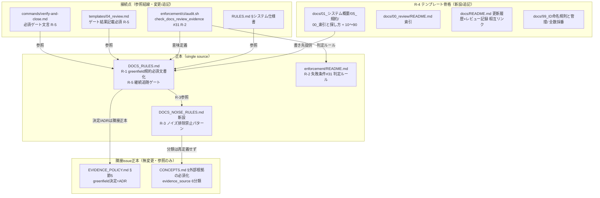
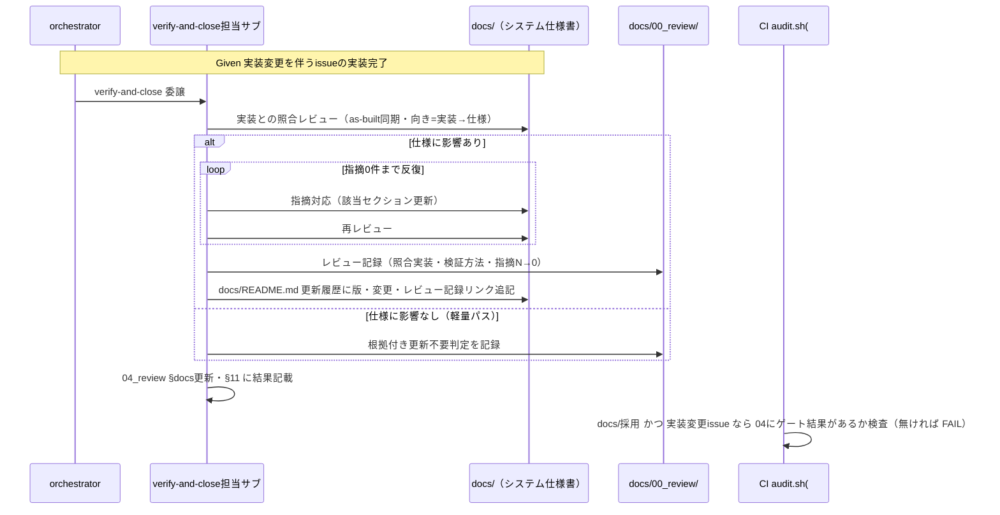
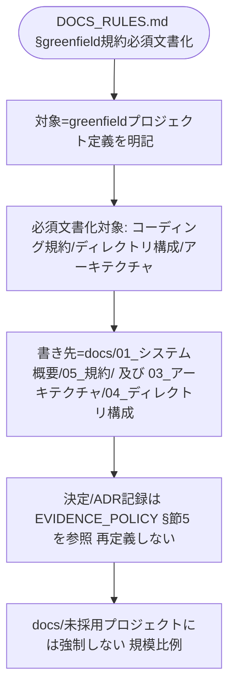
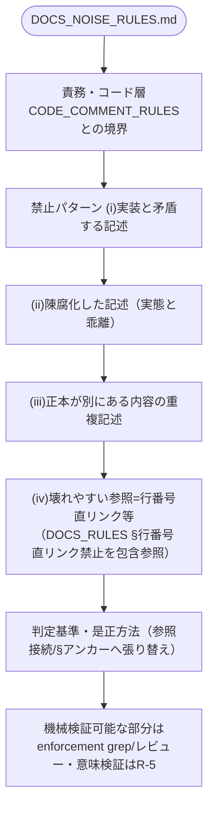
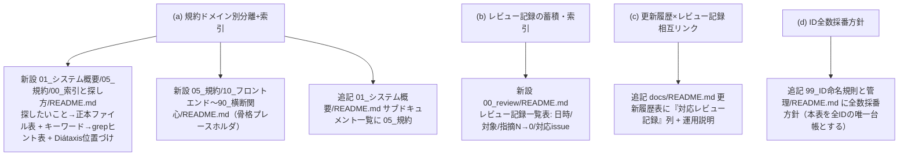
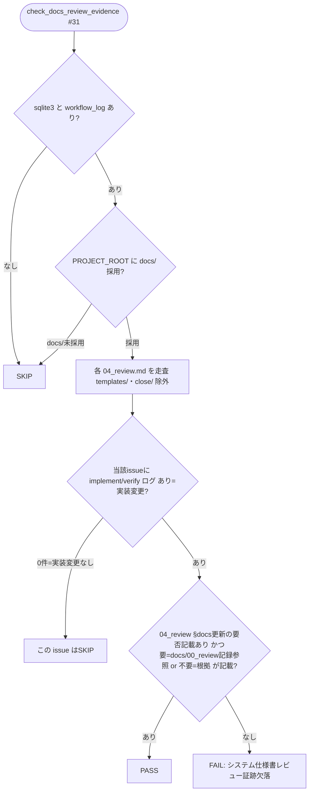

# 設計書: システム仕様書の完備・強制・テンプレート刷新（継続的な最新性・正確性の保証）

**プロジェクト名**: システム仕様書の完備・強制・テンプレート刷新
**作成日**: 2026 年 07 月 11 日
**最終更新**: 2026 年 07 月 11 日

> **重要**: **このドキュメントは常に更新**: 設計の変更や追加があった場合は、即座にこのドキュメントを更新してください。ドキュメントは「生きているドキュメント」として扱い、実装内容と常に同期させます。
>
> **用語**: [.agent-skill-chain/source/CONCEPTS.md §用語規約](../../../../../../../.agent-skill-chain/source/CONCEPTS.md#用語規約) を参照。

---

## 1. 設計概要

**必須**: 設計方針・原則は [.agent-skill-chain/source/spec/01\_設計原則.md](../../../../../../../.agent-skill-chain/source/spec/01_設計原則.md) を**先に参照**した上で、本プロジェクトに**適用するものを選び**記載する。

### 1.1 設計方針

本 issue は新しいコード・サービスを作らない。**「システム仕様書が常に最新かつ正しい」（00 §1.1・最上位目的）を継続的に強制するため、既存の docs 規約・テンプレート・enforcement・verify-and-close へ、R-1〜R-5 の 5 手段を「正本 1 か所 + 参照結線」で組み込む**ドキュメント・ポリシー / テンプレート / CI 検査の設計である。各手段の正本を 1 ファイルに閉じ、接続先には**参照 1 行**を書く（1 ファイル 1 責務・正本一元化。[CORE.md §境界](../../../../../../../.agent-skill-chain/source/boot/CORE.md)）。R-1〜R-5・SC-1〜SC-8・AC の正本は [00_要求定義.md](./00_要求定義.md)・[01_要件定義.md](./01_要件定義.md) にあり、本書では再定義せず参照する。

### 1.2 設計原則（本プロジェクトで適用するもの）

01_設計原則の全項目のうち、本プロジェクトで適用するものを選んで記載する。

- **単一責務**: 手段ごとに正本ファイルを 1 つに定める。R-1・R-5 の docs 更新/完備ルールは既存 [DOCS_RULES.md](../../../../../../../.agent-skill-chain/source/DOCS_RULES.md)（docs 作成・更新ルールの正本）へ集約し、R-3 のノイズ排除は独立関心事として新設 `DOCS_NOISE_RULES.md` に閉じる（コード層の [CODE_COMMENT_RULES.md](../../../../../../../.agent-skill-chain/source/CODE_COMMENT_RULES.md) と対称）。
- **明確な境界**: 「規約を ADR として決定・記録する（[EVIDENCE_POLICY.md](../../../../../../../.agent-skill-chain/source/EVIDENCE_POLICY.md) §節5・隣接 issue 正本）」と「決定された規約をシステム仕様書に文書化し追随させ続ける（本 issue）」を分離する（00 §4.1）。機械検証（enforcement・存在/grep/証跡）と意味的検証（レビュー反復）を二段構えで分離する（01 BR-5）。
- **AIフレンドリー設計**: [01\_設計原則 §AIフレンドリー設計](../../../../../../../.agent-skill-chain/source/spec/01_設計原則.md#aiフレンドリー設計)（小さなファイル・明確な責務・意図が分かる命名・深すぎないディレクトリ構造）に従い、正本は 1 ファイルに閉じ、接続点は grep 可能な参照 1 行に限定する。規約索引（探したいこと→正本ファイル・grep ヒント）で AI・人間双方の最短到達を担保する（R-4a）。
- **KISS / YAGNI・規模比例**: enforcement は機械検証可能な範囲（ファイル存在・grep・証跡突合）に限定し、意味的自動検証は新設しない（00 §5）。ゲート・テンプレートは「必須の骨格 + 任意の拡張」を区別し、docs 非採用プロジェクト・軽量 issue に過剰適用しない（[CONTEXT_EFFICIENCY.md](../../../../../../../.agent-skill-chain/source/CONTEXT_EFFICIENCY.md) の規模比例思想・SC-8）。

> **AIフレンドリー設計**: 本設計は「正本 1 ファイル + 参照 1 行の結線」を徹底し、上記原則の「小さなファイル・明確な責務・深すぎないディレクトリ構造」を満たす。

---

## 2. アーキテクチャ設計

### 2.1 責務・境界・参照関係

[01\_設計原則 §明確な境界・§単一責務](../../../../../../../.agent-skill-chain/source/spec/01_設計原則.md) に従い、コンポーネント（ここでは規約・テンプレート・command・enforcement の各ファイル）の責務・境界・参照関係を明示する。

#### 2.1.1 責務一覧

| コンポーネント | 変更種別 | 責務（1 文）／本 issue での役割 |
| -------------- | -------- | ------------------------------- |
| `DOCS_RULES.md`（既存・**追記**） | 拡張 | システム仕様書の作成・更新ルールの正本。**R-1（greenfield 規約必須文書化）**と**R-5（継続追随ゲート）**の正本節をここへ集約し、R-3 のノイズ排除は新設ファイルへ参照結線する。 |
| `DOCS_NOISE_RULES.md`（**新設**） | 新規 | **R-3** の正本。システム仕様書のノイズ（実装矛盾・陳腐化・正本重複・壊れやすい参照）禁止パターンと判定基準を定義する唯一の正本。コード層 `CODE_COMMENT_RULES.md` の docs 層版。 |
| `commands/verify-and-close.md`（既存・**変更**） | 変更 | **R-5** の接続点。§実行時の注意の「システム仕様書の更新: 必要に応じて」の任意表現を、DOCS_RULES §継続追随ゲートへの参照による**必須ゲート表現**へ置き換える。skill chain の順序・DoD は変更しない。 |
| `enforcement/README.md`（既存・**追記**） | 拡張 | **R-2** の正本側。機械検証可能な失敗条件 **#31（システム仕様書レビュー証跡欠落）**を失敗条件表・判定ルール・差し戻し先に追加する。fail-open 方針・PreToolUse の stdin JSON/exit code 契約は変更しない（接続層は Layer4 CI audit のみ）。 |
| `enforcement/ci/audit.sh`（既存・**追記**） | 拡張 | **R-2** の実装。`check_docs_review_evidence()`（#31）を追加。docs/ 採用かつ実装変更 issue の 04_review に docs レビュー結果（更新 or 更新不要判定）が記載されているかを存在/grep ベースで事後検知する。SKIP 条件で誤発動を防ぐ。 |
| `runtime/templates/docs/01_システム概要/05_規約/`（**新設**） | 新規 | **R-4a / R-1 の書き先**。規約正本のドメイン別分離（`10`〜`90`）＋規約索引（`00_索引と探し方`）を提供するテンプレート骨格。 |
| `runtime/templates/docs/01_システム概要/README.md`（既存・**追記**） | 変更 | サブドキュメント一覧に `05_規約` を追加し R-4a の入口を結線する。 |
| `runtime/templates/docs/00_review/README.md`（**新設**） | 新規 | **R-4b**。レビュー記録（`YYYYMMDD_HHMMSS_review.md`）の蓄積・索引運用テンプレート。 |
| `runtime/templates/docs/README.md`（既存・**追記**） | 変更 | **R-4c**。更新履歴表に「対応レビュー記録」列と相互リンク運用を追加。構成表に `05_規約`・`00_review` を追記。 |
| `runtime/templates/docs/99_ID命名規則と管理/README.md`（既存・**追記**） | 変更 | **R-4d**。ID の**全数採番方針**（本表を全 ID の唯一台帳とする）を明記。 |
| `runtime/templates/04_review.md`（既存・**変更**） | 変更 | **R-5 / AC-1d / SC-6**。§docs 更新・§11 を、継続追随ゲートの結果（更新内容 or 更新不要判定 + 対応 docs/00_review 記録への参照）記載必須へ強化し、DOCS_RULES §継続追随ゲートへ参照結線する。**§11 冒頭の任意表現「必要に応じて加筆修正を行うこと」も、`verify-and-close.md` と同様に必須ゲート参照表現へ置換する**（00 §8 が 04_review §11 も R-5 の変更対象と明記）。既存の固定キー（`## docs 更新`・`- 要否:`）は #5/#31 監査互換のため保持する。 |
| `RULES.md §システム仕様書`（既存・**追記**） | 変更 | 継続追随ゲート・ノイズ排除への参照 1 行を追加（正本は複製しない）。 |
| `EVIDENCE_POLICY.md §節5`（既存・**無変更**・隣接 issue 正本） | 無変更 | greenfield のアーキテクチャ・コーディング規約・ディレクトリ構成の**決定を ADR として記録する**正本。本 issue は R-1 からここへ参照するのみで、ADR 形式・evidence_source を再定義しない（SC-7・BR-3）。 |
| `CONCEPTS.md §外部根拠の必須化`（既存・**無変更**） | 無変更 | evidence_source 6 分類の唯一の正本。参照のみ（SC-7）。 |
| `CODE_COMMENT_RULES.md`（既存・**無変更**） | 無変更 | コード層のノイズ排除正本。R-3 の思想的比較対象・責務境界の相手であり変更しない（00 §2.1）。 |

#### 2.1.2 境界

- **入力**: (a) 消費者プロジェクトでシステム仕様書（`docs/`）を運用・更新するエージェント／人間の執筆行為、(b) 実装変更を伴う issue の verify-and-close 実行、(c) CI（audit.sh）実行時の 04_review・workflow.db・docs/ の状態。
- **出力**: (a) grep で検証可能な規約正本（R-1・R-3）と規約索引、(b) 大規模対応テンプレート骨格（R-4）、(c) 継続追随ゲートを必須化した verify-and-close 文言（R-5）、(d) 機械検証可能な失敗条件 #31（R-2）。
- **他責務との境界（本 issue の範囲外）**:
  - ADR 形式・evidence_source 分類の（再）定義 → `EVIDENCE_POLICY.md`／`CONCEPTS.md`（隣接 issue・参照のみ。SC-7）。
  - greenfield 規約の**決定・ADR 記録**プロセス（design-feature への接続）→ 隣接 issue「フィジビリティADR必須化」。本 issue は決定済み規約の**文書化・追随**を担う。
  - システム仕様書の内容の**意味的正しさの自動検証** → 対象外（機械検証は存在・形式・証跡に限定し、意味的検証はレビュー反復 R-5 が担う。00 §5・AC-5d）。
  - PreToolUse hook（Layer2）による runtime 物理ブロックの新設 → 対象外。R-2 は Layer4 CI audit のみに接続する（§2.5 ADR-4）。
  - 過去の close 済み issue・既存プロジェクトの `docs/` への遡及適用 → 対象外（00 §5）。

#### 2.1.3 参照関係

依存の向き（呼び出し元 → 参照先）を 1 行ずつ示す。循環は持たない。

- `commands/verify-and-close.md` → `DOCS_RULES.md §継続追随ゲート`（R-5・必須化文言の実体）
- `runtime/templates/04_review.md` → `DOCS_RULES.md §継続追随ゲート`（ゲート結果の記載先契約）
- `DOCS_RULES.md §ノイズ排除` → `DOCS_NOISE_RULES.md`（R-3 正本へ参照）
- `DOCS_RULES.md §greenfield 規約必須文書化` → `EVIDENCE_POLICY.md §節5`（決定・ADR 記録側の正本へ参照）／ `runtime/templates/docs/01_システム概要/05_規約/`（書き先）
- `DOCS_NOISE_RULES.md §壊れやすい参照` → `DOCS_RULES.md §行番号直リンク禁止`（既存パターンを包含参照）
- `enforcement/ci/audit.sh #31` → `DOCS_RULES.md §継続追随ゲート`（検査対象の意味定義）／ `enforcement/README.md §失敗条件 #31`（判定ルール正本）
- `RULES.md §システム仕様書` → `DOCS_RULES.md`（既存参照を維持し、継続追随ゲート・ノイズ排除の行を追加）
- `runtime/templates/docs/00_review/YYYYMMDD_HHMMSS_review.md` ⇄ `runtime/templates/docs/README.md §更新履歴`（相互リンク運用・R-4c）

> `DOCS_NOISE_RULES.md` は新しい葉ノード（正本）であり、`DOCS_RULES.md` からのみ参照される。`EVIDENCE_POLICY.md`・`CONCEPTS.md`・`CODE_COMMENT_RULES.md` は本 issue の成果物を参照し返さない（循環なし）。

### 2.2 システムアーキテクチャ

**必須**: 設計判断は [.agent-skill-chain/source/spec/](../../../../../../../.agent-skill-chain/source/spec/)（[00_spec概要.md](../../../../../../../.agent-skill-chain/source/spec/00_spec概要.md)、[01\_設計原則.md](../../../../../../../.agent-skill-chain/source/spec/01_設計原則.md)、[06\_設計判断の優先順位.md](../../../../../../../.agent-skill-chain/source/spec/06_設計判断の優先順位.md)）を**先に**参照する。

- **採用パターン**: **ポリシー正本 + 参照結線 + 二段構え強制（single-source policy with reference wiring and two-tier enforcement）**。docs 規約の新しい関心事を正本ファイルに集約し、command・テンプレート・enforcement からは参照 1 行で結線する。強制は「機械検証（Layer4 CI audit・存在/形式/証跡）」と「意味的検証（R-5 レビュー反復・人手）」の二段で構成する。
- **根拠**: [06\_設計判断の優先順位.md](../../../../../../../.agent-skill-chain/source/spec/06_設計判断の優先順位.md) の「再利用性より責務の明確さ」「docs と実装の不整合を放置してはならない」、および [enforcement/DESIGN.md](../../../../../../../.agent-skill-chain/source/enforcement/DESIGN.md) の「runtime で止められる範囲と CI で補完する範囲を分ける」二段構えの既存思想に整合させる（evidence_source: existing_code）。

#### 2.2.1 CQRS（Command/Query 分離）

- 本 issue はドキュメント・規約・テンプレート・CI 検査の変更であり、状態変更 API を持たない。CQRS は**該当なし**（適用しない）。

#### 2.2.2 アーキテクチャ図（本プロジェクトの構成で記載）

### 2.3 コンポーネント構成

**境界・単一責務**: 明確な境界（docs 規約正本 / ノイズ排除正本 / enforcement 検査 / テンプレート骨格）を保ち、各ファイルは単一責務を満たす。詳細な機能内容は §3 に記す。要点のみ:

- **正本層**: `DOCS_RULES.md`（R-1・R-5）、`DOCS_NOISE_RULES.md`（R-3・新設）、`enforcement/README.md §#31`（R-2 判定ルール）。
- **接続層（参照のみ・正本を複製しない）**: `verify-and-close.md`、`04_review.md`、`RULES.md §システム仕様書`、`audit.sh`。
- **テンプレート骨格層（R-4・必須の骨格 + 任意の拡張を区別）**: `docs/01_システム概要/05_規約/`、`docs/00_review/README.md`、`docs/README.md`、`docs/99_ID命名規則と管理/README.md`。

### 2.4 データフロー

**イベント駆動**: 本 issue は「起きた事実」を表すシステムイベント（UserCreated 等）を発行しない（該当イベント: なし）。ここでの「フロー」は実装変更を伴う issue の close 時に継続追随ゲートと #31 監査が働く制御フローである。

### 2.5 横断設計判断（ADR）

本節は、本 issue の主要な実現方式を [EVIDENCE_POLICY.md](../../../../../../../.agent-skill-chain/source/EVIDENCE_POLICY.md) の ADR 形式（コンテキスト・検討した選択肢・決定・根拠[evidence_source 付き]・帰結）で記録する。evidence_source の分類定義は複製せず [CONCEPTS.md §外部根拠の必須化](../../../../../../../.agent-skill-chain/source/CONCEPTS.md#外部根拠の必須化external-anchor) を参照する。前例は隣接 issue [`02_設計.md` §2.5](../20260711_055538_フィジビリティADR必須化/02_設計.md) および親 issue 02。

#### ADR-1: R-1（規約必須文書化）の正本は DOCS_RULES.md への追記とする

- **コンテキスト**: greenfield プロジェクトでコーディング規約・ディレクトリ構成・アーキテクチャの `docs/` 文書化を必須とする要件（SC-1・AC-2a）をどこに正本化するか。
- **検討した選択肢**: (A) 新規ファイル（例 `DOCS_COMPLETENESS.md`）を新設する。(B) 既存 `DOCS_RULES.md`（docs 作成・更新ルールの正本）へ §greenfield 規約必須文書化 を追記する。(C) `spec/` に追記する。
- **決定**: **(B)** を採用する。
- **根拠**: R-1 は「システム仕様書に何を必ず書くか」という **docs の完備ルール**であり、`DOCS_RULES.md` の責務（システム仕様書の作成・更新ルール）そのものの延長である（evidence_source: existing_code。DOCS_RULES.md 冒頭「プロジェクトでシステム仕様書（`docs/`）を運用するときのルール。AI と人が守る。」を確認）。(A) は 1 責務の細分化が過剰で参照点が増える。(C) は spec が「全プロジェクト共通の設計原則・低頻度変更」であり個別プロジェクトの docs 文書化義務を置く層ではない（evidence_source: existing_code。[spec/00_spec概要 §spec と docs の違い](../../../../../../../.agent-skill-chain/source/spec/00_spec概要.md)）。
- **帰結**: R-1 の正本行は `DOCS_RULES.md` に置き、grep（例 `grep -n "規約" DOCS_RULES.md`）で提示可能（SC-1）。**決定・ADR 記録の側**は `EVIDENCE_POLICY.md §節5`（隣接 issue 正本）へ参照し、ADR 形式・evidence_source を再定義しない（SC-7）。書き先の標準構造は R-4a のテンプレートが提供する（SC-2）。

#### ADR-2: R-3（ノイズ排除）の正本は新設 DOCS_NOISE_RULES.md とする

- **コンテキスト**: システム仕様書のノイズ禁止パターン（実装矛盾・陳腐化・正本重複・壊れやすい参照）を 1 か所の正本に置き、DOCS_RULES.md 等から参照接続する必要がある（SC-4・AC-3a）。
- **検討した選択肢**: (A) `DOCS_RULES.md` に §ノイズ排除 を追記して正本にする。(B) 新規ファイル `DOCS_NOISE_RULES.md` を新設し、DOCS_RULES.md からは参照する。
- **決定**: **(B)** を採用する。
- **根拠**: SC-4 が「ノイズ排除規約が 1 か所の正本として存在し、**DOCS_RULES.md 等から参照で接続**されている」と規定しており、正本が DOCS_RULES.md 内にあると「DOCS_RULES.md から参照」が成立しない（evidence_source: existing_code。00 §6 SC-4 を確認）。ノイズ排除は「成果物の品質・陳腐化防止」という独立関心事であり、コード層で同思想を担う [CODE_COMMENT_RULES.md](../../../../../../../.agent-skill-chain/source/CODE_COMMENT_RULES.md) が独立ファイルである構造と**対称**である（evidence_source: existing_code）。単一責務（1 ファイル 1 責務）を最もよく満たす。
- **帰結**: `DOCS_NOISE_RULES.md` を新設し、禁止パターン (i)〜(iv) を定義。既存の DOCS_RULES §行番号直リンク禁止（パッケージ内部 docs 向け）は移動せず、DOCS_NOISE_RULES §壊れやすい参照 が**包含参照**する（AC-3b (iv)）。DOCS_RULES §ノイズ排除 は 1 行で DOCS_NOISE_RULES へ結線する。コード層 CODE_COMMENT_RULES.md との責務境界を DOCS_NOISE_RULES 冒頭に明記（AC-3c）。

#### ADR-3: R-5（継続追随ゲート）の必須化文言の正本は DOCS_RULES.md、接続点は verify-and-close.md

- **コンテキスト**: verify-and-close.md §実行時の注意の「システム仕様書（docs/）の更新: **必要に応じて**加筆修正する」（evidence_source: existing_code。現行文言を確認）の任意表現を必須ゲート表現へ置き換え、レビュー→指摘対応→再レビューの反復（指摘 0 件）と軽量パスを規定する必要がある（SC-6・AC-1a〜1d）。
- **検討した選択肢**: (A) verify-and-close.md 本文に反復・軽量パス・as-built 同期の詳細をすべて書き込む。(B) 詳細正本を `DOCS_RULES.md §継続追随ゲート`（既存 §Issue 完了時のシステム仕様書更新チェックを強化）に置き、verify-and-close.md・04_review テンプレートからは参照 1 行で必須化する。
- **決定**: **(B)** を採用する。
- **根拠**: 継続追随ゲートの手順（照合の向き=as-built 同期・指摘 N→0・軽量パス・記録先）は docs 更新運用の一部であり、`DOCS_RULES.md` が既に「Issue 完了時のシステム仕様書更新チェック」節を持つ（evidence_source: existing_code。DOCS_RULES.md を確認）。ここを強化して正本 1 か所に集約し、command・テンプレートは参照するのが正本一元化（BR-2）と整合する。verify-and-close.md 本文への全文記載は複数接続先での重複を招く。
- **帰結**: `verify-and-close.md §実行時の注意` は「システム仕様書（docs/）の継続追随: 実装変更を伴う issue の close 前に DOCS_RULES §継続追随ゲート に従いレビュー反復（指摘 0 件まで。更新不要時は根拠付き判定）を**必須**とする」へ置換（「必要に応じて」を除去）。skill chain の step 構成・順序・DoD は不変（既存レビュー chain を壊さない）。04_review テンプレート §docs 更新・§11 にゲート結果の記載枠を設けるとともに、**§11 冒頭の任意表現「必要に応じて加筆修正を行うこと」も DOCS_RULES §継続追随ゲート参照の必須表現へ置換する**（AC-1d・SC-6。00 §8 が 04_review §11 も R-5 の変更対象と明記）。docs/ 非採用プロジェクトはゲート不発動を明記（AC-5c・誤発動防止）。

#### ADR-4: R-2（enforcement 接続）は Layer4 CI audit のみに #31 を新設し、PreToolUse 契約を変更しない

- **コンテキスト**: R-1・R-3・R-5 の義務のうち機械検証可能なものを enforcement の失敗条件に接続する（SC-3・AC-5a〜5d）。制約として既存の fail-open 方針・stdin JSON 契約・exit code 規約（違反=2/許可=0）を変更・緩和しない（00 §3.2・01 §3.2）。
- **検討した選択肢**: (A) PreToolUse hook（Layer2）で docs 未更新の Write/close をその場でブロックする。(B) Layer4 CI audit（audit.sh）に新失敗条件 #31 を追加し、既存 #5（docs 更新要否未記載）を活かして事後検知する。(C) 両方。
- **決定**: **(B)** を採用する。
- **根拠**: 「実装変更が仕様に追随したか」は成果物（04_review・docs/00_review・workflow.db の implement ログ）に痕跡が残り**事後の存在/grep/証跡突合で機械検出可能**である一方、PreToolUse が受け取るツールメタデータ（ツール名・パス・コマンド）だけでは判定できない（evidence_source: existing_code。[enforcement/README.md](../../../../../../../.agent-skill-chain/source/enforcement/README.md) §強制の 4 層・#22–#24 が「痕跡を残さない項目は CI 非強制」とする判断様式）。(A) は PreToolUse の stdin JSON/exit code 契約に触れるため制約に反しやすく、fail-open 方針とも噛み合わない。#31 を audit.sh に置けば PreToolUse を一切変更せず制約を守れる。
- **帰結**: `enforcement/README.md` に失敗条件 **#31（システム仕様書レビュー証跡欠落）**を追加（失敗条件表・判定ルール一覧・差し戻し先・対応表の 4 か所）。`audit.sh` に `check_docs_review_evidence()` を実装（既存 #29 `check_review_before_implement` と同型のガード様式: `sqlite3`/`workflow_log` 不在は SKIP、`templates/` 除外、close 配下除外、docs/ 非採用は SKIP、実装変更ログ 0 件なら SKIP）。意味的検証は #31 の対象外である旨を明記（AC-5d・意味的検証は R-5 レビュー反復が担う二段構え）。PreToolUse.sh/PostToolUse.sh・stdin JSON・exit code 規約は無変更。

#### ADR-5: R-4（テンプレート刷新）は既存章立てを壊さない加算的拡張に限定する

- **コンテキスト**: `.agent-skill-chain/runtime/templates/docs/` を system-graph/docs の実践（4 要素）を参考に大規模対応へ刷新するが、既存の 01〜05・99・00_review・README 更新履歴表と非互換な破壊的変更をしてはならない（AC-4c）。system-graph 固有内容は移植しない（AC-4d）。
- **検討した選択肢**: (A) system-graph の章立て（`00_リポジトリ運用`・`97_レビュー記録`・`98_検証メモ` 等）へ全面再編する。(B) 既存章立てを保ち、4 要素を**加算**する（05_規約 の新設、00_review への索引 README 追加、README 更新履歴への列追加、99 への全数採番方針追記）。
- **決定**: **(B)** を採用する。
- **根拠**: 既存テンプレートは既に `01_システム概要`〜`05_エラー処理`・`99_ID命名規則と管理`・`00_review`・README 更新履歴表を持つ（evidence_source: existing_code。テンプレート構造を確認）。system-graph の `97_レビュー記録` に対応する器は本パッケージでは既存の `docs/00_review/`（DOCS_RULES 正本）であり、新章追加より既存器の索引化が正本一元と後方互換の双方を満たす。system-graph 固有の具体規約（`CMD_*`・OpenAPI 等）は移植せず、**構造と運用パターンのみ**を汎用プレースホルダとして取り込む（AC-4d）。
- **帰結**: 4 要素の実装先を「新設 = `05_規約/`・`00_review/README.md`」「追記 = `01_システム概要/README.md`・`docs/README.md`・`99_ID命名規則と管理/README.md`」に確定（§3.4）。テンプレートは「必須の骨格（05_規約 の 00_索引 + 章立て）」と「任意の拡張（10〜90 の細分ファイル）」を README 冒頭で区別し、小規模プロジェクトに過剰な器を強いない（AC-4b・SC-8）。

---

## 3. 機能設計

### 3.1 機能 R-1: 規約・構成・アーキテクチャの必須文書化（DOCS_RULES.md 追記）

#### 3.1.1 概要

greenfield プロジェクト（開発環境・規約が未整備）で、コーディング規約・ディレクトリ構成・アーキテクチャを「誰が見ても理解できるシステム仕様書レベル」で `docs/` に文書化することを必須とする正本節を `DOCS_RULES.md` に新設する。

#### 3.1.2 処理フロー（節の内容）

#### 3.1.3 入力・出力

- **入力**: 消費者プロジェクトの状態（greenfield か否か）、要求・設計フェーズの成果物。
- **出力（本節が規定するもの）**:
  - greenfield プロジェクトでは、コーディング規約・ディレクトリ構成・アーキテクチャを `docs/01_システム概要/05_規約/`（規約）・`03_アーキテクチャ/`・`04_ディレクトリ構成/`（既存）へ文書化することを必須とする 1 文（grep 対象。SC-1）。
  - 決定・ADR 記録の形式は `EVIDENCE_POLICY.md §節5` を参照する旨（ADR/evidence_source を再定義しない。SC-7）。
  - `docs/` を採用しないプロジェクトには本義務を課さない旨（規模比例・SC-8）。

#### 3.1.4 エラーハンドリング

- greenfield 判定は消費者プロジェクト側の裁量に委ね、テンプレートの `05_規約/00_索引と探し方` が「未記入なら空プレースホルダ」であることを許容する（骨格提供に留め、内容の意味検証はレビュー R-5 が担う）。

### 3.2 機能 R-3: ノイズ排除規約の正本化（DOCS_NOISE_RULES.md 新設）

#### 3.2.1 概要

システム仕様書のノイズ禁止パターンと判定基準を定義する唯一の正本を新設する。DOCS_RULES.md からは参照 1 行で接続する。

#### 3.2.2 処理フロー（ファイル内の節構成）

#### 3.2.3 入力・出力

- **入力**: システム仕様書の更新・レビュー時の記述。
- **出力（本ファイルが規定するもの）**: 禁止パターン (i)〜(iv)（AC-3b）と各パターンの是正方法。コード層 `CODE_COMMENT_RULES.md` との責務境界（コード=コメント/docstring、docs=システム仕様書。双方の禁止・許可の意味を変えない。AC-3c）。機械検証可能なパターン（例: 行番号直リンク `<file>.md:NNN`）は enforcement/レビューの grep 検出対象になりうる旨、意味的パターン（(i)(ii)）は R-5 レビュー反復が担う旨。

#### 3.2.4 エラーハンドリング

- (iv) 壊れやすい参照は既存 DOCS_RULES §行番号直リンク禁止（パッケージ内部 docs 向け）を包含参照し、二重定義しない。DOCS_NOISE_RULES はシステム仕様書（`docs/`）を対象範囲とし、内部規約ドキュメント間参照の正本（DOCS_RULES §行番号直リンク禁止）を上書きしない。

### 3.3 機能 R-5: 継続追随ゲートの必須化（DOCS_RULES.md 強化 + verify-and-close.md 接続 + 04_review 記載枠）

#### 3.3.1 概要

`DOCS_RULES.md §Issue 完了時のシステム仕様書更新チェック` を「継続追随ゲート」として強化（正本）し、`verify-and-close.md §実行時の注意` の任意表現を必須ゲート表現へ置換、`04_review.md` にゲート結果の記載枠を設ける。

#### 3.3.2 処理フロー

§2.4 のシーケンスに従う。要点:

- 実装変更を伴う issue の close 前に、docs/ と実装の照合レビュー（**向き = 実装→仕様の as-built 同期**。BR-6）→ 指摘対応 → 再レビューを**指摘 0 件まで反復**（AC-1a）。
- レビュー記録は `docs/00_review/YYYYMMDD_HHMMSS_review.md` に「照合した実装（ファイル・契約）・検証方法・指摘 N→0 の反復経過」を含めて記録（AC-1b）。`docs/README.md` 更新履歴に版番号・変更内容・当該レビュー記録リンクを追記（相互リンク・R-4c）。
- **軽量パス**: 実装変更が仕様書の記載範囲に影響しない場合は、根拠付き「更新不要判定」1 件で通過（AC-1c・SC-8）。
- `04_review.md §docs 更新`・§11 に結果（更新内容 or 更新不要判定 + 対応 docs/00_review 記録参照）を記載（AC-1d）。
- docs/ 非採用プロジェクトはゲート不発動（AC-5c・誤発動防止）。

#### 3.3.3 入力・出力

- **入力**: verify-and-close 実行、実装変更の有無、docs/ 採用状況。
- **出力**: (a) DOCS_RULES §継続追随ゲート の必須手順（反復・軽量パス・記録先・as-built 同期・非採用除外）、(b) verify-and-close.md の必須化文言（「必要に応じて」除去）、(c) 04_review.md のゲート結果記載枠。

#### 3.3.4 エラーハンドリング

- 既存 skill chain（generate-scenarios → map-coverage → review-code → review-architecture → write-workflow-log）の順序・DoD を変更しない（追加は §実行時の注意への参照 1 行と 04_review 記載枠のみ）。04_review の既存固定キー（`## docs 更新`・`- 要否:`）は audit #5/#31 互換のため保持する。

### 3.4 機能 R-4: テンプレート刷新（4 要素の加算的拡張）

#### 3.4.1 概要

`.agent-skill-chain/runtime/templates/docs/` に system-graph/docs 由来の 4 要素を、既存章立てを壊さず加算する（ADR-5）。

> **参照ラベル定義**: 本書および 03_実装計画で用いる **SC-5a〜SC-5d** は、[00_要求定義 §6 SC-5](./00_要求定義.md) の 4 要素、すなわち **(a)** 規約ドメイン別分離＋索引 / **(b)** レビュー記録の蓄積・索引 / **(c)** 更新履歴×レビュー記録の相互リンク / **(d)** ID 全数採番方針（[01_要件定義 AC-4a](./01_要件定義.md) の (a)〜(d) と一致）への参照ラベルである。00 の SC-5 本体は単一基準であり、サブラベルは本書での追跡用途に限る（00 の正本定義は変更しない）。

#### 3.4.2 処理フロー（4 要素の実装先）

#### 3.4.3 入力・出力

- **入力**: 既存テンプレート `docs/` 構造。
- **出力**:
  - **(a)** `05_規約/00_索引と探し方/README.md`（「探したいこと→正本ファイル」表・「キーワード→grep ヒント（AI 向け）」表・Diátaxis 位置づけ）、`05_規約/README.md`（ドメイン別カテゴリ一覧 `10`〜`90`）、`05_規約/{10_フロントエンド,20_バックエンド,30_データと契約,40_インフラと実行,50_テストと品質,60_セキュリティ,90_横断関心}/README.md`（骨格プレースホルダ）。`01_システム概要/README.md` サブドキュメント一覧へ `05_規約` を追加。
  - **(b)** `00_review/README.md`（レビュー記録の索引表: 日時・対象・指摘 N→0・対応 issue/版番号。既存 `YYYYMMDD_HHMMSS_review.md` テンプレートはそのまま活用）。
  - **(c)** `docs/README.md` 更新履歴表に「対応レビュー記録」列を追加し、版番号・変更内容・`00_review/` 記録への相互リンク運用を README 本文で説明。構成表へ `05_規約`・`00_review` を明記。
  - **(d)** `99_ID命名規則と管理/README.md` に「全数採番方針」（本表を全 ID の唯一台帳とし、新規 ID は必ず登録。未登録 ID は監査/レビューで検出）を明記。
- **必須の骨格 / 任意の拡張の区別**（AC-4b・SC-8）: `05_規約/README.md` 冒頭で「必須 = 00_索引 + 各章 README の存在」「任意 = 10〜90 の細分ファイル」を明示し、小規模プロジェクトは 00_索引のみで開始可能とする。

#### 3.4.4 エラーハンドリング

- system-graph 固有の具体規約（`CMD_*`・OpenAPI・製品名）は移植しない（AC-4d）。プレースホルダ表現（`{...}`・「プロジェクトに合わせて記載」）で汎用化する。既存章立て・README 更新履歴表の列は削除・改名しない（後方互換・AC-4c）。

### 3.5 機能 R-2: enforcement 接続（audit.sh #31 新設）

#### 3.5.1 概要

`enforcement/README.md` に失敗条件 #31 を正本化し、`audit.sh` に `check_docs_review_evidence()` を実装する。

#### 3.5.2 処理フロー（#31 判定ロジック）

#### 3.5.3 入力・出力

- **入力**: `WF_DB`（workflow.db）、`WORKFLOW_SCAN_DIRS`、`PROJECT_ROOT`、各 `04_review.md`、`docs/` の有無。
- **出力**: PASS（`EXIT_CODE` 不変）／FAIL（`EXIT_CODE=1` + `ROLLBACK_MSG`）。既存 audit の EXIT_CODE 集約方式（CI FAIL）に従い、PreToolUse の exit 2 とは無関係。
- **SKIP 条件（誤発動防止・AC-5c）**: (a) sqlite3 不在 or workflow_log 不在（DB 不採用）、(b) `docs/` 未採用プロジェクト、(c) `templates/` 配下・`close/` 配下、(d) 当該 issue に implement-feature/verify-and-close ログが 0 件（実装変更を伴わない）。#29 と同型の安全側ガード（誤 FAIL を出さない）。

#### 3.5.4 エラーハンドリング

- 既存 #5（docs 更新要否未記載）と非交差になるよう、#31 は「要否記載の**存在**」ではなく「要=証跡参照 or 不要=根拠 の**内容**が最小限あるか」を検査する。判定は grep ベースに留め、意味的正しさ（記述が実装と一致するか）は検査しない（AC-5d）。fail-open 方針（判定材料不足時は FAIL にしない=SKIP）で既存 audit の安全側運用と整合。

---

## 4. データ設計

- **該当なし**。本 issue はドキュメント規約・テンプレート・CI 検査の変更であり、DB スキーマ・データモデルの追加・変更を伴わない。証跡は既存 `workflow.db`（write-workflow-log 経由）・`docs/00_review/` を用い、新形式を発明しない（01 §4.2）。テンプレート成果物の frontmatter には既存規約どおり document_id（UUID）を付与する。

---

## 5. API 設計

- **外部 API は該当なし**。本 issue が定義する「インターフェース」は次の 3 種の**静的契約**であり、いずれも grep / 存在確認 / 証跡突合で検証する（§6）。
  1. **参照契約**: 接続先ファイル（verify-and-close.md・04_review.md・RULES.md・audit.sh）から正本（DOCS_RULES.md・DOCS_NOISE_RULES.md）への参照リンクが存在すること（正本の複製がないこと）。
  2. **04_review 記載契約**: 既存固定キー `## docs 更新` / `- 要否:` を保持し、要=docs/00_review 記録参照 / 不要=根拠 を記載できる枠があること（#5/#31 互換）。
  3. **監査契約**: `check_docs_review_evidence()`（#31）が既存 audit の EXIT_CODE/ROLLBACK_MSG・SKIP ガード様式に従うこと。

---

## 6. テスト戦略

テスト戦略の**観点の定義**は [RULES.md のテスト戦略必須要件](../../../../../../../.agent-skill-chain/source/RULES.md#テスト戦略必須要件) を、**BDD 形式の定義**は [TEST_BDD_FORMAT.md](../../../../../../../.agent-skill-chain/source/TEST_BDD_FORMAT.md) を参照する。本 issue はドキュメント・規約・テンプレート・シェルスクリプト変更のため、テストは**静的検証（grep・存在確認・リンク解決 realpath）**と **audit.sh の tmp 隔離実行（フィクスチャ）**が中心となる。破壊的検証は本リポの本番ファイルに対して行わず、`mktemp -d` + クリーン clone 上で実施する（[.agent-skill-chain/project/自己拡張ワークフロー.md §テストの tmp 隔離](../../../../../../../.agent-skill-chain/project/自己拡張ワークフロー.md)・RULES §テスト隔離）。

### 6.1 対象ごとのテスト割り当て

| 対象 | 単体 | 結合/API | E2E | クリティカル観点 | バリデーション観点 | 未達理由/補足 |
| ---- | ---- | -------- | --- | ---------------- | ------------------ | ------------- |
| R-1: DOCS_RULES §greenfield 規約必須文書化 | ○ | × | × | `grep` で「規約・ディレクトリ構成・アーキテクチャ」文書化必須の行がヒット（SC-1）。EVIDENCE_POLICY §節5 への参照あり | ADR/evidence_source を再定義していない（SC-7） | 実行コードなし |
| R-3: DOCS_NOISE_RULES.md 新設 | ○ | × | × | 禁止パターン (i)〜(iv) が存在（AC-3b）。DOCS_RULES §ノイズ排除 から参照 1 行で接続（SC-4） | CODE_COMMENT_RULES との境界明記（AC-3c）・正本重複ゼロ | 同上 |
| R-5: verify-and-close 必須化 | ○ | × | × | 「必要に応じて」が除去され DOCS_RULES §継続追随ゲート 参照の必須表現に置換（SC-6）。反復・軽量パス・as-built が正本に存在 | skill chain 順序・DoD 不変 | 同上 |
| R-5: 04_review テンプレート | ○ | × | × | §docs 更新・§11 にゲート結果記載枠あり（AC-1d）。固定キー `## docs 更新`/`- 要否:` 保持 | 既存章立て非破壊 | 同上 |
| R-4: 05_規約 + 索引 | ○ | × | × | `05_規約/00_索引と探し方/README.md` に「探したいこと→正本ファイル」表・「キーワード→grep ヒント」表・Diátaxis 位置づけが存在（SC-5a・SC-2） | 骨格/拡張の区別あり（AC-4b） | 同上 |
| R-4: 00_review 索引・README 相互リンク・99 全数採番 | ○ | × | × | 00_review/README.md 索引、README 更新履歴に対応レビュー記録列、99 に全数採番方針が存在（SC-5b/c/d） | system-graph 固有内容の非移植（AC-4d）・既存列非削除（AC-4c） | 同上 |
| R-2: audit.sh #31（FAIL 系） | ○ | ○ | × | tmp 隔離で「docs/ 採用・実装変更ログあり・04 に docs レビュー証跡なし」フィクスチャが FAIL（SC-3） | ROLLBACK_MSG 出力・EXIT_CODE=1 | audit 実行=結合相当 |
| R-2: audit.sh #31（SKIP/PASS 系・誤発動防止） | ○ | ○ | × | (a)DB 不採用 (b)docs/未採用 (c)実装変更ログ0件 (d)close/templates 配下、および「証跡あり」ケースが PASS/SKIP（AC-5c） | 既存 #5/#29 と非交差・fail-open | 同上 |
| リンク解決（全成果物・00〜03 のパス補正含む） | ○ | × | × | 追加・変更した markdown リンクが realpath で解決（未解決 0 件） | 相対深度の正しさ | 同上 |
| PreToolUse 契約不変（R-2 制約） | ○ | × | × | PreToolUse.sh/PostToolUse.sh・stdin JSON・exit code 規約が無変更（git diff で対象外を確認） | fail-open 方針の非緩和 | 同上 |

### 6.2 監査・レビューでの確認（証跡）

証跡の確認観点は RULES §テスト戦略必須要件および [workflow/PHASES.md](../../../../../../../.agent-skill-chain/source/workflow/PHASES.md) の監査観点を参照。本設計書 §6.1 の割当表と 03\_実装計画のタスク別テスト観点・BDD が揃っていることを確認する。実装後の verify-and-close で、上記 grep 検証・リンク解決・audit.sh フィクスチャ実行の結果を 04_review に記載する。本 issue 自身の R-2 変更（audit.sh）は自己適用（ドッグフーディング）で本リポ CI が緑であることを確認する。

---

## 7. UI 設計

- **該当なし**。本 issue は UI を持たない（規約・テンプレート・enforcement の変更のみ）。

---

## 8. セキュリティ設計

### 8.1 認証・認可

- **該当なし**（本 issue は認証・認可を扱わない）。

### 8.2 データ保護・強制契約の不変

- R-2 の enforcement 接続は Layer4 CI audit（audit.sh #31）のみに限定し、既存 PreToolUse hook の **stdin JSON 契約・exit code 規約（違反=2/許可=0）・fail-open 方針を変更・緩和しない**（00 §3.2・01 §3.2・§2.5 ADR-4）。#31 は既存 audit の CI FAIL（EXIT_CODE=1）方式に従い、runtime 物理ブロックを新設しない。外部プロジェクト（system-graph）への参照は設計時の読み取り専用参考に留め、成果物に外部絶対パス依存を持ち込まない（AC-4d）。

---

## 9. 非機能要件への対応

### 9.1 パフォーマンス（規模比例・コンテキスト効率）

- 継続追随ゲート（R-5）・#31 監査（R-2）は「実装変更を伴う issue かつ docs/ 採用プロジェクト」に限定発動し、docs-only・軽微修正・docs/ 非採用プロジェクトの close を重くしない（SC-8・§3.5.3 SKIP 条件）。更新不要時は根拠付き判定 1 件で通過する軽量パスを設ける（AC-1c）。テンプレート（R-4）は必須の骨格（00_索引）のみで開始でき、小規模に過剰な器を強いない（AC-4b）。

### 9.2 可用性・互換性

- runtime hook が利用できない環境でも、最終保証は既存どおり CI audit が担う（#31 は audit.sh に置くため既存の 4 層/ツール別強制力マトリクスと整合）。既存 command / skill chain の実行順序・DoD・audit 失敗条件と矛盾させない。既存 close 済み issue・既存プロジェクトの docs/ に遡及適用しない（00 §5）。

### 9.3 保守性

- 1 ファイル 1 責務・正本 1 か所。R-3 のノイズ排除正本は 1 ファイル（DOCS_NOISE_RULES.md）に置き、接続先（DOCS_RULES.md・verify-and-close・テンプレート）には参照のみを書く（BR-2）。ADR/evidence_source は隣接 issue 正本（EVIDENCE_POLICY.md・CONCEPTS.md）を参照し再定義しない（SC-7・BR-3）。

---

## 10. 参考資料

### プロジェクトドキュメント

- [`00_要求定義.md`](./00_要求定義.md) - 要求定義（R-1〜R-5・SC-1〜SC-8 の正本）
- [`01_要件定義.md`](./01_要件定義.md) - 要件定義（AC・BDD の正本）
- 隣接サブ issue（境界の相手）: [`フィジビリティADR必須化/02_設計.md`](../20260711_055538_フィジビリティADR必須化/02_設計.md) §2.1（EVIDENCE_POLICY.md の責務・process/event 分担）

### その他の参考資料

- [.agent-skill-chain/source/DOCS_RULES.md](../../../../../../../.agent-skill-chain/source/DOCS_RULES.md) — R-1・R-5 の正本（拡張対象）
- [.agent-skill-chain/source/CODE_COMMENT_RULES.md](../../../../../../../.agent-skill-chain/source/CODE_COMMENT_RULES.md) — R-3 の思想的比較対象・責務境界の相手（無変更）
- [.agent-skill-chain/source/EVIDENCE_POLICY.md](../../../../../../../.agent-skill-chain/source/EVIDENCE_POLICY.md) §節5 — greenfield 決定の ADR 記録正本（隣接 issue・参照のみ）
- [.agent-skill-chain/source/CONCEPTS.md §外部根拠の必須化](../../../../../../../.agent-skill-chain/source/CONCEPTS.md#外部根拠の必須化external-anchor) — evidence_source 分類の正本（再定義しない）
- [.agent-skill-chain/source/commands/verify-and-close.md](../../../../../../../.agent-skill-chain/source/commands/verify-and-close.md) — R-5 の接続点（現行「必要に応じて」表現）
- [.agent-skill-chain/source/enforcement/README.md](../../../../../../../.agent-skill-chain/source/enforcement/README.md)・[DESIGN.md](../../../../../../../.agent-skill-chain/source/enforcement/DESIGN.md) — R-2 の接続土台（4 層・失敗条件表）
- [.agent-skill-chain/runtime/templates/docs/](../../../../../../../.agent-skill-chain/runtime/templates/docs/) — R-4 の刷新対象
- 参考実例: `/home/adachi/projects/system-graph/docs`（更新履歴 1.0.0→2.x の継続追随、`97_レビュー記録/` 51 件、`01_システム概要/05_規約/00_索引と探し方/`、`99_ID命名規則と管理/` 全数採番。設計時に実地検証済み。構造・運用パターンのみ参照）
- Diátaxis framework（規約索引の分類の参考）

---

## 11. 前のステップ

この設計書は、以下のドキュメントを基に作成されています：

- **前**: [`01_要件定義.md`](./01_要件定義.md) - 要件定義フェーズ

---

## 12. 次のステップ

この設計書の承認後、以下のドキュメントを作成します：

- **次**: [`03_実装計画.md`](./03_実装計画.md) - 実装計画フェーズ
