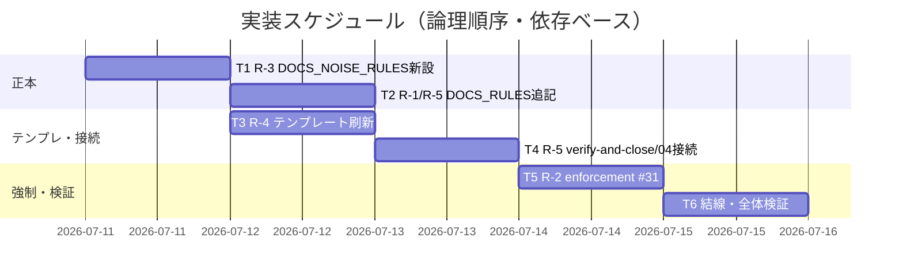

# 実装計画書: システム仕様書の完備・強制・テンプレート刷新（継続的な最新性・正確性の保証）

**プロジェクト名**: システム仕様書の完備・強制・テンプレート刷新
**作成日**: 2026 年 07 月 11 日
**最終更新**: 2026 年 07 月 11 日

> **重要**: **このドキュメントは常に更新**: 実装計画の変更、進捗状況の更新、バグの記録などがあった場合は、即座にこのドキュメントを更新してください。ドキュメントは「生きているドキュメント」として扱い、実装内容と常に同期させます。
> **必須項目**: 「必須」と明記した欄は空欄・抽象語のみで提出しないこと。テスト観点・BDD 仕様は具体ケースを 1 件以上記載すること。
>
> **用語**: [.agent-skill-chain/source/CONCEPTS.md §用語規約](../../../../../../../.agent-skill-chain/source/CONCEPTS.md#用語規約) を参照。

---

## 1. 実装概要

### 1.1 実装方針（必須）

[02_設計.md](./02_設計.md) の「正本 1 か所 + 参照結線 + 二段構え強制」に従い、R-1〜R-5 を既存 docs 規約・テンプレート・enforcement・verify-and-close へ加算的に組み込む。新しいコード・サービスは作らず、変更は (a) 規約/ポリシー文書、(b) テンプレート骨格、(c) `audit.sh` の CI 検査関数 1 つに限定する。既存の command / skill chain / PreToolUse 契約 / 既存章立ては壊さない。

### 1.2 実装順序（必須: 1 件以上）

正本を先に作り、接続点を後で結線する順で進める。

1. **タスク 1（R-3）**: `DOCS_NOISE_RULES.md` 新設（他タスクの参照先になるため先行）。
2. **タスク 2（R-1・R-5 正本）**: `DOCS_RULES.md` へ §greenfield 規約必須文書化・§ノイズ排除参照・§継続追随ゲート（強化）を追記。
3. **タスク 3（R-4）**: テンプレート刷新（05_規約 + 索引 / 00_review 索引 / README 相互リンク / 99 全数採番）。R-1 の書き先を提供。
4. **タスク 4（R-5 接続）**: `verify-and-close.md` 必須化 + `04_review.md` テンプレートのゲート結果記載枠。タスク 2 の正本を参照。
5. **タスク 5（R-2）**: `enforcement/README.md` 失敗条件 #31 + `audit.sh` `check_docs_review_evidence()`。タスク 4 の 04_review 固定キーに依存。
6. **タスク 6（結線・検証）**: `RULES.md §システム仕様書` 参照追記 + 全体静的検証（grep / realpath / audit.sh の tmp 隔離フィクスチャ実行）。



> **前提（実施済み）**: 本 issue の 00/01 に残っていた旧パス参照（`.agents/`・`.workflow/`・`.agents-project/`）を現行ネスト（`.agent-skill-chain/{source,project,runtime}/`）へ全面補正済み（00: 35 件、01: 19 件）。全リンクの realpath 解決を検証済み（未解決 0 件）。document_id は不変。

---

## 2. タスク分解

**用語**: [.agent-skill-chain/source/CONCEPTS.md §用語規約](../../../../../../../.agent-skill-chain/source/CONCEPTS.md#用語規約) を参照。

**必須**: 各タスクには **「テスト観点」（2.x.3）** と **「単体テスト仕様（BDD）」（2.x.4）** を必ず記載する。観点の定義は [02_設計 §6](./02_設計.md) および [RULES のテスト戦略・TEST_BDD_FORMAT](../../../../../../../.agent-skill-chain/source/RULES.md#テスト戦略必須要件) を参照し、本書ではタスクごとの具体ケースのみ記載する。テストは静的検証（grep・存在確認・realpath）と audit.sh の tmp 隔離実行が中心（実行コードの単体テストは #31 の bash 検査のみ）。破壊的検証は `mktemp -d` + クリーン clone 上で行い、本リポの本番ファイルを破壊しない（[.agent-skill-chain/project/自己拡張ワークフロー.md §テストの tmp 隔離](../../../../../../../.agent-skill-chain/project/自己拡張ワークフロー.md)）。

### 2.1 タスク 1: R-3 ノイズ排除規約の正本新設（DOCS_NOISE_RULES.md）

#### 2.1.1 概要（必須）

システム仕様書のノイズ禁止パターンを定義する唯一の正本 `.agent-skill-chain/source/DOCS_NOISE_RULES.md` を新設する（02 §3.2）。

#### 2.1.2 実装内容（必須: 1 件以上）

- `.agent-skill-chain/source/DOCS_NOISE_RULES.md` を新規作成し、frontmatter に document_id（UUID）を付与。
- 冒頭に責務とコード層 [CODE_COMMENT_RULES.md](../../../../../../../.agent-skill-chain/source/CODE_COMMENT_RULES.md) との境界（対象: docs=システム仕様書 / code=コメント・docstring）を明記（AC-3c）。
- 禁止パターン (i) 実装と矛盾する記述、(ii) 陳腐化した記述、(iii) 正本が別にある内容の重複記述、(iv) 壊れやすい参照（行番号直リンク等。既存 [DOCS_RULES §行番号直リンク禁止](../../../../../../../.agent-skill-chain/source/DOCS_RULES.md) を包含参照）を列挙（AC-3b）。
- 各パターンの判定基準と是正方法（正本へのアンカー参照・§節参照 1 行への張り替え）を記載。
- 機械検証（enforcement grep・レビュー）と意味的検証（R-5 レビュー反復）の役割分担を 1 段落で明記。

#### 2.1.3 テスト観点（必須）

**参照**: 観点の定義は [02\_設計 §6](./02_設計.md) を参照。本タスクの具体ケース:

##### 単体（必須 1 件以上）

- `grep -nE "実装と矛盾|陳腐化|重複|壊れやすい参照" .agent-skill-chain/source/DOCS_NOISE_RULES.md` が (i)〜(iv) の 4 パターンをヒットする。
- `grep -n "CODE_COMMENT_RULES" .agent-skill-chain/source/DOCS_NOISE_RULES.md` が境界記述をヒットする（AC-3c）。
- evidence_source の 6 分類表・ADR 形式を本ファイルに複製していない（`grep -c "human_decision" DOCS_NOISE_RULES.md` が 0、または分類表がない）（SC-7）。

##### 結合/API（該当時は必須）

- 該当なし（実行コードなし）。

##### E2E/受け入れ

- 未達（実行コードなし）。静的検証で代替。

##### バリデーション

- frontmatter に document_id（UUID 形式）が存在する。

#### 2.1.4 単体テスト仕様（BDD）（必須）

```gherkin
Feature: システム仕様書ノイズ排除規約の正本
  Scenario: 禁止4パターンとコード層境界が正本に存在する
    Given DOCS_NOISE_RULES.md が新設されている
    When 禁止パターンとコード層境界を grep で確認する
    Then (i)実装矛盾 (ii)陳腐化 (iii)正本重複 (iv)壊れやすい参照 の4件と CODE_COMMENT_RULES 境界がヒットする
    And evidence_source 6分類表は複製されていない
```

```bash
# Given: 新設された DOCS_NOISE_RULES.md
f=.agent-skill-chain/source/DOCS_NOISE_RULES.md
# When: 禁止パターン数と境界と分類非複製を検査
patterns=$(grep -cE "実装と矛盾|陳腐化|重複|壊れやすい参照" "$f")
boundary=$(grep -c "CODE_COMMENT_RULES" "$f")
dup=$(grep -c "human_decision" "$f")
# Then: 4パターン以上・境界1以上・分類複製0
[ "$patterns" -ge 4 ] && [ "$boundary" -ge 1 ] && [ "$dup" -eq 0 ] && echo OK
```

#### 2.1.5 依存関係

- なし（先行タスク。他タスクの参照先になる）。

#### 2.1.6 見積もり

- **工数**: 1.0h ／ **優先度**: 高

### 2.2 タスク 2: R-1・R-5 正本の追記（DOCS_RULES.md）

#### 2.2.1 概要（必須）

`DOCS_RULES.md` に R-1（greenfield 規約必須文書化）・§ノイズ排除（R-3 参照）・R-5（継続追随ゲート強化）の正本節を追記する（02 §3.1・§3.3・ADR-1/ADR-3）。

#### 2.2.2 実装内容（必須: 1 件以上）

- **§greenfield 規約必須文書化（R-1）**: greenfield プロジェクトでコーディング規約・ディレクトリ構成・アーキテクチャを `docs/01_システム概要/05_規約/`・`03_アーキテクチャ/`・`04_ディレクトリ構成/` に文書化することを必須とする節を追加。決定・ADR 記録は [EVIDENCE_POLICY.md §節5](../../../../../../../.agent-skill-chain/source/EVIDENCE_POLICY.md) を参照（再定義しない）。docs/ 非採用プロジェクトには課さない旨を明記。
- **§ノイズ排除（R-3 参照結線）**: `DOCS_NOISE_RULES.md`（`.agent-skill-chain/source/`・タスク 1 で新設）への参照 1 行を追加（正本を複製しない）。
- **§継続追随ゲート（R-5 強化）**: 既存 §Issue 完了時のシステム仕様書更新チェック を強化し、(a) 実装変更を伴う issue の close 前に as-built 同期（実装→仕様）レビュー→指摘対応→再レビューを指摘 0 件まで反復、(b) レビュー記録は `docs/00_review/YYYYMMDD_HHMMSS_review.md` に「照合実装・検証方法・指摘 N→0」を記録、(c) `docs/README.md` 更新履歴に版・変更・レビュー記録リンクを追記、(d) 更新不要時は根拠付き判定 1 件で通過（軽量パス）、(e) docs/ 非採用プロジェクトは不発動、を明記。

#### 2.2.3 テスト観点（必須）

##### 単体（必須 1 件以上）

- `grep -nE "コーディング規約|ディレクトリ構成|アーキテクチャ" DOCS_RULES.md` が R-1 の必須文書化行をヒットする（SC-1）。
- `grep -n "DOCS_NOISE_RULES" DOCS_RULES.md` が R-3 参照をヒットする（SC-4）。
- `grep -nE "継続追随|指摘 0 件|as-built|更新不要判定" DOCS_RULES.md` が R-5 ゲート正本をヒットする（SC-6）。
- `grep -n "EVIDENCE_POLICY" DOCS_RULES.md` が R-1 の決定側参照をヒットし、ADR 形式・evidence_source 分類の再定義がないこと（SC-7）。

##### 結合/API

- 該当なし。

##### E2E/受け入れ

- 未達（静的検証で代替）。

##### バリデーション

- 既存 §基本方針・§行番号直リンク禁止・§参照表 を削除・改変していない（追記のみ・後方互換）。

#### 2.2.4 単体テスト仕様（BDD）（必須）

```gherkin
Feature: DOCS_RULES への R-1/R-3参照/R-5 正本追記
  Scenario: 3手段の正本行が DOCS_RULES に存在し隣接issue正本を参照する
    Given DOCS_RULES.md に R-1・§ノイズ排除・R-5 が追記されている
    When 各手段のキーワードを grep する
    Then 規約必須文書化・DOCS_NOISE_RULES参照・継続追随ゲート が各1件以上ヒットする
    And ADR形式/evidence_source を再定義せず EVIDENCE_POLICY を参照している
```

```bash
# Given: 追記後の DOCS_RULES.md
f=.agent-skill-chain/source/DOCS_RULES.md
# When: 3手段の存在と隣接正本参照を検査
r1=$(grep -cE "コーディング規約|ディレクトリ構成|アーキテクチャ" "$f")
r3=$(grep -c "DOCS_NOISE_RULES" "$f")
r5=$(grep -cE "継続追随|指摘 0 件|更新不要判定" "$f")
ep=$(grep -c "EVIDENCE_POLICY" "$f")
# Then: すべて1件以上
[ "$r1" -ge 1 ] && [ "$r3" -ge 1 ] && [ "$r5" -ge 1 ] && [ "$ep" -ge 1 ] && echo OK
```

#### 2.2.5 依存関係

- タスク 1（DOCS_NOISE_RULES.md）— §ノイズ排除の参照先。

#### 2.2.6 見積もり

- **工数**: 1.5h ／ **優先度**: 高

### 2.3 タスク 3: R-4 テンプレート刷新（4 要素の加算）

#### 2.3.1 概要（必須）

`.agent-skill-chain/runtime/templates/docs/` に system-graph/docs 由来の 4 要素を既存章立てを壊さず加算する（02 §3.4・ADR-5）。本タスクで用いる **SC-5a〜SC-5d** は 00 §6 SC-5 の 4 要素 (a)〜(d) への参照ラベルである（定義は [02 §3.4.1 参照ラベル定義](./02_設計.md)）。

#### 2.3.2 実装内容（必須: 1 件以上）

- **(a) 規約ドメイン別分離+索引**: `01_システム概要/05_規約/README.md`（カテゴリ一覧 10〜90・必須骨格/任意拡張の区別）、`05_規約/00_索引と探し方/README.md`（「探したいこと→正本ファイル」表・「キーワード→grep ヒント（AI 向け）」表・Diátaxis 位置づけ）、`05_規約/{10_フロントエンド,20_バックエンド,30_データと契約,40_インフラと実行,50_テストと品質,60_セキュリティ,90_横断関心}/README.md`（骨格プレースホルダ）を新設。`01_システム概要/README.md` サブドキュメント一覧に `05_規約` を追記。全 README frontmatter に document_id。
- **(b) レビュー記録の蓄積・索引**: `00_review/README.md`（レビュー記録一覧表: 日時・対象・指摘 N→0・対応 issue/版番号）を新設。既存 `00_review/YYYYMMDD_HHMMSS_review.md` は活用（変更不要）。
- **(c) 更新履歴×レビュー記録 相互リンク**: `docs/README.md` 更新履歴表に「対応レビュー記録」列を追加、構成表に `05_規約`・`00_review` を追記、版番号・変更内容・レビュー記録リンクの相互運用を本文で説明。
- **(d) ID 全数採番方針**: `99_ID命名規則と管理/README.md` に「全数採番方針」（本表を全 ID の唯一台帳とし新規 ID は必ず登録・未登録は監査/レビューで検出）を追記。
- system-graph 固有内容（`CMD_*`・OpenAPI・製品名）は移植せず、プレースホルダで汎用化（AC-4d）。

#### 2.3.3 テスト観点（必須）

##### 単体（必須 1 件以上）

- `test -f .agent-skill-chain/runtime/templates/docs/01_システム概要/05_規約/00_索引と探し方/README.md` が真、かつ内容に「探したいこと」「grep」「Diátaxis」を含む（SC-5a・SC-2）。
- `05_規約/{10,20,30,40,50,60,90}_*/README.md` が 7 件存在する。
- `00_review/README.md` に索引表（`| 日時` 等）が存在（SC-5b）。
- `docs/README.md` 更新履歴表に「対応レビュー記録」列見出しが存在（SC-5c）。
- `99_ID命名規則と管理/README.md` に「全数採番」が存在（SC-5d）。
- `01_システム概要/README.md` サブドキュメント一覧に `05_規約` リンクが存在。

##### 結合/API

- 該当なし。

##### E2E/受け入れ

- 未達（静的検証で代替）。テンプレートから初期化した docs/ で「探したいこと→正本ファイル」索引から到達できることは手動確認。

##### バリデーション

- 既存 01〜05・99・00_review・README 更新履歴の**既存列・既存章立てを削除/改名していない**（AC-4c）。`grep -rE "CMD_[A-Z]|openapi\.yaml" 05_規約/` が 0 件（固有内容の非移植・AC-4d）。

#### 2.3.4 単体テスト仕様（BDD）（必須）

```gherkin
Feature: 大規模対応テンプレートの4要素
  Scenario: 規約索引・レビュー記録索引・更新履歴相互リンク・全数採番が加算される
    Given テンプレート docs/ に4要素が加算されている
    When 各要素の存在と非破壊を検査する
    Then 05_規約/00_索引・00_review/README・README対応レビュー記録列・99全数採番 が存在する
    And 既存章立ては削除されず system-graph 固有内容は移植されていない
```

```bash
# Given: 刷新後テンプレート
d=.agent-skill-chain/runtime/templates/docs
# When: 4要素と非破壊・非移植を検査
idx=$(test -f "$d/01_システム概要/05_規約/00_索引と探し方/README.md" && grep -lE "探したいこと|grep" "$d/01_システム概要/05_規約/00_索引と探し方/README.md")
rev=$(test -f "$d/00_review/README.md" && echo y)
hist=$(grep -c "レビュー記録" "$d/README.md")
num=$(grep -c "全数採番" "$d/99_ID命名規則と管理/README.md")
leak=$(grep -rEc "CMD_[A-Z]|openapi\.yaml" "$d/01_システム概要/05_規約/" | paste -sd+ | bc)
# Then: 4要素あり・固有内容漏れ0
[ -n "$idx" ] && [ "$rev" = y ] && [ "$hist" -ge 1 ] && [ "$num" -ge 1 ] && [ "$leak" -eq 0 ] && echo OK
```

#### 2.3.5 依存関係

- タスク 1（DOCS_NOISE_RULES）・タスク 2（DOCS_RULES §R-1）— 索引が参照する規約正本の対応付けに用いる（緩依存）。

#### 2.3.6 見積もり

- **工数**: 3.0h ／ **優先度**: 中

### 2.4 タスク 4: R-5 接続（verify-and-close.md 必須化 + 04_review テンプレート記載枠）

#### 2.4.1 概要（必須）

`verify-and-close.md §実行時の注意` の「必要に応じて」を DOCS_RULES §継続追随ゲート参照の必須表現へ置換し、`04_review.md` テンプレートにゲート結果の記載枠を設ける（02 §3.3・ADR-3・AC-1a/1d・SC-6）。

#### 2.4.2 実装内容（必須: 1 件以上）

- `verify-and-close.md §実行時の注意`: 現行「システム仕様書（docs/）の更新: **必要に応じて**加筆修正する」を、「システム仕様書（docs/）の継続追随: 実装変更を伴う issue の close 前に `DOCS_RULES §継続追随ゲート`（verify-and-close.md からは `../DOCS_RULES.md`）に従いレビュー反復（指摘 0 件まで。更新不要時は根拠付き判定）を**必須**とする（docs/ 非採用プロジェクトは不発動）」へ置換。skill chain の step・順序・DoD は不変。
- `04_review.md` テンプレート: 既存 §docs 更新（固定キー `## docs 更新`・`- 要否:`・`- 対象:`・`- 理由:`）を保持しつつ、要=対応 `docs/00_review/` レビュー記録への参照、不要=更新不要判定の根拠 を記載する指示を追加。§11 に継続追随ゲート結果（更新内容 or 更新不要判定 + レビュー記録参照）を記載する旨と DOCS_RULES §継続追随ゲートへの参照を追加。**さらに §11 冒頭の任意表現「必要に応じて加筆修正を行うこと」を DOCS_RULES §継続追随ゲート参照の必須ゲート表現へ置換する（docs 更新文脈の「必要に応じて」を除去。SC-6・00 §8 が 04_review §11 も R-5 の変更対象と明記）。**

#### 2.4.3 テスト観点（必須）

##### 単体（必須 1 件以上）

- `grep -c "必要に応じて" verify-and-close.md` の該当行が docs 更新文脈で 0（任意表現の除去。SC-6）、かつ `grep -nE "継続追随|必須" verify-and-close.md` が必須ゲート文言をヒットする。
- `04_review.md` §11 の docs 更新文脈でも「必要に応じて加筆修正」が除去され、DOCS_RULES §継続追随ゲート参照の必須表現に置換されている（SC-6・00 §8）。
- `grep -n "DOCS_RULES" verify-and-close.md`・`04_review.md` が参照をヒットする（正本複製なし）。
- `04_review.md` に `## docs 更新` と `- 要否:` の固定キーが**残存**する（#5/#31 互換・回帰防止）。

##### 結合/API

- タスク 5 と結合: 更新後 04_review テンプレートのキーで audit #5/#31 が誤 FAIL しないことをタスク 6 の audit 実行で確認。

##### E2E/受け入れ

- 未達（静的検証で代替）。

##### バリデーション

- verify-and-close.md の PROCESS（skill chain 5 step）・DoD の文言を削除・改変していない。

#### 2.4.4 単体テスト仕様（BDD）（必須）

```gherkin
Feature: 継続追随ゲートの必須化接続
  Scenario: verify-and-close の任意表現が必須ゲートに置換され04に記載枠がある
    Given verify-and-close.md と 04_review.md が更新されている
    When docs更新文脈の文言と固定キーを検査する
    Then 「必要に応じて」の任意表現が必須ゲート表現に置換され DOCS_RULES を参照する
    And 04_review §11 の「必要に応じて加筆修正」任意表現も除去されている
    And 04_review に ## docs 更新 と - 要否: の固定キーが残存している
```

```bash
# Given: 更新後ファイル
vc=.agent-skill-chain/source/commands/verify-and-close.md
rv=.agent-skill-chain/runtime/templates/04_review.md
# When: 必須化・参照・固定キー残存・04任意表現除去を検査
must=$(grep -cE "継続追随|必須" "$vc")
ref=$(grep -c "DOCS_RULES" "$vc")
rv_opt=$(grep -c "必要に応じて加筆修正" "$rv")   # §11 の任意表現（除去後は 0）
# Then: 必須表現・参照あり・04任意表現0・固定キー残存
[ "$must" -ge 1 ] && [ "$ref" -ge 1 ] && [ "$rv_opt" -eq 0 ] && grep -q '^## docs 更新$' "$rv" && grep -q '^- 要否:' "$rv" && echo OK
```

#### 2.4.5 依存関係

- タスク 2（DOCS_RULES §継続追随ゲート）— 参照先の正本。

#### 2.4.6 見積もり

- **工数**: 1.5h ／ **優先度**: 高

### 2.5 タスク 5: R-2 enforcement 接続（#31 新設）

#### 2.5.1 概要（必須）

`enforcement/README.md` に失敗条件 #31 を正本化し、`audit.sh` に `check_docs_review_evidence()` を実装する（02 §3.5・ADR-4・SC-3・AC-5a〜5d）。

#### 2.5.2 実装内容（必須: 1 件以上）

- `enforcement/README.md`: 失敗条件 **#31（システム仕様書レビュー証跡欠落）** を (1) 対応表（# / 実装の所在 / 強制レベル）、(2) 失敗とみなす条件一覧、(3) 差し戻し先固定表、(4) §配置一覧の「audit.sh が実施する必須チェック」列挙、の 4 か所に追加。強制レベル=CI FAIL（docs/ 非採用・DB 不採用・実装変更なしは SKIP）。意味的検証は対象外・R-5 レビュー反復が担う二段構えを明記（AC-5d）。
- `audit.sh`: `check_docs_review_evidence()` を追加し末尾の呼び出し列（`check_review_before_implement` の後）に登録。ロジックは 02 §3.5.2 に従う。SKIP ガード: sqlite3/workflow_log 不在、`docs/` 未採用（`[[ ! -d "$PROJECT_ROOT/docs" ]]`）、`templates/`・`close/` 配下除外、当該 issue に implement-feature/verify-and-close ログ 0 件（#29 と同一の前方一致方式）。FAIL 条件: 上記を通過した 04_review.md で「§docs 更新 の要否が記載され、要なら `docs/00_review` 記録参照 or 不要なら根拠」が欠落。`EXIT_CODE=1` + `ROLLBACK_MSG`。
- **不変制約**: `PreToolUse.sh`・`PostToolUse.sh`・stdin JSON 契約・exit code 規約（違反=2/許可=0）・fail-open 方針は変更しない（Layer4 CI のみに接続。00 §3.2）。

#### 2.5.3 テスト観点（必須）

##### 単体（必須 1 件以上）

- `bash -n audit.sh` が構文エラーなし。
- `grep -n "check_docs_review_evidence" audit.sh` が定義と末尾呼び出しの 2 箇所以上をヒットする。
- `git diff` で `PreToolUse.sh`・`PostToolUse.sh` が変更対象外（PreToolUse 契約不変の証跡）。

##### 結合/API（必須 1 件以上・audit 実行）

- **FAIL ケース**: tmp 隔離環境（docs/ あり・workflow_log に implement-feature ログあり・04_review に docs レビュー証跡なし）で audit.sh が #31 で FAIL（exit 1・"システム仕様書レビュー証跡欠落" 出力）。
- **PASS ケース**: 同環境で 04_review に「要否: 不要 / 理由: …」or「要否: 要 / 対象: docs/00_review/…」がある場合 PASS。
- **SKIP ケース**: (a) docs/ なし、(b) DB なし、(c) implement/verify ログ 0 件、(d) close/templates 配下 で誤 FAIL しない（AC-5c）。
- **回帰**: 既存 #5/#29 が本追加で挙動変化しない（本リポ audit 緑・タスク 6）。

##### E2E/受け入れ

- 本リポ自己適用（ドッグフーディング）で `enforcement/ci/audit.sh .` が緑（タスク 6）。

##### バリデーション

- #31 は grep/存在ベースのみで意味的一致を検査しない（AC-5d）。fail-open（判定材料不足は SKIP）。

#### 2.5.4 単体テスト仕様（BDD）（必須）

```gherkin
Feature: システム仕様書レビュー証跡欠落の監査（#31）
  Scenario: 実装変更issueでdocsレビュー証跡が無いと差し戻される
    Given tmp隔離リポに docs/ があり workflow_log に implement-feature ログがある issue の 04_review が docs レビュー証跡を欠く
    When enforcement/ci/audit.sh を実行する
    Then #31 で FAIL し exit 1 と "システム仕様書レビュー証跡欠落" が出力される
  Scenario: docs/未採用プロジェクトでは#31が発動しない
    Given tmp隔離リポに docs/ が存在しない
    When audit.sh を実行する
    Then #31 は SKIP し #31 起因の FAIL は出ない
```

```bash
# Given: tmp隔離のフィクスチャ（クリーンcloneに docs/ と workflow.db・04_review を配置）
tmp=$(mktemp -d); git archive HEAD | tar -x -C "$tmp"
# ... docs/ 作成・workflow_log に implement-feature INSERT・04_review を証跡なしで配置 ...
# When: audit 実行（対象dir明示）
out=$(cd "$tmp" && bash .agent-skill-chain/source/enforcement/ci/audit.sh . 2>&1); rc=$?
# Then: #31 FAIL を確認
echo "$out" | grep -q "システム仕様書レビュー証跡欠落" && [ "$rc" -ne 0 ] && echo OK
rm -rf "$tmp"
```

#### 2.5.5 依存関係

- タスク 4（04_review 固定キー・DOCS_RULES §継続追随ゲート）— #31 の検査対象・意味定義。

#### 2.5.6 見積もり

- **工数**: 3.0h ／ **優先度**: 高

### 2.6 タスク 6: 結線（RULES.md）と全体静的検証

#### 2.6.1 概要（必須）

`RULES.md §システム仕様書` に継続追随ゲート・ノイズ排除への参照 1 行を追記し、全成果物の静的検証（grep・realpath・audit.sh 緑）を行う（02 §6.2）。

#### 2.6.2 実装内容（必須: 1 件以上）

- `RULES.md §システム仕様書` に「継続追随ゲートは DOCS_RULES §継続追随ゲート、ノイズ排除は DOCS_NOISE_RULES を参照」の 1 行を追記（正本複製なし）。
- 全変更ファイルの markdown リンクを realpath で解決検証（未解決 0 件）。
- 本リポで `enforcement/ci/audit.sh .` を実行し緑（自己適用回帰）。
- SC-1〜SC-8 の grep 対応表を 04_review 用に整備（verify フェーズで再実行）。

#### 2.6.3 テスト観点（必須）

##### 単体（必須 1 件以上）

- `grep -nE "継続追随|DOCS_NOISE_RULES" RULES.md` が結線行をヒットする。
- 全成果物のリンク realpath 解決が未解決 0 件。

##### 結合/API（必須）

- `enforcement/ci/audit.sh .`（本リポ・対象 dir 明示）が exit 0（既存チェック + #31 が緑）。

##### E2E/受け入れ

- SC-1〜SC-8 の各 grep が期待どおりヒット（04_review に結果転記）。

##### バリデーション

- 変更対象外ファイル（PreToolUse.sh・CODE_COMMENT_RULES.md・EVIDENCE_POLICY.md・CONCEPTS.md）が git diff に現れない。

#### 2.6.4 単体テスト仕様（BDD）（必須）

```gherkin
Feature: 全体結線と静的検証
  Scenario: 結線行が存在し全リンク解決と audit 緑が成立する
    Given 全タスクの成果物が揃っている
    When RULES結線・リンク解決・audit.sh を検査する
    Then RULES に継続追随/DOCS_NOISE_RULES 参照があり 未解決リンク0 かつ audit.sh が exit 0
```

```bash
# Given: 全成果物
# When: 結線・リンク・audit を検査
rules=$(grep -cE "継続追随|DOCS_NOISE_RULES" .agent-skill-chain/source/RULES.md)
bash .agent-skill-chain/source/enforcement/ci/audit.sh . >/dev/null 2>&1; rc=$?
# Then: 結線あり・audit緑
[ "$rules" -ge 1 ] && [ "$rc" -eq 0 ] && echo OK
```

#### 2.6.5 依存関係

- タスク 1〜5 すべて。

#### 2.6.6 見積もり

- **工数**: 2.0h ／ **優先度**: 高

---

## テスト観点

本実装計画全体のテスト観点の要約（具体ケースは各 §2.x.3 に記載）:

- **静的検証中心**: 実行コードは audit.sh の bash 検査 1 関数のみ。他は grep・存在確認・realpath リンク解決で正本存在・参照結線・非破壊・非移植・非重複を検証する。
- **enforcement は tmp 隔離フィクスチャ**で FAIL/PASS/SKIP の 3 系統を検証（誤発動防止 AC-5c を含む）。破壊的検証は本番ファイルを触らず `mktemp -d` + `git archive HEAD | tar -x` で行う。
- **不変性の証跡**: PreToolUse 契約・隣接 issue 正本（EVIDENCE_POLICY/CONCEPTS）・CODE_COMMENT_RULES が git diff で変更対象外であることを確認（境界・制約の担保）。
- **SC 対応**: SC-1（R-1 grep）・SC-2/SC-5（テンプレ構造存在）・SC-3（#31 FAIL）・SC-4/SC-7（正本重複・再定義ゼロ）・SC-6（任意→必須置換）・SC-8（SKIP/軽量パス）を各タスクのケースへ割当済み。

---

## 単体テスト

- 単体相当は「grep/存在ヒット数の閾値検査」（各 §2.x.4 の bash スニペット）と「audit.sh の #31 単体挙動（FAIL/PASS/SKIP）」。
- `bash -n audit.sh` で構文検査、`shellcheck`（利用可能なら）で lint。
- 実装完了後の verify-and-close で全単体スニペットを再実行し 04_review に結果（数値）を記載する。

---

## BDD

- 各タスクの §2.x.4 に Given/When/Then を記載済み。集約すると次の受け入れ観点に対応する:
  - 継続追随ゲート（R-5・01 ユースケース 1 シナリオ 1〜4）→ タスク 4・タスク 5。
  - ノイズ排除（R-3・01 ユースケース 2）→ タスク 1・タスク 2。
  - greenfield 規約必須文書化（R-1・01 ユースケース 3 シナリオ 1）→ タスク 2・タスク 3。
  - テンプレート立ち上げ（R-4・01 ユースケース 3 シナリオ 2）→ タスク 3。
  - enforcement 接続（R-2・01 ストーリー 5）→ タスク 5。
- Given/When/Then 形式は [TEST_BDD_FORMAT.md](../../../../../../../.agent-skill-chain/source/TEST_BDD_FORMAT.md) に従う。

---

## 3. 実装スケジュール

### 3.1 マイルストーン

| マイルストーン | 期日 | 成果物 |
| -------------- | ---- | ------ |
| M1: 正本確立（R-3/R-1/R-5 正本） | T1〜T2 完了 | DOCS_NOISE_RULES.md・DOCS_RULES.md 追記 |
| M2: テンプレ・接続 | T3〜T4 完了 | 05_規約 骨格・00_review 索引・README/99 追記・verify-and-close/04 接続 |
| M3: 強制・検証 | T5〜T6 完了 | audit.sh #31・enforcement/README #31・RULES 結線・audit 緑 |

### 3.2 実装フェーズ

#### フェーズ 1: 正本 + テンプレート

- **タスク**: T1・T2・T3

#### フェーズ 2: 接続 + 強制 + 検証

- **タスク**: T4・T5・T6

---

## 4. テスト計画

テスト観点・レベル・BDD 形式の定義は **02\_設計 §6** および **RULES のテスト戦略・TEST_BDD_FORMAT** を参照。本計画では各タスク §2.x.3 に具体ケース、§2.x.4 に BDD を記載済み。

### 4.1 テストの優先順位

- **最優先**: R-2 audit #31 の FAIL/SKIP 挙動（誤発動は開発スループットに直結。AC-5c）と、R-5 の任意→必須置換（SC-6）。
- **回帰必須**: 既存 audit #5/#29 の非交差、既存章立て・PreToolUse 契約の非破壊。
- tmp 隔離での破壊的検証は対象 dir を明示指定する（[.agent-skill-chain/project/自己拡張ワークフロー.md §テストの tmp 隔離](../../../../../../../.agent-skill-chain/project/自己拡張ワークフロー.md)）。

---

## 5. リスク管理

### 5.1 実装リスク

- **リスク**: #31 が既存 #5（docs 更新要否未記載）と交差し二重 FAIL・誤 FAIL を招く。
  - **対策**: #31 は「要否記載の存在」ではなく「要=証跡参照 / 不要=根拠 の内容有無」を検査し #5 と非交差にする（02 §3.5.4）。tmp 隔離で #5/#31 の独立性を確認。
- **リスク**: R-4 テンプレ肥大で小規模プロジェクトに過剰な器を強いる。
  - **対策**: 05_規約/README で必須の骨格（00_索引のみ）と任意の拡張（10〜90）を明示（AC-4b・SC-8）。
- **リスク**: R-5 ゲートの形骸化（指摘 0 件を出すだけの儀式）。
  - **対策**: レビュー記録に「照合した実装・検証方法・指摘 N→0」を必須化（DOCS_RULES §継続追随ゲート）。意味的正しさは人手レビューが担う二段構え。
- **リスク**: 親 issue ストーリー 8 の影響でパスがずれる。
  - **対策**: 本計画は既に現行ネスト（`.agent-skill-chain/{source,project,runtime}/`）前提で記述済み。実装着手順は orchestrator 判断（00 §4.3）。

---

## 6. 参考資料

### プロジェクトドキュメント

- [`02_設計.md`](./02_設計.md) - 設計（責務・ADR・機能設計・テスト戦略の正本）
- [`00_要求定義.md`](./00_要求定義.md)・[`01_要件定義.md`](./01_要件定義.md) - R/SC/AC の正本
- 隣接サブ issue: [`フィジビリティADR必須化/03_実装計画.md`](../20260711_055538_フィジビリティADR必須化/03_実装計画.md) - 静的検証中心の実装計画の前例

### その他の参考資料

- [.agent-skill-chain/source/enforcement/ci/audit.sh](../../../../../../../.agent-skill-chain/source/enforcement/ci/audit.sh) — #29 `check_review_before_implement`（#31 の実装様式の前例）
- [.agent-skill-chain/source/enforcement/README.md](../../../../../../../.agent-skill-chain/source/enforcement/README.md) §失敗条件と差し戻し — #31 追加先
- [.agent-skill-chain/runtime/templates/docs/](../../../../../../../.agent-skill-chain/runtime/templates/docs/) — R-4 刷新対象
- [.agent-skill-chain/source/TEST_BDD_FORMAT.md](../../../../../../../.agent-skill-chain/source/TEST_BDD_FORMAT.md) — BDD 形式

---

## 7. 前のステップ

この実装計画書は、以下のドキュメントを基に作成されています：

- **前**: [`02_設計.md`](./02_設計.md) - 設計フェーズ

---

## 8. 次のステップ

この実装計画書の承認後、以下のステップに進みます：

- **本 issue はサブ issue（親 issue の 90_issues 配下）であり、これ以上の分割は行わない**。実装フェーズ（implement-feature）へ進み、タスク 1〜6 を順に実装する。各フェーズ完了時に verify-and-close を委譲する。

**用語**: [.agent-skill-chain/source/CONCEPTS.md §用語規約](../../../../../../../.agent-skill-chain/source/CONCEPTS.md#用語規約) を参照。
