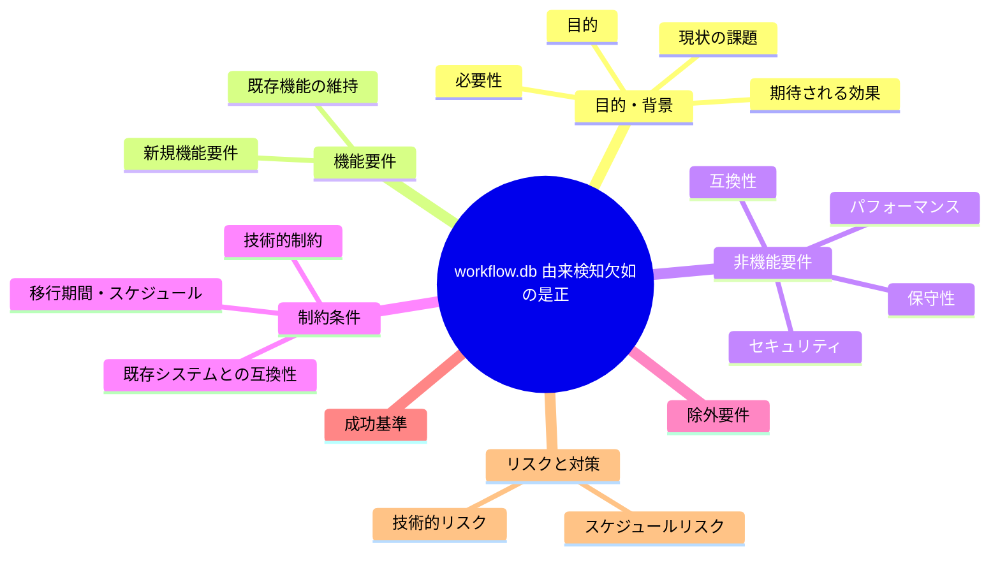
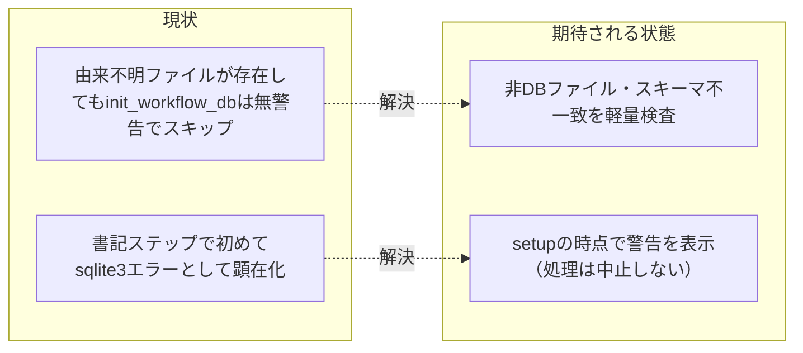

# 要求定義書: `.agent-skill-chain/runtime/workflow.db` 由来検知欠如の是正（setup 沈黙スキップの解消）

**プロジェクト名**: `.agent-skill-chain/runtime/workflow.db` 由来検知欠如の是正
**作成日**: 2026 年 07 月 11 日
**最終更新**: 2026 年 07 月 11 日

> **重要**:
>
> - 要求定義書は、プロジェクトの全体像を把握するためのものです。詳細な技術仕様や実装方法は要件定義書以降で記載します。必要最低限の情報に収めることを心掛けてください。
> - **このドキュメントは常に更新**: 要求の変更や追加があった場合は、即座にこのドキュメントを更新してください。ドキュメントは「生きているドキュメント」として扱い、実装内容と常に同期させます。
> - **必須項目**: 以下の「必須」と明記した項目は空欄・抽象語のみ（例: 「{説明}」のまま）で提出しないこと。判定可能な形（目的は1文・成功基準は○/×で判定できる記載等）で記入すること。
>
> **用語**: [.agent-skill-chain/source/CONCEPTS.md §用語規約](../../../../../../../.agent-skill-chain/source/CONCEPTS.md#用語規約) を参照。

---

## 要求定義の全体像

---

## 1. 目的・背景

### 1.1 目的（必須）

`.agent-skill-chain/runtime/workflow.db` に由来不明の既存ファイルがある場合、setup が無警告で見逃さず利用者に通知する。

### 1.2 背景

**発端**: 親 issue `docs/maintainer/workflow/20260711_015030_agentsOS汎用化_ポリシー統合/`（ストーリー8: ディレクトリ名前空間衝突安全化）の独立レビュー中、ユーザーから「`.agent-skill-chain/runtime/`（旧 `.workflow/`）も `.agent-skill-chain/`（旧 `.agents/`）と同型の名前空間衝突リスクを抱えていないか」との再指摘を受け検証した過程で発見した派生課題。結論・一次情報（実機検証・比較表）は `02_設計.md §2.6.7` に、本サブ issue の起票の位置づけは `03_実装計画.md §2.8.2`（ストーリー8 実装内容④で本サブ issue を参照）に記載済み（いずれも当該親 issue）。本 issue はそこで「本 issue（ストーリー8）のスコープには含めない」「将来の別 issue に委ねる」と整理された事項を実際に起票し、責任を持って追跡可能な状態にするもの（CLOSEOUT.md 新設「課題の責任完遂」原則＝起票は必要条件だが十分条件ではない、を満たすための起票）。

- **現状の課題**:
  - `.agent-skill-chain/source/scripts/setup.sh` の `init_workflow_db`（196〜207 行目）と `.agent-skill-chain/source/scripts/write-workflow-log.sh`（284〜288 行目・変数名は `$WF_DB`）は、いずれも `.agent-skill-chain/runtime/workflow.db` の初期化要否を **`[[ -f "$db" ]]` の存在確認のみ**で判定しており、当該ファイルが本パッケージ由来の正規スキーマかを検証する処理が一切無い。
  - 実機検証（2026-07-11・隔離環境）: `.agent-skill-chain/runtime/workflow.db` に本パッケージ非由来の任意テキストファイルを事前配置した状態で `init_workflow_db` を実行すると、`[[ -f "$db" ]]` が真になるため**エラーも警告も出さず `return 0` で処理を終える**（サイレントスキップ）。setup 自体は「成功」として完了し、由来不明ファイルの存在は利用者に一切通知されない。
  - その後、実際に書記（`write-workflow-log.sh`）が当該 DB へ書き込もうとした時点で初めて、`sqlite3 "$db" "PRAGMA journal_mode=WAL; ..."` が `Error: file is not a database`（exit code 26）で失敗し、`set -e` によりスクリプトが異常終了する。データの破壊は生じない（sqlite3 自体が非 DB ファイルへの書込みを拒否するため）が、原因不明のエラーとして問題が事後的にしか顕在化せず、利用者が「なぜ書記ステップが失敗するのか」を自力で `init_workflow_db` の沈黙スキップまで遡って原因究明する必要がある。
  - この挙動は「サイレントなデータ破壊」ではないため、`.agent-skill-chain/`（旧 `.agents/`）が改称前に抱えていた「無警告 rm -rf による全消去」ほど深刻ではないが、利用者体験としては「setup 完了と表示されたのに、直後の操作で原因不明のエラーが起きる」という不親切な状態であり、改善の余地がある。

- **必要性**:
  - setup の成功表示と実際の状態（由来不明ファイルが存在する）が食い違ったままだと、利用者が問題の根本原因（`workflow.db` の由来不明）にたどり着くまでに無駄な調査コストを払う。
  - 親 issue（ストーリー8）が確立する「配備マーカー・由来検知・fail-closed」という設計思想（`.agent-skill-chain/.package-manifest` 等）の一貫性を、同じ setup 内の別対象（`workflow.db`）にも軽量な形で及ぼすことで、利用者が学ぶべき「setup は由来不明なものを黙って受け入れない」という一貫した期待値を保てる。

### 1.3 期待される効果（必須: 1 件以上）

- **効果 1**: `init_workflow_db` が既存ファイルをスキップする際、そのファイルが有効な sqlite3 データベースであり `workflow_log` テーブル（またはそれに準ずる期待スキーマ）を持つかを軽量に検査し、一致しない場合は警告メッセージ（ファイルパス・推定される問題・人間が確認すべき手順）を標準エラー出力へ表示する（達成判定: 非 sqlite3 ファイル・スキーマ不一致ファイルを事前配置した状態で `setup.sh` を実行すると、警告メッセージが出力されることを確認できる）。
- **効果 2**: 上記の検査は setup の処理を**中止させない**（既存ファイルは変更しない・setup 自体は完了する）。理由: 対象は再生成不能な可能性のある由来不明ファイルであり、fail-closed で処理中止するほどの深刻さは無い（`.agent-skill-chain/` 本体のような破壊的操作を伴わないため）。あくまで「気づけるようにする」ことが目的であり、`.agent-skill-chain/` 本体と同水準のマーカー・fail-closed 機構までは導入しない（達成判定: 警告後も setup が正常終了コードで完了することを確認できる）。

**現状と期待される状態の比較**:

---

## 2. 機能要件

### 2.1 既存機能の維持（該当する場合）

`init_workflow_db`・`write-workflow-log.sh` の既存の正常系（`.agent-skill-chain/runtime/workflow.db` が存在しない場合の新規作成、既存の正規 DB への追記）は変更しない。既存 DB を上書きしない（保持する）という既存契約（`.agent-skill-chain/source/SETUP.md §保持・上書き契約` の「workflow.db」行）も維持する。

### 2.2 新規機能要件

- `init_workflow_db`（`setup.sh`）に、既存ファイルをスキップする直前の軽量検査（有効な sqlite3 ファイルか・`workflow_log` テーブルを持つか）を追加し、不一致の場合は警告を標準エラー出力へ表示する。
- `src/agents-md.ts` 側に同種の判定ロジックが存在する場合（要調査。設計フェーズで確認する）、同じ検査を追加し、`setup.sh` とドリフトしないようにする。

---

## 3. 非機能要件

### 3.1 パフォーマンス

- 軽量検査（sqlite3 の `PRAGMA table_info` 相当の 1 クエリ）に限定し、setup 全体の実行時間に有意な影響を与えない。

### 3.2 セキュリティ

- 本変更は警告表示のみであり、fail-closed（処理中止）を新規導入しない。`.agent-skill-chain/` 本体（親 issue ストーリー8）が採る fail-closed 方針とは意図的に異なる軽量な方針であることを設計フェーズで明記する。

### 3.3 互換性

- 既存の `test/e2e-install-uninstall.sh` の既存シナリオ（R1〜R3）を破壊しない。

### 3.4 保守性

- 判定ロジックは `setup.sh`・`src/agents-md.ts` の重複実装を避け、可能な限り単一の定義（または明示的にミラーする関係）を保つ。

---

## 4. 制約条件

### 4.1 技術的制約

- 本 issue は親 issue（`20260711_015030_agentsOS汎用化_ポリシー統合`）のストーリー8 実装（`.agents/` → `.agent-skill-chain/source/` へのネスト統合改称）に技術的に依存しない独立の改修である。ストーリー8 は実装完了済み（commit 44dac77）であり、`init_workflow_db` の実装場所は現行の `.agent-skill-chain/source/scripts/setup.sh` に確定している（本設計・実装は当該現行パスを前提とする）。

### 4.2 既存システムとの互換性

- `write-workflow-log.sh`・`init_workflow_db` の既存呼び出し元（`setup.sh` 本体・`bin/agents-md.js` 経由の CLI）とのインターフェースを変更しない（警告出力の追加のみ）。

### 4.3 移行期間・スケジュール

- 特段の期限なし。低優先度（🟢）。親 issue ストーリー8 の実装完了後、手が空いたタイミングでの着手を想定する。

---

## 5. 除外要件

- `.agent-skill-chain/`（旧 `.agents/`）本体が備える配備マーカー（`.package-manifest`）・フィンガープリント判定・fail-closed 中止と同水準の機構を `workflow.db` に導入することは対象外とする（親 issue `02_設計.md §2.6.7` で「複雑さが利益を上回る」と判定済み・本 issue はその判定を覆さない）。
- `.agent-skill-chain/runtime/templates/` の衝突対応（置換前バックアップ）は親 issue `02_設計.md §2.6.6` で既に対応済みであり、本 issue の対象外。
- `.agent-skill-chain/runtime/<issue>/` ディレクトリの衝突対応は、タイムスタンプ命名により実務上のリスクが無視できるため対象外（親 issue `02_設計.md §2.6.7` で評価済み）。

---

## 6. 成功基準（必須: 1 件以上）

- 非 sqlite3 ファイル・スキーマ不一致ファイルを `.agent-skill-chain/runtime/workflow.db` に事前配置した隔離環境で `setup.sh` を実行し、警告メッセージが標準エラー出力に表示されることを確認できる。
- 同条件で setup が正常終了コード（0）で完了することを確認できる（処理中止を追加しないため）。
- 既存の `test/e2e-install-uninstall.sh` の R1〜R3 シナリオが回帰しないことを確認できる。

---

## 7. リスクと対策

### 7.1 技術的リスク

- **リスク**: 軽量検査自体が誤判定し、正規の（ただし何らかの理由でスキーマが古い）既存 DB を「由来不明」として警告してしまう（false positive）。
  - **対策**: マイグレーション（`write-workflow-log.sh` の既存の ADD COLUMN ロジック）で救済されるスキーマ差分は正規とみなし、`workflow_log` テーブル自体の有無（sqlite3 として開けるか・テーブルが存在するか）のみを検査対象とすることを設計フェーズで確定する。

### 7.2 スケジュールリスク

- **リスク**: 親 issue のストーリー8（改称）と同時期に着手すると、`init_workflow_db` の配置パスが競合し手戻りが生じる。
  - **対策**: 親 issue のストーリー8完了後に着手する（§4.3 のとおり）。

---

## 8. 参考資料

### プロジェクトドキュメント

- 発端・一次情報の詳細: [`../../02_設計.md §2.6.7`](../../02_設計.md)（親 issue。実機検証の再現手順・`.agent-skill-chain/`（旧 `.agents/`）改称前リスクとの比較表を含む）。本サブ issue の起票の位置づけは [`../../03_実装計画.md §2.8.2`](../../03_実装計画.md)（ストーリー8 実装内容④で本サブ issue を参照）

### その他の参考資料

- `.agent-skill-chain/source/scripts/setup.sh`（196〜207 行目 `init_workflow_db`）・`.agent-skill-chain/source/scripts/write-workflow-log.sh`（284〜288 行目・失敗する PRAGMA は 290 行目）

---

## 9. 次のステップ

この要求定義書の承認後、以下のドキュメントを作成します：

- **次**: [`01_要件定義.md`](./01_要件定義.md) - 要件定義フェーズ
