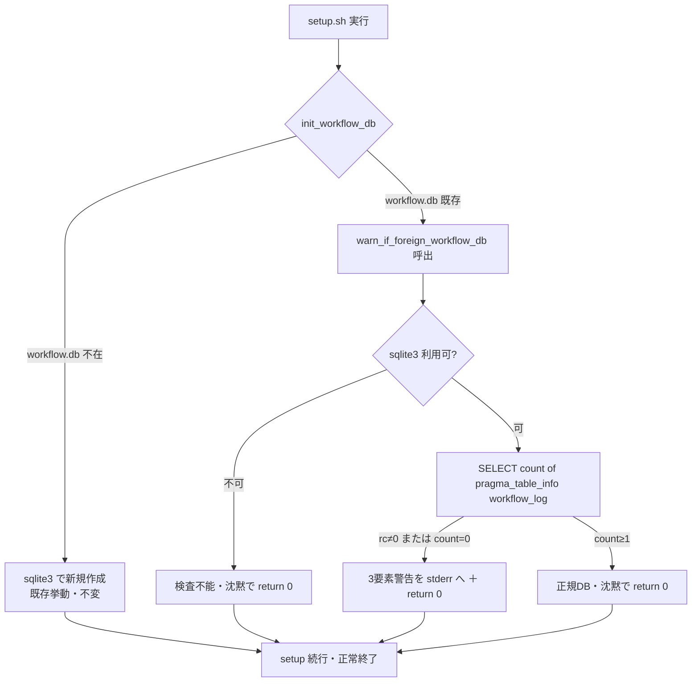
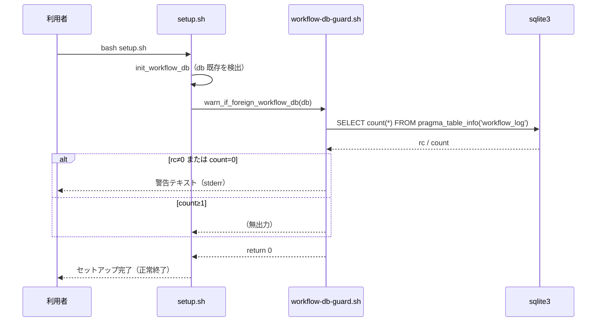
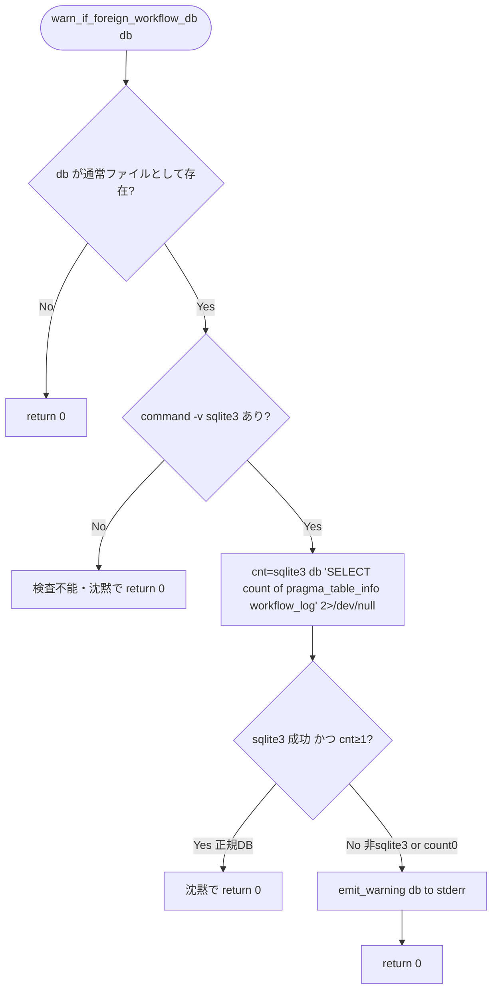

# 設計書: `.agent-skill-chain/runtime/workflow.db` 由来検知欠如の是正（setup 沈黙スキップの解消）

**プロジェクト名**: `.agent-skill-chain/runtime/workflow.db` 由来検知欠如の是正
**作成日**: 2026 年 07 月 11 日
**最終更新**: 2026 年 07 月 11 日

> **重要**: **このドキュメントは常に更新**: 設計の変更や追加があった場合は、即座にこのドキュメントを更新してください。ドキュメントは「生きているドキュメント」として扱い、実装内容と常に同期させます。
>
> **用語**: [.agent-skill-chain/source/CONCEPTS.md §用語規約](../../../../../../../.agent-skill-chain/source/CONCEPTS.md#用語規約) を参照。

---

## 1. 設計概要

**必須**: 設計方針・原則は [.agent-skill-chain/source/spec/01\_設計原則.md](../../../../../../../.agent-skill-chain/source/spec/01_設計原則.md) を**先に参照**した上で、本プロジェクトに**適用するものを選び**記載する。

### 1.1 設計方針

`init_workflow_db`（`setup.sh`）が既存 `workflow.db` をスキップする直前に、当該ファイルが本パッケージ由来の正規スキーマ（有効な sqlite3 ＋ `workflow_log` テーブル保有）かを **1 クエリで軽量検査**し、不一致なら 3 要素（対象パス・推定される問題・確認手順）の警告を標準エラー出力へ表示する。**処理は中止せず既存ファイルも変更しない**（警告のみ）。判定は独立した小さな sourced ライブラリ関数 1 つに閉じ込め、単体テストで隔離検証する。

### 1.2 設計原則（本プロジェクトで適用するもの）

- **UNIX哲学**: 検査は sqlite3 の 1 クエリのみに限定し、「1 つのことをうまくやる」小さな関数として実装する。既存の正常系・呼び出し I/F は一切変えない（組み合わせ可能・後方互換）。
- **単一責務**: 「既存 workflow.db が正規スキーマかを検査し、不一致なら警告する」ことだけを担う関数 `warn_if_foreign_workflow_db` を新設する。`init_workflow_db` は DB 生成の責務、本関数は由来検査の責務に分離する。
- **AIフレンドリー設計**: 小さなファイル（新設 lib は数十行）・意図が分かる命名（`warn_if_foreign_workflow_db`）・既存 `scripts/lib/` の sourced ライブラリ慣習（`package-manifest.sh`・`deploy-skills.sh`）に一致させる。

> CQRS/イベント駆動/明確な境界（UI/API/Domain/Infra）は本改修（シェルスクリプトの局所的な警告追加）には該当しないため適用しない。

---

## 2. アーキテクチャ設計

### 2.1 責務・境界・参照関係

#### 2.1.1 責務一覧

| コンポーネント | 責務（1 文） |
| --- | --- |
| `scripts/lib/workflow-db-guard.sh`（**新設**） | 既存 `workflow.db` が有効な sqlite3 かつ `workflow_log` テーブルを持つかを 1 クエリで検査し、不一致なら 3 要素警告を stderr へ出力する関数 `warn_if_foreign_workflow_db` を提供する（**警告のみ・非中止・非破壊**）。 |
| `scripts/setup.sh` の `init_workflow_db`（**変更**） | 既存ファイルが在ってスキップする直前に上記関数を呼ぶ。DB 新規作成の既存責務は不変。 |
| `scripts/setup.sh` 冒頭のライブラリ読込（**変更**） | 破壊的操作より前に `package-manifest.sh`・`deploy-skills.sh` を source する既存箇所に倣い、`workflow-db-guard.sh` を source する。 |
| `test/test-workflow-db-guard.sh`（**新設**） | 上記関数を `mktemp -d` 隔離下で単体検証する（非 sqlite3・テーブル不在・正規 DB・sqlite3 不在・ファイル不在）。 |

#### 2.1.2 境界

- **入力**: `warn_if_foreign_workflow_db <db_path>`。`<db_path>` は既存の `workflow.db` の実パス（`init_workflow_db` 内で `[[ -f "$db" ]]` が真と確認済みの値）。
- **出力**: 不一致時のみ **標準エラー出力（fd 2）** への警告テキスト。戻り値は**常に 0**（fail-closed を導入しない）。標準出力（fd 1）へは何も出さない（setup の進捗表示と混ざらないよう分離）。
- **他責務との境界**: 本 issue の対象は **`workflow.db` のファイル単位の由来検知（警告のみ）**に限定する。`.agent-skill-chain/` **本体**のルート単位マーカー（`.package-manifest`）・フィンガープリント判定・fail-closed 中止は親 issue ストーリー8 の責務であり、本 issue では**導入しない**（00 §5 除外要件）。`write-workflow-log.sh` への同種検査追加は本 issue のスコープ外とする（`write-workflow-log.sh` は setup より後に実行され、setup 時点で既に警告済みとなるため二重化しない。00 §2.2 が新規機能要件を `init_workflow_db` に限定していることと整合）。

#### 2.1.3 参照関係

- `setup.sh` → `lib/workflow-db-guard.sh`（source して `warn_if_foreign_workflow_db` を呼ぶ）。
- `init_workflow_db`（setup.sh 内）→ `warn_if_foreign_workflow_db`（lib）。
- `test/test-workflow-db-guard.sh` → `lib/workflow-db-guard.sh`（source して関数を直接呼ぶ）。
- 循環参照なし。lib は他モジュールに依存しない（`sqlite3`・`command`・`printf` の標準要素のみ使用）。

### 2.2 システムアーキテクチャ

**必須**: 設計判断は [.agent-skill-chain/source/spec/](../../../../../../../.agent-skill-chain/source/spec/)（[00_spec概要.md](../../../../../../../.agent-skill-chain/source/spec/00_spec概要.md)、[01\_設計原則.md](../../../../../../../.agent-skill-chain/source/spec/01_設計原則.md)、[06\_設計判断の優先順位.md](../../../../../../../.agent-skill-chain/source/spec/06_設計判断の優先順位.md)）を先に参照する。

- **採用パターン**: **sourced シェルライブラリ関数**（既存 `scripts/lib/*.sh` と同型のモジュール分離）。
- **根拠**: [06\_設計判断の優先順位.md](../../../../../../../.agent-skill-chain/source/spec/06_設計判断の優先順位.md) の最上位「可読性」と「単一責務」に従い、検査ロジックを `init_workflow_db` にインライン展開せず独立関数へ切り出す。sourced 関数なら副作用のある `setup.sh` 本体を実行せずに単体テストで隔離呼び出しでき（`package-manifest.sh` と同じ検証容易性）、「実測・独立検証」を満たせる。

#### 2.2.1 CQRS（Command/Query 分離）

該当しない（本改修は状態変更を伴わない読取り検査＋警告出力のみ。Query 側に副作用を持たせない原則には合致する＝`warn_if_foreign_workflow_db` は既存ファイルを変更しない）。

#### 2.2.2 アーキテクチャ図（本プロジェクトの構成で記載）



### 2.3 コンポーネント構成

- **`scripts/lib/workflow-db-guard.sh`（新設・単一責務）**: 関数 `warn_if_foreign_workflow_db` のみを定義する。トップレベルで副作用を持たない（source 安全）。`scripts/lib/` 直下に置き、既存 lib（`package-manifest.sh`・`deploy-skills.sh`）と同じ配備・所有区分（パッケージ正本＝配布物）に含める。
- **`scripts/setup.sh`（変更・最小）**: (a) 冒頭の lib source 群に 1 行追加、(b) `init_workflow_db` のスキップ分岐に関数呼び出し 1 行追加。既存の他ロジックは不変。
- **`test/test-workflow-db-guard.sh`（新設・非配布）**: `test/` 配下（自己テスト・`package.json` の `files` allowlist 外）。既存 test スクリプト（`test-package-manifest-parity.sh` 等）と同じ体裁。`run-all.sh` から呼ばれるよう登録する。

### 2.4 データフロー

本改修はイベントを発行しない（局所的なシェル関数呼び出しのみ）。データフローは 2.2.2 の図に集約される。



### 2.5 横断設計判断（ADR）

#### ADR-1: 由来検知は「file コマンド／マジックバイト解析」ではなく sqlite3 の 1 クエリ（`pragma_table_info('workflow_log')` の件数）で行う

- **コンテキスト**: 「非 sqlite3 ファイル」かつ「sqlite3 だが `workflow_log` を持たないファイル」の両方を、setup 全体の実行時間に影響しない軽量な方法で検知する必要がある（00 §1.3・§3.1）。
- **検討した選択肢**:
  1. `file(1)` コマンドで MIME 判定 →（欠点）`file` 未導入環境あり・sqlite3 だがスキーマ不一致は判定不能・二段構え化。
  2. 先頭 16 バイトの `SQLite format 3\0` マジックバイトを自前で読む →（欠点）「有効 sqlite3 だが `workflow_log` 不在」を別途判定する必要があり二重化。マジック一致でも壊れた DB は救えない。
  3. **sqlite3 で `SELECT count(*) FROM pragma_table_info('workflow_log')` を 1 回実行**する。
- **決定**: 選択肢 3 を採用。
- **根拠（evidence_source: direct_experiment＝2026-07-11 隔離環境で実測）**: 3 ケースを実測し、**1 クエリで全ケースを弁別できる**ことを確認した — 非 sqlite3（`not a database`）: sqlite3 が **exit 26** で失敗（`count` 空）／有効 sqlite3・`workflow_log` 不在: **count=0**／正規 DB: **count≥1**。したがって「rc≠0 または count が空/0 なら不一致（警告）、count≥1 なら正規（沈黙）」で判定できる。`file(1)` への依存も自前バイナリ解析も不要。sqlite3 は `init_workflow_db` の DB 生成に元々必須のため新規依存も生じない。
- **帰結**: 検査は追加 1 クエリのみ（NFR 3.1 を満たす）。テーブルの**有無**のみを見てカラム構成は見ないため、`write-workflow-log.sh` の `ADD COLUMN` マイグレーションで救済されるスキーマ差分を「由来不明」と誤警告しない（00 §7.1 false positive 対策を満たす）。

#### ADR-2: fail-closed（処理中止）を導入せず「警告のみ・return 0」に限定する

- **コンテキスト**: `.agent-skill-chain/` 本体はマーカー不一致時に fail-closed 中止する（setup.sh:47-76）。同水準を `workflow.db` にも及ぼすかを判断する必要がある。
- **検討した選択肢**: (a) 同様に fail-closed 中止／(b) 警告のみで続行。
- **決定**: (b) 警告のみで続行（`return 0`）。
- **根拠（evidence_source: internal_reference＝親 issue `02_設計.md §2.6.7`・実機検証）**: sqlite3 は非 DB ファイルへの**書込みを拒否**するため**サイレントなデータ破壊は生じない**（§2.6.7 実機検証済み）。実害は「setup 後の最初の書記で原因不明エラー」という**顕在化する不便**に留まり、`.agents/` 改称前の「無警告全消去」とは質的に異なる。比例原則（06 優先順位）上、マーカー機構・中止の複雑さは得られる安全性を上回る（00 §5・要求で確定済み）。
- **帰結**: 既存ファイルは変更されず、setup は正常終了コード（0）で完了する（00 §6 成功基準）。

#### ADR-3: `src/agents-md.ts` への同種検査のミラーは行わない

- **コンテキスト**: 00 §2.2・§3.4 は「`src/agents-md.ts` に同種判定ロジックが存在する場合は同じ検査を追加しドリフトを防ぐ」ことを設計フェーズでの要調査事項としていた。
- **検討した選択肢**: (a) TS 側にも検査を実装しミラー／(b) TS 側には追加しない。
- **決定**: (b)。TS 側には追加しない。
- **根拠（evidence_source: direct_code_read＝2026-07-11 `src/agents-md.ts` 実読）**: `agents-md.ts` は **DB 初期化ロジックを自前で持たず** `setup.sh` を `spawn` して委譲する（`install`/`upgrade`）。DB へ触れる箇所は `doctor`/`export` の **read-only 診断**のみで、既に「DB 不在・sqlite3 不在なら `[SKIP]`」「`integrity_check`」「hash チェーン検証」を行う。**初期化スキップ判定は setup.sh の `init_workflow_db` にしか存在しない**ため、ミラーすべき対象が無く、警告の実装点は setup.sh 単一で足りる。ドリフトは構造上発生しない。
- **帰結**: 実装・テストは bash 側（setup.sh＋lib＋単体テスト）に一元化。§3.4 保守性の「単一定義」を満たす（ミラー関係の管理コストが不要）。

---

## 3. 機能設計

### 3.1 機能 1: `warn_if_foreign_workflow_db`（由来検査＋警告）

#### 3.1.1 概要

既存 `workflow.db` が正規スキーマかを検査し、不一致なら 3 要素警告を stderr へ出力する。非中止・非破壊。

#### 3.1.2 処理フロー



#### 3.1.3 入力・出力

- **入力**: 位置引数 `$1` = `workflow.db` の実パス。
- **出力**: 不一致時のみ stderr へ警告（下記 3 要素）。戻り値は常に 0。stdout へは無出力。
- **警告の 3 要素（01 §3.3 必須）**:
  1. **対象ファイルパス**（絶対または `PROJECT_ROOT` 相対の実パス）。
  2. **推定される問題**（「sqlite3 データベースとして開けない、または `workflow_log` テーブルを持たない＝本パッケージ由来でない可能性」）。
  3. **人間が確認すべき手順**（由来不明なら退避／削除のうえ再実行。setup は続行し既存ファイルは変更しない旨。後続の書記で `file is not a database` が出る場合の原因である旨）。

#### 3.1.4 エラーハンドリング

- `sqlite3` 未導入: 検査不能のため沈黙で `return 0`（`write-workflow-log.sh` の `command -v sqlite3` ガード・`agents-md.ts` doctor の `[SKIP]` と一貫）。
- `sqlite3` クエリ失敗（非 DB ファイル）: `2>/dev/null` で握りつぶし、`cnt` 空を「不一致」として扱い警告する。関数は `set -e` 下でも異常終了しない（`|| true` 相当の設計・戻り値 0 保証）。
- パス不在: 何もせず `return 0`（`init_workflow_db` は存在確認後に呼ぶため通常起こらないが防御的に許容）。

### 3.2 機能 2: `init_workflow_db` への組込み（変更・最小）

#### 3.2.1 概要

既存ファイルをスキップする直前に検査関数を呼ぶ。DB 新規作成の既存挙動は不変。

#### 3.2.2 入力・出力

- 変更前:
  ```bash
  if [[ -f "$db" ]]; then
    return 0
  fi
  ```
- 変更後（差分は 1 行追加のみ）:
  ```bash
  if [[ -f "$db" ]]; then
    warn_if_foreign_workflow_db "$db"
    return 0
  fi
  ```
- 併せて setup.sh 冒頭の lib source 群（`package-manifest.sh`・`deploy-skills.sh` を source している箇所）に `. "$SCRIPT_DIR/lib/workflow-db-guard.sh"` を 1 行追加する。

#### 3.2.3 エラーハンドリング

関数は常に 0 を返すため、`init_workflow_db` の戻り値・setup の `set -e` に影響しない（正常系不変）。

---

## 4. データ設計

### 4.1 データモデル

**スキーマ変更なし**。既存の `workflow_log`（正本: [.agent-skill-chain/source/ledger/schema.sql](../../../../../../../.agent-skill-chain/source/ledger/schema.sql)）を検査対象として参照するのみで、新規テーブル・カラム・索引の追加はない。

#### テーブル一覧

| テーブル名 | 説明 | 主キー |
| --- | --- | --- |
| `workflow_log` | 既存の証跡ログテーブル（本 issue では**存在有無のみ**を検査対象とする。変更しない） | `entry_id` |

### 4.2 データ構造

検査で用いるのは `pragma_table_info('workflow_log')` の**行数**（テーブルが存在すれば列定義行が 1 以上返る）のみ。カラムの型・順序・追加列は判定に用いない（マイグレーション救済対象を誤警告しないため。ADR-1 帰結）。

---

## 5. API 設計

本改修は外部公開 API（HTTP エンドポイント等）を持たない。内部シェル関数の契約を以下に定める。

### 5.1 API 一覧

| インターフェース | 種別 | 説明 |
| --- | --- | --- |
| `warn_if_foreign_workflow_db <db_path>` | shell 関数（`lib/workflow-db-guard.sh`） | 既存 workflow.db の由来検査＋警告。非中止・非破壊。 |

### 5.2 API 詳細

#### API1: `warn_if_foreign_workflow_db`

- **エンドポイント**: `scripts/lib/workflow-db-guard.sh` を source 後に呼び出す shell 関数。
- **メソッド**: 位置引数 1 個（`db_path`）。
- **リクエスト**: `warn_if_foreign_workflow_db "/path/to/workflow.db"`。
- **レスポンス**: 戻り値 **常に 0**。不一致時のみ stderr へ 3 要素警告。stdout 無出力。
- **エラー**: 内部の sqlite3 失敗・sqlite3 不在・パス不在はいずれも**関数内で吸収**し、呼び出し元へエラーを伝播しない（fail-closed 非導入）。

---

## 6. テスト戦略

テスト戦略の観点定義は [RULES.md のテスト戦略必須要件](../../../../../../../.agent-skill-chain/source/RULES.md#テスト戦略必須要件)、BDD 形式は [TEST_BDD_FORMAT.md](../../../../../../../.agent-skill-chain/source/TEST_BDD_FORMAT.md) を参照する。

### 6.1 対象ごとのテスト割り当て

| 対象 | 単体 | 結合/API | E2E | クリティカル観点 | バリデーション観点 | 未達理由/補足 |
| --- | --- | --- | --- | --- | --- | --- |
| `warn_if_foreign_workflow_db`（lib） | ○ | × | △ | 非 sqlite3／テーブル不在で警告・正規 DB で沈黙・**常に return 0**・**既存ファイル不変** | 対象パス／推定問題／確認手順の 3 要素が警告文に含まれる | 結合は該当なし（純関数）。E2E は既存 `e2e-install-uninstall.sh` の非回帰（R1〜R3）で担保（△） |
| `init_workflow_db` 組込み（setup.sh） | △ | × | ○ | 既存 DB 保持・新規作成の正常系不変・警告時も exit 0 | sqlite3 不在時のスキップ | 単体は関数分離により lib 側で担保（△）。組込みは E2E で担保 |
| 既存 `e2e-install-uninstall.sh` R1〜R3 | - | - | ○ | 本改修による回帰が無いこと（3.3 互換性） | - | 既存シナリオを変更しない |

- **テスト隔離（必須）**: [.agent-skill-chain/project/自己拡張ワークフロー.md §テストの tmp 隔離](../../../../../../../.agent-skill-chain/project/自己拡張ワークフロー.md) に従い、単体テストは `mktemp -d` で作った一時ディレクトリ内にフィクスチャ DB を生成して検証する。**本番の `.agent-skill-chain/runtime/workflow.db`・`.agent-skill-chain/source/`・`.claude/`・`.cursor/` を一切読み書き・破壊しない**。検証後は一時環境を `rm -rf` で片付ける。

### 6.2 監査・レビューでの確認（証跡）

§6.1 の割当表と 03_実装計画のタスク別テスト観点・BDD が対応していることを確認する。01 の BDD（ユースケース 1・2）と 03 の単体テストケースが 1:1 で対応していることを監査観点とする。

---

## 7. UI 設計

該当なし（CLI スクリプトの stderr 警告のみ。GUI 画面は無い）。

---

## 8. セキュリティ設計

### 8.1 認証・認可

該当なし。

### 8.2 データ保護

- 本改修は**読取り検査（1 クエリ）と警告出力のみ**で、既存ファイルへの書込み・削除・上書きを一切行わない（非破壊）。由来不明ファイルの内容も改変しない。
- fail-closed（処理中止）を新規導入しないため、setup の可用性・完了挙動を劣化させない（ADR-2）。

---

## 9. 非機能要件への対応

### 9.1 パフォーマンス

追加コストは `workflow.db` が既存の場合のみ発生する sqlite3 の 1 クエリ（`pragma_table_info`）。setup 全体の実行時間に有意な影響を与えない（01 §3.1）。

### 9.2 可用性

setup は警告後も正常終了（exit 0）するため、可用性への影響は無い（01 §3.4）。

---

## 10. 参考資料

### プロジェクトドキュメント

- [`01_要件定義.md`](./01_要件定義.md) - 要件定義
- [`00_要求定義.md`](./00_要求定義.md) - 要求定義
- 親 issue `02_設計.md §2.6.7`（一次情報・実機検証・比較表）: [`../../02_設計.md`](../../02_設計.md)

### その他の参考資料

- 現行実装: `.agent-skill-chain/source/scripts/setup.sh`（`init_workflow_db` 196〜207 行目）・`.agent-skill-chain/source/scripts/lib/package-manifest.sh`（sourced lib の先例）
- スキーマ正本: `.agent-skill-chain/source/ledger/schema.sql`

---

## 11. 前のステップ

この設計書は、以下のドキュメントを基に作成されています：

- **前**: [`01_要件定義.md`](./01_要件定義.md) - 要件定義フェーズ

---

## 12. 次のステップ

この設計書の承認後、以下のドキュメントを作成します：

- **次**: [`03_実装計画.md`](./03_実装計画.md) - 実装計画フェーズ
