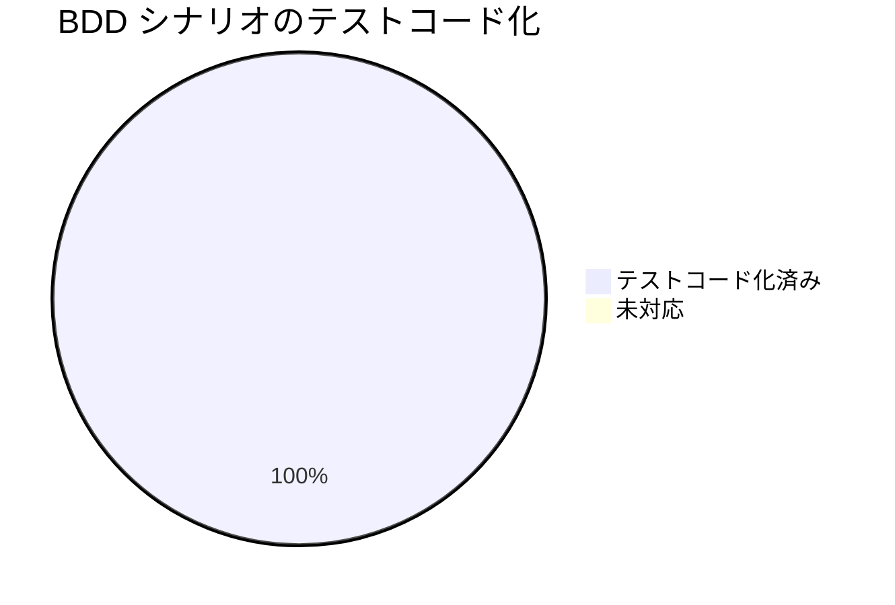

# レビュー書: `.agent-skill-chain/runtime/workflow.db` 由来検知欠如の是正（setup 沈黙スキップの解消）

**プロジェクト名**: `.agent-skill-chain/runtime/workflow.db` 由来検知欠如の是正
**作成日**: 2026 年 07 月 11 日
**最終更新**: 2026 年 07 月 11 日

> **重要**: **このドキュメントは常に更新**: レビューで発見した問題点や改善提案、対応内容などがあった場合は、即座に更新すること。
>
> **用語**: [.agent-skill-chain/source/CONCEPTS.md §用語規約](../../../../../../../.agent-skill-chain/source/CONCEPTS.md#用語規約) を参照。
>
> **レビュー深度**: **standard**（新規 lib 1 ファイル＋既存 setup.sh への 2 行組込み＋新規単体テスト。局所的だが破壊禁止・fail-closed 非導入という契約検証が要点のため quick より一段上に設定）。

---

## 1. レビュー概要

### 1.1 レビュー目的（必須）

実装内容の確認・品質保証・クローズ前最終チェック（verify-and-close）。実装（タスク1〜3）が 00〜03 の要求・要件・設計・実装計画に整合し、AC/SC を満たし、テストが独立再実行で全 PASS することを検証する。

### 1.2 レビュー対象（必須）

- **実装範囲**: `warn_if_foreign_workflow_db`（`scripts/lib/workflow-db-guard.sh` 新設）による `workflow.db` 由来の軽量警告、`setup.sh` `init_workflow_db` への組込み（source 1 行＋呼出 1 行）、単体テスト `test/test-workflow-db-guard.sh` 新設、`test/run-all.sh` への登録。
- **レビュー期間**: 2026-07-11 ～ 2026-07-11
- **レビュー担当者**: verify-and-close ワーカー（監査役・独立検証）

---

## 2. 実装内容の確認

### 2.1 実装完了タスク（または Issue）

| タスク名 | 実装内容 | 実装日 | 担当者 | ステータス |
| --- | --- | --- | --- | --- |
| タスク1 lib＋単体テスト | `workflow-db-guard.sh` 新設（`warn_if_foreign_workflow_db`）＋ `test-workflow-db-guard.sh` 新設（tmp 隔離・6 シナリオ/14 アサーション） | 2026-07-11 | 実装担当 | 完了 |
| タスク2 setup.sh 組込み | `setup.sh` 冒頭に lib source 1 行（:52-53）＋ `init_workflow_db` スキップ分岐に呼出 1 行（:202）を追加 | 2026-07-11 | 実装担当 | 完了 |
| タスク3 登録＋非回帰 | `run-all.sh` に `test-workflow-db-guard` を登録（:64・注記 :29）＋既存 E2E 非回帰確認 | 2026-07-11 | 実装担当 | 完了 |

### 2.2 実装内容の詳細

#### タスク 1: `warn_if_foreign_workflow_db`（`scripts/lib/workflow-db-guard.sh`）

- **実装内容**: 既存 `workflow.db` が有効な sqlite3 ＋ `workflow_log` テーブルを持つかを `SELECT count(*) FROM pragma_table_info('workflow_log')` の 1 クエリで検査し、不一致（sqlite3 で開けない or テーブル不在）なら 3 要素（対象パス・推定される問題・確認手順）の警告を stderr へ出力する。正規 DB は沈黙。**常に return 0**。
- **変更ファイル**: `.agent-skill-chain/source/scripts/lib/workflow-db-guard.sh`（新規・58 行）。
- **実装方法**: `[[ -f "$db" ]]` 防御ガード → `command -v sqlite3` ガード（未導入は沈黙 return 0）→ `2>/dev/null || cnt=""` で sqlite3 失敗を非致命化 → `cnt≥1` なら沈黙、それ以外は 3 要素警告。トップレベルに `set` を置かず source 安全。
- **確認事項**: `set -e` 下でも sqlite3 の非ゼロ終了で呼出元が中断しないこと（後述 4.1・実測で確認済み）。

#### タスク 2: `init_workflow_db` への組込み（`scripts/setup.sh`）

- **実装内容**: 既存ファイル検出時のスキップ分岐（`if [[ -f "$db" ]]; then ... return 0`）の直前に `warn_if_foreign_workflow_db "$db"` を 1 行挿入。DB 新規作成の既存ロジックは不変。
- **変更ファイル**: `.agent-skill-chain/source/scripts/setup.sh`（:52-53 source 追加、:202 呼出追加）。
- **実装方法**: 既存の `package-manifest.sh` の source 慣習に倣い、冒頭ライブラリ読込群に 1 行追加。
- **確認事項**: 既存 DB 保持契約（`SETUP.md §保持・上書き契約`）を破らないこと（読取り検査のみ・非破壊）。

#### タスク 3: テスト登録＋非回帰

- **実装内容**: `run-all.sh` の登録テーブル（:64）とドキュメント注記（:29）へ追加。既存 E2E `e2e-install-uninstall.sh`（R1〜R3 含む全 131 アサーション）が非回帰であることを確認。
- **変更ファイル**: `.agent-skill-chain/source/`（`test/run-all.sh`）。

---

## 3. テスト結果の確認

### 3.1 単体テスト

#### テスト実行結果（独立再実行・必須）

- **実行日**: 2026-07-11（本レビューで監査役が独立再実行）
- **実行環境**: sqlite3 3.45.1 あり／node v20.19.5
- **テストファイル数**: 1（`test/test-workflow-db-guard.sh`）
- **テストケース数（アサーション）**: 14
- **成功**: 14
- **失敗**: 0
- **スキップ**: 0（sqlite3 が存在するため SKIP 分岐は未発動）

実行ログ要約:

```
[test-workflow-db-guard] sqlite3=あり
  [PASS] 非sqlite3: 戻り値が常に0 / 3要素警告 / ファイル不変
  [PASS] テーブル不在: 戻り値0 / 警告出力
  [PASS] 正規DB: 戻り値0 / 沈黙
  [PASS] 旧スキーマ差分: 戻り値0 / 沈黙（false positive 回避）
  [PASS] sqlite3不在: 戻り値0 / 沈黙 / ファイル不変
  [PASS] パス不在: 戻り値0 / 沈黙
PASS=14 FAIL=0（EXIT=0）
```

#### テストカバレッジ（BDD シナリオのテストコード化網羅）



01 の全 BDD ユースケース（UC1・UC2）および 03 の防御ケースが 1:1 でテストコード化されている（詳細は §後述の受け入れ基準の確認）。未対応シナリオ 0 件。

### 3.2 統合テスト

該当なし（`warn_if_foreign_workflow_db` は純関数・外部 I/F を持たない。02 §6.1 の割当と整合）。

### 3.3 E2E テスト（独立再実行）

- **実行**: `bash test/e2e-install-uninstall.sh` を監査役が独立再実行。
- **結果**: `PASS=131 FAIL=0`（EXIT=0）。R1〜R3 を含む既存全シナリオ・N1〜N6 が回帰なし。install 時の正規 `workflow.db` 生成アサーションも成立。
- **追加のセットアップ経路検証（監査役独自）**: クリーン clone（`git archive HEAD`）へ本実装を重ね、隔離 tmp を対象に `setup.sh` を実行する統合スモークを 2 系統実施。
  - **由来不明ファイル配置時**: `exit 0`・3 要素警告を stderr に出力・対象ファイル内容不変（`not a database` のまま）を確認。→ SC1・SC2・非破壊を setup 経路で実測。
  - **正規 DB 再 setup 時**: 1 回目で正規 DB 生成（警告なし）、2 回目（既存正規 DB あり）でも警告 0 件・`exit 0`。→ UC2（false positive 回避）を setup 経路で実測。

---

## 4. コードレビュー

### 4.1 コード品質

#### コードレビュー観点

| 観点 | 確認内容 | 結果 | コメント |
| --- | --- | --- | --- |
| 可読性 | 単一責務の小関数・意図が分かる命名・冒頭コメントで方針（軽量・非中止・非破壊）を明示 | OK | `package-manifest.sh` と同型で一貫 |
| 保守性 | 検査ロジックを lib へ切り出し、setup.sh は 2 行組込みのみ。TS 側ミラー不要（ADR-3 で構造的にドリフト源が無いことを実コード確認） | OK | 単一定義（00 §3.4）を満たす |
| パフォーマンス | 追加コストは既存 DB 時のみの 1 クエリ（`pragma_table_info`）。setup 全体に有意な影響なし | OK | NFR 3.1 を満たす |
| セキュリティ/非破壊 | 読取り検査＋警告のみ。既存ファイルへ書込み・削除・上書きなし | OK | 実測で内容不変を確認 |
| fail-closed 非導入 | 常に return 0。`set -e` 下でも sqlite3 失敗が呼出元を中断しない | OK | 下記で実測 |

#### クリティカル契約の実測確認

- **常に return 0**: 全 6 シナリオ（非 sqlite3・テーブル不在・正規・旧スキーマ・sqlite3 不在・パス不在）で戻り値 0 を単体テストで確認。
- **既存ファイル不変**: 非 sqlite3 ケース・sqlite3 不在ケースでファイル内容が `not a database` のまま不変であることを単体テストおよび setup 統合スモークの両方で確認。
- **`set -e` 下での非中断**: `setup.sh` は先頭（:8）に `set -e` を持つ。由来不明 DB を配置した隔離 setup 実行で、内部 sqlite3 が非 DB ファイルに対し失敗しても setup は `exit 0` で完走（「セットアップ完了」到達）。`2>/dev/null || cnt=""` による非致命化が有効に機能していることを実測。
- **source 安全**: `workflow-db-guard.sh` はトップレベルに `set` 文を持たず（grep 確認）、副作用なく source 可能。

### 4.2 指摘事項

本レビューで新規に修正を要する指摘は **0 件**。

観察（指摘ではない・情報共有）:

- **観察1（test-audit の既存失敗は本 issue と無関係・独立検証済み）**: `test/run-all.sh` 全体実行時に `test-audit.sh` が `PASS=19 FAIL=2` で失敗する。監査役が独立に検証した結果、**クリーン HEAD（commit 4358a0f、本 issue の実装ファイルが一切存在しない状態）を分離 worktree に展開して `test-audit.sh` を実行しても、完全に同一の 2 失敗（「必須ファイル欠落でも exit 0」「必須ファイル未参照メッセージが無い」＝ `audit.sh` の contract/evidence 検査に関する失敗）が再現**した。当該失敗は `audit.sh`（別作業でワーキングツリー上 +64 行 modified・本 issue 非スコープ）に起因する既存事象であり、本 issue の変更対象（`workflow-db-guard.sh`・`setup.sh` `init_workflow_db`・`run-all.sh` 登録・単体テスト）とは別サブシステムである。**実装担当の「本タスクと無関係（stash 退避でも同一失敗が再現）」との判断は妥当**と独立に確認した。→ 本 issue のクローズ判断には影響しない（別途 `audit.sh` 側で追跡すべき事項）。

---

## 5. ドキュメントの確認

### 5.1 ドキュメント更新状況

| ドキュメント | 更新状況 | 確認者 | 確認日 |
| --- | --- | --- | --- |
| [`00_要求定義.md`](./00_要求定義.md) | 更新済み（document_id・issue_id 付与、テンプレ全セクション充足） | 監査役 | 2026-07-11 |
| [`01_要件定義.md`](./01_要件定義.md) | 更新済み（UC1/UC2 の Gherkin あり） | 監査役 | 2026-07-11 |
| [`02_設計.md`](./02_設計.md) | 更新済み（ADR-1〜3・責務境界・テスト戦略） | 監査役 | 2026-07-11 |
| [`03_実装計画.md`](./03_実装計画.md) | 更新済み（タスク1〜3・BDD・テスト観点） | 監査役 | 2026-07-11 |

### 5.2 ドキュメントの整合性

- **実装と設計の整合性**: 整合。ADR-1（1 クエリ判定）・ADR-2（警告のみ return 0）・ADR-3（TS 側ミラーなし）が実装に一致。
- **要件と実装の整合性**: 整合。01 の受け入れ基準 4 項目すべてが実装・テストで満たされている。

---

## docs 更新

- 要否: **不要**
- 対象: なし
- 理由: 本変更は保守者向け内部スクリプト（`setup.sh`/`init_workflow_db`）の軽量警告追加であり、公開挙動・外部 I/F を変更しない。`docs/`（`AI_CI_CD_VISION.md`・`docs/maintainer/`）配下にこの内部初期化挙動を記述したシステム仕様書は存在せず（`grep` で `init_workflow_db`/`由来検知`/`workflow-db-guard` の参照 0 件）、仕様書への影響がないため更新不要と判定する（DOCS_RULES §継続追随ゲートの軽量パス）。

---

## 9. 設計・境界の確認

### 9.1 設計の確認

- **設計原則の準拠**: 準拠。UNIX 哲学（1 クエリ・単一責務の小関数）・単一責務（DB 生成は `init_workflow_db`、由来検査は `warn_if_foreign_workflow_db` に分離）・AI フレンドリー（数十行・明快な命名）を満たす（02 §1.2）。
- **ディレクトリ構成**: 準拠。lib は既存 `scripts/lib/`（`package-manifest.sh`・`deploy-skills.sh`）と同区分（配布物）。テストは `test/`（非配布・`files` allowlist 外）。
- **命名規則**: 準拠。`warn_if_foreign_workflow_db`・`workflow-db-guard.sh` は意図が明確。

### 9.2 境界・依存の確認

- **責務の境界**: 明確。本 issue は「`workflow.db` のファイル単位・警告のみ」に限定し、`.agent-skill-chain/` 本体のルート単位マーカー・fail-closed は導入していない（00 §5 除外要件・ADR-2 と一致）。
- **依存関係**: 循環なし。lib は `sqlite3`・`command`・`printf` の標準要素のみに依存し、他モジュールへ依存しない。`setup.sh → lib`、`test → lib` の一方向。
- **指摘・推奨**: なし。

### 9.3 重要判断の根拠（evidence_source）

| 判断内容 | evidence_source | 備考 |
| --- | --- | --- |
| 単体テスト 14 アサーション全 PASS | test_output | 監査役が `bash test/test-workflow-db-guard.sh` を独立再実行（PASS=14 FAIL=0） |
| E2E 131 アサーション非回帰 | test_output | 監査役が `bash test/e2e-install-uninstall.sh` を独立再実行（PASS=131 FAIL=0） |
| setup 経路で SC1/SC2/非破壊が成立 | observed_runtime | 隔離 tmp（`git archive HEAD`＋実装重ね）で `setup.sh` を実行し exit 0・警告・ファイル不変を実測 |
| `set -e` 下で sqlite3 失敗が setup を中断しない | observed_runtime | setup.sh:8 の `set -e` 下で由来不明 DB 配置時も exit 0 完走を実測 |
| test-audit の 2 失敗は本 issue と無関係 | observed_runtime | クリーン HEAD(4358a0f) を分離 worktree で `test-audit.sh` 実行し同一 2 失敗を再現確認 |
| TS 側ミラー不要（ADR-3） | existing_code | `src/agents-md.ts` は DB 初期化を持たず setup.sh へ委譲・doctor は read-only（設計フェーズで実読済み） |
| git は staged のみ・未 commit | existing_code | `git cat-file -e HEAD:...workflow-db-guard.sh` が「not in HEAD」を返す＝未 commit を確認 |

---

## 10. 課題と改善点

### 10.1 発見された課題

- **課題1（本 issue 非スコープ・別追跡）**: `audit.sh` の contract/evidence 検査に関する既存の 2 失敗（test-audit.sh）。HEAD baseline でも再現する既存事象であり、本 issue のクローズ可否には影響しない。`audit.sh` を触っている別作業の責務範囲で追跡すべき事項。
  - **影響範囲**: `enforcement/ci/audit.sh` の必須ファイル欠落検知。本 issue の成果物には無影響。
  - **対応方法**: メインへ完了報告時に共有（サブによる独断起票は行わない）。

### 10.2 改善提案

- なし（軽量改修として設計・実装ともに過不足なし）。

---

## 受け入れ基準・成功基準の確認（独立再検証）

| 出典 | 基準 | 検証方法 | 結果 |
| --- | --- | --- | --- |
| 01 受け入れ基準1 | スキップ前に sqlite3＋`workflow_log` 有無を検査 | コード確認（lib :42）＋単体シナリオ1〜3b | OK |
| 01 受け入れ基準2 | 不一致時にパス・推定問題・確認手順の 3 要素警告を stderr へ | 単体シナリオ1（`grep` で 3 要素）＋setup 統合スモークの stderr 実測 | OK |
| 01 受け入れ基準3 | 警告後も中止せず exit 0・既存ファイル不変 | 単体（return 0・内容不変）＋setup 統合スモーク（exit 0・不変） | OK |
| 01 受け入れ基準4 | 正規 DB（旧スキーマ差分含む）に false positive 警告なし | 単体シナリオ3・3b＋setup 2 回目実行（警告 0） | OK |
| 00 成功基準1（=SC1） | 由来不明ファイル配置で setup 実行時に警告表示 | setup 統合スモーク（stderr に 3 要素警告） | OK |
| 00 成功基準2（=SC2） | 同条件で exit 0 完了 | setup 統合スモーク（EXIT=0） | OK |
| 00 成功基準3 | 既存 E2E R1〜R3 非回帰 | `e2e-install-uninstall.sh` 独立再実行（131 PASS） | OK |

**BDD シナリオ ↔ テストコードの対応（テストコード化網羅の監査）**:

| 01/03 のシナリオ | 対応テスト（`test-workflow-db-guard.sh`） | 対応 |
| --- | --- | --- |
| 01 UC1: 非 sqlite3 で警告 | シナリオ1（`test_non_sqlite_file_warns`） | ○ |
| 01 UC1: `workflow_log` 不在 sqlite3 で警告 | シナリオ2（`test_sqlite_without_table_warns`） | ○ |
| 01 UC2: 正規 DB で沈黙 | シナリオ3（`test_valid_db_silent`） | ○ |
| 01 UC2: 旧スキーマ差分でも沈黙（false positive 回避） | シナリオ3b（`test_legacy_schema_variant_silent`） | ○ |
| 03 §2.1.3: sqlite3 不在で沈黙 | シナリオ4（`test_sqlite_missing_silent`） | ○ |
| 03 §2.1.3: パス不在で沈黙 | シナリオ5（`test_missing_path_silent`） | ○ |
| 02 §6.1: 03 §2.2.4 setup 経路の UC1 | 監査役の setup 統合スモークで実測（単体テストの範囲外を補完） | ○ |

未対応シナリオ 0 件。テストコードは `ユースケース:`・`シナリオ:` および Given/When/Then のインラインコメントを備え、TEST_BDD_FORMAT に準拠。

---

## 12. レビュー結果

### 12.1 総合評価

- **実装品質**: 良好（単一責務・非破壊・過不足のない軽量実装。設計 ADR と完全整合）。
- **テスト品質**: 良好（BDD シナリオ 100% テストコード化・tmp 隔離・安全ガード `assert_tmp_target` 具備。単体 14/14・E2E 131/131 独立再実行で PASS）。
- **ドキュメント品質**: 良好（00〜03 がテンプレ準拠・document_id 完備・相互参照整合）。
- **総合評価**: **合格（クローズ可）**。本 issue スコープ内の指摘 0 件。test-audit の 2 失敗は HEAD baseline でも再現する本 issue 非スコープの既存事象であり、クローズ判断に影響しない。

### 12.2 承認状況

- **レビュー承認者**: verify-and-close ワーカー（監査役）
- **承認日**: 2026-07-11
- **承認コメント**: AC/SC・BDD 対応・クリティカル契約（常に return 0／非破壊／`set -e` 非中断）をいずれも独立実測で確認。git は staged のみで未 commit（禁止事項遵守）。close 相当と判断してよい。ただしトップレベル親 issue（`20260711_015030_agentsOS汎用化_ポリシー統合`）配下には他サブ issue が未完了で残るため、**本サブ issue 単独完了では close ディレクトリへの移動は行わない**（CORE §完了 issue の close 分離・PHASES §トリガー厳密）。

---

## 13. 参考資料

### 13.1 プロジェクトドキュメント

- [`00_要求定義.md`](./00_要求定義.md) - 要求定義
- [`01_要件定義.md`](./01_要件定義.md) - 要件定義
- [`02_設計.md`](./02_設計.md) - 設計
- [`03_実装計画.md`](./03_実装計画.md) - 実装計画

### 13.2 その他の参考資料

- 実装: `.agent-skill-chain/source/scripts/lib/workflow-db-guard.sh`・`.agent-skill-chain/source/scripts/setup.sh`（`init_workflow_db`）
- テスト: `test/test-workflow-db-guard.sh`・`test/run-all.sh`（:64 登録）・`test/e2e-install-uninstall.sh`（非回帰）

---

## 14. 前のステップ

このレビュー書は、以下のドキュメントを基に作成されています：

- **前**: [`03_実装計画.md`](./03_実装計画.md) - 実装計画フェーズ

---

## 15. 次のステップ

- 外部設定不要のためチェックリスト（05）は不要。本サブ issue はレビュー完了（クローズ可）。
- 親 issue 完了時に、配下サブ issue がすべて完了していることを確認のうえ、トップレベル issue を `docs/maintainer/workflow/close/` へ移動する（本サブ issue 単独では移動しない）。
