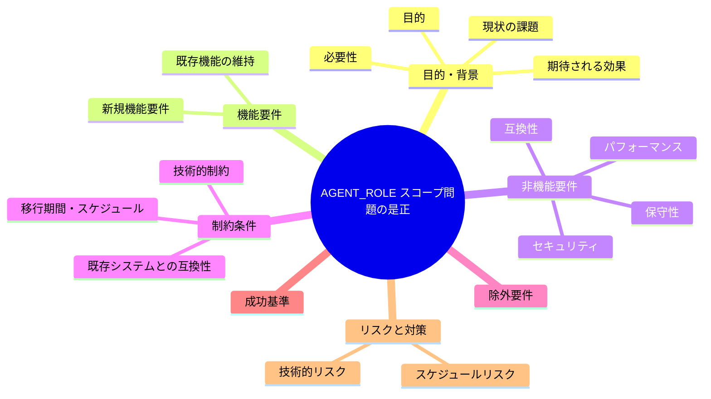
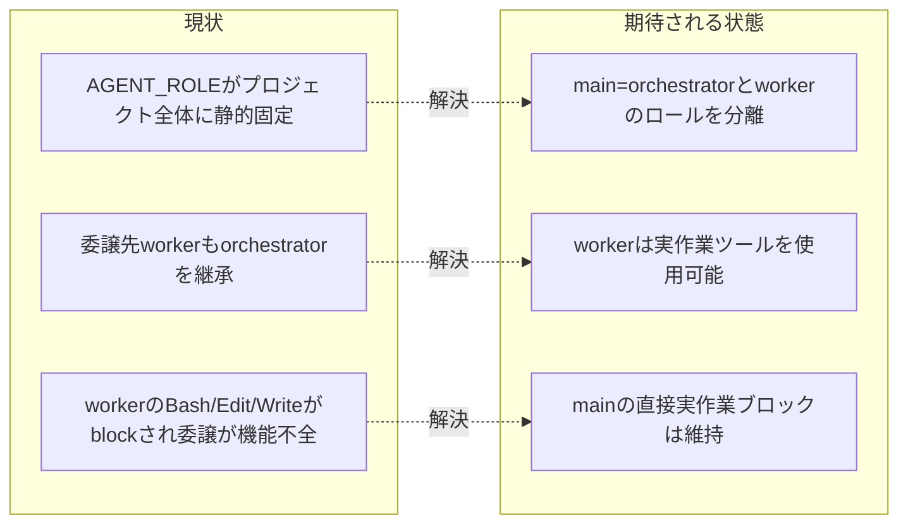

# 要求定義書: `AGENT_ROLE` スコープ問題の是正（enforce on が委譲を機能不全にする欠陥の解消）

**プロジェクト名**: `AGENT_ROLE` スコープ問題の是正
**作成日**: 2026 年 07 月 11 日
**最終更新**: 2026 年 07 月 11 日

> **重要**:
>
> - 要求定義書は、プロジェクトの全体像を把握するためのものです。詳細な技術仕様や実装方法は要件定義書以降で記載します。必要最低限の情報に収めることを心掛けてください。
> - **このドキュメントは常に更新**: 要求の変更や追加があった場合は、即座にこのドキュメントを更新してください。ドキュメントは「生きているドキュメント」として扱い、実装内容と常に同期させます。
> - **必須項目**: 以下の「必須」と明記した項目は空欄・抽象語のみ（例: 「{説明}」のまま）で提出しないこと。判定可能な形（目的は1文・成功基準は○/×で判定できる記載等）で記入すること。
>
> **用語**: [.agent-skill-chain/source/CONCEPTS.md §用語規約](../../../../../../../.agent-skill-chain/source/CONCEPTS.md#用語規約) を参照。

---

## 要求定義の全体像

**注意**:

- マインドマップは全体像を把握するためのものです。主要なセクション名程度に留め、詳細は記載しないでください。

---

## 1. 目的・背景

### 1.1 目的（必須）

enforce on 時に、委譲先サブエージェント（worker）が実作業ツールを使えるようにし委譲を機能させる。

### 1.2 背景

**発端**: 親 issue `docs/maintainer/workflow/20260711_015030_agentsOS汎用化_ポリシー統合/`（ストーリー8: ディレクトリ名前空間衝突安全化）の実装中に行ったドッグフーディングで、`enforce on` 機能（PreToolUse hook による orchestrator 強制）の設計不備が発覚した。応急対応として commit `4358a0f`（「orchestrator allowlist に委譲ツール実名 Agent を追加」）を行ったが、これは委譲**行為そのもの**を許可しただけで、委譲**先**の worker が実作業できない根本問題は未解決であることが判明した。本 issue はこの根本問題（「`AGENT_ROLE` スコープ問題」）を追跡・是正するために起票する。

- **現状の課題**:
  - **`AGENT_ROLE` はプロジェクト全体に静的固定される値である。** 正本テンプレート `.agent-skill-chain/source/platforms/claude/settings.enforce.json` は `env.AGENT_ROLE: "orchestrator"`（4 行目）を定義し、hook 結線コマンド（15 行目）も `AGENT_ROLE="${AGENT_ROLE:-orchestrator}"` と既定 orchestrator にフォールバックする。`enforce on`（`src/agents-md.ts`）はこのテンプレートを `.claude/settings.json` にマージするため、当該プロジェクトで起動する**すべてのエージェント実行**（進行役 main も、委譲されたサブエージェントも）が同一の `AGENT_ROLE=orchestrator` を継承する。
  - **Claude Code のサブエージェントは親（プロジェクト）の `.claude/settings.json`（`env`・`hooks`）を継承する。** 進行役（main、`AGENT_ROLE=orchestrator`）が Agent ツールでサブエージェントに委譲しても、そのサブエージェントは同じ settings.json を継承し、同じく `AGENT_ROLE=orchestrator` として動く。**本ハーネスには、委譲先サブエージェントへ自動的に別ロール（例: worker）を付与する仕組みが現状存在しない**（実装ファイルから読み取れる範囲では、env は静的固定であり、`.scribe-nonce`／`AGENTS_SCRIBE_NONCE` による scribe 昇格を除き、ロールを実行単位で切り替える経路が無い。設計フェーズでハーネスの最新仕様を再調査して確定する）。
  - **結果、worker も PreToolUse hook の orchestrator 制限に引っかかる。** `PreToolUse.sh` は `ROLE=orchestrator` のとき、許可リスト（`Read|Grep|Glob|LS|list_dir|Task|Agent|mcp_task|...`）以外を拒否し、`Bash`（169〜170・185〜187 行目）・`Edit|Write|Delete|StrReplace|Shell` 等（172〜173 行目）を必ず `exit 2`（block）する。本来 Bash/Edit/Write で実作業を行うべき worker が、これらのツールを一切使えず、**委譲されたタスクを完遂できない**（委譲そのものが機能不全に陥る）。
  - **commit `4358a0f` の応急対応だけでは不十分な技術的根拠**: `4358a0f` は orchestrator 許可リストに委譲ツール実名 `Agent` を追加した（`PreToolUse.sh` 166 行目）。これにより解消したのは「進行役 main が Agent ツールを**呼び出す**行為が `*)` 分岐に落ちて拒否され、委譲手段ごと自己ロックアウトする」事象のみである。つまり `4358a0f` は**委譲の「入口」（main が Agent を呼べること）**を通しただけであり、委譲された**先の worker が `AGENT_ROLE=orchestrator` を継承して Bash/Edit/Write を block される**という別レイヤの問題は手つかずである。委譲は「呼べるが、呼んだ先が何もできない」状態のままであり、`enforce on` は依然として委譲フロー全体を機能不全にする。

- **必要性**:
  - CORE.md／run_command.md が定める中核運用（「メインは実作業を行わず、必ずサブへ委譲する」）は、**委譲先 worker が実作業できること**を暗黙の前提としている。`enforce on` がこの前提を破壊すると、規約が要求する委譲フローそのものが実行不能になり、enforcement が「規約を守らせる」どころか「規約の実行を妨げる」逆機能となる。
  - ドッグフーディングで実際にこの逆機能が観測された以上、放置すると `enforce on` を有効化した消費者ランタイムでも同じ委譲不能が再現する。enforcement は opt-in（既定 off）だが、on にした瞬間に委譲が壊れる設計は是正が必要である。
  - CLOSEOUT.md 新設「課題の責任完遂」原則（起票は必要条件だが十分条件ではない）に従い、応急対応（`4358a0f`）で顕在化した根本課題を、放置せず追跡可能な状態にする。

### 1.3 期待される効果（必須: 1 件以上）

- **効果 1**: `enforce on` 状態でも委譲が機能する。進行役 main が Agent ツールで委譲したサブエージェント（worker）が、委譲されたタスクを完遂するために `Bash`／`Edit`／`Write` 等の実作業ツールを使用できる（達成判定: 隔離環境で `enforce on` した状態で、委譲サブエージェントに「ファイルを 1 件作成する」等の実作業タスクを委譲し、当該サブエージェントが `Write` を用いてファイルを作成し完了できることを○/×で確認できる）。
- **効果 2**: 進行役（main）の直接実作業ブロックは維持される。上記の worker 許可が、main（orchestrator）の直接 `Write`／`Edit`／`Bash` を素通しさせる抜け穴（fail-open 化）にならない（達成判定: 同一の `enforce on` 環境で、orchestrator ロールの実行が直接 `Write`／`Edit`／`Bash` を試みると従来どおり `exit 2`（block）されることを確認できる）。

**現状と期待される状態の比較**:

---

## 2. 機能要件

### 2.1 既存機能の維持（該当する場合）

- **orchestrator（main）の直接実作業ブロック（絶対強制・enforcement 失敗条件 #25）を維持する。** `PreToolUse.sh` が orchestrator ロールの `Bash`／`Edit`／`Write`／`Delete`／`StrReplace`／`Shell` を `exit 2` で拒否する挙動は変更しない。
- **enforce on/off の opt-in 機構**（既定 off・`.claude/settings.json` へのマージ・`.bak` 退避・`__agentsMdEnforce` マーカーによる正確な着脱）を変更しない。
- **scribe 昇格機構**（`AGENTS_SCRIBE_NONCE` ／ `.scribe-nonce` による書記のみ `write-workflow-log.sh` 実行許可）を破壊しない。
- 委譲ツール実名 `Agent`／`Task` の両許可（`4358a0f`）を維持する。

### 2.2 新規機能要件

- **委譲先サブエージェント（worker）が orchestrator 制限を受けず実作業ツールを使えるようにする。** 具体的な実現手段（ロール分離の方式）は設計フェーズで確定するが、要求レベルでは以下を満たすこと:
  - 進行役 main（orchestrator）と委譲先 worker を、PreToolUse hook が区別できるようにする。
  - worker と判定された実行では `Bash`／`Edit`／`Write` 等の実作業ツールを許可する。
  - main（orchestrator）と判定された実行では従来どおり実作業ツールを block する。
- **本ハーネス（Claude Code）の制約下での実現可能性を設計フェーズで一次情報から確認する。** サブエージェントへ実行単位で env／ロールを渡せるか、渡せない場合の代替（例: 別経路のロール判定、フォールバックの許容範囲）を、フィジビリティ確認・ADR として記録する（サブ issue「フィジビリティADR必須化」の方針に準拠）。

---

## 3. 非機能要件

### 3.1 パフォーマンス

- PreToolUse hook のロール判定に追加する処理は、既存の入力パース（stdin JSON／env フォールバック）と同水準の軽量な判定に留め、各ツール実行前の待ち時間に有意な影響を与えない。

### 3.2 セキュリティ

- worker 許可の導入が、orchestrator（main）の直接実作業ブロックを迂回する抜け穴（fail-open 化）にならないこと。ロール偽装（手動 export 等）で worker を主張して orchestrator 制限を回避できる余地を最小化する方針を設計フェーズで検討する（scribe の nonce 出所分離＝`PreToolUse.sh` §C-4b と同型の考え方を参照しうる）。
- enforcement の基本方針（判定不能時は案内のみ `exit 0` に倒す fail-open。ただし orchestrator の直接実作業は fail-closed で block）と矛盾させない。

### 3.3 互換性

- 既存の `test/test-pretooluse-hook.sh`（`4358a0f` で追加した Agent/Task 許可ケースを含む）を回帰させない。
- `enforce off` 状態（`.claude/settings.json` に enforcement 配線が無い＝本リポの現状）・ロールが渡らない環境での挙動（案内のみ `exit 0`）を変更しない。
- 消費者ランタイム・自己拡張ランタイムの双方で同一に機能する。

### 3.4 保守性

- ロール判定ロジックは `PreToolUse.sh` に集約し、settings テンプレート（`settings.enforce.json`）・`src/agents-md.ts`（enforce on のマージ処理）とドリフトしない形にする。判定規則を複数箇所に重複実装しない。

---

## 4. 制約条件

### 4.1 技術的制約

- **本ハーネス（Claude Code）には、委譲先サブエージェントへ自動的に別ロールを付与する仕組みが現状存在しない**（親の `.claude/settings.json` の `env`・`hooks` をサブエージェントが継承する）。この制約が設計フェーズ時点で解消されているか（ハーネス側にサブエージェント単位の env／ロール指定機能が追加されているか）を一次情報から再確認し、無い場合は本ハーネスの制約下で成立する代替設計を採ること。
- ロールの正本は `env.AGENT_ROLE`（`PreToolUse.sh` の `ROLE="${AGENT_ROLE:-${CLAUDE_AGENT_ROLE:-unknown}}"`）である。この解決経路を大きく変える場合は、scribe nonce 判定（`AGENTS_SCRIBE_NONCE`／`.scribe-nonce`）との整合を保つこと。

### 4.2 既存システムとの互換性

- `PreToolUse.sh` の既存インターフェース（stdin JSON 契約・`exit 2`/`exit 0` 規約・env 後方互換）を変更しない（判定分岐の追加のみ）。
- `enforce on`/`off`/`status`（`src/agents-md.ts`・`bin/agents-md.js`）の CLI 体系・`__agentsMdEnforce` マーカー運用を変更しない。

### 4.3 移行期間・スケジュール

- 特段の外部期限は無い。ただし `enforce on` を有効化すると委譲が即座に機能不全になる実害があるため、優先度は高（🔴）とする。親 issue ストーリー8 の実装・ドッグフーディング（`enforce on` を用いる）の前提を成立させる意味でも、早期是正が望ましい。

---

## 5. 除外要件

- **本ハーネス（Claude Code）以外のプラットフォーム（Cursor 等）向けの同種対応は本 issue の対象外**とする。本 issue は `.claude/settings.json`＋`PreToolUse.sh` による Claude Code 系の enforce on を対象とする。
- **CI 側（`audit.sh`・subagent-guard）の失敗条件の変更は対象外**とする。本 issue は runtime enforcement（PreToolUse hook）のロールスコープ欠陥に限定する。
- **enforcement の opt-in／既定 off 方針そのものの見直しは対象外**とする（`enforce on` にした場合に委譲が壊れないようにするのが目的であり、on/off の既定を変えるものではない）。
- **`4358a0f` で導入済みの `Agent`／`Task` 許可の再設計は対象外**（維持する）。

---

## 6. 成功基準（必須: 1 件以上）

- 隔離環境（`mktemp -d`＋クリーン clone 相当）で `enforce on` した状態で、進行役 main が Agent ツールで委譲したサブエージェント（worker）が、委譲された実作業タスクを `Bash`／`Edit`／`Write` を用いて完遂できることを○/×で確認できる。
- 同一の `enforce on` 環境で、orchestrator ロールの実行が直接 `Bash`／`Edit`／`Write` を試みた場合は従来どおり `exit 2`（block）されることを確認できる（main の直接実作業ブロックの非劣化）。
- 既存の `test/test-pretooluse-hook.sh`（Agent/Task 許可・Bash/Edit 拒否維持・Grep 許可を含む）が回帰せず全 PASS することを確認できる。
- ロール判定方式・本ハーネス制約下での実現可能性が、一次情報の確認に基づく ADR として設計フェーズの成果物（02_設計）に記録される。

---

## 7. リスクと対策

### 7.1 技術的リスク

- **リスク**: 本ハーネスがサブエージェント単位での env／ロール指定を提供しておらず、`.claude/settings.json` の静的 env のみに依存する場合、「main は orchestrator・worker は非 orchestrator」を hook 側だけで自動判別する確実な手段が無い可能性がある。
  - **対策**: 設計フェーズで Claude Code のサブエージェント起動仕様（env 継承・実行コンテキストの識別材料の有無）を一次情報から再調査し、識別可能な材料（例: 委譲経路特有のシグナル・別 env 経路・プロンプトによるロール宣言と nonce の組合せ等）を洗い出したうえで、実現可能な方式を ADR として確定する。識別材料が無ければ、暫定策（例: enforce on の適用範囲を限定する・案内のみに倒す範囲を明示する）と恒久策（ハーネス機能追加待ち）を分けて記録する。
- **リスク**: worker 許可の導入が orchestrator ブロックの抜け穴（fail-open 化）になり、main が worker を偽装して直接実作業する回避ベクタが生じる。
  - **対策**: ロール昇格の出所を制御する（scribe の nonce 出所分離＝`PreToolUse.sh` §C-4b と同型の設計を検討）。少なくとも「手動 export で素朴に worker を主張しても orchestrator 制限を外せない」ことを設計目標に含める。完全防御が不能な場合は限界を正直に記録し、CI（`audit.sh` #25）の事後検知で補完する。

### 7.2 スケジュールリスク

- **リスク**: 親 issue ストーリー8 の実装／ドッグフーディングが `enforce on` を前提に進むと、本欠陥が未是正のまま委譲不能に突き当たり、ストーリー8 の作業が停滞する。
  - **対策**: 優先度を高（🔴）とし、ストーリー8 のドッグフーディングで `enforce on` を用いる工程の前に本 issue を設計・実装する順序を推奨する。設計・実装は親 issue の進捗と独立に着手可能である。

---

## 8. 参考資料

### プロジェクトドキュメント

- 親 issue: [`../../00_要求定義.md`](../../00_要求定義.md)・[`../../03_実装計画.md`](../../03_実装計画.md)（agentsOS 汎用化・ポリシー統合。ストーリー8 のドッグフーディングが本欠陥の発見源）
- 関連サブ issue: [`../20260711_062125_workflowDB由来検知欠如是正/00_要求定義.md`](../20260711_062125_workflowDB由来検知欠如是正/00_要求定義.md)（同じく親 issue ストーリー8 のドッグフーディング中に発見された派生課題という点で類似）
- 関連サブ issue: [`../20260711_055538_フィジビリティADR必須化/00_要求定義.md`](../20260711_055538_フィジビリティADR必須化/00_要求定義.md)（本 issue の実現可能性確認・ADR 記録の方針が準拠する）

### その他の参考資料

- 応急対応: commit `4358a0f`（enforcement: orchestrator allowlist に委譲ツール実名 Agent を追加）
- [`../../../../../../.agent-skill-chain/source/platforms/claude/settings.enforce.json`](../../../../../../../.agent-skill-chain/source/platforms/claude/settings.enforce.json)（`env.AGENT_ROLE: "orchestrator"`・hook 結線の正本テンプレート）
- [`../../../../../../.agent-skill-chain/source/enforcement/claude/PreToolUse.sh`](../../../../../../../.agent-skill-chain/source/enforcement/claude/PreToolUse.sh)（ロール判定・orchestrator allowlist・R2/R3/R4/R5/R6 の実装）
- [`../../../../../../.agent-skill-chain/source/enforcement/README.md`](../../../../../../../.agent-skill-chain/source/enforcement/README.md)（enforcement の Runtime 条件・失敗条件 #25・物理強制の限界）

---

## 9. 次のステップ

この要求定義書の承認後、以下のドキュメントを作成します：

- **次**: [`01_要件定義.md`](./01_要件定義.md) - 要件定義フェーズ
