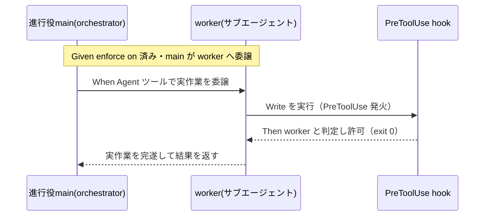

# 要件定義書: `AGENT_ROLE` スコープ問題の是正（enforce on が委譲を機能不全にする欠陥の解消）

**プロジェクト名**: `AGENT_ROLE` スコープ問題の是正
**作成日**: 2026 年 07 月 11 日
**最終更新**: 2026 年 07 月 11 日

> **重要**: **このドキュメントは常に更新**: 要件の変更や追加があった場合は、即座にこのドキュメントを更新してください。ドキュメントは「生きているドキュメント」として扱い、実装内容と常に同期させます。
>
> **用語**: [.agent-skill-chain/source/CONCEPTS.md §用語規約](../../../../../../../.agent-skill-chain/source/CONCEPTS.md#用語規約) を参照。

---

## 1. 概要

### 1.1 システム概要

`enforce on`（opt-in の enforcement 配線）を有効化すると、`.claude/settings.json` の `env.AGENT_ROLE=orchestrator` がプロジェクト全体に静的固定され、進行役 main と委譲先サブエージェント（worker）の**双方**が同一ロールを継承する。その結果、PreToolUse hook が worker の実作業ツール（`Bash`／`Edit`／`Write` 等）まで block し、委譲フローが機能不全に陥る。本要件は、**main（orchestrator）の直接実作業ブロックを維持したまま、委譲先 worker が実作業ツールを使えるようにする**ためのロールスコープ是正を定義する。実現手段（ロール分離の具体方式）は設計フェーズで確定するため、本 01 は「満たすべき振る舞い（受け入れ基準・BDD）」を規定する。

### 1.2 用語集

| 用語 | 説明 |
| ---- | ---- |
| orchestrator（進行役 / main） | 実作業を行わず phase 判定・command 選択・委譲・証跡確認のみを行う主エージェント。`AGENT_ROLE=orchestrator`。 |
| worker | orchestrator から command を委譲され、実作業（`Bash`／`Edit`／`Write` 等）を担うサブエージェント。監査・書記以外の実作業担当。 |
| scribe（書記） | `write-workflow-log.sh` のみを実行して workflow.db に証跡を記録する役割。nonce（`AGENTS_SCRIBE_NONCE`／`.scribe-nonce`）で昇格。 |
| `AGENT_ROLE` | PreToolUse hook がロールを判定する env 変数。`ROLE="${AGENT_ROLE:-${CLAUDE_AGENT_ROLE:-unknown}}"`。 |
| enforce on/off | enforcement フック配線を `.claude/settings.json` に着脱する opt-in 機構（既定 off）。 |
| `AGENT_ROLE` スコープ問題 | `AGENT_ROLE` がプロジェクト全体に静的固定され、委譲先 worker も orchestrator を継承して実作業を block される欠陥。本 issue の対象。 |

---

## 2. 機能要件

### 2.1 ユーザーストーリー

#### ストーリー 1: 委譲先 worker が実作業できる

- **As a** enforce on を有効化して運用する保守者／消費者
- **I want to** 進行役から委譲されたサブエージェント（worker）が `Bash`／`Edit`／`Write` 等の実作業ツールを使えるように
- **So that** enforce on 状態でも委譲フローが機能し、worker が委譲タスクを完遂できる

**受け入れ基準**:

- enforce on 状態で、委譲された worker 実行が `Write`／`Edit`／`Bash` を試みたとき、PreToolUse hook がこれを block せず許可する（`exit 0`）。
- worker はファイル作成・編集・シェル実行を伴う委譲タスクを完遂できる。

#### ストーリー 2: main（orchestrator）の直接実作業ブロックは維持される

- **As a** enforcement を設計・運用する保守者
- **I want to** worker 許可を導入しても進行役 main（orchestrator）の直接実作業ブロックが維持されるように
- **So that** 「メインは実作業を行わず必ず委譲する」という絶対強制（失敗条件 #25）が骨抜きにならない

**受け入れ基準**:

- 同一の enforce on 環境で、orchestrator ロールの実行が直接 `Bash`／`Edit`／`Write`／`Delete`／`StrReplace`／`Shell` を試みると従来どおり `exit 2`（block）される。
- 委譲ツール（`Agent`／`Task`）・読み取り系（`Read`／`Grep`／`Glob`／`LS`）の orchestrator 許可は維持される。

#### ストーリー 3: worker 許可が orchestrator ブロックの抜け穴にならない

- **As a** enforcement のセキュリティを担保する保守者
- **I want to** worker 昇格を素朴な手動 export で偽装できないように
- **So that** main（orchestrator）が worker を騙って直接実作業する回避ベクタを塞げる

**受け入れ基準**:

- 手動で `AGENT_ROLE` 等を書き換えるだけの素朴な偽装で orchestrator 制限を外せないことを設計目標とする（完全防御が不能な場合はその限界を 02 に明記し、CI `audit.sh` #25 の事後検知で補完する方針を記載する）。

#### ストーリー 4: 本ハーネス制約の一次情報確認と ADR 記録

- **As a** 設計判断の妥当性を担保する保守者
- **I want to** Claude Code のサブエージェント起動仕様（env 継承・ロール識別材料の有無）を一次情報で確認し ADR として記録
- **So that** 「ハーネスに機能が無い前提での代替設計」か「ハーネス機能を用いる設計」かの意思決定根拠を後から追跡できる

**受け入れ基準**:

- 02_設計にフィジビリティ確認結果（サブエージェントへ実行単位で env／ロールを渡せるか）と、それに基づくロール分離方式の意思決定が ADR 形式で記録される（サブ issue「フィジビリティADR必須化」の方針に準拠）。

### 2.2 BDD ユースケース

#### ユースケース 1: enforce on 下での委譲実行

enforce on 状態で、進行役 main が worker に実作業を委譲し、worker が実作業ツールを使う一連の流れ。

**シナリオ 1: 委譲先 worker の実作業ツールが許可される**

```gherkin
Feature: enforce on 下で委譲先 worker が実作業できる
  Scenario: worker が Write を実行する
    Given enforce on 済みの隔離環境（.claude/settings.json に enforcement 配線がある）
    And 進行役 main（orchestrator）が Agent ツールでサブエージェント（worker）へ実作業を委譲した
    When 委譲された worker が Write でファイルを作成しようとする
    Then PreToolUse hook はこれを block せず許可する（exit 0）
    And worker はファイルを作成し委譲タスクを完遂できる
```

**処理フロー**:



**シナリオ 2: 進行役 main（orchestrator）の直接実作業は拒否される**

```gherkin
Feature: main(orchestrator) の直接実作業ブロック維持
  Scenario: orchestrator が直接 Edit を実行する
    Given enforce on 済みの同一環境
    When orchestrator ロールの実行が直接 Edit / Write / Bash を試みる
    Then PreToolUse hook は exit 2 で block する
    And 「必ずサブに委譲すること」を案内する
```

**シナリオ 3: 委譲ツール・読み取り系の orchestrator 許可は維持される**

```gherkin
Feature: orchestrator 許可リストの維持
  Scenario: orchestrator が Agent / Read を実行する
    Given enforce on 済みの同一環境
    When orchestrator が Agent（委譲）または Read / Grep / Glob / LS を実行する
    Then PreToolUse hook は許可する（exit 0）
```

#### ユースケース 2: worker 昇格の偽装耐性

worker 許可が orchestrator ブロックの抜け穴にならないことを確認する。

**シナリオ 1: 素朴な手動偽装では orchestrator 制限を外せない**

```gherkin
Feature: worker 昇格の出所制御
  Scenario: 手動 export による素朴な worker 偽装
    Given enforce on 済みの環境で、正規の worker 判定材料（設計フェーズで確定する出所）を持たない実行
    When その実行が worker を主張して直接 Bash / Edit / Write を試みる
    Then PreToolUse hook は worker 昇格を認めず、orchestrator 相当として exit 2 で block する
    # 完全防御が不能な場合の限界は 02_設計 に明記し、CI audit.sh #25 の事後検知で補完する
```

#### ユースケース 3: enforce off・ロール非伝達環境の非劣化

**シナリオ 1: enforce off 状態は影響を受けない**

```gherkin
Feature: enforce off / ロール非伝達環境の非劣化
  Scenario: enforcement 配線が無い環境
    Given .claude/settings.json に enforcement 配線が無い（本リポの現状）またはロールが渡らない環境
    When 任意のツールを実行する
    Then PreToolUse hook は従来どおり案内のみ exit 0 とし、挙動を変えない
```

### 2.3 ビジネスルール

- orchestrator（main）の直接実作業ブロック（絶対強制・失敗条件 #25）は、いかなる是正でも劣化させてはならない。
- ロール判定ロジックは `PreToolUse.sh` に集約し、`settings.enforce.json`・`src/agents-md.ts`（enforce on のマージ）とドリフトさせない。
- 判定不能時の基本方針（案内のみ `exit 0` の fail-open。ただし orchestrator の直接実作業は fail-closed で block）を維持する。
- scribe 昇格機構（`AGENTS_SCRIBE_NONCE`／`.scribe-nonce`）・委譲ツール `Agent`／`Task` 両許可（`4358a0f`）を破壊しない。

---

## 3. 非機能要件

### 3.1 パフォーマンス要件

- ロール判定に追加する処理は、既存の入力パース（stdin JSON／env フォールバック）と同水準の軽量判定に留め、各ツール実行前の待ち時間に有意な影響を与えない。

### 3.2 セキュリティ要件

- worker 許可が orchestrator の直接実作業ブロックを迂回する抜け穴（fail-open 化）にならない。ロール昇格の出所制御（scribe の nonce 出所分離＝`PreToolUse.sh` §C-4b と同型の考え方）を検討し、素朴な手動偽装を最小限遮断する。完全防御が不能な場合は限界を 02 に正直に記録する。

### 3.3 ユーザビリティ要件

- 是正後も `enforce on`/`off`/`status` の CLI 体系・案内メッセージの分かりやすさを損なわない。worker が block された場合／orchestrator が block された場合のメッセージが、原因と次アクション（委譲すべき等）を示す。

### 3.4 可用性要件

- hook 自体の失敗が全ツール停止にならない fail-safe（`set +e`・内部エラーは `exit 0` に倒す）を維持する。

---

## 4. 外部インターフェース要件

### 4.1 API 要件

- `PreToolUse.sh` の外部インターフェース（stdin JSON 契約・`exit 2`/`exit 0` 規約・env 後方互換）を変更しない（内部のロール判定分岐の追加のみ）。
- `enforce on`/`off`/`status`（`src/agents-md.ts`・`bin/agents-md.js`）の CLI 体系・`__agentsMdEnforce` マーカー運用を変更しない。

### 4.2 データ形式要件

- `.claude/settings.json` の `env`／`hooks` 構造（`settings.enforce.json` テンプレート由来）と互換な形でロール分離を実現する。テンプレートを変更する場合は enforce on のマージ処理（`src/agents-md.ts`）と整合させる。

---

## 5. 制約事項

- 本ハーネス（Claude Code）はサブエージェントが親 `.claude/settings.json` の `env`・`hooks` を継承し、**委譲先サブエージェントへ自動的に別ロールを付与する仕組みが現状存在しない**。設計フェーズでこの制約が解消されているかを一次情報から再確認し、無い場合は制約下で成立する代替設計を採る（00 §4.1）。
- ロールの正本は `env.AGENT_ROLE` であり、解決経路を変える場合は scribe nonce 判定との整合を保つ（00 §4.1）。
- 対象は Claude Code 系（`.claude/settings.json`＋`PreToolUse.sh`）に限定する。Cursor 等・CI 側失敗条件・opt-in 既定方針・`Agent`/`Task` 許可の再設計は対象外（00 §5）。

---

## 6. 参考資料

### プロジェクトドキュメント

- [`00_要求定義.md`](./00_要求定義.md) - 要求定義（本 issue）
- 親 issue: [`../../00_要求定義.md`](../../00_要求定義.md)・[`../../03_実装計画.md`](../../03_実装計画.md)（agentsOS 汎用化・ポリシー統合。ストーリー8 のドッグフーディングが本欠陥の発見源）
- 関連サブ issue: [`../20260711_062125_workflowDB由来検知欠如是正/00_要求定義.md`](../20260711_062125_workflowDB由来検知欠如是正/00_要求定義.md)（同じく親 issue ストーリー8 のドッグフーディング中に発見された派生課題）
- 関連サブ issue: [`../20260711_055538_フィジビリティADR必須化/00_要求定義.md`](../20260711_055538_フィジビリティADR必須化/00_要求定義.md)（実現可能性確認・ADR 記録の方針が準拠する）

### その他の参考資料

- 応急対応: commit `4358a0f`（orchestrator allowlist に委譲ツール実名 Agent を追加）
- [`../../../../../../.agent-skill-chain/source/platforms/claude/settings.enforce.json`](../../../../../../../.agent-skill-chain/source/platforms/claude/settings.enforce.json)
- [`../../../../../../.agent-skill-chain/source/enforcement/claude/PreToolUse.sh`](../../../../../../../.agent-skill-chain/source/enforcement/claude/PreToolUse.sh)
- [`../../../../../../.agent-skill-chain/source/enforcement/README.md`](../../../../../../../.agent-skill-chain/source/enforcement/README.md)（Runtime 条件・失敗条件 #25・物理強制の限界）

---

## 7. 前のステップ

この要件定義書は、以下のドキュメントを基に作成されています：

- **前**: [`00_要求定義.md`](./00_要求定義.md) - 要求定義フェーズ

---

## 8. 次のステップ

この要件定義書の承認後、以下のドキュメントを作成します：

- **次**: [`02_設計.md`](./02_設計.md) - 設計フェーズ
