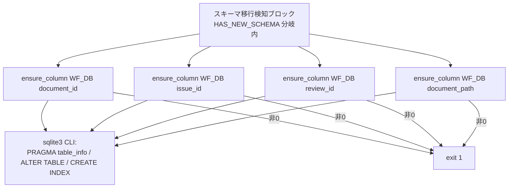
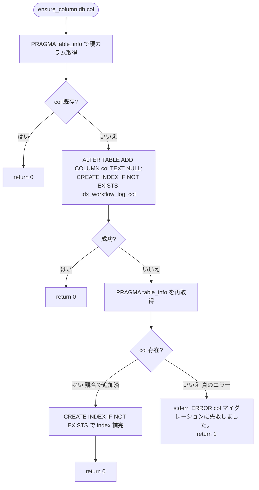

# 設計書: write-workflow-log.sh スキーマ移行 ADD COLUMN の冪等性是正

**プロジェクト名**: write-workflow-log.sh スキーマ移行 ADD COLUMN の冪等性是正（親 issue: agentsOS 汎用化・ポリシー統合 のサブ issue）
**作成日**: 2026 年 07 月 12 日
**最終更新**: 2026 年 07 月 12 日

> **重要**: **このドキュメントは常に更新**: 設計の変更や追加があった場合は、即座にこのドキュメントを更新してください。ドキュメントは「生きているドキュメント」として扱い、実装内容と常に同期させます。
>
> **用語**: [.agent-skill-chain/source/CONCEPTS.md §用語規約](../../../../../../../.agent-skill-chain/source/CONCEPTS.md#用語規約) を参照。

---

## 1. 設計概要

**必須**: 設計方針・原則は [.agent-skill-chain/source/spec/01_設計原則.md](../../../../../../../.agent-skill-chain/source/spec/01_設計原則.md) を先に参照した上で、本プロジェクトに適用するものを選び記載する。

### 1.1 設計方針

`write-workflow-log.sh` のスキーマ移行検知ブロック（現行 298〜312 行目付近）の Check-Then-Act 非アトミック性に起因する `duplicate column name` 失敗を、**「実行してみて、失敗したら状態を再確認して冪等に収束させる（try-then-recheck）」** 方式で解消する。既存の同種箇所（`insert_with_retries`）と同じ「競合は握り込みで吸収する」設計方針をスキーマ移行にも一貫適用し、4 カラム同型のロジックを 1 つのヘルパー関数に共通化して重複を排する。

### 1.2 設計原則（本プロジェクトで適用するもの）

- **UNIX哲学**: `write-workflow-log.sh` は「workflow.db に 1 行記録する」1 つのことをうまくやるスクリプト。本改修も bash＋sqlite3 CLI の範囲に閉じ、新規外部依存を持ち込まない（小さく・シンプルに保つ）。
- **単一責務**: 新設ヘルパー `ensure_column` は「指定カラムを冪等に存在保証する」の 1 責務のみを持つ。カラムごとの分岐・INSERT 本体・CHECK 制約再作成には関与しない。
- **AIフレンドリー設計**: 同型 4 ブロックを 1 関数へ集約し、呼び出しは `ensure_column "$WF_DB" <col>` の 4 行に整理する（意図が読み取りやすい命名・重複削減）。[01_設計原則 §AIフレンドリー設計](../../../../../../../.agent-skill-chain/source/spec/01_設計原則.md#aiフレンドリー設計) を適用。

> **設計判断の優先順位**（[06_設計判断の優先順位.md](../../../../../../../.agent-skill-chain/source/spec/06_設計判断の優先順位.md)）: 本改修は「可読性 > 単一責務 > 仕様との整合性」を優先。エラーメッセージ文字列判定という「実装効率寄り」の手段より、`PRAGMA table_info` 再確認という状態ベースの手段を採り、仕様（移行後スキーマ不変・真のエラーは fail-fast）との整合を優先する。

---

## 2. アーキテクチャ設計

### 2.1 責務・境界・参照関係

#### 2.1.1 責務一覧

| コンポーネント | 責務（1 文） |
| -------------- | ------------ |
| `ensure_column`（新設ヘルパー関数） | workflow_log テーブルに指定カラム（`TEXT NULL`）と対応インデックス `idx_workflow_log_<col>` を、既存・競合いずれの状態でもエラーにせず冪等に存在保証し、真の失敗時のみ非 0 を返す。 |
| スキーマ移行検知ブロック（呼び出し側・現行 298〜312 行目） | 新スキーマ（`entry_id` あり）DB に対し、4 カラム（`document_id`/`issue_id`/`review_id`/`document_path`）を `ensure_column` に順次委譲し、失敗時は従来どおり `exit 1` する。 |
| CHECK 制約再作成ブロック（現行 314 行目以降・**本 issue スコープ外**） | `review-docs` / `create-pr-review-issue` 用の CHECK 制約差分をテーブル再作成で吸収する（本 issue では変更しない）。 |
| `insert_with_retries`（既存・**変更なし**） | INSERT 本体を SQLITE_BUSY/locked 時にリトライ付きで実行する（参照する設計パターンの出所）。 |

#### 2.1.2 境界

- **入力**: `ensure_column <db> <col>`（DB パス・カラム名の 2 引数）。カラム型は全カラム共通で `TEXT NULL` 固定、インデックス名は `idx_workflow_log_<col>` を関数内で導出する。
- **出力**: 戻り値 `0`（カラム＋インデックスが存在する状態に収束＝成功）／`1`（対象カラムが依然存在しない真の失敗。stderr に `ERROR: <col> マイグレーションに失敗しました。`）。標準出力は使用しない（既存スクリプトの stdout は `--print-head` 等の予約）。
- **他責務との境界**: 本 issue の変更対象は 4 カラムの ADD COLUMN 冪等化ブロックのみ。`ledger/schema.sql`（スキーマ正本）・`scribe/CONTRACT.md`・`enforcement/ci/audit.sh`・CHECK 制約再作成ブロック（314 行目以降）・`insert_with_retries` 本体・位置引数/環境変数インターフェースは変更しない（00 §4・§5）。

#### 2.1.3 参照関係

- スキーマ移行検知ブロック（呼び出し元）→ `ensure_column`（呼び出し先）→ `sqlite3` CLI（`PRAGMA table_info` / `ALTER TABLE ADD COLUMN` / `CREATE INDEX IF NOT EXISTS`）。
- `ensure_column` は他のスクリプト関数（`insert_with_retries` / `escape_sql` / `gen_entry_id`）を呼ばず、循環参照を持たない。`insert_with_retries` の設計方針（競合の握り込み）を**参考にするのみ**で、コード上の依存は無い。

### 2.2 システムアーキテクチャ

- **採用パターン**: 手続き的な bash 関数分割（ガード節＋冪等収束）。1 スクリプト内のヘルパー関数抽出であり、新規レイヤー・モジュールは導入しない。
- **根拠**: [06_設計判断の優先順位.md](../../../../../../../.agent-skill-chain/source/spec/06_設計判断の優先順位.md) の「可読性 > 単一責務」と UNIX 哲学（小さく作る）に基づき、同型 4 ブロックを 1 関数へ集約する最小変更を選ぶ。新パターン導入は spec の「単純な同期処理で十分な場合は無理に導入しない」に反するため採らない。

#### 2.2.1 CQRS（Command/Query 分離）

本改修内での限定適用: `ensure_column` は「読み（`PRAGMA table_info`）」と「書き（`ALTER TABLE` / `CREATE INDEX`）」を明示的に段階分離する（Check → Act → Re-Check）。ただしスクリプト全体を CQRS 構造にはしない（過剰適用の回避）。

#### 2.2.2 アーキテクチャ図（本プロジェクトの構成で記載）



### 2.3 コンポーネント構成

- **`ensure_column`**（Infrastructure 層相当・DB スキーマ操作）: 単一責務「指定カラムの冪等存在保証」。関数内部で 3 段階（既存チェック → 追加試行 → 失敗時の再確認）に閉じ、明確な境界を持つ。
- **呼び出し側ブロック**（Application 層相当・移行オーケストレーション）: どのカラムを保証するかの列挙と、失敗時の `exit 1` のみを担う。カラムの型・インデックス命名規則の詳細は `ensure_column` 側に隠蔽する。

### 2.4 データフロー

本改修は「起きた事実」に基づく冪等収束フロー。`ensure_column` は「カラムが既に存在する」という**観測事実**を根拠に成功へ収束する（イベント名相当: `ColumnAlreadyPresent` / `ColumnAdded` / `ColumnStillMissing`）。イベント駆動の本格導入はしない（同期処理で十分）。

```mermaid
sequenceDiagram
    participant M as 移行ブロック
    participant EC as ensure_column
    participant DB as sqlite3(workflow.db)

    M->>EC: ensure_column(db, col)
    EC->>DB: PRAGMA table_info (Check)
    alt col 既存（ColumnAlreadyPresent）
        DB-->>EC: col あり
        EC-->>M: return 0（現行 skip 挙動を維持）
    else col 不足
        EC->>DB: ALTER TABLE ADD COLUMN col; CREATE INDEX IF NOT EXISTS (Act)
        alt 成功（ColumnAdded）
            DB-->>EC: OK
            EC-->>M: return 0
        else 失敗（duplicate 等）
            EC->>DB: PRAGMA table_info 再取得 (Re-Check)
            alt col 存在（競合で他プロセスが追加済み）
                DB-->>EC: col あり
                EC->>DB: CREATE INDEX IF NOT EXISTS（中断された index 作成を補完）
                EC-->>M: return 0
            else col 依然不在（ColumnStillMissing＝真のエラー）
                DB-->>EC: col なし
                EC-->>M: ERROR を stderr 出力し return 1
            end
        end
    end
    M->>M: return 1 のとき exit 1
```

### 2.5 横断設計判断（ADR）

#### ADR-1: `duplicate column name` の冪等化方式 —「文字列判定の握り込み」ではなく「table_info 再確認（try-then-recheck）」を採用

- **コンテキスト**: スキーマ移行ブロックの Check-Then-Act 非アトミック性により、確認後・ALTER 実行前に他プロセスが同一カラムを追加すると `ALTER TABLE ADD COLUMN` が `duplicate column name` で失敗し、`exit 1` で INSERT が丸ごと失敗して証跡が欠落する（00 §1.2）。この失敗を冪等に吸収しつつ、真のエラー（権限・ディスク・破損）は従来どおり fail-fast させる方式を決める必要がある。
- **検討した選択肢**:
  1. **文字列判定で握り込む**: `ALTER` の stderr を `grep -qi "duplicate column"` で判定し、一致時のみ無視する。既存 `insert_with_retries`（273 行目 `grep -qi "locked\|busy"`）と同型。
  2. **table_info 再確認（採用）**: `ALTER` 失敗後に `PRAGMA table_info` を再取得し、対象カラムが存在すれば「競合で他プロセスが追加済み」＝成功とみなす。存在しなければ真のエラーとして `exit 1`。メッセージ文字列に依存しない。
  3. **直列化ロックのみ強化**: 追加の排他ロックで ALTER を直列化し競合自体を消す。
- **決定**: 選択肢 2（table_info 再確認・try-then-recheck）を主機構として採用する。加えて、実行前の既存チェック（fast path）は現行どおり残し、既存カラムには ALTER を試行しない。
- **根拠**:
  - sqlite3 3.45.1 で `ALTER TABLE ... ADD COLUMN <既存カラム>` は `Error: in prepare, duplicate column name: <col>`・**exit code 1** を返すことを実測（evidence_source: **observed_runtime** — `mktemp -d` 隔離 DB での実行確認、2026-07-12）。同実測で ALTER 失敗後の `PRAGMA table_info` 再取得により対象カラムの存在が確認でき、`CREATE INDEX IF NOT EXISTS` が冪等（2 回実行で exit 0）であることも確認済み。
  - 文字列判定（選択肢 1）は 00 §7.1 リスク 1 のとおり sqlite3 バージョン・ロケールでメッセージ文言が変わり判定漏れの恐れがある。table_info 再確認は**状態ベース**でメッセージ非依存のため、この脆弱性を構造的に回避できる（evidence_source: **existing_code** — 00 §7.1 対策方針・01 §7.1）。
  - 選択肢 3 は既に flock（250〜253 行目）で同一ホスト内直列化が効いており（evidence_source: **existing_code** — write-workflow-log.sh:245-253）、追加ロックは重複防御。冪等化は「起きた失敗を収束させる」方が堅牢（flock 不在環境・別ホスト NFS 等でも効く）。
- **帰結**:
  - 4 カラムの ADD COLUMN が `duplicate column name` で失敗しても INSERT まで到達する（00 効果 1・成功基準 1/2）。
  - 対象カラムが再確認でも不在なら従来どおり `exit 1`＋`ERROR: ... マイグレーションに失敗しました。`（成功基準 5・01 ストーリー 2）。
  - メッセージ文言の将来変化に対して回帰耐性を持つ。移行後スキーマ（4 カラム＋同名インデックス）は不変（成功基準 3）。

#### ADR-2: 同型 4 ブロックのヘルパー関数 `ensure_column` への共通化

- **コンテキスト**: 現行の 4 カラム分の ADD COLUMN は同型のコピーで、`document_path`（311 行目）のみ「index 付き ALTER が失敗したら index 無し ALTER を再試行する」という別処理が混入し、しかもその再試行は既存カラム時にやはり `duplicate column name` で `exit 1` になる不完全な握り込みになっている。冪等化ロジックを 4 か所へ個別に埋めると重複と齟齬が増える（00 §3.4）。
- **検討した選択肢**:
  1. 各ブロックに冪等化コードを個別展開（4 重複）。
  2. **`ensure_column <db> <col>` 1 関数へ共通化し、呼び出しを 4 行に整理（採用）**。
- **決定**: 選択肢 2。`document_path` の不整合な既存フォールバック（311 行目）も廃し、4 カラムを同一ロジックに統一する。
- **根拠**: [06_設計判断の優先順位.md](../../../../../../../.agent-skill-chain/source/spec/06_設計判断の優先順位.md)「可読性 > 単一責務」と 00 §3.4 保守性要件「重複コードを増やさない」に整合（evidence_source: **existing_code** — 00 §3.4・現行 302〜311 行目の同型性）。全カラムが `TEXT NULL`・インデックス名が `idx_workflow_log_<col>` 規則で導出可能なため、引数はカラム名のみで足りる（evidence_source: **existing_code** — write-workflow-log.sh:302-311, ledger/schema.sql）。
- **帰結**: スキーマ移行ブロックが 4 行の宣言的委譲に整理され、将来カラム追加時も 1 行追加で済む。`document_path` の特殊フォールバックは消え、4 カラムが同一の冪等収束経路を通る。

---

## 3. 機能設計

### 3.1 機能 1: `ensure_column` による冪等なカラム存在保証

#### 3.1.1 概要

指定カラムを workflow_log テーブルに冪等に存在保証する。既存なら何もしない（現行 skip 挙動維持）。不足なら追加を試み、`duplicate column name` 等で失敗しても再確認で存在を確認できれば成功へ収束する。再確認でも不在なら真のエラーとして非 0 を返す。

#### 3.1.2 処理フロー



#### 3.1.3 入力・出力

- **入力**: `$1`=DB パス（`$WF_DB`）、`$2`=カラム名（`document_id`/`issue_id`/`review_id`/`document_path`）。
- **出力**: 戻り値 0（成功＝カラム存在）／1（真の失敗＝カラム不在のまま）。失敗時のみ stderr に `ERROR: <col> マイグレーションに失敗しました。`。stdout は未使用。副作用: `ALTER TABLE ADD COLUMN`（不足時のみ）・`CREATE INDEX IF NOT EXISTS`。

#### 3.1.4 エラーハンドリング

- 追加試行の sqlite3 呼び出しは `if ... ; then`（条件文）で評価し、`set -euo pipefail` 下でも失敗が即 exit にならないようにする（既存 `insert_with_retries` と同方針）。
- ADD COLUMN 失敗後は `PRAGMA table_info` を**再取得**して判定する（メッセージ文字列に依存しない・ADR-1）。
- 真のエラー時のみ stderr へ ERROR を出し `return 1`。呼び出し側は `ensure_column ... || exit 1` で従来同様に fail-fast する（既存 302〜311 行目の `|| { echo ...; exit 1; }` と等価な挙動）。

### 3.2 呼び出し側の変更（スキーマ移行検知ブロック）

現行 302〜311 行目の 4 つの `if ! grep ...; then sqlite3 ... || { ...; exit 1; } fi` ブロックを、以下の 4 行へ置換する（`HAS_NEW_SCHEMA` 分岐内・現行の CHECK 制約再作成ブロック 314 行目以降より前）。

```bash
ensure_column "$WF_DB" document_id   || exit 1
ensure_column "$WF_DB" issue_id      || exit 1
ensure_column "$WF_DB" review_id     || exit 1
ensure_column "$WF_DB" document_path || exit 1
```

`ensure_column` 関数定義は `insert_with_retries`（261〜281 行目）の直後付近（呼び出しより前）に配置し、記述スタイル・命名（`local` 変数・小文字スネークケース）を既存関数に揃える（00 §3.4）。

---

## 4. データ設計

### 4.1 データモデル

workflow.db の `workflow_log` テーブル。**スキーマ正本は [`ledger/schema.sql`](../../../../../../../.agent-skill-chain/source/ledger/schema.sql) であり本 issue では変更しない**。本改修が触れるのは「旧スキーマ→新スキーマ移行時に不足カラムを補う」処理のみで、移行完了後の最終形は現行と同一に保つ。

#### テーブル一覧

| テーブル名 | 説明 | 主キー |
| ---------- | ---- | ------ |
| workflow_log | 書記が記録する 1 行 = 1 証跡。順序監査のため prev_hash/entry_hash で連結。 | entry_id |

#### 移行対象カラム（本 issue が冪等に存在保証する 4 カラム・型/NULL/インデックスは現行不変）

| カラム名 | 型 | NULL | インデックス | 備考 |
| -------- | -- | ---- | ------------ | ---- |
| document_id | TEXT | YES | idx_workflow_log_document_id | 成果ドキュメント UUID |
| issue_id | TEXT | YES | idx_workflow_log_issue_id | issue 識別子 |
| review_id | TEXT | YES | idx_workflow_log_review_id | レビュー識別子 |
| document_path | TEXT | YES | idx_workflow_log_document_path | 成果物のルート相対パス |

> **注（インデックス定義の既存差異・スコープ外）**: スキーマ正本 `ledger/schema.sql` の `idx_workflow_log_document_path` は**部分インデックス**（`... WHERE document_path IS NOT NULL`、schema.sql:56）だが、移行経路（現行 311 行目および本設計の `ensure_column`）が作成するのは `WHERE` 句なしの**全体インデックス**である。この差異は**現行の移行コードに既存**（本改修が新たに導入するものではない）で、本 issue のスコープ外。本設計の「移行後スキーマ不変」は「**本改修の前後で同一**」（＝現行の全体インデックスを維持）を意味し、schema.sql の部分インデックスと一致することは意味しない（成功基準 3 も「改修前後で同一」）。T-5 の `index_list` 検査はインデックス**名**の一致のみを見るため、部分/全体の定義差は検出しない（名の不変で足りる）。schema.sql とのインデックス定義統一が必要なら別 issue とする。

### 4.2 データ構造

`ensure_column` 内で扱う中間データはカラム名一覧の改行区切り文字列（`sqlite3 -separator $'\t' ... | awk -F '\t' '{print $2}'`）のみ。現行 300 行目の `CURRENT_COLS` 取得手法をそのまま関数内へ内包する。

---

## 5. API 設計

本改修は外部 API（HTTP エンドポイント等）を持たない。内部関数契約のみを定義する。

### 5.1 関数契約一覧

| 関数 | シグネチャ | 説明 |
| ---- | ---------- | ---- |
| `ensure_column` | `ensure_column <db_path> <column_name>` → exit 0/1 | 指定カラム＋インデックスを冪等に存在保証。真の失敗時のみ非 0＋stderr ERROR。 |

### 5.2 関数契約詳細

#### `ensure_column`

- **引数**: `$1` DB パス（既存 `$WF_DB`）、`$2` カラム名（`TEXT NULL` 前提の 4 カラムのいずれか）。
- **事前条件**: `$WF_DB` は新スキーマ（`entry_id` あり）。`HAS_NEW_SCHEMA` 分岐内からのみ呼ぶ。
- **事後条件（成功=0）**: 対象カラムが workflow_log に存在し、`idx_workflow_log_<col>` が存在する。
- **事後条件（失敗=1）**: 対象カラムが不在のまま。stderr に `ERROR: <col> マイグレーションに失敗しました。`。DB は追加副作用なし（真のエラー時）。
- **不変条件**: 既存カラム・既存データ・他カラムに影響を与えない。位置引数/環境変数 IF・SQL 認可（`AGENT_ROLE=scribe`）は変更しない（00 §3.2）。
- **べき等性**: 同一 `(db, col)` に対する複数回・並走呼び出しで、1 回実行時と同じ最終状態（カラム 1 つ＋インデックス 1 つ）に収束する。

---

## 6. テスト戦略

テスト戦略の観点定義は [RULES.md のテスト戦略必須要件](../../../../../../../.agent-skill-chain/source/RULES.md#テスト戦略必須要件) を、BDD 形式の定義は [TEST_BDD_FORMAT.md](../../../../../../../.agent-skill-chain/source/TEST_BDD_FORMAT.md) を参照する。本節では対象ごとのテスト割当のみ記載する。テストは既存 `test/test-write-workflow-log-ts-utc.sh` 等と同じ **`mktemp -d` 隔離・本番 workflow.db 非破壊** の型に従う（`.agent-skill-chain/project/自己拡張ワークフロー.md §テストの tmp 隔離`）。

### 6.1 対象ごとのテスト割り当て

| 対象 | 単体 | 結合/API | E2E | クリティカル観点 | バリデーション観点 | 未達理由/補足 |
| ---- | ---- | -------- | --- | ---------------- | ------------------ | ------------- |
| `ensure_column`（既存カラム時 skip・単一プロセスで決定的） | ○ | × | × | 既存カラムに ALTER を試行せず return 0（現行 skip 挙動維持） | 該当なし | 新規テスト T-1 |
| `ensure_column`（不足カラムの通常追加・単一プロセスで決定的） | ○ | × | × | 対象カラム不足時に ALTER 成功→return 0（recovery 分岐に入らない通常経路）／カラム＋インデックス 1 つずつ | 該当なし | 新規テスト T-2（01 UC2 S2 に対応） |
| 競合 recovery の実行時再現（並列＋flock 無効化） | × | ○ | × | N 並列 × M ラウンドで全 exit 0・duplicate 失敗 0 件・記録件数一致（競合発火時も recovery で吸収） | duplicate column name を recheck で吸収（メッセージ非依存） | 新規テスト T-3（01 UC1 S1/S2・成功基準 1/2 に対応。recovery 分岐は単一プロセスで到達不能のため flock 直列化を無効化した並列でのみ発火。ロジック妥当性はコードレビューでも担保） |
| 真のエラー fail-fast | × | ○ | × | 書込不可 DB で exit≠0・INSERT 未実行・行数不変 | duplicate 以外は握り込まない | 新規テスト T-4（01 UC2 S1・成功基準 5。読み取り専用 DB は移行手前の WAL 段で先に停止＝実測 exit 8 のため、移行ブロック固有 ERROR メッセージ分岐はコードレビューで担保） |
| 正常系初回移行（無回帰） | × | ○ | × | 4 カラム不在の旧→新スキーマから 4 カラム＋インデックス作成・INSERT 成功 | 該当なし | 新規テスト T-5（01 UC2 S2・01 ストーリー 3・成功基準 3 に対応） |
| 移行後スキーマ不変（4 カラム＋インデックス） | × | ○ | × | 改修前後で `PRAGMA table_info`/`PRAGMA index_list` が同一 | 該当なし | 新規テスト T-5 で検証（成功基準 3） |
| 既存テスト無回帰 | × | ○ | × | multidoc/prevhash/glob/ts-utc の 4 既存テストが全通過 | 該当なし | 既存テスト再実行（01 ストーリー 3・成功基準 4） |
| 本番 DB 非破壊 | × | ○ | × | テスト前後で本リポ workflow.db の行数・mtime 不変 | 該当なし | T-6（ts-utc テストの T2-6 と同型） |

### 6.2 監査・レビューでの確認（証跡）

証跡の確認観点は RULES §テスト戦略必須要件および PHASES の監査観点を参照。本設計 §6.1 の割当表と 03_実装計画 §2 のタスク別テスト観点・BDD が対応していること、01 の BDD（UC1 S1/S2・UC2 S1/S2）が 03 のテスト観点（T-1〜T-6）に写像されていることを確認する。

> **recovery 分岐のテスト到達性（重要・ADR-1 に付随）**: `ensure_column` の recovery 分岐（ALTER 失敗→`table_info` 再確認→存在すれば return 0）は、fast-path（開始時の存在チェック）があるため**単一プロセスでは到達不能**である。到達には「fast-path が不足と判定した後、ALTER までの間に別プロセスが同一カラムを追加済み」という**真の並走**が必要で、かつ本スクリプトは同一 `WF_DB` に flock（250〜252 行目）で移行ブロックを**直列化**するため、flock 有効な同一ホスト内では並走しても競合窓が開かない（本 ADR-1 の「flock で直列化・冪等化は flock 不在/別ホスト NFS で効く」に整合）。したがって recovery 分岐の**実行時再現には「並列実行＋flock 無効化」が必須**（T-3）であり、タイミング依存で毎回は発火しないため、**ロジック妥当性はコードレビューでも判定**する（00 §6 成功基準 5 が許容）。真のエラー分岐（recheck でも不在→return 1＋ERROR メッセージ）も、読み取り専用 DB は移行手前の `PRAGMA journal_mode=WAL`（290 行目）で先に停止する（実測 sqlite3 3.45.1: `attempt to write a readonly database`／exit 8）ため、実行時にはメッセージまで到達せず、当該分岐はコードレビューで担保する。

---

## 7. UI 設計

本改修は CLI スクリプトの内部ロジック変更であり、UI・画面は無い（該当なし）。ユーザー向け出力（stderr の ERROR 文言）は既存スタイル `ERROR: <col> マイグレーションに失敗しました。` を維持する（01 §3.3）。

---

## 8. セキュリティ設計

### 8.1 認証・認可

`AGENT_ROLE=scribe` ガード・command 許可リスト検証は変更しない（00 §3.2）。`ensure_column` は認可判定後にのみ到達する移行ブロック内でのみ呼ばれる。

### 8.2 データ保護

SQL 組み立て方法は変更しない。カラム名は関数呼び出し側がリテラルで渡す固定 4 値のみで、外部入力に由来しない（SQL インジェクション面の新規リスクなし）。

---

## 9. 非機能要件への対応

### 9.1 パフォーマンス

正常系（既存カラム）は `PRAGMA table_info` 1 回のみで return 0 し、現行と同等（ALTER 試行なし）。追加コストが生じるのは競合発生時の `PRAGMA table_info` 再取得 1 回のみで、数百 ms 超の体感影響は無い（00 §3.1）。無限リトライは行わない（再確認は 1 回）。

### 9.2 可用性

反復・近接実行下でもスキーマ移行起因の INSERT 失敗＝証跡欠落が構造的に解消される（00 §3.4・成功基準 1/2）。真のエラーは従来どおり fail-fast し、致命的異常の握り潰しを防ぐ（成功基準 5）。

---

## 10. 参考資料

### プロジェクトドキュメント

- [`01_要件定義.md`](./01_要件定義.md) - 要件定義
- [`00_要求定義.md`](./00_要求定義.md) - 要求定義

### その他の参考資料

- [.agent-skill-chain/source/scripts/write-workflow-log.sh](../../../../../../../.agent-skill-chain/source/scripts/write-workflow-log.sh) - 改修対象（スキーマ移行検知ブロック 298〜312 行目・`insert_with_retries` 261〜281 行目）
- [.agent-skill-chain/source/ledger/schema.sql](../../../../../../../.agent-skill-chain/source/ledger/schema.sql) - スキーマ正本（変更なし）
- [.agent-skill-chain/source/EVIDENCE_POLICY.md](../../../../../../../.agent-skill-chain/source/EVIDENCE_POLICY.md) - ADR 形式・evidence_source
- [.agent-skill-chain/source/TEST_BDD_FORMAT.md](../../../../../../../.agent-skill-chain/source/TEST_BDD_FORMAT.md) - BDD 記法
- 検出元: [`../20260711_055602_write-workflow-log_ts_utc検証/04_review.md`](../20260711_055602_write-workflow-log_ts_utc検証/04_review.md) §3.3・§10.1 課題 1
- 型の参照: [test/test-write-workflow-log-ts-utc.sh](../../../../../../../test/test-write-workflow-log-ts-utc.sh) - 隔離・BDD 記法・本番 DB 非破壊の型

---

## 11. 前のステップ

この設計書は、以下のドキュメントを基に作成されています：

- **前**: [`01_要件定義.md`](./01_要件定義.md) - 要件定義フェーズ

---

## 12. 次のステップ

この設計書の承認後、以下のドキュメントを作成します：

- **次**: [`03_実装計画.md`](./03_実装計画.md) - 実装計画フェーズ
- **実装着手前の必須ゲート**: [review-docs](../../../../../../../.agent-skill-chain/source/commands/review-docs.md)（実装前ドキュメントレビュー）を必ず経てから implement-feature に進む。
