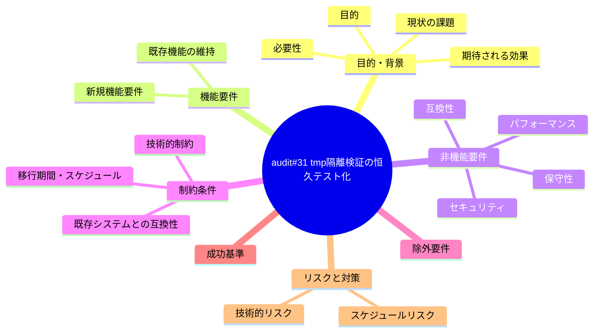
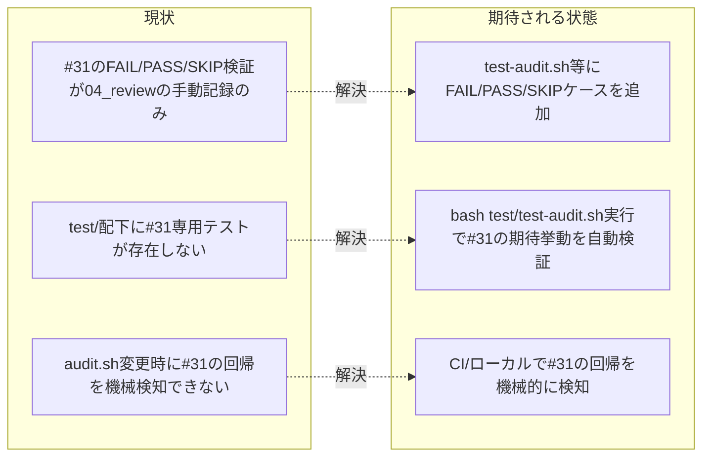

# 要求定義書: audit.sh #31（システム仕様書レビュー証跡欠落検知）の tmp 隔離検証を test/ 配下の恒久回帰テストへ固定化

**プロジェクト名**: audit.sh #31 tmp 隔離検証の恒久テスト化
**作成日**: 2026 年 07 月 12 日
**最終更新**: 2026 年 07 月 12 日

> **重要**:
>
> - 要求定義書は、プロジェクトの全体像を把握するためのものです。詳細な技術仕様や実装方法は要件定義書以降で記載します。必要最低限の情報に収めることを心掛けてください。
> - **このドキュメントは常に更新**: 要求の変更や追加があった場合は、即座にこのドキュメントを更新してください。ドキュメントは「生きているドキュメント」として扱い、実装内容と常に同期させます。
> - **必須項目**: 以下の「必須」と明記した項目は空欄・抽象語のみ（例: 「{説明}」のまま）で提出しないこと。判定可能な形（目的は1文・成功基準は○/×で判定できる記載等）で記入すること。
>
> **用語**: [.agent-skill-chain/source/CONCEPTS.md §用語規約](../../../../../../../.agent-skill-chain/source/CONCEPTS.md#用語規約) を参照。

---

## 要求定義の全体像

**注意**:

- 上記の「プロジェクト名」は例です。実際のプロジェクト名に置き換えてください。
- マインドマップは全体像を把握するためのものです。主要なセクション名程度に留め、詳細は記載しないでください。

---

## 1. 目的・背景

### 1.1 目的（必須）

audit.sh #31 の FAIL/PASS/SKIP 判定を test/ 配下の恒久回帰テストとして自動検証可能にする。

### 1.2 背景

- **現状の課題**:
  - `.agent-skill-chain/source/enforcement/ci/audit.sh` の監査項目 #31（`check_docs_review_evidence`。システム仕様書レビュー証跡欠落検知。DOCS_RULES.md §継続追随ゲート関連）について、隣接サブ issue「システム仕様書完備強制テンプレート刷新」の `04_review.md`（§3.2「統合テスト（audit.sh #31 の独立再現・tmp 隔離）」行104-118、および §10.2「改善提案」行221-224・§12.1「テスト品質」行250）にて、`mktemp -d` 上のフィクスチャで FAIL/PASS/SKIP の 7 ケース（A〜G）を**手動で**独立再現し全ケース期待一致を確認したが、この検証は当該 verify-and-close の実施記録（04_review.md 本文）にのみ残っており、`test/` 配下に恒久的な回帰テストとして固定化されていない。
  - 実際に `test/` 配下を確認すると、`test-audit.sh` に #31 専用のテストケースは存在しない（既存 `test-audit.sh` は #8/#9/#11/#12–#21/#29/#17 等をカバーするが #31 は未カバー）。
  - このため、将来 `audit.sh` の `check_docs_review_evidence()` に手が入った際（例: #5 との非交差判定ロジックの変更、SKIP ガード条件の変更等）、CI で自動的にリグレッションを検知できず、手動 tmp 隔離検証を都度再実施しない限り破壊に気づけない。
- **必要性**:
  - `check_docs_review_evidence()` は「## docs 更新」セクションの**内容**（要=`docs/00_review/` への実タイムスタンプ参照 / 不要=プレースホルダでない理由）を判定する複雑な条件分岐（SKIP ガード 5 種 + FAIL/PASS の内容判定）を持ち、既存 #5（記載の**有無**のみ検査）との非交差性が設計上の重要な不変条件（02_設計 ADR 相当）である。この非交差性・SKIP ガードの安全側動作を継続的に保証する必要がある。
  - 本リポジトリの他の監査項目（#17・#18/#19/#25/#27/#28 等）は既に `test-audit.sh` 内で tmp 隔離ケースとして固定化されており（例: `test-audit.sh` シナリオ4 の #17 close ガード検証）、#31 のみが未固定化のまま取り残されている状態は一貫性を欠く。

### 1.3 期待される効果（必須: 1 件以上）

- **効果 1**: `bash test/test-audit.sh` の実行により、#31 の FAIL/PASS/SKIP 判定が壊れていないことが自動的に検証できるようになる（CI・ローカル双方で回帰を機械的に検知可能）。
- **効果 2**: #31 と既存 #5 の非交差性（04_review.md §3.2 ケース A で手動確認済みの「#5 は PASS だが #31 は FAIL」という区別）が、恒久テストとして固定され、将来の変更で意図せず崩れた場合に検知できる。

**現状と期待される状態の比較**（必要に応じて）:

---

## 2. 機能要件

### 2.1 既存機能の維持（該当する場合）

- `audit.sh` の判定ロジック（`check_docs_review_evidence()` の FAIL/PASS/SKIP 条件）自体は変更しない。本 issue はテストの追加のみを対象とし、判定ロジックの改修は含まない。
- 既存 `test-audit.sh` の既存シナリオ（T1〜T4 等）・既存テストファイル群（`test-c4-bypass-resistance.sh` 等）の挙動・回帰状態は変更しない。

### 2.2 新規機能要件

- 隣接 04_review.md §3.2 で手動検証済みの 7 ケース（A: docs/採用・implementログあり・要否プレースホルダ→FAIL、B: 要否=要+実タイムスタンプ参照→PASS、C: 要否=不要+実質的根拠→PASS、D: docs/未採用→SKIP、E: implement/verifyログ0件→SKIP、F: workflow.db不在→SKIP、G: 04がtemplates/配下→SKIP）を、`mktemp -d` 隔離環境上で自動的に再現・判定するテストケースを `test/` 配下（`test-audit.sh` への追加、または新規 `test-audit-31-docs-review-evidence.sh` 等の追加ファイルのいずれか。手段の選定は要件定義・設計フェーズで判断）として実装する。
- 既存 #5（`## docs 更新` と `- 要否:` の記載の**有無**のみ検査）との非交差性を検証するケース（04_review.md ケース A 相当: 固定キーは存在するが #31 は内容不備で FAIL、#5 は有無のみなので PASS）をテストに含める。

---

## 3. 非機能要件

### 3.1 パフォーマンス

- 特段の要件なし。既存 `test-audit.sh` と同水準の実行時間（数秒〜十数秒オーダー）に収まること。

### 3.2 セキュリティ

- 特段の要件なし。

### 3.3 互換性

- 既存 `test-audit.sh` の既存シナリオ・`test/run-all.sh` からの呼び出し経路と互換であること（既存テストランナーに組み込める形にする）。

### 3.4 保守性

- 隔離環境の構築・後片付けは `test-audit.sh` 既存の `make_min_tree` / `TMP_DIRS` / `trap cleanup EXIT` パターンに準拠し、独自の隔離方式を新規に導入しない（一貫性維持）。
- テストの記述は `.agent-skill-chain/source/TEST_BDD_FORMAT.md` に従い `# シナリオ:` `# Given:` `# When:` `# Then:` を明記する（既存 `test-audit.sh` の記法との統一）。

---

## 4. 制約条件

### 4.1 技術的制約

- 本番の `.agent-skill-chain/source/` `.claude/` `.cursor/` `.agent-skill-chain/runtime/` `workflow.db` を変更・破壊しないこと（`.agent-skill-chain/project/自己拡張ワークフロー.md §テストの tmp 隔離（必須）`）。検証は `mktemp -d` による隔離環境で行う。
- `audit.sh` の `check_docs_review_evidence()` の判定ロジック自体（FAIL/PASS/SKIP の条件式）は変更しない。本 issue はテスト追加のみが対象であり、判定ロジックの改修・不具合修正は別スコープとする。
- sqlite3 コマンドが実行環境に存在しない場合、`check_docs_review_evidence()` 自体が SKIP（return 0）する設計であるため、新規テストも sqlite3 有無を判定し、無い場合は既存 `test-audit.sh` シナリオ4 と同様にテストをスキップ扱いにする（誤 FAIL を出さない安全側）。

### 4.2 既存システムとの互換性

- `test/run-all.sh`（存在する場合）からの一括実行に組み込めること。既存テストの実行結果（PASS/FAIL 件数）の集計形式を壊さないこと。

### 4.3 移行期間・スケジュール

- 特段の移行期間は不要（新規テストの追加のみ）。

---

## 5. 除外要件

- `check_docs_review_evidence()` の判定ロジック自体の変更・改修（不具合修正・仕様変更）は対象外。
- #31 以外の監査項目（#5・#17・#29・#32 等）の恒久テスト網羅性向上は対象外（既存でカバー済みのものはそのまま）。
- `DOCS_RULES.md` §継続追随ゲートの規約本文の変更は対象外。

---

## 6. 成功基準（必須: 1 件以上）

- **SC-1**: `test/` 配下（既存 `test-audit.sh` への追加、または新規テストファイル）に、04_review.md §3.2 の 7 ケース（A〜G）に対応する FAIL/PASS/SKIP 判定を検証するテストケースが存在し、`bash test/test-audit.sh`（または該当する新規テストファイル）を実行して全ケースが期待どおりの結果（FAIL 発火/非発火・PASS/SKIP）を返すこと。
- **SC-2**: 追加したテストが `mktemp -d` による隔離環境で実行され、本番の `.agent-skill-chain/source/` `.claude/` `.cursor/` `.agent-skill-chain/runtime/` `workflow.db` を変更・破壊しないこと（実行前後で `git status` に差分が出ないことで確認可能）。
- **SC-3**: #31 と既存 #5 の非交差性（固定キーが存在しても #31 が内容不備で FAIL しうるケース＝04_review.md ケース A 相当）を検証するテストケースが含まれること。
- **SC-4**: 既存 `test-audit.sh` の既存シナリオ（T1〜T4 等）が本 issue の変更後も全て PASS すること（既存回帰なし）。

---

## 7. リスクと対策

### 7.1 技術的リスク

- **リスク**: sqlite3 が実行環境に無い場合、テストの実行自体が意味をなさない（`check_docs_review_evidence()` が SKIP するため FAIL 判定を再現できない）。
  - **対策**: 既存 `test-audit.sh` シナリオ4（`command -v sqlite3` によるガード）と同様のパターンを踏襲し、sqlite3 不在時は当該テストをスキップまたは PASS 扱いにする（誤 FAIL を出さない）。

### 7.2 スケジュールリスク

- **リスク**: 04_review.md §3.2 の 7 ケースを機械的なテストコードへ翻訳する際、手動検証時のフィクスチャ構築手順（docs/ ディレクトリ・workflow.db・04_review.md の内容）の再現粒度を誤ると、意図しない SKIP や誤 FAIL が発生しうる。
  - **対策**: 実装フェーズで `check_docs_review_evidence()` の実装（`.agent-skill-chain/source/enforcement/ci/audit.sh` 行842-899）を精読し、各 SKIP ガード条件（sqlite3/DB不在・docs/未採用・WORKFLOW_SCAN_DIRS空・templates/close配下除外・implement/verifyログ0件）を 1 対 1 でフィクスチャに反映する。

---

## 8. 参考資料

### プロジェクトドキュメント

- 親 issue: [`00_要求定義.md`](../../00_要求定義.md)・[`90_issues.md`](../../90_issues.md)
- 検出元（隣接サブ issue）: [`../20260711_061341_システム仕様書完備強制テンプレート刷新/04_review.md`](../20260711_061341_システム仕様書完備強制テンプレート刷新/04_review.md) §3.2（行104-118）・§10.2 改善1（行221-224）・§12.1（行250）

### その他の参考資料

- 実装対象: `.agent-skill-chain/source/enforcement/ci/audit.sh` の `check_docs_review_evidence()`（行842-899、`#31`）
- 既存テストパターンの参照元: `test/test-audit.sh`（`make_min_tree`・`TMP_DIRS`・`trap cleanup EXIT` の隔離パターン、シナリオ4 の #17 close ガード検証パターン）

---

## 9. 次のステップ

この要求定義書の承認後、以下のドキュメントを作成します：

- **次**: [`01_要件定義.md`](./01_要件定義.md) - 要件定義フェーズ
