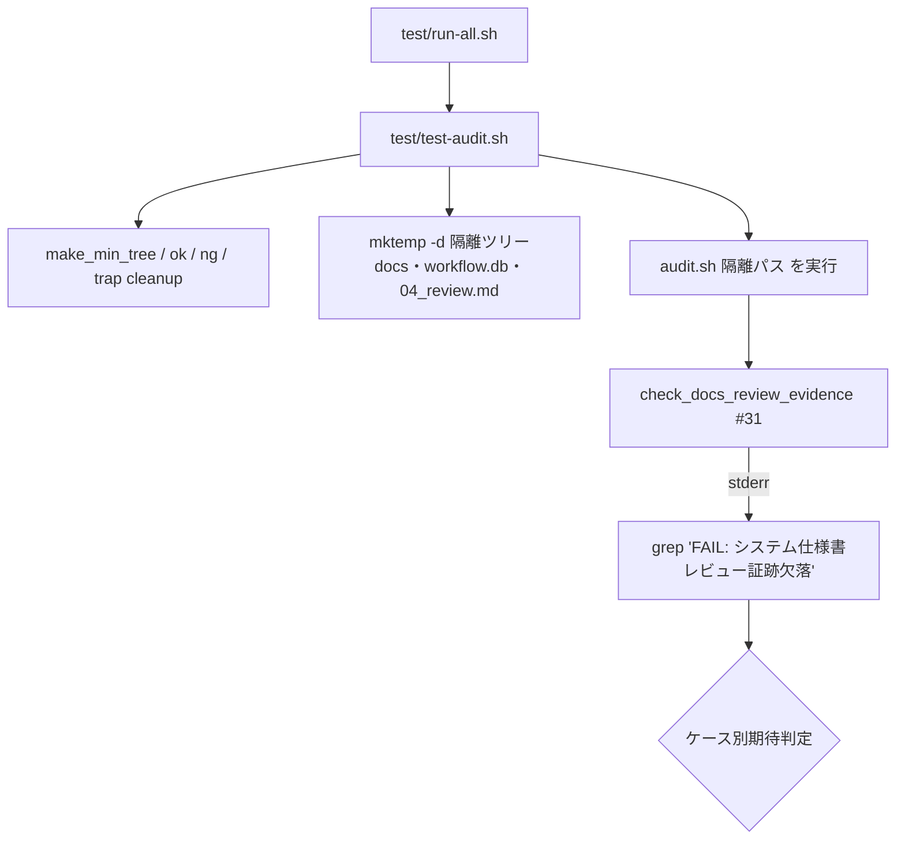
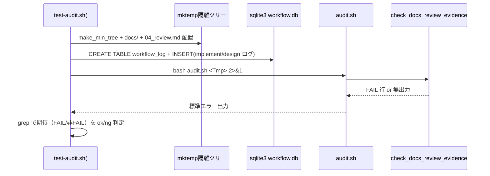

# 設計書: audit.sh #31（システム仕様書レビュー証跡欠落検知）の tmp 隔離検証を test/ 配下の恒久回帰テストへ固定化

**プロジェクト名**: audit.sh #31 tmp 隔離検証の恒久テスト化
**作成日**: 2026 年 07 月 12 日
**最終更新**: 2026 年 07 月 12 日

> **重要**: **このドキュメントは常に更新**: 設計の変更や追加があった場合は、即座にこのドキュメントを更新してください。ドキュメントは「生きているドキュメント」として扱い、実装内容と常に同期させます。
>
> **用語**: [.agent-skill-chain/source/CONCEPTS.md §用語規約](../../../../../../../.agent-skill-chain/source/CONCEPTS.md#用語規約) を参照。

---

## 1. 設計概要

**必須**: 設計方針・原則は [.agent-skill-chain/source/spec/01\_設計原則.md](../../../../../../../.agent-skill-chain/source/spec/01_設計原則.md) を参照した上で、本プロジェクトに適用するものを選び記載する。

### 1.1 設計方針

`audit.sh` の判定ロジック（`check_docs_review_evidence()`・行842-899）を**一切変更せず**、既存 `test/test-audit.sh` の隔離パターン（`make_min_tree` ＋ `mktemp -d` ＋ `TMP_DIRS`/`trap cleanup EXIT`）を踏襲して、隣接 04_review.md §3.2 で手動確認済みの 7 ケース（A: FAIL、B/C: PASS、D/E/F/G: SKIP）＋ #5 非交差 1 ケースを、`audit.sh <隔離パス>` を実行して出力を grep する**振る舞い検証（黒箱）テスト**として恒久化する。

### 1.2 設計原則（本プロジェクトで適用するもの）

- **単一責務**: 本 issue はテスト追加のみに責務を限定する。`audit.sh` 本体・`check_docs_review_evidence()` の判定ロジックは変更対象外（要求 §5 除外要件・要件 §5 制約）。
- **明確な境界**: テストは本番リポジトリを読み取り専用で参照する `audit.sh` のみを実行対象とし、フィクスチャは `mktemp -d` 隔離ツリー内に閉じる（`.agent-skill-chain/project/自己拡張ワークフロー.md §テストの tmp 隔離（必須）`）。
- **AIフレンドリー設計**: 既存 `test-audit.sh` の記法（`# シナリオ:`/`# Given:`/`# When:`/`# Then:`・`ok`/`ng` ヘルパ・ケースラベル）に統一し、失敗時にどのケース（A〜G）が壊れたか一目で分かる可読性を保つ（[01\_設計原則 §AIフレンドリー設計](../../../../../../../.agent-skill-chain/source/spec/01_設計原則.md#aiフレンドリー設計)）。
- **UNIX哲学**: 新規隔離方式を導入せず、既存の小さなヘルパ（`make_min_tree`）と `sqlite3`・`grep` の組み合わせで 1 つのこと（#31 の回帰検知）を担う。

---

## 2. アーキテクチャ設計

### 2.1 責務・境界・参照関係

#### 2.1.1 責務一覧

| コンポーネント | 責務（1 文） |
| -------------- | ------------ |
| `test/test-audit.sh`（#31 追加セクション） | #31 の 7 ケース（A〜G）＋ #5 非交差ケースを `mktemp -d` 隔離ツリー上で再現し、`audit.sh <隔離パス>` の標準エラー出力を grep して FAIL/非FAIL（PASS/SKIP）を判定する。 |
| `make_min_tree`（既存・再利用） | 必須ファイル（CORE.md 等）を含む最小 issue ツリーを `mktemp -d` で作り `TMP_DIRS` に登録する。#31 テストはこれを基点に `docs/`・`workflow.db`・`04_review.md` を追加する。 |
| `ok`/`ng`/`TMP_DIRS`/`trap cleanup EXIT`（既存・再利用） | PASS/FAIL 集計と隔離ツリーの後片付け。#31 テストも同一ヘルパを使い集計形式を壊さない。 |
| `check_docs_review_evidence()`（検証対象・変更不可） | 本テストが振る舞いを固定する対象。テストからは `audit.sh` 実行を通じてのみ間接的に呼ぶ（直接抽出しない）。 |

#### 2.1.2 境界

- **入力**: `mktemp -d` 隔離ツリー内に構築するフィクスチャ（`docs/` ディレクトリ、`workflow_log` テーブルを持つ `workflow.db`、`04_review.md`、workflow_log 行）。
- **出力**: `ok`/`ng` による `[PASS]`/`[FAIL]` ラベルの標準出力と、末尾の `PASS=n FAIL=m` 集計・終了コード（既存 `test-audit.sh` と同一）。
- **他責務との境界**: `check_docs_review_evidence()` の判定条件式の修正・不具合修正は本 issue の**範囲外**（要求 §5・要件 §5）。#5・#29・#32 等ほかの監査項目の網羅性向上も範囲外。本テストは #31 の FAIL/非FAIL の**振る舞い固定**のみを担う。

#### 2.1.3 参照関係

- `test/test-audit.sh`（#31 セクション）→ `make_min_tree`/`ok`/`ng`（同ファイル内既存ヘルパ）。
- `test/test-audit.sh` → `.agent-skill-chain/source/enforcement/ci/audit.sh`（`$AUDIT`・読み取り専用の外部プロセス実行）。
- `test/test-audit.sh` → `sqlite3`（`workflow.db` フィクスチャ構築。不在時はガードして SKIP）。
- `test/run-all.sh` → `test/test-audit.sh`（既存の一括実行経路。追加セクションは同ファイル内のため新規結線は不要）。
- 循環参照なし。

### 2.2 システムアーキテクチャ

**必須**: 設計判断は [.agent-skill-chain/source/spec/](../../../../../../../.agent-skill-chain/source/spec/)（[00_spec概要.md](../../../../../../../.agent-skill-chain/source/spec/00_spec概要.md)、[01\_設計原則.md](../../../../../../../.agent-skill-chain/source/spec/01_設計原則.md)、[06\_設計判断の優先順位.md](../../../../../../../.agent-skill-chain/source/spec/06_設計判断の優先順位.md)）を参照した。

- **採用パターン**: 既存シェルテストへの**振る舞い（黒箱）回帰テスト追加**。フィクスチャ駆動（Arrange-Act-Assert）で `audit.sh` を外部実行し出力を検査する。
- **根拠**: `audit.sh` は判定ロジックを内部関数に持つ単一スクリプトであり、`spec/06 設計判断の優先順位`（既存資産・一貫性の尊重）に従い、既存 `test-audit.sh` の #32 セクションと同型の黒箱テストを採る。関数を単独抽出せずスクリプト全体を実行することで、SKIP ガードの前提（`WORKFLOW_SCAN_DIRS` 解決・`docs/` 存在判定・`WF_DB` 解決）まで含めた end-to-end の振る舞いを固定できる。

#### 2.2.2 アーキテクチャ図



### 2.3 コンポーネント構成

- **配置**: 既存 `test/test-audit.sh` の末尾付近（`#32` セクションの前後）に `== #31 システム仕様書レビュー証跡欠落検知 ==` セクションを新設する（ADR-1）。新規ファイルは作らない。
- **単一責務**: 各ケース（A〜G・非交差）は独立した `make_min_tree` 由来の隔離ツリーで検証し、ツリー間の状態共有を持たない（既存 #32 の `S32_1_TREE`〜`S32_7_TREE` と同型）。
- **明確な境界**: `sqlite3` 依存部分は `if command -v sqlite3` ガードブロック内に閉じ、不在時は `[SKIP]` 出力で PASS/FAIL 集計を汚さない（既存シナリオ4・#32 と同型）。

### 2.4 データフロー



### 2.5 横断設計判断（ADR）

#### ADR-1: 既存 `test-audit.sh` へ追加する（新規テストファイルを作らない）

- **コンテキスト**: 要求 §2.2・要件 §2.2 は「`test-audit.sh` への追加、または新規 `test-audit-31-*.sh` の追加のいずれか（手段は設計で判断）」としている。どちらに置くかを決める必要がある。
- **検討した選択肢**:
  1. 既存 `test/test-audit.sh` に `#31` セクションを追加する。
  2. 新規 `test/test-audit-31-docs-review-evidence.sh` を作成する。
- **決定**: 選択肢 1（既存 `test-audit.sh` への追加）。
- **根拠**: (a) `#31` は `#32` と同じく `check_docs_*` 系の workflow.db 依存監査であり、同一ファイル内で `make_min_tree`/`ok`/`ng`/`TMP_DIRS`/`trap cleanup EXIT` をそのまま再利用できる（重複ヘルパを作らない＝UNIX 哲学・DRY）。(b) `test/run-all.sh` は既に `test-audit.sh` を呼んでおり、追加ファイルを作ると `run-all.sh`・`test-run-all.sh` 側の登録が別途必要になり結線コストと漏れリスクが増える。evidence_source: 一次情報＝コード実測（`test/test-audit.sh:43-53` の `make_min_tree`・`test/test-audit.sh:329-456` の #32 セクションが同型の workflow.db 依存黒箱テストを同一ファイル内で実装している）。
- **帰結**: 追加は 1 ファイル（`test-audit.sh`）に閉じ、`run-all.sh` の変更は不要。既存シナリオ（T1〜T4 等）の後方に append するため既存テストの行順・挙動は不変（SC-4）。

#### ADR-2: `sqlite3` 不在時は当該セクションを SKIP 扱いにする（誤 FAIL を出さない）

- **コンテキスト**: `check_docs_review_evidence()` は `command -v sqlite3` 不在／`WF_DB` 不在で `return 0`（SKIP）する（audit.sh:852）。テスト側で sqlite3 が無い環境では FAIL ケース（A）を再現できず、テストを実行すると誤って `ng` を出しうる。
- **検討した選択肢**:
  1. sqlite3 不在時はセクション全体を `[SKIP]` 出力にして `ok`/`ng` を呼ばない。
  2. sqlite3 不在時も強制的に何らかの判定を行う。
- **決定**: 選択肢 1（`if command -v sqlite3 >/dev/null 2>&1; then ... else echo "  [SKIP] ..."; fi` でガード）。
- **根拠**: 既存 `test-audit.sh` のシナリオ4（`test/test-audit.sh:106-137`）および #32 セクション（`test/test-audit.sh:329,454-456`）が同一パターンで sqlite3 不在を SKIP しており、一貫性・安全側（誤 FAIL 回避）に合致する。要件 §2.3 ビジネスルール・要求 §4.1・§7.1 対策とも整合。evidence_source: 一次情報＝コード実測（`audit.sh:852` の SKIP ガード、`test-audit.sh:106,329` の既存 sqlite3 ガード）。
- **帰結**: sqlite3 を持つ CI・開発環境では 8 ケース全てが実行され、持たない環境では PASS/FAIL 集計を汚さず `[SKIP]` 表示になる。

#### ADR-3: #5 非交差は「ケース A と同一フィクスチャで #31=FAIL かつ #5=非FAIL」を同時アサートして実証する

- **コンテキスト**: 要件ストーリー4（AC-4a）は #31（内容検査）と #5（`## docs 更新`・`- 要否:` の**有無**検査）の非交差性を恒久テスト化することを求める。別フィクスチャを新設すると「同一入力での分岐」を実証できない。
- **検討した選択肢**:
  1. ケース A と**同一の**隔離ツリー出力に対し、`grep -q 'FAIL: システム仕様書レビュー証跡欠落'`（#31 発火）と `! grep -q 'FAIL: docs 更新要否未記載'`（#5 非発火）を同時に検査する。
  2. #5 用に別フィクスチャを作る。
- **決定**: 選択肢 1。ケース A のフィクスチャ（`## docs 更新` セクションと `- 要否: （要 / 不要）` プレースホルダ行が両方存在）に対し、#31 の FAIL 出力が有り、#5 の FAIL 出力（`docs 更新要否未記載`）が無いことを 1 ツリーで同時アサートする。
- **根拠**: #5 は `grep -qE '^## docs 更新$'` と `grep -qE '^- 要否:'` の存在のみを見る（audit.sh:296）。ケース A は両行が存在するため #5 は PASS。一方 #31 は内容（要=`docs/00_review/YYYYMMDD_HHMMSS` 参照／不要=非プレースホルダ理由）を見るため、プレースホルダのままだと FAIL（audit.sh:872-896）。同一入力で分岐が分かれることが非交差の直接証拠になる。04_review.md §3.2 の #5 非交差の独立確認と 1:1 で対応する。evidence_source: 一次情報＝コード実測（`audit.sh:291-301` の #5、`audit.sh:872-896` の #31）＋ verify 記録（隣接 04_review.md §3.2「#5 との非交差（独立確認）」）。
- **帰結**: 追加ケースは 1 ツリー・2 アサートで済み、フィクスチャ重複を作らない。将来 #31 と #5 の検査対象が交差する改変が入ると、この同時アサートが FAIL する。

---

## 3. 機能設計

### 3.1 機能 1: #31 の 7 ケース（A〜G）＋ #5 非交差の隔離テスト

#### 3.1.1 概要

`test/test-audit.sh` に `#31` セクションを追加し、8 判定（A=FAIL、B/C=非FAIL、D/E/F/G=非FAIL、非交差=同時 2 アサート）を `audit.sh <隔離パス>` の実行結果で検証する。

#### 3.1.2 処理フロー

```mermaid
flowchart TD
    Start([#31 セクション開始]) --> Guard{sqlite3 あり?}
    Guard -->|なし| Skip[[SKIP] 出力]
    Guard -->|あり| Build[各ケースの make_min_tree + フィクスチャ構築]
    Build --> Run[bash audit.sh 隔離パス 2>&1]
    Run --> Grep[grep 'FAIL: システム仕様書レビュー証跡欠落']
    Grep --> Judge{ケース期待に一致?}
    Judge -->|一致| OK[ok]
    Judge -->|不一致| NG[ng]
    OK --> End([次ケース/集計])
    NG --> End
    Skip --> End
```

#### 3.1.3 入力・出力（ケース別フィクスチャ差分と期待）

| ケース | フィクスチャ差分（`make_min_tree` からの追加） | #31 期待 | SKIP を起こす条件との対応 |
| ------ | ---- | ---- | ---- |
| A | `docs/` 実在（issue を `docs/maintainer/workflow/<iss>/` に配置）＋ `workflow.db`（`workflow_log` に当該 issue の `implement-feature` 行）＋ `04_review.md`（`## docs 更新` あり・`- 要否: （要 / 不要）` プレースホルダ） | **FAIL 発火** | 全 SKIP ガードを通過し内容判定へ到達 |
| B | A と同型だが `04_review.md` の `## docs 更新` に `- 要否: 要` と `docs/00_review/20260101_000000` 実タイムスタンプ参照 | 非FAIL | 内容 ok=1（要ブランチ・audit.sh:884-888） |
| C | A と同型だが `- 要否: 不要` と `- 理由:` に `（要の場合` で始まらない実質的理由 | 非FAIL | 内容 ok=1（不要ブランチ・audit.sh:878-882） |
| D | `docs/` を作らず issue を `.agent-skill-chain/runtime/<iss>/` に配置（`04_review.md` はプレースホルダ・implement ログあり） | 非FAIL(SKIP) | `[[ ! -d "$PROJECT_ROOT/docs" ]] → return 0`（audit.sh:854） |
| E | A と同型だが `workflow_log` に `design-feature` のみ（implement/verify 0 件） | 非FAIL(SKIP) | `hit` 空 → `continue`（audit.sh:869-870） |
| F | A と同型だが `workflow.db` を作らない | 非FAIL(SKIP) | `[[ ! -f "$WF_DB" ]] → return 0`（audit.sh:852） |
| G | `04_review.md` を `<scan>/templates/` 配下に配置。SKIP ガード（audit.sh:852/854）到達のため `docs/` ディレクトリと `workflow_log` テーブルを持つ `workflow.db` のみを用意する。**templates 外に #31 を発火させうる 04 は一切置かない**（implement ログは不要＝line 860 の templates continue が hit 判定 869 より前に効くため） | 非FAIL(SKIP) | `[[ "$f" == *"/templates/"* ]] && continue`（audit.sh:860） |
| 非交差 | A と同一ツリー | #31=FAIL かつ #5(`docs 更新要否未記載`)=非FAIL | 同一入力で #31/#5 が分岐（ADR-3） |

- **入力**: 上表のフィクスチャ。`workflow.db` は `.agent-skill-chain/runtime/workflow.db`（`WF_DB="$PROJECT_ROOT/$WORKFLOW_DIR/workflow.db"`・audit.sh:357）。`workflow_log` スキーマは既存 #32 と同一（`entry_id TEXT PRIMARY KEY, parent_entry_id TEXT NULL, command TEXT NOT NULL, issue_path TEXT NULL`）。
- **出力**: `ok`/`ng` による `[PASS]`/`[FAIL]` 行。

#### 3.1.4 エラーハンドリング

- sqlite3 不在: セクション全体を `[SKIP]` にし `ok`/`ng` を呼ばない（ADR-2）。
- 隔離ツリーは全ケース `make_min_tree` 経由で `TMP_DIRS` に登録され、`trap cleanup EXIT` で一括削除される（本番非破壊。SC-2）。
- グローバル副作用回避: フィクスチャは `mktemp -d` 配下のみに書き込み、本番 `.agent-skill-chain/source/`・`.claude/`・`.cursor/`・`.agent-skill-chain/runtime/`・`workflow.db` を触らない（要件 §5・要求 §4.1）。

### 3.2 機能 2: クロスノイズの排除（他監査項目の誤発火抑止）

- **概要**: ケース A のツリーで #31 の FAIL を確実に他項目と区別するため、grep はメッセージ固定文字列 `FAIL: システム仕様書レビュー証跡欠落` を対象にする（他 FAIL は #31 の positive アサートに影響しない）。
- **設計上の注意**: issue ディレクトリ名の日時プレフィックスは `#32` のカットオフ（既定 `20260712_000000`）**未満**（例 `20260101_000000_*`）を用い、#32 の誤発火ノイズを避ける（grandfather SKIP・audit.sh:931-936）。ただし #31 の positive/negative 判定はメッセージ固定文字列 grep で行うため、他項目 FAIL が混じっても #31 の判定自体は独立して成立する。

---

## 4. データ設計

### 4.1 データモデル

本 issue は独自の永続データモデルを持たない。テストが `mktemp -d` 隔離ツリー内に構築する `workflow.db` の `workflow_log` テーブル（`audit.sh` が #31/#32/#29 で参照するスキーマと同一）のみをフィクスチャとして扱う。

#### テーブル一覧（フィクスチャ）

| テーブル名 | 説明 | 主キー |
| ---------- | ---- | ------ |
| workflow_log | 隔離ツリー内フィクスチャ。#31 が「当該 issue に implement-feature/verify-and-close ログが 1 件以上あるか」を判定する対象。 | entry_id |

#### テーブル詳細: workflow_log（フィクスチャ）

| カラム名 | 型 | NULL | デフォルト | 説明 | 備考 |
| -------- | -- | ---- | ---------- | ---- | ---- |
| entry_id | TEXT | NO | - | ログ一意 ID | PK |
| parent_entry_id | TEXT | YES | NULL | 親ログ ID（#31 では未使用） | |
| command | TEXT | NO | - | `implement-feature`/`verify-and-close`/`design-feature` 等 | #31 は前 2 者のみを hit 判定 |
| issue_path | TEXT | YES | NULL | issue ディレクトリ相対パス。#31 は前方一致＋basename 末尾一致で照合（audit.sh:869） | |

### 4.2 データ構造

- `04_review.md` の `## docs 更新` セクション（`- 要否:`/`- 対象:`/`- 理由:`）が #31 の内容判定の入力。テンプレート正本は `.agent-skill-chain/runtime/templates/04_review.md`（`- 要否: （要 / 不要）` がプレースホルダ既定文言・行200）。

---

## 5. API 設計

該当なし（シェルスクリプトのテストであり外部 API を持たない。要件 §4.1）。テスト↔`audit.sh` のインターフェースは「`bash audit.sh <PROJECT_ROOT>` の引数と標準エラー出力（`FAIL:` 行）」のみ。

---

## 6. テスト戦略

テスト戦略の観点定義は [RULES.md のテスト戦略必須要件](../../../../../../../.agent-skill-chain/source/RULES.md#テスト戦略必須要件)、BDD 形式は [TEST_BDD_FORMAT.md](../../../../../../../.agent-skill-chain/source/TEST_BDD_FORMAT.md) を参照。本節は対象ごとの割当のみ記載する。

### 6.1 対象ごとのテスト割り当て

| 対象 | 単体 | 結合/API | E2E | クリティカル観点 | バリデーション観点 | 未達理由/補足 |
| ---- | ---- | -------- | --- | ---------------- | ------------------ | ------------- |
| #31 FAIL ケース A | × | ○ | × | プレースホルダ 04 で #31 が FAIL を発火する（検知能力の固定） | `- 要否:` がプレースホルダ `（要 / 不要）` のときに FAIL する | 単体は該当なし（対象は既存関数＝変更不可）。結合＝`audit.sh` 実行の黒箱検証で担保 |
| #31 PASS ケース B/C | × | ○ | × | 正当な 04（要=タイムスタンプ参照／不要=実質理由）で誤 FAIL しない | 要ブランチ＝実タイムスタンプ、不要ブランチ＝非プレースホルダ理由 | 同上 |
| #31 SKIP ケース D/E/F/G | × | ○ | × | 4 種 SKIP ガードで #31 が発火しない（安全側の固定） | docs 未採用/impl 0件/DB 不在/templates 配下 | 同上 |
| #5 非交差 | × | ○ | × | 同一入力で #31=FAIL・#5=非FAIL（検査対象の非重複を固定） | 固定キー存在下でも #31 は内容不備で FAIL | 同上 |
| 既存回帰（T1〜T4・#7・#32 等） | - | ○ | - | 追加後も既存全ケース PASS（SC-4） | - | append のみで既存不変（ADR-1） |
| tmp 隔離（本番非破壊） | - | - | ○ | 実行前後で `git status` 差分 0（SC-2） | 全書き込みが `mktemp -d` 配下に限定 | `make_min_tree`＋`trap cleanup EXIT` で担保 |

### 6.2 監査・レビューでの確認（証跡）

- 本設計 §6.1 の割当表と 03\_実装計画のタスク別テスト観点・BDD（各ケース A〜G・非交差の Given/When/Then）が 1:1 で揃っていることを確認する。
- 受け入れ基準 AC-1a/1b・2a/2b・3a〜3d・4a（要件 §2.1）と 03 の BDD シナリオが対応していることを確認する。

---

## 7. UI 設計

該当なし（CLI テスト・画面なし）。

---

## 8. セキュリティ設計

該当なし（認証・認可・データ保護の対象なし）。テストが本番ファイルを破壊しないこと（tmp 隔離）は §3.1.4・§6.1 の非破壊観点で担保する。

---

## 9. 非機能要件への対応

### 9.1 パフォーマンス

- 追加ケースは 8 判定・各 `audit.sh` 1 実行で、既存 `test-audit.sh` と同水準（数秒〜十数秒オーダー）に収まる（要件 §3.1）。

### 9.2 可用性

- sqlite3 不在環境でも `[SKIP]` で PASS/FAIL 集計を汚さず可搬（ADR-2）。

---

## 10. 参考資料

### プロジェクトドキュメント

- [`01_要件定義.md`](./01_要件定義.md) - 要件定義
- [`00_要求定義.md`](./00_要求定義.md) - 要求定義

### その他の参考資料

- 検証対象: `.agent-skill-chain/source/enforcement/ci/audit.sh` の `check_docs_review_evidence()`（行842-899）・#5（行291-301）・`WF_DB`（行357）・`resolve_workflow_dirs`（行101-125）
- 既存テストパターン: `test/test-audit.sh`（`make_min_tree` 行43-53、シナリオ4 の sqlite3 ガード 行106-137、#32 セクションの workflow_log フィクスチャ 行329-456）
- 検出元（手動検証記録）: [`../20260711_061341_システム仕様書完備強制テンプレート刷新/04_review.md`](../20260711_061341_システム仕様書完備強制テンプレート刷新/04_review.md) §3.2（7 ケース A〜G ＋ #5 非交差の独立確認）
- `.agent-skill-chain/source/TEST_BDD_FORMAT.md`（BDD 記法）
- `.agent-skill-chain/project/自己拡張ワークフロー.md §テストの tmp 隔離（必須）`

---

## 11. 前のステップ

この設計書は、以下のドキュメントを基に作成されています：

- **前**: [`01_要件定義.md`](./01_要件定義.md) - 要件定義フェーズ

---

## 12. 次のステップ

この設計書の承認後、以下のドキュメントを作成します：

- **次**: [`03_実装計画.md`](./03_実装計画.md) - 実装計画フェーズ
</content>
</invoke>
