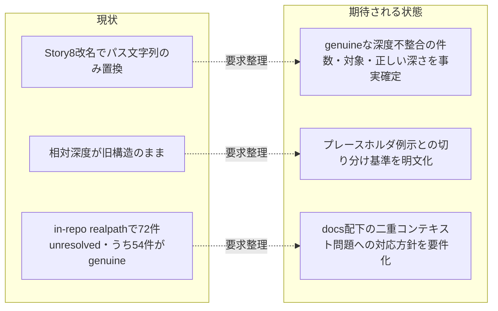

# 要求定義書: テンプレート群のクロス参照相対リンク深度の一括是正

**プロジェクト名**: テンプレート相対リンク深度是正
**作成日**: 2026 年 07 月 12 日
**最終更新**: 2026 年 07 月 12 日

> **重要**:
>
> - 要求定義書は、プロジェクトの全体像を把握するためのものです。詳細な技術仕様や実装方法は要件定義書以降で記載します。必要最低限の情報に収めることを心掛けてください。
> - **このドキュメントは常に更新**: 要求の変更や追加があった場合は、即座にこのドキュメントを更新してください。ドキュメントは「生きているドキュメント」として扱い、実装内容と常に同期させます。
> - **必須項目**: 以下の「必須」と明記した項目は空欄・抽象語のみ（例: 「{説明}」のまま）で提出しないこと。判定可能な形（目的は1文・成功基準は○/×で判定できる記載等）で記入すること。
>
> **用語**: [.agent-skill-chain/source/CONCEPTS.md §用語規約](../../../../../../../.agent-skill-chain/source/CONCEPTS.md#用語規約) を参照。

---

## 要求定義の全体像

```mermaid
mindmap
  root((テンプレート相対リンク深度是正))
    目的・背景
      Story8命名統合で文字列は置換されたが深さプレフィックスが未追随
      複数issueの04_reviewで独立に検出済み
      放置するとテンプレート由来リンクの追随性・可読性を損なう
    機能要件
      全テンプレートのリンク棚卸し（grep+realpath）
      genuine深度不整合とplaceholder例示リンクの切り分け
      正しい深さの決定方針の明文化
    非機能要件
      機械検証で再発を防止する仕組み
      docs配下は配備先とin-repo参照先で深さが異なる構造的曖昧さへの対応方針
    制約条件
      本issueはgrep+realpathでの事実調査と是正方針の要求整理までを範囲とする
      是正の実施（設計・実装）は本issueの要件を踏まえた別フェーズで行う
    除外要件
      テンプレート内のプレースホルダ例示パス（{issue1}等）の是正
    成功基準
      in-repo上でrealpath未解決となるgenuineな深度不整合が定義された基準で0件
    リスクと対策
      技術的リスク
      スケジュールリスク
```

**注意**:

- 上記の「プロジェクト名」は例です。実際のプロジェクト名に置き換えてください。
- マインドマップは全体像を把握するためのものです。主要なセクション名程度に留め、詳細は記載しないでください。

---

## 1. 目的・背景

### 1.1 目的（必須）

`.agent-skill-chain/runtime/templates/` 配下テンプレート群のクロス参照相対リンクの深度不整合を棚卸しし、是正方針を要求として整理する。

### 1.2 背景

- **現状の課題**:
  - Story8（commit c2b703d、`.agents/` → `.agent-skill-chain/source/` への統合ネスト移行）で、テンプレート内の相対リンクはパス文字列（`.agents/` → `.agent-skill-chain/source/`）は機械置換されたが、`../` の深さプレフィックスは移行前の構造のまま残った。
  - この既知の不整合は、本issueの親ワークフロー配下の 2 件のサブ issue の 04_review で独立に検出されている。
    - `90_issues/20260711_055538_フィジビリティADR必須化/04_review.md` §3.2・§10.1: 「テンプレート `templates/02_設計.md` は、テンプレート実在地点から見ると相対深度不整合が15件検出された」。本issueスコープ外・独立issueでの対応を推奨、と記載。
    - `90_issues/20260711_061341_システム仕様書完備強制テンプレート刷新/04_review.md` §4.2 指摘1・§10.1: 「`.agent-skill-chain/runtime/templates/docs/` 配下の複数READMEで `.agent-skill-chain/source/` へ向かう相対リンクの `../` 深度が不揃い。in-repo realpath解決で複数件が未解決（BROKEN）」。同じく本issueスコープ外・別issueでの対応を推奨、と記載。
  - いずれのレビューも「本issue範囲外・既知の問題として記録するに留める」との判断であり、独立issueとしての起票が推奨されていた（本issueはその起票にあたる）。
- **必要性**:
  - テンプレートは新規 issue 作成のたびに参照されるため、リンク切れは要求定義・設計フェーズでの参照導線を毎回損なう。
  - close 移動時の相対リンク補正手順（`.agent-skill-chain/project/自己拡張ワークフロー.md` §close 移動時の相対リンク補正）は「実リンクの深さを機械的に補正し realpath で検証する」運用が既に定着しており、テンプレート側でも同種の機械検証・補正が可能かつ必要である。

### 1.3 期待される効果（必須: 1 件以上）

- **効果 1**: テンプレート群のクロス参照相対リンクのうち、実在ファイルへの参照でありながら深さが誤っているもの（genuine 深度不整合）が、grep + realpath による機械検証で棚卸しされ、件数・対象ファイル・正しい深さが要求文書として確定する。
- **効果 2**: プレースホルダ例示パス（`{issue1}` 等）や配備後に消費者が作成するファイルへの例示リンクなど、「壊れているように見えるが是正対象ではないもの」との切り分け基準が明文化され、以後の誤修正・過剰修正を防げる。
- **効果 3**: `docs/` 配下テンプレート（in-repo 参照用配置と、配備後の消費者 `docs/`（リポジトリ直下）という 2 つの実体を持つ）について、どちらを基準に深さを定めるか、または両方を成立させる方法（配備時補正等）の方針候補が要件として整理される。

**現状と期待される状態の比較**（必要に応じて）:



---

## 2. 機能要件

### 2.1 既存機能の維持（該当する場合）

- 既存テンプレートの見出し・セクション構成・本文内容は変更しない（変更対象はクロス参照リンクの `../` 深度のみ）。

### 2.2 新規機能要件

- `.agent-skill-chain/runtime/templates/` 配下全ファイルを対象に、`](../` および `](./` 形式の相対リンクを grep で抽出し、リンク元ファイルの実在ディレクトリを基準に `realpath -m` で解決し、in-repo で実在するかを機械判定する棚卸し（本issueで実施済み。01 §2.2 に手順・結果を記載）。
- 棚卸し結果を「genuine 深度不整合（実在ファイルへの参照だが深さが誤っている）」「プレースホルダ・例示（`{...}` 等を含み、意図的に未実在）」の 2 分類に切り分ける分類基準の明文化。
- `docs/` 配下テンプレート固有の二重コンテキスト（in-repo 参照用配置と配備後消費者 `docs/` 直下）について、正しい深さの決定方針（またはコンテキスト別の複数深さを許容する方針）の要件化。

---

## 3. 非機能要件

### 3.1 パフォーマンス

- 該当なし（静的ドキュメントの検証・修正のみ）。

### 3.2 セキュリティ

- 該当なし。

### 3.3 互換性

- 是正後も、テンプレートを新規 issue へコピー・参照した際に生成される実ドキュメント側のリンクの意味（参照先の識別）は変わらないこと。

### 3.4 保守性

- 是正内容が再発しないよう、機械検証（grep + realpath）を再実行可能な形（コマンド手順として要件・設計に明記）で残すこと。将来的な恒久テスト化（test/ 配下への追加）の要否は本issueでは判断せず、設計フェーズ以降の検討候補として記録する。

---

## 4. 制約条件

### 4.1 技術的制約

- 本issueは**要求・要件フェーズのみ**を範囲とし、実際のリンク修正（実装）は別フェーズ（design-feature 以降）で行う。04_review.md は本issueでは作成しない。
- 是正対象は `.agent-skill-chain/runtime/templates/` 配下のテンプレートに限る。個別 issue（`docs/maintainer/workflow/{issue}/` 配下）に既に生成済みのドキュメントは対象外（それらは close 移動時の相対リンク補正手順で別途扱われる）。

### 4.2 既存システムとの互換性

- `.agent-skill-chain/project/自己拡張ワークフロー.md` §close 移動時の相対リンク補正で定義済みの検証コマンド（`grep -rEon` + `realpath -m` によるパイプライン）と整合する検証手法を用いる。

### 4.3 移行期間・スケジュール

- 特になし。次フェーズ（設計・実装計画）へ引き継ぐ前提で完結させる。

---

## 5. 除外要件

- プレースホルダ・例示パス（`90_issues.md` の `{issue1}`/`{issue2}`、`docs/99_ID命名規則と管理/README.md` および `docs/04_機能設計/機能名/README.md` の `{機能名}`/`{他の機能名}`、`00_システム理解.md` の `./README.md`・`./docs/design.md`・`./docs/api-spec.md`・`./path/to/api-spec.md` 等の記入例、`docs/04_機能設計/README.md` の `バッチ処理仕様` および `docs/04_機能設計/機能名/README.md` の `共通機能` のような未作成前提の例示サブディレクトリ）は、意図的に未実在のテンプレート記入例であり、本issueの是正対象（genuine 深度不整合）には含めない。
- テンプレート以外（`.agent-skill-chain/source/` 配下の非テンプレートドキュメント）の相対リンクは対象外。

---

## 6. 成功基準（必須: 1 件以上）

- `.agent-skill-chain/runtime/templates/` 配下の相対リンクを grep + realpath で棚卸しした結果（対象ファイル数・genuine 不整合件数・プレースホルダ除外件数）が 01_要件定義.md に事実ベースで記載されている。
- genuine 深度不整合と判定したリンクそれぞれについて、リンク元ファイル・行・現状の相対パス・正しい相対パス（またはコンテキスト依存で複数候補）の対応が 01_要件定義.md の受け入れ基準として記載されている。
- `docs/` 配下テンプレートの二重コンテキスト問題について、設計フェーズで検討すべき方針候補（案1・案2 等）が 01_要件定義.md に記載されている。

---

## 7. リスクと対策

### 7.1 技術的リスク

- **リスク**: `docs/` 配下テンプレートは in-repo 配置と配備後消費者 `docs/` 直下の 2 つのコンテキストで正しい深さが異なるため、単純な「+1 階層」機械補正では一方のコンテキストを壊す可能性がある。
  - **対策**: 本issueでは是正を実施せず、方針決定を設計フェーズに委ねる。要件定義で両コンテキストの深さの違いを明示し、設計フェーズで比較検討できるようにする。

### 7.2 スケジュールリスク

- **リスク**: 対象ファイル数が多く（棚卸し時点で in-repo unresolved 72 件、うち genuine 54 件、対象 15 ファイル）、修正漏れが発生しうる。
  - **対策**: 本issueの棚卸し結果を機械的な再検証コマンドとともに要件定義に残し、設計・実装フェーズで再実行して網羅性を担保する。

---

## 8. 参考資料

### プロジェクトドキュメント

- [`../../04_review.md`](../../04_review.md) - 親issue（agentsOS汎用化・ポリシー統合）のレビュー（サブ issue 一覧）
- [`../20260711_055538_フィジビリティADR必須化/04_review.md`](../20260711_055538_フィジビリティADR必須化/04_review.md) §3.2・§10.1 - 検出元1（02_設計.md の15件検出）
- [`../20260711_061341_システム仕様書完備強制テンプレート刷新/04_review.md`](../20260711_061341_システム仕様書完備強制テンプレート刷新/04_review.md) §4.2指摘1・§10.1 - 検出元2（docs/ 配下READMEの未解決検出）

### その他の参考資料

- [.agent-skill-chain/project/自己拡張ワークフロー.md §close 移動時の相対リンク補正](../../../../../../../.agent-skill-chain/project/自己拡張ワークフロー.md#close-移動時の相対リンク補正) - 同種の機械検証手法の先例
- `.agent-skill-chain/runtime/templates/` - 是正対象テンプレート群

---

## 9. 次のステップ

この要求定義書の承認後、以下のドキュメントを作成します：

- **次**: [`01_要件定義.md`](./01_要件定義.md) - 要件定義フェーズ
