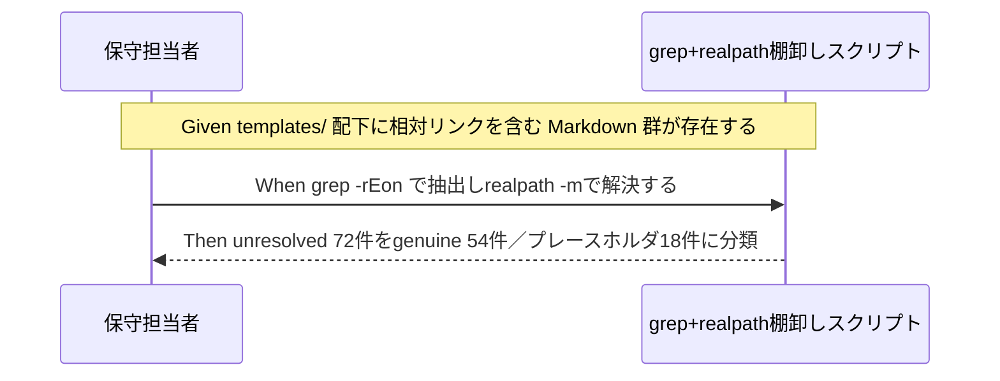

# 要件定義書: テンプレート群のクロス参照相対リンク深度の一括是正

**プロジェクト名**: テンプレート相対リンク深度是正
**作成日**: 2026 年 07 月 12 日
**最終更新**: 2026 年 07 月 12 日

> **重要**: **このドキュメントは常に更新**: 要件の変更や追加があった場合は、即座にこのドキュメントを更新してください。ドキュメントは「生きているドキュメント」として扱い、実装内容と常に同期させます。
>
> **用語**: [.agent-skill-chain/source/CONCEPTS.md §用語規約](../../../../../../../.agent-skill-chain/source/CONCEPTS.md#用語規約) を参照。

---

## 1. 概要

### 1.1 システム概要

`.agent-skill-chain/runtime/templates/` 配下の 00〜05・90・99 系テンプレートおよび `docs/`・`agents/` サブディレクトリ配下テンプレートに含まれる、`.agent-skill-chain/source/` 等リポジトリルート配下へ向かうクロス参照相対リンク（`](../...)`・`](./...)`）を対象に、機械検証（grep + realpath）で棚卸しした結果を要件として整理する。本 issue の元ネタは、親ワークフロー配下の 2 件のサブ issue のレビュー（`90_issues/20260711_055538_フィジビリティADR必須化/04_review.md`、`90_issues/20260711_061341_システム仕様書完備強制テンプレート刷新/04_review.md`）で独立に検出され、いずれも「本issue範囲外・別issueでの対応を推奨」とされていた既知課題である。

### 1.2 用語集

| 用語                     | 説明                                                                                                                                                              |
| ------------------------ | ------------------------------------------------------------------------------------------------------------------------------------------------------------- |
| genuine 深度不整合       | リンク先が実在するファイル・ディレクトリであるにもかかわらず、`../` の段数（深さ）が誤っているために realpath 解決が失敗する相対リンク。是正対象。               |
| プレースホルダ・例示リンク | `{issue1}` 等の記入例プレースホルダ、または `バッチ処理仕様`・`共通機能` のようにテンプレート利用者が将来作成する前提の例示パスで、意図的に未実在。是正対象外。 |
| in-repo 解決             | 本リポジトリ（`.agent-skill-chain/runtime/templates/` を含む配布パッケージ正本リポジトリ）の実ファイル配置を基準に、`realpath -m` でリンク先の実在を判定すること。 |
| 配備後コンテキスト        | `.agent-skill-chain/source/SETUP.md` の setup 手順により、テンプレートが消費者プロジェクトへコピー・展開された後の配置（`docs/` はプロジェクトルート直下等）。 |

---

## 2. 機能要件

### 2.1 ユーザーストーリー

#### ストーリー 1: テンプレート保守担当者として、genuine な深度不整合の全量を把握したい

- **As a** テンプレート・パッケージ正本の保守担当者
- **I want to** `.agent-skill-chain/runtime/templates/` 配下の相対リンクのうち、実在ファイルへの参照でありながら `../` の深さが誤っているものを網羅的に把握したい
- **So that** 見落としなく一括是正でき、また是正後に再発を機械検証で検知できる

**受け入れ基準**:

- AC-1: grep + realpath による棚卸し結果（対象リンク総数・in-repo unresolved 件数・genuine 件数・プレースホルダ除外件数）が本ドキュメントに事実ベース（推測・断定なしの実測値）で記載されている。
- AC-2: genuine と判定した各リンクについて、ファイルパス・行番号・現状のリンク文字列・実在するリンク先の絶対パスが特定できる形で記載されている。

#### ストーリー 2: issue 起票者として、プレースホルダ例示リンクを誤って是正対象に含めたくない

- **As a** 本issueおよび後続の設計・実装フェーズの担当者
- **I want to** テンプレートの意図的な記入例プレースホルダ（`{issue1}` 等）を genuine 不整合と混同しないための切り分け基準がほしい
- **So that** 誤って記入例を実ファイルパスへ書き換えてしまう事故を防げる

**受け入れ基準**:

- AC-3: プレースホルダ・例示と判定したリンクの一覧と、その判定根拠（`{...}` を含む／テンプレート文脈上明らかに記入例である 等）が本ドキュメントに記載されている。

#### ストーリー 3: 設計担当者として、`docs/` 配下テンプレートの二重コンテキスト問題への対応方針候補がほしい

- **As a** 後続の design-feature フェーズ担当者
- **I want to** `docs/` 配下テンプレートが「in-repo 参照用配置」と「配備後の消費者 `docs/` 直下」という 2 つの異なる正しい深さを持つ構造的曖昧さについて、検討すべき方針候補を要件として受け取りたい
- **So that** 設計フェーズで一から調査せずに方針決定に着手できる

**受け入れ基準**:

- AC-4: `docs/` 配下テンプレートについて、in-repo コンテキストでの正しい深さと、配備後消費者コンテキストでの正しい深さが、それぞれ具体例とともに記載されている。
- AC-5: 上記の差異に対する方針候補（最低2案）が本ドキュメントに記載されている。

### 2.2 BDD ユースケース

#### ユースケース 1: テンプレート全体の相対リンクを grep + realpath で棚卸しする

本issueの過程で実際に実行した棚卸し手順と結果。以後の設計・実装フェーズで再実行して差分検知に用いる。

**シナリオ 1: 相対リンクの抽出と in-repo realpath 解決**

```gherkin
Feature: テンプレートのクロス参照相対リンク棚卸し
  Scenario: .agent-skill-chain/runtime/templates/ 配下の相対リンクを機械検証する
    Given .agent-skill-chain/runtime/templates/ 配下に 00〜99・docs/・agents/ を含む Markdown テンプレート群が存在する
    When "]( ../" または "]( ./" 形式の相対リンクを grep -rEon で抽出し、各リンク元ファイルのディレクトリを基準に realpath -m で解決する
    Then 実在しないリンク先（unresolved）が判定され、既存ファイルとして実在するが誤った深さのもの（genuine）と、意図的に未実在のプレースホルダ・例示（out of scope）に分類できる
```

**棚卸し結果（本issueで実施・実測値）**:

- 対象: `.agent-skill-chain/runtime/templates/` 配下の全ファイル（`00_システム理解.md`、`00_要求定義.md`〜`05_最終確認チェックリスト.md`、`90_issues.md`、`99_PR.md`・`99_PR_review.md`、`agents/scribe_claude.md`・`agents/scribe_cursor.md`、`docs/` 配下の全 README、`指摘対応/` 配下、`github/` 配下等）。
- 検出手順:
  ```bash
  grep -rEon '\]\((\.\./|\./)[^)]+\)' .agent-skill-chain/runtime/templates | while IFS=: read -r f n rest; do
    link=$(printf '%s' "$rest" | sed -E 's/^\]\(//; s/\).*$//; s/#.*$//')
    target=$(realpath -m "$(dirname "$f")/$link")
    [ -e "$target" ] && echo "OK|$f:$n|$link" || echo "BROKEN|$f:$n|$link|$target"
  done
  ```
- 実測件数（2026-07-12 実行時点）:
  - 抽出した相対リンク総数: **233 件**。
  - in-repo realpath で unresolved（実在しない）: **72 件**。
  - 上記 72 件のうち、プレースホルダ・例示（是正対象外。§2.2 ユースケース2で確定）: **18 件**。
  - 上記 72 件のうち、genuine 深度不整合（是正対象。§2.2 ユースケース2で確定）: **54 件**。
  - genuine 深度不整合の内訳（ファイル別件数）:

    | ファイル | genuine 件数 |
    | --- | --- |
    | `.agent-skill-chain/runtime/templates/02_設計.md` | 15 |
    | `.agent-skill-chain/runtime/templates/agents/scribe_claude.md` | 9 |
    | `.agent-skill-chain/runtime/templates/03_実装計画.md` | 6 |
    | `.agent-skill-chain/runtime/templates/agents/scribe_cursor.md` | 4 |
    | `.agent-skill-chain/runtime/templates/04_review.md` | 4 |
    | `.agent-skill-chain/runtime/templates/00_システム理解.md` | 3 |
    | `.agent-skill-chain/runtime/templates/docs/03_データ設計/README.md` | 2 |
    | `.agent-skill-chain/runtime/templates/docs/02_画面設計/README.md` | 2 |
    | `.agent-skill-chain/runtime/templates/docs/01_システム概要/README.md` | 2 |
    | `.agent-skill-chain/runtime/templates/00_要求定義.md` | 2 |
    | `.agent-skill-chain/runtime/templates/docs/README.md` | 1 |
    | `.agent-skill-chain/runtime/templates/99_PR.md` | 1 |
    | `.agent-skill-chain/runtime/templates/90_issues.md` | 1 |
    | `.agent-skill-chain/runtime/templates/05_最終確認チェックリスト.md` | 1 |
    | `.agent-skill-chain/runtime/templates/01_要件定義.md` | 1 |
    | **合計** | **54** |

  - `02_設計.md` の genuine 15 件は、`90_issues/20260711_055538_フィジビリティADR必須化/04_review.md` §3.2 が独立に検出した「15件検出」と実測が一致した（独立再検証で整合）。
  - `docs/01_システム概要/README.md`・`docs/02_画面設計/README.md`・`docs/03_データ設計/README.md` の unresolved は、`90_issues/20260711_061341_システム仕様書完備強制テンプレート刷新/04_review.md` §4.2 指摘1が列挙した BROKEN 4 件（`02_画面設計/README.md:7`、`03_データ設計/README.md:7`、`docs/README.md:7`、`01_システム概要/README.md:6`）と対象ファイルが一致した（独立再検証で整合。行番号は本issue実測時点のものであり、微小なドキュメント更新により前回検出時と1〜数行ずれている場合がある）。

**処理フロー**（必要に応じて）:



**シナリオ 2: genuine 不整合の正しい深さの検証（.agent-skill-chain/source/ 系）**

```gherkin
Feature: genuine 深度不整合の正しい深さの特定
  Scenario: templates/ 直下ファイルからの .agent-skill-chain/source/ 参照
    Given "templates/02_設計.md" は ".agent-skill-chain/runtime/templates/" 直下（リポジトリルートから3階層下）に配置されている
    And 現状のリンクは "../../.agent-skill-chain/source/CONCEPTS.md"（2階層上）である
    When リポジトリルートまでの正しい階層数（3階層上）でrealpath解決する
    Then "../../../.agent-skill-chain/source/CONCEPTS.md" は実在ファイルに解決する
```

- 検証実測（対象ファイルはすべて `.agent-skill-chain/source/CONCEPTS.md`・`EVIDENCE_POLICY.md`・`spec/*.md`・`RULES.md`・`TEST_BDD_FORMAT.md`・`REVIEW_RULE.md`・`DOCS_RULES.md`・`agents/scribe.md`・`scribe/CONTRACT.md`・`skills/agent/run_command.md`・`ledger/schema.md`・`scribe/README.md`・`AGENTS_MERMAID_RULES.md` 等）: いずれも `.agent-skill-chain/source/` 配下または `.agent-skill-chain/runtime/templates/` 配下に**実在することを確認済み**（in-repo で `[ -e ... ]` により実測。存在しないファイルへのダングリング参照は0件）。すなわち genuine 54 件はすべて「実在ファイルへの参照だが深さが誤っている」ケースであり、リンク先ファイル自体の欠落は含まれない。
- `.agent-skill-chain/runtime/templates/` 直下ファイル（00〜05・90・99・00_システム理解）から `.agent-skill-chain/source/` への正しい深さは **3 階層上**（`../../../.agent-skill-chain/source/...`）。現状の多くは 2 階層上（`../../.agent-skill-chain/source/...`）になっており 1 階層不足している。
- `.agent-skill-chain/runtime/templates/agents/` 配下ファイル（`scribe_claude.md`・`scribe_cursor.md`）から `.agent-skill-chain/source/` への正しい深さは **4 階層上**（`../../../../.agent-skill-chain/source/...`）。現状は 3 階層上（`../../../.agent-skill-chain/source/...`）で 1 階層不足している。
- `.agent-skill-chain/runtime/templates/00_要求定義.md:182` の `../00_システム理解.md`（`.agent-skill-chain/runtime/00_システム理解.md` に誤解決）は、正しくは同一ディレクトリ内参照であり `./00_システム理解.md`（または `00_システム理解.md`）が正しい。

**シナリオ 3: docs/ 配下テンプレートの二重コンテキスト**

```gherkin
Feature: docs 配下テンプレートの配備先コンテキスト依存
  Scenario: in-repo 参照用配置での深さ
    Given "templates/docs/01_システム概要/README.md" は ".agent-skill-chain/runtime/templates/docs/01_システム概要/" （リポジトリルートから5階層下）に配置されている
    When リポジトリルートまでの正しい階層数（5階層上）でrealpath解決する
    Then "../../../../../.agent-skill-chain/source/DOCS_RULES.md" は実在ファイルに解決する

  Scenario: 配備後の消費者docs/直下での深さ
    Given setup により当該テンプレートの内容が消費者プロジェクトの "docs/01_システム概要/README.md"（プロジェクトルートから2階層下）としてコピー・展開される（.agent-skill-chain/source/SETUP.md の配備規約に基づく）
    When 配備後の配置を基準にリポジトリルートまでの階層数（2階層上）でrealpath解決する
    Then 配備後コンテキストで .agent-skill-chain/source/DOCS_RULES.md を正しく参照するには "../../.agent-skill-chain/source/DOCS_RULES.md" が必要になる
```

- **確認した事実**: `.agent-skill-chain/source/SETUP.md`（配備規約）により、`.agent-skill-chain/runtime/templates/` はパッケージからプロジェクトへ**同一の相対構造**（`.agent-skill-chain/runtime/templates/...`）でコピーされる。したがって `.agent-skill-chain/runtime/templates/` 直下ファイルおよび `agents/` 配下ファイルから `.agent-skill-chain/source/` への正しい深さは、**in-repo（本パッケージ正本リポジトリ）でも配備後（消費者プロジェクト）でも同一**であり、二重コンテキスト問題は生じない（シナリオ2の対象）。
- 一方、`docs/` 配下テンプレートは性質が異なる。`.agent-skill-chain/source/DOCS_RULES.md`（`docs/00_review/YYYYMMDD_HHMMSS_review.md` の記載等）から、`.agent-skill-chain/runtime/templates/docs/` は「消費者が実際の `docs/`（プロジェクトルート直下）を作成する際の**参照用テンプレート**」であり、消費者の実 `docs/` はテンプレートの配置場所そのものではなく、プロジェクトルート直下に**別途作成**される。このため、`docs/` 配下テンプレートのクロス参照リンクには、
  - (a) **in-repo 参照用配置を基準にした深さ**（`.agent-skill-chain/runtime/templates/docs/...` から見た深さ）と、
  - (b) **配備後、消費者が実際に `docs/...` として作成した場合の深さ**（プロジェクトルート直下 `docs/...` から見た深さ）

  という、構造的に異なる 2 つの「正しい深さ」が存在しうる。現状のリンクはどちらの基準からもズレている行が複数存在する（例: `docs/01_システム概要/README.md:6` の `DOCS_RULES.md` 参照は 4 階層上で in-repo 未解決、同ファイル :7 の `AGENTS_MERMAID_RULES.md` 参照は 3 階層上で in-repo 側は深すぎる一方、消費者 `docs/` 直下基準では逆に浅すぎる可能性がある）。
  - この事実は `90_issues/20260711_061341_システム仕様書完備強制テンプレート刷新/04_review.md` §4.2 指摘1 の「テンプレートは配備コンテキスト（消費者 docs/ はリポジトリ直下）と in-repo 配置で正しい深度が異なるという構造的曖昧さがある」という指摘と整合する。

### 2.3 ビジネスルール

- 是正対象は genuine 深度不整合（§2.2 ユースケース1・2で確定した 54 件、対象 15 ファイル）に限定し、プレースホルダ・例示リンク（§2.2 ユースケース1で確定した 18 件、§5 除外要件に列挙）には手を加えない。
- `.agent-skill-chain/runtime/templates/` 直下・`agents/` 配下ファイルは、in-repo と配備後で正しい深さが同一であるため、単一の深さへの機械的な一括補正（+1 階層）で足りる（設計フェーズでの確定事項候補）。
- `docs/` 配下テンプレートは二重コンテキスト問題があるため、単純な一括「+1 階層」補正では不十分な可能性がある。設計フェーズで、(i) in-repo 参照用配置を正として消費者側は setup 時に補正する、(ii) 配備後の消費者 `docs/` 直下を正として in-repo 参照は別途扱う、(iii) 両コンテキストで解決可能な形式（例: 相対リンクをやめて `.agent-skill-chain/source/` へのアンカー付き注記や絶対風パスの案内文に置き換える）等の方針候補を比較検討する（AC-4・AC-5）。

---

## 3. 非機能要件

### 3.1 パフォーマンス要件

- 該当なし。

### 3.2 セキュリティ要件

- 該当なし。

### 3.3 ユーザビリティ要件

- 是正後、テンプレートを開いた保守担当者がクロス参照リンクをクリック（または realpath 解決）して正本ドキュメントに到達できること。

### 3.4 可用性要件

- 該当なし。

---

## 4. 外部インターフェース要件

### 4.1 API 要件

- 該当なし。

### 4.2 データ形式要件

- 該当なし（Markdown ドキュメント内の相対リンク文字列のみを扱う）。

---

## 5. 制約事項

- 本issueは要求・要件フェーズのみを範囲とする。実際のリンク修正（design-feature・implement-feature 相当のフェーズ）は別途行う。04_review.md は本issueでは作成しない（run_command.md の実装前 04 禁止規約に従う）。
- 是正対象外（プレースホルダ・例示。§5 要求定義側と同一の 18 件）:
  - `90_issues.md:22,23` の `{issue1}`/`{issue2}`。
  - `docs/99_ID命名規則と管理/README.md:51,52,58,59,65,66` の `{機能名}`（6件）。
  - `00_システム理解.md:33,34,35,285,286,287` の `./README.md`・`./docs/design.md`・`./docs/api-spec.md`（記入例、6件）。
  - `00_システム理解.md:192` の `./path/to/api-spec.md`（記入例）。
  - `docs/04_機能設計/機能名/README.md:126` の `../{他の機能名}/README.md`。
  - `docs/04_機能設計/機能名/README.md:127` の `../共通機能/README.md`（未作成前提の例示サブディレクトリ）。
  - `docs/04_機能設計/README.md:43` の `./バッチ処理仕様/README.md`（同上）。
- サブエージェントは本issueで発見した派生課題（例: `docs/04_機能設計/README.md` の「バッチ処理仕様」「共通機能」のような、除外はしたが実体は存在しない例示サブディレクトリ運用の是非）を自ら新規issue化しない。完了報告で提案するに留める。

---

## 6. 参考資料

### プロジェクトドキュメント

- [`00_要求定義.md`](./00_要求定義.md) - 要求定義

### その他の参考資料

- [.agent-skill-chain/source/SETUP.md](../../../../../../../.agent-skill-chain/source/SETUP.md) - テンプレート配備規約（`.agent-skill-chain/runtime/templates/` の配備先コピー規約の一次情報）
- [.agent-skill-chain/source/DOCS_RULES.md](../../../../../../../.agent-skill-chain/source/DOCS_RULES.md) - `docs/` テンプレートの参照・配置規約
- [.agent-skill-chain/project/自己拡張ワークフロー.md §close 移動時の相対リンク補正](../../../../../../../.agent-skill-chain/project/自己拡張ワークフロー.md#close-移動時の相対リンク補正) - 同種の機械検証・補正の先例

---

## 7. 前のステップ

この要件定義書は、以下のドキュメントを基に作成されています：

- **前**: [`00_要求定義.md`](./00_要求定義.md) - 要求定義フェーズ

---

## 8. 次のステップ

この要件定義書の承認後、以下のドキュメントを作成します：

- **次**: [`02_設計.md`](./02_設計.md) - 設計フェーズ（本issueの範囲外。別issue／別フェーズで実施）
