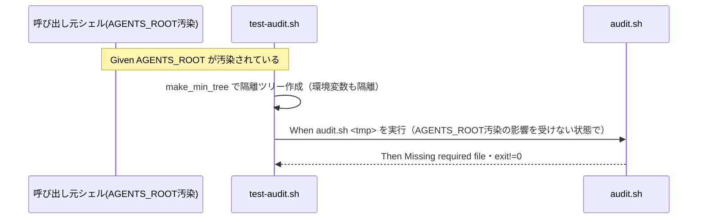

# 要件定義書: test-audit.sh 必須ファイル欠落検知の AGENTS_ROOT 環境変数汚染是正

**プロジェクト名**: test-audit.sh 必須ファイル欠落検知の AGENTS_ROOT 環境変数汚染是正
**作成日**: 2026 年 07 月 12 日
**最終更新**: 2026 年 07 月 12 日

> **重要**: **このドキュメントは常に更新**: 要件の変更や追加があった場合は、即座にこのドキュメントを更新してください。ドキュメントは「生きているドキュメント」として扱い、実装内容と常に同期させます。
>
> **用語**: [.agent-skill-chain/source/CONCEPTS.md §用語規約](../../../../../../../.agent-skill-chain/source/CONCEPTS.md#用語規約) を参照。

---

## 1. 概要

### 1.1 システム概要

`test/test-audit.sh` は `.agent-skill-chain/source/enforcement/ci/audit.sh` の後方互換・自己テストであり、`mktemp -d` による隔離ツリー（`make_min_tree`）を用いて `audit.sh` の各チェック（必須ファイル存在・DB 非採用時の SKIP 等）が回帰していないことを検証する。本 issue は、このうちシナリオ3（必須ファイル欠落検知）が、呼び出し元シェルに事前設定された `AGENTS_ROOT` 環境変数の値（`${CLAUDE_PROJECT_DIR}/.agent-skill-chain/source` という未展開のテンプレート文字列）により無効化される既存不具合を是正する。`make_min_tree` によるファイルツリーの隔離に加えて、環境変数の隔離を導入し、あわせて `audit.sh` 側の「`AGENTS_ROOT` 解決先ディレクトリが存在しない場合に必須ファイルチェック全体をサイレントスキップする」という fail-open な設計についても、02_設計フェーズで是正方針を検討する。

### 1.2 用語集

| 用語                    | 説明                                                                                                                                                                        |
| ----------------------- | --------------------------------------------------------------------------------------------------------------------------------------------------------------------------- |
| `AGENTS_ROOT`           | `audit.sh` が「`.agent-skill-chain/source` 相当のパッケージ正本ディレクトリ」を指すために参照する環境変数。既定値は `.agent-skill-chain/source`（`audit.sh:83` の `${AGENTS_ROOT:-.agent-skill-chain/source}`）。 |
| `make_min_tree`         | `test/test-audit.sh` 内の関数。`mktemp -d` で隔離ツリーを作り、必須ファイル（`CORE.md` 等）を配置した最小 issue ツリーを返す（同ファイル 43-53 行目）。                    |
| 環境変数汚染             | テスト実行対象コード（`audit.sh`）が参照する環境変数が、テストの隔離範囲外（呼び出し元シェル）から意図せず値を持ち込まれ、テストの前提が崩れる状態。                     |
| fail-open / fail-closed | 判定不能・前提未成立の場合に「安全側＝検知失敗として扱う（fail-closed）」か「無条件で通す＝検知しない（fail-open）」かの設計方針。                                         |

---

## 2. 機能要件

### 2.1 ユーザーストーリー

#### ストーリー 1: test-audit.sh の環境変数汚染耐性

- **As a** 本リポジトリのテスト保守者（人間・エージェント問わず）
- **I want to** `test/test-audit.sh` のシナリオ3が、呼び出し元シェルの `AGENTS_ROOT` 環境変数汚染の有無に関わらず確実に意図どおり動作してほしい
- **So that** 必須ファイル欠落検知（`audit.sh` #1）の回帰テストとして `test-audit.sh` を信頼でき、将来 `CORE.md` 等の必須ファイルが誤って削除された際に確実に検知できる

**受け入れ基準**:

- AC-1: `AGENTS_ROOT=${CLAUDE_PROJECT_DIR}/.agent-skill-chain/source`（`CLAUDE_PROJECT_DIR` 未設定で展開されない壊れたテンプレート文字列）を事前 export した状態で `bash test/test-audit.sh` を実行しても、シナリオ3の 2 アサーション（`exit != 0`・`Missing required file` メッセージあり）が PASS すること。
- AC-2: `AGENTS_ROOT` 未設定のクリーンな環境で `bash test/test-audit.sh` を実行した場合、是正前に PASS していた既存シナリオ（T1・T2・T4・SC1・SC4A/B・GUARD・EDGE・S32 系列 7 件など）が引き続き PASS し、新規の FAIL が発生しないこと。
- AC-3: 是正手段は `make_min_tree` またはシナリオ実行箇所のいずれかに実装し、`audit.sh` 本体の呼び出しインターフェース（引数 `$1`=PROJECT_ROOT・`$2`=GIT_RANGE）を変更しないこと（既存呼び出し元・CI との互換性維持）。

#### ストーリー 2: audit.sh の AGENTS_ROOT 解決失敗時のサイレントスキップ是正

- **As a** `audit.sh`（必須ファイル存在チェック #1）の保守者
- **I want to** `AGENTS_ROOT` の解決先ディレクトリが見つからない場合に、必須ファイルチェック全体が無条件でサイレントスキップされるのではなく、少なくとも明示的に検知可能な挙動になってほしい
- **So that** 環境変数の設定ミス・汚染により、本来 FAIL すべき必須ファイル欠落が黙って見逃されるという品質ゲートの抜け穴を塞げる

**受け入れ基準**:

- AC-4: `AGENTS_ROOT` が存在しないパスを指す状態で `audit.sh <tmp>` を実行した場合、必須ファイルチェックが「無条件で成功扱いにする」以外の挙動（設計フェーズで比較検討のうえ、WARN 出力・fail-closed 化等から選択して確定）を取ること。
- AC-5: `AGENTS_ROOT` が未設定（デフォルト値 `.agent-skill-chain/source` が使われる）かつ必須ファイルが揃った最小ツリーに対して `audit.sh <tmp>` を実行した場合、既存どおり `Audit passed.`（`exit 0`）となること（既存 T1 シナリオ相当の回帰なし）。
- AC-6: fail-closed 化などの強い変更を採用する場合、`AGENTS_ROOT` を独自の配置へ向ける可能性がある他の消費者プロジェクトを誤って FAIL させないことを 02_設計フェーズで検討し、その結論（採用する挙動とその理由）を設計書に明記すること。

### 2.2 BDD ユースケース

#### ユースケース 1: test-audit.sh が環境変数汚染に影響されず実行される

`test/test-audit.sh` の実行環境（呼び出し元シェル）に `AGENTS_ROOT` が事前設定されていても、テストが意図した検証（必須ファイル欠落の検知）を確実に行えることを保証する。

**シナリオ 1: 汚染環境でもシナリオ3が PASS する**

```gherkin
Feature: test-audit.sh の環境変数汚染耐性
  Scenario: AGENTS_ROOT が汚染された状態でもシナリオ3が意図どおり動作する
    Given 呼び出し元シェルに AGENTS_ROOT=${CLAUDE_PROJECT_DIR}/.agent-skill-chain/source（CLAUDE_PROJECT_DIR 未設定で展開されない値）が事前 export されている
    When bash test/test-audit.sh を実行する
    Then シナリオ3の「必須ファイル欠落で exit != 0」アサーションが PASS する
    And シナリオ3の「Missing required file メッセージを出す」アサーションが PASS する
```

**処理フロー**（必要に応じて）:



**シナリオ 2: クリーン環境で既存シナリオが退行しない**

```gherkin
Feature: test-audit.sh の環境変数汚染耐性
  Scenario: AGENTS_ROOT 未設定のクリーンな環境で既存シナリオが退行しない
    Given AGENTS_ROOT が未設定のクリーンな環境
    When bash test/test-audit.sh を実行する
    Then 是正前に PASS していた全シナリオが引き続き PASS する
    And 新規の FAIL が発生しない
```

#### ユースケース 2: audit.sh の AGENTS_ROOT 解決失敗時の挙動明確化

`audit.sh` の必須ファイル存在チェック（#1）が、`AGENTS_ROOT` の解決に失敗した場合でも「何も起きなかったかのように成功する」のではなく、意図が判別できる挙動を取ることを保証する。

**シナリオ 1: 解決失敗時に無条件成功しない**

```gherkin
Feature: audit.sh の AGENTS_ROOT 解決失敗時の挙動
  Scenario: AGENTS_ROOT が存在しないパスを指す場合、必須ファイルチェックが無条件成功にならない
    Given AGENTS_ROOT が存在しないディレクトリを指す設定になっている
    When audit.sh <tmp> を実行する
    Then 必須ファイルチェックが明示的な検知（WARN 出力または FAIL のいずれか、設計フェーズで確定した挙動）を行う
```

**シナリオ 2: 既存の正常系は退行しない**

```gherkin
Feature: audit.sh の AGENTS_ROOT 解決失敗時の挙動
  Scenario: AGENTS_ROOT 未設定・必須ファイルが揃った最小ツリーでは従来どおり成功する
    Given AGENTS_ROOT が未設定（デフォルト .agent-skill-chain/source が使われる）で必須ファイルが揃った最小ツリー
    When audit.sh <tmp> を実行する
    Then Audit passed. が出力され exit 0 となる
```

### 2.3 ビジネスルール

- テストの隔離（`.agent-skill-chain/project/自己拡張ワークフロー.md §テストの tmp 隔離`）は、ファイルツリーだけでなく、テスト対象コードが参照する環境変数にも及ぶべきである。`make_min_tree` はファイルツリーの隔離のみを行っており、本 issue で環境変数の隔離を補う。
- `audit.sh` の必須ファイルチェック（#1）が `AGENTS_ROOT` 解決失敗時にどう振る舞うか（fail-open を維持するか、fail-closed 化するか、WARN 出力に留めるか）は、02_設計フェーズで既存消費者への影響を含めて比較検討したうえで決定する。本要件定義では「無条件のサイレントスキップは不可」までを要件とし、具体的な挙動の選択は設計に委ねる。

---

## 3. 非機能要件

### 3.1 パフォーマンス要件

- 既存テストスイート（`test/test-audit.sh`・`test/run-all.sh`）の実行時間に大きな影響を与えないこと。

### 3.2 セキュリティ要件

- 必須ファイル欠落検知という品質ゲートが、環境変数汚染という外部要因によって無効化されない状態にすること。

### 3.3 ユーザビリティ要件

- 是正後の `audit.sh`／`test-audit.sh` の挙動変更点は、変更箇所のコメントまたは `enforcement/README.md` 等の該当箇所に、変更理由（本事象の根本原因）が分かる形で記録すること。

### 3.4 可用性要件

- 特になし。

---

## 4. 外部インターフェース要件

### 4.1 API 要件

- `audit.sh` の呼び出しインターフェース（`$1`=PROJECT_ROOT・`$2`=GIT_RANGE、環境変数 `AGENTS_ROOT`・`WORKFLOW_DIR`・`WORKFLOW_DIRS` 等による上書き機構）は既存のまま維持すること。既存 CI（`.github/workflows/self-enforce.yml`）・既存消費者プロジェクトからの呼び出し方を変更しない。

### 4.2 データ形式要件

- 特になし。

---

## 5. 制約事項

- bash の `${VAR:-default}` は変数が既に設定されている場合はデフォルト値を採用しない仕様であるため、環境変数汚染への対策は `test-audit.sh` 側での明示的な `unset`/`env -u` 等、または `audit.sh` 側での追加検証のいずれか（もしくは両方）で実現する。具体的な実装方式は 02_設計フェーズで確定する。
- 検証は必ず `mktemp -d` の隔離ツリーで行い、本開発リポジトリの `.agent-skill-chain/source/` `.claude/` `.cursor/` `.agent-skill-chain/runtime/` `workflow.db` を変更・破壊しないこと（`.agent-skill-chain/project/自己拡張ワークフロー.md §テストの tmp 隔離`）。

---

## 6. 参考資料

### プロジェクトドキュメント

- [`00_要求定義.md`](./00_要求定義.md) - 要求定義

### その他の参考資料

- [review-docs必須化/04_review.md §3.1・§10.1課題1](../20260711_194044_review-docs必須化/04_review.md)
- [workflowDB由来検知欠如是正/04_review.md](../20260711_062125_workflowDB由来検知欠如是正/04_review.md)
- `test/test-audit.sh`（43-53 行目 `make_min_tree`、91-99 行目 シナリオ3）
- `.agent-skill-chain/source/enforcement/ci/audit.sh`（83 行目 `AGENTS_ROOT` 解決、216-225 行目 必須ファイル存在チェック #1）

---

## 7. 前のステップ

この要件定義書は、以下のドキュメントを基に作成されています：

- **前**: [`00_要求定義.md`](./00_要求定義.md) - 要求定義フェーズ

---

## 8. 次のステップ

この要件定義書の承認後、以下のドキュメントを作成します：

- **次**: [`02_設計.md`](./02_設計.md) - 設計フェーズ
