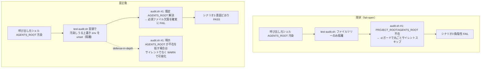
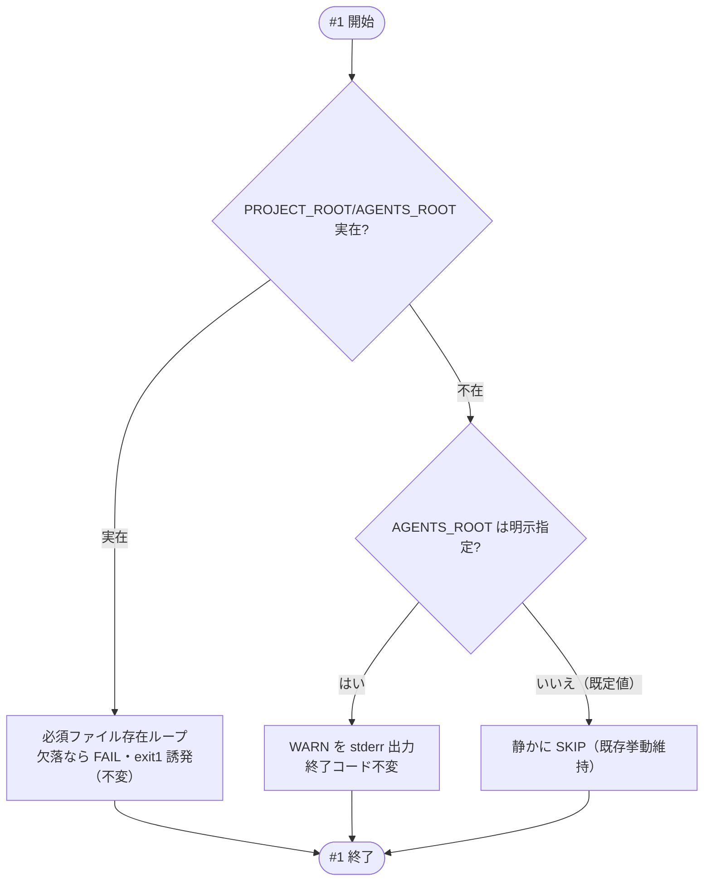

# 設計書: test-audit.sh 必須ファイル欠落検知の AGENTS_ROOT 環境変数汚染是正

**プロジェクト名**: test-audit.sh 必須ファイル欠落検知の AGENTS_ROOT 環境変数汚染是正
**作成日**: 2026 年 07 月 12 日
**最終更新**: 2026 年 07 月 12 日

> **重要**: **このドキュメントは常に更新**: 設計の変更や追加があった場合は、即座にこのドキュメントを更新してください。ドキュメントは「生きているドキュメント」として扱い、実装内容と常に同期させます。
>
> **用語**: [.agent-skill-chain/source/CONCEPTS.md §用語規約](../../../../../../../.agent-skill-chain/source/CONCEPTS.md#用語規約) を参照。

---

## 1. 設計概要

**参照**: 設計方針・原則は [.agent-skill-chain/source/spec/01\_設計原則.md](../../../../../../../.agent-skill-chain/source/spec/01_設計原則.md) を先に参照した上で、本 issue に適用するものを選んで記載する。

### 1.1 設計方針

呼び出し元シェルの環境変数汚染に対し、テスト（`test/test-audit.sh`）の隔離範囲を「ファイルツリー隔離」に加えて「環境変数隔離」へ拡張することを主軸とし、`audit.sh` 側にはサイレントな fail-open を可視化する最小の防御（WARN）を defense-in-depth として加える。既存 32 監査項目・既存全シナリオの判定ロジックは変更しない。

### 1.2 設計原則（本プロジェクトで適用するもの）

- **UNIX哲学（小さく作る・シンプルに保つ）**: 修正は「テスト冒頭での環境変数 unset（1 ブロック）」と「audit.sh #1 への WARN 分岐（数行）」に限定する。抽象化・共通化は導入しない。
- **単一責務**: テストの隔離責務は `test-audit.sh`（テストハーネス）に、監査ロジックは `audit.sh`（監査エンジン）に置く。汚染源そのもの（外部ハーネスの環境変数注入）の是正は本 issue のスコープ外（[00 §5 除外要件](./00_要求定義.md)）とし、境界を越えない。

---

## 2. アーキテクチャ設計

### 2.1 責務・境界・参照関係

#### 2.1.1 責務一覧

| コンポーネント | 責務（1 文） |
| -------------- | ------------ |
| `test/test-audit.sh`（テストハーネス） | `audit.sh` の回帰を、呼び出し元環境に依存しない隔離条件（ファイルツリー＋環境変数）下で検証する。 |
| `make_min_tree`（同ファイル内関数） | `mktemp -d` で最小 issue ツリー（必須ファイル・走査基点）を生成する（ファイルツリー隔離のみを担う。責務は不変）。 |
| `.agent-skill-chain/source/enforcement/ci/audit.sh` #1（必須ファイル存在チェック） | `AGENTS_ROOT` 配下の必須ファイル存在を検証し、欠落を FAIL として報告する。解決先ディレクトリが不在のときの扱いを明確化する。 |

#### 2.1.2 境界

- **入力**:
  - `test-audit.sh`: 呼び出し元シェル環境（汚染されうる）・リポジトリの `audit.sh` 本体（読み取りのみ）。
  - `audit.sh` #1: 位置引数 `$1`=PROJECT_ROOT、環境変数 `AGENTS_ROOT`（既定 `.agent-skill-chain/source`）。
- **出力**:
  - `test-audit.sh`: PASS/FAIL 集計と終了コード。
  - `audit.sh` #1: 必須ファイル欠落時の `FAIL: Missing required file ...`（exit 1 誘発）、解決先不在かつ明示指定時の `WARN: ...`（終了コードは不変）。
- **他責務との境界**:
  - `audit.sh` の呼び出しインターフェース（`$1`/`$2`・`AGENTS_ROOT`/`WORKFLOW_DIR`/`WORKFLOW_DIRS` 等の上書き機構）は変更しない（[01 §4.1](./01_要件定義.md)）。
  - `AGENTS_ROOT` を誰がどこで事前設定しているか（外部ハーネス側）の是正は本 issue の範囲外。
  - `audit.sh` の #1 以外のチェック（#2〜#32）の判定ロジックは変更しない。

#### 2.1.3 参照関係

- `test-audit.sh` → `audit.sh`（サブプロセス実行・読み取りのみ）。
- `audit.sh` #1 → `AGENTS_ROOT`（環境変数）→ `$PROJECT_ROOT/$AGENTS_ROOT` ディレクトリ。
- 循環参照なし。テストは本番ファイル（`.agent-skill-chain/source/` `.claude/` `.cursor/` `.agent-skill-chain/runtime/` `workflow.db`）を変更しない（[自己拡張ワークフロー §テストの tmp 隔離](../../../../../../../.agent-skill-chain/project/自己拡張ワークフロー.md)）。

### 2.2 システムアーキテクチャ

- **採用パターン**: フィルタ（UNIX パイプライン）型の検証スクリプト。テストハーネスが隔離環境を構築し、監査エンジンを純粋関数的に実行して出力を突合する。
- **根拠**: [spec/01\_設計原則 §UNIX哲学](../../../../../../../.agent-skill-chain/source/spec/01_設計原則.md#unix哲学) に基づき、状態を持ち込まない（環境変数を隔離する）ことで再現性を担保する。
- **CQRS / イベント駆動 / UI / データ設計**: 該当なし（本 issue は状態を持たない bash スクリプトの是正であり、DB スキーマ・API・UI・イベントを新設しない）。

#### 2.2.1 現状と是正後のフロー



### 2.5 横断設計判断（ADR）

#### ADR-1: テスト側での環境変数隔離（主対策）

- **コンテキスト**: `test-audit.sh` の `make_min_tree` は `mktemp -d` でファイルツリーを隔離するが、`audit.sh` が読む上書き系環境変数を隔離しない。bash の `${VAR:-default}` は「変数が既に設定されていればデフォルトを採らない」仕様のため、呼び出し元シェルに `AGENTS_ROOT` が事前設定されていると、隔離ツリーに対し誤った解決先が持ち込まれ、シナリオ3の検証が成立しない。
- **検討した選択肢**:
  - (A) 各 `bash "$AUDIT"` 呼び出しを `env -u AGENTS_ROOT ...` で個別に unset する。
  - (B) `test-audit.sh` 冒頭（`set -uo pipefail` 直後）で、`audit.sh` が読む上書き系環境変数の閉じた許可リストを一括 `unset` し、以後の全シナリオを既定解決で実行する。個別上書きが必要なテスト（`AUDIT_GIT_RANGE` を使う GIT_RANGE 系）は従来どおり呼び出しごとに設定する。
  - (C) テストを変更せず `audit.sh` 側だけで対処する。
- **決定**: (B) を採用する。
- **根拠**: (A) は呼び出し箇所が多数（`make_min_tree` 系シナリオ全て）に分散し漏れやすい。(C) は「テストの隔離不備」という根本課題（[01 §2.3 ビジネスルール](./01_要件定義.md)）を放置し、`AGENTS_ROOT` 以外の上書き変数汚染に対しても脆弱なまま。(B) は 1 ブロックで hermetic な隔離を確立し、汚染の有無に関わらず既定解決を保証する。実測で、`env -u AGENTS_ROOT bash test/test-audit.sh` は `PASS=36 FAIL=0`、汚染継承時は `PASS=34 FAIL=2` であり、unset により偽陰性が解消することを確認済み（evidence_source: **observed_runtime**、後掲 §6 再現ログ）。
- **帰結**: シナリオ3を含む全 `make_min_tree` 系シナリオが呼び出し元環境から独立する（AC-1/AC-2）。unset 対象は「`audit.sh` が上書き入力として読み、かつテスト自身が呼び出しごとに設定しない」変数に限定する（§3.1 の許可リスト）。`AUDIT_GIT_RANGE` は各 GIT_RANGE テストが呼び出しごとに設定するため一括 unset の対象外とする（一括 unset しても per-invocation 設定が優先されるが、意図を明確にするため対象外と定義する）。

#### ADR-2: audit.sh の AGENTS_ROOT 解決失敗時の挙動（WARN 可視化・防御的）

- **コンテキスト**: `audit.sh:217` の `if [[ -d "$PROJECT_ROOT/$AGENTS_ROOT" ]]` は、`AGENTS_ROOT` が不在ディレクトリを指す場合に必須ファイルチェック（#1）を丸ごとサイレントスキップする（fail-open）。環境変数の設定ミス・汚染で本来の欠落が黙って見逃されうる（[01 ストーリー2](./01_要件定義.md)）。
- **検討した選択肢**:
  - (A) fail-open を維持（現状）。
  - (B) 解決先不在なら無条件で fail-closed（FAIL）にする。
  - (C) `AGENTS_ROOT` が**明示指定**（呼び出し元で非空に設定）かつ解決先が不在のときのみ **WARN** を出力し、**既定値のまま**不在のときは従来どおり静かに SKIP する。終了コードは不変。
  - (D) (C) と同じ判別だが、明示指定＋不在を **FAIL** にする。
- **決定**: (C) を採用する。
- **根拠**:
  - (A) は本 issue が是正すべき「無条件サイレントスキップ」そのものであり不可（AC-4 に反する）。
  - (B)/(D) は既存の正当な SKIP ケースを誤って FAIL させる。具体的には、パッケージ（`.agent-skill-chain/source`）を採用しない消費者では `AGENTS_ROOT` は既定値のまま該当ディレクトリが不在であり、#1 は SKIP されるのが正しい挙動（`docs/` 未採用時の SKIP と同型）。無条件 fail-closed はこれを破壊する（AC-6 に反する）。さらに、本 issue の汚染は外部ハーネス由来（[00 §5 除外要件](./00_要求定義.md)）であり、fail-closed 化するとこの汚染環境で実リポに対する audit 実行までもが FAIL し保守者自身の運用を阻害する。
  - (C) は「明示指定＋解決先不在」という**設定ミス／汚染に強く相関する条件**に限って WARN で可視化するため、AC-4（無条件成功以外の挙動）を満たしつつ、既定値の非採用消費者（AC-5）・別配置へ正しく向けた消費者（解決先が実在するため WARN も出ない・AC-6）を誤検知しない。回帰検知ゲートの実効性は ADR-1（テスト側 unset）で回復するため、`audit.sh` 側は「サイレントでなくする」最小の可視化で足りる。
  - evidence_source: **observed_runtime**（汚染環境で `$PROJECT_ROOT/${CLAUDE_PROJECT_DIR}/.agent-skill-chain/source` が不在→ `-d` ガード false → #1 全体スキップ→ `rc=0`・"Missing required file" 0 件、を実測。§6 再現ログ）。
- **帰結**: `audit.sh` #1 に「明示指定判別フラグ」と「解決先不在時の else 分岐（明示指定なら WARN）」を追加する。既定解決かつ解決先実在の通常経路（本リポ・パッケージ採用消費者）は挙動完全不変。終了コードは一切変えないため既存 CI（`.github/workflows/self-enforce.yml`）・既存消費者への後方互換を維持する。

---

## 3. 機能設計

### 3.1 機能 1: test-audit.sh の環境変数隔離

#### 3.1.1 概要

`test-audit.sh` 冒頭で、`audit.sh` が上書き入力として読む環境変数のうち、テスト自身が呼び出しごとに設定しないものを一括 `unset` し、hermetic な隔離環境を確立する。

#### 3.1.2 隔離対象（許可リスト）と根拠

| 変数 | audit.sh での役割 | 汚染時の影響 | 一括 unset 対象 |
| ---- | ----------------- | ------------ | --------------- |
| `AGENTS_ROOT` | 必須ファイル解決先（#1） | 解決先が誤り→ #1 サイレントスキップ（本 issue の直接原因） | ○ |
| `WORKFLOW_DIR` | 走査基点（既定 `.agent-skill-chain/runtime`） | 走査対象ツリーがずれる | ○ |
| `WORKFLOW_DIRS` | 走査基点リスト（置換セマンティクス） | 走査対象ツリーがずれる | ○ |
| `PR_BODY` | #6（PR 内部参照禁止）の入力 | 汚染値に docs/ リンク等があると全シナリオで #6 が誤発火 | ○ |
| `CODE_COMMENT_SRC_DIRS` | #26 の走査ディレクトリ | 走査対象が実リポ側へ逸れうる | ○ |
| `REVIEWDOCS_GATE_EFFECTIVE_FROM` | #32 の grandfather 発効日 | S32 系テストが依存する既定値がずれる | ○ |
| `AUDIT_GIT_RANGE` | #18/#19/#25 の git 差分範囲 | 各 GIT_RANGE テストが**呼び出しごとに設定**するため一括対象外（自己修復もされる） | ×（対象外） |

- 上記は「`audit.sh` の上書き入力かつテストが per-invocation で設定しない」変数のみで構成し、過剰な unset（無関係な PATH 等）はしない（スコープ規律）。

#### 3.1.3 入力・出力

- **入力**: 呼び出し元シェル環境（汚染されうる）。
- **出力**: 隔離後の環境で実行された各シナリオの PASS/FAIL。

#### 3.1.4 エラーハンドリング

- `set -u`（既存）下で未設定変数参照が起きないよう、`unset` は変数名列挙のみで行う（値参照しない）。既存の `set -uo pipefail` を変更しない。

### 3.2 機能 2: audit.sh #1 の解決失敗可視化（WARN）

#### 3.2.1 概要

`AGENTS_ROOT` の default 置換（`audit.sh:83`）の直前に「明示指定フラグ」を捕捉し、#1（`audit.sh:217` の `-d` ガード）に「解決先不在かつ明示指定なら WARN」の else 分岐を追加する。

#### 3.2.2 処理フロー



#### 3.2.3 入力・出力

- **入力**: `PROJECT_ROOT`、`AGENTS_ROOT`（既定 `.agent-skill-chain/source`）、明示指定フラグ（default 置換前に捕捉）。
- **出力**: 実在時は従来どおり（欠落 FAIL）。不在かつ明示指定時は WARN（stderr、終了コード不変）。不在かつ既定値時は無出力 SKIP。

#### 3.2.4 明示指定判別の設計

- default 置換（`AGENTS_ROOT="${AGENTS_ROOT:-.agent-skill-chain/source}"`）の**直前**に、非空で設定済みかを捕捉する（set-but-empty は default に落ちるため非明示とみなす）。
  ```bash
  # 例（実装は 03 参照）
  if [[ -n "${AGENTS_ROOT:-}" ]]; then AGENTS_ROOT_EXPLICIT=1; else AGENTS_ROOT_EXPLICIT=0; fi
  AGENTS_ROOT="${AGENTS_ROOT:-.agent-skill-chain/source}"
  ```

---

## 4. データ設計

該当なし（DB スキーマ・テーブルの新設・変更なし。`workflow.db` の読み書きロジックに触れない）。

---

## 5. API 設計

該当なし（`audit.sh` の呼び出しインターフェース `$1`/`$2`・上書き環境変数機構は不変。新規エンドポイント・新規オプションを追加しない）。

---

## 6. テスト戦略

**参照**: テスト戦略の観点定義は [RULES.md §テスト戦略必須要件](../../../../../../../.agent-skill-chain/source/RULES.md#テスト戦略必須要件)、BDD 形式は [TEST_BDD_FORMAT.md](../../../../../../../.agent-skill-chain/source/TEST_BDD_FORMAT.md) を参照。本節では対象ごとのテスト割当のみ記載する。具体ケースは [03_実装計画.md](./03_実装計画.md) §2 に記載する。

### 6.1 対象ごとのテスト割り当て

| 対象 | 単体 | 結合/API | E2E | クリティカル観点 | バリデーション観点 | 未達理由/補足 |
| ---- | ---- | -------- | --- | ---------------- | ------------------ | ------------- |
| test-audit.sh 環境変数隔離（機能1） | ○ | × | ○ | 汚染 env 継承下でシナリオ3が意図どおり FAIL/検知する（偽陰性ゼロ） | set-but-empty・未設定の双方で既定解決に落ちる | E2E＝汚染 env で `bash test/test-audit.sh` を実行し FAIL=0（受け入れ） |
| audit.sh #1 WARN 可視化（機能2） | ○ | × | × | 明示指定＋解決先不在で無条件成功にしない（WARN 出力・非サイレント） | 既定値＋不在は静かに SKIP（非採用消費者を誤 FAIL しない）／解決先実在は WARN も出さない | 終了コード不変（後方互換） |
| 既存 32 監査項目・既存全シナリオ | ○ | × | ○ | 判定ロジック・PASS 件数が退行しない（回帰） | クリーン env で既存 PASS 全維持 | run-all.sh 相当の全体実行で確認 |

### 6.2 監査・レビューでの確認（証跡）

本設計書 §6.1 の割当と [03_実装計画.md](./03_実装計画.md) のタスク別テスト観点・BDD が対応していることを review-docs / verify-and-close で確認する。

### 6.3 再現ログ（evidence_source: observed_runtime）

ADR-1/ADR-2 の根拠として本 issue セッションで実測した内容（再現手順は 03 §2 のテストで恒久化）:

- 汚染 env（`AGENTS_ROOT=${CLAUDE_PROJECT_DIR}/.agent-skill-chain/source` を継承）: `bash test/test-audit.sh` → `== 結果: PASS=34 FAIL=2 ==`（シナリオ3の 2 アサーションが偽陰性 FAIL）。
- クリーン env: `env -u AGENTS_ROOT bash test/test-audit.sh` → `== 結果: PASS=36 FAIL=0 ==`。
- 直接実行（CORE.md 欠落の最小ツリー）: 汚染継承 → `rc=0`・"Missing required file" 0 件（fail-open）。`env -u AGENTS_ROOT` → `rc=1`・"Missing required file" 1 件（#1 のロジック自体は正常）。汚染時の解決先 `$PROJECT_ROOT/${CLAUDE_PROJECT_DIR}/.agent-skill-chain/source` は不在で `-d` ガードが false になり #1 全体がスキップされることを確認。

---

## 7. UI 設計

該当なし。

---

## 8. セキュリティ設計

- 必須ファイル欠落検知（品質ゲート）が環境変数汚染という外部要因で無効化されない状態にする（テスト側 hermetic 隔離＋監査側 WARN 可視化）。新たな権限・秘密情報の取り扱いは発生しない。

---

## 9. 非機能要件への対応

### 9.1 パフォーマンス

- 追加処理は冒頭 1 回の `unset` と #1 の分岐のみ。テストスイート実行時間への実質的影響はない（[01 §3.1](./01_要件定義.md)）。

### 9.2 互換性

- `audit.sh` の終了コード・呼び出し IF は不変。既存 CI・既存消費者に後方互換（ADR-2 帰結）。

---

## 10. 参考資料

### プロジェクトドキュメント

- [`00_要求定義.md`](./00_要求定義.md) - 要求定義
- [`01_要件定義.md`](./01_要件定義.md) - 要件定義

### その他の参考資料

- `.agent-skill-chain/source/enforcement/ci/audit.sh`（83 行目 `AGENTS_ROOT` 解決、217-225 行目 必須ファイルチェック #1）
- `test/test-audit.sh`（43-53 行目 `make_min_tree`、91-99 行目 シナリオ3）
- [EVIDENCE_POLICY.md](../../../../../../../.agent-skill-chain/source/EVIDENCE_POLICY.md) - ADR 形式・evidence_source

---

## 11. 前のステップ

- **前**: [`01_要件定義.md`](./01_要件定義.md) - 要件定義フェーズ

---

## 12. 次のステップ

- **次**: [`03_実装計画.md`](./03_実装計画.md) - 実装計画フェーズ
