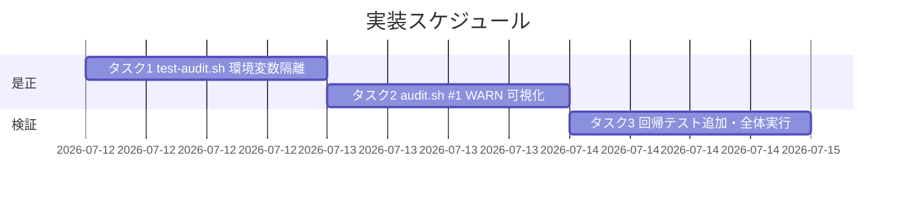

# 実装計画書: test-audit.sh 必須ファイル欠落検知の AGENTS_ROOT 環境変数汚染是正

**プロジェクト名**: test-audit.sh 必須ファイル欠落検知の AGENTS_ROOT 環境変数汚染是正
**作成日**: 2026 年 07 月 12 日
**最終更新**: 2026 年 07 月 12 日

> **重要**: **このドキュメントは常に更新**: 実装計画の変更・進捗・バグの記録があった場合は、即座に更新すること。
>
> **用語**: [.agent-skill-chain/source/CONCEPTS.md §用語規約](../../../../../../../.agent-skill-chain/source/CONCEPTS.md#用語規約) を参照。

---

## 1. 実装概要

### 1.1 実装方針

[02_設計.md](./02_設計.md) の ADR-1（テスト側 hermetic 隔離）を主対策、ADR-2（audit.sh #1 の WARN 可視化）を defense-in-depth として、既存判定ロジック・終了コード・呼び出し IF を変えずに最小差分で実装する。

### 1.2 実装順序



1. **タスク1**: `test-audit.sh` 冒頭に環境変数隔離ブロックを追加（主対策）。
2. **タスク2**: `audit.sh` #1 に明示指定判別＋WARN 分岐を追加（防御的）。
3. **タスク3**: 回帰シナリオを `test-audit.sh` に追加し、汚染・クリーン両 env で全体実行して受け入れ基準を実測確認。

---

## 2. タスク分解

**参照**: 各タスクのテスト観点定義は [02_設計 §6](./02_設計.md) および [RULES §テスト戦略必須要件](../../../../../../../.agent-skill-chain/source/RULES.md#テスト戦略必須要件)・[TEST_BDD_FORMAT.md](../../../../../../../.agent-skill-chain/source/TEST_BDD_FORMAT.md) を参照。以下は本タスクの具体ケースのみ記載する。

### 2.1 タスク 1: test-audit.sh の環境変数隔離（主対策）

#### 2.1.1 概要

呼び出し元シェルの汚染に依存せず全 `make_min_tree` 系シナリオを既定解決で実行するため、`test-audit.sh` 冒頭で `audit.sh` の上書き系入力変数を一括 `unset` する。

#### 2.1.2 実装内容

- `test/test-audit.sh` の `set -uo pipefail`（現行 23 行目）直後に、隔離ブロックを追加する:
  ```bash
  # 呼び出し元シェルの環境変数汚染からテストを隔離する（audit.sh の上書き入力のうち、
  # テストが呼び出しごとに設定しないものを unset して既定解決を保証する）。
  # 背景・根拠: 02_設計 ADR-1（AGENTS_ROOT 汚染で #1 が偽陰性化する既存不具合の是正）。
  unset AGENTS_ROOT WORKFLOW_DIR WORKFLOW_DIRS PR_BODY CODE_COMMENT_SRC_DIRS REVIEWDOCS_GATE_EFFECTIVE_FROM
  ```
- `AUDIT_GIT_RANGE` は各 GIT_RANGE テストが per-invocation で設定するため対象外（[02 §3.1.2](./02_設計.md)）。
- 変更理由（本 issue の根本原因）をコメントとして残す（[01 §3.3 ユーザビリティ要件](./01_要件定義.md)）。

#### 2.1.3 テスト観点

**参照**: [02_設計 §6.1](./02_設計.md)。以下は本タスクの具体ケース。

##### 単体（必須 1 件以上）

- 汚染 env（`AGENTS_ROOT` を壊れたテンプレート値で export）を継承して `bash test/test-audit.sh` を実行すると、シナリオ3の 2 アサーション（`exit != 0`・"Missing required file"）が PASS する（隔離ブロックにより既定解決される）。
- 未設定 env・set-but-empty env のいずれでも、隔離後 `audit.sh` は既定 `.agent-skill-chain/source` を解決に用いる。

##### 結合/API

- 該当なし（サブプロセス実行はテスト構造上の E2E で担保）。

##### E2E/受け入れ

- `AGENTS_ROOT='${CLAUDE_PROJECT_DIR}/.agent-skill-chain/source' bash test/test-audit.sh` の最終行が `FAIL=0`（AC-1）。
- クリーン env での `bash test/test-audit.sh` が是正前の PASS シナリオを全維持し新規 FAIL ゼロ（AC-2）。

##### バリデーション

- unset 対象は許可リスト（[02 §3.1.2](./02_設計.md)）に限定し、無関係変数を unset しないこと。

#### 2.1.4 単体テスト仕様（BDD）

```gherkin
Feature: test-audit.sh の環境変数汚染耐性
  Scenario: AGENTS_ROOT 汚染を継承してもシナリオ3が意図どおり動作する
    Given 呼び出し元シェルに AGENTS_ROOT=${CLAUDE_PROJECT_DIR}/.agent-skill-chain/source が export されている
    When bash test/test-audit.sh を実行する
    Then シナリオ3の "必須ファイル欠落で exit != 0" が PASS する
    And シナリオ3の "Missing required file メッセージを出す" が PASS する
    And 最終集計が FAIL=0 である
```

**テストコード例（インライン Given/When/Then）**

```bash
# Given: 汚染 env を明示的に継承させる
export AGENTS_ROOT='${CLAUDE_PROJECT_DIR}/.agent-skill-chain/source'
# When: 隔離ブロックを持つ test-audit.sh を実行する
out="$(bash test/test-audit.sh 2>&1)"; rc=$?
# Then: 汚染下でも全 PASS（FAIL=0・rc=0）
grep -q '== 結果: PASS=[0-9]\+ FAIL=0 ==' <<< "$out" && [[ $rc -eq 0 ]]
```

#### 2.1.5 依存関係

- なし（先頭タスク）。

#### 2.1.6 見積もり

- **工数**: 0.5h
- **優先度**: 高

### 2.2 タスク 2: audit.sh #1 の解決失敗可視化（WARN・防御的）

#### 2.2.1 概要

`AGENTS_ROOT` が明示指定され、かつ解決先ディレクトリが不在のとき、必須ファイルチェックを無条件成功にせず WARN で可視化する（既定値＋不在は従来どおり静かに SKIP）。

#### 2.2.2 実装内容

- `.agent-skill-chain/source/enforcement/ci/audit.sh:83` の default 置換の直前に明示指定フラグを捕捉:
  ```bash
  if [[ -n "${AGENTS_ROOT:-}" ]]; then AGENTS_ROOT_EXPLICIT=1; else AGENTS_ROOT_EXPLICIT=0; fi
  AGENTS_ROOT="${AGENTS_ROOT:-.agent-skill-chain/source}"
  ```
- 同ファイル #1（`audit.sh:217` の `if [[ -d "$PROJECT_ROOT/$AGENTS_ROOT" ]]; then ... fi`）に else 分岐を追加:
  ```bash
  elif [[ "$AGENTS_ROOT_EXPLICIT" == "1" ]]; then
    echo "WARN: AGENTS_ROOT が明示指定されていますが解決先ディレクトリが存在しません（環境変数の設定ミス/汚染の可能性・必須ファイルチェックをスキップします）: $AGENTS_ROOT (resolved: $PROJECT_ROOT/$AGENTS_ROOT)" >&2
  fi
  ```
- 終了コード（`EXIT_CODE`）は変更しない（後方互換）。既定値＋不在の場合は WARN も出さず従来どおり静かに SKIP。
- 変更理由をコメントで残す（[01 §3.3](./01_要件定義.md)）。コメント外部参照禁止（#26）に触れないよう、章節番号・PR/issue 番号・仕様ファイル名を audit.sh のコメントに書かない（散文の一般的説明に留める）。

#### 2.2.3 テスト観点

##### 単体（必須 1 件以上）

- 明示指定 `AGENTS_ROOT=/nonexistent/xyz` かつ最小ツリー（必須ファイルは既定パスに存在）で `audit.sh <tmp>` を実行 → stderr に `WARN: AGENTS_ROOT が明示指定` を含み、終了コードは 0（無条件成功でなく可視化・非 FAIL）。
- 既定値（`AGENTS_ROOT` 未設定）かつ既定パス不在（`.agent-skill-chain/source` を作らない最小ツリー）で実行 → WARN を出さず #1 は静かに SKIP（非採用消費者を誤 FAIL しない）。
- 既定値かつ必須ファイル欠落（`CORE.md` 削除・既存シナリオ3相当）→ 従来どおり `FAIL: Missing required file` で exit != 0（判定ロジック不変）。

##### 結合/API

- 該当なし。

##### E2E/受け入れ

- クリーン env の全体実行で #1 の既存 PASS（T1 等）が退行しない（AC-5）。

##### バリデーション

- set-but-empty（`AGENTS_ROOT=`）は非明示扱いで既定解決に落ち、WARN を出さないこと。

#### 2.2.4 単体テスト仕様（BDD）

```gherkin
Feature: audit.sh の AGENTS_ROOT 解決失敗時の挙動
  Scenario: 明示指定の解決先が不在なら無条件成功にせず WARN で可視化する
    Given AGENTS_ROOT が存在しないディレクトリを明示的に指す
    And 必須ファイルは既定パスに揃った最小ツリー
    When audit.sh <tmp> を実行する
    Then stderr に "WARN: AGENTS_ROOT が明示指定" を含む
    And 終了コードは 0（非 FAIL・非サイレント）

  Scenario: 既定値で解決先が不在なら従来どおり静かに SKIP する
    Given AGENTS_ROOT を設定せず .agent-skill-chain/source も存在しない最小ツリー
    When audit.sh <tmp> を実行する
    Then #1 由来の WARN も FAIL も出ない
```

**テストコード例（インライン Given/When/Then）**

```bash
# Given: 明示指定の不在パス＋必須ファイルは既定パスに存在する最小ツリー
tree="$(make_min_tree)"
# When: 明示 AGENTS_ROOT を不在パスにして audit を実行
out="$(AGENTS_ROOT='/nonexistent/xyz' bash "$AUDIT" "$tree" 2>&1)"; rc=$?
# Then: 無条件成功でなく WARN を可視化し、終了コードは 0（非 FAIL）
grep -q 'WARN: AGENTS_ROOT が明示指定' <<< "$out" && [[ $rc -eq 0 ]]
```

#### 2.2.5 依存関係

- タスク1（隔離ブロック）に非依存だが、タスク3 の回帰テストは本タスクの WARN 文言に依存する。

#### 2.2.6 見積もり

- **工数**: 0.5h
- **優先度**: 高

### 2.3 タスク 3: 回帰テスト追加・全体実測

#### 2.3.1 概要

タスク1/2 を恒久的に守る回帰シナリオを `test/test-audit.sh` に追加し、汚染・クリーン両 env で全体実行して受け入れ基準を実測する。

#### 2.3.2 実装内容

- `test/test-audit.sh` に新規シナリオを追加（`make_min_tree` を用い tmp 隔離）:
  - **ENV-1（audit.sh #1 WARN）**: 明示 `AGENTS_ROOT=/nonexistent/...` で `audit.sh <tmp>` を実行し、stderr に WARN を含み exit 0 であることを ok/ng で判定。
  - **ENV-2（既定値 SKIP 不変）**: `.agent-skill-chain/source` を欠いた（=既定パス不在の）ツリーに対し、`AGENTS_ROOT` 未設定で #1 由来 WARN/FAIL が出ないことを判定（非採用消費者の SKIP 維持）。
  - 既存シナリオ3（必須ファイル欠落 FAIL）は隔離ブロック導入で汚染非依存＝決定的になる（追加改変不要）。
- 集計 `== 結果: PASS=N FAIL=0 ==` を汚染・クリーン両 env で確認。

#### 2.3.3 テスト観点

##### 単体

- ENV-1/ENV-2 が上記 Then を満たす。

##### 結合/API

- 該当なし。

##### E2E/受け入れ（必須・未達時は理由記載）

- `AGENTS_ROOT='${CLAUDE_PROJECT_DIR}/.agent-skill-chain/source' bash test/test-audit.sh` → `FAIL=0`（AC-1）。
- `env -u AGENTS_ROOT bash test/test-audit.sh` → 既存 PASS 全維持・新規 FAIL ゼロ＋追加シナリオ PASS（AC-2）。
- 汚染 env で最小ツリー（`CORE.md` 欠落）へ `audit.sh` 直接実行しても、隔離を経たテスト経路では `FAIL: Missing required file` が出る（[00 §6 成功基準](./00_要求定義.md) 3 点目）。

##### バリデーション

- 追加シナリオは本番ファイルを変更しない（`make_min_tree` の tmp 隔離のみ・[自己拡張ワークフロー §テストの tmp 隔離](../../../../../../../.agent-skill-chain/project/自己拡張ワークフロー.md)）。

#### 2.3.4 単体テスト仕様（BDD）

```gherkin
Feature: 回帰の恒久化
  Scenario: 追加シナリオを含め汚染・クリーン両 env で FAIL=0
    Given test-audit.sh に ENV-1/ENV-2 を追加した状態
    When 汚染 env とクリーン env の双方で bash test/test-audit.sh を実行する
    Then いずれも最終集計が FAIL=0 である
```

**テストコード例（インライン Given/When/Then）**

```bash
# Given: 追加シナリオ込みの test-audit.sh
# When: 汚染 env で実行
o1="$(AGENTS_ROOT='${CLAUDE_PROJECT_DIR}/.agent-skill-chain/source' bash test/test-audit.sh 2>&1)"
# When: クリーン env で実行
o2="$(env -u AGENTS_ROOT bash test/test-audit.sh 2>&1)"
# Then: 双方 FAIL=0
grep -q 'FAIL=0 ==' <<< "$o1" && grep -q 'FAIL=0 ==' <<< "$o2"
```

#### 2.3.5 依存関係

- タスク1・タスク2 完了後に実施。

#### 2.3.6 見積もり

- **工数**: 0.5h
- **優先度**: 高

---

## テスト観点

- 汚染 env 継承下でも `test-audit.sh` シナリオ3が意図どおり必須ファイル欠落を検知する（偽陰性ゼロ・AC-1）。
- クリーン env で既存 32 監査項目・既存全シナリオが退行しない（回帰・AC-2/AC-5）。
- `audit.sh` #1 は「明示指定＋解決先不在」で無条件成功にせず WARN で可視化し、「既定値＋不在」は非採用消費者として静かに SKIP を維持する（AC-4/AC-6）。
- `audit.sh` の終了コード・呼び出し IF は不変（後方互換）。
- すべての検証は `make_min_tree` の tmp 隔離で行い本番ファイルを破壊しない。

---

## 単体テスト

- タスク1: 汚染 env / set-but-empty / 未設定の各条件で既定解決に落ちること。
- タスク2: 明示不在→WARN・exit0、既定不在→静かに SKIP、既定＋欠落→FAIL 不変、set-but-empty→非明示。
- タスク3: ENV-1（WARN）・ENV-2（既定 SKIP）を `test-audit.sh` に恒久化。

---

## BDD

- §2.1.4 test-audit.sh の環境変数汚染耐性（汚染継承でシナリオ3 PASS）。
- §2.2.4 audit.sh の AGENTS_ROOT 解決失敗時の挙動（明示不在→WARN／既定不在→SKIP）。
- §2.3.4 回帰の恒久化（汚染・クリーン両 env で FAIL=0）。
- Given/When/Then 形式は [TEST_BDD_FORMAT.md](../../../../../../../.agent-skill-chain/source/TEST_BDD_FORMAT.md) に従う。

---

## 3. 実装スケジュール

### 3.1 マイルストーン

| マイルストーン | 期日 | 成果物 |
| -------------- | ---- | ------ |
| 主対策実装 | Day1 | test-audit.sh 隔離ブロック |
| 防御実装 | Day1 | audit.sh #1 WARN 分岐 |
| 回帰・受け入れ | Day1 | 追加シナリオ・両 env 実測ログ |

### 3.2 実装フェーズ

#### フェーズ 1: 是正と回帰

- **期間**: 1 日
- **タスク**: タスク1 → タスク2 → タスク3

---

## 4. テスト計画

**参照**: 観点・レベル・BDD 定義は [02_設計 §6](./02_設計.md) および RULES・TEST_BDD_FORMAT。

### 4.1 テストの優先順位

- 必須ファイル欠落検知（品質ゲート）は回帰に必ず含める（シナリオ3＋追加 ENV-1/ENV-2）。
- 影響範囲が広い `audit.sh` は既存全シナリオの退行なしを最優先で確認する。

---

## 5. リスク管理

### 5.1 実装リスク

- **リスク**: `audit.sh` #1 の分岐追加で既存 SKIP/FAIL 経路を壊す。
  - **対策**: 既定値＋実在の通常経路は完全不変とし、新分岐は「不在かつ明示指定」に限定。ENV-2 で既定不在 SKIP を、既存シナリオ3で既定欠落 FAIL を回帰確認。
- **リスク**: unset 対象の過不足（無関係変数の unset／必要変数の取りこぼし）。
  - **対策**: 許可リスト（[02 §3.1.2](./02_設計.md)）に限定し、根拠を表で明示。`AUDIT_GIT_RANGE` は per-invocation 設定のため対象外と定義。
- **リスク**: `audit.sh` コメントが #26（コメント外部参照禁止）に誤触。
  - **対策**: 変更理由コメントに章節番号・issue/PR 番号・仕様ファイル名を書かず一般的散文に留める。

---

## 6. 参考資料

### プロジェクトドキュメント

- [`02_設計.md`](./02_設計.md) - 設計

### その他の参考資料

- `.agent-skill-chain/source/enforcement/ci/audit.sh`（83・217-225 行目）
- `test/test-audit.sh`（23・43-53・91-99 行目）

---

## 7. 前のステップ

- **前**: [`02_設計.md`](./02_設計.md) - 設計フェーズ

---

## 8. 次のステップ

- 本 issue は単一サブ issue であり分割しない（親 90_issues.md は既存）。
- **次**: 実装着手前に review-docs（実装前ドキュメントレビュー）を必須で経る（[design-feature DoD](../../../../../../../.agent-skill-chain/source/commands/design-feature.md)）。その後 implement-feature へ。

**用語**: [.agent-skill-chain/source/CONCEPTS.md §用語規約](../../../../../../../.agent-skill-chain/source/CONCEPTS.md#用語規約) を参照。
