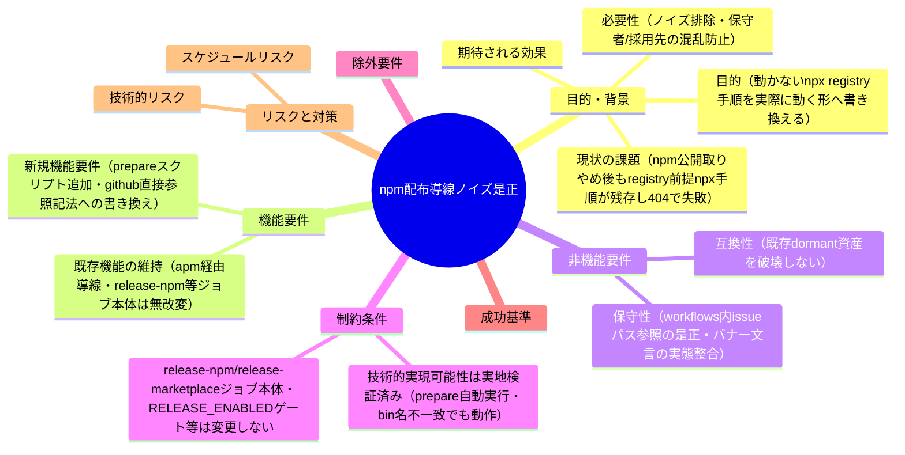
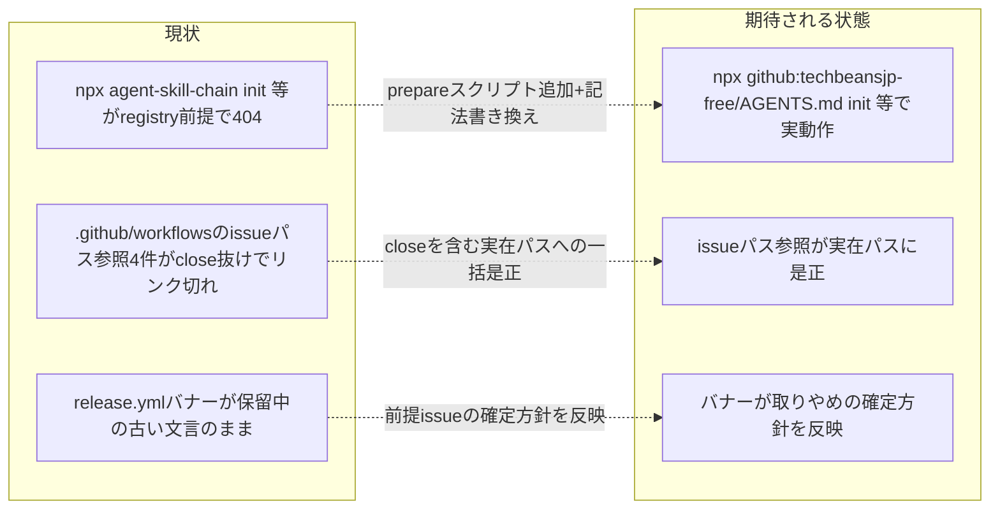

# 要求定義書: npm 配布導線ノイズ是正と .github/workflows 陳腐化参照の是正

**プロジェクト名**: npm配布導線ノイズ是正
**作成日**: 2026 年 07 月 12 日
**最終更新**: 2026 年 07 月 12 日

> **重要**:
>
> - 要求定義書は、プロジェクトの全体像を把握するためのものです。詳細な技術仕様や実装方法は要件定義書以降で記載します。必要最低限の情報に収めることを心掛けてください。
> - **このドキュメントは常に更新**: 要求の変更や追加があった場合は、即座にこのドキュメントを更新してください。ドキュメントは「生きているドキュメント」として扱い、実装内容と常に同期させます。
> - **必須項目**: 以下の「必須」と明記した項目は空欄・抽象語のみ（例: 「{説明}」のまま）で提出しないこと。判定可能な形（目的は1文・成功基準は○/×で判定できる記載等）で記入すること。
>
> **用語**: [.agent-skill-chain/source/CONCEPTS.md §用語規約](../../../../../.agent-skill-chain/source/CONCEPTS.md#用語規約) を参照。

---

## 要求定義の全体像

**注意**:

- マインドマップは全体像を把握するためのものであり、詳細は本文の各セクションに記載する。

---

## 1. 目的・背景

### 1.1 目的（必須）

npm registry 前提で動かない npx 手順記載を GitHub 直接参照の実動作手順へ書き換え、`.github/workflows` の陳腐化した issue パス参照・古い方針文言を是正する。

### 1.2 背景

- **現状の課題**:
  - **課題1（npm 配布導線のノイズ）**: `README.md` §導入「1. npm 経由（開発者・自己拡張向けの補助導線。npm 公開は取りやめ済み）」は、`npx agent-skill-chain init` 等のサブコマンド（`init`/`upgrade`/`uninstall`/`doctor`/`enforce`）を npm レジストリ経由の呼び出しとして詳細記載している。しかし、npm 公開が取りやめ済み（[`../close/20260711_015030_agentsOS汎用化_ポリシー統合/90_issues/20260711_024021_npm公開中止_APM転換/00_要求定義.md`](../close/20260711_015030_agentsOS汎用化_ポリシー統合/90_issues/20260711_024021_npm公開中止_APM転換/00_要求定義.md)、以下「前提 issue」）のため、外部の採用先プロジェクトから当該手順をそのまま実行すると `npx` は npm レジストリに `agent-skill-chain` パッケージを探しに行き 404 で失敗する。「取りやめ済み」と明記しつつ動かない手順を長々記載しているのは、ユーザー曰く「完全にノイズ」である。
  - **課題2（同型の問題が他ファイルにも存在）**: grep で確認済み。
    - `.agent-skill-chain/source/SETUP.md` 193〜195 行目（uninstall のコマンド例、`npx agent-skill-chain uninstall` 等）— このファイルは正本であり setup 時に消費者プロジェクトの `.agent-skill-chain/source/SETUP.md` にコピーされるため、外部へ配布される。
    - `docs/maintainer/claude-hook-e2e.md` 18, 24, 25 行目（`npx agent-skill-chain init` / `enforce on` / `enforce status`）— 保守者向け非配布ドキュメントだが、手順内の `/tmp/hook-e2e` という外部一時ディレクトリで実行する体裁のため、同じく registry 前提で動かない。
  - **課題3（`.github/workflows` の陳腐化）**: `.github/workflows/self-enforce.yml` の 16, 57, 100 行目、`.github/workflows/release.yml` のヘッダーコメント内で参照している計 4 件の issue ドキュメント（`20260614_124435_配布とパッケージ構成の再設計`、`20260615_054810_カバレッジ計測の自リポ適用`、`20260615_114305_bin生成物のgitignore化とpublish時ビルド`、`20260616_144601_npm公開を今後の課題化_自動リリース現状無効化`）は、いずれも issue クローズに伴い実際には `docs/maintainer/workflow/close/` 配下へ移動済みである。`ls` で `docs/maintainer/workflow/` 直下に非存在・`docs/maintainer/workflow/close/` 配下に実在することを確認済み（evidence_source: オーケストレータによる実地検証、`ls` コマンドで4件とも `close/` 配下への移動を確認）。self-enforce.yml の 3 件はコメント内に `docs/maintainer/workflow/<issue>/...` というフルパスを記載しており `close/` が抜けているためリンク切れ、release.yml の 1 件はヘッダーバナー内で issue ディレクトリ名のみを地の文で参照しており（`経緯は自己拡張 issue 20260616_144601_npm公開を今後の課題化_自動リリース現状無効化 を参照。`）、読者が `docs/maintainer/workflow/` 直下を探しても見つからない状態になっている。
  - **課題4（release.yml バナー文言の陳腐化）**: `.github/workflows/release.yml` 冒頭（1〜18 行目）のバナーコメントは「npm 公開は今後の課題として保留中」という 2026-06-16 時点（前提 issue 以前）の方針文言のままである。その後 2026-07-11 の前提 issue で「npm 公開自体を取りやめる」というより明確な方針へ転換済みだが、バナー文言がこの新しい決定を反映しておらず、読者に古い（保留中という弱い）ニュアンスを与える。

- **必要性**:
  - 外部の採用先プロジェクトが README の手順どおりに `npx agent-skill-chain init` を実行して 404 に遭遇する事態を防ぐ（実害の防止）。
  - 保守者が `.github/workflows` のコメントを読んだときに、存在しないパスへ誘導されたり、既に上書き済みの古い方針を正だと誤認したりすることを防ぐ（保守性の維持）。

- **技術的な実現可能性（evidence_source: オーケストレータによる実地検証、scratchpad 隔離環境）**:
  - npm/npx の `prepare` ライフサイクルスクリプトは、git 経由インストール（`npm install git+<url>` および `npx git+<url>` / `npx github:owner/repo`）時に自動実行されることを、`/tmp/claude-1000/-home-adachi-projects-AGENTS-md/30db091a-9e78-4c90-9c77-e491721ffe18/scratchpad/prepare-test*/` に作成した使い捨て git リポジトリで実地検証済み。これにより、`.gitignore` 対象で未追跡の `bin/agents-md.js`（tsc ビルド生成物）を持つ本パッケージでも、`package.json` に `"prepare": "npm run build"` を追加すれば、GitHub から直接 `npx github:techbeansjp-free/AGENTS.md init` のような形で実行したときに自動ビルドされ、正しく動作する。
  - `bin` フィールドのキー名（`agents-md`）が `package.json` の `name`（`agent-skill-chain`）・リポジトリ名と一致していなくても、bin エントリが 1 個だけであれば npx は問題なく実行できることも同じ隔離環境で実地検証済み。
  - 上記の検証は、いずれも本リポジトリのファイルには一切書き込んでいない使い捨て環境で行われた。

- **確定した方針（ユーザー承認済み・オプション比較は不要、この方針で確定）**: この補助導線は「削除」ではなく「実際に動く形へ書き換える」。
  - (a) `package.json` に `"prepare": "npm run build"` を追加する。
  - (b) README/SETUP.md/claude-hook-e2e.md の `npx agent-skill-chain <cmd>` という registry 前提の記法を `npx github:techbeansjp-free/AGENTS.md <cmd>` という GitHub 直接参照の記法に書き換える。
  - (c) バージョンピン留めの例（現状 `npx agent-skill-chain@0.1.0 init` という registry 前提の semver 指定）も `npx github:techbeansjp-free/AGENTS.md#<tag-or-branch> <cmd>` という git ref 指定に書き換える。
  - (d) 「npm 経由」という見出し・導入文言も「npm レジストリを経由しない（GitHub 直接）」という実態に即して修正する。

### 1.3 期待される効果（必須: 1 件以上）

- **効果 1**: README.md §導入・SETUP.md・claude-hook-e2e.md の `npx agent-skill-chain <cmd>` 記法がすべて `npx github:techbeansjp-free/AGENTS.md <cmd>` 記法に書き換わり、外部の採用先プロジェクトで実行しても 404 にならず実際に動作する（達成判定: 各ファイルの該当箇所に registry 前提の `npx agent-skill-chain` 表記が残っていないこと、かつ `package.json` に `prepare` スクリプトが追加されていること）。
- **効果 2**: `.github/workflows/self-enforce.yml`・`release.yml` のコメント中の issue パス参照 4 件がすべて `close/` を含む実在パスに是正され、リンク切れが解消する（達成判定: 4 件のパス参照がすべて `docs/maintainer/workflow/close/<issue>/...` の実在パスまたは正しい issue ディレクトリ名を指しているか）。
- **効果 3**: `release.yml` 冒頭バナーの「npm 公開は今後の課題として保留中」という文言が、前提 issue で確定した「npm 公開自体を取りやめる」という方針を反映した文言へ更新される（達成判定: バナー文言が「保留中」ではなく「取りやめ」の実態を示しているか）。

**現状と期待される状態の比較**（必要に応じて）:

---

## 2. 機能要件

### 2.1 既存機能の維持（該当する場合）

- `apm install` を一次配布導線とする既存の README §0 の記載は変更しない（前提 issue で整備済み）。
- `.github/workflows/release.yml` の `release-npm`／`release-marketplace`／`apm-release` ジョブ本体・dormant ゲート（`RELEASE_ENABLED`）・`NPM_TOKEN` ゲート等の**ジョブロジック自体**は無改変で保持する（前提 issue `02_設計.md` §2.6.4「既存 dormant 資産は無改変で保持」の決定を継承・破壊しない）。
- `package.json` の `name`／`bin`／`publishConfig`／`files` 等の既存フィールドは変更しない（`prepare` フィールドの追加のみ）。

### 2.2 新規機能要件

- **A. `package.json` への `prepare` スクリプト追加**: `"prepare": "npm run build"` を追加し、git 経由インストール時に自動ビルドされるようにする。
- **B. npx 記法の GitHub 直接参照への書き換え**: README.md §導入・SETUP.md（uninstall 節）・claude-hook-e2e.md の `npx agent-skill-chain <cmd>` を `npx github:techbeansjp-free/AGENTS.md <cmd>` へ書き換える。
- **C. バージョンピン留め例の git ref 指定への書き換え**: `npx agent-skill-chain@0.1.0 init` のような semver 指定例を `npx github:techbeansjp-free/AGENTS.md#<tag-or-branch> init` のような git ref 指定例へ書き換える。
- **D. 「npm 経由」見出し・導入文言の実態整合**: README.md §導入の見出し「1. npm 経由（開発者・自己拡張向けの補助導線。npm 公開は取りやめ済み）」を、npm レジストリを経由しない実態（GitHub 直接参照）に即した文言へ修正する。
- **E. `.github/workflows` のリンク切れ是正**: self-enforce.yml 16, 57, 100 行目・release.yml ヘッダーコメント内の issue パス参照 4 件を、`close/` を含む実在パスまたは正しい参照に是正する。
- **F. release.yml バナー文言の方針整合**: release.yml 冒頭バナーの「npm 公開は今後の課題として保留中」という文言を、前提 issue で確定した「npm 公開自体を取りやめる」という方針を反映した文言へ更新する（ジョブ本体・ゲートのロジックは変更しない）。

---

## 3. 非機能要件

### 3.1 パフォーマンス

- 特段の性能要件はない。ドキュメント・設定ファイルの記述修正が中心である。

### 3.2 セキュリティ

- 特段のセキュリティ要件はない。`prepare` スクリプトは既存の `npm run build`（`tsc && chmod +x bin/agents-md.js`）をそのまま呼ぶのみであり、新規の外部通信・権限昇格は伴わない。

### 3.3 互換性

- 既存の `apm install` 導線・`.claude-plugin/marketplace.json` 副導線とは独立して修正する（互いに影響しない）。
- `.github/workflows` の修正はコメント・バナー文言のみに限定し、ジョブの実行トリガ・ステップ・ゲート条件（`if:` 条件式等）は一切変更しない。

### 3.4 保守性

- npx 記法の書き換えにより、今後 npm 公開を再開しない限り、外部読者が誤って registry 前提の手順を実行するリスクが解消される。
- `.github/workflows` のコメントが実在パスを指すことで、保守者が今後同種のコメントを追加・更新する際の参照先の信頼性が保たれる。

---

## 4. 制約条件

### 4.1 技術的制約

- 技術的な実現可能性（`prepare` スクリプトの自動実行・bin 名不一致でも動作する点）は、オーケストレータが scratchpad の使い捨て git リポジトリで実地検証済みであり、本 issue ではこれを既定事実として引き継ぐ（再検証不要）。
- `npx github:owner/repo <subcommand>` の記法は、`package.json` の `bin` エントリ名（`agents-md`）に依存せず動作することが検証済みのため、`bin` フィールド自体の変更は不要。

### 4.2 既存システムとの互換性

- `.github/workflows/release.yml` の `release-npm`／`release-marketplace`／`apm-release` ジョブ本体・`RELEASE_ENABLED` ゲート・`NPM_TOKEN` ゲートは、前提 issue `02_設計.md` §2.6.4 の決定どおり無改変で保持する。今回の要求はコメント内のリンク切れパス修正とバナー文言の実態整合のみに限定する。
- README.md §0（apm 経由）・§2（Claude marketplace 経由）・§3（ローカル配備）は変更しない。

### 4.3 移行期間・スケジュール

- 特段の移行期間は不要。ドキュメント・設定ファイルの記述修正であり、即時反映可能。

---

## 5. 除外要件

- npm publish 再開の検討・実施（前提 issue の決定を継承し対象外）。
- パッケージ名・CLI コマンド名（`agent-skill-chain`／`agents-md`）の変更（前提 issue で却下済みのため対象外）。
- `.github/workflows/release.yml` の `release-npm`／`release-marketplace`／`apm-release` ジョブ本体・`RELEASE_ENABLED` ゲート・`NPM_TOKEN` ゲート等のロジック改変（コメント・バナー文言の修正のみを対象とし、ジョブロジックは対象外）。
- README.md「リリース手順（メンテナ向け）」節（§2 配下、`.github/workflows/release.yml` へのリンクを含む段落）に現れる「現在npm公開は今後の課題として保留中であり」という同種の古い文言の是正（`.github/workflows` 2 ファイルのコメント・バナーに限定するという本要求のスコープ外。必要であれば別 issue で扱う）。
- `docs/maintainer/RELEASE.md` の詳細手順書の改訂（本要求の対象ファイル一覧に含まれないため対象外）。
- `apm.yml`・`.apm/` 等 apm 配布経路自体の仕様変更（前提 issue の対象であり本 issue では扱わない）。

---

## 6. 成功基準（必須: 1 件以上）

- **SC-1**: README.md §導入「1. npm 経由」の見出し・導入文言が、npm レジストリを経由しない実態（GitHub 直接参照）に即した文言へ修正されている（○/×: 見出し・導入文が「取りやめ済み」の補助説明のみでなく実行方法の実態を正しく示しているか）。
- **SC-2**: README.md・SETUP.md（uninstall 節）・claude-hook-e2e.md 中の `npx agent-skill-chain <cmd>` という registry 前提の記法が、すべて `npx github:techbeansjp-free/AGENTS.md <cmd>` という GitHub 直接参照の記法に書き換えられている（○/×: 3 ファイルすべてで registry 前提の記法が残っていないか）。
- **SC-3**: バージョンピン留めの例が `npx github:techbeansjp-free/AGENTS.md#<tag-or-branch> <cmd>` という git ref 指定の記法に書き換えられている（○/×: README.md の該当箇所が git ref 指定例になっているか）。
- **SC-4**: `package.json` に `"prepare": "npm run build"` が追加されている（○/×: `package.json` の `scripts` に `prepare` キーが存在し値が `npm run build` であるか）。
- **SC-5**: `.github/workflows/self-enforce.yml`（16, 57, 100 行目）・`release.yml`（ヘッダーコメント）の issue パス参照 4 件すべてが、`close/` を含む実在パスまたは正しい参照に是正されている（○/×: 4 件それぞれが `docs/maintainer/workflow/close/<issue>/` 配下の実在ファイルを指しているか、または実在する issue ディレクトリ名を正しく参照しているか）。
- **SC-6**: `.github/workflows/release.yml` 冒頭バナーの「npm 公開は今後の課題として保留中」という文言が、前提 issue で確定した「npm 公開自体を取りやめる」方針を反映した文言へ更新されている（○/×: バナー文言が「保留中」ではなく「取りやめ」の実態を示しているか）。かつジョブ本体・ゲートのロジック（`if:` 条件式・step 定義）が一切変更されていない（○/×: `git diff` で bash/yaml のロジック行に差分が無いか）。

---

## 7. リスクと対策

### 7.1 技術的リスク

- **リスク**: `prepare` スクリプト追加後、`npm ci`（開発者のローカル環境・CI）実行時に毎回 `npm run build` が走ることで、既存の CI ステップ（self-enforce.yml の明示的な `npm run build` 呼び出し等）と重複実行になり、ビルド時間がわずかに増加する可能性がある。
  - **対策**: `tsc` は冪等（差分が無ければ同一生成物を再出力するのみ）であり、CI の正当性（生成物差分ゼロ検証等）を壊さない。設計フェーズで既存 CI ステップとの重複実行が許容範囲か確認する。
- **リスク**: `npx github:techbeansjp-free/AGENTS.md <cmd>` の記法が、ブランチ名にスラッシュを含む場合や特定の git ref 指定で期待どおり解決しない可能性がある（実地検証は `main` ブランチ・タグなしの単純ケースで実施済みであり、全 ref パターンを網羅検証したわけではない）。
  - **対策**: 00・01 では基本形（`main` ブランチ相当の既定 ref）の動作を確定事実として記載し、タグ ref 等の詳細な検証は設計・実装フェーズで扱う。

### 7.2 スケジュールリスク

- **リスク**: `.github/workflows` の 2 ファイルはいずれも稼働中の CI 定義であり、コメント修正であっても誤ってロジック行を変更すると CI が壊れる可能性がある。
  - **対策**: 実装フェーズでは差分をコメント・バナー文言のみに限定し、`git diff` でロジック行（`if:`・`run:`・`on:` 等の実行可能行）に変更が無いことを確認してからコミットする（SC-6 の検証方法に明記済み）。

---

## 8. 参考資料

### プロジェクトドキュメント

- 前提 issue: [`../close/20260711_015030_agentsOS汎用化_ポリシー統合/90_issues/20260711_024021_npm公開中止_APM転換/00_要求定義.md`](../close/20260711_015030_agentsOS汎用化_ポリシー統合/90_issues/20260711_024021_npm公開中止_APM転換/00_要求定義.md) — npm 公開中止・APM 転換の確定方針の原典。
- 前提 issue: [`../close/20260711_015030_agentsOS汎用化_ポリシー統合/90_issues/20260711_024021_npm公開中止_APM転換/02_設計.md`](../close/20260711_015030_agentsOS汎用化_ポリシー統合/90_issues/20260711_024021_npm公開中止_APM転換/02_設計.md) — README §導入の apm install 導線追加・既存 dormant 資産無改変保持（§2.6.4）の設計根拠。

### その他の参考資料

- [`../../../../README.md`](../../../../../README.md) §導入 — 修正対象の npm 経由（補助導線）記載。
- [`../../../../package.json`](../../../../../package.json) — `prepare` スクリプト追加対象。
- [`../../../../.agent-skill-chain/source/SETUP.md`](../../../../../.agent-skill-chain/source/SETUP.md) — uninstall 節の npx 記法修正対象（正本であり配布物として消費者プロジェクトへコピーされる）。
- [`../../claude-hook-e2e.md`](../../claude-hook-e2e.md) — npx init/enforce 手順の記法修正対象（保守者向け非配布ドキュメント）。
- [`../../../../.github/workflows/release.yml`](../../../../../.github/workflows/release.yml) — ヘッダーバナー文言・issue パス参照の修正対象。ジョブ本体は変更しない。
- [`../../../../.github/workflows/self-enforce.yml`](../../../../../.github/workflows/self-enforce.yml) — issue パス参照（16, 57, 100 行目）の修正対象。

---

## 9. 次のステップ

この要求定義書の承認後、以下のドキュメントを作成します：

- **次**: [`01_要件定義.md`](./01_要件定義.md) - 要件定義フェーズ
