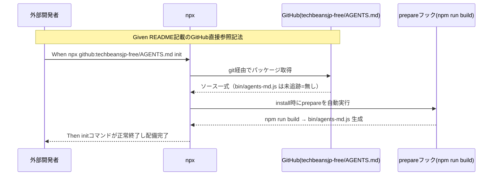

# 要件定義書: npm 配布導線ノイズ是正と .github/workflows 陳腐化参照の是正

**プロジェクト名**: npm配布導線ノイズ是正
**作成日**: 2026 年 07 月 12 日
**最終更新**: 2026 年 07 月 12 日

> **重要**: **このドキュメントは常に更新**: 要件の変更や追加があった場合は、即座にこのドキュメントを更新してください。ドキュメントは「生きているドキュメント」として扱い、実装内容と常に同期させます。
>
> **用語**: [.agent-skill-chain/source/CONCEPTS.md §用語規約](../../../../../.agent-skill-chain/source/CONCEPTS.md#用語規約) を参照。

---

## 1. 概要

### 1.1 システム概要

本パッケージ（agent-skill-chain）は、npm 公開を取りやめ `apm install` を一次配布導線としたが（前提 issue: npm公開中止_APM転換）、README.md・SETUP.md・claude-hook-e2e.md には依然として npm レジストリ経由の `npx agent-skill-chain <cmd>` という、実行すると 404 になる手順が「補助導線」として詳細に記載されている。また `.github/workflows/self-enforce.yml`・`release.yml` のコメントは、close 済み issue への相対パス参照がリンク切れになっているほか、release.yml のバナー文言が npm 公開に関する古い（保留中）方針のまま更新されていない。本要件は、これらのドキュメント・設定ファイル上のノイズと陳腐化参照を、実際に動作する記法・実在するパス・確定済みの新方針へ是正するものである。

### 1.2 用語集

| 用語 | 説明 |
|------|------|
| registry 前提の npx 記法 | `npx agent-skill-chain <cmd>` のように、npm レジストリに公開されたパッケージ名で `npx` を呼ぶ記法。本パッケージは npm 公開を取りやめているため、この記法は 404 で失敗する。 |
| GitHub 直接参照の npx 記法 | `npx github:owner/repo <cmd>` のように、npm レジストリを経由せず GitHub リポジトリを直接指定して `npx` を呼ぶ記法。`prepare` ライフサイクルスクリプトにより git 経由インストール時に自動ビルドされる。 |
| `prepare` スクリプト | `package.json` の `scripts.prepare`。`npm install`（git 経由含む）実行時に自動実行される npm ライフサイクルフック。本要件では `npm run build` を紐付け、未追跡の `bin/agents-md.js` を自動ビルドさせる。 |
| dormant ゲート | `.github/workflows/release.yml` の `RELEASE_ENABLED` リポジトリ変数による、ジョブの自動発火を止める可逆的な無効化機構。本要件では変更しない。 |

---

## 2. 機能要件

### 2.1 ユーザーストーリー

#### ストーリー 1: 外部採用先の開発者として、README の npm 経由手順をそのまま実行して動かしたい

- **As a** 本パッケージを別プロジェクトへ導入しようとする外部の開発者
- **I want to** README.md §導入「npm 経由」に記載された手順をそのままコピー＆ペーストして実行したい
- **So that** 手順が 404 で失敗し無駄な調査時間を費やすことなく、意図どおりパッケージを導入できる

**受け入れ基準**:

- README.md §導入の見出し「1. npm 経由（開発者・自己拡張向けの補助導線。npm 公開は取りやめ済み）」が、npm レジストリを経由しない実態（GitHub 直接参照）に即した見出し・導入文言へ修正されていること。
- `init`／`upgrade`／`uninstall`／`doctor`／`enforce`／`version`／`help` の各サブコマンド例が、すべて `npx github:techbeansjp-free/AGENTS.md <cmd>` という GitHub 直接参照の記法で記載されていること。
- バージョンピン留めの例（従来 `npx agent-skill-chain@0.1.0 init`）が `npx github:techbeansjp-free/AGENTS.md#<tag-or-branch> init` という git ref 指定の記法に書き換えられていること。

#### ストーリー 2: 保守者として、setup.sh 正本・保守ドキュメントの npx 例も一貫して動く形にしたい

- **As a** 本パッケージの保守者
- **I want to** `.agent-skill-chain/source/SETUP.md`（消費者プロジェクトへ配布される正本）と `docs/maintainer/claude-hook-e2e.md`（保守者向け E2E 手順書）に記載された npx コマンド例も、README と同じく GitHub 直接参照の記法に統一したい
- **So that** どのドキュメントを読んでも一貫して動作する手順が得られ、配布先での実行失敗や保守者自身の検証失敗を防げる

**受け入れ基準**:

- `.agent-skill-chain/source/SETUP.md` の uninstall コマンド例（193〜195 行目付近）が `npx github:techbeansjp-free/AGENTS.md uninstall` 等の GitHub 直接参照の記法に書き換えられていること。
- `docs/maintainer/claude-hook-e2e.md` の `npx agent-skill-chain init`／`enforce on`／`enforce status`（18, 24, 25 行目付近）が、同様に GitHub 直接参照の記法に書き換えられていること。
- `package.json` に `"prepare": "npm run build"` が追加されており、git 経由インストール時に未追跡の `bin/agents-md.js` が自動生成されること。

#### ストーリー 3: 保守者として、CI 定義のコメントが実在する issue を指し示す状態にしたい

- **As a** 本パッケージの保守者
- **I want to** `.github/workflows/self-enforce.yml`・`release.yml` のコメントに記載された issue パス参照が、実際に `docs/maintainer/workflow/close/` 配下へ移動済みの実在ファイルを指すようにしたい
- **So that** コメントを読んだ保守者がリンク切れに遭遇せず、正しい経緯ドキュメントへたどり着ける

**受け入れ基準**:

- `.github/workflows/self-enforce.yml` の 16, 57, 100 行目の issue パス参照（`docs/maintainer/workflow/20260614_124435_...`／`20260615_054810_...`／`20260615_114305_...`）が、それぞれ `docs/maintainer/workflow/close/<issue名>/...` という実在パスへ修正されていること。
- `.github/workflows/release.yml` ヘッダーコメント内の issue 参照（`20260616_144601_npm公開を今後の課題化_自動リリース現状無効化`）が、`close/` 配下へ移動済みである旨が分かる形（実在パスの明記、または移動済みである旨の付記）に修正されていること。
- 上記修正はコメント行のみを対象とし、`.github/workflows` 2 ファイルの `on:`／`if:`／`run:`／`jobs:` 等の実行可能なロジック行には一切差分が生じないこと。

#### ストーリー 4: 保守者として、release.yml のバナーが npm 公開の最新の確定方針を示すようにしたい

- **As a** 本パッケージの保守者・および release.yml を読む後続の開発者
- **I want to** `.github/workflows/release.yml` 冒頭バナーの「npm 公開は今後の課題として保留中」という文言を、2026-07-11 に確定した「npm 公開自体を取りやめる」という新しい方針に即した文言へ更新したい
- **So that** バナーを読んだ人が古い（保留中という弱い）ニュアンスに惑わされず、現在の確定方針を正しく理解できる

**受け入れ基準**:

- release.yml 冒頭バナーの「npm 公開は今後の課題として保留中」という文言が、「npm 公開自体を取りやめる」方針（前提 issue で確定）を反映した文言へ更新されていること。
- バナー内の再開手順・dormant ゲートの説明（`RELEASE_ENABLED`・`on: push` 復元手順等）自体のロジック説明は維持し、文言更新は方針の位置づけ部分に限定すること（ジョブ本体・ゲート条件の改変は伴わないこと）。

### 2.2 BDD ユースケース

#### ユースケース 1: 外部開発者が README の npm 経由手順で本パッケージを導入する

外部の採用先プロジェクトの開発者が、README.md §導入「1.」に記載された手順をそのまま実行し、パッケージが正しく配備されることを確認する。

**シナリオ 1: GitHub 直接参照の npx コマンドで init が成功する**

```gherkin
Feature: npm 配布導線の実動作化
  Scenario: 外部プロジェクトから GitHub 直接参照の npx init を実行する
    Given README.md §導入「1.」に npx github:techbeansjp-free/AGENTS.md init という
          GitHub 直接参照の記法が記載されている
    And 対象リポジトリの package.json に "prepare": "npm run build" が追加されている
    When 外部の採用先プロジェクトのルートで
         `npx github:techbeansjp-free/AGENTS.md init` を実行する
    Then npm レジストリへの問い合わせは発生せず、GitHub から直接パッケージが取得され
    And prepare フックにより bin/agents-md.js が自動ビルドされ
    And init コマンドが正常終了し AGENTS.md・.agent-skill-chain/source/ 等が配備される
```

**処理フロー**（必要に応じて）:



**シナリオ 2: 見出し・導入文言が実態を正しく示す**

```gherkin
Feature: npm 配布導線の実動作化
  Scenario: README の見出しが実態と一致する
    Given README.md §導入の従来の見出しが「1. npm 経由（npm 公開は取りやめ済み）」であった
    When README.md §導入の見出し・導入文言を確認する
    Then 見出しは npm レジストリを経由しない実態（GitHub 直接参照）を示す文言に修正されており
    And 「npm 公開は取りやめ済み」という補足だけでなく、実際の実行方法（GitHub 直接参照）が
        見出しまたは導入文の時点で分かるようになっている
```

#### ユースケース 2: 保守者が .github/workflows のコメント参照を実在パスへ是正する

保守者が `self-enforce.yml`・`release.yml` のコメントを確認し、参照先が実在することを検証する。

**シナリオ 1: self-enforce.yml の issue パス参照が実在パスを指す**

```gherkin
Feature: .github/workflows 陳腐化参照の是正
  Scenario: self-enforce.yml のコメント中パスがすべて実在する
    Given self-enforce.yml の16, 57, 100行目に
          docs/maintainer/workflow/<issue名>/... という参照コメントがある
    And 参照先の3 issueはいずれも docs/maintainer/workflow/close/<issue名>/ へ移動済みである
    When 各コメント中のパスを is -e で存在確認する
    Then 3件すべてのパスが docs/maintainer/workflow/close/ を含む実在パスに修正されており
    And ls コマンドでファイル実在が確認できる
```

**シナリオ 2: release.yml のロジック行に差分が生じない**

```gherkin
Feature: .github/workflows 陳腐化参照の是正
  Scenario: コメント修正がジョブロジックに影響しない
    Given release.ymlのヘッダーコメントとバナー文言の修正が完了している
    When git diff で release.yml の変更行を確認する
    Then 変更差分はコメント行（# で始まる行）とバナー文言のみであり
    And on:／if:／run:／jobs: 等の実行可能なYAML/シェルロジック行には一切差分がない
```

### 2.3 ビジネスルール

- npx 記法の書き換えは README.md・SETUP.md・claude-hook-e2e.md の 3 ファイルすべてに一貫して適用する（一部のみの修正は禁止。ノイズの部分的除去では「完全にノイズ」という課題認識を満たさない）。
- `.github/workflows` 2 ファイルの修正はコメント・バナー文言に限定し、`release-npm`／`release-marketplace`／`apm-release` ジョブ本体・`RELEASE_ENABLED` ゲート・`NPM_TOKEN` ゲートのロジックは一切変更しない。
- バージョンピン留めの書き換えは semver 指定（`@x.y.z`）から git ref 指定（`#<tag-or-branch>`）への変換であり、意味（特定版に固定する）は維持する。

---

## 3. 非機能要件

### 3.1 パフォーマンス要件

- `prepare` スクリプト追加による追加ビルド時間は許容範囲内（`tsc` の実行時間程度）とする。

### 3.2 セキュリティ要件

- `prepare` スクリプトは既存の `npm run build`（`tsc && chmod +x bin/agents-md.js`）を呼ぶのみとし、新規の外部通信・シークレット参照を追加しない。

### 3.3 ユーザビリティ要件

- README.md の手順は、外部開発者がコピー＆ペーストでそのまま実行できる完結した形で記載する（前提コマンドの省略・断片化を避ける）。

### 3.4 可用性要件

- 該当なし（本要件はドキュメント・設定ファイルの記述修正であり、稼働中のランタイムコンポーネントを持たない）。

---

## 4. 外部インターフェース要件

### 4.1 API 要件

- 該当なし。

### 4.2 データ形式要件

- `package.json` は既存の JSON スキーマ（npm の `scripts` フィールド）に従い `prepare` キーを追加する。
- `.github/workflows/*.yml` は既存の GitHub Actions ワークフロー構文を維持し、コメント行（`#` 始まり）のみを変更する。

---

## 5. 制約事項

- `.github/workflows/release.yml` の `release-npm`／`release-marketplace`／`apm-release` ジョブ本体・`RELEASE_ENABLED` ゲート・`NPM_TOKEN` ゲートは変更しない（前提 issue `02_設計.md` §2.6.4 の決定を継承）。
- README.md §0（apm 経由）・§2（Claude marketplace 経由）・§3（ローカル配備）は変更しない。
- README.md「リリース手順（メンテナ向け）」節の同種の古い文言（§2 配下）は本要件のスコープ外とする（00 §5 除外要件を参照）。
- パッケージ名・CLI コマンド名の変更は行わない。

---

## 6. 参考資料

### プロジェクトドキュメント

- [`00_要求定義.md`](./00_要求定義.md) - 要求定義

### その他の参考資料

- 前提 issue: [`../close/20260711_015030_agentsOS汎用化_ポリシー統合/90_issues/20260711_024021_npm公開中止_APM転換/00_要求定義.md`](../close/20260711_015030_agentsOS汎用化_ポリシー統合/90_issues/20260711_024021_npm公開中止_APM転換/00_要求定義.md)
- 前提 issue: [`../close/20260711_015030_agentsOS汎用化_ポリシー統合/90_issues/20260711_024021_npm公開中止_APM転換/02_設計.md`](../close/20260711_015030_agentsOS汎用化_ポリシー統合/90_issues/20260711_024021_npm公開中止_APM転換/02_設計.md)

---

## 7. 前のステップ

この要件定義書は、以下のドキュメントを基に作成されています：

- **前**: [`00_要求定義.md`](./00_要求定義.md) - 要求定義フェーズ

---

## 8. 次のステップ

この要件定義書の承認後、以下のドキュメントを作成します：

- **次**: [`02_設計.md`](./02_設計.md) - 設計フェーズ
