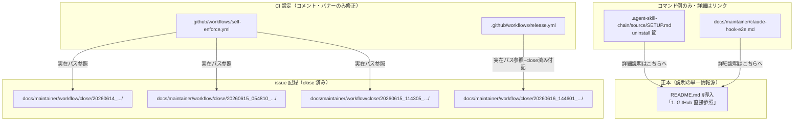
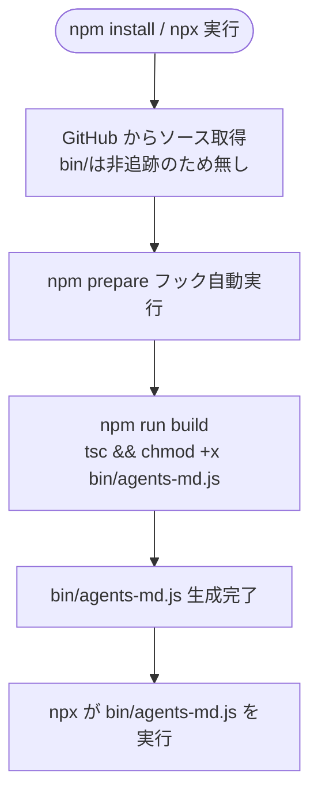

# 設計書: npm配布導線ノイズ是正

**プロジェクト名**: npm配布導線ノイズ是正
**作成日**: 2026 年 07 月 12 日
**最終更新**: 2026 年 07 月 12 日

> **重要**: **このドキュメントは常に更新**: 設計の変更や追加があった場合は、即座にこのドキュメントを更新してください。ドキュメントは「生きているドキュメント」として扱い、実装内容と常に同期させます。
>
> **用語**: [.agent-skill-chain/source/CONCEPTS.md §用語規約](../../../../../.agent-skill-chain/source/CONCEPTS.md#用語規約) を参照。

---

## 1. 設計概要

**必須**: 設計方針・原則は [.agent-skill-chain/source/spec/01_設計原則.md](../../../../../.agent-skill-chain/source/spec/01_設計原則.md) を**先に参照**した上で、本プロジェクトに**適用するものを選び**記載すること。

### 1.1 設計方針

本 issue はランタイムコードを持たず、**ドキュメント（README.md・SETUP.md・claude-hook-e2e.md）と設定ファイル（package.json・GitHub Actions ワークフロー 2 本）の記述修正**が対象である。設計の主眼は「新規アーキテクチャの導入」ではなく、**単一責務（DRY）**に基づき説明文言の重複を避けつつ、**実際に動く記法**へ機械的かつ一貫して置き換えることにある。

### 1.2 設計原則（本プロジェクトで適用するもの）

- **単一責務**: 「GitHub 直接参照で動作する」という事実の説明は README.md §導入の 1 箇所のみを正本とし、SETUP.md・claude-hook-e2e.md はコマンド例の書き換えとリンクのみに留める（§2.5 ADR-3）。
- **明確な境界**: 「ドキュメント（利用者向け説明）」と「CI 設定（ジョブロジック）」を明確に分離し、CI 設定側は**コメント・バナー文言のみ**を変更対象とし、実行可能行（`on:`/`if:`/`run:`/`jobs:` 等）には一切触れない（§2.1.2）。
- **AIフレンドリー設計**: 各対象ファイルの変更は最小差分（コマンド文字列の置換・パスへの `close/` 挿入・バナー文中の 1 文言更新）に限定し、意図が一読で分かる形にする。

> 本プロジェクトでは「UNIX哲学」「CQRS」「イベント駆動」は該当なし（ランタイムコンポーネントを持たないため）。

---

## 2. アーキテクチャ設計

### 2.1 責務・境界・参照関係

[01_設計原則 §明確な境界・§単一責務](../../../../../.agent-skill-chain/source/spec/01_設計原則.md) に従い、コンポーネント（＝対象ファイル）の責務・境界・参照関係を明示する。

#### 2.1.1 責務一覧

| コンポーネント | 責務（1 文） |
| --- | --- |
| `package.json` | git 経由インストール時に `prepare` フックで `npm run build` を自動実行し、非追跡の `bin/agents-md.js` を自動生成する。 |
| `README.md` §導入 | GitHub 直接参照（`npx github:techbeansjp-free/AGENTS.md <cmd>`）の**実行方法・仕組みの説明・全サブコマンド例・バージョンピン留め例を提供する唯一の正本**（DRY の集約先）。 |
| `.agent-skill-chain/source/SETUP.md`（uninstall 節） | 消費者プロジェクトへ配布される正本ドキュメント内の uninstall コマンド例を実動作する記法に更新する。詳細説明は持たず README.md へリンクする。 |
| `docs/maintainer/claude-hook-e2e.md` | 保守者向け E2E 手順内の init／enforce コマンド例を実動作する記法に更新する。詳細説明は持たず README.md へリンクする。 |
| `.github/workflows/self-enforce.yml` | CI 定義のコメント中 issue パス参照 3 件を実在パス（`close/` 込み）へ是正する。ジョブロジックには触れない。 |
| `.github/workflows/release.yml` | ヘッダーバナー内の issue パス参照 1 件を実在パスへ是正し、かつバナー文言を「保留中」から「取りやめ」という確定済み方針に整合させる。ジョブロジック・ゲートには触れない。 |

#### 2.1.2 境界

- **入力**: 01_要件定義.md のユーザーストーリー 1〜4・受け入れ基準、および 00_要求定義.md §1.2「確定した方針 (a)〜(d)」。
- **出力**: 上記 6 ファイルへの文字列置換・追記のみ。新規ファイル作成・新規スクリプト追加は行わない。
- **他責務との境界（対象外・変更しない）**:
  - `.github/workflows/release.yml`／`self-enforce.yml` の **実行可能行**（`on:`/`if:`/`run:`/`jobs:`/`steps:` 等の YAML・シェルロジック）。`release-npm`／`release-marketplace`／`apm-release` ジョブ本体・`RELEASE_ENABLED` ゲート・`NPM_TOKEN` ゲートは前提 issue `02_設計.md §2.6.4` の決定を継承し無改変。
  - `package.json` の `name`／`bin`／`publishConfig`／`files`（`prepare` キーの追加のみ）。
  - README.md §0（apm 経由）・§2（Claude marketplace 経由）・§3（ローカル配備）・「リリース手順（メンテナ向け）」節の同種の古い文言（00 §5 除外要件により対象外）。
  - `docs/maintainer/RELEASE.md`（00 §5 除外要件により対象外）。

#### 2.1.3 参照関係

- `.agent-skill-chain/source/SETUP.md`（uninstall 節） → `README.md` §導入「1. GitHub 直接参照」（詳細説明へのリンク。新規追加）。
- `docs/maintainer/claude-hook-e2e.md` → `README.md` §導入「1. GitHub 直接参照」（詳細説明へのリンク。新規追加）。
- `.github/workflows/self-enforce.yml`（コメント） → `docs/maintainer/workflow/close/20260614_124435_配布とパッケージ構成の再設計/03_実装計画.md` ほか 2 件（`close/` を挿入して実在パス化）。
- `.github/workflows/release.yml`（バナー） → `docs/maintainer/workflow/close/20260616_144601_npm公開を今後の課題化_自動リリース現状無効化/`（`close/` 配下へ移動済みである旨を付記）。
- 循環参照なし。いずれも一方向（ドキュメント → README、CI コメント → issue 記録）。

### 2.2 システムアーキテクチャ

**必須**: 設計判断は [.agent-skill-chain/source/spec/](../../../../../.agent-skill-chain/source/spec/)（[00_spec概要.md](../../../../../.agent-skill-chain/source/spec/00_spec概要.md)、[01_設計原則.md](../../../../../.agent-skill-chain/source/spec/01_設計原則.md)、[06_設計判断の優先順位.md](../../../../../.agent-skill-chain/source/spec/06_設計判断の優先順位.md)）を**先に**参照すること。

- **採用パターン**: 「単一正本 + リンク集約」パターン（DRY）。実行時アーキテクチャではなく**ドキュメント構造上の責務分離パターン**。
- **根拠**: [06_設計判断の優先順位.md](../../../../../.agent-skill-chain/source/spec/06_設計判断の優先順位.md) の優先順位 1 位「可読性」・2 位「単一責務」に基づく。同一事実（GitHub 直接参照の仕組み）を 3 ファイルに重複記載すると、将来 README.md 側だけ更新されて SETUP.md／claude-hook-e2e.md が陳腐化する再発リスク（本 issue の課題そのもの）を生むため、正本を 1 箇所に集約する。

#### 2.2.1 CQRS（Command/Query 分離）

該当なし（本 issue は状態変更・状態取得を持つシステムではない）。

#### 2.2.2 アーキテクチャ図（本プロジェクトの構成で記載）



### 2.3 コンポーネント構成

§2.1.1 の責務一覧のとおり、6 ファイルはそれぞれ単一責務を持つ。README.md が唯一の「説明の正本」であり、SETUP.md・claude-hook-e2e.md は「コマンド例の実行可能性」のみを担保する（境界: 01_設計原則 §明確な境界・§単一責務）。CI 設定 2 本は「コメント・バナー文言の正確性」のみを担当し、ジョブ実行ロジックの責務には踏み込まない。

### 2.4 データフロー

該当なし（本 issue はイベント駆動アーキテクチャを持たない。README.md／SETUP.md／claude-hook-e2e.md はいずれも静的ドキュメントであり、CI ワークフローの実行トリガ・ステップは変更しないため新規イベントは発生しない）。

### 2.5 横断設計判断（ADR）

本プロジェクトの重要判断は [EVIDENCE_POLICY.md](../../../../../.agent-skill-chain/source/EVIDENCE_POLICY.md) の ADR 形式で記録する。

#### ADR-1: `package.json` への `prepare` スクリプト追加

- **コンテキスト**: `bin/agents-md.js` は `.gitignore` 対象（tsc ビルド生成物）であり、`prepare` スクリプトが無いと git clone 直後や `npx github:...` 実行時に bin が存在せず動作しない。
- **検討した選択肢**:
  1. `prepare` スクリプトで `npm run build` を自動実行する（採用）。
  2. `bin/agents-md.js` を `.gitignore` から外し追跡対象にする（前提 issue `02_設計.md §2.6.4` の決定と矛盾し、ビルド生成物の二重管理を招くため不採用）。
  3. README にビルド手順を明記し利用者に手動 `npm run build` を要求する（外部採用先からの `npx` 一発実行という受け入れ基準を満たせないため不採用）。
- **決定**: `"prepare": "npm run build"` を `scripts` に追加する。
- **根拠**: `prepare` は git 経由インストール（`npm install git+<url>`／`npx git+<url>`／`npx github:owner/repo`）時に自動実行されることを、オーケストレータが scratchpad の使い捨て git リポジトリで実地検証済み（evidence_source: observed_runtime。00_要求定義.md §1.2 に記載の検証結果を継承）。
- **帰結**: `npx github:techbeansjp-free/AGENTS.md <cmd>` が外部採用先で 404 にならず動作するようになる（README.md §導入の書き換えの前提となる）。一方、CI（`npm ci` を明示的に呼ぶ `self-enforce.yml`・`release.yml`）では `prepare` 経由の暗黙 `npm run build` と、CI 側が明示的に呼ぶ `npm run build` とで**二重実行**が発生する（§2.5 ADR-1 の帰結を受け §6 テスト戦略で冪等性を検証する）。

#### ADR-2: バージョンピン留め例のタグ運用（GitHub 直接参照 vs apm 参照の非結合）

- **コンテキスト**: 既存 README §0（apm 経由）は `apm install techbeansjp-free/AGENTS.md#apm-v0.1.0` という `apm-vX.Y.Z` タグ命名規約でピン留め例を示している。GitHub 直接参照（`npx github:...`）のバージョンピン留め例（旧 `npx agent-skill-chain@0.1.0 init`）をどう書き換えるか、`apm-vX.Y.Z` を流用するか独自の記法にするかを決める必要がある。
- **検討した選択肢**:
  1. `apm-vX.Y.Z` タグをそのまま流用し `npx github:techbeansjp-free/AGENTS.md#apm-v0.1.0 init` と記載する。
  2. 前提 issue で新設された `apm-release` ジョブが将来打つ日時タグ形式（`vYYYYMMDD.HHMMSS`。本リポに実例あり: `git tag -l` で `v20260211.142315`・`v20260303.090550` を確認済み）を流用する。
  3. 具体的なタグ名を固定せず、`npx github:techbeansjp-free/AGENTS.md#<tag-or-branch> init` という**プレースホルダ記法**に留め、実際の ref（ブランチ名・タグ名いずれも可）は利用者が代入する形にする（採用）。
- **決定**: 選択肢 3（プレースホルダ記法）を採用する。
- **根拠**:
  - `apm-vX.Y.Z` タグは前提 issue `02_設計.md §2.6.4`・`§400行目` で `apm-release` ジョブ専用のタグ命名規約として設計されており（evidence_source: existing_code、`docs/maintainer/workflow/close/20260711_015030_.../90_issues/20260711_024021_npm公開中止_APM転換/02_設計.md` の記載を確認）、GitHub 直接参照チャネル（npm 公開が dormant のまま・apm とは独立した配布経路）に流用すると、2 つの独立した配布チャネルのバージョニングを暗黙に結合させてしまい、01_要件定義.md の想定（「apm リリースタグ命名規約とこの GitHub 直接参照導線のタグ運用が同一である必要はない」）に反する。
  - `vYYYYMMDD.HHMMSS` 形式のタグは、dormant 化された `release-npm`/`release-marketplace` ジョブ（現在自動発火しない）が過去に打った実例であり、今後の自動生成が保証されていない（evidence_source: existing_code、`git tag -l` で 2 件確認したが継続運用の裏付けはない）。特定タグ名を README に確定記載すると、将来そのタグが存在しない場合に SC-2 と同種の「動かない手順」を再生産するリスクがある。
  - プレースホルダ記法（`#<tag-or-branch>`）は、`main` ブランチ（ref 省略時の既定）でも将来作成される任意のタグ・ブランチでも机上で成立し、00_要求定義.md §1.2 (c) の確定方針の文言と完全に一致する。
- **帰結**: README.md のバージョンピン留め例は具体的なタグ名を持たない汎用記法として記載する。`npx agent-skill-chain@latest upgrade`（既存の「常に最新」を表す例）は、GitHub 直接参照では ref 省略時に既定ブランチ（最新）を指すため `@latest` 相当の意味を持つ旨を注記に変換する（新規タグ運用の言及は追加しない＝スコープ外）。

#### ADR-3: 説明文言の重複回避（DRY）と各ファイルの責務分担

- **コンテキスト**: README.md・SETUP.md・claude-hook-e2e.md の 3 ファイルすべてで `npx agent-skill-chain <cmd>` → `npx github:techbeansjp-free/AGENTS.md <cmd>` への書き換えが要件（01_要件定義.md ストーリー 1・2）だが、「なぜこの記法で動くか」（`prepare` フック・npm レジストリを経由しない仕組み）の説明をどこに書くかで重複が生じうる。
- **検討した選択肢**:
  1. 3 ファイルそれぞれに同等の説明文（GitHub 直接参照の仕組み）を書く。
  2. README.md §導入「1. GitHub 直接参照」を唯一の説明の正本とし、SETUP.md・claude-hook-e2e.md はコマンド例のみ書き換え、詳細説明を求める読者向けに README.md §導入への相対リンクを 1 行添える（採用）。
- **決定**: 選択肢 2 を採用する。
- **根拠**: 01_設計原則 §単一責務・06_設計判断の優先順位 の 1 位「可読性」・2 位「単一責務」（evidence_source: existing_code、spec/01_設計原則.md・spec/06_設計判断の優先順位.md を確認）。加えて、SETUP.md は消費者プロジェクトへコピーされる配布物であり、claude-hook-e2e.md は保守者向け非配布ドキュメントという異なる配布範囲を持つため、両者に同一の長文説明を複製すると、今後の説明更新（例: 別のインストール方式が追加された場合）で更新漏れが再発する（本 issue の課題1・2 そのものの再発防止）。
- **帰結**: SETUP.md・claude-hook-e2e.md のコマンド例ブロックの直前に、README.md §導入（`## 導入（プロジェクトへ配備するとき）`。安定した既存アンカーであり本 issue で見出しテキストを変更しないため参照先として採用）への相対リンクを 1 行追加する。リンク先はセクション見出し全体とし、本 issue でテキストを書き換える `### 1.` の CJK 見出しアンカー（レンダラ間でスラッグ化規則が不安定）には依存しない。

#### ADR-4: `.github/workflows` の issue パス是正方式

- **コンテキスト**: self-enforce.yml の 3 箇所は `docs/maintainer/workflow/<issue名>/<具体ファイル>` という具体ファイルパスをコメント内に持つが、release.yml の 1 箇所はディレクトリ名のみを地の文で参照しており、書式が異なる。
- **検討した選択肢**:
  1. 4 箇所すべてを同一書式（`docs/maintainer/workflow/close/<issue>/<file>` のフルパス）に統一する。
  2. self-enforce.yml の 3 箇所はフルパスへの `close/` 挿入（最小差分）、release.yml の 1 箇所は release.yml のバナーの行幅制約（§6.1 参照）を踏まえ「close/ 配下へ移動済みである旨の付記」に留める（採用）。
- **決定**: 選択肢 2 を採用する。
- **根拠**: self-enforce.yml の 3 箇所は既にフルファイルパスの書式であり `close/` セグメントを 1 箇所挿入するだけで実在パス化できる（最小差分・可読性優先）。release.yml のバナーは固定幅の ASCII ボックスコメントであり（evidence_source: existing_code、`.github/workflows/release.yml` 1〜18 行目を確認。各行の表示幅は東アジア文字幅換算で 78〜89 列とすでに数列のばらつきがあり厳密な等幅を保っていない）、長いフルパスを挿入するとボックス崩れが顕著になるため、付記のみに留めて可読性を優先する（01_要件定義.md 受け入れ基準は「実在パスの明記、**または**移動済みである旨の付記」のいずれかで足りると定義済み）。
- **帰結**: self-enforce.yml は `docs/maintainer/workflow/20260614_...` → `docs/maintainer/workflow/close/20260614_...` のように 4 箇所とも `close/` を挿入する形の文字列置換で対応する。release.yml は該当行の末尾に `（close/ 配下へ移動済み）` を付記する。

---

## 3. 機能設計

### 3.1 機能 A: `package.json` への `prepare` スクリプト追加

#### 3.1.1 概要

git 経由インストール時に `bin/agents-md.js` を自動ビルドし、`npx github:...` が動作するようにする。

#### 3.1.2 処理フロー



#### 3.1.3 入力・出力

- **入力**: `package.json` の既存 `scripts.build`（変更しない）。
- **出力**: `scripts.prepare` キーの追加（値: `"npm run build"`）。

#### 3.1.4 エラーハンドリング

`npm run build` が失敗（`tsc` の型エラー等）した場合、`prepare` フックも失敗し `npm install`/`npx` 自体が非 0 終了する（npm 標準挙動。追加のエラーハンドリングは実装しない）。

### 3.2 機能 B・C・D: npx 記法の GitHub 直接参照化（README.md・SETUP.md・claude-hook-e2e.md）

#### 3.2.1 概要

registry 前提の `npx agent-skill-chain <cmd>` 記法を、GitHub 直接参照の `npx github:techbeansjp-free/AGENTS.md <cmd>` 記法へ一貫して書き換える。

#### 3.2.2 対象と変更内容

| ファイル | 変更箇所 | 変更内容 |
| --- | --- | --- |
| `README.md` | 49 行目 | 導線ラベルを `npx agent-skill-chain init（開発者・自己拡張向け補助導線）` → `npx github:techbeansjp-free/AGENTS.md init（開発者・自己拡張向け補助導線・GitHub 直接参照）` |
| `README.md` | 71 行目（見出し） | `### 1. npm 経由（開発者・自己拡張向けの補助導線。npm 公開は取りやめ済み）` → `### 1. GitHub 直接参照（開発者・自己拡張向けの補助導線。npm レジストリは経由しない）` |
| `README.md` | 73 行目（導入文） | npm レジストリを経由しない旨・`prepare` フックで自動ビルドされる旨を明記する説明文に更新 |
| `README.md` | 77 行目 | `npx agent-skill-chain init` → `npx github:techbeansjp-free/AGENTS.md init` |
| `README.md` | 103, 106, 109 行目 | `npx agent-skill-chain@0.1.0 init` → `npx github:techbeansjp-free/AGENTS.md#<tag-or-branch> init`（ADR-2）。`npx agent-skill-chain@latest upgrade` → `npx github:techbeansjp-free/AGENTS.md upgrade`＋ref 省略時は既定ブランチ（最新）を指す旨の注記。`npx agent-skill-chain doctor` → `npx github:techbeansjp-free/AGENTS.md doctor` |
| `README.md` | 118, 121, 124 行目 | uninstall 3 コマンドを GitHub 直接参照へ書き換え |
| `README.md` | 141〜143 行目 | enforce status/on/off の 3 コマンドを GitHub 直接参照へ書き換え |
| `.agent-skill-chain/source/SETUP.md` | 193〜195 行目 | uninstall 3 コマンドを GitHub 直接参照へ書き換え＋直前に README.md §導入へのリンク行を追加（ADR-3） |
| `docs/maintainer/claude-hook-e2e.md` | 18 行目 | `npx agent-skill-chain init` → `npx github:techbeansjp-free/AGENTS.md init`＋直前に README.md §導入へのリンク行を追加（ADR-3） |
| `docs/maintainer/claude-hook-e2e.md` | 24, 25 行目 | `npx agent-skill-chain enforce on`／`enforce status` → GitHub 直接参照へ書き換え |

#### 3.2.3 入力・出力

- **入力**: 01_要件定義.md ストーリー 1・2 の受け入れ基準。
- **出力**: 上記 3 ファイルにおける registry 前提記法の完全除去（SC-2・SC-3）。

#### 3.2.4 エラーハンドリング

該当なし（静的ドキュメント）。書き換え漏れの検出は §6 テスト戦略の `grep` 検証で行う。

### 3.3 機能 E・F: `.github/workflows` のリンク切れ是正とバナー文言整合

#### 3.3.1 概要

self-enforce.yml・release.yml のコメント中 issue パス参照（計 4 件）を実在パスへ是正し、release.yml バナーの「保留中」表現を「取りやめ」へ更新する。

#### 3.3.2 対象と変更内容

| ファイル | 行 | 変更内容 |
| --- | --- | --- |
| `.github/workflows/self-enforce.yml` | 16 | `docs/maintainer/workflow/20260614_124435_配布とパッケージ構成の再設計/...` → `docs/maintainer/workflow/close/20260614_124435_配布とパッケージ構成の再設計/...` |
| `.github/workflows/self-enforce.yml` | 57 | 同様に `20260615_054810_カバレッジ計測の自リポ適用` の手前に `close/` を挿入 |
| `.github/workflows/self-enforce.yml` | 100 | 同様に `20260615_114305_bin生成物のgitignore化とpublish時ビルド` の手前に `close/` を挿入 |
| `.github/workflows/release.yml` | 11〜12（バナー内） | `20260616_144601_npm公開を今後の課題化_自動リリース現状無効化 を参照。` の末尾に `（close/ 配下へ移動済み）` を付記（ADR-4） |
| `.github/workflows/release.yml` | 4（バナー内） | `npm 公開は今後の課題として保留中であり、` → `npm 公開は取りやめており、`（以降の `自動リリースは無効化（dormant）している。` は変更しない） |

#### 3.3.3 入力・出力

- **入力**: 01_要件定義.md ストーリー 3・4 の受け入れ基準、ADR-4。
- **出力**: 4 件のパス参照が実在パスへ是正（SC-5）、バナー文言が「取りやめ」を反映（SC-6）。

#### 3.3.4 エラーハンドリング

該当なし。誤ってロジック行を変更しないことを §6 の `git diff` 検証で担保する（実装時のガード）。

---

## 4. データ設計

該当なし（本 issue は DB・データモデルを持たない。`workflow.db` 等の既存スキーマは変更しない）。

---

## 5. API 設計

該当なし（本 issue は実行時 API を持たない）。参考として、本 issue における「契約」はコマンド文字列の書式契約である。

### 5.1 コマンド文字列契約（API 設計に代わる契約定義）

| 契約項目 | 書式 |
| --- | --- |
| 基本形（ref 省略＝既定ブランチ） | `npx github:techbeansjp-free/AGENTS.md <subcommand> [options]` |
| バージョンピン留め形（ADR-2） | `npx github:techbeansjp-free/AGENTS.md#<tag-or-branch> <subcommand> [options]` |
| 契約違反の扱い | `<tag-or-branch>` はプレースホルダであり具体的なタグ名を README に固定記載しない（ADR-2 の帰結）。実装時に誤って `npx agent-skill-chain` （レジストリ前提）の記法を残した場合は §6 の `grep` 検証で検出し是正する。 |

---

## 6. テスト戦略

テスト戦略の**観点の定義**は [RULES.md のテスト戦略必須要件](../../../../../.agent-skill-chain/source/RULES.md#テスト戦略必須要件) を、**BDD 形式の定義**は [TEST_BDD_FORMAT.md](../../../../../.agent-skill-chain/source/TEST_BDD_FORMAT.md) を参照すること。本ドキュメントでは**対象ごとのテスト割当**のみ記載する。

### 6.1 対象ごとのテスト割り当て

| 対象 | 単体 | 結合/API | E2E | クリティカル観点 | バリデーション観点 | 未達理由/補足 |
| --- | --- | --- | --- | --- | --- | --- |
| `package.json` の `prepare` 追加 | ○ | ○ | × | `npm ci` 二重実行時の冪等性（差分ゼロ） | `scripts.prepare` の値が `npm run build` と一致 | E2E（実 GitHub 経由の `npx github:...` 実行）は現ブランチ未 push のため不可。scratchpad 隔離環境での模擬検証で代替（§6.2） |
| README.md・SETUP.md・claude-hook-e2e.md の npx 記法 | ○ | × | △（模擬） | registry 前提記法が 0 件であること | GitHub 直接参照記法が全箇所で構文的に妥当であること | 実 GitHub アクセスを伴う E2E は不可能な場合があるため、scratchpad 隔離環境で `npx github:` 相当のローカル git 経由インストールを模擬して代替検証する |
| `.github/workflows/self-enforce.yml`・`release.yml` のパス修正 | ○ | × | × | 4 件のパスが `test -d`/`test -e` で実在確認できること | ロジック行（`on:`/`if:`/`run:`/`jobs:`）に差分がないこと（`git diff`） | E2E 不要（CI トリガを伴わない静的検証で十分） |

### 6.2 監査・レビューでの確認（証跡）

- **(a) `prepare` 追加後の `npm ci` 冪等性確認**: `mktemp -d` に `git archive HEAD | tar -x` でクリーンな作業コピーを作成し、`npm ci` を実行（`prepare` により暗黙 `npm run build` が走る）→ 生成された `bin/agents-md.js` のハッシュを記録 → 明示的に `npm run build` を再実行（CI の `self-enforce.yml`/`release.yml` が行う二重呼び出しを再現）→ 生成物のハッシュが変化しないこと（`sha256sum` 比較）を確認する。差分が出れば非冪等であり設計不備。
- **(b) GitHub 直接参照コマンドの動作検証（代替手段）**: 現ブランチ（`feature/package-adapter`）は未 push のため実 GitHub 上の `techbeansjp-free/AGENTS.md` への `npx github:...` 直接検証はできない場合がある。代替として、`mktemp -d` に本リポのクリーンコピー（`git archive HEAD | tar -x`）を作り、それを**ローカル git リポジトリ化**（`git init && git add -A && git commit`）した上で、別の `mktemp -d`（採用先を模擬）から `npx <ローカルパス> init` 相当（`npm exec` の `git+file://` 参照、または `npm pack` → tarball インストール）で `prepare`→`init` の一連の流れが成功することを確認する。これにより「git 経由インストール時に `prepare` が自動実行され `init` が動く」という GitHub 直接参照の本質部分をネットワーク非依存で模擬検証する。
- **(c) `.github/workflows/*.yml` のパス修正の機械的確認**: 修正後、以下のようなワンライナーで 4 件の実在確認を行う。

  ```bash
  for p in \
    "docs/maintainer/workflow/close/20260614_124435_配布とパッケージ構成の再設計/03_実装計画.md" \
    "docs/maintainer/workflow/close/20260615_054810_カバレッジ計測の自リポ適用" \
    "docs/maintainer/workflow/close/20260615_114305_bin生成物のgitignore化とpublish時ビルド" \
    "docs/maintainer/workflow/close/20260616_144601_npm公開を今後の課題化_自動リリース現状無効化" ; do
    test -e "$p" && echo "OK: $p" || echo "NG: $p"
  done
  ```

  加えて `git diff -- .github/workflows/self-enforce.yml .github/workflows/release.yml | grep -E '^[+-]' | grep -vE '^\+\+\+|^---' | grep -vE '^[+-]\s*#'` が**空**であること（コメント行以外に差分が無いこと）を確認する。

---

## 7. UI 設計

該当なし。

## 8. セキュリティ設計

該当なし（01_要件定義.md §3.2 のとおり、`prepare` は既存の `npm run build` を呼ぶのみで新規の外部通信・シークレット参照を追加しない）。

## 9. 非機能要件への対応

### 9.1 パフォーマンス

`prepare` 追加による追加ビルド時間は `tsc` の実行時間程度（既存 CI の `npm run build` ステップと同等）であり許容範囲。CI での二重実行（`npm ci` の暗黙 `prepare` ＋明示 `npm run build`）は §6.2(a) で冪等性を確認し、実害（生成物差分）が無いことを担保する。

### 9.2 可用性

該当なし。

---

## 10. 参考資料

### プロジェクトドキュメント

- [`01_要件定義.md`](./01_要件定義.md) - 要件定義
- [`00_要求定義.md`](./00_要求定義.md) - 要求定義

### その他の参考資料

- 前提 issue: [`../close/20260711_015030_agentsOS汎用化_ポリシー統合/90_issues/20260711_024021_npm公開中止_APM転換/02_設計.md`](../close/20260711_015030_agentsOS汎用化_ポリシー統合/90_issues/20260711_024021_npm公開中止_APM転換/02_設計.md) §2.6.4・§400行目 — apm-release ジョブのタグ命名規約・npm 配布構造の維持方針（ADR-2・ADR-4 の根拠）。

---

## 11. 前のステップ

この設計書は、以下のドキュメントを基に作成されています：

- **前**: [`01_要件定義.md`](./01_要件定義.md) - 要件定義フェーズ

---

## 12. 次のステップ

この設計書の承認後、以下のドキュメントを作成します：

- **次**: [`03_実装計画.md`](./03_実装計画.md) - 実装計画フェーズ

> **必須ゲート**: design-feature（本 command）完了後、implement-feature 着手前に **review-docs（実装前ドキュメントレビュー）を必ず経ること**（免除なし。詳細は [03_実装計画.md](./03_実装計画.md) 末尾を参照）。
