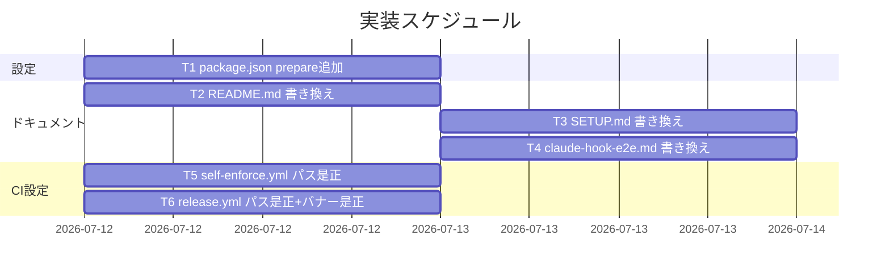
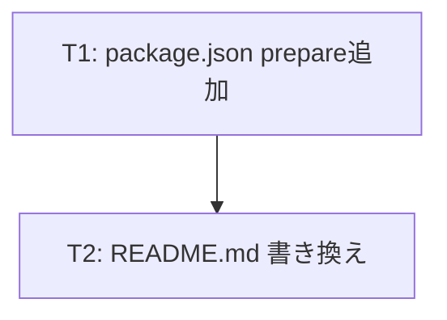
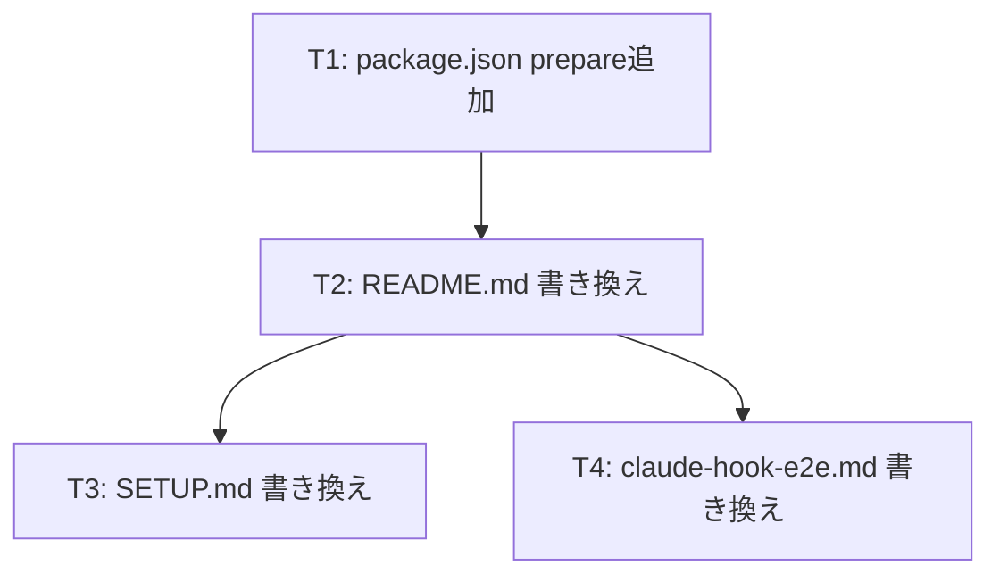

# 実装計画書: npm配布導線ノイズ是正

**プロジェクト名**: npm配布導線ノイズ是正
**作成日**: 2026 年 07 月 12 日
**最終更新**: 2026 年 07 月 12 日

> **重要**: **このドキュメントは常に更新**: 実装計画の変更、進捗状況の更新、バグの記録などがあった場合は、即座にこのドキュメントを更新してください。ドキュメントは「生きているドキュメント」として扱い、実装内容と常に同期させます。
> **必須項目**: 「必須」と明記した欄は空欄・抽象語のみで提出しないこと。テスト観点・BDD 仕様は具体ケースを 1 件以上記載すること。
>
> **用語**: [.agent-skill-chain/source/CONCEPTS.md §用語規約](../../../../../.agent-skill-chain/source/CONCEPTS.md#用語規約) を参照。

---

## 1. 実装概要

### 1.1 実装方針（必須）

02_設計.md の責務分担（README.md を説明の単一正本とし、SETUP.md／claude-hook-e2e.md はコマンド例＋リンクのみ、`.github/workflows` はコメント・バナー文言のみ）に従い、6 ファイルへの最小差分の文字列置換を独立したタスクとして分解する。相互依存が薄いため並行実施可能だが、検証（§2.x.3）は各タスク完了直後に個別に行う。

### 1.2 実装順序（必須: 1 件以上）



- T1・T5・T6 は他タスクと独立。T3・T4 は T2（README.md のリンク先アンカーが安定していることの前提）に軽く依存するが、リンク先は既存見出し `## 導入（プロジェクトへ配備するとき）`（本 issue で変更しない）のため、実質的にはどのタスクからでも着手可能。

---

## 2. タスク分解

**用語**: [.agent-skill-chain/source/CONCEPTS.md §用語規約](../../../../../.agent-skill-chain/source/CONCEPTS.md#用語規約) を参照。

### 2.1 タスク 1: `package.json` に `prepare` スクリプトを追加する

#### 2.1.1 概要（必須）

git 経由インストール時に `bin/agents-md.js` を自動ビルドさせる `prepare` フックを追加する。

#### 2.1.2 実装内容（必須: 1 件以上）

- `package.json` の `scripts` に `"prepare": "npm run build"` を追加する（既存の `build`／`build:claude`／`typecheck`／`test` キーの値・順序は変更しない）。

#### 2.1.3 テスト観点（必須）

##### 単体（本タスクの具体ケース・必須 1 件以上）

- 正常系: `package.json` を `JSON.parse` して `scripts.prepare === "npm run build"` であること（`node -e` ワンライナーで検証）。
- 正常系: 既存の `scripts.build`／`scripts.typecheck`／`scripts.test`／`name`／`bin`／`publishConfig`／`files` が変更前と完全一致すること（`git diff package.json` で `prepare` 行以外に差分が無いことを確認）。

##### 結合/API（本タスクの具体ケース・該当時は必須 1 件以上）

- 該当なし（`package.json` 単体の静的検証で完結）。

##### E2E/受け入れ（本タスクの具体ケース・未達時は理由記載）

- **冪等性検証**（02_設計 §6.2(a) に対応）: `mktemp -d` に `git archive HEAD | tar -x` でクリーンコピーを作成 → `npm ci`（`prepare` 経由で暗黙 `npm run build` が走る）→ `sha256sum bin/agents-md.js` を記録 → 続けて明示的に `npm run build` を再実行（CI の二重呼び出しを再現）→ 再度 `sha256sum bin/agents-md.js` を取り、ハッシュが一致すること（差分ゼロ＝冪等）を確認する。
  ```bash
  set -e
  tmp="$(mktemp -d)"
  git -C "$(git rev-parse --show-toplevel)" archive HEAD | tar -x -C "$tmp"
  ( cd "$tmp" && npm ci )
  h1="$(sha256sum "$tmp/bin/agents-md.js" | awk '{print $1}')"
  ( cd "$tmp" && npm run build )
  h2="$(sha256sum "$tmp/bin/agents-md.js" | awk '{print $1}')"
  [ "$h1" = "$h2" ] && echo "OK: 冪等（二重ビルドで生成物ハッシュ不変）" || echo "NG: 生成物が二重ビルドで変化した"
  rm -rf "$tmp"
  ```

##### バリデーション（該当する場合の具体ケース）

- 該当なし。

#### 2.1.4 単体テスト仕様（BDD）（必須）

```gherkin
Feature: prepare スクリプトによる自動ビルド
  Scenario: npm ci 実行時に prepare フックが bin を自動生成する
    Given package.json の scripts.prepare が "npm run build" である
    And bin/agents-md.js は .gitignore 対象で未追跡である
    When クリーンな git 作業コピーで npm ci を実行する
    Then prepare フックが自動実行され npm run build が走り
    And bin/agents-md.js が生成される
```

```bash
# Given: package.json に prepare スクリプトが設定済み、bin/agents-md.js は未追跡
tmp="$(mktemp -d)"
git archive HEAD | tar -x -C "$tmp"
test ! -f "$tmp/bin/agents-md.js" && echo "Given: OK 事前に bin 無し"

# When: クリーン作業コピーで npm ci を実行
( cd "$tmp" && npm ci )

# Then: prepare フック経由で bin/agents-md.js が生成されている
test -f "$tmp/bin/agents-md.js" && echo "Then: OK bin 生成確認"
rm -rf "$tmp"
```

#### 2.1.5 依存関係

- 依存タスクなし。



#### 2.1.6 見積もり

- **工数**: 0.5h
- **優先度**: 高（他タスクの前提となる技術的実現可能性の再確認を兼ねる）

---

### 2.2 タスク 2: `README.md` §導入「1.」を GitHub 直接参照へ書き換える

#### 2.2.1 概要（必須）

README.md §導入の見出し・導入文・全サブコマンド例・バージョンピン留め例・uninstall／enforce コマンド例を、GitHub 直接参照の実動作する記法へ一貫して書き換える（説明の単一正本。02_設計 ADR-3）。

#### 2.2.2 実装内容（必須: 1 件以上）

- 49 行目: 導線ラベルを `npx github:techbeansjp-free/AGENTS.md init（開発者・自己拡張向け補助導線・GitHub 直接参照）` に更新する。
- 71 行目見出し: `### 1. GitHub 直接参照（開発者・自己拡張向けの補助導線。npm レジストリは経由しない）` に更新する。
- 73 行目導入文: npm レジストリを経由せず GitHub から直接取得し `prepare` フックで自動ビルドされる旨を明記する説明に更新する。
- 77 行目: `npx agent-skill-chain init` → `npx github:techbeansjp-free/AGENTS.md init`。
- 103, 106, 109 行目（バージョンピン留め・アップグレード・doctor 例）: `npx agent-skill-chain@0.1.0 init` → `npx github:techbeansjp-free/AGENTS.md#<tag-or-branch> init`（02_設計 ADR-2 のプレースホルダ記法）。`npx agent-skill-chain@latest upgrade` → `npx github:techbeansjp-free/AGENTS.md upgrade` ＋ ref 省略時は既定ブランチ（最新）を指す旨のコメント注記。`npx agent-skill-chain doctor` → `npx github:techbeansjp-free/AGENTS.md doctor`。
- 118, 121, 124 行目（uninstall 3 例）: GitHub 直接参照へ書き換え。
- 141〜143 行目（enforce status/on/off 3 例）: GitHub 直接参照へ書き換え。

#### 2.2.3 テスト観点（必須）

##### 単体（本タスクの具体ケース・必須 1 件以上）

- 正常系: `grep -n 'npx agent-skill-chain' README.md` の結果が 0 件（registry 前提記法が完全に除去されている）。
- 正常系: `grep -n 'npx github:techbeansjp-free/AGENTS.md' README.md` の結果が 9 件以上（init/upgrade/doctor/uninstall×3/enforce×3 の全サブコマンド例が書き換わっている）。
- 正常系: `grep -n '### 1\.' README.md` の見出し文言に「npm 経由」が含まれず「GitHub 直接参照」を含むこと。

##### 結合/API（本タスクの具体ケース・該当時は必須 1 件以上）

- 該当なし。

##### E2E/受け入れ（本タスクの具体ケース・未達時は理由記載）

- **GitHub 直接参照コマンドの動作検証（02_設計 §6.2(b) に対応・代替手段）**: 現ブランチ（`feature/package-adapter`）は未 push のため実 GitHub 上の `techbeansjp-free/AGENTS.md` への `npx github:...` 直接検証は不可能な場合がある。代替として scratchpad にローカル git リポジトリを構築し、`npm exec` の `git+file://` 参照で `prepare`→`init` の一連の流れが成功することを確認する。
  ```bash
  set -e
  src_tmp="$(mktemp -d)"
  git archive HEAD | tar -x -C "$src_tmp"
  ( cd "$src_tmp" && git init -q && git add -A && git -c user.email=t@t -c user.name=t commit -q -m snapshot )
  dst_tmp="$(mktemp -d)"
  ( cd "$dst_tmp" && npx --yes "git+file://$src_tmp" init "$dst_tmp/adopter" )
  test -f "$dst_tmp/adopter/AGENTS.md" && echo "OK: init 相当が git 経由インストールで成功（prepare 自動ビルド込み）"
  rm -rf "$src_tmp" "$dst_tmp"
  ```
  未達（実 GitHub 経由の直接検証）の理由: 現ブランチが未 push のため `github:techbeansjp-free/AGENTS.md#feature/package-adapter` は GitHub 上に存在しない。上記のローカル git 経由インストールは `npx github:owner/repo` と同一の git インストール機構（`prepare` フックの自動実行を含む）を使うため、機構レベルでの等価性をもって代替する。

##### バリデーション（該当する場合の具体ケース）

- 該当なし。

#### 2.2.4 単体テスト仕様（BDD）（必須）

```gherkin
Feature: README.md の npm 配布導線ノイズ是正
  Scenario: registry 前提の npx 記法が完全に置き換わっている
    Given README.md §導入「1.」に旧来の npx agent-skill-chain <cmd> 記法があった
    When README.md を書き換え後に確認する
    Then npx agent-skill-chain という registry 前提の記法は 0 件であり
    And すべて npx github:techbeansjp-free/AGENTS.md <cmd> という
        GitHub 直接参照の記法に統一されている
```

```bash
# Given/When: README.md 書き換え後の内容を確認
old_count=$(grep -c 'npx agent-skill-chain' README.md || true)
new_count=$(grep -c 'npx github:techbeansjp-free/AGENTS.md' README.md || true)

# Then: registry 前提記法は 0、GitHub 直接参照記法は 9 件以上
[ "$old_count" -eq 0 ] && echo "Then: OK registry前提記法ゼロ"
[ "$new_count" -ge 9 ] && echo "Then: OK GitHub直接参照記法が全箇所反映"
```

#### 2.2.5 依存関係

- T1（技術的実現可能性の前提を共有。実装順序上の強い依存ではない）。



#### 2.2.6 見積もり

- **工数**: 1.5h
- **優先度**: 高（01 ストーリー 1 の受け入れ基準・SC-1〜SC-3 に直結）

---

### 2.3 タスク 3: `.agent-skill-chain/source/SETUP.md` の uninstall コマンド例を書き換える

#### 2.3.1 概要（必須）

配布正本 SETUP.md の uninstall コマンド例を GitHub 直接参照へ書き換え、詳細説明は追加せず README.md §導入へのリンクを 1 行添える（02_設計 ADR-3）。

#### 2.3.2 実装内容（必須: 1 件以上）

- 193〜195 行目の 3 コマンド（`uninstall`／`uninstall --yes`／`uninstall --purge --yes`）を `npx github:techbeansjp-free/AGENTS.md uninstall ...` へ書き換える。
- コードブロック直前に「GitHub 直接参照の詳細は [README.md §導入](../../README.md#導入プロジェクトへ配備するとき) を参照」という 1 行リンクを追加する（新規の説明文は書かない。DRY 遵守）。

#### 2.3.3 テスト観点（必須）

##### 単体（本タスクの具体ケース・必須 1 件以上）

- 正常系: `grep -n 'npx agent-skill-chain' .agent-skill-chain/source/SETUP.md` が 0 件。
- 正常系: `grep -n 'npx github:techbeansjp-free/AGENTS.md uninstall' .agent-skill-chain/source/SETUP.md` が 3 件。
- 正常系: 追加したリンクの相対パス `../../README.md` が実在すること（`test -f .agent-skill-chain/source/../../README.md`）。

##### 結合/API（本タスクの具体ケース・該当時は必須 1 件以上）

- 該当なし。

##### E2E/受け入れ（本タスクの具体ケース・未達時は理由記載）

- 該当なし（T2 の E2E 検証で機構部分は担保済みのため、本タスクは静的検証のみで十分と判断）。

##### バリデーション（該当する場合の具体ケース）

- 説明文の重複が無いこと: `.agent-skill-chain/source/SETUP.md` の uninstall 節に「npm レジストリ」「prepare」等の仕組み説明語彙が新規追加されていないこと（README.md との重複記載防止の目視確認）。

#### 2.3.4 単体テスト仕様（BDD）（必須）

```gherkin
Feature: SETUP.md の npx 記法統一
  Scenario: uninstall コマンド例が GitHub 直接参照に統一され README へリンクする
    Given SETUP.md の uninstall 節が registry 前提の npx agent-skill-chain uninstall だった
    When SETUP.md を確認する
    Then 3 コマンドすべてが npx github:techbeansjp-free/AGENTS.md uninstall 形式であり
    And README.md §導入への相対リンクが存在する
```

```bash
# Given/When: SETUP.md の該当節を確認
count=$(grep -c 'npx github:techbeansjp-free/AGENTS.md uninstall' .agent-skill-chain/source/SETUP.md || true)
has_link=$(grep -c '\.\./\.\./README\.md#導入' .agent-skill-chain/source/SETUP.md || true)

# Then: 3件書き換え済み・リンクあり
[ "$count" -eq 3 ] && echo "Then: OK uninstall 3件"
[ "$has_link" -ge 1 ] && echo "Then: OK README リンクあり"
```

#### 2.3.5 依存関係

- T2（リンク先の見出しが安定であることの確認）。

#### 2.3.6 見積もり

- **工数**: 0.5h
- **優先度**: 中（01 ストーリー 2 の受け入れ基準の一部）

---

### 2.4 タスク 4: `docs/maintainer/claude-hook-e2e.md` の npx コマンド例を書き換える

#### 2.4.1 概要（必須）

保守者向け E2E 手順書内の init／enforce コマンド例を GitHub 直接参照へ書き換え、詳細説明は README.md へリンクする（02_設計 ADR-3）。

#### 2.4.2 実装内容（必須: 1 件以上）

- 18 行目: `npx agent-skill-chain init` → `npx github:techbeansjp-free/AGENTS.md init`。
- 24, 25 行目: `npx agent-skill-chain enforce on`／`enforce status` → GitHub 直接参照へ書き換え。
- 手順 1（配備）のコードブロック直前に `[README.md §導入](../../README.md#導入プロジェクトへ配備するとき)` へのリンク行を追加する（`docs/maintainer/claude-hook-e2e.md` からリポジトリルートまでは 2 階層上）。

#### 2.4.3 テスト観点（必須）

##### 単体（本タスクの具体ケース・必須 1 件以上）

- 正常系: `grep -n 'npx agent-skill-chain' docs/maintainer/claude-hook-e2e.md` が 0 件。
- 正常系: `grep -n 'npx github:techbeansjp-free/AGENTS.md' docs/maintainer/claude-hook-e2e.md` が 3 件（init/enforce on/enforce status）。

##### 結合/API（本タスクの具体ケース・該当時は必須 1 件以上）

- 該当なし。

##### E2E/受け入れ（本タスクの具体ケース・未達時は理由記載）

- 未達: 本ファイルが手順として指し示す実機 Claude Code 上での E2E 実行そのものは、本 issue のスコープ外（手順書の記法修正のみが対象）であり実施しない。

##### バリデーション（該当する場合の具体ケース）

- 該当なし。

#### 2.4.4 単体テスト仕様（BDD）（必須）

```gherkin
Feature: claude-hook-e2e.md の npx 記法統一
  Scenario: init/enforce コマンド例が GitHub 直接参照に統一されている
    Given claude-hook-e2e.md の手順が registry 前提の npx agent-skill-chain だった
    When claude-hook-e2e.md を確認する
    Then init・enforce on・enforce status の 3 箇所すべてが
         npx github:techbeansjp-free/AGENTS.md 形式に書き換わっている
```

```bash
# Given/When: claude-hook-e2e.md を確認
old=$(grep -c 'npx agent-skill-chain' docs/maintainer/claude-hook-e2e.md || true)
new=$(grep -c 'npx github:techbeansjp-free/AGENTS.md' docs/maintainer/claude-hook-e2e.md || true)

# Then: registry前提ゼロ・GitHub直接参照3件
[ "$old" -eq 0 ] && echo "Then: OK registry前提記法ゼロ"
[ "$new" -eq 3 ] && echo "Then: OK 3箇所書き換え済み"
```

#### 2.4.5 依存関係

- T2（リンク先の見出しが安定であることの確認）。

#### 2.4.6 見積もり

- **工数**: 0.5h
- **優先度**: 中（01 ストーリー 2 の受け入れ基準の一部）

---

### 2.5 タスク 5: `.github/workflows/self-enforce.yml` の issue パス参照を是正する

#### 2.5.1 概要（必須）

16, 57, 100 行目のコメント中 issue パス参照 3 件に `close/` を挿入し実在パス化する。ロジック行には一切触れない。

#### 2.5.2 実装内容（必須: 1 件以上）

- 16 行目: `docs/maintainer/workflow/20260614_124435_配布とパッケージ構成の再設計/03_実装計画.md` → `docs/maintainer/workflow/close/20260614_124435_配布とパッケージ構成の再設計/03_実装計画.md`。
- 57 行目: `docs/maintainer/workflow/20260615_054810_カバレッジ計測の自リポ適用/02_設計.md, 03_実装計画.md` → `close/` 挿入。
- 100 行目: `docs/maintainer/workflow/20260615_114305_bin生成物のgitignore化とpublish時ビルド/02_設計.md §3.3, 03_実装計画.md（T2）` → `close/` 挿入。

#### 2.5.3 テスト観点（必須）

##### 単体（本タスクの具体ケース・必須 1 件以上）

- 正常系: 修正後の 3 パスすべてが `test -e` で実在確認できる（02_設計 §6.2(c) のワンライナー参照）。

##### 結合/API（本タスクの具体ケース・該当時は必須 1 件以上）

- 該当なし。

##### E2E/受け入れ（本タスクの具体ケース・未達時は理由記載）

- 未達: GitHub Actions 実行環境での実 CI 実行検証は本タスクでは行わない（コメント行のみの変更でありジョブ挙動に影響しないため、静的な `git diff` 検証で十分と判断）。

##### バリデーション（該当する場合の具体ケース）

- **ロジック行無差分検証（必須）**: `git diff -- .github/workflows/self-enforce.yml` の差分行がすべて `#` で始まるコメント行であること（`on:`/`if:`/`run:`/`jobs:`/`steps:` 等の実行可能行に変更が無いこと）。

#### 2.5.4 単体テスト仕様（BDD）（必須）

```gherkin
Feature: self-enforce.yml のリンク切れ是正
  Scenario: self-enforce.yml のコメント中パスがすべて実在する
    Given self-enforce.yml の16, 57, 100行目に
          docs/maintainer/workflow/<issue名>/... という参照コメントがある
    And 参照先の3 issueはいずれも docs/maintainer/workflow/close/<issue名>/ へ移動済みである
    When 各コメント中のパスを test -e で存在確認する
    Then 3件すべてのパスが docs/maintainer/workflow/close/ を含む実在パスに修正されており
    And git diff の変更行はコメント行のみである
```

```bash
# Given/When: 修正後のパスを存在確認
for p in \
  "docs/maintainer/workflow/close/20260614_124435_配布とパッケージ構成の再設計/03_実装計画.md" \
  "docs/maintainer/workflow/close/20260615_054810_カバレッジ計測の自リポ適用" \
  "docs/maintainer/workflow/close/20260615_114305_bin生成物のgitignore化とpublish時ビルド" ; do
  test -e "$p" && echo "OK: $p" || echo "NG: $p"
done

# Then: ロジック行に差分が無いこと
diff_non_comment=$(git diff -- .github/workflows/self-enforce.yml | grep -E '^[+-]' | grep -vE '^\+\+\+|^---' | grep -vE '^[+-]\s*#')
[ -z "$diff_non_comment" ] && echo "Then: OK コメント行以外の差分なし"
```

#### 2.5.5 依存関係

- 依存タスクなし。

#### 2.5.6 見積もり

- **工数**: 0.3h
- **優先度**: 高（保守者向けリンク切れの実害解消。01 ストーリー 3）

---

### 2.6 タスク 6: `.github/workflows/release.yml` の issue パス参照とバナー文言を是正する

#### 2.6.1 概要（必須）

ヘッダーバナー内の issue パス参照 1 件を `close/` 配下へ移動済みである旨の付記で是正し、「保留中」文言を「取りやめ」へ更新する。ジョブロジック・ゲートには一切触れない。

#### 2.6.2 実装内容（必須: 1 件以上）

- 11〜12 行目: `20260616_144601_npm公開を今後の課題化_自動リリース現状無効化 を参照。` → 末尾に `（close/ 配下へ移動済み）` を付記する（02_設計 ADR-4）。
- 4 行目: `npm 公開は今後の課題として保留中であり、自動リリースは無効化（dormant）している。` → `npm 公開は取りやめており、自動リリースは無効化（dormant）している。`（以降の再開手順の記述・ロジック説明は変更しない）。
- ASCII ボックスの罫線幅は既存ファイルも列幅に数列のばらつきがある（02_設計 ADR-4 の evidence_source: existing_code）ため、厳密な等幅合わせは必須要件とせず、可読性を損なわない範囲のベストエフォートとする。

#### 2.6.3 テスト観点（必須）

##### 単体（本タスクの具体ケース・必須 1 件以上）

- 正常系: `grep -n '保留中' .github/workflows/release.yml` が 0 件。
- 正常系: `grep -n '取りやめ' .github/workflows/release.yml` が 1 件以上。
- 正常系: 修正後のバナーに `close/` の記載（または移動済みを示す付記）があること。

##### 結合/API（本タスクの具体ケース・該当時は必須 1 件以上）

- 該当なし。

##### E2E/受け入れ（本タスクの具体ケース・未達時は理由記載）

- 未達: GitHub Actions 実行環境での実 CI 実行検証は行わない（コメント・バナー文言のみの変更のため）。

##### バリデーション（該当する場合の具体ケース）

- **ロジック行無差分検証（必須・SC-6 対応）**: `git diff -- .github/workflows/release.yml` の差分行がすべて `#` で始まるコメント行であること。`RELEASE_ENABLED`／`NPM_TOKEN` ゲート・`on:`・`if:`・`jobs:` 定義に変更が無いことを目視と grep 双方で確認する。

#### 2.6.4 単体テスト仕様（BDD）（必須）

```gherkin
Feature: release.yml バナー文言の方針整合とリンク切れ是正
  Scenario: バナーが取りやめの確定方針を反映し、issue参照が移動済みである旨を示す
    Given release.yml 冒頭バナーが「npm 公開は今後の課題として保留中」という文言だった
    And バナー内の issue 参照が close/ の抜けたパスだった
    When release.yml を確認する
    Then バナー文言は「npm 公開は取りやめており」という文言に更新されており
    And issue 参照は close/ 配下へ移動済みである旨が分かる形になっており
    And on:／if:／run:／jobs: 等の実行可能なロジック行には一切差分がない
```

```bash
# Given/When: release.yml のバナーを確認
old=$(grep -c '保留中' .github/workflows/release.yml || true)
new=$(grep -c '取りやめ' .github/workflows/release.yml || true)
close_note=$(grep -c 'close/' .github/workflows/release.yml || true)

# Then: 文言更新・close付記・ロジック無差分
[ "$old" -eq 0 ] && echo "Then: OK 保留中の文言は無い"
[ "$new" -ge 1 ] && echo "Then: OK 取りやめの文言に更新済み"
[ "$close_note" -ge 1 ] && echo "Then: OK close/ 付記あり"
diff_non_comment=$(git diff -- .github/workflows/release.yml | grep -E '^[+-]' | grep -vE '^\+\+\+|^---' | grep -vE '^[+-]\s*#')
[ -z "$diff_non_comment" ] && echo "Then: OK コメント行以外の差分なし"
```

#### 2.6.5 依存関係

- 依存タスクなし。

#### 2.6.6 見積もり

- **工数**: 0.5h
- **優先度**: 高（01 ストーリー 3・4、SC-5・SC-6 に直結）

---

## テスト観点

本実装計画全体のテスト観点は、①各文書・設定ファイルにおける registry 前提の `npx agent-skill-chain` 記法の完全除去（`grep -c` 0 件検証）、② `.github/workflows` 2 ファイルの issue パス実在確認（`test -e`）とロジック行無差分（`git diff` の非コメント行ゼロ検証）、③ `prepare` スクリプト追加の冪等性（二重ビルドでの生成物ハッシュ不変）、④ネットワーク非依存な GitHub 直接参照インストール機構の模擬検証（ローカル git インストールでの `prepare`→`init` 成功確認）の 4 点に要約される。各タスクの §2.x.3 に具体ケースを記載済み。

---

## 単体テスト

各タスクの §2.x.4 に BDD 仕様（Given/When/Then + 実行可能な bash 検証スクリプト）を記載した。本 issue はドキュメント・設定ファイルの記述修正であるため、単体テストは主に `grep`／`test -e`／`git diff`／`sha256sum` を用いたシェルベースの静的・準静的検証で構成する。

---

## BDD

各タスクの §2.x.4 参照。01_要件定義.md §2.2 の BDD ユースケース 1・2（GitHub 直接参照の実動作化、issue パスの是正、ロジック無差分）と 1 対 1 で対応する。

| 01_要件定義.md の BDD | 対応する 03 のタスク・BDD |
| --- | --- |
| ユースケース1 シナリオ1（GitHub 直接参照の npx init が成功する） | T2 §2.2.3 E2E 検証・§2.2.4 BDD |
| ユースケース1 シナリオ2（見出し・導入文言が実態と一致する） | T2 §2.2.3 単体・§2.2.4 BDD |
| ユースケース2 シナリオ1（self-enforce.yml のパスが実在する） | T5 §2.5.3〜2.5.4 |
| ユースケース2 シナリオ2（release.yml のロジック行に差分が生じない） | T6 §2.6.3〜2.6.4（および T5 §2.5.3 のロジック無差分検証） |

---

## 3. 実装スケジュール

### 3.1 マイルストーン

| マイルストーン | 期日 | 成果物 |
| --- | --- | --- |
| 設定・ドキュメント書き換え完了 | 2026-07-12 | T1〜T6 の差分一式 |
| review-docs 完了 | T1〜T6 完了後 | 実装前ドキュメントレビュー証跡 |

### 3.2 実装フェーズ

#### フェーズ 1: 設定・ドキュメント修正（T1〜T6）

- **期間**: 1 日以内（差分は小さい）
- **タスク**: T1（package.json）、T2（README.md）、T3（SETUP.md）、T4（claude-hook-e2e.md）、T5（self-enforce.yml）、T6（release.yml）

---

## 4. テスト計画

テスト観点・レベル・BDD 形式の定義は **02_設計 §6** および **RULES のテスト戦略・TEST_BDD_FORMAT** を参照。本実装計画では各タスクの **§2.x.3（テスト観点）** にタスクごとの具体ケースを記載し、§2.x.4 に BDD 仕様を記載した。

### 4.1 テストの優先順位

- T1（`prepare` 冪等性）と T5・T6（CI ロジック無差分）を最優先で検証する。CI を壊すリスクが最も高い箇所であるため。
- T2〜T4（記法統一）は `grep` による網羅的な残存検出を優先する。

---

## 5. リスク管理

### 5.1 実装リスク

- **リスク**: `prepare` 追加後、`npm ci` の暗黙 `npm run build` と CI の明示 `npm run build` の二重実行でビルド時間がわずかに増加する。
  - **対策**: T1 §2.1.3 の冪等性検証で実害（生成物差分）が無いことを確認する。時間増加自体は許容範囲（00_要求定義.md §7.1）。
- **リスク**: 現ブランチ未 push のため、実 GitHub 上の `npx github:techbeansjp-free/AGENTS.md` を用いた真の E2E 検証ができない。
  - **対策**: T2 §2.2.3 のローカル git インストール模擬検証で機構レベルの等価性を担保する。実 GitHub 経由の最終確認は、本ブランチが `main` へマージされた後（別 issue またはマージ後の手動確認）に行う旨を 04_review 側で申し送る。
- **リスク**: `.github/workflows` のバナー修正で誤ってロジック行（`if:`/`run:` 等）を変更してしまう。
  - **対策**: T5・T6 の `git diff` 非コメント行ゼロ検証を実装直後に必ず実行し、コミット前に確認する。
- **リスク**: T3・T4 で追加する `README.md#導入プロジェクトへ配備するとき` という CJK 見出しアンカーは、レンダラ（GitHub／エディタプレビュー等）ごとにスラッグ化規則が微妙に異なる可能性があり、リンクが正確に該当見出しへスクロールしない場合がある（本リポに自動リンクチェッカーは無く、実害は「リンク先ファイルは開けるが見出し位置に飛ばない」程度の軽微なものに留まる）。
  - **対策**: 実装時に GitHub 上のプレビュー等で目視確認する。解決しない場合はフラグメント無しの `../../README.md`（ファイル全体へのリンク）にフォールバックしてもよい（DRY の趣旨＝重複説明の回避は損なわれない）。

---

## 6. 参考資料

### プロジェクトドキュメント

- [`02_設計.md`](./02_設計.md) - 設計

### その他の参考資料

- [`00_要求定義.md`](./00_要求定義.md) - 要求定義（技術的実現可能性の実地検証結果）

---

## 7. 前のステップ

この実装計画書は、以下のドキュメントを基に作成されています：

- **前**: [`02_設計.md`](./02_設計.md) - 設計フェーズ

---

## 8. 次のステップ

この実装計画書の承認後、以下のいずれかのステップに進みます：

- **プロジェクトを複数の issue（またはタスク）に分割する場合**: 該当なし（本 issue は分割せず単一 issue 内で T1〜T6 を完結させる。90_issues.md は作成しない）。
- **プロジェクトが 1 つの issue（またはタスク）である場合**: 実装フェーズ（execution）に直接進む。

> **次工程の必須ゲート（絶対厳守）**: 本 02/03 完了後、**implement-feature（T1〜T6 の実装）に着手する前に review-docs（実装前ドキュメントレビュー）を必ず経ること**。[design-feature.md の DoD](../../../../../.agent-skill-chain/source/commands/design-feature.md) に定める全 issue 一律・免除なしのゲートであり、本 command を実行したサブエージェント自身は review-docs を実行しない（次のオーケストレータ委譲が行う）。未実行のまま implement-feature へ進むと enforcement #32 で FAIL する。

**用語**: [.agent-skill-chain/source/CONCEPTS.md §用語規約](../../../../../.agent-skill-chain/source/CONCEPTS.md#用語規約) を参照。
