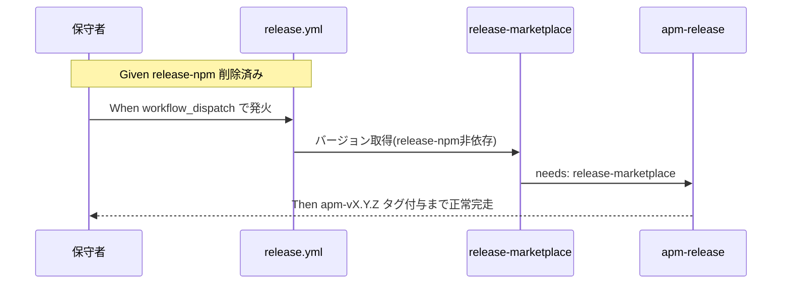

# 要件定義書: release-npm ジョブ完全削除とコメント/README の経緯記述除去

**プロジェクト名**: release-npm削除とドキュメント経緯除去
**作成日**: 2026 年 07 月 12 日
**最終更新**: 2026 年 07 月 12 日

> **重要**: **このドキュメントは常に更新**: 要件の変更や追加があった場合は、即座にこのドキュメントを更新してください。ドキュメントは「生きているドキュメント」として扱い、実装内容と常に同期させます。
>
> **用語**: [.agent-skill-chain/source/CONCEPTS.md §用語規約](../../../../../.agent-skill-chain/source/CONCEPTS.md#用語規約) を参照。

---

## 1. 概要

### 1.1 システム概要

本パッケージは npm 公開を運用しない方針を確定させている（前提 issue: npm公開中止_APM転換、2026-07-11）。しかし `.github/workflows/release.yml` には `release-npm` ジョブ（`NPM_TOKEN` ゲート・`npm publish` 一式）が dormant のまま残存しており、`release-marketplace` ジョブがそこに `needs` 依存している。加えて `release.yml`・`self-enforce.yml` のコメントには CODE_COMMENT_RULES.md 違反（外部ドキュメントファイル名の直書き）が残存し、README.md には「npm 公開は取りやめ済み」という過去の意思決定の経緯を説明する文言が残存している。本要件は、release-npm ジョブを完全に削除し、それに伴うバージョン管理責務の再配置を設計判断として明確化し、コメント規約違反と README の経緯記述を是正し、`docs/maintainer/RELEASE.md` の整合性を検証・更新するものである。

### 1.2 用語集

| 用語 | 説明 |
|------|------|
| release-npm ジョブ | `.github/workflows/release.yml` の 3 ジョブの 1 つ。version bump・日時タグ作成・GitHub Release 作成・`npm publish` を担う。本要件で完全削除する対象。 |
| dormant ゲート | `vars.RELEASE_ENABLED == 'true'` を条件とする、ジョブの自動発火を止める可逆的な無効化機構。release-npm 以外（release-marketplace／apm-release）では本要件後も維持する。 |
| バージョン bump 責務 | `package.json` の semver patch を +1 し、main へ書き戻す処理。従来 release-npm が担っていたが、削除後の担い手を設計判断で決定する。 |
| CODE_COMMENT_RULES 違反 | コメント/docstring に外部ドキュメント名（`XXX.md`）・章節番号・PR/issue 番号を直書きすること。`.agent-skill-chain/source/CODE_COMMENT_RULES.md` §2 で禁止される。 |
| 経緯記述 | 「npm 公開は取りやめ済み」のように、過去の意思決定の経緯・理由を説明する文言。現在の事実のみを記述する原則に反するため除去対象。 |
| CI強制化（コメント規約） | CODE_COMMENT_RULES.md §5 が定める「§2 違反をCIのgrep検出対象とする」規定の実効化。既存の `audit.sh` check #26 は `.github/workflows/*.yml` を走査対象外とし、`self-enforce.yml` からの呼び出しも `continue-on-error: true` のため非ブロッキングであり、本要件はこのギャップを埋めて検知を機能させる対象を扱う。 |

---

## 2. 機能要件

### 2.1 ユーザーストーリー

#### ストーリー 1: 保守者として、release-npm ジョブを完全に削除し、二度と発火しない資産を保持し続けたくない

- **As a** 本パッケージの保守者
- **I want to** `.github/workflows/release.yml` から `release-npm` ジョブ（`NPM_TOKEN` ゲート・bump・日時タグ・GitHub Release 作成・`npm publish` の全 step）を完全に削除したい
- **So that** npm 公開を運用しない方針に反する死んだコード・secret ゲートを保守し続けるコストを無くせる

**受け入れ基準**:

- `.github/workflows/release.yml` に `release-npm` というジョブ名・ジョブ定義が存在しないこと。
- `NPM_TOKEN` secret への参照（`steps.npm_gate` 等 release-npm 固有の step）が `release.yml` から消えていること。
- `release-marketplace`／`apm-release` ジョブの apm/marketplace 固有ロジック（`build-adapters.sh` 呼び出し・決定性検証）には変更が無いこと。

#### ストーリー 2: 保守者として、release-npm 削除後もバージョン bump 責務の担い手が明確であってほしい

- **As a** 本パッケージの保守者
- **I want to** `release-marketplace`／`apm-release` が前提とする「バージョン bump 済みの main」を、release-npm 削除後も何らかの主体が作る設計になっていてほしい
- **So that** マーケットプレイス・apm への配布物のバージョンが更新されないまま古いバージョンで公開され続ける事態を防げる

**受け入れ基準**:

- `release-marketplace` ジョブが `needs: release-npm` に依存せず、version 情報（commit メッセージ用）を取得できる実装になっていること。
- バージョン bump 処理の担い手（release-marketplace への統合／新規軽量ジョブ／手動 `sync-version.sh` 運用、のいずれか）が 02_設計.md に明記され、選択の根拠が記載されていること（00/01 では選択肢の存在のみを明記し断定しない）。
- `sync-version.sh --check`（`package.json`/`plugin.json`/`apm.yml` の version 一致検証）が、選んだ設計のもとでも引き続き通過すること。

#### ストーリー 3: 保守者として、CI コメントが外部ドキュメントに直書き参照せず、ソースコード内で完結していてほしい

- **As a** 本パッケージの保守者
- **I want to** `.github/workflows/release.yml`・`.github/workflows/self-enforce.yml` のコメントが、外部ドキュメントファイル名・章節番号・issue 番号を直書きせず、`.agent-skill-chain/source/CODE_COMMENT_RULES.md` に準拠していてほしい
- **So that** 参照先の issue が close 移動・リネームされてもコメントが陳腐化せず、読み手を誤誘導しない

**受け入れ基準**:

- `.github/workflows/self-enforce.yml:16`・`:57`・`:101` の `# 正本: docs/maintainer/workflow/close/<issue>/....md` という記載が、外部ドキュメントファイル名を含まない形（コード参照への張り替え、または外部参照を伴わない自然文）へ書き換えられていること。
- `.github/workflows/release.yml:19` の `docs/maintainer/RELEASE.md を参照` という記載を含むバナー段落が、release-npm 削除設計と整合する形で書き換えられ、外部ドキュメントファイル名の直書きが残っていないこと。
- `.github/workflows/self-enforce.yml:164` の `COVERAGE_EXCEPTIONS.md` 参照については、設計フェーズで是正要否を判断し、01 の受け入れ基準としては「判断結果が 02_設計.md に明記されていること」を基準とする（強制的な書き換えを本要件で断定しない）。
- 是正後、grep `docs/maintainer/workflow.*\.md` 等のパターンで両ファイルのコメント行に一致が無いこと（境界事例の扱いは設計判断に従う）。

#### ストーリー 4: 利用者として、README を読んだときに現在の事実だけが分かり、過去の経緯に惑わされたくない

- **As a** 本パッケージを利用・保守する開発者
- **I want to** README.md が「npm 公開は取りやめ済み」のような過去の意思決定の経緯説明を含まず、現在何ができるか・何を実行すればどうなるかだけを記述していてほしい
- **So that** 経緯を読み解く手間なく、今すぐ使える情報だけを得られる

**受け入れ基準**:

- README.md 49行目付近の「npm 公開は取りやめ済みであり、基本は `apm install` を推奨する。」が、経緯説明を含まず「`apm install` を推奨する」という現在の事実のみの文言に書き換えられていること。
- README.md 73行目付近の「npm 公開は取りやめ済みのため、`npx` は npm レジストリではなく GitHub リポジトリを直接参照する」が、経緯説明を含まず「`npx` は GitHub リポジトリを直接参照する」という現在の事実のみの文言に書き換えられていること。
- README.md 163〜165行目付近の「現在 npm 公開は今後の課題として保留中であり、自動リリースは無効化（dormant）されている」を含む §「リリース手順（メンテナ向け）」節が、release-npm 削除後の実態（npm publish 経路自体が存在しない）に合わせて書き換えられていること。
- 上記以外にも同種の経緯説明（「以前は」「取りやめた」「保留中」等）が README.md に残っていないか確認し、あれば同様に是正されていること。

#### ストーリー 5: 保守者として、`docs/maintainer/RELEASE.md` が release-npm 削除後の実態と整合していてほしい

- **As a** 本パッケージの保守者
- **I want to** `docs/maintainer/RELEASE.md`（npm publish 手順の詳細正本）が、release-npm 削除後も存在しないジョブの再開手順を案内し続けることのないようにしたい
- **So that** 保守ドキュメントを読んだ人が、実行不能な手順を実行可能であるかのように誤認しない

**受け入れ基準**:

- `docs/maintainer/RELEASE.md` §5「自動リリースの現状（dormant）と再開手順」が、release-npm が存在しない実態に合わせて見直されていること（削除・大幅改訂・別ドキュメントへの統合のいずれかを設計判断で決定し反映する）。
- `docs/maintainer/apm-package.md:86` の `release-npm`／`RELEASE.md §5` への言及について、整合性が確認され、必要な更新が行われていること。
- README.md §「リリース手順（メンテナ向け）」から RELEASE.md への参照リンクが、更新後の RELEASE.md の実態と整合していること。

#### ストーリー 6: 保守者として、CODE_COMMENT_RULES §2 違反がCIで機械的に検知されてほしい

- **As a** 本パッケージの保守者
- **I want to** `.github/workflows/*.yml`（少なくとも本要件の対象範囲）に CODE_COMMENT_RULES.md §2 の禁止パターン（仕様ドキュメント名・章節番号・PR/issue/タスク番号）が紛れ込んだ場合、CI（self-enforce.yml）が機械的に検知して失敗してほしい
- **So that** ストーリー3のような違反の再発をレビュー・議論を経ずにCIで機械的に差し戻せ、指摘・修正のコストを削減できる

**受け入れ基準**:

- CI（`self-enforce.yml`）に、CODE_COMMENT_RULES.md §2 禁止パターンをgrep検出する新規ステップ（または既存 `audit.sh` check #26 の走査対象拡張＋呼び出し方法見直し）が追加されていること。実装方式は 02_設計.md で確定する。
- 検知対象には少なくとも `.github/workflows/*.yml` を含むこと（既存 check #26 が除外している範囲を本要件でカバーする）。
- §3 許可パターン（ファイルパス・シンボル参照）を誤検出しないこと。
- 意図的に §2 禁止パターンを含むテスト用コメントを混入させた場合にCIが失敗し、含まれない場合はCIが成功することを確認できること。
- 本要件は検知の追加のみを対象とし、`CODE_COMMENT_RULES.md` 本文の改訂は対象外とする。

### 2.2 BDD ユースケース

#### ユースケース 1: 保守者が release-npm 削除後の release.yml を確認する

保守者が `.github/workflows/release.yml` を開き、release-npm ジョブが存在せず、release-marketplace／apm-release が正常に依存関係を解決できることを確認する。

**シナリオ 1: release-npm ジョブが存在しない**

```gherkin
Feature: release-npm ジョブの完全削除
  Scenario: release.yml から release-npm が消えている
    Given npm 公開を運用しない方針が確定している
    When .github/workflows/release.yml の jobs: セクションを確認する
    Then release-npm というジョブ定義が存在せず
    And NPM_TOKEN secret への参照も存在しない
```

**シナリオ 2: release-marketplace が release-npm へ依存しない**

```gherkin
Feature: バージョン bump 責務の再配置
  Scenario: release-marketplace が独立して version を取得できる
    Given release-npm ジョブが削除されている
    When release-marketplace ジョブの needs: と version 取得ロジックを確認する
    Then needs: に release-npm が含まれておらず
    And commit メッセージ用の version が release-npm に依存しない主体
        （package.json の直接参照、または bump を担う前段ジョブの outputs 経由）から取得できている
```

**処理フロー**（必要に応じて）:



#### ユースケース 2: 保守者が workflows のコメントを CODE_COMMENT_RULES 準拠に是正する

保守者が `self-enforce.yml`・`release.yml` のコメントを確認し、外部ドキュメントファイル名の直書きが残っていないことを検証する。

**シナリオ 1: self-enforce.yml のコメントにドキュメント名の直書きが無い**

```gherkin
Feature: CODE_COMMENT_RULES 準拠のコメント是正
  Scenario: self-enforce.yml の 16, 57, 101 行目相当が是正されている
    Given self-enforce.yml の該当行に
          "正本: docs/maintainer/workflow/close/<issue>/....md" という記載があった
    When 是正後の該当箇所を確認する
    Then 外部ドキュメントファイル名を含まない記述（コード参照 or 自然文）になっており
    And grep でドキュメントファイル名パターンが検出されない
```

**シナリオ 2: release.yml のロジック行に差分が生じない**

```gherkin
Feature: CODE_COMMENT_RULES 準拠のコメント是正
  Scenario: コメント是正がジョブロジックに影響しない
    Given release.yml のコメント是正と release-npm 削除が完了している
    When git diff で release.yml の変更行を確認する
    Then release-marketplace／apm-release のロジック行（if:/run:/needs: 等）への
         意図しない変更が無く
    And apm/marketplace 固有ロジックが無改変であることが確認できる
```

#### ユースケース 3: 利用者が README を読み、現在の事実のみを得る

外部の利用者が README.md §導入・§リリース手順を読み、過去の経緯説明に惑わされず現在の使い方だけを理解できることを確認する。

**シナリオ 1: README の該当箇所が経緯説明を含まない**

```gherkin
Feature: README の経緯記述除去
  Scenario: README.md の該当3箇所が現在事実のみになっている
    Given README.md に「npm 公開は取りやめ済み」等の経緯説明が3箇所存在した
    When 是正後の README.md を確認する
    Then 各箇所が「現在何ができるか」のみを記述しており
    And 「取りやめ済み」「保留中」等の過去の意思決定を理由とする文言が残っていない
```

**シナリオ 2: RELEASE.md が release-npm 削除後の実態と整合する**

```gherkin
Feature: RELEASE.md の整合性検証
  Scenario: RELEASE.md の再開手順が実態と整合する
    Given release-npm ジョブが完全に削除されている
    When docs/maintainer/RELEASE.md §5 を確認する
    Then 存在しない release-npm ジョブの「再開手順」を案内する記述が残っておらず
    And 実態（npm publish 経路が存在しないこと）に合わせて見直されている
```

#### ユースケース 4: CIがCODE_COMMENT_RULES §2 違反を機械的に検知する

保守者（またはCI自体）が、意図的に §2 禁止パターンを含むコメントを `.github/workflows/*.yml` に混入させた場合と混入させない場合とで、CIの成否が変わることを確認する。

**シナリオ 1: §2禁止パターンを含むコメントがあるとCIが失敗する**

```gherkin
Feature: CODE_COMMENT_RULES §2 違反のCI機械検知
  Scenario: 仕様ドキュメント名の直書きコメントを混入させるとCIが失敗する
    Given .github/workflows/*.yml に §2 禁止パターン（例: "docs/maintainer/RELEASE.md を参照"）を含むテスト用コメントを混入させた
    When self-enforce.yml のCODE_COMMENT_RULES検知ステップを実行する
    Then 検知ステップが失敗し
    And 違反箇所（ファイル・行）がログに出力される
```

**シナリオ 2: 禁止パターンが無い場合はCIが成功する**

```gherkin
Feature: CODE_COMMENT_RULES §2 違反のCI機械検知
  Scenario: 禁止パターンを含まない場合は検知ステップが成功する
    Given .github/workflows/*.yml のコメントに §2 禁止パターンが含まれていない
    When self-enforce.yml のCODE_COMMENT_RULES検知ステップを実行する
    Then 検知ステップが成功する
    And §3許可パターン（ファイルパス・シンボル参照）を含むコメントは誤検出されない
```

### 2.3 ビジネスルール

- release-npm ジョブの削除は「無改変で保持」という過去の決定（前提 issue 02_設計.md §2.6.4）を明示的に上書きする。上書きの根拠（ユーザーの AskUserQuestion 回答）を 02_設計.md にも引き継いで記載すること。
- コメント是正・README 是正・RELEASE.md 更新は「現在の事実のみを記述する」という単一の原則に貫かれること。原則の重複記述はせず、CODE_COMMENT_RULES.md（コード）と本要件（ドキュメント）が同根の思想であることを設計・実装で意識すること。
- `release-marketplace`／`apm-release` の apm/marketplace 固有ロジック（`build-adapters.sh` 呼び出し・決定性検証）は変更しない。バージョン bump 責務の再配置のみを設計対象とする。
- 隣接する未コミット修正（`docs/maintainer/workflow/close/20260712_093757_npm配布導線ノイズ是正/`）と対象行が重複しても、両者は「パスの実在性是正」と「規約違反の解消」という異なる性質の是正であり、矛盾させない。実装フェーズでは先行修正の内容を踏まえた差分で作業する。
- CODE_COMMENT_RULES §2 違反のCI検知は「検知の追加」のみを対象とし、`CODE_COMMENT_RULES.md` 本文の改訂・既存 `audit.sh` check #26 の他対象（`src`/`app`/`components`）への影響拡大は対象外とする。

---

## 3. 非機能要件

### 3.1 パフォーマンス要件

- 特段の要件はない。

### 3.2 セキュリティ要件

- `NPM_TOKEN` secret への参照が release.yml から完全に無くなること（使われない secret への依存を残さない）。

### 3.3 ユーザビリティ要件

- README.md の該当箇所は、経緯説明を除去した後も文脈が破綻せず、そのままコピー＆ペーストで実行可能な手順として読めること。

### 3.4 可用性要件

- 該当なし（CI 定義・ドキュメントの改訂であり稼働中のランタイムコンポーネントを持たない）。

---

## 4. 外部インターフェース要件

### 4.1 API 要件

- 該当なし。

### 4.2 データ形式要件

- `.github/workflows/*.yml` は既存の GitHub Actions ワークフロー構文を維持する。release-npm 削除は `jobs:` セクションの 1 ジョブ丸ごとの削除であり、他ジョブの構文には影響しない。

---

## 5. 制約事項

- `release-marketplace`／`apm-release` の apm/marketplace 固有ロジック（`build-adapters.sh` 呼び出し・決定性検証等）は変更しない。
- npm publish 再開・パッケージ名変更は対象外。
- README.md §0（apm 経由）・§2（Claude marketplace 経由の手順自体）・§3（ローカル配備）の手順内容は変更しない（経緯文言の除去のみ）。
- `docs/maintainer/workflow/close/20260712_093757_npm配布導線ノイズ是正/` が対象とした「registry 前提の npx 記法の GitHub 直接参照への書き換え」は対象外（別 issue で対応済み）。
- `CODE_COMMENT_RULES.md` 本文（§1〜§5）の改訂は対象外（検知の追加のみが対象）。

---

## 6. 参考資料

### プロジェクトドキュメント

- [`00_要求定義.md`](./00_要求定義.md) - 要求定義

### その他の参考資料

- 上書き対象の既存決定: [`../close/20260711_015030_agentsOS汎用化_ポリシー統合/90_issues/20260711_024021_npm公開中止_APM転換/02_設計.md`](../close/20260711_015030_agentsOS汎用化_ポリシー統合/90_issues/20260711_024021_npm公開中止_APM転換/02_設計.md) §2.6.4
- 隣接する未コミット修正: [`../close/20260712_093757_npm配布導線ノイズ是正/00_要求定義.md`](../close/20260712_093757_npm配布導線ノイズ是正/00_要求定義.md)、[`../close/20260712_093757_npm配布導線ノイズ是正/01_要件定義.md`](../close/20260712_093757_npm配布導線ノイズ是正/01_要件定義.md)
- [`../../../../.agent-skill-chain/source/CODE_COMMENT_RULES.md`](../../../../../.agent-skill-chain/source/CODE_COMMENT_RULES.md) — コメント規約の正本（§5 がCI検知対象と規定）
- [`../../../../.agent-skill-chain/source/enforcement/ci/audit.sh`](../../../../../.agent-skill-chain/source/enforcement/ci/audit.sh) — 既存 check #26（コメント外部参照禁止違反検知。`.github/workflows` を走査対象外としており本要件で対象拡張を検討）

---

## 7. 前のステップ

この要件定義書は、以下のドキュメントを基に作成されています：

- **前**: [`00_要求定義.md`](./00_要求定義.md) - 要求定義フェーズ

---

## 8. 次のステップ

この要件定義書の承認後、以下のドキュメントを作成します：

- **次**: [`02_設計.md`](./02_設計.md) - 設計フェーズ
