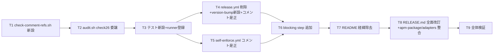

# 実装計画書: release-npm ジョブ完全削除とコメント/README の経緯記述除去

**プロジェクト名**: release-npm削除とドキュメント経緯除去
**作成日**: 2026 年 07 月 12 日
**最終更新**: 2026 年 07 月 12 日

> **重要**: **このドキュメントは常に更新**: 実装計画の変更、進捗状況の更新、バグの記録などがあった場合は、即座にこのドキュメントを更新してください。
> **必須項目**: 「必須」と明記した欄は空欄・抽象語のみで提出しないこと。テスト観点・BDD 仕様は具体ケースを 1 件以上記載すること。
>
> **用語**: [.agent-skill-chain/source/CONCEPTS.md §用語規約](../../../../../.agent-skill-chain/source/CONCEPTS.md#用語規約) を参照。

---

## 1. 実装概要

### 1.1 実装方針（必須）

02_設計.md の 4 論点を、「検知基盤（T1〜T3）→ 違反是正・CI 定義変更（T4〜T5）→ blocking 配線（T6）→ ドキュメント是正（T7〜T8）→ 全体検証（T9）」の順で実装する。**T6（blocking step 追加）は T4・T5（違反是正）の完了後**でなければ CI が即赤になるため、この順序は厳守する。作業ツリーには前 issue「npm配布導線ノイズ是正」の未コミット修正が存在するため、すべての変更は現在の作業ツリー状態を起点に差分を作る（過去の報告ではなく `git diff` の実測を正とする）。

### 1.2 実装順序（必須: 1 件以上）



---

## 2. タスク分解

### 2.1 タスク T1: `check-comment-refs.sh` の新設（検知ロジックの単一正本）

#### 2.1.1 概要（必須）

`.agent-skill-chain/source/enforcement/ci/check-comment-refs.sh` を新設し、02_設計 §5.2 の CLI 契約（引数パス走査・コメント抽出 awk・3 禁止パターン・exit 0/1/2）を実装する。

#### 2.1.2 実装内容（必須: 1 件以上）

- コメント抽出 awk・`pat_section`・`pat_ticket`・全角数字の列挙表現・`LC_ALL=C` 照合は現行 `audit.sh` の `check_code_comment_external_ref()` から移設する。
- docname パターンのみ `[^[:space:]]+\.(md|adoc)` へ拡張する（02_設計 ADR-6）。
- 対象拡張子: `sh py js ts go rb rs java yml yaml`（ディレクトリ引数時の find 対象）。
- 違反は `<file>:<line>` を stdout へ列挙。終了コード契約は 0=違反なし／1=違反あり／2=引数なし。
- スクリプト自身のヘッダコメントは規約準拠（`.md` 名・章節番号を書かない。「コメント外部参照禁止規約の検出ロジック単一正本」等の自然文）。

#### 2.1.3 テスト観点（必須）

##### 単体（必須 1 件以上）

- 正常系: `bash -n` 構文 OK。引数なしで exit 2。実在しないパスのみ渡すと警告＋exit 0。
- 検出系: tmp フィクスチャ `a.yml` に `# 正本: docs/x/02_設計.md`（CJK 名・ADR-6 の検出対象）を置き exit 1・`a.yml:1` を出力。`# §3.2 参照`・`# Issue #42 対応` も各々検出。
- 非検出系: `# 詳細は scripts/sync-version.sh を参照`（§3 許可のコードパス）・`# build_index() を呼ぶ`（シンボル）・`import foo  # from spec.md` 相当の import 行除外、で exit 0。

##### 結合/API（該当時は必須 1 件以上）

- ディレクトリ引数で `.yml` と `.sh` の混在ツリーを走査し、違反ファイルのみ列挙されること。

##### E2E/受け入れ（未達時は理由記載）

- T9 で実リポの `.github/workflows` へ適用し exit 0（是正完了後）。

##### バリデーション（該当する場合）

- 走査対象 0 件（空ディレクトリ）で exit 0。

#### 2.1.4 単体テスト仕様（BDD）（必須）

```gherkin
Feature: コメント外部参照の機械検知（01 ユースケース 4 に対応）
  Scenario: 禁止パターンを含む YAML コメントを検出して非 0 終了する
    Given tmp 隔離ディレクトリに "# 正本: docs/maintainer/02_設計.md" というコメント行を含む a.yml がある
    When check-comment-refs.sh に当該ディレクトリを渡して実行する
    Then 終了コードが 1 であり
    And 標準出力に "a.yml:<行番号>" が含まれる

  Scenario: 許可パターン（コード参照）のみなら 0 終了する
    Given tmp 隔離ディレクトリのコメントがファイルパス・シンボル参照のみの b.yml がある
    When check-comment-refs.sh に当該ディレクトリを渡して実行する
    Then 終了コードが 0 であり、違反は 1 件も出力されない
```

#### 2.1.5 依存関係

- なし（最初に着手）。

#### 2.1.6 見積もり

- **工数**: 1.5h ／ **優先度**: 高

---

### 2.2 タスク T2: `audit.sh` check #26 の委譲リファクタ

#### 2.2.1 概要（必須）

`check_code_comment_external_ref()` を「`CODE_COMMENT_SRC_DIRS` の解釈・実在確認 → 実在 dir を引数に `check-comment-refs.sh` を呼ぶ → exit 1 なら従来形式の FAIL 出力＋`ROLLBACK_MSG`＋`EXIT_CODE=1`」へ書き換える（検出意味論は維持・ロジックは委譲）。

#### 2.2.2 実装内容（必須: 1 件以上）

- スクリプトパスは audit.sh 自身の位置基準で解決する（`enforcement/ci/` 同居）。
- スクリプト不在時は WARN を出して SKIP（フォールバック実装は持たない。02_設計 §3.4）。
- 関数内の awk・パターン定義（移設済み分）は削除し二重定義を残さない。

#### 2.2.3 テスト観点（必須）

##### 単体（必須 1 件以上）

- `bash -n .agent-skill-chain/source/enforcement/ci/audit.sh` OK。
- 回帰: tmp ツリーに `src/foo.sh`＋`# DESIGN.md §3 参照` を置いて audit.sh 実行 → FAIL 出力に `src/foo.sh` が含まれ exit 1。
- 回帰: src/app/components が無いツリーでは何も検出せず（既定挙動維持）。`CODE_COMMENT_SRC_DIRS=custom` 上書きが機能する。

##### 結合/API

- 既存 `bash test/test-audit.sh` が全 PASS（他 check の非破壊確認）。

##### E2E/受け入れ

- 該当なし（audit.sh 全体の E2E は既存 CI の non-blocking step。変更しない）。

##### バリデーション

- check-comment-refs.sh を一時退避した状態で audit.sh が WARN＋SKIP し exit に影響しないこと。

#### 2.2.4 単体テスト仕様（BDD）（必須）

```gherkin
Feature: check #26 の委譲後の回帰維持
  Scenario: src 配下のコメント違反を従来どおり FAIL にする
    Given tmp 隔離ツリーの src/foo.sh に "# DESIGN.md §3 参照" というコメントがある
    When audit.sh を当該ツリーに対して実行する
    Then 出力に "FAIL: コメント外部参照禁止違反" と "src/foo.sh" が含まれ
    And 終了コードが 1 である
```

#### 2.2.5 依存関係

- T1（委譲先スクリプト）。

#### 2.2.6 見積もり

- **工数**: 1h ／ **優先度**: 高

---

### 2.3 タスク T3: テスト新設と runner 登録

#### 2.3.1 概要（必須）

`test/test-check-comment-refs.sh` を新設（T1 の単体/結合ケースを tmp 隔離で自動化）し、`test/run-all.sh` の TESTS 配列（テスト一覧の正本）へ登録する。`test/test-audit.sh` へ T2 の委譲回帰ケースを追加する。

#### 2.3.2 実装内容（必須: 1 件以上）

- テストは既存規約に従う: tmp 隔離（`mktemp -d`）・開発リポ非破壊・exit 0/1/2 契約・PASS/FAIL サマリ出力。
- run-all.sh 登録行: `test-check-comment-refs|test-check-comment-refs.sh|bash`（依存は bash/awk/grep のみ）。
- カバレッジ例外台帳の追記は不要（`enforcement/ci/` は計測分母 `INCLUDE_PATHS=.agent-skill-chain/source/scripts` の外。02_設計 ADR-5 帰結）。実装時に `bash test/coverage-check.sh` の結果が変化しないことを確認する。

#### 2.3.3 テスト観点（必須）

##### 単体（必須 1 件以上）

- `bash test/test-check-comment-refs.sh` 単独実行で全ケース PASS・exit 0。
- 意図的にスクリプトのパターンを壊すとテストが FAIL する（テスト自体の検出力確認を 1 回実施）。

##### 結合/API

- `bash test/run-all.sh` で新テストが列挙・実行され、全体 exit 0。

##### E2E/受け入れ

- 該当なし（テスト基盤自体）。

##### バリデーション

- 該当なし。

#### 2.3.4 単体テスト仕様（BDD）（必須）

```gherkin
Feature: テスト runner への組み込み
  Scenario: run-all.sh が新テストを実行する
    Given test/run-all.sh の TESTS 配列に test-check-comment-refs が登録されている
    When bash test/run-all.sh を実行する
    Then サマリに test-check-comment-refs の PASS が表示され
    And 全体終了コードが 0 である
```

#### 2.3.5 依存関係

- T1・T2。

#### 2.3.6 見積もり

- **工数**: 1.5h ／ **優先度**: 高

---

### 2.4 タスク T4: release.yml — release-npm 削除・version-bump 新設・依存張替え・コメント是正

#### 2.4.1 概要（必須）

`jobs.release-npm` のジョブ定義を削除し（npm publish 関連 step は廃止、日時タグ決定・GitHub Release 作成の 2 step は 02_設計 ADR-3 のとおりロジック無改変で移植）、02_設計 §3.1.2 の `version-bump` ジョブを新設、`release-marketplace` の `needs:`／version 参照を張り替える。ヘッダ・`on:` コメントを 02_設計 §2.6 の文体原則（現在事実のみ・`.md` 名なし）で書き換える。

#### 2.4.2 実装内容（必須: 1 件以上）

- `release-npm` ジョブ定義（59〜212 行目相当）を削除する（02_設計 ADR-1）。うち `NPM_TOKEN` ゲート・`npm publish`・publish 前検査（sqlite3 導入・`npm ci`/`npm run build`・`verify-npm-pack.sh`）の各 step は廃止。**「Decide datetime tag」step（JST `vYYYYMMDD.HHMMSS`・同一秒衝突時の 3 段リトライ: 秒+1 → `-2` → `-3`）と「Create GitHub Release」step（`gh release create --generate-notes`・既存タグは作成スキップで冪等）はロジック行（step `name:`・`run:` 内容・`id:`・`env: GH_TOKEN`。`name:` は T9 の step 存在検証が step 名を照合するため保持必須）無改変で `version-bump` へ移植する**（02_設計 ADR-3。コメント行のみ §2.6 の文体原則で新規に書く。移植 step の `steps.datetag.outputs.tag` 参照はジョブ内で完結し、job outputs へは `tag` を公開しない＝02_設計 §5.1）。
- `version-bump` ジョブを新設する（step 列・commit 対象 4 ファイル＝`package.json`/`package-lock.json`/`plugin.json`/`apm.yml` は 02_設計 §3.1.2 の正本どおり。日時タグ・GitHub Release の 2 step を末尾に含む。actions の SHA ピンは既存行を再利用。Setup Node に `registry-url` は設定しない）。
- `release-marketplace`: `needs: version-bump` へ変更し、`version="${{ needs.version-bump.outputs.version }}"` へ変更する（**ロジック行**の変更はこの 2 点のみ）。ジョブ内コメントの経緯語彙（「（案A）」「dormant 補助防御」「tag 起点比較は撤去済み」）は 02_設計 §2.6 の現在事実の記述へ是正する（コメント行のみ）。
- `apm-release`: ロジック無改変。コメントのみ是正: 「他 2 job（release-npm/release-marketplace）と完全に同一のゲート」→「他ジョブと同一のゲート」、「dormant 補助防御:」→ 現在事実のゲート説明（02_設計 §2.6）。
- ヘッダバナー（1〜34 行目相当）・`on:` の NOTE コメント・各ジョブ区切りバナー（(B)(C) の「（案A）」等の案名）を 02_設計 §2.6 の方針文（現在事実のみ）へ書き換えする。

#### 2.4.3 テスト観点（必須）

##### 単体（必須 1 件以上）

- `grep -c "release-npm" .github/workflows/release.yml` が 0（SC-1）。`grep -c "NPM_TOKEN" .github/workflows/release.yml` が 0。
- `grep -nE '案[A-C]|dormant|撤去済み|再開' .github/workflows/release.yml` が 0 件（02_設計 §2.6 禁止語彙の残存なし）。
- YAML 構文: `python3 -c "import yaml,sys; yaml.safe_load(open('.github/workflows/release.yml'))"` が exit 0。
- needs 連鎖: `release-marketplace` の `needs:` が `version-bump`、`apm-release` の `needs:` が `release-marketplace` であること（yq/python で機械抽出）。
- 各 `run:` ブロックのシェル断片を抽出して `bash -n` 相当の構文確認（heredoc 化して検証）。
- **移植同一性（ADR-3）**: `git show HEAD:.github/workflows/release.yml` から「Decide datetime tag」「Create GitHub Release」両 step の `run:` ブロックを切り出し、新 `version-bump` 側の同 step と diff して**ロジック行の差分が無い**こと（差分はコメント行の文体是正分のみ許容）。
- `version-bump` の job `outputs` に `version` のみが定義され `tag` が無いこと（yq/python で機械抽出。02_設計 §5.1）。

##### 結合/API（該当時は必須 1 件以上）

- **apm/marketplace 固有ロジック無改変の機械判定**（01 ユースケース 2 シナリオ 2）: 変更前後の release.yml から `release-marketplace`／`apm-release` のジョブブロックを awk で切り出して diff し、**非コメント行**の差分が「`needs:` 行」「`version=` 行」のみであり、それ以外の差分行がすべて `#` コメント行（02_設計 §2.6 の文体是正分）であることを確認する。

  ```bash
  for job in release-marketplace apm-release; do
    git show HEAD:.github/workflows/release.yml | awk "/^  ${job}:/,/^  [a-z-]+:$/" > /tmp/before_${job}
    awk "/^  ${job}:/,/^  [a-z-]+:$/" .github/workflows/release.yml > /tmp/after_${job}
    diff -u /tmp/before_${job} /tmp/after_${job} || true
  done
  ```

##### E2E/受け入れ（未達時は理由記載）

- 実 CI 発火は不可（`RELEASE_ENABLED` 未設定・workflow_dispatch のみ・発火はユーザー承認事項）。代替として **bump 系列のローカル模擬**（02_設計 §6.2(c)）を実施する:

  ```bash
  set -e
  tmp="$(mktemp -d)"; git archive HEAD | tar -x -C "$tmp"
  cd "$tmp" && git init -q && git add -A && git -c user.name=t -c user.email=t@t commit -qm init
  npm version patch --no-git-tag-version
  bash .agent-skill-chain/source/scripts/sync-version.sh --write
  bash .agent-skill-chain/source/scripts/sync-version.sh --check
  git add package.json package-lock.json \
    .agent-skill-chain/source/platforms/claude/plugin.json \
    .agent-skill-chain/source/platforms/apm/apm.yml
  git -c user.name=t -c user.email=t@t commit -qm "chore(release): test [skip ci]"
  [ -z "$(git status --porcelain)" ] && echo "OK: 4ファイルcommitで作業ツリーclean（apm.yml取り残しなし）"
  cd - && rm -rf "$tmp"
  ```

- **日時タグ衝突リトライのローカル模擬**（02_設計 §6.2(d)。ADR-3 移植分）: `gh release create` は GitHub API 依存でローカル実行不可のため、タグ決定ロジックのみを tmp 隔離 git リポで検証する（`base`/`plus1` を固定値へ差し替えた同一の候補選定ループを使用）:

  ```bash
  set -e
  tmp="$(mktemp -d)"; cd "$tmp"; git init -q
  git -c user.name=t -c user.email=t@t commit -qm init --allow-empty
  base="v20990101.000000"; plus1="v20990101.000001"
  pick() {                       # release.yml の候補選定ループと同一ロジック
    candidates=("$base" "$plus1" "${base}-2" "${base}-3"); tag=""
    for c in "${candidates[@]}"; do
      if git rev-parse -q --verify "refs/tags/$c" >/dev/null; then continue; fi
      tag="$c"; break
    done
  }
  pick; [ "$tag" = "$base" ] && echo "OK: 衝突なしで base を採用"
  git tag "$base"; git tag "$plus1"
  pick; [ "$tag" = "${base}-2" ] && echo "OK: 2 段衝突を回避し ${base}-2 を採用（3 段リトライ動作）"
  git tag "${base}-2"; git tag "${base}-3"
  pick; [ -z "$tag" ] && echo "OK: 全候補衝突で空＝打ち切り分岐（exit 1 相当）へ入る"
  cd - && rm -rf "$tmp"
  ```

##### バリデーション（該当する場合）

- `version-bump` の `if:` ゲートが他 2 ジョブと文字列一致すること（grep で 3 回一致）。

#### 2.4.4 単体テスト仕様（BDD）（必須）

01 ユースケース 1 シナリオ 1・2 を、設計確定内容（version-bump ジョブの outputs 経由）で具体化して採用する:

```gherkin
Feature: release-npm ジョブの完全削除（01 ユースケース 1）
  Scenario: release.yml から release-npm が消えている
    Given npm 公開を運用しない方針が確定している
    When .github/workflows/release.yml の jobs: セクションを確認する
    Then release-npm というジョブ定義が存在せず
    And NPM_TOKEN secret への参照も存在しない

  Scenario: release-marketplace が独立して version を取得できる
    Given release-npm ジョブが削除されている
    When release-marketplace ジョブの needs: と version 取得ロジックを確認する
    Then needs: に version-bump が指定され release-npm が含まれておらず
    And commit メッセージ用の version が version-bump の outputs から取得できている

  Scenario: 日時タグ・GitHub Release 作成が version-bump へ移植されている（ADR-3）
    Given release-npm ジョブが削除され version-bump ジョブが新設されている
    When version-bump ジョブの step 列を確認する
    Then bump の commit/push の後に日時タグ決定 step と GitHub Release 作成 step が存在し
    And 両 step のロジック行が移植前の release-npm の該当 step と一致している

  Scenario: 日時タグが同一秒衝突しても未使用候補が採用される
    Given tmp 隔離 git リポに base 候補と秒+1 候補のタグが既に存在する
    When 候補選定ロジック（base 固定値差し替え）を実行する
    Then サフィックス -2 の候補が採用され
    And 全 4 候補が衝突している場合は打ち切り分岐（exit 1）へ入る
```

#### 2.4.5 依存関係

- T3（是正後に T6 で即 blocking 検証できる状態を先に整えるため。release.yml のコメント書き換え結果は T1 のスクリプトで自己検証する）。

#### 2.4.6 見積もり

- **工数**: 2h ／ **優先度**: 最高

---

### 2.5 タスク T5: self-enforce.yml のコメント是正

#### 2.5.1 概要（必須）

「正本:」3 行（16・57・101 行目相当）を削除し、164 行目相当の `COVERAGE_EXCEPTIONS.md` 言及を拡張子なしの台帳言及へ書き換える（02_設計 ADR-4・§2.6）。

#### 2.5.2 実装内容（必須: 1 件以上）

- 3 行削除（前後の自然文コメントは無改変。行削除で文脈が欠けないことを目視確認）。
- 164 行目相当: 「＋ `.agent-skill-chain/project/` 配下の COVERAGE_EXCEPTIONS 台帳（B）の二重化」へ書き換え。
- 100 行目相当の経緯文（「〜検証は不要（無意味化）になり削除した（使用前 build 方式へ転換）」）を、02_設計 §2.6 のとおり「bin は非追跡のため追跡差分の検証対象に含めない」という現在事実のみへ書き換え（外部環境の事実説明＝kcov の apt 提供状況等は無改変）。
- ロジック行（`run:`/`uses:`/`if:` 等）には触れない。

#### 2.5.3 テスト観点（必須）

##### 単体（必須 1 件以上）

- `bash .agent-skill-chain/source/enforcement/ci/check-comment-refs.sh .github/workflows/self-enforce.yml` が exit 0（ストーリー 3 受け入れ基準の機械判定）。
- `grep -E 'docs/maintainer/workflow.*\.md' .github/workflows/self-enforce.yml` が 0 件（01 ストーリー 3 の grep 基準）。
- `grep -c '方式へ転換' .github/workflows/self-enforce.yml` が 0 件（02_設計 §2.6 の経緯文是正の機械判定）。

##### 結合/API

- `git diff .github/workflows/self-enforce.yml` の差分行がすべて `#` コメント行（削除含む）のみであること: `git diff -U0 .github/workflows/self-enforce.yml | grep -E '^[+-]' | grep -vE '^(\+\+\+|---)' | grep -vE '^[+-][[:space:]]*#'` が空。

##### E2E/受け入れ

- YAML 構文検証（python3 yaml.safe_load）exit 0。

##### バリデーション

- 該当なし。

#### 2.5.4 単体テスト仕様（BDD）（必須）

01 ユースケース 2 シナリオ 1 をそのまま採用する:

```gherkin
Feature: CODE_COMMENT_RULES 準拠のコメント是正（01 ユースケース 2）
  Scenario: self-enforce.yml の該当行が是正されている
    Given self-enforce.yml に「正本: docs/maintainer/workflow/close/<issue>/....md」という記載があった
    When 是正後の該当箇所を確認する
    Then 外部ドキュメントファイル名を含まない記述になっており
    And check-comment-refs.sh の適用で違反 0 件・exit 0 となる
```

#### 2.5.5 依存関係

- T3（検証に T1 スクリプトを使用）。T4 とは独立・並行可。

#### 2.5.6 見積もり

- **工数**: 0.5h ／ **優先度**: 高

---

### 2.6 タスク T6: self-enforce.yml への blocking step 追加

#### 2.6.1 概要（必須）

02_設計 §3.4 の新規 step「Comment external-ref check (blocking)」を non-blocking audit step の後に追加する（`continue-on-error` を付けない）。**T4・T5 完了後に実施**（先に足すと CI が既知違反で赤くなるため）。

#### 2.6.2 実装内容（必須: 1 件以上）

- step 追加（run 内容は `set -e` ＋ `bash .agent-skill-chain/source/enforcement/ci/check-comment-refs.sh .github/workflows` の 2 行）。
- step のコメント自体も規約準拠（「コメント外部参照禁止の検知（blocking）」等。規約 `.md` 名は書かない）。
- self-enforce.yml ヘッダの検証内容列挙（現行 1〜7）に 8 項目め（コメント外部参照禁止の blocking 検知）を追記し、列挙の完全性を維持する。

#### 2.6.3 テスト観点（必須）

##### 単体（必須 1 件以上）

- step の run と同一コマンドをローカル実行し exit 0（SC-7 後段: 非混入で成功）。
- step 定義に `continue-on-error` が存在しないこと（grep）。

##### 結合/API

- **SC-7 前段（違反混入で失敗）**: **是正済みの作業ツリー**の workflows 複製に違反コメントを注入し、**作業ツリーの新設スクリプト**で検証して exit 1・違反行出力を確認する。
  **注意（レビューで実測確認済みの落とし穴）**: `git archive HEAD` 起点にしてはならない。実装時点で新設スクリプトは未コミット＝HEAD に存在せず bash が exit 127 となり「検知成功」と誤判定されるうえ、HEAD 側 workflows には是正前の違反が残っており偽陽性になる。

  ```bash
  set -e
  tmp="$(mktemp -d)"; mkdir -p "$tmp/wf"
  cp .github/workflows/*.yml "$tmp/wf/"   # 是正済み作業ツリーを起点にする
  bash .agent-skill-chain/source/enforcement/ci/check-comment-refs.sh "$tmp/wf"   # 前提: 非混入で exit 0
  printf '%s\n' '# 詳細は docs/maintainer/RELEASE.md を参照' >> "$tmp/wf/release.yml"
  if bash .agent-skill-chain/source/enforcement/ci/check-comment-refs.sh "$tmp/wf"; then
    echo "NG: 違反を検知できていない"; exit 1
  else
    echo "OK: 違反混入で exit 1（SC-7 前段）"
  fi
  rm -rf "$tmp"
  ```

##### E2E/受け入れ

- PR 作成時に self-enforce CI 上で本 step が green になることを確認する（verify-and-close フェーズで実施。ローカルでは同一コマンド実行で代替）。

##### バリデーション

- YAML 構文検証 exit 0。

#### 2.6.4 単体テスト仕様（BDD）（必須）

01 ユースケース 4 シナリオ 1・2 をそのまま採用する（Given/When/Then は 01_要件定義.md §2.2 ユースケース 4 の記載に一致させる。検証コマンドは §2.6.3 結合のとおり）。

#### 2.6.5 依存関係

- T4・T5（違反是正完了が前提）。

#### 2.6.6 見積もり

- **工数**: 0.5h ／ **優先度**: 高

---

### 2.7 タスク T7: README.md の経緯記述除去

#### 2.7.1 概要（必須）

02_設計 §2.6 の表に従い、49 行目・51 行目（補足行）・73 行目・§リリース手順（メンテナ向け）節を現在事実のみの記述へ書き換える。

#### 2.7.2 実装内容（必須: 1 件以上）

- 49 行目: 「**npm 公開は取りやめ済みであり、基本は `apm install` を推奨する。**」→「**基本は `apm install` を推奨する。**」
- 51 行目: 「npm パッケージ名は `agent-skill-chain`（unscoped public / npmjs.com）。CLI コマンド名は…」→ npmjs.com 公開を含意しない現在事実（CLI 名・取得元が GitHub である事実）のみへ。
- 73 行目: 理由節「npm 公開は取りやめ済みのため、」を除去し「`npx` は GitHub リポジトリを直接参照する（`npx github:owner/repo` 記法）。」から開始する形へ。
- §リリース手順（メンテナ向け）（161〜175 行目相当）: dormant 宣言・再開手順 1〜4・NPM_TOKEN 注記を全廃し、02_設計 §2.6 の要約文（workflow_dispatch 手動起動・RELEASE_ENABLED・「version bump＋日時タグ・GitHub Release 作成」→marketplace→apm の直列実行・詳細正本は RELEASE.md へのリンク）へ置換。
- 全文 grep で同種の経緯語彙（「取りやめ」「保留中」「以前は」「dormant」「再開」）の残存を確認し、あれば同様に是正（01 ストーリー 4 受け入れ基準 4 項目め）。

#### 2.7.3 テスト観点（必須）

##### 単体（必須 1 件以上）

- `grep -nE '取りやめ|保留中|以前は|dormant|再開' README.md` が 0 件。
- `grep -n 'NPM_TOKEN' README.md` が 0 件。
- §導入の手順コマンド（apm install／npx github:／marketplace／ローカル配備）に差分が無いこと（`git diff` 目視＋コマンド行の grep 前後比較）。

##### 結合/API

- RELEASE.md へのリンクが T8 改訂後の実在ファイル・実在アンカーを指すこと（`test -e` とアンカー名 grep）。

##### E2E/受け入れ

- 該当なし（静的ドキュメント。書き換え後も手順がコピー＆ペーストで成立することを目視確認）。

##### バリデーション

- 該当なし。

#### 2.7.4 単体テスト仕様（BDD）（必須）

01 ユースケース 3 シナリオ 1 をそのまま採用する:

```gherkin
Feature: README の経緯記述除去（01 ユースケース 3）
  Scenario: README.md の該当箇所が現在事実のみになっている
    Given README.md に「npm 公開は取りやめ済み」等の経緯説明が存在した
    When 是正後の README.md を確認する
    Then 各箇所が「現在何ができるか」のみを記述しており
    And 「取りやめ済み」「保留中」等の過去の意思決定を理由とする文言が grep で 0 件である
```

#### 2.7.5 依存関係

- T4（リリース手順節の記述が新ジョブ構成に依存）。

#### 2.7.6 見積もり

- **工数**: 1h ／ **優先度**: 高

---

### 2.8 タスク T8: RELEASE.md 全面改訂と apm-package.md・adapters.md の整合

#### 2.8.1 概要（必須）

02_設計 ADR-7 に従い RELEASE.md を「marketplace／apm リリース手順の正本」へ全面改訂し、apm-package.md（86・100 行目相当）と adapters.md（§リリースフロー）を現行構成の現在事実へ是正する。

#### 2.8.2 実装内容（必須: 1 件以上）

- RELEASE.md: 新構成 = 前提 → version 同期（既存 §1 を踏襲）→ リリース実行手順（workflow_dispatch 起動・`RELEASE_ENABLED=true` 設定・3 ジョブの実行内容。version-bump の処理内容として bump に加え日時タグ `vYYYYMMDD.HHMMSS`・GitHub Release 自動作成を記載する＝02_設計 ADR-3・ADR-7）→ 配布経路別の確定既定表（marketplace／apm の 2 行。npm 行は削除）→ 参照。npm publish 固有節（旧 §0.1・§1.5・§2・§3・§4・§5）は削除。「実 publish はユーザー承認前提」の安全弁は「リリース発火（workflow_dispatch 起動・RELEASE_ENABLED 設定）はユーザー承認前提」として現在形で維持する。
- apm-package.md: 02_設計 §2.6 の表のとおり 2 箇所を書き換え。加えて 17 行目・102 行目の過去 issue への相対リンク（`close/` 欠落によるリンク切れ・実測確認済み）を `close/` を含む実在パスへ是正する（リンク先・文言は不変。下記結合検証の相対リンク実在確認を成立させるために必要）。
- adapters.md: §リリースフロー（57〜90 行目相当）のトリガ説明（タグ push `v*`）・`npm-publish` ジョブ記述・NPM_TOKEN 注記を削除し、現行 3 ジョブ構成・workflow_dispatch 起点の記述へ置換。確定既定表の「トリガ」「npm パッケージ」行を現在事実へ更新。アダプタ生成方式の説明は無改変。

#### 2.8.3 テスト観点（必須）

##### 単体（必須 1 件以上）

- `grep -nE 'release-npm|NPM_TOKEN|npm publish|npm-publish|dormant|再開' docs/maintainer/RELEASE.md docs/maintainer/apm-package.md docs/maintainer/adapters.md` が 0 件（SC-5。※`npx`・`npm ci` 等の無関係語は誤検出しないようパターンを単語境界で当てる）。
- RELEASE.md・apm-package.md・adapters.md 内の相対リンク（release.yml・sync-version.sh・build-adapters.sh・過去 issue 参照等）の実在を `test -e` で全数確認（02_設計 §6.1 のバリデーション観点）。

##### 結合/API

- README.md §リリース手順（T7）→ RELEASE.md の参照整合（01 ストーリー 5 受け入れ基準 3 項目め）。
- apm-package.md・adapters.md から RELEASE.md への参照が改訂後の節構成と整合すること。

##### E2E/受け入れ

- 該当なし（静的ドキュメント）。

##### バリデーション

- 該当なし。

#### 2.8.4 単体テスト仕様（BDD）（必須）

01 ユースケース 3 シナリオ 2 をそのまま採用する:

```gherkin
Feature: RELEASE.md の整合性（01 ユースケース 3）
  Scenario: RELEASE.md が release-npm 削除後の実態と整合する
    Given release-npm ジョブが完全に削除されている
    When docs/maintainer/RELEASE.md を確認する
    Then 存在しない release-npm ジョブの「再開手順」を案内する記述が grep で 0 件であり
    And 現在のリリース実行手順（workflow_dispatch・RELEASE_ENABLED・3 ジョブ直列）のみが記述されている
```

#### 2.8.5 依存関係

- T4（新ジョブ構成の確定）・T7（README との整合）。

#### 2.8.6 見積もり

- **工数**: 2h ／ **優先度**: 高

---

### 2.9 タスク T9: 全体検証

#### 2.9.1 概要（必須）

成功基準 SC-1〜SC-5・SC-7 を一括で機械検証し、既存テスト一式の非破壊を確認する。

#### 2.9.2 実装内容（必須: 1 件以上）

- SC-1: `grep -rn "release-npm" .github/` が 0 件。
- SC-2: needs 連鎖と outputs 参照の機械抽出（T4 単体観点の再実行）。
- ADR-3 移植: 「Decide datetime tag」「Create GitHub Release」両 step が `version-bump` ジョブ配下に存在し（yq/awk 抽出）、`grep -c 'generate-notes' .github/workflows/release.yml` が 1 件であること。移植同一性 diff（T4 単体観点）の再実行。
- SC-3: `bash .agent-skill-chain/source/enforcement/ci/check-comment-refs.sh .github/workflows` exit 0。
- SC-4: T7 単体観点の grep 一式。
- SC-5: T8 単体観点の grep 一式。
- SC-7: T6 結合観点（違反注入 exit 1／実ツリー exit 0）の再実行。
- 全テスト: `bash test/run-all.sh` 全 PASS・`bash test/coverage-check.sh` の結果が実装前と同等（exit 0 または kcov 不在 SKIP の exit 2）。
- 意図しない変更の不在: `git status --short` の変更ファイル一覧が本 issue の対象ファイル＋前 issue の未コミット分のみであること。

#### 2.9.3 テスト観点（必須）

##### 単体（必須 1 件以上）

- 上記 grep／スクリプト実行の各 exit code が期待どおり。

##### 結合/API

- `bash test/run-all.sh` 全 PASS（既存テストの回帰なし）。

##### E2E/受け入れ

- PR 上での self-enforce CI green は verify-and-close フェーズで確認（本タスクではローカル同一コマンドで代替済み）。

##### バリデーション

- 該当なし。

#### 2.9.4 単体テスト仕様（BDD）（必須）

```gherkin
Feature: 成功基準の一括検証
  Scenario: SC-1〜SC-5・SC-7 がすべて機械判定で成立する
    Given T1〜T8 が完了している
    When 各 SC の検証コマンド一式を実行する
    Then すべての grep／スクリプトが期待した件数・終了コードを返し
    And bash test/run-all.sh が全 PASS で exit 0 となる
```

#### 2.9.5 依存関係

- T1〜T8 すべて。

#### 2.9.6 見積もり

- **工数**: 1h ／ **優先度**: 最高

---

## 3. 01 の BDD と本計画のテスト観点の対応（必須）

| 01_要件定義.md の BDD | 対応タスク・検証 |
| --- | --- |
| ユースケース 1 シナリオ 1（release-npm が存在しない） | T4 §2.4.3 単体・§2.4.4、T9 SC-1 |
| ユースケース 1 シナリオ 2（release-marketplace の独立 version 取得） | T4 §2.4.3 単体（needs 抽出）・§2.4.4、T9 SC-2 |
| ユースケース 2 シナリオ 1（self-enforce.yml のドキュメント名直書きなし） | T5 §2.5.3・§2.5.4、T9 SC-3 |
| ユースケース 2 シナリオ 2（ロジック行に差分なし） | T4 §2.4.3 結合（ジョブブロック前後 diff）・T5 §2.5.3 結合 |
| ユースケース 3 シナリオ 1（README が現在事実のみ） | T7 §2.7.3・§2.7.4、T9 SC-4 |
| ユースケース 3 シナリオ 2（RELEASE.md の整合） | T8 §2.8.3・§2.8.4、T9 SC-5 |
| ユースケース 4 シナリオ 1（違反混入で CI 失敗） | T1 §2.1.4、T6 §2.6.3 結合、T9 SC-7 |
| ユースケース 4 シナリオ 2（非混入で成功・許可パターン非誤検出） | T1 §2.1.3 非検出系、T6 §2.6.3 単体、T3 テスト自動化 |

---

## 4. リスクと対策

- **リスク**: release.yml の書き換えで apm/marketplace 固有ロジック行に意図しない差分が入る。**対策**: T4 結合のジョブブロック前後 diff を機械実行し、許容差分（非コメント行は needs 行・version 行のみ。コメント行は 02_設計 §2.6 の文体是正分）以外が出たら差し戻す。
- **リスク**: docname パターン拡張（ADR-6）が消費者リポの check #26 で新規検出を生む。**対策**: 規約 §2 の正しい実装への是正であり意図された強化。T2 回帰テストで既定挙動（src 不在時の無検出・上書き変数）の維持を担保する。
- **リスク**: 前 issue の未コミット修正と同一ファイル（release.yml・self-enforce.yml・README.md）を重ねて編集するため、差分が混線する。**対策**: 実装前後に `git diff` を対象ファイル単位で確認し、本 issue の変更点を 04_review で列挙可能な粒度に保つ。コミットはユーザーの指示に従う（自律コミットしない）。

---

## 5. 実装後の検証（証跡）

- 各タスクの検証コマンド実行結果（exit code・grep 件数）を 04_review.md に記録する。
- **書記記録**: 各 command 完了時に write-workflow-log（`.agent-skill-chain/source/scripts/write-workflow-log.sh` 経由・成果物ごとに 1 回ずつ）で workflow.db へ記録する。implement-feature 時は `CHANGED_FILES_JSON` 必須。

---

## 6. 次のステップ（必須ゲート）

> **必須ゲート（絶対強制・免除なし）**: 本 03_実装計画.md の完成（design-feature 完了）後、**implement-feature 着手前に review-docs（実装前ドキュメントレビュー）を必ず経ること**。未実行のまま実装へ進むと enforcement #32 で FAIL する。本 issue はユーザーが最重要と位置づけており、review-docs も最上位ティア（fable）で徹底的に反復実施する予定である。

- **次**: review-docs（02/03 の実装前レビュー）→ implement-feature（本計画 T1〜T9）→ verify-and-close
