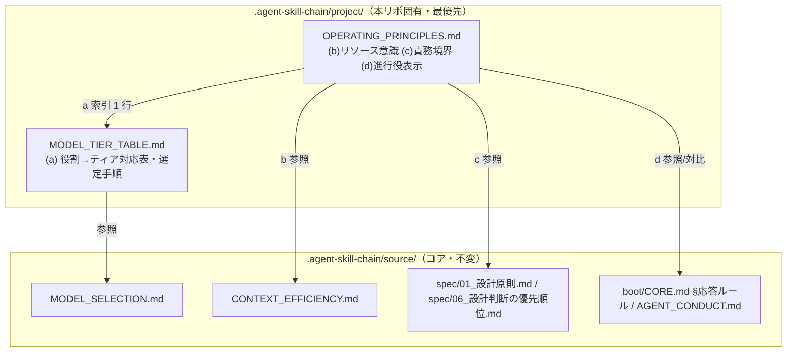

# 設計書: AI駆動システム開発の基本運用原則の正本化（モデルティア選定・リソース意識・責務境界・進行役表示）

**プロジェクト名**: AI駆動システム開発の基本運用原則の正本化（モデルティア選定・リソース意識・責務境界・進行役表示）  
**作成日**: 2026 年 07 月 12 日  
**最終更新**: 2026 年 07 月 12 日

> **重要**: **このドキュメントは常に更新**: 設計の変更や追加があった場合は、即座にこのドキュメントを更新してください。ドキュメントは「生きているドキュメント」として扱い、実装内容と常に同期させます。
>
> **用語**: [.agent-skill-chain/source/CONCEPTS.md §用語規約](../../../../../.agent-skill-chain/source/CONCEPTS.md#用語規約) を参照。

---

## 1. 設計概要

### 1.1 設計方針

本 issue は**ドキュメント（運用原則）の正本化**であり、プログラム実装・API・データモデルを伴わない。4 論点（a〜d）を `.agent-skill-chain/source/`（コア＝抽象原則）と `.agent-skill-chain/project/`（本リポ固有＝具体・強化）の**役割分担**を壊さない形で、**project 側にのみ**正本化する。コア各ファイル本文は 00 §5 除外要件により**一切改変しない**（[00_要求定義.md §5](./00_要求定義.md)）。設計の本質は「**どのファイルに置くか**（責務境界）」と「**既存原則とどう接続し重複を避けるか**（参照関係）」の確定である。

### 1.2 設計原則（本プロジェクトで適用するもの）

[01_設計原則.md](../../../../../.agent-skill-chain/source/spec/01_設計原則.md) のうち本件に適用するものを選ぶ。

- **単一責務**: 1 ファイル 1 責務。(a) の具体対応表と (b)(c)(d) の基本原則強化は責務が異なるため別ファイルに分ける（§2.1）。
- **明確な境界**: コア（抽象原則）／project（具体・強化）の境界、および進行役向け（本件 d）／サブエージェント向け（既存 `AGENT_CONDUCT.md`）の境界を維持する。
- **UNIX 哲学（シンプルに保つ・組み合わせ可能）**: 既存原則を複製せず**参照でつなぐ**。重複定義を作らない。
- **AIフレンドリー設計**: 小さなファイル・意図が分かる命名（`MODEL_TIER_TABLE.md`・`OPERATING_PRINCIPLES.md`）・根拠 1 行として引用しやすい表形式。

---

## 2. アーキテクチャ設計

### 2.1 責務・境界・参照関係

#### 2.1.1 責務一覧

本設計で**新規作成する 2 ファイル**と、**参照のみで改変しない既存ファイル**を分けて示す。

| コンポーネント（ファイル） | 区分 | 責務（1 文） |
| ------------------------- | ---- | ------------ |
| `.agent-skill-chain/project/MODEL_TIER_TABLE.md` | 新規 | 本リポ固有の役割→ティア具体対応表と選定手順（opus 要否先行検討・fable 原則禁止）を、コア `MODEL_SELECTION.md` の project 側正本として持つ（論点 a）。 |
| `.agent-skill-chain/project/OPERATING_PRINCIPLES.md` | 新規 | AI駆動開発全般に適用する本リポ固有の基本運用原則の強化（リソース意識 b・責務境界 c・進行役表示最小化 d）を、コア抽象原則への参照とともに 1 か所に集約する。 |
| `.agent-skill-chain/source/MODEL_SELECTION.md` | 既存・不変 | ティア選定の抽象原則（明記義務・品質ゲート・裁量禁止）。`MODEL_TIER_TABLE.md` の参照先（改変しない）。 |
| `.agent-skill-chain/source/CONTEXT_EFFICIENCY.md` | 既存・不変 | issue 起票局面のコンテキスト効率の具体機構。`OPERATING_PRINCIPLES.md`(b) の参照先（改変しない）。 |
| `.agent-skill-chain/source/spec/01_設計原則.md`・`spec/06_設計判断の優先順位.md` | 既存・不変 | 責務・境界の設計原則の正本。`OPERATING_PRINCIPLES.md`(c) の参照先（改変しない）。 |
| `.agent-skill-chain/source/boot/CORE.md §応答ルール`・`AGENT_CONDUCT.md` | 既存・不変 | 進行役の応答の型／サブエージェント行動規範。`OPERATING_PRINCIPLES.md`(d) の対比・参照先（改変しない）。 |

#### 2.1.2 境界

- **入力**: 00 要求定義・01 要件定義で確定した 4 論点の要求と ADR 方針、コア各ファイルの既存抽象原則。
- **出力**: `.agent-skill-chain/project/` 配下の新規 2 ファイル（正本）。既存コアファイルへの改変は出力に**含めない**。
- **他責務との境界**:
  - **コア本文の改変はしない**（00 §5 除外要件）。project からコアへは**参照リンク**のみを張る（コア→project の逆参照追記もしない）。
  - **既存 project ファイル `自己拡張ワークフロー.md`（issue 配置・memo・close・tmp 隔離の名前空間分離）とは責務が異なる**ため、そこへ追記せず新規ファイルに分ける。`COVERAGE_EXCEPTIONS.md`（カバレッジ例外台帳）とも無関係。
  - **(a) の具体対応表**と**(b)(c)(d) の原則強化**は責務が異なるため、同一ファイルに混載しない（§2.5 ADR-1）。
  - **降格（裁量下振れ）の計測閾値・承認フロー・対応表更新手順**は本 issue のスコープ外（00 §5）。`MODEL_TIER_TABLE.md` はそれらを「コア §裁量の禁止 2 の手続きに従う」と参照するに留め、具体設計しない。

#### 2.1.3 参照関係

依存の向き（呼び出し元 → 呼び出し先）。すべて project → source（またはルート spec）の一方向で、**循環しない**。

- `MODEL_TIER_TABLE.md` → `MODEL_SELECTION.md`（§2 ティア明記義務・§裁量の禁止・§3 品質ゲート・§汎用/固有境界）
- `MODEL_TIER_TABLE.md` → `.agent-skill-chain/runtime/templates/agents/scribe_claude.md:11`（書記=haiku の実在実例）
- `OPERATING_PRINCIPLES.md` (b) → `CONTEXT_EFFICIENCY.md`（§適用のスケーリング）
- `OPERATING_PRINCIPLES.md` (c) → `spec/01_設計原則.md §単一責務・§明確な境界`、`spec/06_設計判断の優先順位.md`
- `OPERATING_PRINCIPLES.md` (d) → `boot/CORE.md §応答ルール`（型の参照）、`AGENT_CONDUCT.md`（対象範囲の対比）
- `OPERATING_PRINCIPLES.md` (a への索引) → `MODEL_TIER_TABLE.md`（1 行の索引リンクのみ。定義は複製しない）

> コア側から project 側への参照は**追加しない**（コア不変・PF 中立性の維持）。project 側からコア側への単方向参照のみとする。

### 2.2 システムアーキテクチャ

- **採用パターン**: 正本分離（Single Source of Truth）＋参照リンク方式。抽象原則はコア 1 か所、具体・本リポ強化は project 1 か所に置き、両者を単方向リンクで接続する。
- **根拠**: [spec/06_設計判断の優先順位.md](../../../../../.agent-skill-chain/source/spec/06_設計判断の優先順位.md)「docs と実装の不整合を放置してはならない」「再利用のために責務を曖昧にしてはならない」、および `MODEL_SELECTION.md §汎用/固有境界`（具体対応表は project に置く）に基づく。

#### 2.2.1 CQRS

本件は状態変更を伴わないドキュメント整備のため CQRS は非適用。

#### 2.2.2 配置図（本プロジェクトの構成）

### 2.3 コンポーネント構成

- **`MODEL_TIER_TABLE.md`（新規・a）**: 役割→ティア対応表（表形式）／opus 要否先行検討の選定手順／fable 原則禁止・最重要時のみ都度例外／品質最優先・コスト二次／裁量禁止との整合の要約（詳細は 00 §7 ADR-1 と本書 §2.5 ADR-2 を参照）。降格手続きの具体は持たず参照に留める。
- **`OPERATING_PRINCIPLES.md`（新規・b/c/d）**: 3 節構成。各節は「本リポでの位置づけ（1〜数文）＋コア参照リンク」で構成し、既存原則本文を複製しない。冒頭に (a) への索引 1 行を置く。

### 2.4 データフロー

本件はデータフローを持たない（ドキュメント整備）。運用時の参照フロー（進行役が対応表の該当行を根拠 1 行として引用する流れ）は 01 のシーケンス図（[01_要件定義.md §2.2 UC1](./01_要件定義.md)）に定義済みのため複製しない。

### 2.5 横断設計判断（ADR）

evidence_source の分類定義は [CONCEPTS.md §外部根拠の必須化](../../../../../.agent-skill-chain/source/CONCEPTS.md#外部根拠の必須化external-anchor)（[EVIDENCE_POLICY.md](../../../../../.agent-skill-chain/source/EVIDENCE_POLICY.md) 経由）を参照する。

#### ADR-1: (a) の配置先 — 新規専用ファイル `MODEL_TIER_TABLE.md` を新設する

- **コンテキスト**: 00 §7.2 で保留された「(a) の具体対応表をどのファイルに置くか」を確定する必要がある。現状 `.agent-skill-chain/project/` にモデルティア言及ファイルは 0 件（00 §1.2 の grep 実測）。
- **検討した選択肢**: (i) 既存 `自己拡張ワークフロー.md` に節を追加する／(ii) `OPERATING_PRINCIPLES.md`（b/c/d と同一ファイル）に節として混載する／(iii) 新規専用ファイル `MODEL_TIER_TABLE.md` を新設する。
- **決定**: (iii) を採用する。
- **根拠**: `evidence_source: existing_code`。`MODEL_SELECTION.md §汎用/固有境界` が「具体ティア対応表・モデル名は `.agent-skill-chain/project/` の定義に従う」と定め、コア 1 ファイルに対する project 側正本という 1:1 対応が最も明快。`自己拡張ワークフロー.md` は issue 配置・memo・close の名前空間分離という別責務（[自己拡張ワークフロー.md](../../../../../.agent-skill-chain/project/自己拡張ワークフロー.md)）であり、混載は spec/01 §単一責務に反する。対応表は「根拠 1 行として引用」する参照頻度が高く（`MODEL_SELECTION.md §2`）、独立した命名で発見性を高める（AIフレンドリー設計）。
- **帰結**: `MODEL_TIER_TABLE.md` が (a) の唯一の正本となる。セッションメモリ `feedback_model-tier-story8.md` は「正本は project」に位置づけが切り替わる（メモリ削除は 00 §5 でスコープ外）。`OPERATING_PRINCIPLES.md` は (a) を索引 1 行で指すのみで定義を複製しない。

#### ADR-2: (a) の「opus 要否先行検討」と裁量禁止の整合を対応表本文で非裁量として明記する

- **コンテキスト**: 「実装着手前に opus 要否を先に検討」が `MODEL_SELECTION.md §裁量の禁止`（裁量上振れ＝「迷ったら上位」の禁止）と衝突すると誤読されうる（00 §7 ADR-1 のリスク）。
- **検討した選択肢**: (i) 選定手順をエージェントの裁量判断として書く／(ii) 選定手順を「ユーザーが定めた対応表の該当行の決め方（非裁量ルール）」として書く。
- **決定**: (ii) を採用し、`MODEL_TIER_TABLE.md` に「opus 要否先行検討は対応表の選定手順そのものであり、裁量上振れではない」旨を明記し、詳細論拠は 00 §7 ADR-1 を参照する。
- **根拠**: `evidence_source: human_decision`（プロジェクトオーナーが本セッションで明示した方針、00 §7 ADR-1）＋ `evidence_source: existing_code`（`MODEL_SELECTION.md §2`「根拠＝対応表の該当行を 1 行明記」・`§裁量の禁止 1`）。
- **帰結**: 選定は非裁量のまま維持。コスト都合の裁量下振れ（降格）は引き続き §裁量の禁止 2 の手続き（計測＋承認＋対応表更新）を要し、本 issue はそれを緩和しない。

#### ADR-3: (b) リソース意識の一般原則化は project 側のみに「開発全般の基本姿勢」として補強する（コア不変）

- **コンテキスト**: 現行 `CONTEXT_EFFICIENCY.md` はトークン/コンテキスト意識を「大規模一括 issue 起票時」の局面限定機構として設計している（`CONTEXT_EFFICIENCY.md:7,57-64`）。ユーザーは「AI駆動開発全般の基本姿勢であるべき」と述べた。00 §7 ADR-2 は上位基本原則層への 1 文追加を候補としたが、本 issue の Constraints によりコア本文改変は不可。
- **検討した選択肢**: (i) `CONTEXT_EFFICIENCY.md` 本文を全面汎化する（00 §5 除外・Constraints 違反）／(ii) コアに抽象原則 1 文を追記する（Constraints でコア改変不可のため採れない）／(iii) `OPERATING_PRINCIPLES.md`(b) に「本リポでは issue 起票局面に限らず AI 駆動開発全般でトークン/コンテキスト意識を基本姿勢とする」という project 側の補強を書き、`CONTEXT_EFFICIENCY.md §適用のスケーリング`（過剰適用回避）を参照して具体機構は起票局面に留めると明記する。
- **決定**: (iii) を採用する。
- **根拠**: `evidence_source: human_decision`（ユーザー方針）＋ `evidence_source: existing_code`（`CONTEXT_EFFICIENCY.md:7,57-64` の既存責務・スケーリング設計）。汎用/固有境界（コア＝抽象、project＝本リポ固有強化）を壊さず、コア不変制約を満たす唯一の選択肢。
- **帰結**: 抽象原則（基本姿勢である旨）は project 側の 1 文で担保され、具体機構（仕様 inventory 索引化・fresh サブハンドオフ等）は既存 `CONTEXT_EFFICIENCY.md` に据え置き。軽量作業への過剰適用は起きない（§適用のスケーリング参照）。二重定義は発生しない。

#### ADR-4: (c) 責務・境界意識は既存 spec への参照強化に留め、新規定義を作らない

- **コンテキスト**: 「責務と境界を意識する」は既に `spec/01_設計原則.md §単一責務・§明確な境界` と `spec/06_設計判断の優先順位.md` に存在する（00 §1.2 で確認済み）。基本原則としての強度・参照されやすさが論点。
- **検討した選択肢**: (i) project 側に責務境界原則を新規に書き起こす（既存 spec と重複定義）／(ii) `OPERATING_PRINCIPLES.md`(c) に「責務・境界意識は設計フェーズに限らず全工程の基本姿勢である」という位置づけ 1 文＋既存 spec への参照リンクのみを置く。
- **決定**: (ii) を採用する。
- **根拠**: `evidence_source: existing_code`（`spec/01_設計原則.md §単一責務・§明確な境界`・`spec/06_設計判断の優先順位.md` の実在）。[spec/06](../../../../../.agent-skill-chain/source/spec/06_設計判断の優先順位.md)「再利用のために責務を曖昧にしてはならない」と整合し、重複定義（spec/06「docs と実装の不整合を放置してはならない」に反する）を避ける。
- **帰結**: 責務・境界原則の正本は spec 側 1 か所のまま。project は「全工程に適用される基本姿勢」という適用範囲の明確化と発見性向上のみを担う。新規原則本文は作らない。

#### ADR-5: (d) 進行役表示最小化は project 側（`OPERATING_PRINCIPLES.md`）に明文化する（コア CORE.md/AGENT_CONDUCT.md 不変）

- **コンテキスト**: 進行役（オーケストレータ）自身の表示最小化を明文化した規定はコアに存在しない（00 §1.2）。00 §7 ADR-4 は `boot/CORE.md §応答ルール` への追記を候補としたが、本 issue の Constraints でコア本文改変は不可。
- **検討した選択肢**: (i) `AGENT_CONDUCT.md`（サブエージェント向け）に進行役条項を追加する（対象混在＋コア改変で二重に不可）／(ii) `boot/CORE.md §応答ルール` に追記する（コア改変不可のため採れない）／(iii) `OPERATING_PRINCIPLES.md`(d) に「進行役自身の応答・表示はユーザーが進捗確認できる程度に留めてよい」を論拠付きで明文化し、`AGENT_CONDUCT.md`（サブ向け）・`boot/CORE.md §応答ルール`（進行役の型）との対象範囲の違いを明記する。
- **決定**: (iii) を採用する。
- **根拠**: `evidence_source: human_decision`（ユーザー方針。論拠＝詳細は review/04・設計計画 00〜03 に残り git 管理されるため情報は失われない）＋ `evidence_source: existing_code`（`AGENT_CONDUCT.md:5` サブエージェント向けの明記・`boot/CORE.md §応答ルール` が型のみで表示量に触れない事実）。CORE.md §ルールの優先順位により project 記述は source より優先されるため、コア不変のまま進行役表示最小化を有効化できる。
- **帰結**: 進行役表示最小化は project 側で有効化される。サブエージェント規範（`AGENT_CONDUCT.md`）とは責務分離を維持し、混同・二重定義を避ける。

---

## 3. 機能設計

本件はドキュメント整備のため「機能」＝各ファイルの記載要件として定義する。

### 3.1 MODEL_TIER_TABLE.md（a）の記載要件

- 役割→ティア対応表（表形式・根拠 1 行として引用可能な粒度）:
  - 設計・レビュー・監査 = opus
  - 実装 = 原則 sonnet（オーケストレータが複雑と判断した箇所は opus 格上げ可）／**まず opus 要否を判定し、不要と確定した場合のみ sonnet**
  - 書記（ログ記録専任）= haiku（`evidence_source: existing_code`：`scribe_claude.md:11` の `model: haiku`）
  - fable = 原則禁止（最重要と明示指定された個別 issue のみ都度例外）
- opus 要否先行検討の選定手順（sonnet デフォルト化＝逆順にしない旨を明記）。
- 品質最優先・コスト二次（`MODEL_SELECTION.md §3` 参照）。
- 裁量禁止との整合（非裁量ルールである旨。ADR-2／00 §7 ADR-1 参照）。
- 降格手続きは持たず参照に留める（00 §5 スコープ外）。

### 3.2 OPERATING_PRINCIPLES.md（b/c/d）の記載要件

- **冒頭**: 本ファイルの責務 1 文＋ (a) は `MODEL_TIER_TABLE.md` 参照の索引 1 行。
- **(b) リソース意識**: 「本リポでは issue 起票局面に限らず AI 駆動開発全般でトークン/コンテキスト意識を基本姿勢とする」1〜2 文＋`CONTEXT_EFFICIENCY.md §適用のスケーリング`（具体機構は起票局面／過剰適用回避）への参照。
- **(c) 責務・境界意識**: 「設計フェーズに限らず全工程の基本姿勢」1 文＋`spec/01_設計原則.md §単一責務・§明確な境界`・`spec/06_設計判断の優先順位.md` への参照（新規定義なし）。
- **(d) 進行役表示最小化**: 「進行役自身の応答・表示はユーザーが進捗確認できる程度に留めてよい」＋論拠（詳細は 00〜04・git 管理で担保）＋`AGENT_CONDUCT.md`（サブ向け）・`boot/CORE.md §応答ルール`（進行役の型）との対象範囲の違いの明記。

### 3.3 エラーハンドリング

該当なし（ドキュメント整備。実行時エラー経路を持たない）。相対リンク切れは実装時の検証（§6・03 のタスク）で防ぐ。

---

## 4. データ設計

該当なし（永続データモデル・テーブルを持たない）。

---

## 5. API 設計

**該当なし（プログラム API を持たない）。** 本件が扱う「インターフェース」はドキュメント上の**参照契約**であり、以下 2 種のみ。いずれも既存インターフェースへの適合であり新規 API を定義しない。

| インターフェース | 入力 | 出力 | 契約 |
| ---------------- | ---- | ---- | ---- |
| 対応表の該当行＝根拠 1 行（a） | 委譲対象の役割 | 対応表の該当 1 行 | `MODEL_SELECTION.md §2`（ティア明記＋根拠 1 行）に適合。根拠の無い指定は不可。 |
| project→source 参照リンク（b/c/d） | 論点の位置づけ文 | コア原則へのリンク | 単方向・非循環（§2.1.3）。相対リンクは実在すること（§6）。 |

契約違反の扱い: 対応表に該当行が無い役割が現れた場合は対応表の更新（`MODEL_SELECTION.md §裁量の禁止 2` の手続き）を要し、裁量での即席指定は不可。

---

## 6. テスト戦略

本件はドキュメント整備のため、テスト＝**成果物の diff レビュー／grep による記載検証／相対リンク実在検証**とする（プログラム単体・結合・E2E は非該当）。観点定義は [RULES.md §テスト戦略必須要件](../../../../../.agent-skill-chain/source/RULES.md#テスト戦略必須要件) を参照。

### 6.1 対象ごとのテスト割り当て

| 対象 | 単体 | 結合/API | E2E | クリティカル観点 | バリデーション観点 | 未達理由/補足 |
| ---- | ---- | -------- | --- | ---------------- | ------------------ | ------------- |
| MODEL_TIER_TABLE.md（a） | × | × | × | 対応表 3 行・opus 要否先行順序・fable 原則禁止・書記=haiku(evidence)・裁量整合が記載（diff レビュー） | 相対リンク実在・逆順記述でない | プログラムでないため単体〜E2E は非該当。検証は diff/grep/リンク実在で代替 |
| OPERATING_PRINCIPLES.md(b) | × | × | × | 開発全般の基本姿勢と明記・CONTEXT_EFFICIENCY 参照・過剰適用回避の維持 | 二重定義でない・相対リンク実在 | 同上 |
| OPERATING_PRINCIPLES.md(c) | × | × | × | 全工程の基本姿勢と明記・spec/01・spec/06 参照・新規定義なし | 重複定義でない・相対リンク実在 | 同上 |
| OPERATING_PRINCIPLES.md(d) | × | × | × | 進行役表示最小化＋論拠・AGENT_CONDUCT との対象範囲差の明記 | 二重定義でない・相対リンク実在 | 同上 |
| コア各ファイル | × | × | × | **改変ゼロ**（`git diff -- .agent-skill-chain/source/` が空） | — | 00 §5 除外要件の担保 |

### 6.2 監査・レビューでの確認（証跡）

本設計 §6.1 の割当表と 03 のタスク別テスト観点・BDD が揃っていることを確認する。受け入れ基準（00 §6 SC1〜SC8・01 の各 AC）との対応は 03 §テスト観点で追跡する。書記記録（write-workflow-log）は 02・03 それぞれ 1 回ずつ行う。

---

## 7. UI 設計

該当なし。

---

## 8. セキュリティ設計

該当なし（機密・認証情報を扱わない。00 §3.2）。

---

## 9. 非機能要件への対応

### 9.1 パフォーマンス

- (a) 対応表は該当行 1 行の引用で完了する軽量な表形式（00 §3.1）。
- (b)(c)(d) は参照リンク中心で記述自体を最小化し、正本化が新たな肥大化要因にならないようにする（01 §3.1）。

### 9.2 可用性

- (a) 選定根拠はセッションメモリ非依存で `.agent-skill-chain/project/` のみで完結する（01 §3.4）。
- (d) 論拠（00〜04＋git 管理）により、進行役が表示を最小化しても情報がセッションを跨いで失われない（01 §3.4）。

---

## 10. 参考資料

### プロジェクトドキュメント

- [`00_要求定義.md`](./00_要求定義.md) - 要求定義（§5 除外要件・§7 ADR-1〜4）
- [`01_要件定義.md`](./01_要件定義.md) - 要件定義（§2 ユーザーストーリー・BDD）

### その他の参考資料

- [.agent-skill-chain/source/MODEL_SELECTION.md](../../../../../.agent-skill-chain/source/MODEL_SELECTION.md) - (a) 抽象原則・§汎用/固有境界
- [.agent-skill-chain/source/CONTEXT_EFFICIENCY.md](../../../../../.agent-skill-chain/source/CONTEXT_EFFICIENCY.md) - (b) 参照先
- [.agent-skill-chain/source/spec/01_設計原則.md](../../../../../.agent-skill-chain/source/spec/01_設計原則.md) - (c) 参照先
- [.agent-skill-chain/source/spec/06_設計判断の優先順位.md](../../../../../.agent-skill-chain/source/spec/06_設計判断の優先順位.md) - (c) 参照先
- [.agent-skill-chain/source/AGENT_CONDUCT.md](../../../../../.agent-skill-chain/source/AGENT_CONDUCT.md) - (d) 対比対象（サブエージェント向け）
- [.agent-skill-chain/source/boot/CORE.md](../../../../../.agent-skill-chain/source/boot/CORE.md) §応答ルール・§ルールの優先順位 - (d) 参照先／project 優先の根拠
- [.agent-skill-chain/project/README.md](../../../../../.agent-skill-chain/project/README.md) §優先順位 - project が source に優先
- [.agent-skill-chain/project/自己拡張ワークフロー.md](../../../../../.agent-skill-chain/project/自己拡張ワークフロー.md) - 責務境界の対比（配置しない先）
- [.agent-skill-chain/source/EVIDENCE_POLICY.md](../../../../../.agent-skill-chain/source/EVIDENCE_POLICY.md) - ADR 形式
- [.agent-skill-chain/source/CONCEPTS.md §外部根拠の必須化](../../../../../.agent-skill-chain/source/CONCEPTS.md#外部根拠の必須化external-anchor) - evidence_source 分類
- `.agent-skill-chain/runtime/templates/agents/scribe_claude.md:11`（`model: haiku`）- (a) 書記=haiku の実在実例

---

## 11. 前のステップ

この設計書は、以下のドキュメントを基に作成されています：

- **前**: [`01_要件定義.md`](./01_要件定義.md) - 要件定義フェーズ

---

## 12. 次のステップ

この設計書の承認後、以下のドキュメントを作成します：

- **次**: [`03_実装計画.md`](./03_実装計画.md) - 実装計画フェーズ
