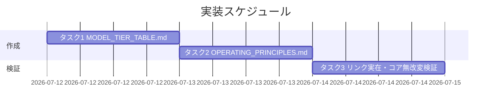

# 実装計画書: AI駆動システム開発の基本運用原則の正本化（モデルティア選定・リソース意識・責務境界・進行役表示）

**プロジェクト名**: AI駆動システム開発の基本運用原則の正本化（モデルティア選定・リソース意識・責務境界・進行役表示）  
**作成日**: 2026 年 07 月 12 日  
**最終更新**: 2026 年 07 月 12 日

> **重要**: **このドキュメントは常に更新**: 実装計画の変更、進捗状況の更新があった場合は、即座にこのドキュメントを更新してください。
> **必須項目**: テスト観点・BDD 仕様は具体ケースを 1 件以上記載する。
>
> **用語**: [.agent-skill-chain/source/CONCEPTS.md §用語規約](../../../../../.agent-skill-chain/source/CONCEPTS.md#用語規約) を参照。

---

## 1. 実装概要

### 1.1 実装方針

[02_設計.md](./02_設計.md) の配置決定（ADR-1〜5）に従い、`.agent-skill-chain/project/` に新規 2 ファイル（`MODEL_TIER_TABLE.md`＝a、`OPERATING_PRINCIPLES.md`＝b/c/d）を作成する。コア `.agent-skill-chain/source/` 配下は一切改変しない（00 §5 除外要件）。既存原則は複製せず参照リンクで接続する。実装＝ドキュメント執筆であり、検証は diff レビュー・grep による記載確認・相対リンク実在検証で行う。

### 1.2 実装順序

1. **タスク 1**: `MODEL_TIER_TABLE.md`（a）を作成。
2. **タスク 2**: `OPERATING_PRINCIPLES.md`（b/c/d）を作成（タスク 1 完了後。冒頭に (a) 索引 1 行を張るため）。
3. **タスク 3**: 相対リンク実在検証＋コア無改変検証（タスク 1・2 完了後）。



---

## 2. タスク分解

**必須**: 各タスクに「テスト観点」（2.x.3）と「BDD 仕様」（2.x.4）を記載する。観点定義は [02_設計 §6](./02_設計.md) および [RULES §テスト戦略必須要件](../../../../../.agent-skill-chain/source/RULES.md#テスト戦略必須要件)・[TEST_BDD_FORMAT.md](../../../../../.agent-skill-chain/source/TEST_BDD_FORMAT.md) を参照。

### 2.1 タスク 1: MODEL_TIER_TABLE.md（a）の作成

#### 2.1.1 概要

本リポ固有の役割→ティア対応表と選定手順を `.agent-skill-chain/project/MODEL_TIER_TABLE.md` に正本化する（02 ADR-1）。

#### 2.1.2 実装内容

- 役割→ティア対応表（表形式・根拠 1 行として引用可能な粒度）:
  - 設計・レビュー・監査 = opus
  - 実装 = 原則 sonnet（複雑箇所は opus 格上げ可）／**まず opus 要否を判定 → 不要と確定した場合のみ sonnet**
  - 書記（ログ記録専任）= haiku（`evidence_source: existing_code`：`scribe_claude.md:11` の `model: haiku`）
  - fable = 原則禁止（最重要と明示指定された個別 issue のみ都度例外）
- opus 要否先行検討の選定手順（「sonnet デフォルト＋複雑時のみ格上げ」の逆順にしない旨を明記）。
- 品質最優先・コスト二次（[MODEL_SELECTION.md §3](../../../../../.agent-skill-chain/source/MODEL_SELECTION.md) 参照）。
- 裁量禁止との整合（非裁量ルールである旨。02 ADR-2／00 §7 ADR-1 参照）。
- 降格の計測閾値・承認フローは持たず `MODEL_SELECTION.md §裁量の禁止 2` の手続きへ参照（00 §5 スコープ外）。
- コア `MODEL_SELECTION.md §汎用/固有境界`・`project/README.md §優先順位` への参照リンク。

#### 2.1.3 テスト観点

**参照**: 観点定義は [02_設計 §6](./02_設計.md)。以下は本タスクの具体ケース（diff レビュー／grep／リンク実在で検証）。

##### 単体（記載検証・必須 1 件以上）

- ファイル `.agent-skill-chain/project/MODEL_TIER_TABLE.md` が存在し、「設計・レビュー・監査=opus」「実装=原則 sonnet」「書記=haiku」の 3 行が対応表として存在する（00 SC1・01 UC1 AC）。
- 「実装」行が「まず opus 要否判定 → 不要と確定した場合のみ sonnet」の順序で読め、「sonnet デフォルト＋複雑時のみ格上げ」の逆順記述になっていない（00 SC2・01 ストーリー2 AC）。
- 「fable 原則禁止／最重要明示指定時のみ都度例外」が記載されている（00 SC3・01 ストーリー3 AC）。
- 書記=haiku の根拠に `evidence_source: existing_code` と `scribe_claude.md:11` が付記されている（00 SC5）。
- 「opus 要否先行検討は非裁量（対応表の該当行の決め方）であり裁量上振れではない」旨が記載され、00 §7 ADR-1 を参照している（00 SC4）。

##### 結合/API

- 該当なし（プログラム API を持たない。02 §5）。ただし「対応表の該当 1 行が委譲パケットの根拠 1 行として引用できる粒度」であることを目視確認する（`MODEL_SELECTION.md §2` 適合）。

##### E2E/受け入れ

- 進行役がセッションメモリを参照せず対応表のみから各役割のティアを選定できる（メモリ非依存。01 §3.4）。プログラム E2E は非該当のため、diff レビューで対応表の自己完結性を確認する。

##### バリデーション

- 相対リンク（`../../../../.agent-skill-chain/source/...`）がすべて実在する（タスク 3 で一括検証）。

#### 2.1.4 単体テスト仕様（BDD）

01 §2.2 UC1 と対応する。

```gherkin
Feature: サブ委譲時のモデルティア選定（対応表の正本化）
  Scenario: 実装委譲で opus 要否を先に検討できる
    Given .agent-skill-chain/project/MODEL_TIER_TABLE.md に役割→ティア対応表が存在する
    And 「実装」行が「まず opus 要否を判定し、不要と確定した場合のみ sonnet」と定義されている
    When レビュワーが対応表の「実装」行を読む
    Then opus 要否先行検討の順序が読み取れる
    And 「sonnet をデフォルトにして複雑時のみ格上げ」の逆順記述でないことを確認できる

  Scenario: 書記はメモリ非依存で haiku を選定できる
    Given 対応表に「書記 = haiku」が evidence_source: existing_code（scribe_claude.md:11）付きで記載されている
    When 進行役が書記タスクのティアを対応表のみから決める
    Then セッションメモリを参照せず haiku を選定できる
    And 「書記 = haiku」の該当行を根拠 1 行として引用できる
```

**検証コマンド例（Given/When/Then をインラインコメントで明記）**

```bash
# Given: MODEL_TIER_TABLE.md が作成済みである
f=.agent-skill-chain/project/MODEL_TIER_TABLE.md
# When: 対応表の必須記載を grep で確認する
grep -q "書記" "$f" && grep -q "haiku" "$f" && grep -q "scribe_claude.md:11" "$f"
# Then: 実装行の順序（opus 要否先行）と fable 原則禁止が存在する
grep -Eq "opus 要否" "$f" && grep -q "fable" "$f" && grep -q "原則禁止" "$f"
```

#### 2.1.5 依存関係

- なし（先頭タスク）。

#### 2.1.6 見積もり

- **工数**: 0.5h ／ **優先度**: 高

### 2.2 タスク 2: OPERATING_PRINCIPLES.md（b/c/d）の作成

#### 2.2.1 概要

リソース意識（b）・責務境界意識（c）・進行役表示最小化（d）の本リポ固有の基本原則強化を `.agent-skill-chain/project/OPERATING_PRINCIPLES.md` に集約する（02 ADR-3/4/5）。

#### 2.2.2 実装内容

- 冒頭: 本ファイルの責務 1 文＋ (a) は `MODEL_TIER_TABLE.md` 参照の索引 1 行。
- **(b)**: 「本リポでは issue 起票局面に限らず AI 駆動開発全般でトークン/コンテキスト意識を基本姿勢とする」1〜2 文＋[CONTEXT_EFFICIENCY.md §適用のスケーリング](../../../../../.agent-skill-chain/source/CONTEXT_EFFICIENCY.md) 参照（具体機構は起票局面・過剰適用回避を維持）。
- **(c)**: 「責務・境界意識は設計フェーズに限らず全工程の基本姿勢」1 文＋[spec/01_設計原則.md §単一責務・§明確な境界](../../../../../.agent-skill-chain/source/spec/01_設計原則.md)・[spec/06_設計判断の優先順位.md](../../../../../.agent-skill-chain/source/spec/06_設計判断の優先順位.md) 参照（新規定義なし）。
- **(d)**: 「進行役自身の応答・表示はユーザーが進捗確認できる程度に留めてよい」＋論拠（詳細は 00〜04・git 管理で担保）＋[AGENT_CONDUCT.md](../../../../../.agent-skill-chain/source/AGENT_CONDUCT.md)（サブ向け）・[boot/CORE.md §応答ルール](../../../../../.agent-skill-chain/source/boot/CORE.md)（進行役の型）との対象範囲の違いを明記。

#### 2.2.3 テスト観点

##### 単体（記載検証・必須 1 件以上）

- (b): 「開発全般の基本姿勢」である旨が明記され、`CONTEXT_EFFICIENCY.md` を参照し、具体機構の過剰適用回避（§適用のスケーリング）を壊さない方針が示される（00 SC6・01 UC3 S1/S2 AC）。二重定義でない。
- (c): 責務境界が「全工程の基本姿勢」として位置づけられ、`spec/01`・`spec/06` を参照、新規定義を作らない（00 SC7・01 UC4 S1 AC）。重複定義でない。
- (d): 進行役表示最小化が論拠（00〜04＋git 管理）付きで明記され、`AGENT_CONDUCT.md`（サブ向け）との対象範囲の違いが明示される（00 SC8・01 UC5 S1/S2 AC）。二重定義・混同でない。
- 冒頭に (a)＝`MODEL_TIER_TABLE.md` の索引 1 行がある。

##### 結合/API

- 該当なし（プログラム API を持たない。02 §5）。project→source 参照が単方向・非循環であることを確認（02 §2.1.3）。

##### E2E/受け入れ

- サブエージェントが起票以外の作業（設計・実装等）でも (b) を基本姿勢として参照でき、進行役が (d) に基づき最小限の完了報告で済ませられる（diff レビューで参照可能性を確認。プログラム E2E は非該当）。

##### バリデーション

- 参照リンクがすべて実在する（タスク 3 で一括検証）。

#### 2.2.4 単体テスト仕様（BDD）

01 §2.2 UC3/UC4/UC5 と対応する。

```gherkin
Feature: リソース意識の一般原則化（b）
  Scenario: 起票以外の作業でもリソース意識を参照できる
    Given OPERATING_PRINCIPLES.md(b) に「issue 起票局面に限らず開発全般の基本姿勢」と記載されている
    When サブエージェントが設計・実装等の作業に従事する
    Then 局面を問わずトークン/コンテキスト配慮を基本姿勢として参照できる
    And CONTEXT_EFFICIENCY.md の起票局面向け具体機構とは役割が分離され過剰適用が強制されない

Feature: 責務・境界意識の基本原則（c）
  Scenario: 既存 spec への参照で重複を避ける
    Given spec/01_設計原則.md §単一責務・§明確な境界 が既に存在する
    When OPERATING_PRINCIPLES.md(c) を読む
    Then 責務境界が全工程の基本姿勢として位置づけられている
    And 新規の原則定義ではなく既存 spec への参照リンクになっている

Feature: 進行役表示最小化（d）
  Scenario: サブエージェント規範との混同を避ける
    Given AGENT_CONDUCT.md §1 結論先行 はサブエージェント向け報告規範である
    When OPERATING_PRINCIPLES.md(d) を読む
    Then 進行役自身の表示最小化が論拠（00〜04＋git 管理）付きで明記されている
    And AGENT_CONDUCT.md（サブ向け）との対象範囲の違いが明示され二重定義でない
```

**検証コマンド例（Given/When/Then をインラインコメントで明記）**

```bash
# Given: OPERATING_PRINCIPLES.md が作成済みである
f=.agent-skill-chain/project/OPERATING_PRINCIPLES.md
# When: b/c/d の必須記載を grep で確認する
grep -q "開発全般" "$f" && grep -q "CONTEXT_EFFICIENCY" "$f"     # (b)
grep -q "spec/01" "$f" && grep -q "全工程" "$f"                  # (c)
# Then: (d) の論拠と AGENT_CONDUCT との対象範囲差が記載されている
grep -q "進行役" "$f" && grep -q "AGENT_CONDUCT" "$f" && grep -q "git" "$f"
```

#### 2.2.5 依存関係

- タスク 1（冒頭に `MODEL_TIER_TABLE.md` への索引 1 行を張るため）。

#### 2.2.6 見積もり

- **工数**: 0.5h ／ **優先度**: 高

### 2.3 タスク 3: 相対リンク実在検証＋コア無改変検証

#### 2.3.1 概要

新規 2 ファイルの相対リンクがすべて実在し、コア `.agent-skill-chain/source/` が一切改変されていないことを検証する（00 §5・02 §6.1）。

#### 2.3.2 実装内容

- 新規 2 ファイル内の markdown 相対リンクの実在検証（未解決 0 件）。
- `git diff -- .agent-skill-chain/source/` が空である（コア無改変）ことの確認。
- `git diff -- .agent-skill-chain/project/自己拡張ワークフロー.md .agent-skill-chain/project/COVERAGE_EXCEPTIONS.md .agent-skill-chain/project/README.md` が空（既存 project ファイル無改変）であることの確認。

#### 2.3.3 テスト観点

##### 単体

- リンク実在検証スクリプトが未解決 0 件を返す。
- コア無改変が git diff で確認できる（00 §5 除外要件の担保・02 §6.1）。

##### 結合/API・E2E・バリデーション

- 該当なし（検証タスクそのもの）。

#### 2.3.4 単体テスト仕様（BDD）

```gherkin
Feature: 成果物の健全性検証
  Scenario: 相対リンクがすべて実在しコアが無改変である
    Given MODEL_TIER_TABLE.md と OPERATING_PRINCIPLES.md が作成済みである
    When リンク実在検証と git diff を実行する
    Then 未解決リンクが 0 件である
    And .agent-skill-chain/source/ 配下の git diff が空である
```

**検証コマンド例（Given/When/Then をインラインコメントで明記）**

```bash
# Given: 新規 2 ファイルが project 配下に作成済みである
files=".agent-skill-chain/project/MODEL_TIER_TABLE.md .agent-skill-chain/project/OPERATING_PRINCIPLES.md"
# When: 各ファイルの相対リンク先の実在を検証する
fail=0
grep -rEon '\]\(([^)]+)\)' $files | while IFS=: read -r f n link; do
  rel=$(printf '%s' "$link" | sed -E 's/^.*\]\(//; s/\).*$//; s/#.*$//')
  case "$rel" in http*|"") continue;; esac
  target=$(realpath -m "$(dirname "$f")/$rel")
  [ -e "$target" ] || { echo "UNRESOLVED: $f:$n -> $rel"; fail=1; }
done
# Then: コア source 配下が無改変である
git diff --quiet -- .agent-skill-chain/source/ && echo "core unchanged"
```

#### 2.3.5 依存関係

- タスク 1・タスク 2。

#### 2.3.6 見積もり

- **工数**: 0.25h ／ **優先度**: 高

---

## テスト観点

本実装計画全体のテスト観点は「**記載検証（対応表 3 行・opus 要否先行順序・fable 原則禁止・書記=haiku evidence・裁量整合・b/c/d の位置づけと参照・(d) 論拠）**」「**二重定義/重複定義の不在**」「**相対リンク実在**」「**コア無改変**」の 4 系統。各タスクの §2.x.3 に具体ケースを記載した。01 の BDD（UC1〜UC5）と本計画のテスト観点の対応は §2.1.4・§2.2.4 に明示済み。

## 単体テスト

プログラム単体テストは非該当（ドキュメント整備）。代替として grep による記載検証・相対リンク実在検証・git diff によるコア無改変検証を単体レベルの検証とする（各タスク §2.x.4 の検証コマンド例）。

## BDD

各タスクの §2.x.4 に Gherkin シナリオを記載。Given/When/Then 形式は [TEST_BDD_FORMAT.md](../../../../../.agent-skill-chain/source/TEST_BDD_FORMAT.md) に従う。01 §2.2 のユースケースとの対応:

| 01 の BDD | 本計画のテスト観点 | 受け入れ基準 |
| --------- | ------------------ | ------------ |
| UC1 S1（opus 要否先行） | タスク1 §2.1.3 実装行順序 | 00 SC2 |
| UC1 S2（書記 haiku メモリ非依存） | タスク1 §2.1.3 書記=haiku evidence | 00 SC1/SC5 |
| UC2 S1（裁量禁止整合） | タスク1 §2.1.3 非裁量明記 | 00 SC4 |
| ストーリー3（fable 原則禁止） | タスク1 §2.1.3 fable 記載 | 00 SC3 |
| UC3 S1/S2（リソース意識・過剰適用回避） | タスク2 §2.2.3 (b) | 00 SC6 |
| UC4 S1（責務境界既存原則） | タスク2 §2.2.3 (c) | 00 SC7 |
| UC5 S1/S2（進行役表示・混同回避） | タスク2 §2.2.3 (d) | 00 SC8 |

---

## 3. 実装スケジュール

### 3.1 マイルストーン

| マイルストーン | 期日 | 成果物 |
| -------------- | ---- | ------ |
| a 正本化 | 2026-07-12 | MODEL_TIER_TABLE.md |
| b/c/d 正本化 | 2026-07-12 | OPERATING_PRINCIPLES.md |
| 検証完了 | 2026-07-12 | リンク実在 0 件・コア無改変 |

### 3.2 実装フェーズ

#### フェーズ 1: 正本化

- **タスク**: タスク 1・タスク 2

#### フェーズ 2: 検証

- **タスク**: タスク 3

---

## 4. テスト計画

テスト観点・BDD の定義は [02_設計 §6](./02_設計.md) および RULES・TEST_BDD_FORMAT を参照。本計画では各タスク §2.x.3 に具体ケース、§2.x.4 に BDD 仕様を記載した。

### 4.1 テストの優先順位

- クリティカル: 対応表 3 行の存在・opus 要否先行順序・書記=haiku evidence・コア無改変（00 §5 除外要件の担保）。
- 回帰: 相対リンク実在（close 移動時の深度補正と同種のリンク切れを予防）。

---

## 5. リスク管理

### 5.1 実装リスク

- **リスク**: (b)(c)(d) を 1 ファイルに集約したことで、各原則が既存コア原則と重複定義になる。
  - **対策**: 各節を「位置づけ 1〜2 文＋参照リンク」に限定し、原則本文を複製しない（02 ADR-3/4/5）。タスク 3 で二重定義の不在を diff レビューする。
- **リスク**: コアファイルを誤って改変する。
  - **対策**: タスク 3 で `git diff -- .agent-skill-chain/source/` が空であることを必須検証（00 §5）。

---

## 6. 参考資料

### プロジェクトドキュメント

- [`02_設計.md`](./02_設計.md) - 設計（ADR-1〜5・§6 テスト戦略）
- [`00_要求定義.md`](./00_要求定義.md) - 要求定義（§5 除外要件・§6 成功基準）
- [`01_要件定義.md`](./01_要件定義.md) - 要件定義（§2 BDD）

### その他の参考資料

- [.agent-skill-chain/source/TEST_BDD_FORMAT.md](../../../../../.agent-skill-chain/source/TEST_BDD_FORMAT.md) - BDD 形式
- [.agent-skill-chain/source/RULES.md §テスト戦略必須要件](../../../../../.agent-skill-chain/source/RULES.md#テスト戦略必須要件) - テスト観点定義

---

## 7. 前のステップ

この実装計画書は、以下のドキュメントを基に作成されています：

- **前**: [`02_設計.md`](./02_設計.md) - 設計フェーズ

---

## 8. 次のステップ

この実装計画書の承認後、以下のステップに進みます：

- 本 issue は単一 issue（サブ issue 分割なし）のため、実装着手前の **review-docs**（実装前ドキュメントレビュー）を経て実装フェーズへ進む。
