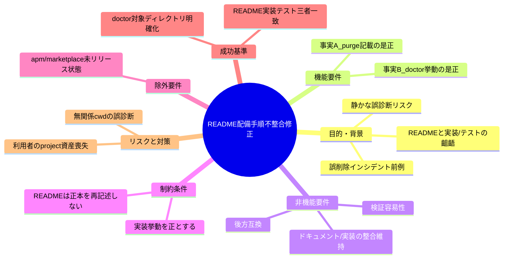
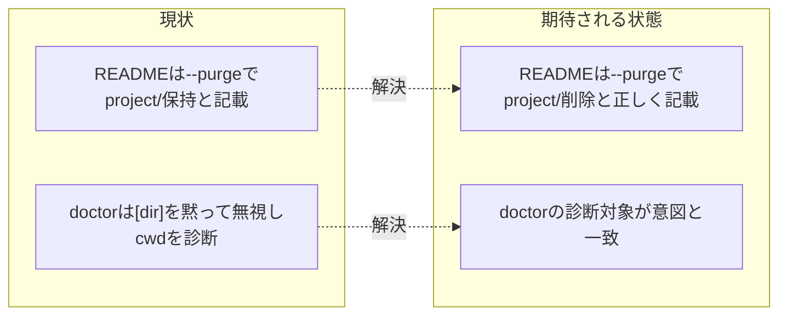

# 要求定義書: README 配備手順の実装・テスト不整合修正

**プロジェクト名**: README 配備手順の実装・テスト不整合修正
**作成日**: 2026 年 07 月 12 日
**最終更新**: 2026 年 07 月 12 日

> **重要**:
>
> - 要求定義書は、プロジェクトの全体像を把握するためのものです。詳細な技術仕様や実装方法は要件定義書以降で記載します。必要最低限の情報に収めることを心掛けてください。
> - **このドキュメントは常に更新**: 要求の変更や追加があった場合は、即座にこのドキュメントを更新してください。ドキュメントは「生きているドキュメント」として扱い、実装内容と常に同期させます。
> - **必須項目**: 以下の「必須」と明記した項目は空欄・抽象語のみ（例: 「{説明}」のまま）で提出しないこと。判定可能な形（目的は1文・成功基準は○/×で判定できる記載等）で記入すること。
>
> **用語**: [.agent-skill-chain/source/CONCEPTS.md §用語規約](../../../../../.agent-skill-chain/source/CONCEPTS.md#用語規約) を参照。

---

## 要求定義の全体像

**注意**:

- 上記の「プロジェクト名」は例です。実際のプロジェクト名に置き換えてください。
- マインドマップは全体像を把握するためのものです。主要なセクション名程度に留め、詳細は記載しないでください。

---

## 1. 目的・背景

### 1.1 目的（必須）

README の配備手順と実装・テストの不整合 2 件を解消する。

### 1.2 背景

本リポジトリは AI 実行契約ワークフロー仕様パッケージ（`package.json` の `name`: `agent-skill-chain`、CLI エントリ: `agents-md` / `bin/agents-md.js`）である。README.md は 3 つの導入導線（apm install / `npx github:` init / Claude marketplace）と CLI サブコマンド（`init` / `upgrade` / `uninstall` / `doctor` / `enforce` 等）の使い方を説明する。

`git clone`（`.git` 保持）で `/tmp` 配下に隔離環境を作り、`npm install` → ビルド → `node bin/agents-md.js <command>` を実行して実機検証した結果、「README や CLI ヘルプの記載」と「実装・自動テストの実挙動」の不整合が 2 件見つかった。いずれも実装・自動テスト側が意図された正しい挙動であり、**README（および doctor の引数取り扱い）側の記載・仕様が実態とずれている**。

- **現状の課題**:
  - **課題 A（`--purge` 記載誤り）**: README.md のアンインストール節の表（`| 区分 | 既定の uninstall | --purge 付き |`）は、`--purge` 付きでも `.agent-skill-chain/project/` は保持され `workflow.db` のみ追加削除される、という趣旨を記載している。しかし実装（`src/agents-md.ts` の `PURGE_ARTIFACTS` および `finalizeAscRoot()`）は `--purge --yes` 指定時に `.agent-skill-chain/project/` を含めて統合ルート `.agent-skill-chain/` ごと完全削除する。自動テスト `test/e2e-install-uninstall.sh` のシナリオ 3（`test_uninstall_purge`）は `project/` が削除されることを PASS として検証しており、実装とテストは一致している。**誤っているのは README.md の当該テーブルである。**
  - **課題 B（`doctor` の `[dir]` 無視）**: CLI の `init` / `upgrade` / `uninstall` / `enforce` は明示的な `[dir]` 引数を受け付け指定先で動作するが、`doctor` は引数を一切受け取らず（`runDoctor(): number` は引数なし、`process.cwd()` を対象にする）、`node bin/agents-md.js doctor <パス>` としても引数は黙って無視され、シェルのカレントディレクトリが診断対象になる。README のサブコマンド表・`agents-md help` 出力とも `doctor` に `[dir]` 記載がなく、この非対称性の注記も存在しない。

- **必要性**:
  - **課題 A**: README を信じた利用者が「`--purge` でも project/ は安全」と誤認し、独自のプロジェクト固有ルール（`.agent-skill-chain/project/` 配下）を失う危険がある。本リポジトリでは 2026-07-11 に「ドキュメントと実装の齟齬による誤削除」インシデントが実際に発生した前例があり、同種リスクを放置できない。spec/06 の原則「docs と実装の不整合を放置してはならない」に直接抵触する。
  - **課題 B**: 利用者や委譲先の AI エージェントが「特定ディレクトリを診断しているつもり」で実際には無関係な cwd を診断する、静かな誤診断が起こりうる。実機検証でも隔離 tmp のパスを渡したのに本番リポジトリ本体（`/home/adachi/projects/AGENTS.md`）の `workflow.db` 健全性が診断された（read-only のため実害はなかったが、誤って本番状態を読んだ）。

### 1.3 期待される効果（必須: 1 件以上）

- **効果 1**: README のアンインストール表の記載と、実装（`src/agents-md.ts`）・自動テスト（`test/e2e-install-uninstall.sh`）の挙動が一致する（○/×: `--purge` で `.agent-skill-chain/project/` が削除される事実を README が正しく記載しているか）。
- **効果 2**: `doctor` の診断対象ディレクトリが利用者の意図と一致する（○/×: `[dir]` を渡した場合にその dir が診断される、または `[dir]` を受け付けない仕様が README・help に明記され、無関係 cwd の誤診断が起こらないか）。

**現状と期待される状態の比較**:

---

## 2. 機能要件

### 2.1 既存機能の維持（該当する場合）

- 既定の `uninstall`（`--purge` なし）が `.agent-skill-chain/project/` およびランタイム資産を保持する挙動は現状どおり維持する（README の該当記載も正しいため変更しない）。
- `init` / `upgrade` / `uninstall` / `enforce` の `[dir]` 引数の受け取り挙動は現状どおり維持する。
- `doctor` の証跡健全性診断（hash チェーン・integrity）機能そのものは維持する。

### 2.2 新規機能要件

- **課題 A の是正**: README.md のアンインストール表（および周辺の説明文）を、`--purge --yes` 時に `.agent-skill-chain/project/` を含む統合ルート `.agent-skill-chain/` が完全削除される実装挙動に合わせて訂正する。
- **課題 B の是正**: `doctor` の診断対象ディレクトリを利用者が制御できるように `[dir]` 引数を受理させる、または受理しない仕様を維持したうえで README・help・（必要なら実行時の出力）で対象 cwd を明示し、非対称性・注意点を明記する。いずれの方針を採るかは要件・設計フェーズで確定する。

---

## 3. 非機能要件

### 3.1 パフォーマンス

- 本件はドキュメント整合と CLI 引数処理が中心であり、性能要件への影響はない。

### 3.2 セキュリティ

- 破壊的操作（`--purge` による削除）の説明を実挙動に一致させることで、利用者の意図しないデータ喪失（project 固有ルールの誤削除）を防止する。

### 3.3 互換性

- 課題 A は README のテキスト訂正であり後方互換に影響しない。
- 課題 B で `doctor [dir]` を新規受理する場合も、引数なし呼び出し（現行挙動 = cwd 診断）は維持し後方互換を壊さない。

### 3.4 保守性

- spec/06 の「docs と実装の不整合を放置してはならない」を満たし、README・実装・自動テストの三者一致を回復する。
- README は正本（`.agent-skill-chain/source/SETUP.md` 等）を再記述せず、必要に応じて参照する（重複記述を増やさない）。

---

## 4. 制約条件

### 4.1 技術的制約

- 実装・自動テストが意図された正しい挙動であり、**README（および doctor の引数仕様）側を実態に合わせる**。実装挙動を README に合わせて変える方向（例: `--purge` で project/ を保持する実装へ変更）は採らない。
- 保持・上書き契約の正本は `.agent-skill-chain/source/SETUP.md`。README は正本を再記述せず参照に留める。

### 4.2 既存システムとの互換性

- 課題 B で `doctor [dir]` を追加する場合、`init` / `uninstall` 等と同じ引数解決規約（`argv[3]` の解釈方法）に揃える。

### 4.3 移行期間・スケジュール

- 本セッションでは 00→01→02→03 作成と実装前ドキュメントレビュー（review-docs）までを行う。**実装（implement-feature）は別セッション・別ブランチで行う**。移行期間の制約は特にない。

---

## 5. 除外要件

- **apm install（`#release/apm`）および Claude marketplace（`/plugin install`）の 2 導線の失敗**は本 issue のスコープ外とする。現時点で `release/apm` / `release/marketplace` ブランチが存在せず（`.github/workflows/release.yml` 自体が `main` 未マージのため GitHub Actions 未登録）、これら導線を実行すると確実に失敗する状態であることは確認済みだが、これは「リリース未実行」という運用状態の問題であり、README 記載自体の誤りではない。01 では background 情報として触れてよいが、受け入れ基準・BDD シナリオの対象には含めない。
- 実装（コード・README の実修正）そのものは本セッションでは行わない（別セッションで実施）。

---

## 6. 成功基準（必須: 1 件以上）

- **基準 1（課題 A）**: 実装（`src/agents-md.ts` の `PURGE_ARTIFACTS` / `finalizeAscRoot()`）・自動テスト（`test/e2e-install-uninstall.sh` シナリオ 3）・README.md のアンインストール表の三者が、「`--purge --yes` は `.agent-skill-chain/project/` を含む統合ルートを完全削除する」という同一事実を矛盾なく表す（○/×: README を読んだ利用者が `--purge` で project/ が削除されると正しく理解できる記載になっているか）。
- **基準 2（課題 B）**: `doctor` の診断対象ディレクトリが利用者の意図と一致する。具体的には次のいずれかを満たす（方針は設計で確定）。(a) `doctor [dir]` を渡すとその dir が診断対象になる、または (b) `[dir]` を受理しない仕様を維持しつつ README・help・実行時出力のいずれかで診断対象 cwd を明示し、渡した引数が無視される旨（他コマンドとの非対称性）が利用者に伝わる。（○/×: 隔離 tmp のパスを渡したときに、本番 cwd を静かに診断してしまう状態が解消されているか）。
- **基準 3**: 01 の BDD シナリオのうちテストコード化できるものが自動テスト（`test/` 配下）と対応づけられている（実装フェーズで検証。本 issue では受け入れ基準として明記）。

---

## 7. リスクと対策

### 7.1 技術的リスク

- **リスク**: 課題 B で `doctor [dir]` を新規受理する実装に踏み込むと、他コマンドの引数解決（絶対パス/相対パスの扱い）との一貫性を欠く恐れがある。
  - **対策**: `init` / `uninstall` の既存 `[dir]` 解決ロジック（`main()` の `argv[3]` 解釈）を踏襲し、設計フェーズで解決規約を明文化する。方針 (a)/(b) の選択は 02_設計 で決定する。

### 7.2 スケジュールリスク

- **リスク**: 本セッションで実装まで進めてしまうと、別ブランチ実装計画と競合する。
  - **対策**: 本セッションは 00〜03 作成と review-docs までに限定し、実装は別セッションで行うことを 00/01 に明記する。

---

## 8. 参考資料

### プロジェクトドキュメント

- [`01_要件定義.md`](./01_要件定義.md) - 本要求に基づく要件定義
- 実装対象: `README.md`（リポジトリルート）、`src/agents-md.ts`
- 自動テスト: `test/e2e-install-uninstall.sh`（シナリオ 3 = `test_uninstall_purge`、既定 uninstall 保持テスト）
- 保持・上書き契約の正本: [`.agent-skill-chain/source/SETUP.md`](../../../../../.agent-skill-chain/source/SETUP.md)

### その他の参考資料

- 実機検証: `/tmp` 配下の隔離環境（`git clone` → `npm install` → ビルド → `node bin/agents-md.js <command>`）で 2 件を実測確認。
- 2026-07-11 の誤削除インシデント（ドキュメントと実装の齟齬に起因）の前例。

---

## 9. 次のステップ

この要求定義書の承認後、以下のドキュメントを作成します：

- **次**: [`01_要件定義.md`](./01_要件定義.md) - 要件定義フェーズ
