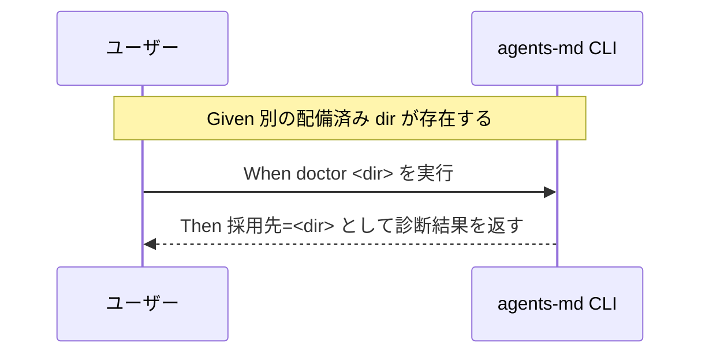

# 要件定義書: README 配備手順の実装・テスト不整合修正

**プロジェクト名**: README 配備手順の実装・テスト不整合修正
**作成日**: 2026 年 07 月 12 日
**最終更新**: 2026 年 07 月 12 日

> **重要**: **このドキュメントは常に更新**: 要件の変更や追加があった場合は、即座にこのドキュメントを更新してください。ドキュメントは「生きているドキュメント」として扱い、実装内容と常に同期させます。
>
> **用語**: [.agent-skill-chain/source/CONCEPTS.md §用語規約](../../../../../.agent-skill-chain/source/CONCEPTS.md#用語規約) を参照。
>
> **本 issue のスコープに関する注意**: 本 issue は 2 件の不整合（事実 A: `--purge` 記載誤り／事実 B: `doctor` の `[dir]` 無視）のみを対象とする。§1.4 で述べる apm / marketplace 導線の失敗は **スコープ外**であり、受け入れ基準・BDD シナリオの対象には**含めない**（background として記載するのみ）。
>
> **実装は別セッション**: 本セッションでは 00→01→02→03 作成と実装前ドキュメントレビュー（review-docs）までを行い、実装（implement-feature）は別セッション・別ブランチで実施する。本ドキュメントはゼロコンテキストの担当者が読んでも実装に着手できる粒度で記述している。

---

## 1. 概要

### 1.1 システム概要

本リポジトリは AI 実行契約ワークフロー仕様パッケージである（`package.json` の `name`: `agent-skill-chain`、CLI エントリ: `agents-md`、実行ファイル: `bin/agents-md.js`、TypeScript ソース: `src/agents-md.ts`）。README.md（リポジトリルート）は導入導線と CLI サブコマンド（`init` / `upgrade` / `uninstall` / `doctor` / `enforce` / `audit` / `export`）の使い方を説明する。

本 issue は、実機検証で判明した「README・CLI ヘルプの記載」と「実装・自動テストの実挙動」の不整合 2 件を修正する。いずれも実装・自動テスト側が意図された正しい挙動であり、README（および doctor の引数仕様）側を実態に合わせる。

### 1.2 用語集

| 用語 | 説明 |
| ---- | ---- |
| 統合ルート | `.agent-skill-chain/` ディレクトリ。配下に `source/`（配布物）・`project/`（プロジェクト固有ルール・ユーザー資産）・`runtime/`（消費者ランタイム生成物・issue 履歴・`workflow.db`）・`templates/` を持つ。 |
| 配備物 | `init` / `setup` が配置する既知エントリ（`.agent-skill-chain/source/`・`AGENTS.md`・`CLAUDE.md`・`.cursor/agents-core.mdc`・所有フック・所有 skill エントリ・`templates/` 等）。`uninstall` の除去対象。 |
| ユーザー資産 | `.agent-skill-chain/project/`・`.cursor`/`.claude` のユーザー作成物・自作スキル・独自フック・`runtime/<issue>`・`workflow.db` 等。既定 `uninstall` では保持される。 |
| `--purge` | `uninstall` のオプション。ユーザー資産（`project/`・`runtime/`）も削除し統合ルートごと完全除去する。 |
| doctor | 配備に必要な前提（`setup.sh`・`bash`・`sqlite3` 等）の有無確認 ＋ 証跡健全性診断（hash チェーン・integrity）を行う read-only サブコマンド。 |

### 1.3 実機検証の一次情報（実装に着手する担当者向け・そのまま参照可）

以下は本 issue 起票時に一次情報として確認・再確認した事実である。ファイルパス・行番号・実行コマンド・出力を引用する。行番号は起票時点（ブランチ `feature/package-adapter`）のものであり、実装時にずれる可能性があるため、識別子（関数名・変数名・文言）でも突合すること。

#### 事実 A: `--purge` 時の `.agent-skill-chain/project/` 保持に関する README 記載誤り

- **README.md の該当箇所**（リポジトリルート `README.md`）:
  - 112 行目付近: 「**アンインストール（つけ外し）**」節。
  - 127 行目: 表ヘッダ `| 区分 | 既定の \`uninstall\` | \`--purge\` 付き |`。
  - 129 行目「除去する配備物」行の `--purge` 列: `同左`（＝既定と同じ配備物のみ。`project/` を追加除去対象として挙げていない）。
  - 130 行目「保持するユーザー資産」行: 保持対象に `.agent-skill-chain/project/` を含み、`--purge` 列は `左に同じ（\`workflow.db\` は削除）`。すなわち「`--purge` でも project/ は保持され、追加で削除されるのは `workflow.db` のみ」という趣旨を記載している。**これが誤り。**
- **実装の実挙動**（`src/agents-md.ts`）:
  - 129 行目付近（help 文言）: `--purge  project/・runtime/（issue 履歴・workflow.db を含む）も削除し統合ルートごと除去する（既定は保持）`。help は正しい。
  - 805〜810 行目 `PURGE_ARTIFACTS`: `[".agent-skill-chain/project", ".agent-skill-chain/runtime"]` を `--purge` 時に追加除去する。
  - 818〜826 行目 `finalizeAscRoot(projectRoot, purge)`: `purge` が真のとき `rmSync(ascRoot, { recursive: true, force: true })` で統合ルート `.agent-skill-chain/` を丸ごと削除し、`削除しました: .agent-skill-chain/（完全削除）` を出力する。
  - すなわち `--purge --yes` は `.agent-skill-chain/project/` を含めて統合ルートごと完全削除する。
- **自動テストの検証**（`test/e2e-install-uninstall.sh`）:
  - `test_uninstall_purge`（152〜171 行目、シナリオ 3）: `mkdir -p "$dest/.agent-skill-chain/project"; echo "keep" > "$dest/.agent-skill-chain/project/x.md"` を用意し、`node "$CLI" uninstall "$dest" --purge --yes` を実行後、170 行目 `assert_absent "$dest/.agent-skill-chain/project/x.md" "purge: project は完全削除で除去される"`、171 行目 `assert_absent "$dest/.agent-skill-chain" "purge: 統合ルート .agent-skill-chain/ ごと除去される"` を PASS として検証する。
  - 既定 `uninstall`（`--purge` なし）が `project/` を保持する挙動は 142 行目・435 行目（シナリオ R3）等で PASS として検証されている。
  - **したがって実装とテストは一致しており、誤っているのは README.md の当該テーブルのみ。**
- **実測確認**: `/tmp` 配下の隔離環境で `init` 実行後に `.agent-skill-chain/project/自己拡張ワークフロー.md` 相当のカスタムファイルを作成し `uninstall --purge --yes` を実行したところ、そのファイルが削除されることを確認した（既定の `uninstall --yes`（`--purge` なし）では正しく保持されることも確認済み）。
- **リスク**: README を信じた利用者が「`--purge` でも project/ は安全」と誤認し、独自のプロジェクト固有ルールを失う可能性がある（本リポジトリでは 2026-07-11 に類似の「ドキュメントと実装の齟齬による誤削除」インシデントが実際に発生した前例がある）。

#### 事実 B: `doctor` サブコマンドが `[dir]` 引数を無視する

- **CLI ディスパッチャ**（`src/agents-md.ts` の `main(argv)`、1218 行目付近〜）:
  - 1221〜1226 行目 `case "init"` / `case "upgrade"`: `const dir = argv[3] ? join(process.cwd(), argv[3]) : process.cwd();`（1223 行目）のように `argv[3]` を対象ディレクトリとして解釈する。`uninstall`（1228〜1239 行目。dir 解決は `rest.find((a) => !a.startsWith("-"))`、1233 行目）・`enforce`（1240〜1250 行目。dir 解決は `rest.filter((a) => !a.startsWith("-"))[1]`、1244 行目）・`audit`（1253〜1258 行目）・`export`（1260〜1265 行目）もいずれも非フラグ引数から `[dir]` を解決して受理する（`audit` / `export` は `argv.slice(3).find((a) => !a.startsWith("-"))`、1255・1262 行目）。
  - 1251〜1252 行目 `case "doctor": return runDoctor();` — **`argv` を一切渡していない。**
  - `runDoctor(): number`（372 行目）は引数を取らず、373 行目 `const projectRoot = process.cwd();` でシェルのカレントディレクトリを対象にする。
- **README・help の記載**:
  - README.md サブコマンド表（91〜95 行目）: `init [dir]` / `upgrade [dir]` / `uninstall [dir]` / `enforce <on|off|status> [dir]` は `[dir]` を明記するが、94 行目 `doctor` 行には `[dir]` が無い。非対称性の注記も無い。
  - `agents-md help` 出力（`src/agents-md.ts` 117 行目付近）: `doctor  配備に必要な前提（setup.sh・bash・sqlite3 等）の有無 ＋ 証跡健全性` と表示し、`[dir]` を受け付ける旨も注記も無い。
- **実測確認**: 隔離 tmp 環境の消費者プロジェクトを検証するつもりで `node bin/agents-md.js doctor <隔離 tmp のパス>` を実行したところ、その引数は黙って無視され、実際にはシェルのカレントディレクトリ（本リポジトリ本体 `/home/adachi/projects/AGENTS.md`）を対象に doctor が実行され、本番リポジトリの `workflow.db` の健全性診断結果が出力された（read-only のため実害はなかったが、誤って本番状態を読んでしまった）。
- **リスク**: 利用者（や委譲先の AI エージェント）が「特定ディレクトリを診断しているつもり」で、実際には無関係な cwd を診断してしまう、静かな誤診断の危険がある。

### 1.4 スコープ外の background（受け入れ基準・BDD の対象外）

- apm install（`#release/apm`）および Claude marketplace（`/plugin install`）の 2 導線は、現時点で `release/apm` / `release/marketplace` ブランチが存在せず（`.github/workflows/release.yml` 自体が `main` 未マージのため GitHub Actions に未登録）、実行すると確実に失敗する状態であることも確認済みである。これは「リリース未実行」という運用状態の問題であり、README 記載自体に誤りがあるわけではないため、**本 issue のスコープには含めない**。本節は background 情報であり、受け入れ基準・BDD シナリオの対象ではない。

---

## 2. 機能要件

### 2.1 ユーザーストーリー

#### ストーリー 1: `--purge` の破壊範囲を正しく理解できる README

- **As a** 本パッケージの利用者（`.agent-skill-chain/project/` に自作のプロジェクト固有ルールを置いている人）
- **I want to** README のアンインストール表から、`--purge --yes` が `.agent-skill-chain/project/` を含めて統合ルートごと完全削除することを正しく読み取りたい
- **So that** `--purge` を「project/ は安全」と誤認して自作ルールを失う事故を防げる

**受け入れ基準**:

- README.md のアンインストール表（127 行目付近の `| 区分 | 既定の uninstall | --purge 付き |`）が、`--purge` 付きで `.agent-skill-chain/project/` が削除される事実を明確に表す（「保持」列に project/ を残したまま「workflow.db のみ削除」と読める記載を解消する）。
- README の記載が実装（`PURGE_ARTIFACTS` / `finalizeAscRoot()`）および自動テスト `test_uninstall_purge` の挙動と矛盾しない。
- 既定 `uninstall`（`--purge` なし）が project/ を保持する旨の記載は維持される（正しいため変更しない）。
- README は保持・上書き契約の正本（`.agent-skill-chain/source/SETUP.md`）を再記述せず、必要に応じ参照に留める。

#### ストーリー 2: `doctor` の診断対象が意図と一致する

- **As a** 特定ディレクトリ（隔離環境や別プロジェクト）の配備状態を診断したい利用者・AI エージェント
- **I want to** `doctor` に渡したディレクトリが実際に診断される、または引数を受理しない仕様と診断対象 cwd が明示されている状態にしたい
- **So that** 意図しない無関係な cwd（例: 本番リポジトリ本体）を静かに診断してしまう誤診断を避けられる

**受け入れ基準**:

- 次のいずれかを満たす（方針の選択は 02_設計 で確定する）。
  - **方針 (a)**: `doctor [dir]` を受理し、渡した dir を診断対象にする（引数なしは従来どおり cwd 診断で後方互換維持）。この場合 `runDoctor` が対象ディレクトリを引数で受け取り、`main()` の `case "doctor"` が `init` / `uninstall` と同じ引数解決規約で dir を渡す。README サブコマンド表・help も `doctor [dir]` に更新する。
  - **方針 (b)**: `[dir]` を受理しない仕様を維持し、README・help・（必要なら doctor 実行時の出力）で「doctor は常に cwd を診断する。他コマンドと異なり `[dir]` を受け付けない」旨と非対称性を明示する。doctor は既に実行時に `doctor: 採用先=<projectRoot>` を出力しており（384 行目）、この明示を README/help の注記で補強する。
- どちらの方針でも、隔離 tmp のパスを渡したときに本番 cwd を静かに診断してしまう現状は解消される。
- 後方互換: 引数なし `doctor`（現行の cwd 診断）は維持する。

### 2.2 BDD ユースケース

#### ユースケース 1: `--purge` の README 記載を実装・テストに一致させる

README のアンインストール表が、`--purge --yes` の破壊範囲を実装・テストと矛盾なく記載している状態を保証する。テストコード化は「README のテキストが実装挙動と一致するか」の静的検証と、実装挙動を裏づける既存 E2E テストの二段で担保する。

**シナリオ 1: `--purge --yes` は project/ を含め統合ルートを完全削除する（実装挙動の裏づけ）**

```gherkin
Feature: uninstall --purge の破壊範囲
  Scenario: --purge --yes は project/ を含め統合ルートを完全削除する
    Given install 済みの採用先ディレクトリに .agent-skill-chain/project/ とカスタムファイルが存在する
    When uninstall <dir> --purge --yes を実行する
    Then .agent-skill-chain/project/ 配下のカスタムファイルが削除される
    And 統合ルート .agent-skill-chain/ ごと削除される
```

（対応する既存自動テスト: `test/e2e-install-uninstall.sh` の `test_uninstall_purge`、シナリオ 3。170〜171 行目でこの Then を PASS として検証済み。本 issue で新規実装するのは README 側の訂正のため、このシナリオは「実装挙動が変わっていないこと」の回帰として維持する。）

**シナリオ 2: README のアンインストール表が --purge の project/ 削除を正しく表す**

```gherkin
Feature: README とアンインストール実挙動の整合
  Scenario: README のアンインストール表が --purge での project/ 削除を正しく表す
    Given 修正後の README.md
    When アンインストール表の "--purge 付き" 列を読む
    Then .agent-skill-chain/project/ が --purge で削除される（保持されない）と読み取れる
    And 既定 uninstall では project/ が保持されると読み取れる
    And 記載内容が実装（PURGE_ARTIFACTS / finalizeAscRoot）と矛盾しない
```

（テストコード化: README のテキスト検証は grep ベースの静的チェック等で近似可能。完全な自然言語整合の自動判定は困難なため、その旨と代替（review-docs / 人手レビュー ＋ 既存 E2E による実装裏づけ）を 03/04 に明記する。）

#### ユースケース 2: `doctor` の診断対象を意図と一致させる

**シナリオ 1: 方針 (a) を採る場合 — doctor [dir] が渡した dir を診断する**

```gherkin
Feature: doctor の診断対象ディレクトリ
  Scenario: doctor [dir] が渡したディレクトリを診断する
    Given カレントディレクトリとは別の配備済みディレクトリ <dir> が存在する
    When doctor <dir> を実行する
    Then 診断対象が <dir> になる（"doctor: 採用先=<dir>" が出力される）
    And 引数なし doctor は従来どおり cwd を診断する（後方互換）
```

**シナリオ 2: 方針 (b) を採る場合 — 非対称性が明示され誤診断を防ぐ**

```gherkin
Feature: doctor の引数仕様の明示
  Scenario: doctor は [dir] を受け付けず cwd 診断であることが明示される
    Given 修正後の README.md および agents-md help 出力
    When doctor のサブコマンド説明を読む
    Then doctor は他コマンドと異なり [dir] を受け付けず常に cwd を診断すると明記されている
    And doctor 実行時に診断対象 cwd（"doctor: 採用先=<cwd>"）が出力されることが利用者に伝わる
```

**処理フロー**（方針 (a) の例・必要に応じて）:



### 2.3 ビジネスルール

- **実装挙動を正とする**: 実装・自動テストが意図された正しい挙動である。README（および doctor の引数仕様）側を実態に合わせる。実装を README に合わせて変える方向（`--purge` で project/ を保持する実装へ変更する等）は採らない。
- **正本の非重複**: README は保持・上書き契約の正本（`.agent-skill-chain/source/SETUP.md`）を再記述しない。
- **後方互換維持**: 引数なし `doctor`（cwd 診断）・既定 `uninstall`（project/ 保持）の挙動は変更しない。
- **スコープ限定**: 事実 A・B の 2 件のみを対象とする。apm / marketplace 導線の未リリース状態はスコープ外。

---

## 3. 非機能要件

### 3.1 パフォーマンス要件

- 本件はドキュメント整合と CLI 引数処理が中心であり、性能への影響はない。

### 3.2 セキュリティ要件

- 破壊的操作（`--purge`）の説明を実挙動に一致させ、利用者の意図しないデータ喪失（project 固有ルールの誤削除）を防止する。

### 3.3 ユーザビリティ要件

- README・help を読んだ利用者が、`--purge` の破壊範囲と `doctor` の診断対象を誤解なく理解できる。

### 3.4 可用性要件

- 該当なし（CLI・ドキュメントの整合修正であり可用性への影響はない）。

---

## 4. 外部インターフェース要件

### 4.1 API 要件

- CLI サブコマンドインターフェース: 方針 (a) を採る場合、`doctor [dir]` を新設する（引数解決は `init` / `uninstall` の既存規約に揃える）。方針 (b) を採る場合、CLI インターフェースは変更せず README・help の記載のみ更新する。

### 4.2 データ形式要件

- 該当なし。

---

## 5. 制約事項

- **実装は別セッション・別ブランチで実施**する。本セッションは 00〜03 作成と review-docs までに限定する。
- 実装挙動を正とし、README・doctor 引数仕様側を実態に合わせる。
- README は正本（`.agent-skill-chain/source/SETUP.md`）を再記述せず参照に留める。
- 事実 A・B の 2 件のみをスコープとし、apm / marketplace 導線の未リリース状態は対象外。
- 方針 (a)/(b) の最終選択は 02_設計 で確定する（本 01 では両論を受け入れ基準として許容）。

---

## 6. 参考資料

### プロジェクトドキュメント

- [`00_要求定義.md`](./00_要求定義.md) - 要求定義
- 実装対象: `README.md`（リポジトリルート、112〜133 行目付近のアンインストール節・91〜95 行目のサブコマンド表）、`src/agents-md.ts`（`runDoctor` 372 行目・`main` の `case "doctor"` 1251 行目・`PURGE_ARTIFACTS` 807 行目・`finalizeAscRoot` 818 行目・help 117/129 行目）
- 自動テスト: `test/e2e-install-uninstall.sh`（`test_uninstall_purge` 152〜171 行目、既定 uninstall 保持シナリオ R3 407〜435 行目）
- 保持・上書き契約の正本: [`.agent-skill-chain/source/SETUP.md`](../../../../../.agent-skill-chain/source/SETUP.md)

### その他の参考資料

- spec/06 設計判断の優先順位「docs と実装の不整合を放置してはならない」
- 2026-07-11 の誤削除インシデント前例。

---

## 7. 前のステップ

この要件定義書は、以下のドキュメントを基に作成されています：

- **前**: [`00_要求定義.md`](./00_要求定義.md) - 要求定義フェーズ

---

## 8. 次のステップ

この要件定義書の承認後、以下のドキュメントを作成します：

- **次**: [`02_設計.md`](./02_設計.md) - 設計フェーズ
