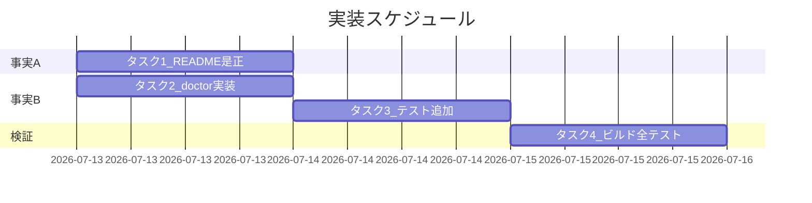

# 実装計画書: README 配備手順の実装・テスト不整合修正

**プロジェクト名**: README 配備手順の実装・テスト不整合修正
**作成日**: 2026 年 07 月 12 日
**最終更新**: 2026 年 07 月 12 日

> **重要**: **このドキュメントは常に更新**: 実装計画の変更、進捗状況の更新、バグの記録などがあった場合は、即座にこのドキュメントを更新してください。ドキュメントは「生きているドキュメント」として扱い、実装内容と常に同期させます。
> **必須項目**: 「必須」と明記した欄は空欄・抽象語のみで提出しないこと。テスト観点・BDD 仕様は具体ケースを 1 件以上記載する。
>
> **用語**: [.agent-skill-chain/source/CONCEPTS.md §用語規約](../../../../../.agent-skill-chain/source/CONCEPTS.md#用語規約) を参照。
>
> **実装は別セッション**: 本計画は、ゼロコンテキストの担当者が別ブランチで実装着手できるよう具体テキスト案・対象行を明記する。行番号は起票時点（ブランチ `feature/package-adapter`）のもので、実装時にずれ得るため識別子（関数名・表ヘッダ文言）で再特定すること。**実装着手前に review-docs（実装前ドキュメントレビュー）が必須ゲート**である。

---

## 1. 実装概要

### 1.1 実装方針（必須）

実装・自動テストを正とし、ドキュメント（README）・CLI 引数仕様側を実態に一致させる。事実 A は README テキストの是正のみ（実装・テストは変更しない）。事実 B は 02_設計 ADR-1 の方針 (a) に従い、`doctor` に `[dir]` を受理させ（`init`/`uninstall`/`audit`/`export` と同一規約）、README・help を追随させ、自己テストを 1 件追加する。既存の正しい挙動（引数なし doctor の cwd 診断・既定 uninstall の project/ 保持）は後方互換として維持する。

### 1.2 実装順序（必須: 1 件以上）

1. **タスク 1**: 事実 A — README アンインストール表・補足文の是正（依存なし）。
2. **タスク 2**: 事実 B — `src/agents-md.ts` の `doctor [dir]` 受理（`runDoctor` シグネチャ ＋ `case "doctor"` ＋ help ＋ README サブコマンド表）。
3. **タスク 3**: 事実 B — `test/test-cli-audit-doctor.sh` に `doctor [dir]` 受理の自己テストを追加。タスク 2 に依存。
4. **タスク 4**: ビルド ＋ 全テスト再実行（`test/e2e-install-uninstall.sh` 回帰・`test/test-cli-audit-doctor.sh`）と結果記録。タスク 1〜3 に依存。



---

## 2. タスク分解

**必須**: 各タスクに「テスト観点」（2.x.3）と「単体テスト仕様（BDD）」（2.x.4）を記載する。観点の定義は 02_設計 §6 および RULES／TEST_BDD_FORMAT を参照し、本書ではタスクごとの具体ケースのみ記載する。

### 2.1 タスク 1: 事実 A — README アンインストール表・補足文の是正

#### 2.1.1 概要（必須）

`README.md` のアンインストール表が `--purge --yes` で `.agent-skill-chain/project/` を含む統合ルートを完全削除する実装挙動と一致するよう是正する。

#### 2.1.2 実装内容（必須: 1 件以上）

対象: `README.md`（リポジトリルート）。変更前後の具体案は **02_設計 §3.1.2** に記載。要点のみ再掲する。

- (1) 表「保持するユーザー資産」行の `--purge` 列（130 行目）: `左に同じ（\`workflow.db\` は削除）` → **`.agent-skill-chain/project/ を含めすべて削除（統合ルート .agent-skill-chain/ ごと完全削除）`**。
- (2) 表「除去する配備物」行の `--purge` 列（129 行目）: `同左` → **`同左 ＋ .agent-skill-chain/project/・.agent-skill-chain/runtime/（issue 履歴・workflow.db を含む）`**（結果として統合ルートごと削除）。
- (3) 表直後に注記 1 文を補う（任意・推奨）: 「`--purge --yes` は『保持するユーザー資産』を含め `.agent-skill-chain/` を丸ごと削除する。」
- (4) 補足文（133 行目）「…uninstall で保持される」を「…**既定の** uninstall で保持される（`--purge` では削除される）」に限定（推奨）。
- 変更しない: 各行の**既定 uninstall 列**、help 文言（`src/agents-md.ts` 129 行目）、実装、E2E テスト。正本（`SETUP.md`）の再記述を増やさない・既存参照リンクは維持。

#### 2.1.3 テスト観点（必須）

**参照**: 定義は 02_設計 §6・RULES／TEST_BDD_FORMAT。本タスクの具体ケースのみ記載。

##### 単体（本タスクの具体ケース）

- 該当なし（README テキストの是正。実行時ロジックを持たない）。

##### 結合/CLI（本タスクの具体ケース）

- 該当なし（実装は変更しない）。

##### E2E/受け入れ（本タスクの具体ケース・未達時は理由記載）

- 実装挙動の裏づけ回帰: `test/e2e-install-uninstall.sh` の `test_uninstall_purge`（152〜172 行目）が引き続き PASS すること（`--purge --yes` で project/x.md・統合ルートが削除される）。本タスクで実装は変えないため、この E2E は「実装挙動が README 記載と一致していること」の裏づけとして再実行のみ。
- README テキストと実装の整合そのものは自然言語判定のため自動 E2E 化困難 → **review-docs（実装前レビュー）＋ 人手レビュー**で担保（02_設計 §6.1）。

##### バリデーション（該当する場合の具体ケース・任意の補助静的チェック）

- 任意: `grep` による静的近似チェック。例: 修正後 README に「旧誤記（`--purge` 列に『左に同じ（workflow.db は削除）』）」が残っていない、かつ `--purge` 節が project/ の削除に言及している、を確認する簡易チェックを検証コマンドとして残してよい（テストコード化は必須ではない。実施可否は担当裁量）。

#### 2.1.4 単体テスト仕様（BDD）（必須）

```gherkin
Feature: README とアンインストール実挙動の整合
  Scenario: README のアンインストール表が --purge での project/ 削除を正しく表す
    Given 修正後の README.md
    When アンインストール表の "--purge 付き" 列を読む
    Then .agent-skill-chain/project/ が --purge で削除される（保持されない）と読み取れる
    And 既定 uninstall では project/ が保持されると読み取れる
    And 記載内容が実装（PURGE_ARTIFACTS / finalizeAscRoot）と矛盾しない
```

**テストコード例（静的近似・任意の補助チェック。Given/When/Then をインラインコメントで明記）**

```bash
# Given: 修正後の README.md（リポジトリルート）
README="README.md"
# When: --purge 列の記載を検査する
# Then: 旧誤記が消え、--purge が project/ 削除を表す語を含む
if grep -nF '左に同じ（`workflow.db` は削除）' "$README" >/dev/null; then
  echo "NG: 旧誤記が残存"; exit 1
fi
grep -nE 'purge.*project|project.*削除|完全削除' "$README" >/dev/null \
  && echo "OK: --purge の project 削除が記載されている" \
  || { echo "NG: --purge の project 削除記載が見当たらない"; exit 1; }
```

> 注: 上記は自然言語整合の**近似**であり、真の整合判定は review-docs／人手レビューで行う（02_設計 §6.1）。テストコード化必須ではない。

#### 2.1.5 依存関係

- なし（独立して着手可能）。

#### 2.1.6 見積もり

- **工数**: 0.5h  **優先度**: 高（安全性に直結・誤削除防止）

### 2.2 タスク 2: 事実 B — `doctor [dir]` を受理させる（実装・ADR-1 方針 a）

#### 2.2.1 概要（必須）

`doctor` に `[dir]` を受理させ、`init`/`uninstall`/`audit`/`export` と同一の引数解決規約に揃える。引数なしは cwd 診断（後方互換）。

#### 2.2.2 実装内容（必須: 1 件以上）

対象: `src/agents-md.ts`・`README.md`。変更前後の具体案は **02_設計 §3.2.2** に記載。要点のみ再掲する。

- (1) `runDoctor(): number`（372 行目）→ `runDoctor(projectRoot: string = process.cwd()): number` に変更し、373 行目の `const projectRoot = process.cwd();` を削除（本体は既存の変数 `projectRoot` 参照のまま無改変）。
- (2) `main()` の `case "doctor": return runDoctor();`（1251〜1252 行目）を、`case "audit"`（1253〜1258 行目）と同型の非フラグ引数解決に置き換え、`runDoctor(dir)` を呼ぶ（`dir` は `--` 始まりでない第 1 引数。絶対パスはそのまま・相対は `join(process.cwd(), dir)`）。`join` は import 済み・追加 import 不要。
- (3) `printHelp()` の doctor 行（117 行目）を `doctor [dir]` に更新。
- (4) `README.md` サブコマンド表の `doctor` 行（94 行目）を `doctor [dir]` に更新し説明文を調整。

#### 2.2.3 テスト観点（必須）

##### 単体（本タスクの具体ケース）

- 該当なし（`runDoctor` は I/O・spawn を伴うため純粋単体化しない。CLI 自己テスト＝タスク 3 で担保）。

##### 結合/CLI（本タスクの具体ケース・必須）

- `doctor <dir>`（配備済みの別 dir）を実行 → 出力に `doctor: 採用先=<dir>` が含まれ、cwd ではなく `<dir>` が診断される（タスク 3 で実装）。
- 引数なし `doctor`（cwd 診断）が従来どおり動く＝既存 `doctor_healthy`（83 行目）等が無改変で PASS（後方互換）。

##### E2E/受け入れ（本タスクの具体ケース）

- E2E としては CLI 自己テスト（タスク 3）で代替。専用 E2E ファイルは新設しない（過剰）。

##### バリデーション（該当する場合の具体ケース）

- 絶対パス（`/tmp/...`）と相対パス（`sub/dir`）の双方で対象が正しく解決されること（タスク 3 の 1 ケースは絶対パスで担保。相対は必要なら追加）。

#### 2.2.4 単体テスト仕様（BDD）（必須）

```gherkin
Feature: doctor の診断対象ディレクトリ
  Scenario: doctor [dir] が渡したディレクトリを診断する
    Given カレントディレクトリとは別の配備済みディレクトリ <dir> が存在する
    When doctor <dir> を実行する
    Then 診断対象が <dir> になる（"doctor: 採用先=<dir>" が出力される）
    And 引数なし doctor は従来どおり cwd を診断する（後方互換）
```

**テストコード例（TypeScript 相当の擬似・実体は bash 自己テスト＝タスク 3。Given/When/Then をインラインで明記）**

```typescript
// Given: cwd とは別の配備済みディレクトリ dir（AGENTS.md と workflow.db を持つ）
// When: main(["node","agents-md","doctor", dir]) を実行する（cwd は別の場所）
// Then: runDoctor が dir を対象に呼ばれ、出力に `doctor: 採用先=${dir}` が含まれる
//       （dir とは無関係な cwd が診断されない）
```

#### 2.2.5 依存関係

- なし（タスク 3 が本タスクに依存）。

#### 2.2.6 見積もり

- **工数**: 0.5h  **優先度**: 高

### 2.3 タスク 3: 事実 B — `doctor [dir]` 受理の自己テスト追加

#### 2.3.1 概要（必須）

`test/test-cli-audit-doctor.sh` に、`doctor <dir>` が渡した dir を診断することを検証するケースを追加する。

#### 2.3.2 実装内容（必須: 1 件以上）

- `test/test-cli-audit-doctor.sh` の doctor セクション（71〜125 行目）に新規関数 `doctor_dir_arg` を追加し呼び出す。既存ケースは `cd "$H" && node "$BIN" doctor`（cwd ベース）だが、新ケースは **cwd を別の場所に置いたまま第 1 引数で対象 dir を渡す**形にする（引数が効いていることを証明するため cwd と対象を分離する）。
- アサーション: 出力に `doctor: 採用先=<dir>`（384 行目の出力）が含まれること、および対象 dir 側の証跡健全性行（`hash チェーン検証 = 整合` 等）が出ること。既存 `assert_contains` ヘルパを流用する。

#### 2.3.3 テスト観点（必須）

##### 単体（本タスクの具体ケース）

- 該当なし（テスト自体の追加）。

##### 結合/CLI（本タスクの具体ケース・必須）

- 正常系: cwd を tmp の無関係な場所に置き、`node "$BIN" doctor "$H"`（$H=健全 DB を持つ配備済み dir）を実行 → 出力に `採用先=$H` と `hash チェーン検証 = 整合` が含まれる。
- 後方互換系（既存で担保・再確認）: `cd "$H" && node "$BIN" doctor`（引数なし）で従来どおり cwd=$H が診断される。

##### E2E/受け入れ（本タスクの具体ケース）

- 該当なし（CLI 自己テストで受け入れを担保）。

##### バリデーション（該当する場合の具体ケース）

- 絶対パス引数で対象解決されること（本ケースが絶対パスで担保）。相対パスは必要に応じ追加（任意）。

#### 2.3.4 単体テスト仕様（BDD）（必須）

```gherkin
Feature: doctor [dir] 受理の自己テスト
  Scenario: cwd と別の配備済み dir を doctor <dir> で診断する
    Given 健全 DB を持つ配備済みディレクトリ H が存在し、シェルの cwd は H とは別の場所である
    When node bin/agents-md.js doctor <H> を実行する
    Then 出力に "doctor: 採用先=<H>" が含まれる
    And 出力に "hash チェーン検証 = 整合" が含まれる（H の証跡が診断された）
```

**テストコード例（bash・Given/When/Then をインラインで明記）**

```bash
doctor_dir_arg() {
  # シナリオ: cwd と別の配備済み dir を doctor <dir> で診断する（引数が効くこと）
  # Given: 健全 DB を持つ配備済み dir H。cwd は無関係な tmp に置く
  local WORK; WORK="$(mktemp -d)"
  local out
  # When: cwd を WORK にしたまま第1引数で H を渡す
  out="$( cd "$WORK" && node "$BIN" doctor "$H" 2>&1 )"
  # Then: 採用先が H で、H の証跡健全性が診断される
  assert_contains "採用先=$H" "$out" "doctor [dir]: 引数の dir が採用先になる"
  assert_contains "hash チェーン検証 = 整合" "$out" "doctor [dir]: 渡した dir の証跡が診断される"
  rm -rf "$WORK"
}
doctor_dir_arg
```

#### 2.3.5 依存関係

- タスク 2（`doctor [dir]` 実装）に依存。

#### 2.3.6 見積もり

- **工数**: 0.5h  **優先度**: 高

### 2.4 タスク 4: ビルド ＋ 全テスト再実行と結果記録

#### 2.4.1 概要（必須）

TypeScript をビルドし、影響テストを再実行して回帰なし・新規ケース PASS を確認・記録する。

#### 2.4.2 実装内容（必須: 1 件以上）

- ビルド（`src/agents-md.ts` → `bin/agents-md.js`。プロジェクトのビルド手順に従う。例: `npm run build` 相当）。
- テスト実行（**tmp 隔離を厳守**・自己拡張ワークフロー §テストの tmp 隔離）:
  - `bash test/test-cli-audit-doctor.sh`（doctor 証跡健全性 ＋ 新規 `doctor [dir]`）。
  - `bash test/e2e-install-uninstall.sh`（`test_uninstall_purge` 回帰）。
  - 必要に応じ `test/run-all.sh` の関連セット。
- 破壊的 CLI（uninstall/init）は必ず tmp 対象を明示指定し、本リポ本体（`.agent-skill-chain/` `.claude/` `workflow.db` 等）を変更しないこと（過去 2026-07-11 に実リポ誤 uninstall 事故あり）。

#### 2.4.3 テスト観点（必須）

##### 単体 / 結合/CLI / E2E

- 上記テスト群がすべて PASS。新規 `doctor_dir_arg` が PASS。`test_uninstall_purge` が PASS（回帰なし）。既存 doctor ケース（cwd ベース）が PASS（後方互換）。

##### バリデーション

- 該当なし。

#### 2.4.4 単体テスト仕様（BDD）（必須）

```gherkin
Feature: 変更後の回帰安全性
  Scenario: 全関連テストが緑
    Given タスク1〜3 適用後にビルド済みの bin/agents-md.js
    When test-cli-audit-doctor.sh と e2e-install-uninstall.sh を tmp 隔離で実行する
    Then 新規 doctor [dir] ケースが PASS する
    And test_uninstall_purge が PASS する（回帰なし）
    And 既存の cwd ベース doctor ケースが PASS する（後方互換）
```

**テストコード例（bash・Given/When/Then をインラインで明記）**

```bash
# Given: タスク1〜3 適用後・ビルド済み
# When: 関連テストを tmp 隔離で実行
bash test/test-cli-audit-doctor.sh
bash test/e2e-install-uninstall.sh
# Then: いずれも終了コード 0（PASS）。結果を 04_review に記載する
```

#### 2.4.5 依存関係

- タスク 1・2・3 に依存。

#### 2.4.6 見積もり

- **工数**: 0.5h  **優先度**: 高

---

## テスト観点

- 事実 A: 実装挙動は既存 E2E（`test_uninstall_purge`）で裏づけ。README テキスト整合は review-docs／人手レビューで担保（自然言語判定のため自動 E2E 化困難）＋任意の grep 静的近似。
- 事実 B: `doctor [dir]` の CLI 自己テスト（新規 `doctor_dir_arg`）＋ 引数なし後方互換（既存 doctor ケース）。
- 全体: ビルド後にタスク 4 で回帰確認。破壊的 CLI 検証は tmp 隔離・対象明示（自己拡張ワークフロー §テストの tmp 隔離）。

---

## 単体テスト

純粋単体（関数を I/O なしで呼ぶ形）は本 issue では新設しない。`runDoctor` は spawn / ファイル I/O を伴うため、CLI 自己テスト（`test/test-cli-audit-doctor.sh`）を実質の単体〜結合レベル担保とする。事実 A は実行時ロジックを持たないため単体対象外。

---

## BDD

- 事実 A: §2.1.4（README 整合）。
- 事実 B: §2.2.4（doctor [dir] 診断）・§2.3.4（自己テスト）・§2.4.4（回帰）。
- Given/When/Then 形式は [TEST_BDD_FORMAT.md](../../../../../.agent-skill-chain/source/TEST_BDD_FORMAT.md) に従う。01_要件定義 §2.2 のユースケース 1（--purge README 整合）・ユースケース 2 シナリオ 1（doctor [dir]）と対応する。ユースケース 2 シナリオ 2（方針 b の明記のみ）は ADR-1 で方針 (a) を採用したため本計画では実装対象外（不要）。

---

## 3. 実装スケジュール

### 3.1 マイルストーン

| マイルストーン | 期日 | 成果物 |
| -------------- | ---- | ------ |
| M1: 事実 A 是正 | 実装セッション初日 | 修正後 `README.md`（アンインストール表） |
| M2: 事実 B 実装＋テスト | 実装セッション初日 | 修正後 `src/agents-md.ts`・`README.md` 表・`test/test-cli-audit-doctor.sh` |
| M3: 検証完了 | 実装セッション | ビルド＋全関連テスト PASS の証跡（04_review に記載） |

### 3.2 実装フェーズ

#### フェーズ 1: ドキュメント整合（事実 A）

- **タスク**: タスク 1

#### フェーズ 2: CLI 是正（事実 B）

- **タスク**: タスク 2 → タスク 3

#### フェーズ 3: 検証

- **タスク**: タスク 4

---

## 4. テスト計画

- テスト観点・レベル・BDD 定義は 02_設計 §6・RULES／TEST_BDD_FORMAT を参照。各タスク §2.x.3／§2.x.4 に具体ケースを記載済み。

### 4.1 テストの優先順位

- クリティカル: `test_uninstall_purge`（回帰）・新規 `doctor_dir_arg`（機能）を必ず実行に含める。
- 破壊的 CLI 検証は tmp 隔離・対象明示を厳守（実リポ誤操作防止）。

---

## 5. リスク管理

### 5.1 実装リスク

- **リスク**: 事実 B の `case "doctor"` 変更で、既存の cwd ベース doctor テストが引数解決の副作用で壊れる。
  - **対策**: 引数なし時は `process.cwd()` に解決される既定を維持（`audit`/`export` と同型）。既存テスト（`cd "$H" && node "$BIN" doctor`）を無改変で再実行し PASS を確認（タスク 4）。
- **リスク**: 事実 A の README 是正が正本（SETUP.md）の重複記述を増やす。
  - **対策**: README ローカルの表・注記の是正に留め、正本参照リンク（133 行目）を維持。review-docs で重複増を確認。
- **リスク**: README テキスト整合が自動判定できず抜ける。
  - **対策**: review-docs（実装前）＋ 人手レビュー＋任意 grep 静的チェックの三段で担保（02_設計 §6.1）。
- **リスク**: 破壊的 CLI 検証で実リポを誤操作（2026-07-11 前例）。
  - **対策**: `mktemp -d` 隔離・uninstall/init は対象 dir を明示引数で指定・本リポ本体を変更しない（自己拡張ワークフロー §テストの tmp 隔離）。

---

## 6. 参考資料

### プロジェクトドキュメント

- [`00_要求定義.md`](./00_要求定義.md) - 要求定義
- [`01_要件定義.md`](./01_要件定義.md) - 要件定義
- [`02_設計.md`](./02_設計.md) - 設計（変更前後の具体テキスト案・ADR-1 は §3・§2.5）

### その他の参考資料

- [TEST_BDD_FORMAT.md](../../../../../.agent-skill-chain/source/TEST_BDD_FORMAT.md)
- [自己拡張ワークフロー.md](../../../../../.agent-skill-chain/project/自己拡張ワークフロー.md) §テストの tmp 隔離
- 実装対象: `README.md`（94・129・130・133 行目）、`src/agents-md.ts`（117・372・1251 行目・参照 1253/1260 行目）、`test/test-cli-audit-doctor.sh`（71〜125 行目）

---

## 7. 前のステップ

この実装計画書は、以下のドキュメントを基に作成されています：

- **前**: [`02_設計.md`](./02_設計.md) - 設計フェーズ

---

## 8. 次のステップ

この実装計画書の承認後、以下に進みます：

- **本プロジェクトは 1 issue（分割なし）**: 実装フェーズ（execution）へ。ただし**実装着手前に review-docs（実装前ドキュメントレビュー）が必須ゲート**であり、それを経てから implement-feature に進む。実装は別セッション・別ブランチで行う。

**用語**: [.agent-skill-chain/source/CONCEPTS.md §用語規約](../../../../../.agent-skill-chain/source/CONCEPTS.md#用語規約) を参照。
