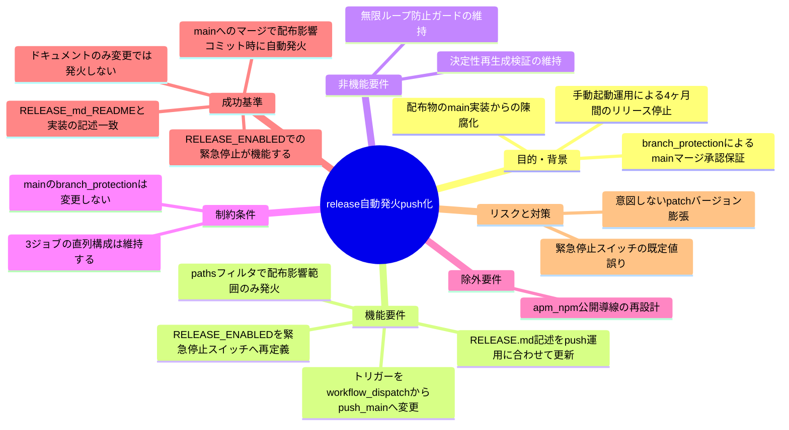
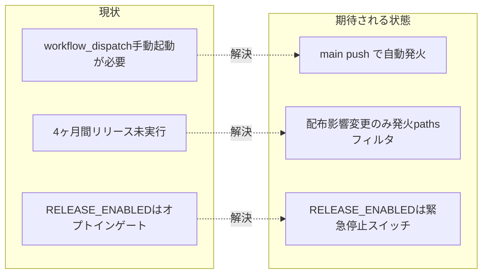

# 要求定義書: release 自動発火（push 化）

**プロジェクト名**: release 自動発火（push 化）
**作成日**: 2026 年 07 月 12 日
**最終更新**: 2026 年 07 月 12 日

> **重要**:
>
> - 要求定義書は、プロジェクトの全体像を把握するためのものです。詳細な技術仕様や実装方法は要件定義書以降で記載します。必要最低限の情報に収めることを心掛けてください。
> - **このドキュメントは常に更新**: 要求の変更や追加があった場合は、即座にこのドキュメントを更新してください。ドキュメントは「生きているドキュメント」として扱い、実装内容と常に同期させます。
> - **必須項目**: 以下の「必須」と明記した項目は空欄・抽象語のみ（例: 「{説明}」のまま）で提出しないこと。判定可能な形（目的は1文・成功基準は○/×で判定できる記載等）で記入すること。
>
> **用語**: [.agent-skill-chain/source/CONCEPTS.md §用語規約](../../../../../.agent-skill-chain/source/CONCEPTS.md#用語規約) を参照。

---

## 要求定義の全体像

**注意**:

- 上記の「プロジェクト名」は例です。実際のプロジェクト名に置き換えてください。
- マインドマップは全体像を把握するためのものです。主要なセクション名程度に留め、詳細は記載しないでください。

---

## 1. 目的・背景

### 1.1 目的（必須）

release.yml の発火契機を手動 workflow_dispatch から main への push に変更し継続的リリースを実現する。

### 1.2 背景

- **現状の課題**:
  - `.github/workflows/release.yml` は `on: workflow_dispatch` のみで起動し、リポジトリ変数 `RELEASE_ENABLED=true` のときのみ 3 ジョブ（`version-bump` → `release-marketplace` → `apm-release`）が実行される（[.github/workflows/release.yml](../../../../../.github/workflows/release.yml) 25〜32 行目）。
  - この手動起動運用のため、最終リリースタグ `v20260303.090550` から現在（2026-07-12）まで約 4 ヶ月間リリースが行われていない（一次情報: `git tag --sort=-creatordate | head` の実行結果で最新タグが `v20260303.090550` であることを確認。evidence_source: existing_code / 実行結果に基づく `observed_runtime`）。
  - この結果、公開パッケージ（apm・marketplace 配布物）が main の実装から乖離し陳腐化している。

- **必要性**:
  - `docs/maintainer/RELEASE.md` に既に記載されている「main への書き戻し push・リリースブランチ push・タグ付与・GitHub Release 作成は既定 `GITHUB_TOKEN` のみを使用し、既定 `GITHUB_TOKEN` による push は workflow を再トリガしない（無限ループ防止）」という設計（[docs/maintainer/RELEASE.md](../../../../../docs/maintainer/RELEASE.md) 59 行目）は push トリガー化後もそのまま有効であり、push 化の前提が既に整っている。
  - ユーザーとの議論で、main ブランチには branch protection が既に新規設定済みであることを確認した（PR 必須・レビュー承認 1 件以上必須・`self-enforce` ステータスチェック必須・管理者はバイパス可＝`enforce_admins: false`・force push/削除禁止。evidence_source: ユーザー申告＝一次情報として採用。GitHub API での再確認は本 issue 執筆時点では未実施のため、02 設計フェーズで `gh api repos/{owner}/{repo}/branches/main/protection` により実測確認することを推奨する）。これにより「main へのマージ＝人間承認済み」が技術的に保証されるため、リリース発火自体に別途の手動承認ステップを課す必要性が低下した。

### 1.3 期待される効果（必須: 1 件以上）

- **効果 1**: 配布影響のある変更が main にマージされると自動的にリリースが発火し、公開パッケージの陳腐化が解消される（○/×判定: push 後に対象ジョブが自動実行されタグ・Release が作成されることを確認できる）。
- **効果 2**: `paths` フィルタにより、ドキュメントのみの変更コミットでは発火せず、無意味な patch バージョン膨張が防止される（○/×判定: `docs/maintainer/workflow/**` のみを変更した push でジョブがトリガーされないことを確認できる）。
- **効果 3**: `RELEASE_ENABLED` を緊急停止スイッチとして使うことで、リリースを止めたい場面（不具合発覚時等）で即座に発火を止められる（○/×判定: `RELEASE_ENABLED=false` 設定時に push があってもジョブが実行されないことを確認できる）。

**現状と期待される状態の比較**:

---

## 2. 機能要件

### 2.1 既存機能の維持（該当する場合）

- 3 ジョブ（`version-bump` → `release-marketplace` → `apm-release`）の直列構成・処理内容は変更しない。
- 無限ループ防止ガード（`github.actor != 'github-actions[bot]'`・commit メッセージ `[skip ci]`・`concurrency: group: release`）は維持する。
- 決定性（再生成 diff ゼロ）検証は維持する。

### 2.2 新規機能要件

- `release.yml` のトリガーを `on: workflow_dispatch` から `on: push: { branches: [main], paths: [...] }` へ変更する。
- `paths` フィルタは配布物（`.agent-skill-chain/source/**`・`src/**`・`bin/**`・`package.json` 等。実際の配布範囲は `package.json` の `files` を参照して 02 設計で確定する）に影響する範囲のみに限定する。
- `RELEASE_ENABLED` の役割を「1 回限りのオプトインゲート」から「緊急停止スイッチ（`false` 時にリリースを止める）」へ再定義する。
- `docs/maintainer/RELEASE.md`（および README.md のリリース手順要約）の「リリース発火は必ずユーザーの明示承認を得てから行う」という記述を、新しい運用（push 契機・`RELEASE_ENABLED` は停止スイッチ）に合わせて書き換える。

---

## 3. 非機能要件

### 3.1 パフォーマンス

- push トリガー化により CI 実行頻度が増える可能性があるが、`paths` フィルタで配布影響のない変更を除外することで過剰実行を抑制する。

### 3.2 セキュリティ

- `permissions: contents: write` を要求する既存の権限モデルは変更しない。
- push トリガー化後も `actor != 'github-actions[bot]'` ガードにより bot 自身の書き戻し push でのループ発火を防ぐ設計を維持する。

### 3.3 互換性

- 既存 3 ジョブの入出力・依存関係（`needs:`）は変更しない。
- 手動発火手段（`workflow_dispatch`）を残すか廃止するかは 02 設計で確定する（要決定事項）。

### 3.4 保守性

- `docs/maintainer/RELEASE.md` を詳細正本として維持し、README.md 側は要約のみとする既存の役割分担を継続する。

---

## 4. 制約条件

### 4.1 技術的制約

- main ブランチの branch protection 設定（PR 必須・レビュー承認 1 件以上・`self-enforce` 必須・`enforce_admins: false`・force push/削除禁止）自体は本 issue の変更対象外であり、変更しない。
- 無限ループ防止の 3 つの既存ガードは push トリガー化後もそのまま機能する設計であることを確認・明記する（新規ガードの追加は必要最小限に留める）。

### 4.2 既存システムとの互換性

- 3 ジョブの処理内容（version bump・adapter/apm 生成・決定性検証・タグ付与）は変更しない。

### 4.3 移行期間・スケジュール

- 特になし（単一 PR での切替を想定）。

---

## 5. 除外要件

- apm / npm 公開導線自体の再設計（配布経路の変更）は対象外。
- branch protection 設定自体の変更は対象外。
- 3 ジョブの処理内容変更（バージョン採番方式の変更等）は対象外。

---

## 6. 成功基準（必須: 1 件以上）

- `release.yml` が `on: push: { branches: [main], paths: [...] }` で定義されている。
- 配布影響のあるパスを含む push で 3 ジョブが自動実行される（実行確認は実装後の検証フェーズで行う。本番 main への実 push での確認が難しい場合はワークフロー構文検証・`paths` フィルタのロジック検証で代替可能な範囲を 03 実装計画で明記する）。
- `docs/maintainer/workflow/**` のみを変更した push ではジョブがトリガーされない。
- `RELEASE_ENABLED=false` のとき push があってもジョブが実行されない（緊急停止スイッチとして機能する）。
- `docs/maintainer/RELEASE.md` および README.md のリリース手順記述が、新しい push 契機の運用と矛盾しない内容に更新されている。
- 無限ループ防止の 3 ガードがコード上に残存し、push トリガー化後も機能する設計であることが `release.yml` のコメントまたは `docs/maintainer/RELEASE.md` に明記されている。

---

## 7. リスクと対策

### 7.1 技術的リスク

- **リスク**: `paths` フィルタの範囲設定を誤ると、配布物に影響する変更が発火対象から漏れる、または無関係な変更で発火してしまう。
  - **対策**: `package.json` の `files` フィールド（配布に含まれる実体）を一次情報として `paths` を確定する。02 設計フェーズで確定し、フィルタと `files` の対応関係を設計書に明記する。
- **リスク**: `RELEASE_ENABLED` の既定値（true/false のどちらを既定とするか）を誤ると、意図せずリリースが止まったまま気づかない、または意図せず大量リリースが発生する。
  - **対策**: 既定値の選択を 01 の受け入れ基準・02 設計での要決定事項として明記し、リポジトリ変数の現況（既存値が `true` か未設定か）を実測確認したうえで確定する。

### 7.2 スケジュールリスク

- **リスク**: 特になし（変更範囲は `release.yml` と `RELEASE.md`/`README.md` の記述更新に限定され、大規模な設計変更を伴わない）。
  - **対策**: 該当なし。

---

## 8. 参考資料

### プロジェクトドキュメント

- [`.github/workflows/release.yml`](../../../../../.github/workflows/release.yml) — 現行ワークフロー定義（`workflow_dispatch` トリガー・3 ジョブ・無限ループ防止ガード）
- [`docs/maintainer/RELEASE.md`](../../../../../docs/maintainer/RELEASE.md) — リリース手順の詳細正本（変更対象）
- [`README.md`](../../../../../README.md) §リリース手順（メンテナ向け） — 要約（変更対象の可能性あり）
- [`.agent-skill-chain/source/spec/06_設計判断の優先順位.md`](../../../../../.agent-skill-chain/source/spec/06_設計判断の優先順位.md) — 「docs と実装の不整合を放置してはならない」

### その他の参考資料

- 直近の教訓: `docs/maintainer/workflow/close/20260712_132917_README配備手順不整合修正/`（README/doctor 不整合 issue）— ドキュメントと実装の乖離を残さないという同種の教訓。

---

## 9. 次のステップ

この要求定義書の承認後、以下のドキュメントを作成します：

- **次**: [`01_要件定義.md`](./01_要件定義.md) - 要件定義フェーズ
