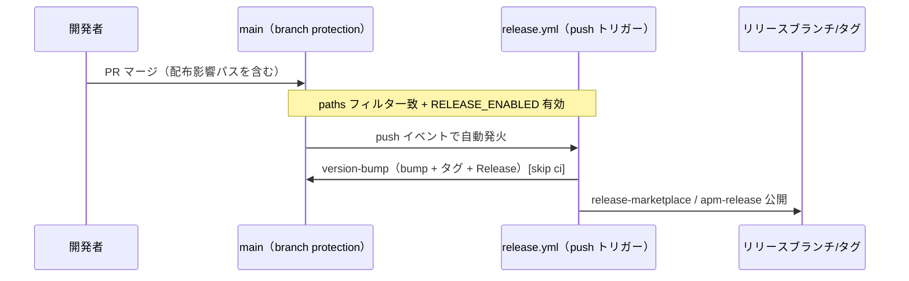

# 要件定義書: release 自動発火（push 化）

**プロジェクト名**: release 自動発火（push 化）
**作成日**: 2026 年 07 月 12 日
**最終更新**: 2026 年 07 月 12 日

> **重要**: **このドキュメントは常に更新**: 要件の変更や追加があった場合は、即座にこのドキュメントを更新してください。ドキュメントは「生きているドキュメント」として扱い、実装内容と常に同期させます。
>
> **用語**: [.agent-skill-chain/source/CONCEPTS.md §用語規約](../../../../../.agent-skill-chain/source/CONCEPTS.md#用語規約) を参照。
>
> **要決定事項（02 設計フェーズで確定）**: 本 01 では以下 2 点を「複数方針を許容した受け入れ基準」として記載する。02_設計で一次情報（`package.json` の `files`・`gh variable list` 実測等）に基づき方針を 1 つに確定させること。
>
> 1. **`paths` フィルタの具体的な範囲**（§2.1 ストーリー 1・§2.2 ユースケース 1）。
> 2. **`RELEASE_ENABLED` の既定値**（true にするか false にするか。§2.1 ストーリー 2・§2.2 ユースケース 2）。実測確認済み: 本 issue 起票時点（2026-07-12）で `gh variable list --repo techbeansjp-free/AGENTS.md` の結果は空であり、リポジトリ変数 `RELEASE_ENABLED` は未設定（evidence_source: `observed_runtime`）。未設定時の `vars.RELEASE_ENABLED == 'true'` 評価は偽になるため、現状のままでは push 化してもリリースが一切発火しない。

---

## 1. 概要

### 1.1 システム概要

本リポジトリは AI 実行契約ワークフロー仕様パッケージである（`package.json` の `name`: `agent-skill-chain`）。`.github/workflows/release.yml` は正本 `.agent-skill-chain/source/` から Claude/Cursor アダプタおよび apm パッケージを生成し、`release/marketplace`・`release/apm` ブランチへ公開する CI である。現在は `workflow_dispatch` の手動起動でのみ動作し、`docs/maintainer/RELEASE.md` は「リリース発火は必ずユーザーの明示承認を得てから行う」ことを前提に記述されている。

本 issue は、main への branch protection 導入により「main へのマージ＝人間承認済み」が技術的に保証されたことを受け、トリガーを `push`（main・配布影響 paths 限定）へ変更し、`RELEASE_ENABLED` を「1 回限りのオプトインゲート」から「緊急停止スイッチ」へ再定義し、関連ドキュメントを実態に合わせて書き換える。

### 1.2 用語集

| 用語 | 説明 |
| ---- | ---- |
| `RELEASE_ENABLED` | GitHub リポジトリ変数（`vars.RELEASE_ENABLED`）。現行は `'true'` のときのみ 3 ジョブを実行するオプトインゲート。本 issue で「緊急停止スイッチ（`false` のときにリリースを止める）」へ役割を再定義する。 |
| `paths` フィルタ | GitHub Actions の `on.push.paths`。指定パターンに一致する変更を含む push のみワークフローを発火させる機能。 |
| 配布影響パス | `package.json` の `files`（`.agent-skill-chain/source/`・`AGENTS.md`・`CLAUDE.md`・`.agent-skill-chain/runtime/templates/`・`bin/`・`README.md`）に加え、`bin/` を生成する `src/**`（`tsc` ビルド元）、`package.json`（version 正本）、`package-lock.json`、marketplace 生成に用いる `.claude-plugin/**` を指す。 |
| 無限ループ防止ガード | 既定 `GITHUB_TOKEN` push が workflow を再トリガしない GitHub 仕様（主防御）に加え、`actor != 'github-actions[bot]'`・commit メッセージ `[skip ci]`・`concurrency: group: release`（補助防御）の 3 点。 |

---

## 2. 機能要件

### 2.1 ユーザーストーリー

#### ストーリー 1: 配布影響のある変更が main にマージされたら自動的にリリースされる

- **As a** 本リポジトリのメンテナ
- **I want to** 配布物（apm・marketplace パッケージ）に影響する変更が main にマージされたとき、手動操作なしにリリース（version bump・タグ・GitHub Release・marketplace/apm 公開）が自動的に走ってほしい
- **So that** 手動起動の失念によって配布物が実装から乖離し続ける現状（最終リリースタグ `v20260303.090550` から 4 ヶ月間未リリース）を再発させない

**受け入れ基準**:

- `release.yml` のトリガーが `on: workflow_dispatch` から `on: push: { branches: [main], paths: [...] }` に変更されている。
- `paths` は配布影響パス（§1.2 用語集）に限定される。具体的なパターン列挙は 02 設計で `package.json` の `files` を一次情報として確定する（要決定事項 1）。
- `docs/maintainer/workflow/**` のようなドキュメントのみの変更を含む push では `paths` に一致せずジョブが発火しない。
- 手動発火手段（`workflow_dispatch`）を残すかどうかは 02 設計で確定する（残す場合は緊急リリース用の補助手段として位置づけ、`RELEASE_ENABLED` ゲートは適用したままにする）。

#### ストーリー 2: `RELEASE_ENABLED` で緊急停止できる

- **As a** 本リポジトリのメンテナ
- **I want to** 不具合発覚時などにリポジトリ変数 `RELEASE_ENABLED` を操作するだけで、push トリガーによる自動リリースを即座に止めたい
- **So that** 壊れたリリースが連続して公開される事故を防げる

**受け入れ基準**:

- 3 ジョブすべての `if` 条件に `vars.RELEASE_ENABLED` の判定が残存し、`RELEASE_ENABLED` が緊急停止スイッチとして機能する（`false` または明示的な停止値のときジョブが実行されない）。
- `RELEASE_ENABLED` の**既定値**（未設定時に true 相当として扱うか false 相当として扱うか）を 02 設計で確定する（要決定事項 2）。判断材料: 現状は未設定＝実質「常に停止」であり、push 化と同時に「常時有効」へ既定値を倒すと、02 で `paths` を確定する前の暫定実装が誤発火するリスクがある。02 では「既定 off（安全側）で開始し、動作確認後に on へ切り替える」運用と「既定 on（push 化の目的である継続的リリースを即座に有効化）」の両論を比較し ADR 形式（[EVIDENCE_POLICY.md](../../../../../.agent-skill-chain/source/EVIDENCE_POLICY.md) 節 2）で決定を記録すること。
- `docs/maintainer/RELEASE.md` に、`RELEASE_ENABLED` の新しい役割（緊急停止スイッチ）と既定値・切り替え手順が明記される。

#### ストーリー 3: ドキュメントが新しい運用と一致している

- **As a** 本リポジトリの新規参加者・レビュアー
- **I want to** `docs/maintainer/RELEASE.md` と README.md のリリース手順記述を読んだときに、実際の発火契機（push・`RELEASE_ENABLED` は停止スイッチ）と一致した説明を得たい
- **So that** ドキュメントと実装の乖離（本リポジトリで直近発生した README/doctor 不整合と同種の問題）を再発させない

**受け入れ基準**:

- `docs/maintainer/RELEASE.md` の「リリース発火は必ずユーザーの明示承認を得てから行う」という記述（現行 7 行目）が、新しい運用（push 契機で自動発火・`RELEASE_ENABLED` は緊急停止スイッチ）に合わせて書き換えられている。手動承認プロセスを完全に廃止するのか、PR レビュー承認（branch protection）をもって「人間承認済み」とみなす旨を明記するのかは 02 設計で確定する。
- README.md §リリース手順（メンテナ向け）の要約が `docs/maintainer/RELEASE.md` の内容と矛盾しない。
- `docs/maintainer/RELEASE.md` §2「リリース実行手順」の記述が `workflow_dispatch` 前提から push 前提に更新される。

#### ストーリー 4: 無限ループ防止ガードが push トリガー化後も機能する

- **As a** 本リポジトリのメンテナ
- **I want to** push トリガー化後も既存の無限ループ防止ガード（`actor != 'github-actions[bot]'`・`[skip ci]`・`concurrency: group: release`）がそのまま機能することを設計上確認・明記したい
- **So that** リリースジョブ自身の書き戻し push が再度リリースを発火させる無限ループを防げる

**受け入れ基準**:

- `release.yml` のコメントまたは `docs/maintainer/RELEASE.md` に、push トリガー化後も次が成立する旨が明記される。
  - 主防御: 既定 `GITHUB_TOKEN` による push は `on: push` を再トリガしない（GitHub 仕様。ジョブ内の bump 書き戻し・release ブランチ push・タグ push はすべて既定 `GITHUB_TOKEN` を使用しており変更しない）。
  - 補助防御 1: `github.actor != 'github-actions[bot]'` は bot 自身のアクションによる push でも actor 判定として機能する。
  - 補助防御 2: commit メッセージの `[skip ci]` は `paths` フィルタと独立に効く GitHub Actions 標準機能であり、push トリガー化で無効化されない。
  - 補助防御 3: `concurrency: group: release` は引き続き同時実行を直列化する。
- 上記 4 点について、push トリガー化によって無効化される防御がないことが 02 設計のレビューで確認される。

### 2.2 BDD ユースケース

#### ユースケース 1: push トリガーと paths フィルタによる自動発火

配布影響のある変更を含む push でのみリリースジョブが発火し、ドキュメントのみの変更では発火しないことを保証する。

**シナリオ 1: 配布影響パスへの push で自動発火する**

```gherkin
Feature: release.yml の push トリガー化
  Scenario: 配布影響パスを含む main への push でリリースジョブが自動発火する
    Given main の branch protection が有効で PR 経由のマージのみが main に反映される
    And RELEASE_ENABLED が緊急停止スイッチとして有効（停止していない）状態である
    When .agent-skill-chain/source/ 配下のファイルを変更する PR が main へマージされる
    Then release.yml の version-bump ジョブが自動的に開始される
    And 後続の release-marketplace・apm-release ジョブも直列に実行される
```

**シナリオ 2: ドキュメントのみの変更では発火しない**

```gherkin
Feature: paths フィルタによる無関係コミットの除外
  Scenario: docs/maintainer/workflow/ のみの変更では発火しない
    Given main の branch protection が有効である
    When docs/maintainer/workflow/ 配下のファイルのみを変更する PR が main へマージされる
    Then release.yml はトリガーされない
    And package.json の version は変化しない
```

（要決定事項 1: `paths` パターンの具体的な列挙は 02 設計で確定する。本シナリオはその確定後、実際の `paths` 設定に対する構文・ロジック検証で裏づける。）

#### ユースケース 2: RELEASE_ENABLED による緊急停止

**シナリオ 1: RELEASE_ENABLED を停止状態にするとリリースが走らない**

```gherkin
Feature: RELEASE_ENABLED の緊急停止スイッチ化
  Scenario: RELEASE_ENABLED が停止状態のとき配布影響 push があってもジョブが実行されない
    Given RELEASE_ENABLED が緊急停止状態（false 相当）に設定されている
    When 配布影響パスを含む変更が main へマージされる
    Then release.yml の 3 ジョブはいずれも実行されない（if 条件で skip される）
```

**シナリオ 2: 既定値の確定（要決定事項）**

```gherkin
Feature: RELEASE_ENABLED の既定値
  Scenario: push 化直後、RELEASE_ENABLED 未設定時の挙動が設計で確定している
    Given RELEASE_ENABLED がリポジトリ変数として未設定である（2026-07-12 時点で実測: 未設定）
    When push トリガー化された release.yml が配布影響 push を受け取る
    Then 02 設計で確定した既定値（on/off）に従って発火有無が決まり、その判断根拠が ADR 形式で 02_設計.md に記録されている
```

#### ユースケース 3: ドキュメントの整合

**シナリオ 1: RELEASE.md が新しい運用を正しく説明する**

```gherkin
Feature: RELEASE.md と実装の整合
  Scenario: RELEASE.md の記述が push 契機の運用と矛盾しない
    Given 修正後の docs/maintainer/RELEASE.md
    When 「リリース発火は必ずユーザーの明示承認を得てから行う」に相当する節を読む
    Then push（main への配布影響変更マージ）が発火契機であることが明記されている
    And RELEASE_ENABLED が緊急停止スイッチである旨とその既定値・操作手順が明記されている
    And 記載内容が release.yml の実装（on.push.paths・vars.RELEASE_ENABLED 判定）と矛盾しない
```

#### ユースケース 4: 無限ループ防止ガードの維持確認

**シナリオ 1: 3 ガードが push トリガー化後も機能する**

```gherkin
Feature: 無限ループ防止ガードの維持
  Scenario: version-bump ジョブの書き戻し push が再度リリースを発火させない
    Given push トリガー化された release.yml と、version-bump ジョブによる main への [skip ci] 付き書き戻し push
    When 既定 GITHUB_TOKEN によって書き戻し push が行われる
    Then その push 自体は release.yml を再トリガしない（GitHub 仕様。主防御）
    And 仮に何らかの理由で再評価された場合でも actor 判定・[skip ci]・concurrency の補助防御が無限ループを防ぐ
```

**処理フロー**（要決定事項確定後の全体像）:



### 2.3 ビジネスルール

- **既存 3 ジョブの処理内容・直列構成（`needs:`）は変更しない**。変更対象はトリガー定義（`on:`）と `RELEASE_ENABLED` の意味づけ・ドキュメントのみ。
- **無限ループ防止の 3 ガードは全て維持する**。削除・弱体化は行わない。
- **`paths` フィルタは配布影響範囲に限定する**。過剰に広いフィルタ（例: リポジトリ全体）は本要件の目的（無意味な patch 膨張の防止）に反するため不可。
- **ドキュメントと実装の不整合を残さない**（[spec/06_設計判断の優先順位.md](../../../../../.agent-skill-chain/source/spec/06_設計判断の優先順位.md)）。`RELEASE.md`・README.md の更新を実装変更と同一 PR で完結させる。

---

## 3. 非機能要件

### 3.1 パフォーマンス要件

- `paths` フィルタにより、配布影響のない push での CI 起動を抑制し、無駄な CI 実行コストを避ける。

### 3.2 セキュリティ要件

- `permissions: contents: write` の権限範囲は変更しない。
- push トリガー化により発火頻度が増えても、既定 `GITHUB_TOKEN` のみを使用する現行の権限設計（PAT・deploy key 不使用）を維持する。

### 3.3 ユーザビリティ要件

- メンテナが `RELEASE_ENABLED` の値を見るだけで「リリースが有効か停止中か」を即座に判断できる（変数名・ドキュメント記述の分かりやすさ）。

### 3.4 可用性要件

- 該当なし（CI ワークフロー定義とドキュメントの変更であり、本番システムの可用性に影響しない）。

---

## 4. 外部インターフェース要件

### 4.1 API 要件

- GitHub Actions ワークフロートリガー定義（`on.push.branches`・`on.push.paths`）を変更する。GitHub API・外部サービス連携の変更はない。

### 4.2 データ形式要件

- 該当なし。

---

## 5. 制約事項

- main の branch protection 設定自体は変更しない（前提として利用するのみ）。
- 3 ジョブの処理内容（バージョン採番方式・生成物の内容）は変更しない。
- `paths` フィルタの具体的な範囲、`RELEASE_ENABLED` の既定値は本 01 では複数方針を許容し、02 設計で確定する。
- apm / npm 公開導線自体の再設計は対象外。

---

## 6. 参考資料

### プロジェクトドキュメント

- [`00_要求定義.md`](./00_要求定義.md) - 要求定義
- 実装対象: [`.github/workflows/release.yml`](../../../../../.github/workflows/release.yml)（`on:` 定義 25〜32 行目、3 ジョブの `if` 条件 41・148・251 行目）、[`docs/maintainer/RELEASE.md`](../../../../../docs/maintainer/RELEASE.md)（7 行目の承認前提記述、§2 リリース実行手順）、[`README.md`](../../../../../README.md)（§リリース手順（メンテナ向け）161〜163 行目）
- `package.json`（`files` フィールド 7 行目。配布影響パス確定の一次情報）

### その他の参考資料

- spec/06 設計判断の優先順位「docs と実装の不整合を放置してはならない」
- 直近の教訓: `docs/maintainer/workflow/close/20260712_132917_README配備手順不整合修正/`（README/doctor 不整合 issue）

---

## 7. 前のステップ

この要件定義書は、以下のドキュメントを基に作成されています：

- **前**: [`00_要求定義.md`](./00_要求定義.md) - 要求定義フェーズ

---

## 8. 次のステップ

この要件定義書の承認後、以下のドキュメントを作成します：

- **次**: [`02_設計.md`](./02_設計.md) - 設計フェーズ
