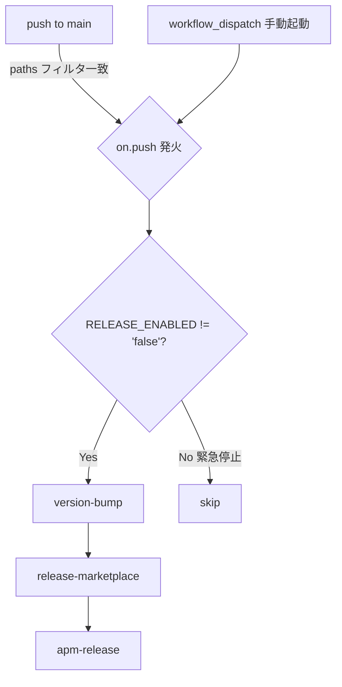
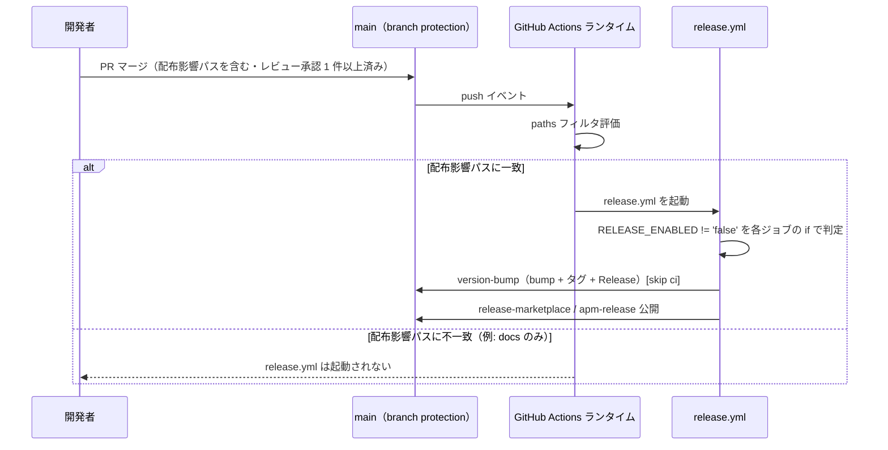
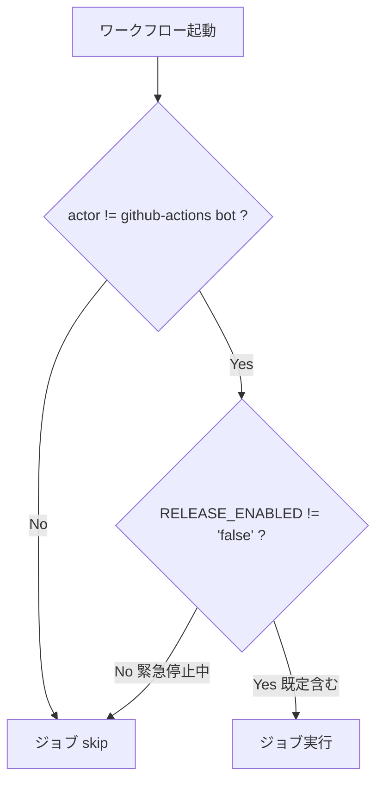

# 設計書: release 自動発火（push 化）

**プロジェクト名**: release 自動発火（push 化）
**作成日**: 2026 年 07 月 12 日
**最終更新**: 2026 年 07 月 12 日

> **重要**: **このドキュメントは常に更新**: 設計の変更や追加があった場合は、即座にこのドキュメントを更新してください。ドキュメントは「生きているドキュメント」として扱い、実装内容と常に同期させます。
>
> **用語**: [.agent-skill-chain/source/CONCEPTS.md §用語規約](../../../../../.agent-skill-chain/source/CONCEPTS.md#用語規約) を参照。

---

## 1. 設計概要

### 1.1 設計方針

本 issue は新規コンポーネントを作らない**既存 CI 設定（`.github/workflows/release.yml`）とドキュメント（`RELEASE.md`・`README.md`）の変更のみ**である。[01\_設計原則](../../../../../.agent-skill-chain/source/spec/01_設計原則.md) のうち適用するのは「明確な境界」（トリガー定義・ゲート条件・ジョブ本体処理の 3 責務を分離したまま変更しない）と「単一責務」（`on:` はトリガー、`if:` はゲート、ジョブ本体は配布処理、という既存の役割分担を崩さない）のみであり、CQRS・イベント駆動・UNIX 哲学の適用は本 issue の性質上該当しない。

### 1.2 設計原則（本プロジェクトで適用するもの）

- **単一責務**: `on:`（いつ起動するか）・`if:`（実行してよいか）・ジョブ本体（何をするか）の 3 責務は現状どおり分離を維持し、混在させない。
- **明確な境界**: 本 issue の変更範囲は「トリガー定義」「ゲート条件（`RELEASE_ENABLED`）」「ドキュメント記述」の 3 点に限定し、3 ジョブの処理内容（バージョン採番・生成物 build・タグ付与）には立ち入らない（01 §2.1 既存機能の維持）。

---

## 2. アーキテクチャ設計

### 2.1 責務・境界・参照関係

#### 2.1.1 責務一覧

| コンポーネント | 責務（1 文） |
| --- | --- |
| `release.yml` の `on:` 節 | いつワークフローを起動するか（push 条件・paths フィルタ・手動起動可否）を定義する。 |
| `release.yml` 各ジョブの `if:` 節 | 起動されたワークフローのうち、`RELEASE_ENABLED`（緊急停止スイッチ）と `actor` ガードにより実際にジョブを実行してよいかを判定する。 |
| `release.yml` 各ジョブ本体 | version bump／marketplace 生成／apm 生成という既存の配布処理を行う（本 issue では変更しない）。 |
| `docs/maintainer/RELEASE.md` | リリース発火契機・`RELEASE_ENABLED` の役割・操作手順の詳細正本。 |
| `README.md` §リリース手順 | `RELEASE.md` への入口リンクと要約のみを持つ（詳細を重複させない）。 |

#### 2.1.2 境界

- **入力**: `main` ブランチへの push イベント（`paths` フィルタでフィルタされたもの）、および `vars.RELEASE_ENABLED` の値。
- **出力**: 3 ジョブの起動有無（実行 / skip）。ジョブが実行された場合の出力（タグ・Release・release ブランチへの公開）は既存のまま変更しない。
- **他責務との境界**: main の branch protection 設定自体（PR 必須・レビュー承認・`self-enforce` 必須）は本 issue の変更対象外であり、前提として利用するのみ（01 §4.1）。3 ジョブの処理内容・`sync-version.sh` のロジックも変更対象外。

#### 2.1.3 参照関係

- `release.yml`（`on:` 節）→ GitHub Actions ランタイム（push イベント・`paths` フィルタの評価はプラットフォーム側が行う）。
- `release.yml`（各ジョブ `if:` 節）→ `vars.RELEASE_ENABLED`（リポジトリ変数）・`github.actor`（イベントコンテキスト）。
- `release.yml`（`version-bump` ジョブ）→ `.agent-skill-chain/source/scripts/sync-version.sh`（変更なし、既存参照を維持）。
- `RELEASE.md` → `release.yml`（記述が実装と一致するよう参照。本 issue で記述を実装に合わせて更新する）。
- `README.md` → `RELEASE.md`（要約から詳細正本への参照。重複させない）。
- 循環参照なし。

### 2.2 システムアーキテクチャ

- **採用パターン**: 既存の「GitHub Actions ワークフロー（宣言的トリガー + ゲート条件 + 直列ジョブ）」パターンを踏襲する。新規パターンの導入はしない。
- **根拠**: [06\_設計判断の優先順位](../../../../../.agent-skill-chain/source/spec/06_設計判断の優先順位.md) の「1. 可読性」「4. 変更容易性」を優先し、既存構造をそのまま使うことで変更差分を最小化する（01 §4.2 既存システムとの互換性: 3 ジョブの処理内容は変更しない）。

#### 2.2.1 CQRS

該当なし（CI ワークフロー設定であり、状態変更/取得の分離という概念は適用しない）。

#### 2.2.2 アーキテクチャ図



### 2.3 コンポーネント構成

`release.yml` は単一ファイルのまま、`on:` 節（トリガー）・3 ジョブの `if:` 節（ゲート）・ジョブ本体（処理）という既存の 3 層構成を維持する。変更は `on:` 節と `if:` 節の条件式、および該当箇所のコメントに限定する。

### 2.4 データフロー

該当なし（イベント駆動アーキテクチャの「起きた事実」イベント発行は本 issue の対象外。GitHub Actions のワークフロートリガー自体は本質的にイベント駆動だが、新規イベント発行の設計は不要）。



### 2.5 横断設計判断（ADR）

#### ADR-1: `paths` フィルタの具体的な範囲（01 要決定事項 1）

- **コンテキスト**: `paths` フィルタは配布影響のある変更でのみ発火させる必要がある（01 §2.2 ビジネスルール「過剰に広いフィルタは不可」）。01 は候補として `.agent-skill-chain/source/**`・`src/**`・`package.json`・`package-lock.json`・`.claude-plugin/**` を挙げ、確定を 02 に委ねている（01 §1.2 用語集「配布影響パス」）。
- **検討した選択肢**:
  1. 01 の候補をそのまま採用する（`package.json` の `files` フィールドに準拠。`src/**`・`AGENTS.md`・`CLAUDE.md`・`.agent-skill-chain/runtime/templates/` を含む）。
  2. `release.yml` の実際のジョブ本体（`build-adapters.sh`・`sync-version.sh`・`release-marketplace`/`apm-release` の commit 対象）が実際に読み書きするパスのみに限定する。
  3. リポジトリ全体を対象にする（フィルタなし）。
- **決定**: 選択肢 2（実装が実際に読み書きするパスのみ）を採用する。具体的な `paths` は次のとおり:
  ```yaml
  paths:
    - ".agent-skill-chain/source/**"
    - "package.json"
    - ".claude-plugin/marketplace.json"
  ```
- **根拠**: 3 ジョブが「発火契機とすべき実入力」として読むファイルを一次情報（`existing_code`。本セッションで実行・確認済み）で切り分けた。marketplace/apm 生成の実体は `build-adapters.sh` の `bundle_agents_src`（build-adapters.sh:79-91）で、同梱するのは `$AGENTS`（=`.agent-skill-chain/source/`）のみであり、リポジトリルートの `AGENTS.md`／`CLAUDE.md`／`.agent-skill-chain/runtime/templates/`／`src/**`（`bin/` の TS ビルド元）は同梱・読取対象に含まれない。marketplace ジョブが追加で直接扱うのはリポジトリルート `.claude-plugin/marketplace.json`（release.yml:215・231）のみ。なお `grep -n "AGENTS.md\|CLAUDE.md\|runtime/templates\|package-lock\|bin/\|src/" .agent-skill-chain/source/scripts/build-adapters.sh .github/workflows/release.yml` を実行すると一致は出るが、いずれも paths に含める根拠にならない: (a) build-adapters.sh:247 の一致は生成 apm.yml の `description` 文字列（heredoc 内テキスト）であってファイル読取ではない、(b) release.yml:83・88・91 の `package-lock.json` は `version-bump` ジョブの**書き戻し対象**（`npm version patch` の副作用として git add/commit する出力側）であって、内容を読んで生成物を変える入力ではない。よって上記ファイルは push トリガーの発火契機に含めない結論が正確。また `package.json` の `scripts.test` を除く npm publish ジョブは現行 `release.yml` に存在しない（`git log` で `release-npm` ジョブが削除済みであることを確認済み。evidence_source: `existing_code`）。01 の「配布影響パス」定義は npm パッケージ配布（`package.json` の `files` フィールド）を基準にしたものであり、`release.yml` が実際に生成・公開するのは marketplace アダプタ（`.agent-skill-chain/source/` 由来）と apm パッケージ（同）のみであるため、01 の候補より狭い範囲が正確である。選択肢 1（01 の候補をそのまま採用）は「過剰に広いフィルタ」（01 §2.2 ビジネスルール）に該当し不採用。選択肢 3 は本 issue の主目的（無意味な patch 膨張の防止）に反するため不採用。
  - `package.json` を含める理由: `version-bump` ジョブの bump 元・`sync-version.sh` の正本であり、`package.json` 自体の変更（例: `version` 以外のフィールド変更）がリリースに影響しうるため。
  - `package-lock.json` を含めない理由: `npm version patch` の副作用で書き換わるのみで、`release.yml` の 3 ジョブはこのファイルの内容を読まない（`devDependencies` の変更は marketplace/apm 生成物に影響しない）。
  - `.claude-plugin/marketplace.json` を含める理由: `release-marketplace` ジョブが生成物と共に直接 `git add -f` で release ブランチへコミットする対象そのものであるため（release.yml 215・231 行目）。
- **帰結**: `docs/**`（本 issue の issue ドキュメント自身を含む）・`.github/**`・`src/**`・`bin/**`・`test/**`・`README.md` 単体の変更では `release.yml` は発火しない。将来 `src/**`（CLI 本体）を npm 公開する運用に変更する場合は、本 ADR を見直し `paths` に `src/**`・`package-lock.json` を追加する必要がある（除外要件: apm/npm 公開導線自体の再設計は対象外。01 §5）。

#### ADR-2: 手動発火手段（`workflow_dispatch`）の存続（01 §3.3 要決定事項）

- **コンテキスト**: push トリガー化後も、`paths` フィルタの想定漏れや緊急リリースのニーズに備えた手動起動手段を残すか判断する必要がある。
- **検討した選択肢**:
  1. `workflow_dispatch` を削除し `push` トリガーのみにする。
  2. `on: push` に加え `workflow_dispatch:` を残し、同一の `RELEASE_ENABLED` ゲートを適用する（両トリガーとも同じ `if:` 条件を通る）。
- **決定**: 選択肢 2（`workflow_dispatch` を残す）を採用する。
- **根拠**: `paths` フィルタの範囲確定（ADR-1）は本 issue時点の静的解析に基づく推定であり、将来の構成変更（例: apm パッケージの生成元が増える）で `paths` の見直し漏れが起きた場合に、`workflow_dispatch` が唯一の代替発火手段になる。`workflow_dispatch` を残しても `RELEASE_ENABLED` ゲートが両トリガーに等しく適用されるため、緊急停止スイッチの実効性は損なわれない（evidence_source: `existing_code`＝現行 `if:` 条件がトリガー種別に依存しない実装であることを確認済み）。削除する明確な理由（コスト・リスク）がない。
- **帰結**: `on:` 節は `push`（`branches: [main]`・`paths: [...]`）と `workflow_dispatch:` の両方を持つ。手動起動時も `paths` フィルタは適用されない（`workflow_dispatch` は `paths` の対象外という GitHub Actions の仕様どおり）ため、緊急時のみ使う運用である旨を `RELEASE.md` に明記する。

#### ADR-3: `RELEASE_ENABLED` の意味論と既定値（01 要決定事項 2）

- **コンテキスト**: 現行 `if: ... && vars.RELEASE_ENABLED == 'true'` は「true のときのみ実行」というオプトインゲートであり、未設定時は常に skip される。push 化後にこのままだと、`RELEASE_ENABLED` を明示設定しない限り一切発火しない（push 化の目的である継続的リリースが達成できない）。役割を「緊急停止スイッチ」へ反転する場合、既定値（未設定時の挙動）をどちらにするか確定する必要がある。
- **検討した選択肢**:
  1. `if: ... && vars.RELEASE_ENABLED != 'false'`（既定 ON。未設定時は実行する。明示的に `'false'` を設定したときのみ停止）。
  2. `if: ... && vars.RELEASE_ENABLED == 'true'` のまま維持し、別途 `RELEASE_ENABLED=true` を設定してから push 化を有効にする（既定 OFF・段階移行）。
  3. 変数名を `RELEASE_DISABLED` 等に変更し `if: ... && vars.RELEASE_DISABLED != 'true'` とする（意味論を変数名にも反映）。
- **決定**: 選択肢 1（`vars.RELEASE_ENABLED != 'false'`。既定 ON、変数名は維持）を採用する。
- **根拠**:
  - 本セッションで `gh variable list --repo techbeansjp-free/AGENTS.md` を実行し、結果が空（`RELEASE_ENABLED` 未設定）であることを確認した（evidence_source: `observed_runtime`）。選択肢 1 を採用した場合、本 issue のマージ直後から「配布影響 push で自動発火」という 01 の効果 1（4 ヶ月間の未リリース状態の解消）が即座に成立する。選択肢 2（既定 OFF）を採用すると、本 issue をマージしても追加のリポジトリ変数設定という 2 段階目の手動操作が必要になり、01 の主目的（手動操作の失念によるリリース停止の再発防止）に反する（設定を忘れれば元の「4 ヶ月間停止」と同じ状態が再発しうる）。
  - リスク（意図しない誤発火）は ADR-1 の `paths` フィルタで配布影響範囲に限定していること、および main の branch protection（レビュー承認 1 件以上・`self-enforce` 必須。`gh api repos/techbeansjp-free/AGENTS.md/branches/main/protection` で実測確認済み。evidence_source: `observed_runtime`）により、本 issue の PR マージ自体がこの新しい発火挙動への人間承認を兼ねる。したがって「既定 ON」でも無承認の暴走ではない。
  - 選択肢 3（変数名変更）は、`RELEASE_ENABLED` という名前が既に `RELEASE.md`・README 等の複数箇所で参照されており、変数名変更は影響範囲が広く「変更容易性」（06 優先順位 4 位）より低い優先度と判断し不採用。変数名は維持し、意味論のみ反転する。
- **帰結**: 3 ジョブすべての `if:` 条件を `github.actor != 'github-actions[bot]' && vars.RELEASE_ENABLED != 'false'` に変更する。緊急停止時はリポジトリ変数 `RELEASE_ENABLED` を `false` に設定する。`RELEASE.md` に既定値（未設定=有効）と停止手順を明記する（§4 参照）。

#### ADR-4: 無限ループ防止ガードの継続性（01 ストーリー 4）

- **コンテキスト**: push トリガー化により、`version-bump` ジョブの書き戻し push が `release.yml` 自身を再発火させないことを設計上確認・明記する必要がある。
- **検討した選択肢**: 新規ガードを追加する／既存 3 ガード（主防御含めれば 4 点）で足りるかを確認するのみに留める。
- **決定**: 新規ガードは追加せず、既存の防御がそのまま機能することを確認しコメント・`RELEASE.md` に明記するに留める。
- **根拠**:
  - 主防御: GitHub Actions の仕様として、既定 `GITHUB_TOKEN` による push は `on: push` を再トリガしない（evidence_source: `external_spec`。GitHub 公式ドキュメント「Triggering a workflow from a workflow」に明記された既知仕様。`release.yml` の全 push/tag 操作は `actions/checkout` 既定認証＝既定 `GITHUB_TOKEN` を使用しており PAT／deploy key は使わない。evidence_source: `existing_code`＝`release.yml` に `GH_TOKEN: ${{ secrets.GITHUB_TOKEN }}` 以外のトークン参照がないことを確認済み）。この主防御は `paths` フィルタや `on:` の条件式とは独立した GitHub 側の挙動であり、push トリガー化によって変化しない。
  - 補助防御 1（`actor != 'github-actions[bot]'`）: `if:` 条件式自体は変更しない（ADR-3 で `RELEASE_ENABLED` 部分のみ変更）ため、トリガー種別に関わらず機能する。
  - 補助防御 2（`[skip ci]`）: commit メッセージへの付与ロジック（84〜98・236〜242・334〜338 行目）は変更しないため、そのまま機能する。ただし `[skip ci]` は GitHub Actions 標準では `push`/`pull_request` イベントの起動自体をスキップする機能であり、`paths` フィルタとは独立に効く（evidence_source: `external_spec`）。
  - 補助防御 3（`concurrency: group: release`）: 定義（29〜32 行目）を変更しないため、トリガー種別に関わらず直列化を維持する。
- **帰結**: `release.yml` 冒頭コメント（1〜17 行目）と `RELEASE.md` に、push トリガー化後も主防御・補助防御 3 点が機能する旨を明記する（実装差分は `on:` 追加時のコメント更新のみ）。

#### ADR-5: `RELEASE.md`／README.md の承認記述の書き換え方針（01 ストーリー 3）

- **コンテキスト**: 「リリース発火は必ずユーザーの明示承認を得てから行う」という現行記述（`RELEASE.md` 7 行目）を、push 契機の新運用に合わせてどう書き換えるか（手動承認プロセスを完全廃止するか、PR レビュー承認を人間承認とみなすか）確定する必要がある。
- **検討した選択肢**:
  1. 手動承認プロセスを完全に廃止し、承認に関する記述自体を削除する。
  2. PR レビュー承認（branch protection の必須 1 件以上）をもって「人間承認済み」とみなす旨を明記し、リリース発火固有の追加承認は不要と記述する。
- **決定**: 選択肢 2 を採用する。
- **根拠**: 00 要求定義の背景（§1.2）で「main への branch protection 導入により『main へのマージ＝人間承認済み』が技術的に保証された」ことが本 issue 全体の前提として明記されており（evidence_source: `human_decision`＝ユーザー申告 + `observed_runtime`＝`gh api .../branches/main/protection` 実測確認済み）、承認の実体（人間のレビュー）は消えておらず、承認のタイミングと形式が「リリース起動操作の直前」から「PR マージ時」に移っただけである。選択肢 1（記述の完全削除）は承認プロセスの存在自体を消し去る誤った印象を与えるため不採用。
- **帰結**: `RELEASE.md` 冒頭の「重要」ブロックおよび §2 リリース実行手順を、「PR レビュー承認（1 件以上・branch protection）をもって人間承認済みとみなし、承認された変更が main へマージされた時点で push トリガーにより自動発火する。追加の起動操作・追加承認は不要。緊急停止は `RELEASE_ENABLED=false` で行う」という趣旨に書き換える。README.md §リリース手順の要約もこれと矛盾しないよう同時に更新する。

---

## 3. 機能設計

### 3.1 機能 1: push トリガー化と paths フィルタ

#### 3.1.1 概要

`release.yml` の `on:` を `push`（`main`・ADR-1 の `paths`）と `workflow_dispatch`（ADR-2）の両方に変更する。

#### 3.1.2 処理フロー

§2.4 のシーケンス図を参照。

#### 3.1.3 入力・出力

- **入力**: push イベント（変更ファイル一覧を GitHub Actions ランタイムが `paths` と照合）、または手動 `workflow_dispatch` 起動。
- **出力**: `paths` 一致時のみワークフロー起動（`if:` によるゲートは機能 2 で判定）。

#### 3.1.4 エラーハンドリング

該当なし（`paths` フィルタの不一致は「起動しない」という正常系の一部であり、エラーではない）。

### 3.2 機能 2: `RELEASE_ENABLED` 緊急停止スイッチ化

#### 3.2.1 概要

3 ジョブの `if:` 条件式を ADR-3 のとおり `vars.RELEASE_ENABLED != 'false'` に変更する。

#### 3.2.2 処理フロー



#### 3.2.3 入力・出力

- **入力**: `vars.RELEASE_ENABLED`（文字列。未設定時は空文字列として評価され `'false'` と不一致＝実行される）。
- **出力**: ジョブの実行 / skip。

#### 3.2.4 エラーハンドリング

該当なし。`RELEASE_ENABLED` に `'true'`/`'false'` 以外の任意文字列（例: 誤字 `'flase'`）を設定した場合も `!= 'false'` は真になり実行される（fail-open）。この挙動は緊急停止の確実性より継続的リリースの実効性を優先した ADR-3 の帰結であり、`RELEASE.md` に「停止したい場合は正確に文字列 `false` を設定すること」と明記する（実装計画 §2 のドキュメント更新タスクで対応）。

### 3.3 機能 3: ドキュメント整合（`RELEASE.md`／README.md）

#### 3.3.1 概要

ADR-5 の方針に従い、`RELEASE.md` §承認前提ブロック・§2 リリース実行手順、および README.md §リリース手順の要約を書き換える。

#### 3.3.2 処理フロー

該当なし（ドキュメント更新のみ）。

#### 3.3.3 入力・出力

- **入力**: ADR-1〜ADR-5 の決定内容。
- **出力**: `docs/maintainer/RELEASE.md`・`README.md` の該当節。

#### 3.3.4 エラーハンドリング

該当なし。

---

## 4. データ設計

該当なし（本 issue はデータモデル・DB スキーマの変更を伴わない）。

---

## 5. API 設計

### 5.1 API 一覧

該当なし。本 issue が変更する「外部インターフェース」は GitHub Actions のワークフロートリガー定義（`on.push.branches`・`on.push.paths`・`on.workflow_dispatch`）と `if:` 条件式のみであり、01 §4.1 のとおり外部 API・外部サービス連携の変更はない。

### 5.2 トリガー契約（API 設計に代わる契約定義）

#### 契約 1: `on.push`

- **入力契約**: `branches: [main]` かつ変更ファイルが ADR-1 の `paths` のいずれかに一致すること。
- **出力契約**: 一致時のみワークフローが起動される（`if:` 条件は別途評価）。
- **契約違反（不一致）の扱い**: エラーではなく「起動しない」。ログにも記録されない（GitHub Actions の標準挙動）。

#### 契約 2: `on.workflow_dispatch`

- **入力契約**: 手動起動操作（`paths` フィルタの対象外）。
- **出力契約**: 起動される。ただし `if:` 条件式（`RELEASE_ENABLED != 'false'`）は push と同様に適用される。
- **契約違反の扱い**: 該当なし（手動操作のため常に起動意図がある前提）。

#### 契約 3: 各ジョブの `if:` 条件

- **入力契約**: `github.actor`・`vars.RELEASE_ENABLED`。
- **出力契約**: `actor != 'github-actions[bot]' && vars.RELEASE_ENABLED != 'false'` が真のときのみジョブが実行される。
- **契約違反（bot actor または明示停止）の扱い**: ジョブは `skipped` 状態になる（GitHub Actions の標準挙動。エラー扱いにはならない）。

---

## 6. テスト戦略

テスト戦略の**観点の定義**は [RULES.md のテスト戦略必須要件](../../../../../.agent-skill-chain/source/RULES.md#テスト戦略必須要件) を、**BDD 形式の定義**は [TEST_BDD_FORMAT.md](../../../../../.agent-skill-chain/source/TEST_BDD_FORMAT.md) を参照。本ドキュメントでは対象ごとのテスト割当のみ記載する。

**制約**: `release.yml` の実際の起動判定（`on.push.paths` の一致判定・`if:` 条件の実評価）は GitHub Actions ランタイム上でのみ真に検証できる（01 §6 成功基準「本番 main への実 push での確認が難しい場合はワークフロー構文検証・`paths` フィルタのロジック検証で代替可能な範囲を 03 実装計画で明記する」）。本 issue では以下の代替手段で担保する。

### 6.1 対象ごとのテスト割り当て

| 対象 | 単体 | 結合/API | E2E | クリティカル観点 | バリデーション観点 | 未達理由/補足 |
| --- | --- | --- | --- | --- | --- | --- |
| `release.yml` YAML 構文 | ○ | × | × | 構文エラーで CI 自体が壊れないこと | YAML パース可能性 | 結合/E2E は GitHub Actions ランタイム依存のため未達（本番 push でのみ確認可能） |
| `on.push.paths` の一致判定ロジック | ○（glob シミュレーション） | × | × | ADR-1 の 3 パターンに一致／不一致が期待どおり判定される | 境界値（`docs/**` のみ・`.agent-skill-chain/source/**` 配下 1 ファイルのみ 等） | 実際の GitHub Actions `paths` エンジンと 100% 同一実装ではないため、glob 意味論の近似検証に留まる（後述 §テスト観点） |
| `RELEASE_ENABLED != 'false'` の意味論 | ○（値パターン網羅） | × | × | 未設定／`'true'`／`'false'`／任意文字列の 4 パターンで実行可否が期待どおり | 該当なし | 結合/E2E は GitHub Actions ランタイム依存のため未達 |
| `RELEASE.md`／README.md とのドキュメント整合 | × | ○（grep によるドキュメント突合） | × | 「push」「RELEASE_ENABLED」「緊急停止」等のキーワードが両ドキュメントと `release.yml` の実装で矛盾しないこと | 該当なし | 目視レビューを主とし、grep は補助（自動化困難な自然文比較のため） |
| 無限ループ防止ガード（4 点） | × | × | × | 該当なし（新規実装なし・既存ロジック無変更） | 該当なし | 実装変更を伴わないため、コメント・ドキュメント記載の確認（レビュー観点）のみで担保 |

### 6.2 監査・レビューでの確認（証跡）

証跡の確認観点は RULES §テスト戦略必須要件および workflow/PHASES.md の監査観点を参照。本設計書 §6.1 の割当表と 03\_実装計画のタスク別テスト観点・BDD が対応していることを review-docs（次工程）で確認する。

---

## 7. UI 設計

該当なし。

---

## 8. セキュリティ設計

### 8.1 認証・認可

`permissions: contents: write` の権限範囲は変更しない（01 §3.2）。`RELEASE_ENABLED` はリポジトリ変数（`vars.*`）であり、設定変更にはリポジトリの設定権限が必要（既存のまま）。

### 8.2 データ保護

該当なし。

---

## 9. 非機能要件への対応

### 9.1 パフォーマンス

ADR-1 の `paths` フィルタにより、配布影響のない push（例: `docs/**`・`test/**` のみの変更）での CI 起動を抑制する（01 §3.1）。

### 9.2 可用性

該当なし（01 §3.4 のとおり本番システムの可用性に影響しない）。

---

## 10. 参考資料

### プロジェクトドキュメント

- [`01_要件定義.md`](./01_要件定義.md) - 要件定義
- [`.github/workflows/release.yml`](../../../../../.github/workflows/release.yml) - 変更対象
- [`docs/maintainer/RELEASE.md`](../../../../../docs/maintainer/RELEASE.md) - 変更対象
- [`README.md`](../../../../../README.md) §リリース手順（メンテナ向け） - 変更対象
- [`.agent-skill-chain/source/scripts/build-adapters.sh`](../../../../../.agent-skill-chain/source/scripts/build-adapters.sh) - ADR-1 の evidence_source（grep 対象）

### その他の参考資料

- 本セッションで実測: `gh api repos/techbeansjp-free/AGENTS.md/branches/main/protection`（branch protection 実測。ADR-3・ADR-5 の evidence_source）
- 本セッションで実測: `gh variable list --repo techbeansjp-free/AGENTS.md`（`RELEASE_ENABLED` 未設定を確認。ADR-3 の evidence_source）
- 本セッションで実測: `git tag --sort=-creatordate | head`（最新タグ `v20260303.090550` を再確認）

---

## 11. 前のステップ

この設計書は、以下のドキュメントを基に作成されています：

- **前**: [`01_要件定義.md`](./01_要件定義.md) - 要件定義フェーズ

---

## 12. 次のステップ

この設計書の承認後、以下のドキュメントを作成します：

- **次**: [`03_実装計画.md`](./03_実装計画.md) - 実装計画フェーズ
