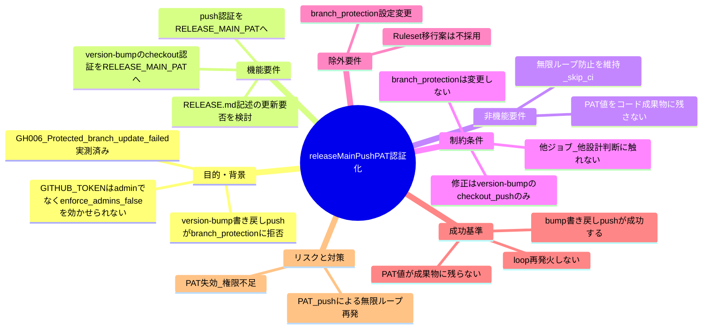
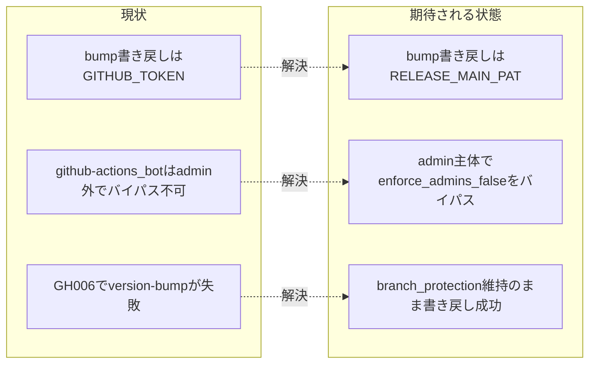

# 要求定義書: release.yml の main 直接 push 認証を PAT 化する

**プロジェクト名**: release.yml の main 直接 push 認証を PAT 化する
**作成日**: 2026 年 07 月 12 日
**最終更新**: 2026 年 07 月 12 日

> **重要**:
>
> - 要求定義書は、プロジェクトの全体像を把握するためのものです。詳細な技術仕様や実装方法は要件定義書以降で記載します。必要最低限の情報に収めることを心掛けてください。
> - **このドキュメントは常に更新**: 要求の変更や追加があった場合は、即座にこのドキュメントを更新してください。ドキュメントは「生きているドキュメント」として扱い、実装内容と常に同期させます。
> - **必須項目**: 以下の「必須」と明記した項目は空欄・抽象語のみ（例: 「{説明}」のまま）で提出しないこと。判定可能な形（目的は1文・成功基準は○/×で判定できる記載等）で記入すること。
>
> **用語**: [.agent-skill-chain/source/CONCEPTS.md §用語規約](../../../../../.agent-skill-chain/source/CONCEPTS.md#用語規約) を参照。

---

## 要求定義の全体像

**注意**:

- 上記の「プロジェクト名」は例です。実際のプロジェクト名に置き換えてください。
- マインドマップは全体像を把握するためのものです。主要なセクション名程度に留め、詳細は記載しないでください。

---

## 1. 目的・背景

### 1.1 目的（必須）

release.yml の main 直接 push 認証を PAT 化し branch protection に拒否されず bump 書き戻しを成功させる。

### 1.2 背景

- **現状の課題**:
  - `.github/workflows/release.yml` の `version-bump` ジョブは、bump 結果（`package.json`・`package-lock.json`・`plugin.json`・`apm.yml` の 4 ファイル）を `git push origin HEAD:main` で main へ直接書き戻す（[.github/workflows/release.yml](../../../../../.github/workflows/release.yml) 97〜111 行目）。この push が既定 `GITHUB_TOKEN`（`github-actions[bot]` アイデンティティ）で実行されるため、main の branch protection に拒否される。
  - `gh workflow run release.yml` の手動実行で `remote: error: GH006: Protected branch update failed`（Protected branch update failed）を実測確認済み（evidence_source: 進行役が把握済みの手動実行結果。`observed_runtime`）。
  - 原因は、既定 `GITHUB_TOKEN` の実行主体 `github-actions[bot]` が admin 権限を持たないため、main の branch protection の `enforce_admins: false`（管理者のみバイパス可）のバイパスが効かないことにある。PR 必須・レビュー承認 1 件以上必須・`self-enforce` ステータスチェック必須の保護が直接 push を弾く。

- **必要性**:
  - リリースの `version-bump` ジョブは、bump した version（`package.json` を正本に `plugin.json`・`apm.yml` へ従属同期）を main へ書き戻して初めて配布 version が確定する。この書き戻しが拒否されると、直前 issue（[docs/maintainer/workflow/20260712_143913_release自動発火push化/](../20260712_143913_release自動発火push化/00_要求定義.md)）で実現した push 契機の自動リリースが最初のジョブで失敗し、continuous release が成立しない。
  - admin 権限を持つメンテナ（adachi-tatsuru）が発行した fine-grained PAT（対象リポジトリ `techbeansjp-free/AGENTS.md` のみ・権限は Contents: Read and write のみ）を、リポジトリ secret `RELEASE_MAIN_PAT` として登録済みであることを確認した（evidence_source: 進行役が `gh secret list` で存在確認済み。登録日時 2026-07-12T06:54:52Z。`observed_runtime`）。この PAT の実行主体は admin ユーザーであるため `enforce_admins: false` のバイパス経路に乗り、branch protection を維持したまま bump 書き戻しを通せる。

### 1.3 期待される効果（必須: 1 件以上）

- **効果 1**: `version-bump` ジョブの bump 書き戻し push が branch protection に拒否されず成功する（○/×判定: push 契機の release 実行で `version-bump` ジョブが GH006 で失敗せず、bump コミットが main に反映されることを確認できる）。
- **効果 2**: branch protection 設定（PR 必須・レビュー承認 1 件以上・`self-enforce` 必須・`enforce_admins: false`・force push/削除禁止）を一切変更せずに書き戻しを通せる（○/×判定: 変更後も `gh api repos/{owner}/{repo}/branches/main/protection` の設定が現状と同一であることを確認できる）。
- **効果 3**: PAT の実トークン値が会話・コード・issue 成果物のいずれにも残らない（○/×判定: 成果物・release.yml 上の参照が secret 名 `RELEASE_MAIN_PAT` のみで、トークン実値が含まれないことを確認できる）。

**現状と期待される状態の比較**:

---

## 2. 機能要件

### 2.1 既存機能の維持（該当する場合）

- 3 ジョブ（`version-bump` → `release-marketplace` → `apm-release`）の直列構成・処理内容は変更しない。
- push 契機の自動発火（`on: push` + `paths` フィルタ）・`RELEASE_ENABLED` 緊急停止スイッチの挙動は変更しない。
- 無限ループ防止の設計（bump コミットメッセージの `[skip ci]`・`concurrency: group: release`・`actor` ガード）は維持する。ただし PAT 化により防御の効き方が変わる点は §7 リスクで扱う。

### 2.2 新規機能要件

- `version-bump` ジョブの main 書き戻しに用いる認証を、既定 `GITHUB_TOKEN` から secret `RELEASE_MAIN_PAT`（fine-grained PAT）へ変更する。具体的には、当該ジョブの checkout ステップで PAT を認証情報として持たせ（後続の `git push origin HEAD:main` がその認証情報で実行されるようにする）、push が admin 主体で行われるようにする。
- 変更に伴い `docs/maintainer/RELEASE.md`（および必要なら README.md のリリース手順要約）の「main への書き戻し push・…は既定 `GITHUB_TOKEN` のみを使用する（PAT／deploy key を使わない）」旨の記述を、実装（bump 書き戻しのみ PAT を使う）と矛盾しない内容へ更新する（更新要否・範囲は 01/02 で確定する）。

---

## 3. 非機能要件

### 3.1 パフォーマンス

- 認証方式の変更のみであり、ジョブ実行時間・CI 実行頻度に有意な影響はない。

### 3.2 セキュリティ

- PAT は対象リポジトリ限定・Contents: Read and write のみの最小権限とし、secret `RELEASE_MAIN_PAT` として保管する。トークン実値はコード・ログ・issue 成果物のいずれにも記載しない（参照は secret 名のみ）。
- 使用範囲を `version-bump` ジョブの checkout/push に限定し、他ジョブ（`release-marketplace`・`apm-release`）は既定 `GITHUB_TOKEN` のまま据え置く（ブラスト半径の最小化）。

### 3.3 互換性

- 既存 3 ジョブの入出力・依存関係（`needs:`）・outputs は変更しない。
- Release 作成（`gh release create`）は引き続き `secrets.GITHUB_TOKEN`（`GH_TOKEN`）を使用し、変更しない。

### 3.4 保守性

- `docs/maintainer/RELEASE.md` を詳細正本として維持し、実装と記述の一致を保つ（spec/06「docs と実装の不整合を放置してはならない」）。

---

## 4. 制約条件

### 4.1 技術的制約

- 修正対象は `release.yml` の `version-bump` ジョブの **checkout ステップと push ステップの認証方法のみ**（`GITHUB_TOKEN` → `secrets.RELEASE_MAIN_PAT`）。他ジョブ・他の設計判断（`paths` フィルタ、`RELEASE_ENABLED`、無限ループ防止策そのものの再設計等）には手を入れない。
- main ブランチの branch protection 設定（PR 必須・レビュー承認 1 件以上・`self-enforce` 必須・`enforce_admins: false`・force push/削除禁止）自体は変更しない（確定済み前提）。
- PAT 化により bump 書き戻し push の実行主体が admin ユーザーになるため、既定 `GITHUB_TOKEN` による push は on:push を再トリガしないという既存の主防御が、当該 push には効かなくなる。無限ループ防止は `[skip ci]` に依存する形へ実質シフトするため、この点を維持・明記する（新規ガードの追加は必要最小限）。

### 4.2 既存システムとの互換性

- 3 ジョブの処理内容（version bump・adapter/apm 生成・決定性検証・タグ付与・Release 作成）は変更しない。

### 4.3 移行期間・スケジュール

- 特になし（単一 PR での切替を想定）。secret `RELEASE_MAIN_PAT` は登録済みのため追加の準備は不要。

---

## 5. 除外要件

- branch protection 設定自体の変更は対象外。
- GitHub Ruleset への移行（GitHub Actions app 全体を bypass 対象にする案）は**不採用**（対象外）。理由: bypass 対象が「このリポジトリの全ワークフロー」に広がり release.yml 単体にスコープを絞れず、PAT 方式（該当ジョブのみが特定 secret を使う）よりセキュリティ上のブラスト半径が大きいため。
- 他ジョブ（`release-marketplace`・`apm-release`）の認証変更は対象外（これらは main へ直接 push せず、`release/*` ブランチ push であり branch protection の対象外）。
- push 契機化・`paths` フィルタ・`RELEASE_ENABLED` の設計変更は対象外（直前 issue で確定済み）。

---

## 6. 成功基準（必須: 1 件以上）

- `release.yml` の `version-bump` ジョブの checkout ステップが `token: ${{ secrets.RELEASE_MAIN_PAT }}` を用いており、後続の main 書き戻し push がその PAT 認証で実行される。
- bump 書き戻し push が branch protection（GH006）に拒否されず成功する（実行確認は検証フェーズで行う。実 push での確認が難しい範囲は 03 実装計画で代替検証方法を明記する）。
- branch protection 設定は変更されていない（`gh api …/branches/main/protection` が変更前後で同一）。
- 無限ループが発生しない（bump 書き戻しの `[skip ci]` により後続の release ワークフローが再発火しないこと。PAT push は既定トークンと異なり on:push を再トリガしうるため、`[skip ci]` が有効に効くことを 01/02 で確認する）。
- PAT の実トークン値が release.yml・成果物・ログのいずれにも含まれず、参照は secret 名 `RELEASE_MAIN_PAT` のみである。
- `docs/maintainer/RELEASE.md`（必要なら README.md）の認証に関する記述が、bump 書き戻しのみ PAT を使う実装と矛盾しない内容に更新されている。

---

## 7. リスクと対策

### 7.1 技術的リスク

- **リスク**: PAT による main push は既定 `GITHUB_TOKEN` と異なり on:push を再トリガしうるため、無限ループ（bump → push → 再発火 → bump …）が発生する恐れがある。
  - **対策**: bump 書き戻しコミットメッセージの `[skip ci]` を維持し、これが GitHub Actions のスキップ条件として有効に働くことを 01 の受け入れ基準・02 設計で確認する。加えて `concurrency: group: release` による直列化を維持する。`actor != 'github-actions[bot]'` ガードは PAT 化で actor が admin ユーザーになり弾けなくなるため、`[skip ci]` を主防御として明記する。
- **リスク**: PAT の失効・権限不足・スコープ誤りにより push が失敗する。
  - **対策**: PAT は Contents: Read and write の最小権限・対象リポジトリ限定で発行済み。失効時は secret を再登録する運用とし、02/03 で失敗時の観測（GH006 とは異なる 403 等）を切り分けられるようにする。

### 7.2 スケジュールリスク

- **リスク**: 特になし（変更範囲は `version-bump` ジョブの認証 2 ステップと RELEASE.md 記述に限定）。
  - **対策**: 該当なし。

---

## 8. 参考資料

### プロジェクトドキュメント

- [`.github/workflows/release.yml`](../../../../../.github/workflows/release.yml) — 現行ワークフロー定義（`version-bump` ジョブの checkout 58〜61 行目・書き戻し push 97〜111 行目）
- [`docs/maintainer/RELEASE.md`](../../../../../docs/maintainer/RELEASE.md) — リリース手順の詳細正本（認証記述の更新対象）
- [`docs/maintainer/workflow/20260712_143913_release自動発火push化/00_要求定義.md`](../20260712_143913_release自動発火push化/00_要求定義.md) — 直前 issue（push 契機化）。本 issue はその前提を変えない範囲での追加修正。
- [`.agent-skill-chain/source/spec/06_設計判断の優先順位.md`](../../../../../.agent-skill-chain/source/spec/06_設計判断の優先順位.md) — 「docs と実装の不整合を放置してはならない」

### その他の参考資料

- fine-grained PAT / GitHub Actions と branch protection のバイパス（`enforce_admins`）の関係（GitHub 公式仕様）。実トークン値は本 issue に記載しない。

---

## 9. 次のステップ

この要求定義書の承認後、以下のドキュメントを作成します：

- **次**: [`01_要件定義.md`](./01_要件定義.md) - 要件定義フェーズ
