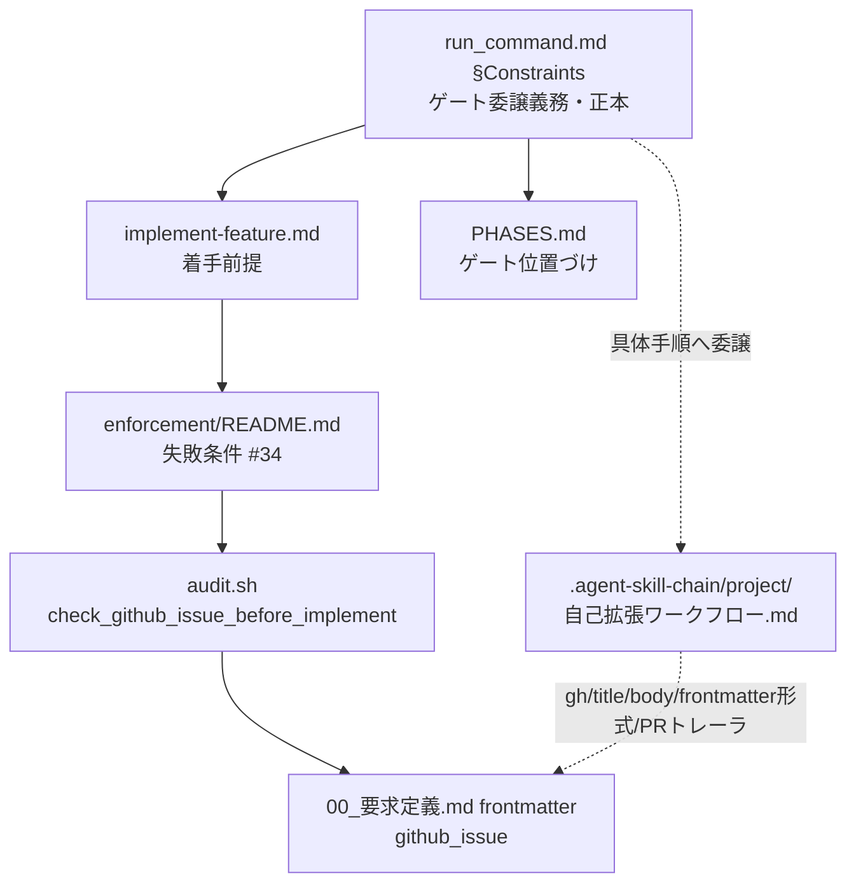
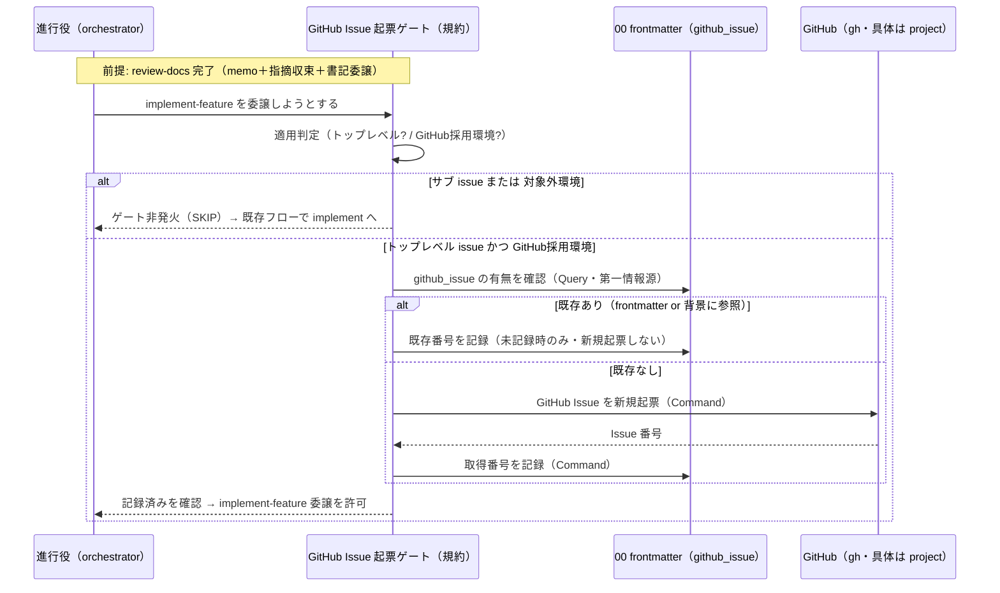
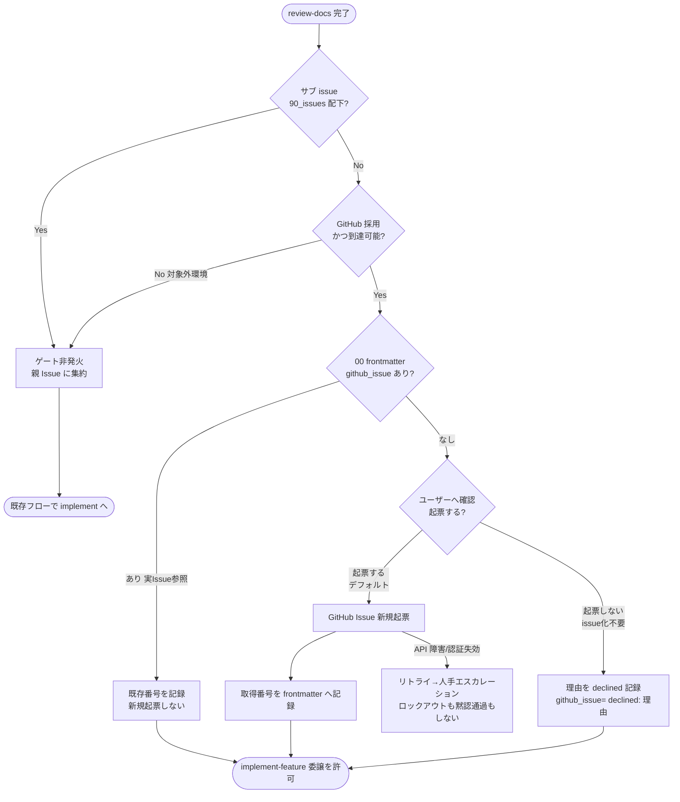
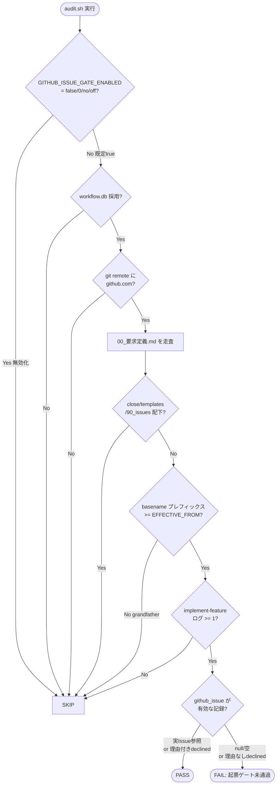

# 設計書: review-docs 完了後の GitHub Issue 起票ゲート追加

**プロジェクト名**: review-docs 完了後の GitHub Issue 起票ゲート追加
**作成日**: 2026 年 07 月 12 日
**最終更新**: 2026 年 07 月 13 日

> **重要**: **このドキュメントは常に更新**: 設計の変更や追加があった場合は、即座にこのドキュメントを更新してください。ドキュメントは「生きているドキュメント」として扱い、実装内容と常に同期させます。
>
> **用語**: [.agent-skill-chain/source/CONCEPTS.md §用語規約](../../../../../.agent-skill-chain/source/CONCEPTS.md#用語規約) を参照。

---

## 1. 設計概要

**必須**: 設計方針・原則は [.agent-skill-chain/source/spec/01\_設計原則.md](../../../../../.agent-skill-chain/source/spec/01_設計原則.md) を参照した上で、本プロジェクトに適用するものを選び記載する。

### 1.1 設計方針

既存の「実装着手前の review-docs 必須ゲート」と**同一構造・同一強度**のゲートを 1 段だけ追加する（新規の強制機構を発明せず、既存パターンの写像で実現する）。抽象原則（ゲートの存在・タイミング・適用条件・分岐・記録の必要性）は**コア**（`.agent-skill-chain/source/`）に置き、具体手順（`gh` コマンド・title/body・frontmatter の具体形式・PR トレーラ）は `.agent-skill-chain/project/自己拡張ワークフロー.md` に置く。

### 1.2 設計原則（本プロジェクトで適用するもの）

- **UNIX哲学**: ゲートは「GitHub Issue の存在と番号のローカル記録を implement の前提にする」という 1 つのことだけを行う。既存フェーズ順・review-docs ゲートには手を加えない（小さく作る・組み合わせ可能）。
- **単一責務**: ゲートの規約（コア）・具体手順（project）・近似検知（enforcement/audit.sh）を責務ごとに別ファイルへ分離する。1 ファイル 1 責務。
- **明確な境界**: 抽象原則（コア）と具体手順（project）の境界を [MODEL_SELECTION.md §汎用/固有境界](../../../../../.agent-skill-chain/source/MODEL_SELECTION.md) と同型に引く。
- **AIフレンドリー設計**: 既存 #32（review-docs ゲート）の記述・実装位置を写像することで、意図が既存構造から読み取れる形にする（[01\_設計原則 §AIフレンドリー設計](../../../../../.agent-skill-chain/source/spec/01_設計原則.md#aiフレンドリー設計)）。

---

## 2. アーキテクチャ設計

### 2.1 責務・境界・参照関係

[01\_設計原則 §明確な境界・§単一責務](../../../../../.agent-skill-chain/source/spec/01_設計原則.md) に従い、コンポーネントの責務・境界・参照関係を明示する。本 issue で**変更・新設される規約/コードの単位**をコンポーネントとして扱う。

#### 2.1.1 責務一覧

| コンポーネント | 責務（1 文） |
| -------------- | ------------ |
| `run_command.md §Constraints`（コア・変更） | review-docs ゲートの直後に「GitHub Issue 起票ゲート（デフォルト起票・意図的スキップは理由記録）」を委譲義務として 1 項追加する正本を持つ。 |
| `implement-feature.md §実行時の注意`（コア・変更） | implement 着手の前提に「対応 GitHub Issue の記録（実 Issue 番号 or 理由付き declined）」を加える注記を持つ。 |
| `PHASES.md §レビュー成果物の配置ルール`（コア・変更） | review-docs 完了後・implement 前の必須ゲートとして GitHub Issue 起票ゲートを位置づける注記を持つ（review-docs 完了定義は再定義しない）。 |
| `enforcement/README.md §失敗条件`（コア・変更） | 本ゲート未通過の近似検知失敗条件 #34 を、既存 #32 と非交差の独立番号で定義する（実 Issue 記録 or 理由付き declined なら PASS）。 |
| `enforcement/ci/audit.sh`（コア・変更） | #34 の近似検知（`check_github_issue_before_implement`）を実装し、frontmatter への記録欠落（null/空）および理由なし declined を CI で検出する（ADR-7 のバリデーション）。関数冒頭で `GITHUB_ISSUE_GATE_ENABLED` を最優先ガードとして評価する（ADR-8）。 |
| `.agent-skill-chain/project/自己拡張ワークフロー.md`（固有・変更） | 具体手順（起票確認の分岐・既存 Issue 判定・`gh` コマンド・title/body・frontmatter キー/値形式・declined 記録形式・PR トレーラ・GitHub 採用/到達性の具体判定）を持つ。 |
| `00_要求定義.md frontmatter の github_issue`（データ・記録面） | 対応 GitHub Issue 番号/URL（起票時）または理由付き declined（起票しない時）を記録する単一情報源。ゲート通過の必要条件かつ #34 の検知対象。 |

#### 2.1.2 境界

- **入力**: 対象 issue が「トップレベル issue」か「サブ issue（`90_issues/` 配下）」か、実行環境が「GitHub 採用環境」か「対象外環境」か、00_要求定義.md frontmatter の `github_issue` の有無/値。
- **出力**: implement-feature 委譲の可否（ゲート通過 or 差し戻し）と、00 frontmatter への Issue 番号記録、CI 監査（#34）の PASS/FAIL/SKIP。
- **他責務との境界**:
  - **review-docs ゲート（#32）は変更しない**。本ゲートはその直後に独立して 1 段追加するのみで、review-docs 完了の定義（memo＋指摘収束＋書記委譲）は [PHASES.md](../../../../../.agent-skill-chain/source/workflow/PHASES.md) を正本として再定義しない。
  - **具体的な `gh` コマンド・title/body・frontmatter の具体キー名/形式・PR トレーラは本設計（コア）で確定しない**。project 側へ申し送る（YAGNI・配置境界）。
  - **close 移動・他 issue（release PAT・モデルティア等）には触れない**（00/01 の除外要件）。

#### 2.1.3 参照関係

- `run_command.md` → `PHASES.md`（review-docs 完了定義を参照）
- `run_command.md` → `implement-feature.md`（着手前提として整合）
- `implement-feature.md` → `enforcement/README.md`（#34 未実行検知を参照）
- `enforcement/README.md` → `enforcement/ci/audit.sh`（#34 の実装所在）
- `audit.sh (#34)` → `00_要求定義.md frontmatter github_issue`（近似検知の対象を読む）
- コア各ファイル → `.agent-skill-chain/project/自己拡張ワークフロー.md`（具体手順へ委譲）
- 循環参照は持たない（コア → project の一方向。project からコアへの実装依存は張らない）。

### 2.2 システムアーキテクチャ

**必須**: 設計判断は [.agent-skill-chain/source/spec/](../../../../../.agent-skill-chain/source/spec/)（[00_spec概要.md](../../../../../.agent-skill-chain/source/spec/00_spec概要.md)、[01\_設計原則.md](../../../../../.agent-skill-chain/source/spec/01_設計原則.md)、[06\_設計判断の優先順位.md](../../../../../.agent-skill-chain/source/spec/06_設計判断の優先順位.md)）を先に参照している。

- **採用パターン**: 既存ゲート（review-docs 必須ゲート #32）の**写像パターン**。フェーズ進行の状態ゲートを 1 段追加する規約駆動＋CI 近似検知の二層構成（runtime の Constraints 明記＋CI 事後検知）。
- **根拠**: [06\_設計判断の優先順位.md](../../../../../.agent-skill-chain/source/spec/06_設計判断の優先順位.md) の「仕様との整合性」「構造の一貫性」を優先。新規機構を発明せず既存 #32 の構造・強度・SKIP 設計に揃える（evidence_source: `repo_file` — run_command.md:47 / implement-feature.md:64 / PHASES.md:65 / enforcement/README.md #32・audit.sh:891 を実読）。

#### 2.2.1 CQRS（Command/Query 分離）

- **Command（状態変更）**: GitHub Issue の新規起票（`gh issue create` 相当・具体は project）、00 frontmatter への番号記録。
- **Query（状態取得）**: 既存 Issue 有無の判定（frontmatter 参照・`gh issue list` 照合）、GitHub 採用/到達性の判定、CI 近似検知の読み取り。Query に副作用を持たせない（[06\_設計判断の優先順位.md](../../../../../.agent-skill-chain/source/spec/06_設計判断の優先順位.md) 「query に副作用を書いてはならない」）。

#### 2.2.2 アーキテクチャ図（本プロジェクトの構成で記載）

### 2.3 コンポーネント構成

明確な境界（コア＝抽象原則層 / project＝具体手順層 / enforcement＝近似検知層 / 成果物 frontmatter＝記録面）で構成し、各コンポーネントは単一責務を満たす（§2.1.1）。本 issue はコード実装よりも**規約ドキュメントとその CI 近似検知**が主成果物であり、UI・DB スキーマの新設は伴わない。

### 2.4 データフロー

ゲートは同期処理であり、独立したイベントバスは導入しない（[06\_設計判断の優先順位.md](../../../../../.agent-skill-chain/source/spec/06_設計判断の優先順位.md) 「単純な同期処理で十分な場合は無理に導入しない」）。ただし概念上の「起きた事実」としては `GitHubIssueLinked`（既存 Issue にリンク）/ `GitHubIssueCreated`（新規起票）/ `GitHubIssueRecorded`（frontmatter へ記録）を区別できる。

### 2.5 横断設計判断（ADR）

本 issue の重要判断を [EVIDENCE_POLICY.md](../../../../../.agent-skill-chain/source/EVIDENCE_POLICY.md) の ADR 形式（コンテキスト・検討した選択肢・決定・根拠[evidence_source 付き]・帰結）で記録する。evidence_source の分類定義は [CONCEPTS.md §外部根拠の必須化](../../../../../.agent-skill-chain/source/CONCEPTS.md#外部根拠の必須化external-anchor)（EVIDENCE_POLICY.md 経由）を参照する。

#### ADR-1: ゲートを既存 review-docs ゲート（#32）の同型構造で追加する（強度は「デフォルト起票＋理由付き代替経路」）

- **コンテキスト**: review-docs 完了後・implement 前に GitHub Issue の起票をデフォルトとしたい。ただし issue 化が不要なケースもあるため一律強制は過剰になりうる。強制機構を新規発明するか既存ゲートの構造を写像するか、また強度をどう設計するかを決める必要がある。
- **検討した選択肢**: (A) 既存 review-docs 必須ゲート（コア Constraints ＋ enforcement #32 ＋ audit.sh）の構造をそのまま写像して 1 段追加する。強度は「デフォルト起票＋意図的スキップは理由記録（免除ではなく代替記録）」とする。(A') (A) と同じ構造だが強度を review-docs と同一の「絶対強制・一律・免除なし」にする。(B) 独自の強制機構（新 hook・新スキーマ列等）を新設する。
- **決定**: (A) を採用。位置は「review-docs 完了の後・implement-feature 委譲の前」に固定する。**構造は #32 と同型（5 点セットの写像）だが、強度は「デフォルト起票＋理由付き記録による代替経路あり」とする**。すなわちゲート通過には「実 GitHub Issue の記録」または「理由付き declined 記録」のいずれかが必要であり、記録なし・理由なしのスキップ（空虚なバイパス）は不可とする。
- **根拠**: 既存 #32 が「コア Constraints（run_command.md:47）＋ implement-feature.md:64 の前提注記＋ PHASES.md:65 の位置づけ＋ enforcement #32 ＋ audit.sh:891 の近似検知」の 5 点セットで成立していることを実読で確認（evidence_source: `repo_file`）。構造の同型化は学習コスト・保守コストが最小で一貫性を保つ（[06\_設計判断の優先順位.md](../../../../../.agent-skill-chain/source/spec/06_設計判断の優先順位.md)）。一方で (A') の一律免除なしはユーザーの明示要求（「issue 化する必要がない時もあるはず。デフォルトは起票。起票しないなら記録しておく」evidence_source: `user_instruction`）に反するため退けた。「起票しないことを記録する」を契約上必須とすることで、一律強制を課さずとも形骸化（黙ってスキップ）を防げる。
- **帰結**: 変更対象は既存 #32 と同じ 5 ファイル群に確定する。既存 review-docs ゲート（#32）は置換・弱化しない（01 §2.1）。本ゲートの通過判定は二値（実 Issue 記録 or 理由付き declined）となり、audit.sh #34 と project 具体手順にその分岐が反映される（ADR-2・ADR-7）。

#### ADR-2: 既存 Issue の判定と番号記録の単一情報源を 00 frontmatter `github_issue` にする

- **コンテキスト**: 「既存あり→リンク／無し→新規作成」の分岐と番号記録を、曖昧な自動推測に依存せず一意に判定する必要がある（01 §7.1 リスク）。
- **検討した選択肢**: (A) 第一情報源＝00_要求定義.md frontmatter の `github_issue` キー（有＝既存/リンク済み、null/欠落＝未リンク）。未記載時のフォールバックは `gh issue list` 照合またはユーザー確認。(B) 常に `gh issue list` を第一情報源にする。(C) 常にユーザーへ都度確認する。
- **決定**: (A) を採用。第一情報源を frontmatter `github_issue` とし、null/欠落時のみフォールバック（照合 or ユーザー確認）へ降りる。記録場所も同キーに一本化する。**同キーは「実 Issue 参照（起票時）」だけでなく「起票しない決定の理由付き記録（declined）」も保持する**（値形式の確定は ADR-7）。
- **根拠**: 本 issue の 00_要求定義.md 冒頭 frontmatter に既に `github_issue: null` の記録欄が存在し、単一情報源として機能することを実読で確認（evidence_source: `repo_file` — 00_要求定義.md:6-8）。(B) は API 依存で対象外環境・障害時に不安定、(C) は毎回の人手確認で形骸化しやすい。frontmatter 一本化はローカル完結で監査（#34）とも整合する。起票する/しないの両決定を同一キーに集約することで、ゲート通過の判定を単一情報源で完結できる。
- **帰結**: ゲート通過の必要条件＝`github_issue` が「非 null の実 Issue 参照」または「理由付き declined」。#34 は同キーの欠落・null・理由なし declined を近似検知する。**具体キー名の最終確定・値の形式（番号 or URL・`"declined: <理由>"`）・分岐の具体コマンドは project 側**（本設計はキーの役割・単一情報源性・二値通過条件のみ確定。値の形式境界は ADR-7）。

#### ADR-3: 未通過の近似検知を独立番号 #34 で CI 実装する（#32 と非交差）

- **コンテキスト**: ゲート形骸化（「起票したことにして実装へ進む」「理由なく declined と書いて実装へ進む」）を防ぐため、未通過の機械検知が要る。CI 強制するか AI 自律判断に委ねるかを決める（01 §4.2）。
- **検討した選択肢**: (A) audit.sh に #34（`check_github_issue_before_implement`）を実装し、frontmatter の `github_issue` が「実 Issue 記録でも理由付き declined でもない」（null/空/理由なし declined）状態を CI で近似検知する。(B) #22–#24 と同様に CI 非強制（AI 自律判断・人手監査）に委ねる。
- **決定**: (A) を採用。既存の失敗条件の最大番号が #32 であることを実読で確認（evidence_source: `repo_file` — enforcement/README.md 失敗条件表・audit.sh:881）。直後の #33 は並行する別 issue（close 移動監査強制）が独立に採番・使用中であり、番号の非交差を保つため本 issue は #34 を割り当てる。frontmatter という git 追跡痕跡があるため機械検知可能。判定は「実 Issue 記録あり or 理由付き declined あり → PASS／null・空・理由なし declined → FAIL」の二値（値形式は ADR-7）。
- **根拠**: #22–#24 が機械検知不能（許可確認の有無等は痕跡を残さない）なのに対し、本ゲートは「frontmatter に `github_issue` が記録されているか（かつ declined なら理由が非空か）」という git 差分・DB スコープで観測可能な痕跡を持つ。よって #32 と同じ「workflow.db 採用時・implement ログ有時」の近似検知に載せられる。#32 が「review-docs ログ 0 件」を見るのに対し #34 は「00 frontmatter の github_issue が有効な記録か」を見るため**検知対象が異なり非交差**。なお declined の理由の**妥当性**（内容が意味を成すか）は機械検知不能であり、audit.sh は「理由が非空か」の形式的バリデーションのみを担い、内容妥当性は AI 自律判断＋人手監査に委ねる（#22–#24 と同じ扱い）。
- **帰結**: #34 は #32 と同じ SKIP 骨格（DB 非採用・close/templates 配下・grandfather）を持ちつつ、追加で**サブ issue（`90_issues/` 配下）SKIP** と **GitHub 非採用環境 SKIP** を持つ（ADR-4/ADR-6）。FAIL 判定に「理由なし declined」を含める（ADR-7）。

#### ADR-4: 対象外環境（GitHub 非採用/到達不能）ではゲートを発火させない（フォールバック）

- **コンテキスト**: GitHub 前提のゲートが非採用環境で誤発火すると実行不能になる（過去に enforce on が Agent ツール名未対応で進行役を完全ロックアウトした事例と同種の硬直リスク・01 §7.1）。
- **検討した選択肢**: (A) [MODEL_SELECTION.md §1 適用条件](../../../../../.agent-skill-chain/source/MODEL_SELECTION.md) と同型に「対象外環境では発火しない」フォールバックを規約・CI 双方に組み込む。CI の GitHub 採用判定は「git remote に github.com を含むか」を自動シグナルにする。(B) 常時発火させ、非採用環境は運用回避に委ねる。
- **決定**: (A) を採用。
  - **runtime（進行役）側**: GitHub 到達性/採用の具体判定（`gh` の可用性・認証・`git remote`）は project に置き、対象外なら非発火。
  - **CI（audit.sh #34）側**: `git remote -v` が github.com を含む場合のみ発火し、含まない/git ツリーでない場合は SKIP（fail-open・ロックアウト回避）。
- **根拠**: 本リポの `git remote` が `github.com/techbeansjp-free/AGENTS.md.git` を指し、`gh` 2.45.0 が利用可能であることを実測で確認（evidence_source: `observed_runtime`）。この自動シグナルは非 GitHub 消費者では自然に SKIP し、既存 #29/#32 の「DB 非採用は SKIP」と同型の fail-open を実現する。**GitHub API 一時障害・認証失効時**は「対象外環境（永続的非採用）」と区別し、リトライ後にエスカレーション（人手へ提示）して**ロックアウトも黙認通過もしない**方針とする。ただし障害検知/リトライ回数/認証失効の具体判定は project 側の具体手順に委ね、本設計では方針のみ確定する（この障害時運用の詳細は現状 `inference_only` を含むため **要人間確認**）。
- **帰結**: 非 GitHub 環境・障害時に既存フローが止まらない。CI の採用判定シグナル（git remote github.com）と具体到達性判定（project）が二層で対象外を分離する。

#### ADR-5: 抽象原則＝コア／具体手順＝project の配置境界を越えない

- **コンテキスト**: `gh issue create` の具体コマンド・title/body・frontmatter の具体キー名/形式・PR トレーラをどこに置くかを決める（01 §3.4・§5・除外要件）。
- **検討した選択肢**: (A) 抽象原則（ゲートの存在・タイミング・適用条件・分岐・記録の必要性・enforcement 番号・grandfather env 名）をコアに、具体手順を `.agent-skill-chain/project/自己拡張ワークフロー.md` に置く。(B) 具体コマンドもコアに置く。
- **決定**: (A) を採用。CI の env 名（`GITHUB_ISSUE_GATE_EFFECTIVE_FROM` 既定 `20260712_000000`）は audit.sh がコアであるため**コア側**（既存 `REVIEWDOCS_GATE_EFFECTIVE_FROM` と同型）に置く。`gh`/title/body/frontmatter 具体形式（`"#<番号>"`・`"declined: <理由>"`）/起票確認の分岐手順/PR トレーラは project 側に置く。ただし declined の**バリデーション（理由なしは未通過）はコア audit.sh #34** が担う（ADR-7・空虚バイパスの機械検知はコアの責務）。
- **根拠**: [MODEL_SELECTION.md §汎用/固有境界](../../../../../.agent-skill-chain/source/MODEL_SELECTION.md) が「対応表はコアに置かない（PF 中立性）」とする境界パターンを実読で確認（evidence_source: `repo_file`）。CI 用 env 名は既に `REVIEWDOCS_GATE_EFFECTIVE_FROM` がコア audit.sh にある前例に倣う。
- **帰結**: コア変更 4 ファイル＋audit.sh、project 変更 1 ファイルにスコープが確定。具体コマンドをコアに持ち込まない。

#### ADR-6: 適用範囲はトップレベル issue のみ・サブ issue は親 Issue に集約する

- **コンテキスト**: サブ issue（`90_issues/` 配下）ごとに GitHub Issue を量産すると Issue トラッカーが細分化する（01 §2.1 ストーリー 5）。
- **検討した選択肢**: (A) 適用をトップレベル issue に限定し、サブ issue は親 issue の GitHub Issue のチェックリスト/コメントに集約する。#34 は `90_issues/` 配下パスを SKIP する。(B) サブ issue にも個別起票を課す。
- **決定**: (A) を採用。
- **根拠**: 01 §2.1 ストーリー 5 の受け入れ基準（サブ issue に本ゲートの未通過失敗条件を発火させない・既存 #32 の close/templates SKIP と同型の除外設計）と整合（evidence_source: `repo_file` — 01:99-101）。ブラスト半径・ノイズ最小化（[CONTEXT_EFFICIENCY.md](../../../../../.agent-skill-chain/source/CONTEXT_EFFICIENCY.md) の規模比例思想）。
- **帰結**: #34 の SKIP 条件に「パスに `/90_issues/` を含む」を追加する。これは #32 が `90_issues` を**含める**（unbounded find）のと逆であり、実装上の差分として明記が必要。

#### ADR-7: `github_issue` の値フォーマットと declined 記録のバリデーション

- **コンテキスト**: ADR-1 でゲート強度を「デフォルト起票＋理由付き記録による代替経路」とした。ゲート通過の二値（実 Issue 記録／理由付き declined）を単一キー `github_issue` で表現し、かつ「理由なしの空虚な declined」を弾く必要がある（ユーザー要求「起票しないなら記録しておく」＝記録は必須。空虚なバイパスを許さない）。値フォーマットと、コア（audit.sh）が担うバリデーションの最低ラインを確定する。
- **検討した選択肢**: (A) `github_issue` の値を (a) 実 Issue 参照＝`"#<番号>"` or GitHub Issue URL、(b) 意図的スキップ＝`"declined: <理由>"`（`declined:` プレフィックス＋非空の理由）の 2 系統とする。audit.sh #34 は「null/空/`~`」および「`declined:` で始まるが理由が空/空白のみ」を FAIL、それ以外（実 Issue 参照 or 理由付き declined）を PASS とする。(B) 起票しない場合は別キー（例 `github_issue_declined`）を新設する。(C) declined の理由を必須にせず `declined` 単独で通す。
- **決定**: (A) を採用。値フォーマットの**細部（`"#<番号>"` を採るか URL も許すか、declined の推奨文例）は project 側**（`.agent-skill-chain/project/自己拡張ワークフロー.md`）で確定するが、**「declined は理由が非空であること」というバリデーションの最低ラインは audit.sh #34（コア）が担う**（空虚なバイパスの機械検知はコアの責務・ADR-3）。理由の非空判定は「`declined:` に続く文字列を前後空白トリム後に長さ 1 以上」とする。
- **根拠**: (B) はキーが 2 つになり単一情報源性（ADR-2）を崩す。(C) はユーザー要求（理由の記録）に反し形骸化を招く。(A) は単一キーで二値を表現でき、frontmatter 一本化（ADR-2）と整合する。declined プレフィックスは機械判定が容易（前方一致）で、理由の非空チェックも shell で確実に実装できる（evidence_source: `inference_only` — フォーマット設計判断。実装検証はタスク 3 の隔離テストで担保）。
- **帰結**: audit.sh #34 の判定ロジックは「値が空/null/`~` → FAIL」「`declined:` で始まり理由が空/空白のみ → FAIL」「それ以外 → PASS」となる。project 具体手順に declined の記録形式（`"declined: <理由>"`）と、起票確認の分岐（起票する→リンク/新規、起票しない→理由記録）を追記する。declined の理由の**内容妥当性**は機械検知の対象外（AI 自律判断＋人手監査・ADR-3）。

#### ADR-8: プロジェクト全体でのゲート無効化トグルを設ける

- **コンテキスト**: ADR-4 は「GitHub 非採用・到達不能」という**環境**シグナル（`git remote` に github.com を含まない）による自動フォールバックを扱う。しかしユーザーから追加指摘があった: 「GitHub は管理に使っているが、そもそもプロジェクト全体を通して GitHub Issue の運用自体を使わない可能性がある」（`git remote` は github.com を指すため ADR-4 のフォールバックは発火しない）。この場合、issue ごとに毎回「起票しない」を確認・declined 記録させるのは過剰であり、**プロジェクト単位で本ゲート自体を明示的に無効化できる手段**が必要（evidence_source: `user_instruction`）。
- **検討した選択肢**: (A) 本ゲート単体の無効化トグルを env `GITHUB_ISSUE_GATE_ENABLED`（既定 `true`）として新設し、audit.sh #34 の冒頭で他のどのガード（DB 採用・GitHub 採用環境・grandfather・declined 判定等）よりも先に評価する。(B) 既存の enforcement 全体の opt-in 機構である `enforce on/off` を流用し、本ゲートも `enforce off` で無効化されることにする（新規トグルを作らない）。(C) `.agent-skill-chain/project/` 側にのみ無効化設定を置き、コア audit.sh には反映しない（AI 自律判断のみで運用）。
- **決定**: (A) を採用。コア audit.sh #34 内に env ガードとして実装し、**プロジェクト全体でのゲート無効化**という抽象原則自体はコアの責務とする（配置境界は ADR-5 と同型: 無効化トグルの**存在・既定値・優先順位**はコア、無効化を**いつ使うか**という運用判断は project の具体手順に委ねる）。
- **根拠**: (B) は `enforce off` が enforcement 全体（#1〜#34 すべて）を無効化するため、GitHub Issue ゲート以外のチェック（#29・#32 等）まで意図せず無効化してしまい、ブラスト半径が過大（過去の「enforce on が Agent ツール名未対応で進行役を完全ロックアウトした事例」の教訓から、粒度の粗い一括トグルは事故要因になりやすい）。(C) は project 側のみの記述では CI（audit.sh）が実際にはチェックし続けてしまい、無効化の実効性がない（AI 自律判断に委ねると形骸化・見落としのリスクが残る）。(A) は既存の env 命名パターン `GITHUB_ISSUE_GATE_EFFECTIVE_FROM`（grandfather cutoff）と同一の `GITHUB_ISSUE_GATE_` 接頭辞に揃えることで一貫性を保ちつつ、本ゲート単体に閉じたブラスト半径を実現する（evidence_source: `repo_file` — 既存 `GITHUB_ISSUE_GATE_EFFECTIVE_FROM` の命名を実読して確認）。
- **帰結**: audit.sh #34 の先頭に `GITHUB_ISSUE_GATE_ENABLED`（`false`/`0`/`no`/`off` で無効化）のガードを追加する。これは ADR-4（GitHub 非採用環境フォールバック）・grandfather（ADR-5）・サブ issue 集約（ADR-6）・declined 判定（ADR-7）のいずれよりも先に評価される最初のガードとする（他のガードは環境や個々の issue の状態に依存する条件判定だが、本トグルは「そのプロジェクトで本ゲートを使うか」という一段上の意思決定であり、他の条件評価より優先されるべきため）。コア（run_command.md・enforcement/README.md）にトグルの存在・既定値・env 名を明記し、project 側に運用（本リポジトリでは有効のままにする旨）を記述する。

---

## 3. 機能設計

### 3.1 機能 1: GitHub Issue 起票ゲート（runtime・進行役の委譲判断）

#### 3.1.1 概要

review-docs 完了後、implement-feature 委譲の直前に、進行役がユーザーへ起票するか確認し、「対応 GitHub Issue の記録（実 Issue 番号）」または「起票しない決定の理由記録（declined）」のいずれかを確保する。どちらも無い・理由なし declined なら委譲を差し止める。デフォルトは起票。抽象原則をコア（run_command.md・implement-feature.md・PHASES.md）に記述し、具体判定/操作は project に委ねる（declined のバリデーションのみ audit.sh #34 が担う・ADR-7）。

#### 3.1.2 処理フロー

#### 3.1.3 入力・出力

- **入力**: issue 種別（トップレベル/サブ）、GitHub 採用/到達性、00 frontmatter `github_issue` の有無/値、ユーザーの起票要否判断。
- **出力**: implement-feature 委譲の可否、00 frontmatter への記録（実 Issue 番号 or 理由付き declined）。

#### 3.1.4 エラーハンドリング

- **対象外環境（永続的非採用・到達不能）**: ゲート非発火（SKIP）。既存フローが止まらない。
- **GitHub API 一時障害・認証失効**: 対象外環境と区別し、リトライ後に人手へエスカレーション（ロックアウトも黙認通過もしない）。具体のリトライ回数・判定は project（詳細は要人間確認・ADR-4）。

### 3.2 機能 2: 未通過の近似検知（CI・enforcement #34）

#### 3.2.1 概要

`audit.sh` の `check_github_issue_before_implement`（#34）が、workflow.db 採用時に「トップレベル issue に implement-feature ログが 1 件以上あるのに 00 frontmatter の `github_issue` が有効な記録でない（null/空/`~`、または理由なしの declined）」を近似検知して FAIL する。実 Issue 参照または理由付き declined なら PASS（ADR-7）。**関数冒頭で `GITHUB_ISSUE_GATE_ENABLED` を評価し、無効化されていれば他のどのガードよりも先に SKIP する**（ADR-8・プロジェクト全体でのゲート無効化）。

#### 3.2.2 処理フロー

#### 3.2.3 入力・出力

- **入力**: `WF_DB`（workflow.db）、`WORKFLOW_SCAN_DIRS`、各 issue の `00_要求定義.md`（frontmatter）、`git remote`、env `GITHUB_ISSUE_GATE_EFFECTIVE_FROM`（既定 `20260712_000000`・上書き可）、env `GITHUB_ISSUE_GATE_ENABLED`（既定 `true`・プロジェクト全体でのゲート無効化トグル・ADR-8）。
- **出力**: PASS / FAIL（EXIT_CODE=1）/ SKIP。

#### 3.2.4 エラーハンドリング

- sqlite3 不在・DB 不在・workflow_log 不在・git 非採用・github.com 非検出 → いずれも `return 0`（SKIP・fail-open）。既存 #32/#29 と同型でロックアウトしない。
- frontmatter 命名/プレフィックスが規約外の issue は grandfather 判定不能として素通り（安全側・誤 FAIL を出さない。#32 と同型）。
- `GITHUB_ISSUE_GATE_ENABLED` が `false`/`0`/`no`/`off`（大小文字非区別）→ 他の判定に進む前に `return 0`（SKIP・最優先ガード・ADR-8）。

---

## 4. データ設計

新規テーブル・スキーマ変更は伴わない（workflow.db スキーマは既存のまま）。記録面は 00_要求定義.md の frontmatter キーのみ。

| 記録項目 | 配置 | 役割 | 形式の確定先 |
| -------- | ---- | ---- | ------------ |
| `github_issue` | 00_要求定義.md frontmatter | 対応 GitHub Issue 番号/URL（起票時）または理由付き declined（起票しない時）の単一情報源。ゲート通過の必要条件かつ #34 の検知対象。 | キー役割・二値通過条件・declined バリデーション（理由なしは FAIL）＝本設計（コア・ADR-7）。**具体値の形式（`"#<番号>"` or URL・`"declined: <理由>"`）・title/body・PR トレーラ＝project** |

---

## 5. API 設計

REST/RPC の新設 API はない。外部インターフェースは GitHub との連携（`gh` CLI・PR トレーラ）であり、契約は以下（具体コマンドは project・§4.1 の 01 参照）。

### 5.1 インターフェース一覧

| インターフェース | 種別 | 説明 |
| ---------------- | ---- | ---- |
| 起票要否の確認 | Query | 既存が無い場合、ユーザーへ起票するかを確認する（デフォルトは起票。具体は project）。 |
| 既存 Issue 有無判定 | Query | 00 frontmatter `github_issue` を第一情報源に、null/欠落時のみ `gh issue list` 照合 or ユーザー確認へフォールバック（具体は project）。 |
| GitHub Issue 起票 | Command | 既存なし＋起票する時のみ `gh issue create` 相当で新規起票し番号取得（具体は project）。 |
| 番号記録 | Command | 取得/既存番号を 00 frontmatter `github_issue` へ `"#<番号>"` 形式で記録。 |
| declined 記録 | Command | 起票しないと判断した時、`github_issue` へ `"declined: <理由>"` 形式で記録（理由は非空）。 |
| PR 自動クローズ連携 | 契約 | 起票した場合のみ PR 本文に `Closes #<番号>` を含める（GitHub 公式のマージ時自動クローズ仕様）。具体文言埋め込みは project（CLOSEOUT の具体値・PR トレーラ）。 |

### 5.2 契約違反の扱い

- **既存 Issue 判定の誤り**（重複起票/無起票）: 単一情報源（frontmatter）優先で回避。曖昧時はフォールバック（照合/確認）へ降り、自動推測に依存しない。
- **番号未記録のまま implement 委譲**: 規約上禁止。#34 で近似検知して FAIL。

---

## 6. テスト戦略

テスト戦略の観点定義は [RULES.md のテスト戦略必須要件](../../../../../.agent-skill-chain/source/RULES.md#テスト戦略必須要件) を、BDD 形式定義は [TEST_BDD_FORMAT.md](../../../../../.agent-skill-chain/source/TEST_BDD_FORMAT.md) を参照。本ドキュメントでは対象ごとのテスト割当のみ記載する。

### 6.1 対象ごとのテスト割り当て

| 対象 | 単体 | 結合/API | E2E | クリティカル観点 | バリデーション観点 | 未達理由/補足 |
| ---- | ---- | -------- | --- | ---------------- | ------------------ | ------------- |
| コア規約記述（run_command/implement-feature/PHASES/enforcement README の #34 追記） | × | × | × | ゲートの存在・位置・強度・SKIP 条件が既存 #32 と同型に記述されているか（文言レビュー） | 記述の相互参照リンクが解決するか | ドキュメントのためコードテスト不可。監査（verify-and-close）＋リンク解決検証で担保 |
| `audit.sh #34`（`check_github_issue_before_implement`） | ○ | ○ | × | implement ログ有＋github_issue 欠落/null で FAIL / 実 Issue 記録済みで PASS / 理由付き declined で PASS / 理由なし declined で FAIL | DB 非採用・close/templates・90_issues・grandfather・github 非採用で SKIP | shell 関数テスト（一時 DB＋一時 issue ツリーを mktemp 隔離） |
| 既存 Issue 判定・分岐（起票確認→既存あり→リンク／無し→新規／起票しない→declined） | ○ | ○ | × | frontmatter あり時に新規起票しない / なし時にユーザー確認し起票 or declined 記録する分岐 | frontmatter 欠落時のフォールバック経路・理由なし declined を弾く | 判定ロジックの具体は project。コア側は分岐の存在と declined バリデーションを規約テスト＋#34 テストで担保 |
| フォールバック（対象外環境非発火） | ○ | × | × | github 非採用/到達不能で非発火 | git 非採用・remote 非 github で SKIP | #34 の SKIP 単体テストで担保。runtime 具体判定は project |
| サブ issue 集約（90_issues SKIP） | ○ | × | × | 90_issues 配下で #34 が発火しない | パスマッチの境界（親 issue は発火・子は SKIP） | #34 単体テスト |
| プロジェクト全体でのゲート無効化トグル（`GITHUB_ISSUE_GATE_ENABLED`） | ○ | × | × | `false`/`0`/`no`/`off` で他の全ガードより先に SKIP / 既定（未設定・`true`）は従来どおり動作 | 大小文字非区別・他ガード（DB採用・github採用環境・grandfather・declined）より優先評価されるか | #34 単体テスト（mktemp 隔離。ADR-8） |

### 6.2 監査・レビューでの確認（証跡）

証跡の確認観点は RULES §テスト戦略必須要件および PHASES.md の監査観点を参照。本設計 §6.1 の割当表と 03_実装計画のタスク別テスト観点・BDD（01 の 6 ストーリー／4 ユースケースに対応）が揃っていることを確認する。**本 issue は自己拡張のドキュメント/CI 変更が主**であり、01 の各 BDD シナリオはコア規約記述の存在確認と #34 の shell 関数テストへ写像する（03 §テスト観点で対応表を明示）。

---

## 7. UI 設計

UI は伴わない（該当なし）。

---

## 8. セキュリティ設計

### 8.1 認証・認可

起票に用いる認証（`gh` の GitHub トークン等）は実行環境の既存認証に従う（01 §3.2）。

### 8.2 データ保護

トークン実値を成果物・memo・`workflow.db`・ログのいずれにも残さない（01 §3.2）。具体の認証取扱いは project の具体手順に従う。

---

## 9. 非機能要件への対応

### 9.1 パフォーマンス

ゲートは 1 トップレベル issue あたり最大 1 回（新規起票 or 既存リンク確認）。#34 は既存 audit の走査に 1 チェック関数を追加するのみで、ワークフロー全体への有意な影響はない（01 §3.1）。

### 9.2 可用性

対象外環境・API 障害でロックアウトしない（ADR-4）。#34 は全 SKIP 条件で fail-open（§3.2.4）。

---

## 10. 参考資料

### プロジェクトドキュメント

- [`00_要求定義.md`](./00_要求定義.md) - 要求定義
- [`01_要件定義.md`](./01_要件定義.md) - 要件定義
- [`.agent-skill-chain/source/skills/agent/run_command.md`](../../../../../.agent-skill-chain/source/skills/agent/run_command.md) - §Constraints（既存 review-docs 必須ゲート・本ゲートの同型テンプレート）
- [`.agent-skill-chain/source/commands/implement-feature.md`](../../../../../.agent-skill-chain/source/commands/implement-feature.md) - §実行時の注意（実装着手の前提）
- [`.agent-skill-chain/source/workflow/PHASES.md`](../../../../../.agent-skill-chain/source/workflow/PHASES.md) - §レビュー成果物の配置ルール（review-docs 完了定義・必須ゲート注記）
- [`.agent-skill-chain/source/enforcement/README.md`](../../../../../.agent-skill-chain/source/enforcement/README.md) - §失敗条件と差し戻し #32（同型・非交差で #34 を新設）
- [`.agent-skill-chain/source/enforcement/ci/audit.sh`](../../../../../.agent-skill-chain/source/enforcement/ci/audit.sh) - `check_reviewdocs_before_implement`（#32 実装。#34 の実装モデル）
- [`.agent-skill-chain/source/MODEL_SELECTION.md`](../../../../../.agent-skill-chain/source/MODEL_SELECTION.md) - §1 適用条件（フォールバック思想）・§汎用/固有境界（配置境界）
- [`.agent-skill-chain/project/自己拡張ワークフロー.md`](../../../../../.agent-skill-chain/project/自己拡張ワークフロー.md) - 具体手順（`gh`・title/body・frontmatter 形式・PR トレーラ）の配置先

### その他の参考資料

- GitHub の PR 本文キーワード（`Closes #N`）によるマージ時 Issue 自動クローズ仕様（GitHub 公式）。

---

## 11. 前のステップ

この設計書は、以下のドキュメントを基に作成されています：

- **前**: [`01_要件定義.md`](./01_要件定義.md) - 要件定義フェーズ

---

## 12. 次のステップ

この設計書の承認後、以下のドキュメントを作成します：

- **次**: [`03_実装計画.md`](./03_実装計画.md) - 実装計画フェーズ
