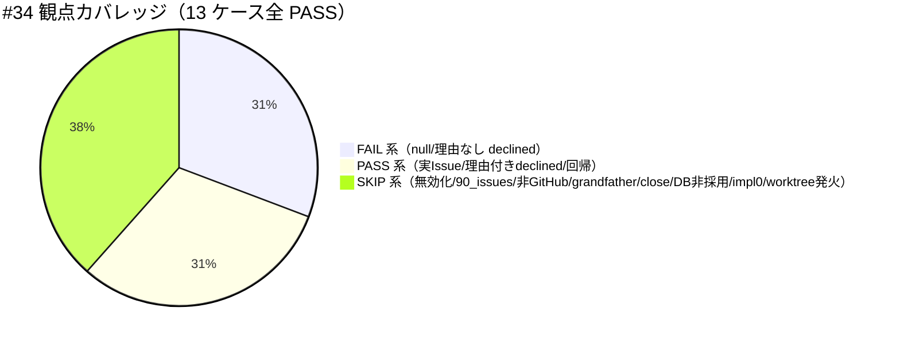

# レビュー書: review-docs 完了後の GitHub Issue 起票ゲート追加

**プロジェクト名**: review-docs 完了後の GitHub Issue 起票ゲート追加
**作成日**: 2026 年 07 月 13 日
**最終更新**: 2026 年 07 月 13 日

> 本 04_review は verify-and-close command（skill chain: generate-scenarios → map-coverage → review-code → review-architecture → write-workflow-log）により作成した。検証対象は **最新の実装状態**（declined opt-out ＋ プロジェクト全体無効化トグル `GITHUB_ISSUE_GATE_ENABLED` の両方が反映された状態）である。
> レビュー深度: **full**（新規の必須ゲート追加＋enforcement 追加のため。[REVIEW_RULE.md](../../../../../.agent-skill-chain/source/REVIEW_RULE.md)）。

---

## 1. レビュー概要

### 1.1 レビュー目的（必須）

実装内容の確認・品質保証（最新の 00〜03 と実装成果物の整合、受け入れ基準・BDD の網羅、設計境界の一致、テスト再実行による裏取り）を行い、クローズ可否を判定する。

### 1.2 レビュー対象（必須）

- **実装範囲**: GitHub Issue 起票ゲート（#34）の 5 点セット写像 — コア規約 3 ファイル（run_command.md・implement-feature.md・PHASES.md）＋ enforcement/README.md（#34 失敗条件）＋ audit.sh（`check_github_issue_before_implement`）＋ project 具体手順（自己拡張ワークフロー.md）＋ 回帰テスト（test-audit.sh）。declined opt-out（ADR-1/ADR-7）と プロジェクト全体無効化トグル `GITHUB_ISSUE_GATE_ENABLED`（ADR-8）の両方を含む最新状態。
- **レビュー期間**: 2026-07-13 ～ 2026-07-13
- **レビュー担当者**: verify-and-close 委譲サブエージェント（fresh reviewer）

---

## 2. 実装内容の確認

### 2.1 実装完了タスク（または Issue）

| タスク名 | 実装内容 | 実装日 | 担当者 | ステータス |
| -------- | -------- | ------ | ------ | ---------- |
| T1 コア規約記述 | run_command.md §Constraints・implement-feature.md §実行時の注意・PHASES.md §レビュー成果物の配置ルール に #34 ゲート（デフォルト起票＋declined 代替＋無効化トグル言及）を追記 | 2026-07-13 | worker | 完了 |
| T2 enforcement #34 定義 | enforcement/README.md の失敗条件一覧・対応表・差し戻し先の 3 箇所に #34 を追加（#32 と非交差明記） | 2026-07-13 | worker | 完了 |
| T3 audit.sh #34 実装 | `check_github_issue_before_implement` を実装（無効化トグル最優先ガード・declined バリデーション・各 SKIP 条件）。呼び出し列に追加 | 2026-07-13 | worker | 完了（本レビューで1件修正） |
| T4 project 具体手順 | 自己拡張ワークフロー.md に起票確認・gh コマンド・frontmatter 形式・declined 記録・PR Closes・無効化トグル運用を追記 | 2026-07-13 | worker | 完了 |
| T5 回帰テスト | test-audit.sh に #34 の 12→13 シナリオ（本レビューで worktree シナリオ 1 件追加） | 2026-07-13 | worker + reviewer | 完了 |

### 2.2 実装内容の詳細（要点）

- **audit.sh #34**（`check_github_issue_before_implement`）: 関数冒頭で `GITHUB_ISSUE_GATE_ENABLED`（既定 true）を最優先評価（ADR-8）→ sqlite3/DB/workflow_log 存在 → git ツリー判定 → `git remote` の github.com 判定 → issue 走査（templates/close/90_issues 除外）→ grandfather（`GITHUB_ISSUE_GATE_EFFECTIVE_FROM` 既定 20260712_000000）→ implement-feature ログ有無 → frontmatter `github_issue` の有効性判定（null/空/`~`＝FAIL、`declined:` かつ理由空＝FAIL、実 Issue 参照 or 理由付き declined＝PASS）。
- **変更ファイル**: `git diff --stat HEAD` 実測 = 9 files changed, 695 insertions(+), 49 deletions(-)。内訳は §5.1 参照。02_設計.md・03_実装計画.md は新規（untracked）。

---

## 3. テスト結果の確認

### 3.1 単体テスト（#34 回帰・test/test-audit.sh）

#### テスト実行結果（必須: 数値で記載・実測）

- **実行日**: 2026-07-13
- **テストファイル**: test/test-audit.sh（`bash test/test-audit.sh`）
- **テストケース数（本ファイル合計）**: 56
- **成功**: 56
- **失敗**: 0
- **スキップ**: 0（本ファイル内。#34 のうち sqlite3/git 依存分は環境に両方在るため全実行）
- **うち #34 GitHub Issue 起票ゲート**: 13 ケース、すべて PASS（違反系 null で FAIL／無効化トグル ON で最優先 SKIP／未設定・true で従来どおり FAIL／実 Issue 記録で PASS／理由付き declined で PASS／理由なし declined・空白のみ理由で FAIL／90_issues SKIP／GitHub 非採用 SKIP／grandfather SKIP／close SKIP／implement ログ 0 件は対象外／DB 非採用 SKIP／**git worktree 内で FAIL（本レビュー追加）**）。

```
== #34 実装前 GitHub Issue 起票ゲート未通過検知 ==
  [PASS] ...（13 件すべて PASS）
== 結果: PASS=56 FAIL=0 ==
```

#### テストカバレッジ（#34 の観点網羅）



### 3.2 統合テスト（test/run-all.sh 全体）

- `bash test/run-all.sh` を実行（exit 0）。全スイート PASS: test-run-all(20)・test-coverage-check(30)・**test-audit(56)**・test-check-comment-refs(9)・test-pretooluse-hook(50)・test-write-workflow-log-prevhash(16)・multidoc(15)・glob(3)・schema-idempotent(25)・test-workflow-db-guard(14)・test-c4-bypass-resistance(13)・test-build-adapters-apm(15)・test-sync-version-apm(9) ほか。
- **SKIP**: test-package-manifest-parity・test-cli-audit-doctor・test-export-ndjson・e2e-claude-hook・e2e-install-uninstall（いずれも `bin/agents-md.js` 未生成による必須依存欠如。bin は非追跡の生成物であり npm build 未実行の環境要因。#34 とは無関係の既知 SKIP）。

### 3.3 実リポ audit.sh 実行（ドッグフーディング・実経路検証 verify(ii)）

- `bash .agent-skill-chain/source/enforcement/ci/audit.sh .` を本 worktree で実行。**修正後**、#34 が本 issue 自身に対して発火し FAIL を出力することを実測で確認:
  ```
  [audit] checking github-issue-gate-before-implement (#34)
  FAIL: 実装前 GitHub Issue 起票ゲート未通過（... github_issue が null/欠落 ...）: docs/maintainer/workflow/20260712_175901_GitHubIssue起票ゲート追加
  ```
  これは本 issue の `github_issue: null`（§10.1 課題）を正しく検知した**期待どおりの自己捕捉**であり、ゲートが実経路で機能することの証跡である。対応（起票 or declined 記録）は進行役の判断に委ねる（§10.1）。

---

## 4. コードレビュー（review-code）

### 4.1 コード品質

- **リント/構文**: audit.sh・test-audit.sh は bash 構文で全テスト実行が成功（構文エラーなし）。
- **配置境界**: `grep -rn "gh issue create" .agent-skill-chain/source/{skills,commands,workflow}` = 0 件（具体コマンドのコア混入なし・ADR-5 遵守）。
- **番号非交差**: audit.sh に `#33` の定義・使用は無し（並行 issue「close 移動監査強制」が #33 を使用中。本 issue は #34）。#34 は関数名 `check_github_issue_before_implement`・失敗条件番号ともに既存と衝突なし。enforcement/README.md の `#34` 出現は 3 箇所（失敗条件一覧・対応表・差し戻し先）、`非交差` 記述 7 箇所で #32 との非交差を明記。

#### コードレビュー観点

| 観点 | 確認内容 | 結果 | コメント |
| ---- | -------- | ---- | -------- |
| 可読性 | ガード順・ADR 参照コメントが判定ロジックと対応 | OK | 各ガードに ADR 番号のコメントあり |
| 保守性 | #32（`check_reviewdocs_before_implement`）の写像で構造一貫 | OK | SKIP 骨格・issue_path マッチが #32 と同型 |
| 正確性 | git ツリー判定 | 要修正→**修正済** | §4.2 指摘1（worktree で false-SKIP）を修正 |
| セキュリティ | トークン実値の残存 | OK | project 手順・例示にトークン実値なし |

### 4.2 指摘事項

#### 指摘 1（重要度: 高・**本レビューで修正済**）: git worktree で #34 が false-SKIP しゲートが骨抜きになる

- **指摘内容**: audit.sh の #34 に `if [[ ! -d "$PROJECT_ROOT/.git" ]]; then return 0; fi` があった。git worktree では `.git` は gitdir ポインタの**ファイル**であり（`file .git` = ASCII text、`git rev-parse --git-dir` = `.../worktrees/...`）、この検査により worktree 内では #34 が常に SKIP（fail-open）していた。ADR-4 の意図は「非 git ツリー・非 github remote のみ SKIP」であり、worktree は github remote を持つ git ツリーなので**発火すべき**。既存 12 テストが検知できなかったのは、フィクスチャがすべて `git init`（通常リポジトリ＝`.git` がディレクトリ）だったため。実際に本 worktree で修正前の audit を実行すると #34 は発火しなかった（実測）。
- **対応状況**: **完了（本レビューで修正）**。
- **対応方法**: 冗長かつ有害な `[[ ! -d "$PROJECT_ROOT/.git" ]]` 行を削除し、次行の `git -C "$PROJECT_ROOT" rev-parse --is-inside-work-tree`（通常リポジトリ・worktree・submodule すべてで正しく判定する正準チェック）に一本化。意図をコメントで明記。回帰防止として test-audit.sh に **worktree シナリオ（シナリオ9）**を追加（`git worktree add` した木で implement ログ有＋`github_issue: null` → #34 が FAIL することを assert）。修正後 test-audit=56 PASS、実リポ audit で #34 が正しく発火（§3.3）。

### 4.3 敵対的観点リスト（review-code + review-architecture 統合・[REVIEW_DUAL_LENS.md](../../../../../.agent-skill-chain/source/REVIEW_DUAL_LENS.md) §2.1）

不確実な点は「問題なし」ではなく要修正/要確認に倒した。

| # | 攻めた観点 | 結論 |
| - | ---------- | ---- |
| A1 | worktree で `.git` がファイルのため #34 が false-SKIP しないか | **問題あり→修正済**（指摘1）。 |
| A2 | 番号 #34 と並行 issue の #33 が衝突しないか | 非交差。本 worktree に #33 は不在（並行 issue 未マージ）。関数名・番号とも衝突なし。ただし**両ブランチのマージ時**に enforcement/README の失敗条件表で #33 と #34 の行が共存する前提であり、マージ担当（進行役）が最終確認する必要がある（§10 確認事項）。 |
| A3 | 無効化トグルが `enforce on/off` を巻き込み #29/#32 まで無効化しないか | 巻き込まない。トグルは #34 関数冒頭の `return 0` のみで、他チェック関数に影響しない（他関数のロジック不変を diff で確認）。 |
| A4 | `declined:` の大小文字・前後空白・空白のみ理由をすり抜けられないか | すり抜け不可。`${gh_val,,}` で小文字化して前方一致、理由は `sed` トリム後に長さ判定。テストで `"declined:"`・`"declined:   "` の両方が FAIL することを実測。 |
| A5 | frontmatter コメント行 `#github_issue:` を誤って値として拾わないか | 拾わない。抽出正規表現 `^github_issue:` は行頭一致でコメント（`#` 始まり）を自然に除外。 |
| A6 | grandfather の文字列比較 `[[ "$ts" < "$cutoff" ]]` が誤判定しないか | 誤判定なし。`YYYYMMDD_HHMMSS` は辞書順＝時系列順。プレフィックス非適合 issue は判定不能として素通り（誤 FAIL を出さない安全側）。 |
| A7 | 90_issues 配下（サブ issue）が誤発火しないか | 発火しない。パスに `/90_issues/` を含む場合 continue（#32 が 90_issues を含めるのと逆・実装差分としてコメント・README で明記済み）。テストで SKIP を実測。 |
| A8 | GitHub API 障害時の運用が inference_only で未確定 | 既知（02 ADR-4 で inference_only 明示・project §5 でドラフト＋要人間確認注記）。本 issue スコープでは方針のみ確定で許容。実運用適用前にユーザー確認が必要（申し送り）。 |

### 4.4 must-preserve リスト（不変条件・[REVIEW_DUAL_LENS.md](../../../../../.agent-skill-chain/source/REVIEW_DUAL_LENS.md) §2.2）

本変更が保持すべき既存契約。各項目について保持を確認済み。

| # | 不変条件（must-preserve） | 保持確認 |
| - | ------------------------- | -------- |
| M1 | 既存 review-docs ゲート #32 の挙動（一律・免除なし）を変更・弱化しない | 保持。#32 関数・テスト（7 ケース）は diff 上不変、全 PASS。 |
| M2 | 既存フェーズ順（00→01→02→03→review-docs→実装→verify-and-close）を変更しない | 保持。PHASES.md は #34 注記を1行追加のみで既存定義を再定義せず。 |
| M3 | 非 GitHub 消費者・DB 非採用環境で audit がロックアウトしない（fail-open） | 保持。DB 非採用・非 github remote で SKIP をテスト実測。 |
| M4 | 既存 enforcement チェック（#29/#31/#32・pretooluse・workflow-db-guard 等）の結果を壊さない（回帰なし） | 保持。run-all 全スイート PASS（§3.2）。 |
| M5 | document_id 不変・書記チェーン（prev_hash）等の証跡機構を壊さない | 保持。write-workflow-log 系テスト全 PASS。 |
| M6 | コアに具体コマンドを持ち込まない配置境界（ADR-5） | 保持。gh コマンドのコア混入 0 件。 |
| M7 | 本番 workflow.db・本番 issue をテストが変更しない（tmp 隔離） | 保持。#34 テストは mktemp 隔離、worktree テストも tmp＋`git worktree remove` で後始末。run-all の非破壊確認 PASS。 |

---

## 5. ドキュメントの確認

### 5.1 変更ファイル一覧（git diff --stat HEAD 実測）

| ファイル | 変更 |
| -------- | ---- |
| .agent-skill-chain/project/自己拡張ワークフロー.md | +109（具体手順節・無効化トグル運用） |
| .agent-skill-chain/source/commands/implement-feature.md | +1（#34 前提注記） |
| .agent-skill-chain/source/enforcement/README.md | +5/-2（#34 3箇所） |
| .agent-skill-chain/source/enforcement/ci/audit.sh | +97（#34 関数・呼び出し。**本レビューで worktree 修正含む**） |
| .agent-skill-chain/source/skills/agent/run_command.md | +1（#34 ゲート項） |
| .agent-skill-chain/source/workflow/PHASES.md | +1（#34 位置づけ注記） |
| docs/.../00_要求定義.md | +73/-（declined＋トグル改訂・frontmatter github_issue キー新設） |
| docs/.../01_要件定義.md | +119/-（ストーリー7/8・UC3 シナリオ改訂） |
| test/test-audit.sh | +338（#34 13 シナリオ。**本レビューで worktree シナリオ追加**） |
| docs/.../02_設計.md | 新規（untracked・ADR-1〜8） |
| docs/.../03_実装計画.md | 新規（untracked・T1〜T4） |

### 5.2 ドキュメントの整合性

- **実装と設計の整合性**: 整合（review-code/architecture で確認。worktree 指摘のみ修正済）。
- **要件と実装の整合性**: 整合（§6 カバレッジ表で全受け入れ基準がカバー済）。
- **document_id**: 00〜04 すべてに UUID 付与済（04=26584040-dee8-4d33-9966-aef800a2b032・本レビューで新規付与）。00〜03 の document_id は既存値を不変で維持。

---

## 6. 受け入れ基準の確認（generate-scenarios × map-coverage）

### 6.1 01 BDD シナリオ ↔ テスト観点 対応表（最新の 8 ストーリー / 4 ユースケース）

| 01 シナリオ | 実装での担保 | 検証方法 | 結果 |
| ----------- | ------------ | -------- | ---- |
| UC1-S1 既存無し→新規起票 | run_command 規約＋project 手順2＋#34 PASS（実Issue記録） | 規約 grep＋#34 正常系テスト | OK |
| UC1-S2 未通過（記録なし・理由なし declined）で implement 禁止 | enforcement #34＋audit FAIL | #34 違反系テスト（null/理由なし declined） | OK |
| UC1-S3 起票不要→理由付き declined で通過 | run_command declined 分岐＋project 手順4.5＋#34 PASS | #34 理由付き declined PASS／理由なし FAIL テスト | OK |
| UC2-S1 既存有り→リンクのみ | run_command 分岐＋project 手順1（第一情報源 frontmatter） | 規約 grep＋設計レビュー | OK |
| UC3-S1 サブ issue 対象外 | #34 の /90_issues/ SKIP | #34 サブ issue SKIP テスト | OK |
| UC3-S2 GitHub 非採用は非発火 | #34 の git remote github.com 判定＋project 手順3 | #34 非 github SKIP テスト | OK |
| UC3-S3 プロジェクト全体無効化で非発火 | #34 冒頭 `GITHUB_ISSUE_GATE_ENABLED` 最優先ガード＋project 手順8 | #34 トグル ON SKIP テスト | OK |
| UC3-S4 トグル既定（未設定）は従来どおり | #34 の既定 true 挙動 | #34 未設定/true で FAIL テスト（回帰なし） | OK |
| UC4-S1 PR Closes 自動クローズ | project 手順6（Closes #<番号>） | 手順レビュー（実 GitHub 書込は範囲外） | OK（規約面） |

### 6.2 00 成功基準の充足

| 00 成功基準 | 充足の担保 | 結果 |
| ----------- | ---------- | ---- |
| ゲート未通過で implement 委譲不可を規約化 | run_command §Constraints＋#34 FAIL | OK |
| デフォルト起票＋理由付きスキップの分岐確定 | 01 ストーリー1/7・02 ADR-1/ADR-7・project 手順1.5/4.5 | OK |
| 番号 or declined 記録方法確定 | 02 ADR-2/ADR-7・project 手順4/4.5（`"#<番号>"`/`"declined: <理由>"`） | OK |
| トップレベル限定・サブは親集約 | 02 ADR-6・#34 90_issues SKIP | OK |
| GitHub 非採用フォールバック | 02 ADR-4・#34 非 github SKIP | OK |
| プロジェクト全体無効化トグル（既定有効・enforce と独立） | 02 ADR-8・#34 最優先ガード | OK |
| 配置境界（コア抽象/project 具体）の 00 明記 | 00 §3.4/§5・02 ADR-5・混入 grep 0 件 | OK |

### 6.3 必須成果物・フォーマットの充足（map-coverage）

- 00/01/02/03/04 すべて存在、document_id 付与済。01 に BDD（gherkin）インライン、03 各タスクに §2.x.3 テスト観点＋§2.x.4 BDD 記載。テストコードに `# Given/When/Then` インラインコメントあり（test-audit.sh 各シナリオ）。**未達なし**。

---

## docs 更新

- 要否: **不要**
- 対象: なし
- 理由: 本リポジトリは **システム仕様書（`docs/` の 01_システム概要・02_画面設計・03_データ設計・04_機能設計 および `docs/00_review/`・`docs/README` 更新履歴）を採用していない**（`docs/` 配下は `maintainer/`（ワークフロー issue）と `AI_CI_CD_VISION.md` のみで、`docs/00_review/` も存在しない）。したがって [DOCS_RULES.md §継続追随ゲート](../../../../../.agent-skill-chain/source/DOCS_RULES.md) は §6「不発動の範囲（docs/ を採用していないプロジェクトでは発動しない）」に該当し**不発動**（軽量パス）。本 issue の変更対象（`.agent-skill-chain/source/` のコア文書・audit.sh・project override）は、フレームワーク自身が正本＝自己記述であり、別途同期すべきシステム仕様書は存在しない。

---

## 9. 設計・境界の確認（review-architecture）

### 9.1 設計の確認

- **設計原則の準拠**: UNIX 哲学（ゲートは 1 責務）・単一責務（規約/具体手順/近似検知を別ファイル）・明確な境界（コア抽象/project 具体）に準拠（[spec/01_設計原則](../../../../../.agent-skill-chain/source/spec/01_設計原則.md)）。
- **ディレクトリ構成・命名**: #34 は既存 #32 の写像で配置・命名（`check_*_before_implement`）が一貫。

### 9.2 境界・依存の確認

- **責務の境界**: 3 層（コア規約＝run_command/implement-feature/PHASES、近似検知＝enforcement/audit.sh、具体手順＝project）が 02 §2.1.1 の責務表と一致。記録面は 00 frontmatter `github_issue` 単一情報源。
- **依存関係**: コア → project の一方向（`gh`/title/body/frontmatter 形式へ委譲）。project からコアへの実装依存なし。循環なし（02 §2.1.3 の参照関係と一致）。
- **指摘・推奨**: 設計面の新規指摘なし（実装面の指摘1 は §4.2 で修正済）。設計は worktree ケースを ADR-4 で「git ツリーなら発火」と正しく規定しており、指摘1は設計違反の実装バグであった（設計は正・実装を設計へ整合させた）。

### 9.3 重要判断の根拠（evidence_source）

| 判断内容 | evidence_source | 備考 |
| -------- | --------------- | ---- |
| #34 が worktree で false-SKIP していた | observed_runtime | 修正前 audit 実行で #34 未発火・`file .git`=ASCII text・`git rev-parse --git-dir`=worktrees パスを実測 |
| 修正後 #34 が実経路で発火 | test_output / observed_runtime | test-audit=56 PASS＋実リポ audit で #34 FAIL を実測（§3.3） |
| 全受け入れ基準カバー | test_output | test-audit #34 13 ケース PASS・run-all 全 PASS |
| #33/#34 非交差 | existing_code | audit.sh に #33 不在・enforcement/README で #34 3 箇所・非交差記述を実読 |
| 配置境界遵守 | existing_code | gh コマンドのコア混入 grep 0 件 |
| docs ゲート不発動 | existing_code | docs/ にシステム仕様書構造・docs/00_review 不在を実確認 |

---

## 10. 課題と改善点

### 10.1 発見された課題（事実の記載・対応は進行役判断）

- **課題1（本 issue 自身の `github_issue: null`）**: 本 issue の `00_要求定義.md` frontmatter は `github_issue: null` のままである。本 issue は発効日（20260712_000000）以降・github remote 採用・implement-feature ログ有・トップレベルであるため、修正後の #34 は本 issue 自身を FAIL として検知する（§3.3 で実測・ドッグフーディングの自己捕捉）。
  - **影響範囲**: 本 issue のクローズ前に実リポ audit を green にするには、`github_issue` に (a) 実 Issue 番号（`"#<番号>"`）を記録するか、(b) 理由付き declined（`"declined: <理由>"`）を記録する必要がある。
  - **対応方法**: **進行役（オーケストレーター）の判断に委ねる。** サブ（本レビュー）は自律的に起票も declined 記録もしない（CLOSEOUT §起票の実行権限＝メイン限定・memory: no-autonomous-issue-creation）。進行役が「起票する／declined 記録する」を決定し、必要なら requirement 相当の記録を委譲する。

### 10.2 改善提案 / 確認事項

- **確認事項1（#33/#34 マージ時非交差）**: 本 worktree には並行 issue「close 移動監査強制」の #33 変更が**未マージ**である。両ブランチをマージする際、enforcement/README.md の失敗条件表・対応表で #33 と #34 の行が矛盾なく共存すること、audit.sh で #33 関数と #34 関数が共存することを、マージ担当（進行役）が最終確認すること。現時点（本 worktree 単独）では非交差を確認済み。
- **確認事項2（API 障害時運用の要人間確認）**: project §5（API 一時障害・認証失効時のリトライ/エスカレーション）は 02 ADR-4 が inference_only と明示したドラフトであり、実運用適用前にユーザー確認が必要（project 内に注記済み・申し送り）。

---

## 11. システム仕様書の更新

「docs 更新」節のとおり、本リポジトリはシステム仕様書（`docs/` の 01_システム概要等・`docs/00_review/`）を採用していないため、[DOCS_RULES.md §継続追随ゲート](../../../../../.agent-skill-chain/source/DOCS_RULES.md) は不発動。更新不要。

---

## 12. レビュー結果

### 12.1 総合評価

- **実装品質**: 良（既存 #32 の写像で一貫。指摘1（worktree false-SKIP）を本レビューで修正し実経路で発火を実証）。
- **テスト品質**: 良（#34 は 13 観点を網羅、mktemp/worktree 隔離。回帰防止テストを追加）。
- **ドキュメント品質**: 良（00〜03 と実装が整合、ADR で判断根拠を明示、配置境界遵守）。
- **総合評価**: **合格（クローズ可）** — ただし §10.1 課題1（本 issue の `github_issue: null`）の解消（起票 or declined 記録）を進行役が判断・実施することが実リポ audit green の前提。この 1 点は本レビューの範囲外（メイン限定操作）。

### 12.2 承認状況

- **レビュー承認者**: verify-and-close 委譲サブエージェント
- **承認日**: 2026-07-13
- **承認コメント**: 二観点（敵対的 8 件・must-preserve 7 件）を実施。発見した高重要度指摘1は修正・再検証済み。テストは全再実行して PASS を実測。残課題は §10 に記載し進行役へ申し送る。

---

## 13. 参考資料

- [`00_要求定義.md`](./00_要求定義.md) / [`01_要件定義.md`](./01_要件定義.md) / [`02_設計.md`](./02_設計.md) / [`03_実装計画.md`](./03_実装計画.md)
- [REVIEW_DUAL_LENS.md](../../../../../.agent-skill-chain/source/REVIEW_DUAL_LENS.md) / [REVIEW_RULE.md](../../../../../.agent-skill-chain/source/REVIEW_RULE.md) / [CLOSEOUT.md](../../../../../.agent-skill-chain/source/CLOSEOUT.md) / [DOCS_RULES.md](../../../../../.agent-skill-chain/source/DOCS_RULES.md)

---

## 14. 前のステップ

- **前**: [`03_実装計画.md`](./03_実装計画.md) - 実装計画フェーズ

---

## 15. 次のステップ

- 本 issue はコード実装のみで完了する見込みのため 05_最終確認チェックリストは不要。
- クローズ前に進行役が §10.1 課題1（`github_issue` の起票 or declined 記録）を判断・処理すること。commit は進行役がユーザー確認のもと行う。
