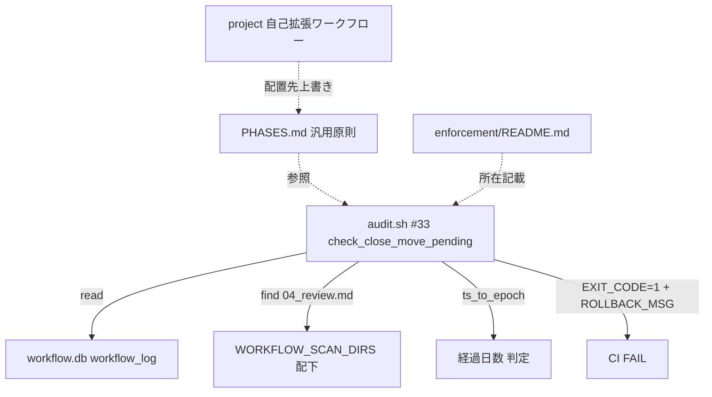
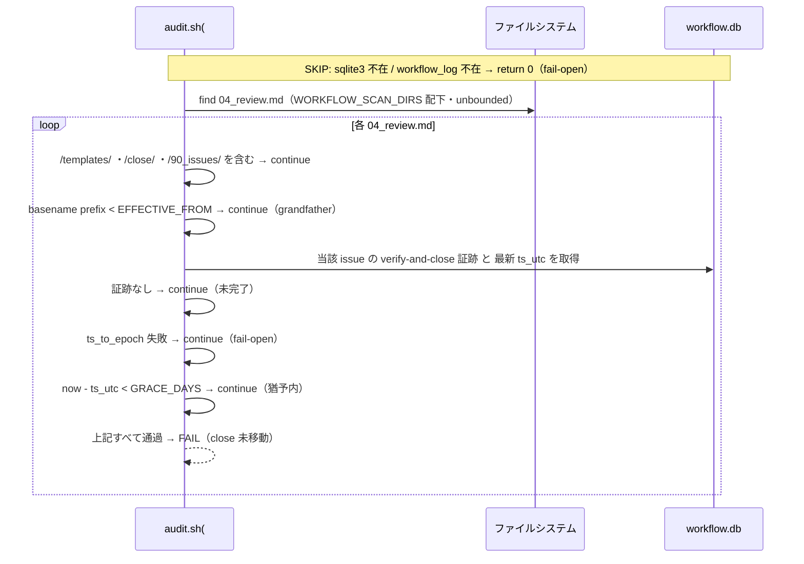
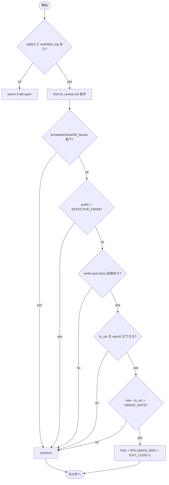

# 設計書: close 移動の監査強制と制約分離明記

**プロジェクト名**: close 移動の監査強制（audit.sh enforcement #33）と消費者/ドッグフーディング制約の分離明記
**作成日**: 2026 年 07 月 12 日
**最終更新**: 2026 年 07 月 13 日

> **重要**: **このドキュメントは常に更新**: 設計の変更や追加があった場合は、即座にこのドキュメントを更新してください。ドキュメントは「生きているドキュメント」として扱い、実装内容と常に同期させます。
>
> **用語**: [.agent-skill-chain/source/CONCEPTS.md §用語規約](../../../../../.agent-skill-chain/source/CONCEPTS.md#用語規約) を参照。

---

## 1. 設計概要

**必須**: 設計方針・原則は [.agent-skill-chain/source/spec/01\_設計原則.md](../../../../../.agent-skill-chain/source/spec/01_設計原則.md) を参照した上で本プロジェクトに適用するものを選び記載する。

### 1.1 設計方針

既存 audit.sh の #29/#31/#32 と同型の「ファイルシステム走査 ＋ workflow.db 存在照合 ＋ 発効日 grandfather」パターンを踏襲し、**新規監査項目 #33（close 移動未実施検知）を 1 責務の関数として追加する**。既存監査（#1〜#32）は一切改変せず、非交差の新番号で純増する。制約は「汎用原則（source）／本リポ具体（project）／ローカル環境固有（settings.json）」の 3 層へ責務分離して記載する（1 ファイル 1 責務・重複禁止・spec/06 の優先順位に従う）。

### 1.2 設計原則（本プロジェクトで適用するもの）

- **UNIX哲学**: 既存パターン（#32）を最小差分で流用し、小さく 1 つのことをうまくやる関数を足す。新規機構は導入しない（既存 `ts_to_epoch` ヘルパー・`WORKFLOW_SCAN_DIRS`・`ROLLBACK_MSG` を再利用）。
- **単一責務**: #33 は「verify-and-close 完了かつ close/ 未移動のトップレベル issue の検知」のみを担う。宣言（CORE）・ライフサイクル（PHASES）・具体（project）・検知（audit.sh）の責務境界を維持する。
- **CQRS**: #33 は Query（監査判定）に徹する。close 移動という状態変更（Command）は行わない（自動 `git mv` は対象外・要求 §5）。DB は読み取りのみ。
- **AIフレンドリー設計**: 既存 #32 と同じ関数構造・命名規約・SKIP ガード順で記述し、監査項目間の一貫性を保つ（コメントに ADR 参照を付す）。

---

## 2. アーキテクチャ設計

### 2.1 責務・境界・参照関係

#### 2.1.1 責務一覧

| コンポーネント | 責務（1 文） |
| -------------- | ------------ |
| `audit.sh` 関数 `check_close_move_pending`（#33・新規） | workflow.db に verify-and-close 証跡がありながら close/ 未移動のトップレベル issue を、発効日・猶予条件成立時に検知し FAIL する。 |
| `boot/CORE.md` §完了 issue の close 分離（既存・不変） | close 分離を宣言する（トリガー・完了定義の正本）。本 issue で改変しない。 |
| `workflow/PHASES.md` §完了 issue の close 移動（既存・1 文追記） | close 移動ライフサイクルを定義する。汎用原則「妥当な期間内に移動されるべきで CI（#33）で検知可能にする。具体閾値・パスは project へ委ねる」を 1 文追記する。 |
| `.agent-skill-chain/project/自己拡張ワークフロー.md` §完了 issue の close 移動（既存・追記） | 本リポの具体パス・env 既定値・移動前検証への参照・settings.json のローカル固有性を記載する（固有側）。 |
| `enforcement/README.md`（既存・追記） | 失敗条件 #33 を対応表・失敗条件一覧・差し戻し手順に追記する（番号衝突なし）。 |

#### 2.1.2 境界

- **入力**: workflow.db（`workflow_log` テーブル・読み取りのみ）、`WORKFLOW_SCAN_DIRS` 配下の実ファイル（`04_review.md` の在籍）、環境変数（発効日・猶予）。
- **出力**: FAIL 時 `EXIT_CODE=1` ＋ stderr メッセージ ＋ `ROLLBACK_MSG`。非該当・SKIP 時は無出力（fail-open）。DB・ファイルへの書き込みは一切しない。
- **他責務との境界（本 issue の範囲外）**:
  - close 移動の**トリガー・完了定義**（CORE/PHASES 宣言）は変更しない。#33 はそれらが満たされた後の「検知」のみ。
  - close 移動の**自動実行**（CI が `git mv` する）は対象外（検知に留める）。
  - **「移動前検証」手順本文**は別ブランチ `chore/close-completed-issues`（コミット `af90d4e`・main にマージ済み＝PR #11＝`c9873a7`）で対応済み。本 issue では**新規に重複記載せず参照リンクで接続**する（本作業ブランチ `docs/close-move-enforcement`（当初 `e3b9fc4` 基点）も main 取り込み済み＝HEAD `67709a2`。本設計が引用する PHASES.md/project override の行番号は取り込み後の実態と一致することを確認済み）。
  - GitHub Issue 起票ゲート（別 issue `20260712_175901_GitHubIssue起票ゲート追加`）は対象外・参照のみ。

#### 2.1.3 参照関係

- `check_close_move_pending`（#33）→ `workflow.db`（read）／ファイルシステム（read）／`ts_to_epoch`（既存ヘルパー）／`WORKFLOW_SCAN_DIRS`（既存配列）。
- `PHASES.md` §close 移動 → `audit.sh` #33（検知の所在を参照）。
- `.agent-skill-chain/project/自己拡張ワークフロー.md` → `CORE.md`／`PHASES.md`（配置先のみ上書き・定義は参照）。
- `enforcement/README.md` → `audit.sh` #33（実装の所在を記載）。
- 循環参照なし（宣言 → ライフサイクル → 具体 → 検知 の一方向）。

### 2.2 システムアーキテクチャ

- **採用パターン**: 既存 enforcement 監査パターン（FS 走査 ＋ DB 存在照合 ＋ grandfather ＋ fail-open SKIP）。
- **根拠**: spec/06 の優先順位（可読性・単一責務・仕様との整合性）に従い、既存 #29/#31/#32 と同一構造を踏襲して監査項目間の一貫性を最優先する（evidence_source: existing_code — audit.sh:787-928）。

#### 2.2.1 CQRS（Command/Query 分離）

- **Command**: なし（#33 は状態変更しない。close 移動＝`git mv` は人手・対象外）。
- **Query**: `workflow_log` からの verify-and-close 証跡・ts_utc の読み取り、ファイルシステムの close/ 在籍確認。

#### 2.2.2 アーキテクチャ図

### 2.3 コンポーネント構成

`check_close_move_pending` は `check_reviewdocs_before_implement`（#32）の直後に定義し、末尾の関数呼び出し列（audit.sh:930-935）に `check_close_move_pending` を追加する。既存 #32 と同じ SKIP ガード順・path-component 照合・grandfather 判定を用いる。明確な境界（監査＝Query のみ）と単一責務を維持する。

### 2.4 データフロー

`check_close_move_pending` は監査（Query）に徹し、イベントは発行しない（spec §イベント駆動は本 issue では非適用＝単純な同期監査で十分・spec/06「無理に導入しない」）。

### 2.5 横断設計判断（ADR）

evidence_source の分類定義は [CONCEPTS.md §外部根拠の必須化](../../../../../.agent-skill-chain/source/CONCEPTS.md#外部根拠の必須化external-anchor)（[EVIDENCE_POLICY.md](../../../../../.agent-skill-chain/source/EVIDENCE_POLICY.md) 経由）を参照する。

#### ADR-1: 検知方式＝FS 走査（04_review.md find）＋ DB verify-and-close 照合

- **コンテキスト**: 「verify-and-close 証跡あり ＋ close/ 未移動」を検知する必要がある。DB 起点（証跡 issue_path を列挙し FS 在籍を判定）と FS 起点（04_review.md を find し DB 照合）の 2 案がある。
- **検討した選択肢**: (A) DB 起点: `workflow_log` の verify-and-close 行の issue_path を列挙し、各 issue の close/ 在籍を FS で判定。issue_path は close 移動前パス（close を含まない）で記録されるため、移動済みか否かの判定が #17 相当の path-component 照合を要し複雑。 (B) FS 起点: close/ 配下を除いて `04_review.md` を find し、当該 issue に verify-and-close ログがあれば「完了かつ未移動」とみなす。既存 #29/#31 と完全同型。
- **決定**: (B) FS 起点。close/ 配下は find のガード（`*"/close/"*` → continue）で自然に除外されるため、find が拾う 04_review.md は定義上「未移動」であり、そこに verify-and-close ログがあれば「完了かつ未移動」が確定する。
- **根拠**: 既存 #29（audit.sh:792-820）・#31（:831-879）が 04_review.md を find する同型実装で、path-component 照合（`issue_path = dir OR LIKE dir/% OR LIKE %/base`）を確立済み。これを再利用でき可読性・一貫性・保守性が最大（evidence_source: existing_code — audit.sh:792-879, :911-926）。
- **帰結**: 走査対象は `04_review.md`。DB には issue_path 前方一致＋basename 末尾一致で verify-and-close を照合する。close 移動でディレクトリ名が変わっても、移動後は find 対象から外れる（close/ 配下）ため誤 FAIL しない。

#### ADR-2: 判定強度＝猶予付き FAIL（即 FAIL でも WARN でもない）

- **コンテキスト**: 検知時の強度を「即 FAIL／猶予付き FAIL／WARN」から確定する必要がある（要求 §4.1・01 §8 で設計確定事項）。
- **検討した選択肢**: (A) 即 FAIL: verify-and-close 直後・close 移動前の正常な中間状態（別 PR 運用）を誤 FAIL する。 (B) WARN のみ: CI がグリーンのままで「努力目標」の現状（要求 §1.2）を脱せず、実効的強制にならない。 (C) 猶予付き FAIL: 猶予期間内は非検知、超過後に FAIL。
- **決定**: (C) 猶予付き FAIL。
- **根拠**: 要求 §1.1 目的「CI で検知可能にする」＋効果 1「FAIL または WARN」を満たしつつ、効果 2「通常運用を誤 FAIL しない」を猶予で担保する。WARN では実効性（要求 §1.2 必要性）を欠く。誤 FAIL リスクは猶予 ＋ grandfather ＋ 各種 SKIP の三重で抑止する（evidence_source: existing_code — 要求 §4.1／observed_runtime — 本セッション自体が verify-and-close と close 移動を別 PR で行う実例）。
- **帰結**: 猶予期間内は非検知。猶予超過 ＋ 発効日以降 ＋ 未移動で FAIL（EXIT_CODE=1）。成功基準 1・2 を満たす。

#### ADR-3: 猶予機構＝DB ts_utc からの経過日数（env 閾値）＋ grandfather 発効日

- **コンテキスト**: 猶予をどう測るか（発効日のみ・コミット数・経過日数）を確定する必要がある。発効日 grandfather だけでは同日中の「verify-and-close → 翌日 close 移動」を誤 FAIL する（発効日以降のため grandfather が効かない）。
- **検討した選択肢**: (A) git コミット数猶予: git 依存で fragile、close 移動コミットの特定が困難。 (B) 経過日数猶予（DB ts_utc 基準）: workflow_log の verify-and-close 最新 ts_utc と現在時刻の差を env 閾値と比較。DB は既に必須で追加依存なし。 (C) 発効日のみ: 同日 staged 運用を誤 FAIL（要求 §4.1 が明示的に否定）。
- **決定**: (B) 経過日数猶予 ＋ (発効日 grandfather の併用)。env は `CLOSE_MOVE_GRACE_DAYS`（既定 `3`）と `CLOSE_MOVE_GATE_EFFECTIVE_FROM`（既定 `20260712_000000`）。既存 `ts_to_epoch` ヘルパー（audit.sh:137-151・GNU/BSD 両対応）で ts_utc を epoch 化し `now - vc_epoch > GRACE_DAYS*86400` で判定。
- **根拠**: DB は #29/#32 で既に必須、`ts_to_epoch` は既存資産。発効日 grandfather は #32 の `REVIEWDOCS_GATE_EFFECTIVE_FROM`（既定 `20260712_000000`）と同型（evidence_source: existing_code — audit.sh:137-151, :896, :911-916／要求 §4.2）。なお `CLOSE_MOVE_GRACE_DAYS=3` の「3 日」という具体値そのものは実測に基づく値ではなく、verify-and-close の PR と close 移動の PR を別々に出す運用（observed_runtime — 本セッションの実例）で誤 FAIL を出さないための**保守的な既定値（design_decision）**である。env で上書き可能かつ正は project 側へ委ねる（ADR-6）ため、運用実績に応じて調整する。
- **帰結**: 具体閾値はコアに既定値を持ちつつ、正は project 側へ委ねる（#32 と同じ委譲構造）。`ts_to_epoch` が解析不能（macOS で ISO8601 を扱えない等）なら SKIP（ADR-4）。

#### ADR-4: fail-open SKIP（DB/sqlite3 不在・ts 解析不能・命名非準拠）

- **コンテキスト**: 判定不能・環境差の場合の挙動を確定する必要がある（要求 §3.3 互換性）。
- **検討した選択肢**: (A) 判定不能を FAIL（安全側＝厳格）。 (B) 判定不能を SKIP（安全側＝誤 FAIL 回避＝fail-open）。
- **決定**: (B) fail-open。sqlite3 不在・workflow.db 不在・workflow_log 不在・ts_utc 解析不能・verify-and-close 証跡なしはすべて continue／return 0。
- **根拠**: 既存 #29/#32 のすべての SKIP ガードが fail-open（「誤 FAIL を絶対に出さない・偽陰性を許容」audit.sh:791, :909-910）。既存消費者ランタイムを壊さない（evidence_source: existing_code — audit.sh:793-794, :801-803, :908-916）。
- **帰結**: DB 非採用の汎用消費者・macOS は #33 が実質無効（best-effort）。実効強制は sqlite3＋GNU date の CI（本リポ）で担保する。シナリオ 5 を満たす。

#### ADR-5: top-level 近似＝`/90_issues/` 配下除外 ＋ `/close/` 除外

- **コンテキスト**: close 移動はトップレベル issue 完了時のみ（サブ issue 単独完了では移動しない・CORE/PHASES 規約）。CI がトップレベル完了を完全機械判定するのは困難（要求 §4.1）。
- **検討した選択肢**: (A) 親 issue の完了状態を DB で厳密判定（複雑・機械判定困難）。 (B) 機械判定可能な近似: `/90_issues/` を含むパス（サブ issue）を除外し、close/・templates/ も除外。残るワークフロールート直下相当の issue のみ対象。
- **決定**: (B) 近似。find 結果のパスに `/90_issues/`・`/close/`・`/templates/` を含むものを continue で除外する。
- **根拠**: 要求 §4.1・§7.1 対策が明示する近似方針。既存 #32 も 90_issues 配下を find で拾いつつ close/templates を除外する構造（evidence_source: existing_code — audit.sh:888「90_issues 配下の深い階層のサブ issue を確実に含める」／要求 §4.1）。
- **帰結**: サブ issue 単独完了は非検知（シナリオ 6）。トップレベル完了近似の誤検知は、verify-and-close 証跡の存在＋猶予＋発効日の重畳で真陽性に限定される。

#### ADR-6: 制約の 3 層分離の記載位置

- **コンテキスト**: close 移動の制約を消費者向け汎用（source）／本リポ具体（project）／ローカル固有（settings.json）へ正しく分離記載する必要がある（要求 §2.2・ストーリー 3）。
- **検討した選択肢**: (A) 全部 source に書く（過度な一般化・固有情報がコアに漏れる）。 (B) 3 層へ分離: 汎用原則＝PHASES.md ＋ enforcement/README.md（source）、具体パス・env 既定値・移動前検証参照・settings.json のローカル固有性＝`.agent-skill-chain/project/自己拡張ワークフロー.md`（project）。
- **決定**: (B) 3 層分離。source には汎用原則と汎用監査ロジック（env で発効日・猶予を受ける骨格）のみ、具体閾値・具体パスは project に置く。
- **根拠**: 既存の汎用/固有境界パターン（#32 は env 既定値をコード既定に持ち、具体は project/README で記す）と spec/06 の 1 ファイル 1 責務に整合（evidence_source: existing_code — CORE.md:135-139 が宣言のみ・具体を project へ委譲、project/自己拡張ワークフロー.md:32-61 が配置先のみ上書き）。
- **帰結**: settings.json の `close/` Read/Grep/Glob deny が**本リポのローカル環境固有（`.gitignore` の `/.claude/` により追跡外・配布物非含有・他消費者に非継承）**である旨を project 側に明記する。現在この worktree に settings.json は不在だが、記載は「存在する場合の帰属」を規定する（過度な一般化をしない）。成功基準 3・シナリオ 7 を満たす。

#### ADR-7: 監査番号＝#33（既存 #32 と非交差）

- **コンテキスト**: 既存の失敗条件番号と衝突しない新番号が必要（要求 §3.3・成功基準 4）。
- **検討した選択肢**: 既存最大は #32（enforcement/README.md 対応表）。#33 を採る。
- **決定**: #33。走査対象（#33 は 04_review.md＝完了 issue、#32 は 03_実装計画.md＝実装前レビュー）・判定内容（#33 は close 未移動、#32 は review-docs 未実行）で非交差。
- **根拠**: enforcement/README.md:242-244・:293-294 の対応表・一覧に #32 までしか存在しない（evidence_source: existing_code — enforcement/README.md 失敗条件表）。
- **帰結**: audit.sh 冒頭コメント・enforcement/README.md 対応表・失敗条件一覧・差し戻し手順に #33 行を追加する。

---

## 3. 機能設計

### 3.1 機能 1: #33 close 移動未実施検知（`check_close_move_pending`）

#### 3.1.1 概要

workflow.db に verify-and-close 証跡がありながら close/ 未移動のトップレベル issue を、発効日以降かつ猶予超過時に検知して FAIL する。

#### 3.1.2 処理フロー

#### 3.1.3 入力・出力

- **入力**: `WORKFLOW_SCAN_DIRS` 配下の `04_review.md`、`workflow_log`（command/issue_path/ts_utc）、env `CLOSE_MOVE_GATE_EFFECTIVE_FROM`・`CLOSE_MOVE_GRACE_DAYS`。
- **出力**: FAIL 時 stderr メッセージ（例: `FAIL: close 移動未実施（verify-and-close 完了だが close/ 未移動・猶予超過）: <dir>`）＋ `ROLLBACK_MSG` ＋ `EXIT_CODE=1`。非該当は無出力。

#### 3.1.4 エラーハンドリング

判定不能（DB/sqlite3 不在・ts_utc 解析不能・命名非準拠）はすべて fail-open（continue／return 0）。DB・FS への書き込みはしない。

### 3.2 機能 2: 制約の 3 層分離明記（ドキュメント）

- **source（汎用原則）**: PHASES.md §完了 issue の close 移動 に「妥当な期間内に close/ へ移動されるべきで、CI（audit.sh #33）で検知可能にする。具体閾値・具体パスは project へ委ねる」旨を 1 文追記。enforcement/README.md に #33 の対応表・一覧・差し戻し手順を追記。
- **project（本リポ具体）**: `.agent-skill-chain/project/自己拡張ワークフロー.md` §完了 issue の close 移動 に、具体パス `docs/maintainer/workflow/close/<issue>/`・env 既定値（`CLOSE_MOVE_GATE_EFFECTIVE_FROM=20260712_000000`・`CLOSE_MOVE_GRACE_DAYS=3`）・「移動前検証」への参照リンク（別ブランチ `chore/close-completed-issues`・重複記載なし）・settings.json のローカル固有性を追記。
- **local（settings.json）**: project 側の記載として、`.claude/settings.json` の `close/` Read/Grep/Glob deny は本リポのローカル環境固有（`.gitignore` `/.claude/` により追跡外・配布物非含有・他消費者に非継承）である旨を明記し、過度な一般化をしない。

---

## 4. データ設計

### 4.1 データモデル

新規テーブル・スキーマ変更なし。既存 `workflow_log`（[ledger/schema.md](../../../../../.agent-skill-chain/source/ledger/schema.md)）を**読み取りのみ**で使用する。

| 使用カラム | 用途 |
| ---------- | ---- |
| `command` | `'verify-and-close'` の証跡抽出。 |
| `issue_path` | 前方一致＋basename 末尾一致で当該 issue に照合（close 移動前パスでありうる）。 |
| `ts_utc` | 最新 verify-and-close の時刻。猶予（経過日数）判定の基準。 |

---

## 5. API 設計（環境変数・監査契約）

### 5.1 インターフェース一覧

| インターフェース | 種別 | 説明 |
| ---------------- | ---- | ---- |
| `CLOSE_MOVE_GATE_EFFECTIVE_FROM` | 入力 env | grandfather 発効日（`YYYYMMDD_HHMMSS`・既定 `20260712_000000`）。issue basename prefix が未満なら SKIP。 |
| `CLOSE_MOVE_GRACE_DAYS` | 入力 env | 猶予日数（整数・既定 `3`）。verify-and-close 最新 ts_utc から本日数以内は非検知。 |
| `check_close_move_pending` の判定結果 | 出力 | 検知時 `EXIT_CODE=1` ＋ stderr メッセージ ＋ `ROLLBACK_MSG`。非該当は無出力。 |

### 5.2 契約詳細

#### API1: `check_close_move_pending`

- **入力**: 上記 env、`WORKFLOW_SCAN_DIRS`、`workflow.db`、FS の `04_review.md`。
- **出力**: FAIL（`EXIT_CODE=1`）または pass（無変更）。
- **契約（前提）**: sqlite3 存在・workflow.db 存在・workflow_log テーブル存在。いずれか欠落で return 0（fail-open）。
- **契約違反（境界外）の扱い**: ts_utc 解析不能・命名非準拠・verify-and-close 証跡なし・templates/close/90_issues 配下は continue（誤 FAIL を出さない安全側）。任意 SQL は実行しない（固定 SELECT のみ・#17/#29/#32 と同様に issue_path をエスケープ）。

---

## 6. テスト戦略

テスト戦略の観点定義は [RULES.md §テスト戦略必須要件](../../../../../.agent-skill-chain/source/RULES.md#テスト戦略必須要件) を、BDD 形式は [TEST_BDD_FORMAT.md](../../../../../.agent-skill-chain/source/TEST_BDD_FORMAT.md) を参照する。本設計では対象ごとの割当のみ記載する。テストは既存 `test/test-audit.sh` の作法（`mktemp -d` 隔離ツリー・`sqlite3` で `workflow_log` に INSERT・audit.sh を tmp に対して実行・stderr を grep）に従い、本リポ本番の workflow.db・source は変更しない。

### 6.1 対象ごとのテスト割り当て

| 対象 | 単体 | 結合/API | E2E | クリティカル観点 | バリデーション観点 | 未達理由/補足 |
| ---- | ---- | -------- | --- | ---------------- | ------------------ | ------------- |
| `check_close_move_pending`（#33 判定） | ○ | ○（audit.sh 実行での結合） | × | 猶予超過・発効日以降・未移動で FAILすること（S1）／通常運用を誤 FAIL しないこと（S2・S3・S4） | env 不正・命名非準拠・ts_utc 解析不能で誤 FAIL しない | E2E は audit.sh の隔離実行で代替（実 CI 相当） |
| fail-open SKIP（DB/sqlite3 不在） | ○ | ○ | × | DB 非採用で SKIP（S5・既存ランタイム非破壊） | sqlite3 不在時 SKIP | 既存 #29/#32 と同型 |
| top-level 近似（90_issues 除外） | ○ | ○ | × | サブ issue 単独完了を非検知（S6） | close/templates 配下除外の重畳 | — |
| 3 層分離ドキュメント（source/project/local） | ×（doc） | ×（doc） | ×（doc） | settings.json がローカル固有と明記（S7） | 過度な一般化をしない | grep/目視で確認（審査観点） |
| 既存監査（#1〜#32）非交差 | ○ | ○ | × | #33 追加後も #32 等が退行しない | — | 既存テスト全通過で確認 |

### 6.2 監査・レビューでの確認（証跡）

本設計 §6.1 の割当表と 03_実装計画のタスク別テスト観点・BDD（01 のシナリオ 1〜7 に対応）が揃っていることを確認する。#33 追加後に `test/test-audit.sh`・`test/test-run-all.sh` が全通過することを実装フェーズで確認する。

---

## 7. UI 設計

該当なし（CLI 監査スクリプトと運用ドキュメントの変更のみ）。

---

## 8. セキュリティ設計

該当なし（外部通信・機密情報の取り扱いなし・要求 §3.2）。DB は読み取りのみ・任意 SQL 非実行。

---

## 9. 非機能要件への対応

### 9.1 パフォーマンス

既存 #29/#32 と同型の unbounded `find` ＋ sqlite3 クエリで実装し、監査全体の実行時間に体感差を出さない（要求 §3.1）。

### 9.2 可用性・互換性

sqlite3 不在・workflow.db 非採用・ts_utc 解析不能時は fail-open（SKIP）で既存消費者ランタイムを壊さない（要求 §3.3・ADR-4）。

---

## 10. 参考資料

### プロジェクトドキュメント

- [`00_要求定義.md`](./00_要求定義.md) - 要求定義
- [`01_要件定義.md`](./01_要件定義.md) - 要件定義
- [enforcement/ci/audit.sh](../../../../../.agent-skill-chain/source/enforcement/ci/audit.sh)（#29:792-820・#31:831-879・#32:891-928・`ts_to_epoch`:137-151・`ROLLBACK_MSG`:88・`WORKFLOW_SCAN_DIRS`:131-134）
- [enforcement/README.md §失敗条件と差し戻し](../../../../../.agent-skill-chain/source/enforcement/README.md)（対応表:242-244・一覧:293-294）
- [workflow/PHASES.md §完了 issue の close 移動](../../../../../.agent-skill-chain/source/workflow/PHASES.md)（:69-81）
- [boot/CORE.md §完了 issue の close 分離](../../../../../.agent-skill-chain/source/boot/CORE.md)（:135-139）
- [.agent-skill-chain/project/自己拡張ワークフロー.md §完了 issue の close 移動](../../../../../.agent-skill-chain/project/自己拡張ワークフロー.md)（:32-61）
- [spec/06_設計判断の優先順位.md](../../../../../.agent-skill-chain/source/spec/06_設計判断の優先順位.md)
- [EVIDENCE_POLICY.md](../../../../../.agent-skill-chain/source/EVIDENCE_POLICY.md)

### その他の参考資料

- 別 issue（除外・参照のみ）: `docs/maintainer/workflow/20260712_175901_GitHubIssue起票ゲート追加`
- 別ブランチ（除外・参照のみ）: `chore/close-completed-issues`（コミット `af90d4e`・移動前検証化・**main にマージ済み（PR #11＝`c9873a7`）・本作業ブランチ取り込み済み（HEAD `67709a2`）**）

---

## 11. 前のステップ

- **前**: [`01_要件定義.md`](./01_要件定義.md) - 要件定義フェーズ

---

## 12. 次のステップ

この設計書の承認後、以下を作成します：

- **次**: [`03_実装計画.md`](./03_実装計画.md) - 実装計画フェーズ

> **注意（次工程ゲート）**: 本 command（design-feature）完了後、implement-feature 着手前に **review-docs（実装前ドキュメントレビュー）を必ず経ること**（全 issue 一律・免除なし・enforcement #32）。
