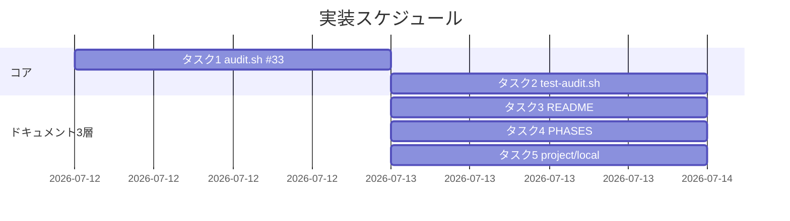

# 実装計画書: close 移動の監査強制と制約分離明記

**プロジェクト名**: close 移動の監査強制（audit.sh enforcement #33）と消費者/ドッグフーディング制約の分離明記
**作成日**: 2026 年 07 月 12 日
**最終更新**: 2026 年 07 月 13 日

> **重要**: **このドキュメントは常に更新**: 実装計画の変更・進捗更新・バグ記録があれば即座に更新する。
> **必須項目**: 「必須」欄は空欄・抽象語のみで提出しない。テスト観点・BDD は具体ケースを 1 件以上記載する。
>
> **用語**: [.agent-skill-chain/source/CONCEPTS.md §用語規約](../../../../../.agent-skill-chain/source/CONCEPTS.md#用語規約) を参照。

---

## 1. 実装概要

### 1.1 実装方針（必須）

既存 audit.sh の #32（`check_reviewdocs_before_implement`）と同型の関数 `check_close_move_pending`（#33）を最小差分で追加し、既存監査（#1〜#32）は改変しない。制約は 3 層（source＝汎用原則・project＝本リポ具体・local＝settings.json 固有）へ分離記載する。02_設計の方針・ADR に整合させる。

### 1.2 実装順序（必須: 1 件以上）

1. タスク 1: `audit.sh` に #33 関数追加・呼び出し登録・冒頭コメント追記（コア実装）。
2. タスク 2: `test/test-audit.sh` に #33 回帰テスト（01 のシナリオ 1〜6 に対応）を追加。
3. タスク 3: `enforcement/README.md` に #33 の対応表・失敗条件一覧・差し戻し手順を追記（source 層・成功基準 4）。
4. タスク 4: `workflow/PHASES.md` に汎用原則 1 文を追記（source 層）。
5. タスク 5: `.agent-skill-chain/project/自己拡張ワークフロー.md` に具体パス・env 既定値・移動前検証参照・settings.json 固有性を追記（project/local 層・シナリオ 7）。



---

## 2. タスク分解

**必須**: 各タスクに「テスト観点」（2.x.3）と「単体テスト仕様（BDD）」（2.x.4）を記載する。観点定義は 02_設計 §6・RULES・TEST_BDD_FORMAT を参照し、本書ではタスクごとの具体ケースのみ記載する。

### 2.1 タスク 1: `audit.sh` に #33 `check_close_move_pending` を追加

#### 2.1.1 概要（必須）

verify-and-close 完了かつ close/ 未移動のトップレベル issue を、発効日以降・猶予超過で検知し FAIL する関数を追加する。

#### 2.1.2 実装内容（必須: 1 件以上）

- `check_reviewdocs_before_implement`（audit.sh:891-928）直後に `check_close_move_pending()` を新規定義する（02 §2.3・ADR-1〜5）。
  - 冒頭ガード: `command -v sqlite3` 不在・`$WF_DB` 不在・`workflow_log` テーブル不在 → `return 0`（fail-open・ADR-4）。`[[ ${#WORKFLOW_SCAN_DIRS[@]} -eq 0 ]] && return 0`。
  - `local cutoff="${CLOSE_MOVE_GATE_EFFECTIVE_FROM:-20260712_000000}"`、`local grace_days="${CLOSE_MOVE_GRACE_DAYS:-3}"`。
  - `WORKFLOW_SCAN_DIRS` を巡回し `find "$PROJECT_ROOT/$_wfd" -name "04_review.md" -type f -print0` で走査（#29/#31 と同型・unbounded find）。
  - 各 04_review.md につき: `*"/templates/"*`・`*"/close/"*`・`*"/90_issues/"*` を含めば `continue`（ADR-5）。
  - basename の `^([0-9]{8})_([0-9]{6})_` prefix が `cutoff` 未満なら `continue`（grandfather・ADR-3。#32:911-916 と同型）。prefix 非準拠は grandfather 対象外（素通り）。
  - path-component 照合（#29:812・#32:917 と同型・issue_path をエスケープ）で当該 issue の verify-and-close 証跡と最新 ts_utc を取得: `SELECT ts_utc FROM workflow_log WHERE command='verify-and-close' AND (issue_path = '$dir_esc' OR issue_path = '$dir_esc/' OR issue_path LIKE '$dir_esc/%' OR issue_path LIKE '%/$base_esc' OR issue_path LIKE '%/$base_esc/%') ORDER BY ts_utc DESC LIMIT 1;`
  - 証跡（ts_utc）が空 → `continue`（未完了）。
  - `vc_epoch="$(ts_to_epoch "$vc_ts")"`（既存ヘルパー:137-151）。解析失敗（`|| continue`）→ `continue`（fail-open・ADR-4）。
  - `now_epoch="$(date +%s)"`。`(( now_epoch - vc_epoch > grace_days * 86400 ))` 成立時のみ FAIL: stderr に `FAIL: close 移動未実施（verify-and-close 完了だが close/ 未移動・猶予超過）: $dir` ＋ `echo "$ROLLBACK_MSG" >&2` ＋ `EXIT_CODE=1`。
- 末尾の関数呼び出し列（audit.sh:930-935）に `check_close_move_pending` を追加。
- 冒頭のコメント目次（audit.sh:34 付近）と各所コメントに `#33` の説明を追記（ADR-7）。

#### 2.1.3 テスト観点（必須）

**参照**: 観点定義は [02_設計 §6](./02_設計.md) および RULES・TEST_BDD_FORMAT を参照。本タスクの具体ケースのみ記載する（タスク 2 で実装）。

##### 単体（本タスクの具体ケース・必須 1 件以上）

- 発効日以降・verify-and-close 証跡あり・close/ 未移動・ts_utc が猶予日数より古い → FAIL（S1）。
- verify-and-close 証跡あり・ts_utc が猶予日数以内（現在時刻に近い）→ FAIL しない（S2）。
- basename prefix が発効日未満 → SKIP（FAIL しない・S3）。
- 当該 issue が close/ 配下に在籍（find 対象外）→ FAIL しない（S4）。
- verify-and-close 証跡なし（他 command のみ）→ FAIL しない（未完了）。

##### 結合/API（本タスクの具体ケース・該当時は必須 1 件以上）

- sqlite3 不在または workflow.db 不在で audit.sh 実行 → #33 は SKIP、全体もエラー終了しない（S5）。
- `CLOSE_MOVE_GRACE_DAYS`・`CLOSE_MOVE_GATE_EFFECTIVE_FROM` を env で上書きして閾値が反映される。

##### E2E/受け入れ（本タスクの具体ケース・未達時は理由記載）

- 隔離ツリー（mktemp -d）に対する audit.sh フル実行で #33 の FAIL/pass が期待どおり（E2E は隔離実行で代替）。

##### バリデーション（該当する場合の具体ケース）

- prefix 非準拠命名の issue で誤 FAIL しない（grandfather 判定をスキップし DB＋猶予で判定）。
- ts_utc 解析不能（不正文字列）で誤 FAIL しない（fail-open）。

#### 2.1.4 単体テスト仕様（BDD）（必須）

```gherkin
Feature: close 移動未実施検知（#33）
  Scenario: 猶予超過・発効日以降の未移動 → FAIL（S1）
    Given workflow.db に issue A の verify-and-close 証跡（ts_utc が猶予日数より古い）が存在する
    And issue A の basename prefix が発効日以降である
    And issue A のディレクトリが close/ 配下に存在しない
    When audit.sh を実行する
    Then "close 移動未実施" の FAIL を出力し EXIT_CODE=1 となる

  Scenario: 猶予期間内の未移動 → 検知しない（S2）
    Given workflow.db に issue B の verify-and-close 証跡（ts_utc が現在時刻に近い）が存在する
    And issue B のディレクトリが close/ 配下に存在しない
    When audit.sh を実行する
    Then "close 移動未実施" の FAIL を出力しない
```

**テストコード例（Given/When/Then インラインコメント必須）**

```bash
# Given: 隔離ツリーに発効日以降・close 未移動の issue A と、猶予超過の verify-and-close ログを用意
T_TREE="$(mktemp -d)"
ISS="docs/maintainer/workflow/20260801_120000_pending_close"
mkdir -p "$T_TREE/$ISS"
: > "$T_TREE/$ISS/04_review.md"
DB="$T_TREE/.agent-skill-chain/runtime/workflow.db"; mkdir -p "$(dirname "$DB")"
sqlite3 "$DB" "CREATE TABLE workflow_log (entry_id TEXT, command TEXT, issue_path TEXT, ts_utc TEXT);"
OLD_TS="$(date -u -d '30 days ago' +%Y-%m-%dT%H:%M:%SZ)"
sqlite3 "$DB" "INSERT INTO workflow_log VALUES ('e1','verify-and-close','$ISS/','$OLD_TS');"
# When: 隔離ツリーに対して audit.sh を実行
OUT="$(CLOSE_MOVE_GRACE_DAYS=3 CLOSE_MOVE_GATE_EFFECTIVE_FROM=20260712_000000 \
       bash .agent-skill-chain/source/enforcement/ci/audit.sh "$T_TREE" 2>&1 || true)"
# Then: close 移動未実施の FAIL が出る
grep -q "close 移動未実施" <<< "$OUT"
```

#### 2.1.5 依存関係

- 既存ヘルパー `ts_to_epoch`（audit.sh:137-151）・`WORKFLOW_SCAN_DIRS`（:131-134）・`ROLLBACK_MSG`（:88）に依存。

#### 2.1.6 見積もり

- **工数**: 2–3 時間
- **優先度**: 高

### 2.2 タスク 2: `test/test-audit.sh` に #33 回帰テストを追加

#### 2.2.1 概要（必須）

01 のシナリオ 1〜6 を隔離ツリーで再現し、#33 の FAIL/SKIP を検証する回帰テストを追加する。

#### 2.2.2 実装内容（必須: 1 件以上）

- `test/test-audit.sh` の #32 テスト（:398 以降）に倣い、`mktemp -d` 隔離ツリーで以下を追加する。`workflow_log` は `entry_id, command, issue_path, ts_utc` を持つ最小テーブルとして作成し、ts_utc に `date -u -d` の相対時刻を用いる。
  - S1: 発効日以降・猶予超過・close 未移動 → FAIL する。
  - S2: 猶予内（ts_utc が現在に近い）→ FAIL しない。
  - S3: prefix 発効日未満 → SKIP（FAIL しない）。
  - S4: close/ 配下に在籍 → FAIL しない。
  - S5: sqlite3 不在時の SKIP は既存の DB 依存 SKIP テストで担保されるため、workflow.db 非同梱ツリーで #33 が FAIL しないことを確認。
  - S6: `90_issues/` 配下のサブ issue（verify-and-close 証跡あり）→ FAIL しない。
  - 回帰: prefix 非準拠命名・ts_utc 不正で誤 FAIL しない。
- `test/test-run-all.sh` に本テストが含まれる（または既存 test-audit.sh 内追加のため自動的に含まれる）ことを確認。

#### 2.2.3 テスト観点（必須）

##### 単体（本タスクの具体ケース・必須 1 件以上）

- 各シナリオ（S1〜S6）で期待どおり FAIL/pass することを stderr grep で判定。
- sqlite3 不在環境では該当テストを `[SKIP]` にフォールバックする（既存 test-audit.sh の作法）。

##### 結合/API（本タスクの具体ケース・該当時は必須 1 件以上）

- 追加テストを含めて `test/test-audit.sh` および `test/test-run-all.sh` が全通過する（既存監査 #1〜#32 が退行しない・02 §6.1）。

##### E2E/受け入れ（本タスクの具体ケース・未達時は理由記載）

- audit.sh フル実行での #33 挙動を隔離ツリーで検証（E2E 相当）。

##### バリデーション（該当する場合の具体ケース）

- 該当なし（テストコード自体のバリデーションは対象外）。

#### 2.2.4 単体テスト仕様（BDD）（必須）

```gherkin
Feature: #33 回帰テスト
  Scenario: 発効日前 issue は grandfather で SKIP（S3）
    Given 隔離ツリーに basename prefix が発効日未満の close 未移動 issue C と verify-and-close ログ
    When audit.sh を隔離ツリーに対して実行する
    Then "close 移動未実施" の FAIL を出力しない

  Scenario: 90_issues 配下のサブ issue は検知対象外（S6）
    Given 隔離ツリーの 90_issues 配下にサブ issue E の 04_review.md と verify-and-close ログ
    When audit.sh を隔離ツリーに対して実行する
    Then "close 移動未実施" の FAIL を出力しない
```

**テストコード例（Given/When/Then インラインコメント必須）**

```bash
# Given: 発効日未満 prefix の close 未移動 issue と猶予超過ログ（grandfather 対象）
T3="$(mktemp -d)"; ISS3="docs/maintainer/workflow/20260101_000000_old_issue"
mkdir -p "$T3/$ISS3"; : > "$T3/$ISS3/04_review.md"
DB3="$T3/.agent-skill-chain/runtime/workflow.db"; mkdir -p "$(dirname "$DB3")"
sqlite3 "$DB3" "CREATE TABLE workflow_log (entry_id TEXT, command TEXT, issue_path TEXT, ts_utc TEXT);"
sqlite3 "$DB3" "INSERT INTO workflow_log VALUES ('e1','verify-and-close','$ISS3/','$(date -u -d '30 days ago' +%Y-%m-%dT%H:%M:%SZ)');"
# When: 発効日 20260712_000000 で audit.sh を実行（prefix 20260101 < cutoff）
OUT3="$(CLOSE_MOVE_GATE_EFFECTIVE_FROM=20260712_000000 bash .agent-skill-chain/source/enforcement/ci/audit.sh "$T3" 2>&1 || true)"
# Then: grandfather で SKIP され FAIL しない
! grep -q "close 移動未実施" <<< "$OUT3"
```

#### 2.2.5 依存関係

- タスク 1（#33 実装）に依存。

#### 2.2.6 見積もり

- **工数**: 2–3 時間
- **優先度**: 高

### 2.3 タスク 3: `enforcement/README.md` に #33 を追記（source 層）

#### 2.3.1 概要（必須）

失敗条件 #33 を対応表・失敗条件一覧・差し戻し手順に既存番号と衝突なく追記する（成功基準 4）。

#### 2.3.2 実装内容（必須: 1 件以上）

- 対応表（README.md:242-244 付近）に行追加: `| #33 close 移動未実施 | audit.sh check_close_move_pending | CI FAIL（DB 不採用・発効日前（grandfather）・猶予内・close/90_issues/templates 配下は SKIP。#32 と非交差） |`。
- 失敗条件一覧（:293-294 付近）に #33 の説明行を追加（走査対象 04_review.md・判定内容・SKIP 条件・#32 との非交差理由）。
- 差し戻し手順（:327-329 付近）に #33 の是正手順（該当 issue を `close/` へ移動し相対リンクを補正して再実行）を追加。
- audit.sh 冒頭コメント目次の説明と整合させる。

#### 2.3.3 テスト観点（必須）

##### 単体（本タスクの具体ケース・必須 1 件以上）

- README に「#33」「check_close_move_pending」の行が対応表・一覧・差し戻し手順の 3 か所に存在する（grep で確認）。
- 既存 #1〜#32 の行が変更・削除されていない（差分確認）。

##### 結合/API（該当時は必須 1 件以上）

- 該当なし（ドキュメント）。

##### E2E/受け入れ（未達時は理由記載）

- 審査（review-docs/verify-and-close）で番号衝突なし・記載内容が audit.sh 実装と一致することを目視確認。

##### バリデーション（該当する場合の具体ケース）

- 該当なし。

#### 2.3.4 単体テスト仕様（BDD）（必須）

```gherkin
Feature: 失敗条件一覧の #33 追記
  Scenario: #33 が対応表・一覧・差し戻し手順に存在する
    Given enforcement/README.md を更新した
    When "#33" と "check_close_move_pending" を grep する
    Then 対応表・失敗条件一覧・差し戻し手順の 3 か所でヒットする
```

**テストコード例（Given/When/Then インラインコメント必須）**

```bash
# Given: 更新後の README
F=.agent-skill-chain/source/enforcement/README.md
# When: #33 と関数名を検索
# Then: 3 か所以上でヒットする（対応表・一覧・差し戻し）
[ "$(grep -c 'check_close_move_pending\|#33' "$F")" -ge 3 ]
```

#### 2.3.5 依存関係

- タスク 1（関数名・SKIP 条件の確定）に依存。

#### 2.3.6 見積もり

- **工数**: 1 時間
- **優先度**: 中

### 2.4 タスク 4: `workflow/PHASES.md` に汎用原則を追記（source 層）

#### 2.4.1 概要（必須）

§完了 issue の close 移動 に「妥当な期間内に close/ へ移動されるべきで CI（#33）で検知可能にする。具体閾値・パスは project へ委ねる」旨の汎用原則を 1 文追記する（ストーリー 3・02 ADR-6）。

#### 2.4.2 実装内容（必須: 1 件以上）

- PHASES.md:69-81（§完了 issue の close 移動）に汎用原則を 1 文追記する。具体閾値・具体パス・env 既定値はここに書かず project へ委ねる（1 ファイル 1 責務・汎用/固有境界）。
- CORE.md の宣言・トリガー/完了定義は変更しない（本 issue の範囲外）。

#### 2.4.3 テスト観点（必須）

##### 単体（本タスクの具体ケース・必須 1 件以上）

- PHASES.md に「CI（audit.sh #33）で検知可能」旨と「具体は project へ委ねる」旨が記載されている（grep/目視）。
- 具体閾値・具体パス（`docs/maintainer/workflow/close/` 等）が PHASES.md に混入していない（汎用/固有境界の維持）。

##### 結合/API（該当時は必須 1 件以上）

- 該当なし（ドキュメント）。

##### E2E/受け入れ（未達時は理由記載）

- review-docs で汎用/固有境界の遵守を目視確認。

##### バリデーション（該当する場合の具体ケース）

- 該当なし。

#### 2.4.4 単体テスト仕様（BDD）（必須）

```gherkin
Feature: PHASES 汎用原則の追記
  Scenario: source に汎用原則が記載され具体は委譲されている
    Given workflow/PHASES.md を更新した
    When §完了 issue の close 移動 を確認する
    Then CI（#33）で検知可能である旨があり、具体閾値・具体パスは含まれない
```

**テストコード例（Given/When/Then インラインコメント必須）**

```bash
# Given: 更新後の PHASES.md
F=.agent-skill-chain/source/workflow/PHASES.md
# When/Then: 汎用原則があり、本リポ具体パスは含まれない
grep -q '#33' "$F" && ! grep -q 'docs/maintainer/workflow/close' "$F"
```

#### 2.4.5 依存関係

- タスク 1（#33 の存在）に論理依存。

#### 2.4.6 見積もり

- **工数**: 0.5 時間
- **優先度**: 中

### 2.5 タスク 5: `.agent-skill-chain/project/自己拡張ワークフロー.md` に具体を追記（project/local 層）

#### 2.5.1 概要（必須）

本リポの具体パス・env 既定値・「移動前検証」への参照・settings.json のローカル固有性を追記する（ストーリー 3・4、シナリオ 7、02 ADR-6）。

#### 2.5.2 実装内容（必須: 1 件以上）

- §完了 issue の close 移動（上書き）（自己拡張ワークフロー.md:32-61）に以下を追記する。
  - 具体パス: `docs/maintainer/workflow/close/<issue>/`（既存記載を参照・重複させない）。
  - env 既定値: `CLOSE_MOVE_GATE_EFFECTIVE_FROM=20260712_000000`・`CLOSE_MOVE_GRACE_DAYS=3`（本リポの具体閾値）。
  - 「移動前検証」運用への参照リンク（別ブランチ `chore/close-completed-issues`・コミット `af90d4e`・main にマージ済み＝PR #11＝`c9873a7`・本作業ブランチ取り込み済み＝HEAD `67709a2`）。**手順本文は重複記載せず参照のみ**（ストーリー 4）。
  - settings.json 固有性: `.claude/settings.json` の `close/` Read/Grep/Glob deny は**本リポのローカル環境固有**であり、`.gitignore` の `/.claude/` により**git 追跡外・配布パッケージ非含有・他消費者に非継承**である旨を明記し、「フレームワーク利用者全員が同じ制限に遭遇する」という一般化をしない（シナリオ 7）。
- **申し送り**: `chore/close-completed-issues` が PHASES.md §完了 issue の close 移動・project override §close 移動時の相対リンク補正 を「移動前検証」化しており、**main にマージ済み（PR #11＝`c9873a7`）**である事実を背景に明記する（ストーリー 4 受け入れ基準）。**本作業ブランチ `docs/close-move-enforcement` は main を取り込み済み（HEAD `67709a2`）**であり、当該 2 節は既に移動前検証化されている。本計画が引用する行番号（PHASES.md:69-81・project override:32-61）は取り込み後の実態と一致することを確認済み（HEAD=`67709a2` 時点。要求 §7.2 対策）。

#### 2.5.3 テスト観点（必須）

##### 単体（本タスクの具体ケース・必須 1 件以上）

- project 側に具体パス `docs/maintainer/workflow/close/` と env 既定値が記載されている（grep/目視）。
- settings.json の deny がローカル固有（gitignore 対象・配布物非含有・非継承）と明記され、過度な一般化がない（シナリオ 7）。
- 「移動前検証」手順本文が新規に重複記載されておらず参照リンクのみである（ストーリー 4）。

##### 結合/API（該当時は必須 1 件以上）

- 該当なし（ドキュメント）。

##### E2E/受け入れ（未達時は理由記載）

- `git ls-files .claude/settings.json` が空（追跡外）であることの実測が記載根拠と一致することを確認（evidence_source: observed_runtime）。

##### バリデーション（該当する場合の具体ケース）

- env 既定値が audit.sh のコード既定（`20260712_000000` / `3`）と一致している（タスク 1 との整合）。

#### 2.5.4 単体テスト仕様（BDD）（必須）

```gherkin
Feature: settings.json 読み取り制限のローカル固有性明記（S7）
  Scenario: 読み取り制限の帰属が誤解なく書かれている
    Given .agent-skill-chain/project/自己拡張ワークフロー.md を更新した
    When settings.json の close/ deny rule の記述を確認する
    Then 本リポのローカル環境固有（gitignore 対象・配布物非含有・非継承）である旨が明記されている
    And 「フレームワーク利用者全員が同じ制限に遭遇する」という一般化がされていない
```

**テストコード例（Given/When/Then インラインコメント必須）**

```bash
# Given: 更新後の project override とローカル追跡状態
F=.agent-skill-chain/project/自己拡張ワークフロー.md
# When: settings.json 固有性の記述と追跡状態を確認
# Then: 記述がありローカル固有（追跡外）であることが実測と一致
grep -q 'settings.json' "$F" && grep -q 'ローカル' "$F" && [ -z "$(git ls-files .claude/settings.json)" ]
```

#### 2.5.5 依存関係

- タスク 1（env 既定値の確定）・タスク 4（source 汎用原則との対）に依存。

#### 2.5.6 見積もり

- **工数**: 1 時間
- **優先度**: 中

---

## テスト観点

- #33 判定の正常系（S1: 検知）・誤 FAIL 回避（S2 猶予内・S3 発効日前・S4 close 済み・S6 サブ issue）・fail-open（S5 DB 非採用・ts 解析不能・prefix 非準拠）。
- 3 層分離ドキュメントの記載検証（S7: settings.json ローカル固有性、汎用/固有境界の維持、移動前検証の参照のみ）。
- 既存監査 #1〜#32 の非退行（`test/test-audit.sh`・`test/test-run-all.sh` 全通過）。

## 単体テスト

- `test/test-audit.sh` に #33 の隔離ツリー回帰テスト（S1〜S6 ＋ prefix 非準拠・ts 不正の回帰）を追加。既存作法（mktemp -d・sqlite3 INSERT・stderr grep・sqlite3 不在時 [SKIP]）に準拠。

## BDD

- 01 §2.2 のシナリオ 1〜7 に対応（S1=§2.1.4・S2=§2.1.4・S3=§2.2.4・S4/S5=§2.2.2・S6=§2.2.4・S7=§2.5.4）。Given/When/Then は [TEST_BDD_FORMAT.md](../../../../../.agent-skill-chain/source/TEST_BDD_FORMAT.md) に従う。

### 01 BDD シナリオ ↔ 03 テストの対応表

| 01 シナリオ | 内容 | 対応タスク・テスト |
| ----------- | ---- | ------------------ |
| S1 猶予超過・発効日以降 → FAIL | 検知の正常系 | タスク1 §2.1.3 単体 / タスク2 S1 |
| S2 猶予内 → 非検知 | 誤 FAIL 回避 | タスク1 §2.1.3 単体 / タスク2 S2 |
| S3 発効日前 → grandfather SKIP | 遡及しない | タスク2 §2.2.4 S3 |
| S4 close 済み → 非検知 | find 対象外 | タスク2 §2.2.2 S4 |
| S5 DB 非採用/sqlite3 不在 → SKIP | fail-open | タスク1 §2.1.3 結合 / タスク2 §2.2.2 S5 |
| S6 サブ issue 単独完了 → 非検知 | top-level 近似 | タスク2 §2.2.4 S6 |
| S7 settings.json ローカル固有明記 | 3 層分離 | タスク5 §2.5.4 |

---

## 3. 実装スケジュール

### 3.1 マイルストーン

| マイルストーン | 期日 | 成果物 |
| -------------- | ---- | ------ |
| コア実装完了 | 実装日 | audit.sh #33 ＋ test-audit.sh 全通過 |
| ドキュメント 3 層完了 | 実装日 | README/PHASES/project 追記・審査通過 |

### 3.2 実装フェーズ

#### フェーズ 1: コア（検知）

- **タスク**: タスク 1・タスク 2。

#### フェーズ 2: ドキュメント 3 層

- **タスク**: タスク 3・タスク 4・タスク 5。

---

## 4. テスト計画

観点・レベル・BDD 定義は 02_設計 §6・RULES・TEST_BDD_FORMAT を参照。各タスク §2.x.3 に具体ケース、§2.x.4 に BDD を記載済み。

### 4.1 テストの優先順位

- クリティカル: #33 判定（S1 検知・S2〜S6 誤 FAIL 回避）を厚くテスト。
- 回帰: 既存 audit.sh 全監査（#1〜#32）を `test-run-all.sh` で必ず回帰確認する。

---

## 5. リスク管理

### 5.1 実装リスク

- **リスク（解消済み）**: `chore/close-completed-issues`（main PR #11＝`c9873a7`）取り込み時に PHASES.md/project override の同一節でコンフリクトしうる（要求 §7.2）。
  - **対策**: 本 issue は close 移動手順本文を編集せず参照リンクで接続する。**main は取り込み済み（HEAD `67709a2`）**でありコンフリクトなく解消、行番号引用も取り込み後の実態へ是正済み。
- **リスク**: `ts_to_epoch` が macOS 等で ISO8601 を解析できず #33 が無効化される。
  - **対策**: fail-open（SKIP）で誤 FAIL を出さない設計（02 ADR-4）。実効強制は sqlite3＋GNU date の CI（本リポ）で担保する旨を README/project に明記。
- **リスク**: top-level 近似（90_issues 除外）が親完了判定を過近似し誤検知する。
  - **対策**: verify-and-close 証跡の存在＋猶予＋発効日の重畳で真陽性に限定（02 ADR-5）。

---

## 6. 参考資料

### プロジェクトドキュメント

- [`02_設計.md`](./02_設計.md) - 設計
- [`01_要件定義.md`](./01_要件定義.md) - 要件定義
- [enforcement/ci/audit.sh](../../../../../.agent-skill-chain/source/enforcement/ci/audit.sh)（#32:891-928・`ts_to_epoch`:137-151）
- [test/test-audit.sh](../../../../../test/test-audit.sh)（#32 テスト:398 以降・作法）
- [enforcement/README.md](../../../../../.agent-skill-chain/source/enforcement/README.md)（対応表:242-244・一覧:293-294・差し戻し:327-329）
- [workflow/PHASES.md](../../../../../.agent-skill-chain/source/workflow/PHASES.md)（:69-81）
- [.agent-skill-chain/project/自己拡張ワークフロー.md](../../../../../.agent-skill-chain/project/自己拡張ワークフロー.md)（:32-61）

### その他の参考資料

- 別ブランチ（除外・参照のみ）: `chore/close-completed-issues`（コミット `af90d4e`・移動前検証化・**main にマージ済み（PR #11＝`c9873a7`）・本作業ブランチ取り込み済み（HEAD `67709a2`）**）
- 別 issue（除外・参照のみ）: `docs/maintainer/workflow/20260712_175901_GitHubIssue起票ゲート追加`

---

## 7. 前のステップ

- **前**: [`02_設計.md`](./02_設計.md) - 設計フェーズ

---

## 8. 次のステップ

- **次工程ゲート（必須）**: 本 command（design-feature）完了後、implement-feature 着手前に **review-docs（実装前ドキュメントレビュー）を必ず経ること**（全 issue 一律・免除なし・enforcement #32）。本 issue は単一 issue（サブ issue 分割なし）のため 90_issues.md は作成しない。
