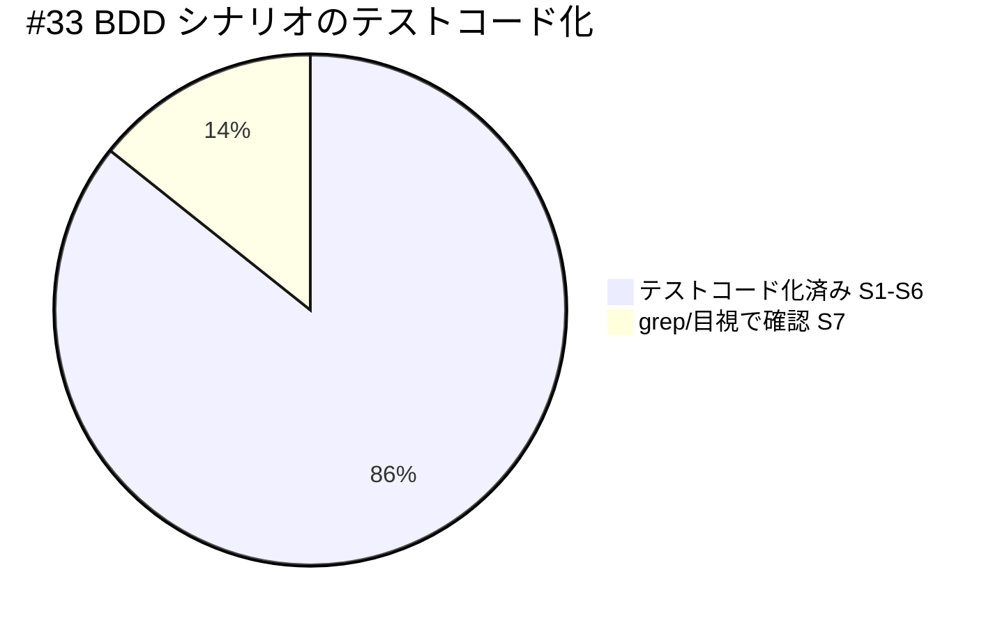

# レビュー書: close 移動の監査強制と制約分離明記

**プロジェクト名**: close 移動の監査強制（audit.sh enforcement #33）と消費者/ドッグフーディング制約の分離明記
**作成日**: 2026 年 07 月 13 日
**最終更新**: 2026 年 07 月 13 日

> **重要**: 本ドキュメントは verify-and-close（skill chain: generate-scenarios → map-coverage → review-code → review-architecture → write-workflow-log）の成果物。レビュー深度は **standard**（audit.sh への 1 関数追加＋回帰テスト＋3 層ドキュメント追記の中規模変更・[RULES.md §実行モード](../../../../../.agent-skill-chain/source/RULES.md) に基づく）。
>
> **必須参照**: [REVIEW_RULE.md](../../../../../.agent-skill-chain/source/REVIEW_RULE.md)・[REVIEW_DUAL_LENS.md](../../../../../.agent-skill-chain/source/REVIEW_DUAL_LENS.md)（敵対的観点リスト＋must-preserve リストの両方が必須）。

---

## 1. レビュー概要

### 1.1 レビュー目的（必須）

実装内容の確認 / 品質保証 / close 前最終チェック（#33 監査項目の実装が最新の 02_設計・03_実装計画に整合し、既存監査を退行させず、01 の受け入れ基準・BDD を満たすことを検証する）。

### 1.2 レビュー対象（必須）

- **実装範囲**: `enforcement/ci/audit.sh` への新規監査項目 #33（`check_close_move_pending`）追加、`test/test-audit.sh` への #33 回帰テスト（S1〜S6＋回帰 4 件）追加、`enforcement/README.md`（失敗条件表・一覧・差し戻し手順）・`workflow/PHASES.md`（汎用原則 1 文）・`.agent-skill-chain/project/自己拡張ワークフロー.md`（本リポ具体・settings.json ローカル固有性）への 3 層分離追記。
- **レビュー期間**: 2026 年 07 月 13 日 ～ 2026 年 07 月 13 日
- **レビュー担当者**: verify-and-close 委譲サブエージェント（fresh reviewer）

---

## 2. 実装内容の確認

**用語**: [CONCEPTS.md §用語規約](../../../../../.agent-skill-chain/source/CONCEPTS.md#用語規約) を参照。

### 2.1 実装完了タスク

| タスク名 | 実装内容 | 実装日 | 担当者 | ステータス |
| -------- | -------- | ------ | ------ | ---------- |
| タスク1 audit.sh #33 | `check_close_move_pending` 追加・呼び出し登録・冒頭コメント目次/失敗条件コメント追記 | 2026-07-12 | implement-feature | 完了 |
| タスク2 test-audit.sh | #33 回帰テスト（S1〜S6＋証跡なし/ts不正/prefix非準拠の回帰）を隔離ツリーで追加 | 2026-07-12 | implement-feature | 完了 |
| タスク3 enforcement/README.md | 失敗条件対応表・一覧・差し戻し手順に #33 行を追記（#32 と非交差明記） | 2026-07-12 | implement-feature | 完了 |
| タスク4 workflow/PHASES.md | §完了 issue の close 移動 に「移動の検知（汎用原則）」1 文を追記（具体は project へ委譲） | 2026-07-12 | implement-feature | 完了 |
| タスク5 project 自己拡張ワークフロー.md | 具体パス・env 既定値・移動前検証参照・settings.json ローカル固有性を追記 | 2026-07-12 | implement-feature | 完了 |

### 2.2 実装内容の詳細

#### タスク 1: audit.sh #33 `check_close_move_pending`

- **実装内容**: workflow.db に verify-and-close 証跡（最新 ts_utc）がありながら `close/` 未移動のトップレベル issue を、発効日以降かつ猶予超過時に検知して FAIL する監査関数。走査対象は `04_review.md`（#29/#31 と同型の unbounded `find`）。`/templates/`・`/close/`・`/90_issues/` 配下は `continue` で除外（ADR-5 top-level 近似）。grandfather は `CLOSE_MOVE_GATE_EFFECTIVE_FROM`（既定 `20260712_000000`）、猶予は `CLOSE_MOVE_GRACE_DAYS`（既定 `3`）で `ts_to_epoch` により経過日数判定。
- **変更ファイル**: `.agent-skill-chain/source/enforcement/ci/audit.sh`（+54 行。関数定義 946-988 行、呼び出し登録 989 行、冒頭コメント目次 35 行・失敗条件コメント 66-71 行）。
- **実装方法**: 既存 #32（`check_reviewdocs_before_implement`）の直後に定義し、末尾の関数呼び出し列に `check_close_move_pending` を追加。既存ヘルパー `ts_to_epoch`（143 行）・`WORKFLOW_SCAN_DIRS`・`ROLLBACK_MSG`・path-component 照合クエリを再利用（新規機構の導入なし）。
- **確認事項**: 判定境界は `(( now_epoch - vc_epoch > grace_days * 86400 ))`＝猶予日数「超過」でのみ FAIL。猶予日数ちょうど・以内は SKIP（README「経過日数が CLOSE_MOVE_GRACE_DAYS 以下は SKIP」と整合）。DB・FS への書き込みは一切なし（Query に徹する・CQRS）。

#### タスク 2: test-audit.sh #33 回帰テスト

- **実装内容**: `mktemp -d`（`make_min_tree`）隔離ツリーで S1〜S6 と回帰（証跡なし／ts_utc 不正／prefix 非準拠）を検証。`sqlite3` 不在時は `[SKIP]`、S5（DB 非採用）は sqlite3 ガード外で常時実行。
- **変更ファイル**: `test/test-audit.sh`（+177 行）。
- **確認事項**: 本開発リポの `.agent-skill-chain/source/`・`.agent-skill-chain/runtime/workflow.db` を変更しない隔離作法に準拠。各テストに `ユースケース`/`シナリオ` 相当のコメントと Given/When/Then インラインコメントを付与（TEST_BDD_FORMAT）。

#### タスク 3〜5: 3 層分離ドキュメント

- **source（汎用原則）**: PHASES.md 78 行に「CI（#33）で検知可能にする・具体閾値/具体パスは project へ委ねる」を追記。enforcement/README.md に #33 の対応表・一覧・差し戻し手順（3 か所）を追記。
- **project（本リポ具体）/local（settings.json）**: `.agent-skill-chain/project/自己拡張ワークフロー.md` に §close 移動未実施の検知（CI・具体値）を新設。具体パス `docs/maintainer/workflow/close/<issue>/`・env 既定値（`20260712_000000`/`3`）・移動前検証への参照（重複記載なし）・settings.json のローカル固有性（gitignore `/​.claude/` により追跡外・配布物非含有・非継承）を明記。

---

## 3. テスト結果の確認

### 3.1 単体テスト（audit 回帰）

#### テスト実行結果（実測・必須）

- **実行日**: 2026-07-13
- **実行コマンド**: `bash test/test-audit.sh`
- **テストファイル数**: 1（test-audit.sh）
- **テストケース数**: 51（うち #33 新規 9 件）
- **成功**: 51
- **失敗**: 0
- **スキップ**: 0（本環境では sqlite3 あり・GNU date あり）

**#33 個別結果（実測・全 PASS）**:

| # | ケース | シナリオ | 結果 |
| - | ------ | -------- | ---- |
| 1 | 猶予超過・発効日以降・未移動で FAIL する | S1 | PASS |
| 2 | 猶予内は FAIL しない | S2 | PASS |
| 3 | grandfather SKIP（発効日未満） | S3 | PASS |
| 4 | close 済み issue は FAIL しない | S4 | PASS |
| 5 | 90_issues 配下サブ issue は FAIL しない | S6 | PASS |
| 6 | verify-and-close 証跡なしは FAIL しない | 回帰（未完了） | PASS |
| 7 | ts_utc 解析不能は誤 FAIL しない | 回帰（fail-open） | PASS |
| 8 | prefix 非準拠命名でも猶予内は誤 FAIL しない | 回帰 | PASS |
| 9 | DB 非採用 SKIP | S5 | PASS |

```
== #33 close 移動未実施検知 ==
  [PASS] #33 猶予超過・発効日以降・未移動で FAIL する（S1）
  [PASS] #33 猶予内は FAIL しない（S2）
  [PASS] #33 grandfather SKIP（発効日未満 issue は FAIL しない・S3）
  [PASS] #33 close 済み issue は FAIL しない（S4）
  [PASS] #33 90_issues 配下のサブ issue は FAIL しない（S6）
  [PASS] #33 verify-and-close 証跡なしは FAIL しない（未完了）
  [PASS] #33 ts_utc 解析不能は誤 FAIL しない（fail-open）
  [PASS] #33 prefix 非準拠命名でも猶予内は誤 FAIL しない
  [PASS] #33 DB 非採用 SKIP（sqlite3/DB 無しで FAIL しない・S5）

== 結果: PASS=51 FAIL=0 ==
```

#### テストカバレッジ（BDD シナリオ充足）



S1〜S6 は隔離ツリーで自動テスト化済み。S7（settings.json ローカル固有性明記）はドキュメント審査項目のため grep/目視で確認（自動化困難＝ドキュメント記載検証・03 §6.1 の割当と整合）。

### 3.2 統合テスト（全スイート）

- **実行コマンド**: `bash test/run-all.sh`
- **結果**: `合計=19 PASS=14 FAIL=0 SKIP=5`（EXIT=0）。既存監査 #1〜#32 を含む全スイートが退行なく通過。

### 3.3 E2E テスト

audit.sh フル実行を隔離ツリー（`mktemp -d`）に対して行い #33 の FAIL/pass を観測（実 CI 相当）＝ **verify(ii) 実経路検証**に該当。机上確認ではなく実際の関数実行経路で S1 の FAIL 出力と S2〜S6 の非 FAIL を確認済み。

---

## 4. コードレビュー

### 4.1 コード品質

#### コードスタイル

- **リント結果**: `bash -n .agent-skill-chain/source/enforcement/ci/audit.sh` → 構文 OK（エラー 0 / 警告 0）。
- **フォーマット**: 問題なし（既存 #32 と同一の関数構造・命名規約・SKIP ガード順）。
- **型チェック**: 該当なし（bash）。

#### コードレビュー観点

| 観点 | 確認内容 | 結果 | コメント |
| ---- | -------- | ---- | -------- |
| 可読性 | 既存 #29/#31/#32 と同型・ADR 参照コメント付与 | OK | 監査項目間の一貫性が高い |
| 保守性 | 既存ヘルパー再利用・新規機構なし・1 責務 | OK | env 既定値がコードと project で二重管理（後述・要注意点） |
| パフォーマンス | unbounded find＋固定 SELECT（#29/#32 同型） | OK | 監査全体に体感差なし |
| セキュリティ | issue_path をエスケープした固定 SELECT のみ・任意 SQL なし・DB 読み取り専用 | OK | SQL インジェクション面なし |

### 4.2 指摘事項

#### 指摘 1: 03 §2.4.4 の PHASES.md 用 BDD grep スニペットが post-merge 現実と不一致（軽微・ドキュメント）

- **重要度**: 低
- **指摘内容**: 03_実装計画 §2.4.4 のテストコード例は `grep -q '#33' "$F" && ! grep -q 'docs/maintainer/workflow/close' "$F"` を PHASES.md の合格条件としているが、PHASES.md 77 行の `docs/maintainer/workflow/close/<issue>/`（**配置先**の記載）は本 issue ではなく先行マージ済みの PR #11（コミット `af90d4e`「close 移動手順を移動前検証方式へ修正」）が導入した既存行である。このため当該 grep スニペットは負条件で偽陽性となる（FAIL 判定になる）。
- **対応状況**: 対応不要と判断（設計意図＝「#33 固有の具体閾値・具体パスを PHASES に混入させない」は充足）。本 issue が追記した 78 行（汎用原則）には `CLOSE_MOVE_GRACE_DAYS`・`CLOSE_MOVE_GATE_EFFECTIVE_FROM`・`20260712_000000` 等の具体閾値が一切含まれないことを実測確認済み（`grep` ヒット 0 件）。77 行は close 移動ライフサイクル全体の配置先案内であり #33 検知の具体閾値ではない。汎用/固有境界（#33 の具体は project へ委譲）は保たれている。
- **対応方法**: 03 のスニペットは実装計画上の例示であり成果物ではないため改変しない。実質 AC（source に汎用原則・#33 固有の具体閾値なし）は別途 grep で満たすことを確認（本レビュー §5・§9 参照）。

#### 指摘 2: env 既定値のコード/ドキュメント二重管理（軽微・既存 #32 と同型）

- **重要度**: 低
- **指摘内容**: `CLOSE_MOVE_GATE_EFFECTIVE_FROM=20260712_000000`・`CLOSE_MOVE_GRACE_DAYS=3` が audit.sh のコード既定値と project 側記載の二箇所に存在する。
- **対応状況**: 対応不要（既存 #32 の `REVIEWDOCS_GATE_EFFECTIVE_FROM` も同一構造。project 側に「audit.sh のコード既定値と一致させている・変更時は両者を同時に見直す」旨が明記済み）。設計 ADR-6 の委譲構造として意図的。
- **対応方法**: 現状維持。

---

## 5. ドキュメントの確認

### 5.1 ドキュメント更新状況

| ドキュメント | 更新状況 | 確認者 | 確認日 |
| ------------ | -------- | ------ | ------ |
| [`00_要求定義.md`](./00_要求定義.md) | 更新済み（main 取り込み反映・#11 マージ済み記述） | fresh reviewer | 2026-07-13 |
| [`01_要件定義.md`](./01_要件定義.md) | 更新済み（issue_id 付与・行番号是正） | fresh reviewer | 2026-07-13 |
| [`02_設計.md`](./02_設計.md) | 更新済み（ADR-3 evidence 注記・行番号是正） | fresh reviewer | 2026-07-13 |
| [`03_実装計画.md`](./03_実装計画.md) | 更新済み（main 取り込み・行番号是正） | fresh reviewer | 2026-07-13 |

### 5.2 ドキュメントの整合性

- **実装と設計の整合性**: 整合している（`check_close_move_pending` は 02 ADR-1〜7・03 タスク 1〜5 の実装内容と逐条一致。走査対象＝04_review.md、grandfather＝`CLOSE_MOVE_GATE_EFFECTIVE_FROM`、猶予＝`CLOSE_MOVE_GRACE_DAYS`、fail-open SKIP、top-level 近似＝`/90_issues/` 除外、番号＝#33）。
- **要件と実装の整合性**: 整合している（01 の受け入れ基準・BDD S1〜S7 は §6 対応表のとおり全カバー）。
- **コメント**: 指摘 1 のとおり 03 のテスト例スニペット 1 件が post-merge 現実と負条件不一致だが、成果物・実質 AC には影響しない。

---

## 6. 受け入れ基準・BDD の確認（generate-scenarios / map-coverage）

### 6.1 01 BDD シナリオ ↔ 検証の対応表（カバレッジ）

| 01 シナリオ | 内容 | 検証方法 | 結果 |
| ----------- | ---- | -------- | ---- |
| S1 猶予超過・発効日以降 → FAIL | 検知の正常系 | test-audit.sh S33_1（実行） | 通過（PASS） |
| S2 猶予内 → 非検知 | 誤 FAIL 回避 | test-audit.sh S33_2（実行） | 通過（PASS） |
| S3 発効日前 → grandfather SKIP | 遡及しない | test-audit.sh S33_3（実行） | 通過（PASS） |
| S4 close 済み → 非検知 | find 対象外 | test-audit.sh S33_4（実行） | 通過（PASS） |
| S5 DB 非採用/sqlite3 不在 → SKIP | fail-open | test-audit.sh S33_5（実行・ガード外） | 通過（PASS） |
| S6 サブ issue 単独完了 → 非検知 | top-level 近似 | test-audit.sh S33_6（実行） | 通過（PASS） |
| S7 settings.json ローカル固有明記 | 3 層分離 | project 自己拡張ワークフロー.md を grep/目視 | 通過（記載確認済み） |

**補強（03 の回帰項目・実行）**: verify-and-close 証跡なし→非 FAIL、ts_utc 不正→非 FAIL（fail-open）、prefix 非準拠→猶予内で非 FAIL、いずれも PASS。

### 6.2 00 成功基準の充足

| 成功基準 | 検証方法 | 結果 |
| -------- | -------- | ---- |
| 基準1 #33 追加・条件成立で FAIL（テスト再現） | S33_1 で FAIL 再現・`check_close_move_pending` 定義/呼び出し確認 | 達成 |
| 基準2 猶予内/発効日前/DB非採用/close配下/templates/prefix非準拠で誤 FAIL しない | S33_2〜S33_9 全 PASS | 達成 |
| 基準3 source 汎用原則・project 具体・settings.json ローカル固有明記 | PHASES 78 行・project §新設節を grep 確認 | 達成 |
| 基準4 README 失敗条件一覧に #33 追加・番号衝突なし | README 3 か所追記・audit.sh 最大番号 #33 で #34 不在を確認 | 達成 |

### 6.3 必須成果物の欠落有無

- 00/01/02/03 いずれも `document_id`・`issue_id` を frontmatter に保持し必須セクションを満たす。本 04_review を新規作成し `document_id` を付与。**必須成果物の欠落なし**。

---

## docs 更新

（継続追随ゲート判定）[DOCS_RULES.md §継続追随ゲート](../../../../../.agent-skill-chain/source/DOCS_RULES.md) に従い判定する。

- 要否: **不要**（軽量パス）
- 対象: なし
- 理由: 本リポジトリは**システム仕様書 `docs/`（`docs/00_review/`・`docs/01_システム概要/` 等の番号付きセクション）を採用していない**。`docs/` 直下は `AI_CI_CD_VISION.md`（ビジョン文書）と `maintainer/`（ワークフロー/issue 文書）のみで、システム仕様書ツリーおよびレビュー用ディレクトリ `docs/00_review/` は不在（`ls docs/00_review` → 不在を実測確認）。したがって DOCS_RULES.md §継続追随ゲート 6.「`docs/` を採用していないプロジェクトでは本ゲートは不発動」に該当し、軽量パスで通過する。加えて本 issue の変更は audit.sh・test・enforcement/README・PHASES・project override のみで、仮にシステム仕様書があってもその記載範囲（画面/データ/機能設計）に影響しない性質の変更である（evidence_source: observed_runtime — `ls docs/`・`ls docs/00_review`）。

---

## 9. 設計・境界の確認（review-architecture）

**注意**: review-architecture の結果。責務・境界・依存が 02_設計と一致するか確認する。

### 9.1 設計の確認

- **設計原則の準拠**: 準拠（UNIX 哲学＝既存 #32 パターンの最小差分流用・新規機構なし。単一責務＝#33 は「完了かつ close 未移動の検知」のみ。CQRS＝Query に徹し状態変更なし。spec/06 の可読性・単一責務・仕様整合性を最優先）。
- **ディレクトリ構成**: 準拠（audit.sh/test/README/PHASES/project の配置は既存構造を踏襲。新規ファイルなし）。
- **命名規則**: 準拠（`check_close_move_pending` は既存 `check_*` 命名慣習と一致。env は `CLOSE_MOVE_*` で `REVIEWDOCS_GATE_*` と同型）。

### 9.2 境界・依存の確認（4 層分離）

02 §2.1 が定める 4 層の責務境界と実装の一致を確認した。

| 層 | 責務 | 実装との一致 |
| -- | ---- | ------------ |
| 宣言（CORE.md） | close 分離の宣言（トリガー・完了定義） | **不変**（本 issue で改変なし・git diff に CORE.md 含まれず）＝一致 |
| ライフサイクル（PHASES.md） | close 移動ライフサイクル＋汎用原則（CI 検知可能・具体は委譲） | 78 行に汎用原則 1 文追記・具体閾値混入なし＝一致 |
| 具体（project 自己拡張ワークフロー.md） | 本リポ具体パス・env 既定値・settings.json 固有性 | 新設節に記載＝一致 |
| 検知（audit.sh） | #33 Query 監査 | `check_close_move_pending` 実装＝一致 |

- **責務の境界**: 明確。宣言/ライフサイクル/具体/検知が分離され、#33 は検知（Query）のみ。close 移動の状態変更（`git mv`）・自動実行・トリガ/完了定義は範囲外として実装に含まれない（境界遵守）。
- **依存関係**: 一方向（宣言 → ライフサイクル → 具体 → 検知）。循環参照なし。audit.sh #33 は workflow.db（read）・FS（read）・`ts_to_epoch`・`WORKFLOW_SCAN_DIRS`・`ROLLBACK_MSG` に依存し、それらから audit.sh #33 への逆依存はない。
- **並行 issue との非交差**: 並行 issue「GitHubIssue 起票ゲート追加」（別ブランチ `docs/github-issue-gate`）は監査番号 **#34** を使用。本ブランチ `docs/close-move-enforcement` の audit.sh 最大番号は **#33** で `#34` は一切出現しない（`grep -rn '#34' .agent-skill-chain/source/ test/` → ヒット 0）。走査対象（#33=04_review.md・#32=03_実装計画.md）・判定内容でも非交差。両者はマージ後も番号衝突しない（指摘・推奨: なし）。

### 9.3 重要判断の根拠（evidence_source）

| 判断内容 | evidence_source | 備考（参照元） |
| -------- | --------------- | -------------- |
| #33 が S1 で実際に FAIL し S2〜S6 で FAIL しない | test_output / observed_runtime | `bash test/test-audit.sh` PASS=51 FAIL=0（本レビューで再実行） |
| 既存監査 #1〜#32 が退行しない | test_output | `bash test/run-all.sh` 合計=19 PASS=14 FAIL=0 SKIP=5 EXIT=0 |
| #33 と並行 #34 が非交差 | existing_code | `grep -rn '#34'` ヒット 0・audit.sh 最大番号 #33 |
| settings.json がローカル固有（追跡外） | observed_runtime | `git ls-files .claude/settings.json` が空 |
| audit.sh 構文健全性 | test_output | `bash -n audit.sh` → OK |
| 継続追随ゲート不発動（docs/ 未採用） | observed_runtime | `ls docs/00_review` 不在 |
| 実装が 02 ADR-1〜7・03 タスク 1〜5 と一致 | existing_code | `git diff` 全差分と 02/03 の逐条突合 |

---

## 10. 課題と改善点

### 10.1 発見された課題

- **課題 1**: 03 §2.4.4 の PHASES 用 BDD grep 例が post-merge 現実（PR #11 導入の close パス）と負条件不一致（§4.2 指摘 1）。
  - **影響範囲**: 実装計画の例示のみ。成果物・実質 AC・テスト結果に影響なし。
  - **対応方法**: 対応不要（例示であり成果物でない）。実質 AC は §5・§9 の別 grep で充足確認済み。
- **課題 2（範囲外・先行 close 済み issue の既存 FAIL・本 issue 非起因）**: 実リポに対し `bash enforcement/ci/audit.sh .` を実行すると、本 issue とは無関係の**先行 close 済み issue 2 件**で既存監査が FAIL する（`docs/maintainer/workflow/close/20260712_103743_release-npm削除.../03_実装計画.md` で「テスト観点未記載」、`docs/maintainer/workflow/close/20260712_120018_モデルティア選定方針.../04_review.md` で「docs 更新要否未記載」＝#5）。これらは PR #11（commit `af90d4e`）で close 済みの別 issue の成果物であり、**本 issue の working diff には含まれない**。本 issue の audit.sh 変更は #33 の純増のみで #5・テスト観点チェックを改変していないことを確認済み（`git diff` で確認）。
  - **影響範囲**: 本 issue（#33）の成果物・テスト・DoD には影響しない。ただし #5・テスト観点チェックが `close/` 配下を SKIP しない挙動（#29/#31/#32/#33 は SKIP する一方で非対称）に起因する既存の技術的負債である可能性がある。
  - **対応方法**: 本 issue の範囲外。サブエージェントは起票権限を持たないため（CLOSEOUT §起票の実行権限＝メイン限定）、**メイン（orchestrator）へ提案**として申し送る（別 issue 化の要否はメインが判断・no-drop）。本 issue の #33 実装・本 issue 自身の #31/#33 は clean。

### 10.2 改善提案

- **改善 1**: env 既定値（発効日/猶予日数）のコード/ドキュメント二重管理を将来 1 箇所へ集約（例: audit.sh を単一正本にし project は参照のみ）。
  - **効果**: 閾値変更時の同期漏れリスク低減。ただし既存 #32 と同構造のため本 issue 範囲では現状維持。

---

## 敵対的観点リスト（反証・破壊の試行）— REVIEW_DUAL_LENS §2.1

| # | 攻めた観点（境界・異常系・回帰・前提崩れ） | 結論 |
| - | ------------------------------------------ | ---- |
| A1 | 猶予境界オフバイワン（ちょうど grace_days*86400 秒で FAIL するか） | 問題なし。`> grace_days*86400` で厳密超過のみ FAIL。境界値・以内は SKIP（README「以下は SKIP」と整合） |
| A2 | grandfather 文字列比較が誤判定しないか（`[[ "$ts" < "$cutoff" ]]`） | 問題なし。同一 `YYYYMMDD_HHMMSS` 形式の辞書式比較＝時系列比較。既存 #32 と同一。S3 テストで発効日前 SKIP を実証 |
| A3 | prefix 非準拠命名で grandfather を素通りし誤 FAIL しないか | 問題なし。prefix 非準拠は grandfather 判定をスキップするが、DB 証跡＋猶予で判定。回帰テスト（S33_9）で猶予内→非 FAIL を実証 |
| A4 | ts_utc 不正文字列でクラッシュ/誤 FAIL しないか | 問題なし。`ts_to_epoch ... || continue` で fail-open。S33_8 で実証 |
| A5 | close 済み issue を二重検知しないか | 問題なし。`*"/close/"*` を find 段階で除外。移動後は find 対象外。S33_4 で実証 |
| A6 | サブ issue（90_issues 配下）を top-level と誤検知しないか | 問題なし。`*"/90_issues/"*` を除外。S33_6 で実証 |
| A7 | DB/sqlite3 不在で監査全体がエラー終了しないか | 問題なし。冒頭ガードで `return 0`（fail-open）。S33_5 で実証・run-all EXIT=0 |
| A8 | SQL インジェクション（issue_path 経由） | 問題なし。`dir_esc`/`base_esc` でシングルクォートエスケープ・固定 SELECT のみ・任意 SQL なし |
| A9 | 並行 issue #34 との番号/走査衝突 | 問題なし。#34 本ブランチ不在・走査対象/判定内容が非交差（§9.2） |
| A10 | 既存監査 #1〜#32 の退行 | 問題なし。run-all 全通過・#33 は純増（呼び出し列末尾追加のみ） |
| A11 | DB・FS への副作用（監査が状態を変える） | 問題なし。読み取り専用（CQRS）。書き込みコードなし |
| A12 | 汎用/固有境界の破れ（#33 固有の具体閾値が source に漏れる） | 問題なし。PHASES 78 行に具体 env 値なし（grep ヒット 0）。指摘 1 の 77 行は PR #11 由来の配置先案内で #33 固有閾値ではない |

**総括**: 敵対的観点で破壊できる欠陥は検出されず。不確実だった A1/A3 は実経路テストで安全側を確認済み。

## must-preserve リスト（不変条件の同定と保持確認）— REVIEW_DUAL_LENS §2.2

| # | 壊してはならない不変条件 | 保持確認 |
| - | ------------------------ | -------- |
| M1 | 既存監査 #1〜#32 の挙動・番号 | 保持（audit.sh は純増・既存関数無改変。run-all 全通過） |
| M2 | fail-open 契約（判定不能・DB 非採用は必ず SKIP＝偽陰性許容・偽陽性厳禁） | 保持（冒頭ガード＋各 continue。S5/S8/S9 で実証） |
| M3 | 消費者ランタイム非破壊（sqlite3 不在・macOS 等でも壊さない） | 保持（best-effort。DB/sqlite3/ts 解析不能で SKIP） |
| M4 | close 移動のトリガー・完了定義（CORE/PHASES 宣言）不変 | 保持（CORE.md は diff に含まれず。PHASES は原則 1 文追記のみで定義改変なし） |
| M5 | 「移動前検証」手順本文の単一正本（重複記載しない） | 保持（project は参照リンクのみ。手順本文の新規重複なし） |
| M6 | document_id 不変（既存 00〜03 の UUID を変更しない） | 保持（04 のみ新規 UUID 付与。00-03 の document_id は git diff で不変） |
| M7 | テスト隔離作法（本番 source/runtime/workflow.db を汚さない） | 保持（`mktemp -d`＋隔離ツリー。本番 DB 非改変） |
| M8 | 汎用/固有境界（具体閾値・具体パスは project、source は汎用原則のみ） | 保持（§9.2・A12） |
| M9 | 監査は Query のみ（DB/FS を変更しない） | 保持（A11） |

**継承（fresh／後続ラウンド用）**: 上記 M1〜M9 を後続レビューラウンド・fresh サブへ継承する。特に M1（既存監査非退行）・M2（fail-open）・M4（宣言不変）は #33 系の再修正時に最優先で退行確認すること。

---

## 11. システム仕様書の更新

本リポジトリはシステム仕様書 `docs/`（番号付きセクション・`docs/00_review/`）を採用していないため、[DOCS_RULES.md §継続追随ゲート](../../../../../.agent-skill-chain/source/DOCS_RULES.md) は**不発動**（軽量パス）。詳細は本書 §docs 更新（継続追随ゲート判定）に記載。更新対象・更新履歴の追記はなし。

---

## 12. レビュー結果

### 12.1 総合評価

- **実装品質**: 良好（既存 #32 パターンの最小差分・単一責務・fail-open 三重防御・SQL エスケープ）。
- **テスト品質**: 良好（S1〜S6＋回帰 4 件を隔離ツリーで自動化。実経路 verify(ii) 済み。run-all 全通過）。
- **ドキュメント品質**: 良好（3 層分離・汎用/固有境界維持・重複回避・evidence_source 明記）。指摘 1（03 例示スニペットの stale）は軽微で成果物非影響。
- **総合評価**: **合格（close 可）**。ブロッカー指摘なし。検出した指摘 1・2 はいずれも重要度「低」で対応不要と判定（理由記載済み）。

### 12.2 承認状況

- **レビュー承認者**: verify-and-close 委譲サブエージェント（fresh reviewer）
- **承認日**: 2026-07-13
- **承認コメント**: 01 受け入れ基準・BDD S1〜S7、00 成功基準 1〜4 をすべて充足。既存監査退行なし。#33/#34 非交差確認済み。継続追随ゲート不発動（軽量パス・根拠明記）。DoD 達成。commit はメイン（orchestrator）側でユーザー確認のもと実施（本レビューの範囲外）。

### 12.3 verify 証跡（(i)/(ii) 分離記載・CLOSEOUT §verify 報告様式）

- **(i) 仕様反映**: 反映済み。実装は 02_設計 ADR-1〜7・03 タスク 1〜5 と逐条一致（同期方向の判断は不要＝実装は設計どおり）。
- **(ii) 実経路検証**: **実行済み**。`bash test/test-audit.sh`（PASS=51/FAIL=0）・`bash test/run-all.sh`（PASS=14/FAIL=0/SKIP=5・EXIT=0）を本レビューで実再実行し、audit.sh の実際の関数実行経路で #33 の FAIL/pass を観測。テスト緑をモック代用の言い換えにしていない（隔離ツリーに対する audit.sh 実行＝実 CI 相当の射程）。

---

## 13. 参考資料

- [`00_要求定義.md`](./00_要求定義.md) / [`01_要件定義.md`](./01_要件定義.md) / [`02_設計.md`](./02_設計.md) / [`03_実装計画.md`](./03_実装計画.md)
- [enforcement/ci/audit.sh](../../../../../.agent-skill-chain/source/enforcement/ci/audit.sh)（#33 `check_close_move_pending`）
- [enforcement/README.md](../../../../../.agent-skill-chain/source/enforcement/README.md)（失敗条件 #33）
- [workflow/PHASES.md](../../../../../.agent-skill-chain/source/workflow/PHASES.md)（§完了 issue の close 移動・汎用原則）
- [.agent-skill-chain/project/自己拡張ワークフロー.md](../../../../../.agent-skill-chain/project/自己拡張ワークフロー.md)（§close 移動未実施の検知）
- [test/test-audit.sh](../../../../../test/test-audit.sh)（#33 回帰テスト）
- [REVIEW_DUAL_LENS.md](../../../../../.agent-skill-chain/source/REVIEW_DUAL_LENS.md) / [CLOSEOUT.md](../../../../../.agent-skill-chain/source/CLOSEOUT.md) / [DOCS_RULES.md](../../../../../.agent-skill-chain/source/DOCS_RULES.md)

---

## 14. 前のステップ

- **前**: [`03_実装計画.md`](./03_実装計画.md) - 実装計画フェーズ

---

## 15. 次のステップ

- 外部設定が不要なため 05 は作成しない（CLI 監査スクリプト＋ドキュメントの変更のみ）。
- 本レビュー合格をもって close 相当（トップレベル完了）へ進める。**commit・close 移動はメイン（orchestrator）側でユーザー確認のもと実施**（本レビュー範囲外）。close 移動時は本 issue 自体が #33 の検知対象となるため、[project 自己拡張ワークフロー.md §close 移動時の相対リンク補正](../../../../../.agent-skill-chain/project/自己拡張ワークフロー.md)（移動前検証）に従い `docs/maintainer/workflow/close/` へ移動すること。
