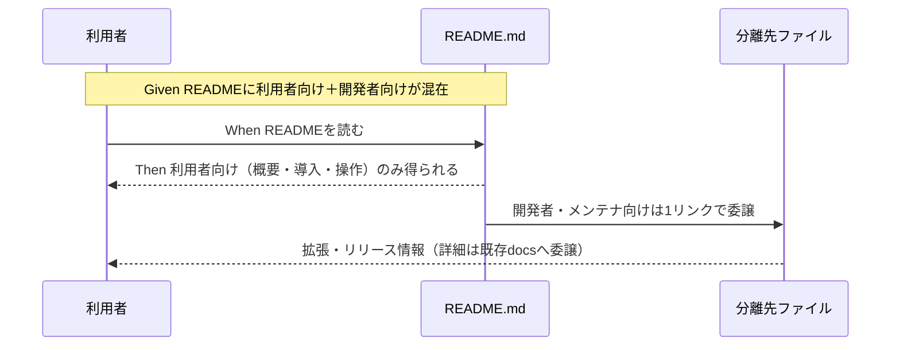

# 要件定義書: README.md の読者分離

**プロジェクト名**: README.md の読者分離
**作成日**: 2026 年 07 月 12 日
**最終更新**: 2026 年 07 月 12 日

> **重要**: **このドキュメントは常に更新**: 要件の変更や追加があった場合は、即座にこのドキュメントを更新してください。
>
> **用語**: [.agent-skill-chain/source/CONCEPTS.md §用語規約](../../../../../.agent-skill-chain/source/CONCEPTS.md#用語規約) を参照。

---

## 1. 概要

### 1.1 システム概要

リポジトリルート `README.md` を「一般利用者向けマニュアル（システム概要・インストール・アンインストール・基本操作）」に特化させ、開発者・自己拡張・メンテナ向けの情報を分離先ファイルへ移設する。詳細は既存 `docs/maintainer/` 配下文書に一本化し、分離先ファイルは要約＋リンクで委譲する。

### 1.2 用語集

| 用語 | 説明 |
| ---- | ---- |
| 利用者（採用先） | 本フレームワークを自プロジェクトへ導入して使う側。導入・アンインストール・操作が関心事。 |
| 開発者・自己拡張・メンテナ | 本フレームワーク自体を開発・拡張・リリースする側。GitHub 直接参照導線・自リポテスト・リリース手順が関心事。 |
| 分離先ファイル | 開発者・メンテナ向け情報を集約する新設ファイル。第一候補はルート `CONTRIBUTING.md`。 |
| 既存分離前例 | README が要約＋リンクを持ち詳細を別文書に一本化するパターン（`docs/maintainer/RELEASE.md`）。 |

---

## 2. 機能要件

### 2.1 ユーザーストーリー

#### ストーリー 1: 利用者が README だけで導入・操作を完結できる

- **As a** 本フレームワークを自プロジェクトへ導入する利用者
- **I want to** README を読めば、概要・インストール・アンインストール・基本操作だけが得られる状態
- **So that** 開発者・メンテナ限定の情報に惑わされず導入・運用を完結できる

**受け入れ基準**:

- README.md に「開発者・自己拡張向け」「メンテナ向け」と読者を限定した見出し（現 §71 相当・現 §163 相当）が存在しない。
- 利用者向けの操作（apm 導入・marketplace 導入・ローカル配備・アンインストール・enforcement opt-in・動作確認・入口と参照）は README.md に残っている。
- README 内に残る操作節が、開発者向け見出しの配下にネストされていない（独立した利用者向け見出しとして構成される）。

#### ストーリー 2: 開発者・メンテナが単一ファイルから拡張・リリース情報に辿れる

- **As a** 本フレームワークを拡張・リリースする開発者・メンテナ
- **I want to** 開発者向け導線（GitHub 直接参照）・自リポテスト・リリース手順の入口が単一ファイルに集約されている状態
- **So that** 拡張・リリースに必要な情報を 1 箇所から辿れる

**受け入れ基準**:

- 分離先ファイル（第一候補: ルート `CONTRIBUTING.md`）が存在し、README から 1 リンクで到達できる。
- 分離先ファイルに、現 README §71（GitHub 直接参照導線）・現 README §179-187（`npm test` / `bash test/run-all.sh` の自リポテスト）・現 README §163 相当（リリース手順の入口）が集約されている。
- 分離先ファイルは詳細を書き写さず、`docs/maintainer/RELEASE.md`・`adapters.md`・`apm-package.md`・`claude-hook-e2e.md` 等の既存詳細文書へリンクで委譲している。

#### ストーリー 3: 分割後もリンク・参照が壊れない

- **As a** ドキュメントを横断参照する利用者・開発者
- **I want to** 分割後もすべての内部リンク・参照が解決する状態
- **So that** リンク切れで情報に辿り着けない事態が起きない

**受け入れ基準**:

- `.agent-skill-chain/source/SETUP.md:191` と `docs/maintainer/claude-hook-e2e.md:14` の `../../README.md#導入プロジェクトへ配備するとき` が解決する（§導入 の見出しテキスト・アンカーが不変）。
- `docs/maintainer/RELEASE.md` 冒頭「README §リリース手順は入口リンクと要約のみを持ち…」の後方参照が、リリース手順の要約の実際の所在（README か分離先か）と整合している。
- README から `docs/maintainer/RELEASE.md`・`adapters.md`・`apm-package.md` へのリンク、および分離先ファイルからのリンクがすべて解決する（リンク切れ 0 件）。

### 2.2 BDD ユースケース

#### ユースケース 1: README の読者分離

README から開発者・メンテナ向け情報を分離し、利用者向けに特化させる。

**シナリオ 1: 開発者向け見出しが README から除去される**

```gherkin
Feature: README の読者分離
  Scenario: 開発者・メンテナ限定見出しの除去
    Given README.md に "GitHub 直接参照（開発者・自己拡張向け）" と "リリース手順（メンテナ向け）" の見出しがある
    When 読者分離の実装を完了する
    Then README.md に読者を開発者・メンテナへ限定する見出しが存在しない
    And それらの情報は分離先ファイルから辿れる
```

**シナリオ 2: 利用者向け操作が README に残る**

```gherkin
Feature: README の読者分離
  Scenario: 利用者向け操作マニュアルの残置
    Given README.md にインストール・アンインストール・enforcement opt-in・動作確認の操作手順がある
    When 読者分離の実装を完了する
    Then それらの利用者向け操作手順は README.md に残っている
    And 開発者向け見出しの配下にネストされていない
```

**処理フロー**:



#### ユースケース 2: 分離後のリンク整合検証

分割後にリポジトリ内のリンク・参照が解決することを検証する。

**シナリオ 1: 外部からの README §導入 参照が保たれる**

```gherkin
Feature: 分離後のリンク整合
  Scenario: README 導入節への外部リンクの維持
    Given SETUP.md と claude-hook-e2e.md が "../../README.md#導入プロジェクトへ配備するとき" を参照している
    When 読者分離で README の §導入 を残置する
    Then 当該アンカーが解決し続ける（見出しテキストを変更しない）
```

**シナリオ 2: RELEASE.md の後方参照が整合する**

```gherkin
Feature: 分離後のリンク整合
  Scenario: RELEASE.md 後方参照の整合
    Given RELEASE.md 冒頭が "README §リリース手順は入口リンクと要約のみを持つ" と記述している
    When リリース手順の要約を分離先ファイルへ移設する
    Then RELEASE.md の後方参照が要約の実所在と整合するよう更新されている
    And RELEASE.md の詳細は重複コピーされていない
```

### 2.3 ビジネスルール

- README・分離先・コメントには**現在の事実のみ**を書き、歴史的経緯（「README から移した」等）を残さない。
- 詳細は既存 `docs/maintainer/` 文書へ一本化し、分離先ファイルは要約＋リンクとする（DRY）。
- 本 issue のスコープは READMEの読者分離のみ。並行 2 issue（GitHubIssue 起票ゲート・close 移動監査強制）の内容は統合しない（参照のみ）。

---

## 3. 非機能要件

### 3.1 パフォーマンス要件

- 該当なし（ドキュメント再編のみ）。

### 3.2 セキュリティ要件

- 該当なし。

### 3.3 ユーザビリティ要件

- 利用者は README のみで導入・アンインストール・基本操作を完結できる。
- 開発者は分離先ファイル 1 つを起点に拡張・リリース情報へ辿れる。

### 3.4 可用性要件

- 該当なし。

---

## 4. 外部インターフェース要件

### 4.1 API 要件

- 該当なし（CLI・スクリプト・enforcement ロジックは変更しない）。

### 4.2 データ形式要件

- 成果物は markdown。frontmatter・見出し構成はプロジェクトの既存文書慣習に従う。

---

## 5. 制約事項

- 変更範囲は README.md の縮小、分離先ファイルの新設、リンク補正に限る。
- 既存 `docs/maintainer/RELEASE.md` は維持し、内容を重複させない。
- README §導入 の見出しテキスト・アンカー（`#導入プロジェクトへ配備するとき`）を変更しない。
- 分離先ファイルの最終決定（ルート `CONTRIBUTING.md` 新設を第一候補とする）と、操作節（サブコマンド表・ピン留め・アンインストール・enforcement opt-in）を README のどの見出し配下に再配置するかは、設計フェーズ（02）で確定する。
- `.agent-skill-chain/project/自己拡張ワークフロー.md` の名前空間・git 追跡ルールに従う。

---

## 6. 参考資料

### プロジェクトドキュメント

- [`00_要求定義.md`](./00_要求定義.md) - 要求定義
- 既存分離前例: [`docs/maintainer/RELEASE.md`](../../../RELEASE.md)

### その他の参考資料

- 対象: リポジトリルート `README.md`（全 207 行、精読済み。切り分け一覧は 00 §2.3）

---

## 7. 前のステップ

この要件定義書は、以下のドキュメントを基に作成されています：

- **前**: [`00_要求定義.md`](./00_要求定義.md) - 要求定義フェーズ

---

## 8. 次のステップ

この要件定義書の承認後、以下のドキュメントを作成します：

- **次**: [`02_設計.md`](./02_設計.md) - 設計フェーズ
