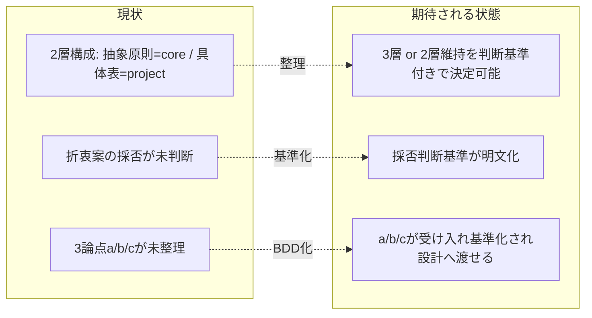

# 要求定義書: Claude 向け推奨デフォルト・モデルティア表を source/platforms/claude/ に置く折衷案の評価

**プロジェクト名**: モデルティア推奨デフォルトの platforms 配置検討
**作成日**: 2026 年 07 月 12 日
**最終更新**: 2026 年 07 月 12 日

> **重要**:
>
> - 本 issue は「実装」ではなく **設計判断（採否と配置方針）の意思決定**を目的とする検討 issue である。妥当性判断・具体設計は次の設計フェーズ（design-feature）で行う。本 00/01 は、その判断を可能にするための目的・前提・制約・受け入れ基準（BDD）を確定することを責務とする。
> - **このドキュメントは常に更新**: 検討の進展に応じて即時更新する。
>
> **用語**: [.agent-skill-chain/source/CONCEPTS.md §用語規約](../../../../../.agent-skill-chain/source/CONCEPTS.md#用語規約) を参照。

---

## 要求定義の全体像

```mermaid
mindmap
  root((Claude推奨ティア表のplatforms配置検討))
    目的・背景
      折衷案の提示
      既存前例(settings.enforce/plugin.json)
      現状の2層構成
    機能要件
      採否判断基準の明文化
      3論点(a/b/c)の受け入れ基準化
    非機能要件
      PF中立性の維持
      陳腐化耐性
      1ファイル1責務
    制約条件
      モデル名の世代交代リスク
      本リポADRと一般推奨の性質差
      優先順位規約の整合
    除外要件
      実際の表内容の確定
      実装(ファイル作成)
    成功基準
    リスクと対策
      具体モデル名焼き込み
      規約の多重化
```

**注意**: マインドマップは全体像把握用。詳細は各節に記載する。

---

## 1. 目的・背景

### 1.1 目的（必須）

Claude 向け推奨デフォルト・ティア表を platforms/claude に置く折衷案の採否と設計方針を確定する。

### 1.2 背景

- **現状の課題**:
  - 現状のモデルティア選定は **2 層構成**である。
    - `.agent-skill-chain/source/MODEL_SELECTION.md`: プラットフォーム中立な**抽象原則のみ**（適用条件・ティア明記義務・品質ゲート最上位固定・裁量禁止・形骸化防止）。§汎用/固有境界で「**対応表はコアに置かない（PF 中立性）**」と明記している。
    - `.agent-skill-chain/project/MODEL_TIER_TABLE.md`: 本リポジトリ固有の**具体ティア対応表**（設計・レビュー・監査=opus、実装=原則 sonnet・複雑箇所のみ opus 格上げ、書記=haiku、fable 原則禁止）。ADR に基づく運用判断を含む。
  - ユーザー（本リポメンテナ）から折衷案の提案があった: 「**Claude をオーケストレータとして使う場合の推奨デフォルトのモデルティア表を、`source/platforms/claude/` に置く**のはどうか」。
  - この提案は、現行 2 層（抽象原則＝コア / 具体表＝project）に対し「**Claude プラットフォーム条件付きの推奨デフォルト**」という第 3 の置き場所を追加する構造変更を含みうる。採否・妥当性・設計方針が未確定である。

- **必要性**:
  - `source/platforms/claude/` には既に `settings.enforce.json`・`plugin.json` という「**Claude プラットフォーム固有の具体設定をコアに置く**」前例がある。折衷案はこの前例と整合するかを確認する必要がある。
  - Claude を採用する消費者が、project 側の対応表を自作しなくても最低限のティア選定ができる「推奨デフォルト」を配布物に同梱できると利便性が上がる可能性がある。ただし後述の懸念（陳腐化・性質差・規約整合）と両立するかを要求レベルで検証しなければ、判断できない。

### 1.3 期待される効果（必須: 1 件以上）

- **効果 1**: 折衷案を「採用する／しない／条件付き採用」のいずれかに、明文化された判断基準に基づいて決定できる状態になる（○/× 判定可能）。
- **効果 2**: 採用する場合に、後続の設計フェーズ（design-feature）が、下記論点 a/b/c（MODEL_SELECTION 汎用/固有境界節の更新方針・優先順位規約の 3 層整合・ADR 運用判断との切り分け）を具体設計へ落とせる粒度の受け入れ基準が揃う。
- **効果 3**: 本検討が既存 ADR（「モデルティア選定方針の project 化」issue の opus 要否先行検討＝ADR-1）の**拡張なのか別個の独立決定なのか**が明確になり、二重管理・矛盾を回避できる。

**現状と期待される状態の比較**:



---

## 2. 機能要件

### 2.1 既存機能の維持（該当する場合）

- 既存の 2 層構成（`MODEL_SELECTION.md` 抽象原則 / `MODEL_TIER_TABLE.md` 具体表）の**現行の意味論を壊さない**こと。特に MODEL_SELECTION §3 品質ゲート最上位固定・§裁量禁止・§汎用/固有境界の「対応表はコアに置かない」原則は、本検討の結論がどうであれ維持または明示的に更新される。
- project 側優先の規約（`.agent-skill-chain/project/README.md` §優先順位）を維持する。

### 2.2 新規機能要件

本 issue で新規に「確定」する成果物は、実装物ではなく**判断成果物**である。

1. **折衷案の採否判断基準**: 「`source/platforms/claude/` に推奨デフォルト・ティア表を置く」ことを採用/不採用/条件付き採用と決めるための、○/× で評価できる判断基準の一覧。
2. **論点 a の判断基準**: `source/MODEL_SELECTION.md` の「汎用/固有境界」節の記述をどう更新するか（またはしないか）の判断基準。
3. **論点 b の判断基準**: `project/README.md` の優先順位規約（project > source の 2 層）を、3 層（project > platforms/claude > MODEL_SELECTION の抽象原則）にどう整合させるか、または 2 層のまま扱うかの判断基準。
4. **論点 c の判断基準**: `source/platforms/claude/` に置く推奨デフォルトの中身が「本リポ固有の ADR 運用判断」と重複・矛盾しないための切り分け方針。

---

## 3. 非機能要件

### 3.1 パフォーマンス

- 該当なし（ドキュメント／規約構造の設計判断であり、実行性能要件はない）。

### 3.2 セキュリティ

- 該当なし。

### 3.3 互換性

- **マルチプラットフォーム中立性**: 本パッケージは Claude Code / Cursor / Gemini / Copilot / Codex を対象とする。折衷案は「Claude プラットフォーム条件付き」であるため、`source/platforms/claude/` という**プラットフォーム限定の名前空間**に置く限り PF 中立性の原則（MODEL_SELECTION §汎用/固有境界「対応表はコアに置かない」）に反しない、という見立ての妥当性を検証すること。
- 既存前例（`platforms/claude/settings.enforce.json`・`plugin.json`）が「Claude 固有の具体値をコアに置く」を許容している事実との整合を保つこと。

### 3.4 保守性

- **1 ファイル 1 責務・重複禁止**（spec/01 設計原則、UNIX 哲学）: 同じ対応表・原則を複数箇所に重複記載しない。置くと決めた場合も、既存の `MODEL_TIER_TABLE.md`（本リポ固有）と `platforms/claude`（一般推奨デフォルト）の責務が重ならないこと。
- **陳腐化耐性**: 具体モデル名・世代を焼き込む箇所を最小化し、世代交代時の更新点が局所化されていること。

---

## 4. 制約条件

> 本節は、ユーザーとの会話で既に共有済みの懸念点 (1)〜(4) を**前提・制約として明示**する。設計フェーズはこれらを所与として妥当性を判断する。

### 4.1 技術的制約

- **制約 (1) モデル名・世代の陳腐化リスク**: モデル名・世代は頻繁に変わる（例: Opus 4.8 / Sonnet 5 / Haiku 4.5 のような世代交代が既に発生）。**コア（配布パッケージ本体）に具体モデル名を焼き込むと、世代交代のたびにパッケージ本体の更新・再配布が必要**になり、メンテナンスコストと陳腐化リスクを負う。`source/platforms/claude/` はコア（配布物）の一部であるため、ここに具体モデル名を置く場合はこのリスクを負う。推奨デフォルトを「モデル名」ではなく「ティア（役割→抽象ティア）」水準に留める等の緩和策の要否を判断すること。

### 4.2 既存システムとの互換性

- **制約 (3) PF 中立性の既存設計原則**: `MODEL_SELECTION.md §汎用/固有境界` は「**対応表はコアに置かない（PF 中立性）**」と明記している。`source/platforms/claude/` はコア（配布物）内だが**プラットフォーム限定の名前空間**であるため、そこに Claude 条件付き推奨デフォルトを置くこと自体は「無条件でコアに対応表を置く」こととは異なる、という見立てがある。この見立てが MODEL_SELECTION §汎用/固有境界の文言と矛盾しないか、矛盾するなら同節の**文言更新が必要か**を受け入れ基準で検証すること（論点 a）。
- **制約 (4) 優先順位規約の多層化**: `project/README.md` は「**project > source の 2 層**」の優先順位規約を明記している。`source/platforms/claude/` に推奨デフォルトを追加すると、優先順位が **3 層（project > platforms/claude > MODEL_SELECTION の抽象原則のみ）** になりうる。対応表が無い場合（platforms/claude も project も無い環境）は「ティア選択不能環境として扱う（＝ランタイムのデフォルト動作、MODEL_SELECTION §1 適用条件）」との接続をどう整合させるかを判断すること（論点 b）。

### 4.3 運用ポリシー上の制約（性質差）

- **制約 (2) 本リポ固有 ADR と一般推奨の性質差**: 現行 `MODEL_TIER_TABLE.md` の内容（fable 原則禁止、実装は sonnet デフォルト＝正確には「opus 要否を先行判定し不要時のみ sonnet」、複雑時 opus 格上げ）は、本リポジトリ固有の **ADR-1（「モデルティア選定方針の project 化」issue の 00 §7 ADR-1。当該 issue は既に close 済みで `docs/maintainer/workflow/close/` 配下にあり、環境の deny 設定により本検討からは直接参照不可。ADR の要旨は `MODEL_TIER_TABLE.md` の本文＝「opus 要否先行検討は非裁量の選定手順」に転記されている）** に基づく運用判断である。これは「**Claude を使う採用先なら誰でも当てはまる汎用推奨**」とは性質が異なる可能性がある。両者（本リポ固有の運用ポリシー vs. Claude 採用先一般への推奨デフォルト）を要求・設計レベルで**区別**すること（論点 c）。

### 4.4 本検討と既存 ADR の関係（拡張か独立か）

- 本検討は、ADR-1（opus 要否先行検討＝ティア選定を非裁量化する運用判断）そのものを変更する issue ではない。本検討は「**推奨デフォルトを配布物のどこに、どの抽象度で置くか**」という**配置・境界の決定**であり、ADR-1 の「どのティアを選ぶか」という**選定ロジックの決定**とはスコープが異なる。両者が拡張関係にあるのか独立の決定なのかを、成果物内で明示すること（区別を曖昧にしない）。

---

## 5. 除外要件

- **実際の推奨デフォルト表の中身（具体的な役割→ティア対応の値）を確定すること**は本 issue のスコープ外とする（設計フェーズ以降で、採用と決まった場合に確定する）。本 issue は「置くか・どこに・どの抽象度で・既存規約とどう整合させるか」の**判断基準と要件**を確定するに留める。
- **ファイル作成・実装（`source/platforms/claude/` への新規ファイル追加や既存ファイルの編集）**は本 issue のスコープ外。
- MODEL_TIER_TABLE.md の ADR-1（選定ロジック）自体の再設計はスコープ外。

---

## 6. 成功基準（必須: 1 件以上）

- **SC-1**: 折衷案（`source/platforms/claude/` に Claude 向け推奨デフォルト・ティア表を置く）を採用/不採用/条件付き採用と判断するための○/× 評価可能な判断基準が 01 に列挙されている。
- **SC-2**: 論点 a（MODEL_SELECTION §汎用/固有境界の更新要否の判断基準）が、01 の受け入れ基準および BDD シナリオとして記載されている。
- **SC-3**: 論点 b（project/README.md 優先順位規約を 2 層のまま扱うか 3 層へ整合させるかの判断基準。対応表不在時の「ティア選択不能環境」フォールバックとの接続を含む）が、01 の受け入れ基準および BDD シナリオとして記載されている。
- **SC-4**: 論点 c（platforms/claude の一般推奨デフォルトと MODEL_TIER_TABLE の本リポ固有 ADR 運用判断の切り分け方針）が、01 の受け入れ基準および BDD シナリオとして記載されている。
- **SC-5**: 制約 (1)〜(4) が前提として 00 に明記され、01 の BDD の Given に反映されている。
- **SC-6**: 本検討と ADR-1 の関係（拡張か独立か）を判断する基準が示されている。

---

## 7. リスクと対策

### 7.1 技術的リスク

- **リスク**: 具体モデル名を `source/platforms/claude/` に焼き込み、世代交代のたびに配布物本体の再リリースが必要になる（制約 (1)）。
  - **対策**: 設計フェーズで、推奨デフォルトを「モデル名」ではなく「役割→抽象ティア」水準に留める案、または具体モデル名を project/ 側の解決に委ねる案を比較評価する。本 00/01 では、その比較を可能にする受け入れ基準（陳腐化耐性の評価軸）を用意する。

### 7.2 スケジュールリスク

- **リスク**: 規約が 2 層→3 層に増えることで、優先順位の解釈揺れ・二重管理が生じ、以後の運用コストが増える（制約 (4)）。
  - **対策**: 論点 b を受け入れ基準として明文化し、対応表不在時のフォールバック（MODEL_SELECTION §1 適用条件）との接続を BDD で固定する。「置くと決めた場合、優先順位規約 project/README.md を更新する」ことを完了条件に含める。

### 7.3 設計整合リスク

- **リスク**: platforms/claude の一般推奨デフォルトと MODEL_TIER_TABLE の本リポ固有 ADR 運用判断が重複・矛盾し、1 ファイル 1 責務・重複禁止に反する（制約 (2)・論点 c）。
  - **対策**: 論点 c を受け入れ基準として明文化し、「一般推奨（採用先共通）」と「本リポ固有運用（ADR に基づく）」の責務境界を設計フェーズで確定できる評価軸を用意する。

---

## 8. 参考資料

### プロジェクトドキュメント

- [.agent-skill-chain/source/MODEL_SELECTION.md](../../../../../.agent-skill-chain/source/MODEL_SELECTION.md) - モデルティア選定の抽象原則（正本）。特に §汎用/固有境界・§1 適用条件・§3 品質ゲート最上位固定。
- [.agent-skill-chain/project/MODEL_TIER_TABLE.md](../../../../../.agent-skill-chain/project/MODEL_TIER_TABLE.md) - 本リポ固有の具体ティア対応表。ADR-1（opus 要否先行検討）の要旨を含む。
- [.agent-skill-chain/project/README.md](../../../../../.agent-skill-chain/project/README.md) - project > source の優先順位規約。
- [.agent-skill-chain/source/platforms/README.md](../../../../../.agent-skill-chain/source/platforms/README.md) および [.agent-skill-chain/source/platforms/claude/](../../../../../.agent-skill-chain/source/platforms/claude/)（`settings.enforce.json`・`plugin.json`）- 「Claude 固有の具体設定をコアに置く」既存前例。
- [.agent-skill-chain/source/EFFORT_POLICY.md](../../../../../.agent-skill-chain/source/EFFORT_POLICY.md) - ティアとは別次元の reasoning effort 原則（同型のコア/固有境界パターンの参考）。
- [.agent-skill-chain/source/spec/01_設計原則.md](../../../../../.agent-skill-chain/source/spec/01_設計原則.md)・[06_設計判断の優先順位.md](../../../../../.agent-skill-chain/source/spec/06_設計判断の優先順位.md) - 1 ファイル 1 責務・可読性最優先・再利用より責務明確さ。

### その他の参考資料

- 既存 ADR: 「モデルティア選定方針の project 化」issue（close 済み、`docs/maintainer/workflow/close/` 配下、環境 deny により本検討からは直接参照不可。要旨は MODEL_TIER_TABLE.md に転記済み）。

### 発端（参照元）

- 本 issue の発端は、ユーザー（本リポメンテナ）との会話上の折衷案提案「Claude をオーケストレータとして使う場合の推奨デフォルト・モデルティア表を `source/platforms/claude/` に置くのはどうか」および、それに伴い共有された懸念点 (1)〜(4)。

---

## 9. 次のステップ

この要求定義書の承認後、以下を作成します：

- **次**: [`01_要件定義.md`](./01_要件定義.md) - 要件定義フェーズ（本 00 の目的・制約を受け、ユーザーストーリー・受け入れ基準・BDD を確定する）。
- その後: 設計フェーズ（design-feature）で折衷案の妥当性判断と、採用時の具体設計（配置・抽象度・規約更新）を行う。
